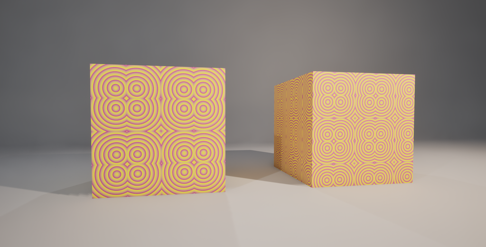
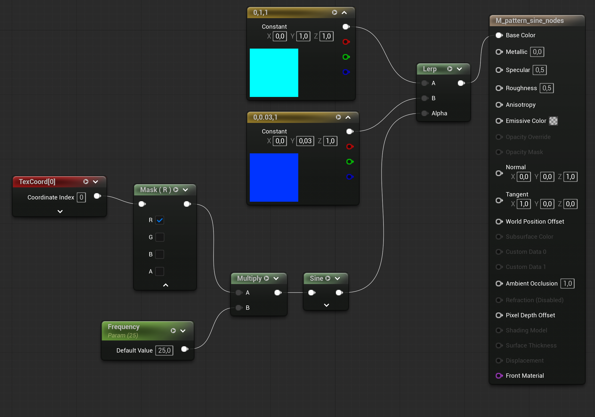
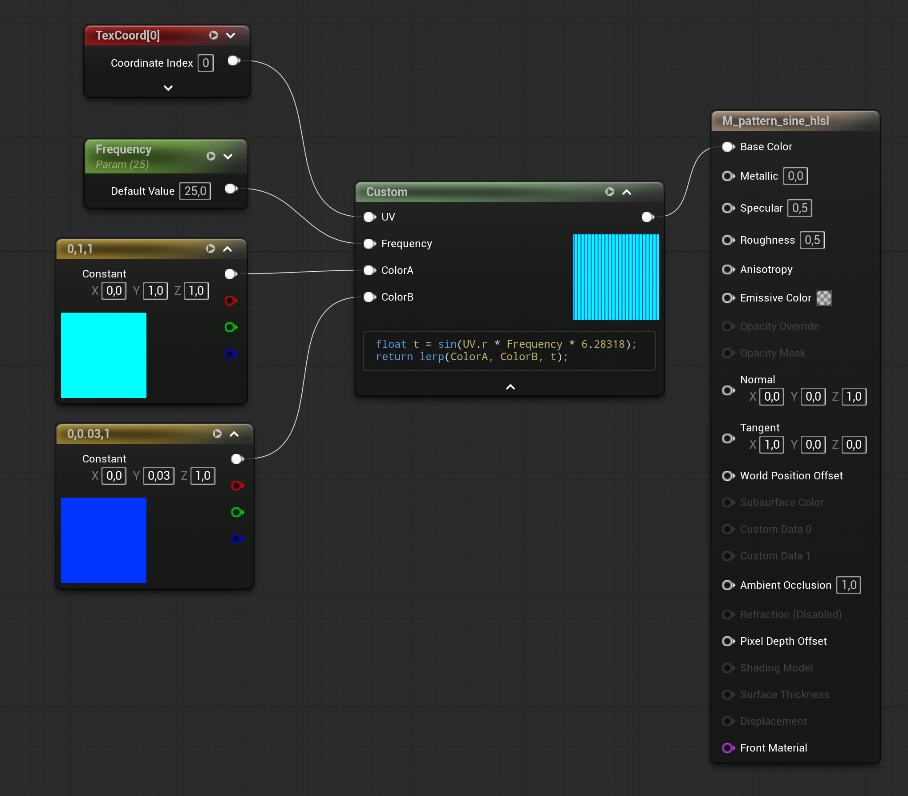
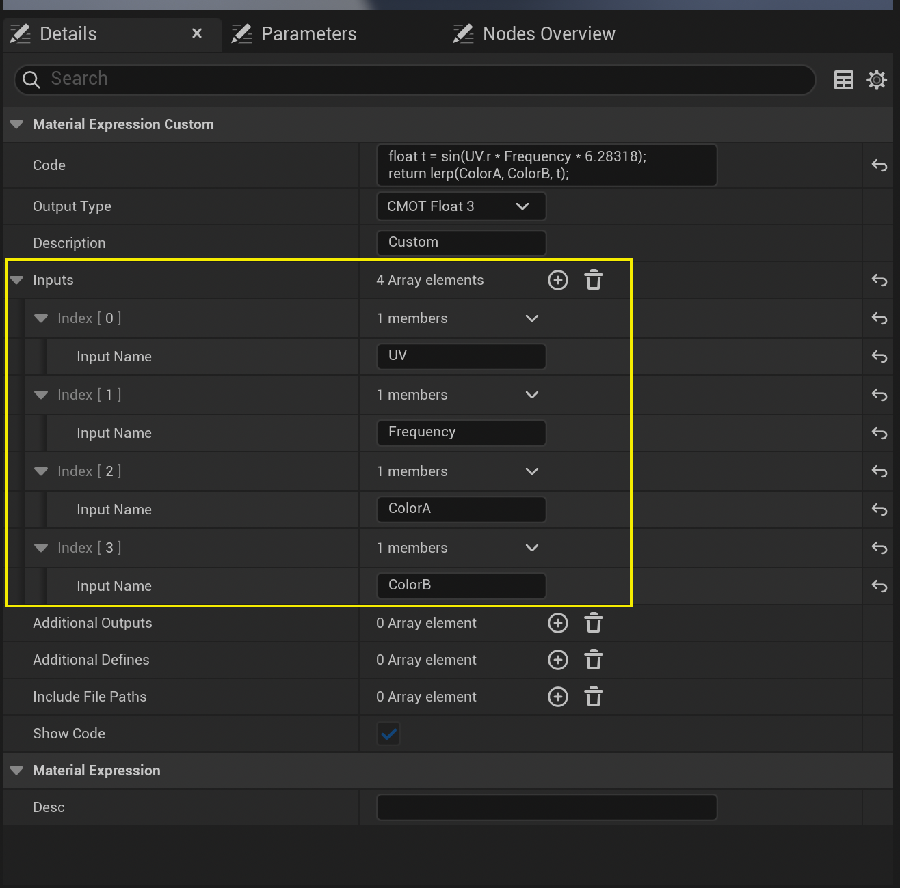
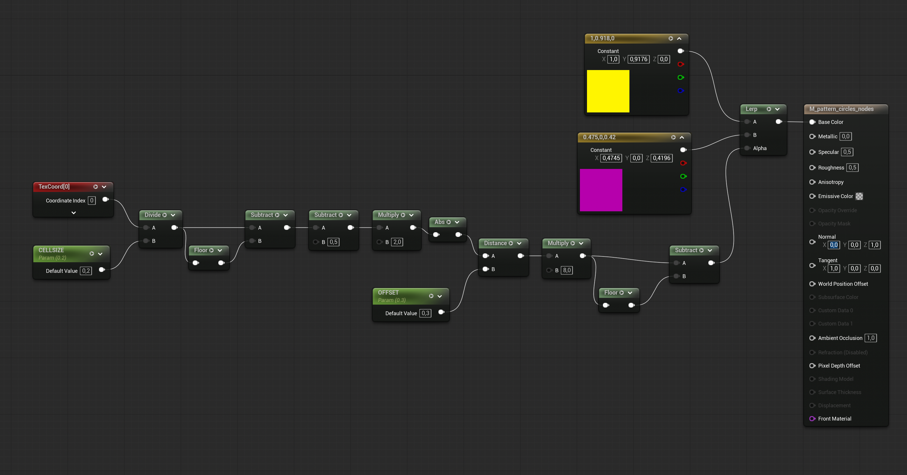
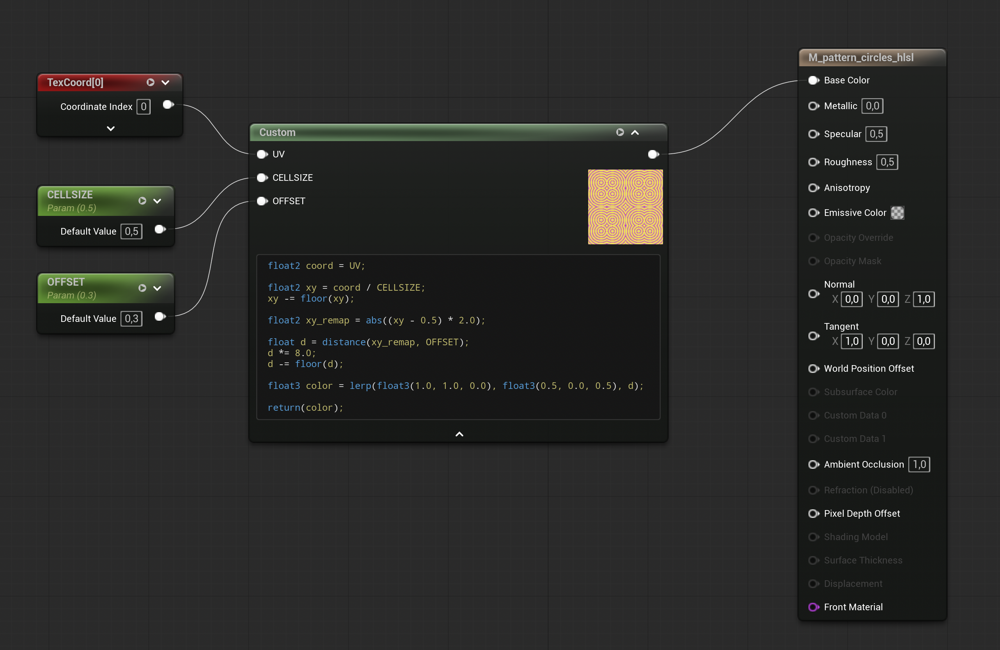
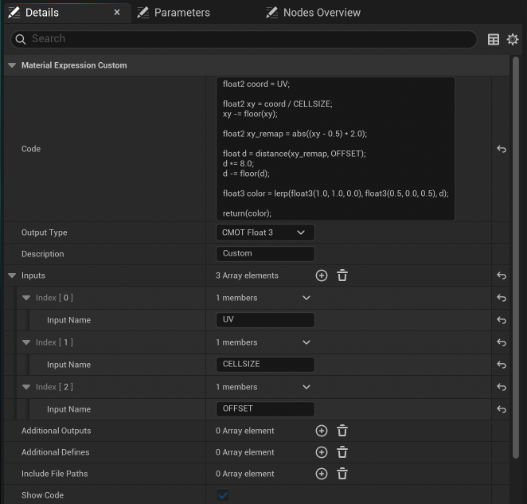

**Procedural Generation and Simulation**  

Prof. Dr. Lena Gieseke \| l.gieseke@filmuniversitaet.de  

# Introduction To Working with Materials in Unreal Engine

* [Creating a Material](#creating-a-material)
* [The Material Editor](#the-material-editor)
* [Setting Up a Node Graph](#setting-up-a-node-graph)
    * [TexCoord](#texcoord)
    * [ScalarParameter](#scalarparameter)
* [Using a Custom HLSL Node](#using-a-custom-hlsl-node)
* [The Circle Pattern Example](#the-circle-pattern-example)

*Written for Unreal Engine 5.7 (menu labels and panel names may differ slightly between versions).*

> The Unreal Documentation, Unreal's AI Assistant, Claude and Claude Code assisted with the setup and text generation of this tutorial. All concepts, structures, and content decisions were made solely by me. Generated material was reviewed and thoroughly adjusted. However, documentation and tools should be considered reference material throughout.

---

A material in Unreal Engine defines how a surface looks. It controls properties such as color, roughness, metalness and emission. Materials are built visually in the Material Editor using a node graph, without writing material code by hand — unless you choose to 🤓.

  
*This scene includes three materials: one for each cube (looking almost the same) and one for the background.*

## Creating a Material

In the **Content Browser** at the bottom of the screen, right-click in any folder and choose **Material**. A new asset appears. Rename it (I like to use the naming convention of having the prefix `M_` for material names) and double-click it to open the Material Editor.

## The Material Editor

The Material Editor shows a large canvas with one pre-existing node in the center. That node is the **result node** and represents the final surface. It has named input pins such as `Base Color`, `Metallic`, `Roughness`, `Emissive Color` and `Normal`. Whatever you connect to a pin controls that visual property.

The **Details** panel on the left shows the properties of whichever node is currently selected. The toolbar at the top contains **Apply** and **Save**. Click **Apply** after every change to compile the material and see the updated result on the preview sphere.

## Setting Up a Node Graph

Right-click anywhere on the empty canvas to open the node search. Type the name of a function or data type to find it. For example, add a `Constant3Vector` (a fixed RGB color) and connect its output pin to the `Base Color` input of the result node. Click **Apply** to see the color appear on the preview.

Connect nodes by clicking and dragging from an output pin to an input pin. A colored line confirms the connection.

### TexCoord

The `TextureCoordinate` node outputs the UV coordinates of the surface point currently being shaded. UV coordinates are a two-component value where U runs horizontally and V runs vertically across the surface, both in the range 0..1. They tell the material where on the surface each pixel sits, and are the starting point for any procedural pattern or texture lookup.

Right-click the canvas and search for `TexCoord` to add one. Its output pin carries a two-component vector you can feed into texture samples, math nodes, or the input pins of a `Custom` node.

The node has a `UTiling` and `VTiling` property in the **Details** panel that scale the UV range, effectively tiling the pattern across the surface (we also have a CELLSIZE parameter in our pattern and adjusting it leads to a similar effect).

### ScalarParameter

To expose a value as a parameter use a `ScalarParameter` node (this has additional benefits, we will come back to). Right-click the canvas, search for `ScalarParameter` and add it. In the **Details** panel, set a `Parameter Name` and a `Default Value`. The name becomes the handle used to change the value from a material instance, the level editor, or Blueprints at runtime. Connect its output pin wherever you would otherwise use a fixed number.

*An exemplary basic striped pattern with sine:*
  

*On a Side Note:* `sine` ouputs values from -1..1 and you might want to remap that to 0..1 by adding `* 0.5 + 0.5` as operation after the sine output.

## Using a Custom HLSL Node

The `Custom` node lets you write HLSL code directly inside the material graph. Right-click the canvas and search for `Custom` to add it. Select it and look at the **Details** panel.

`Code` is a text field where you write your HLSL expression. The code must end with a `return` statement that matches the output type you set below.

`Inputs` is an array in the **Details** panel. Press the `+` button to add an entry for each value the node needs to receive. Give each entry a `Name` — that name becomes both the input pin label and the variable name you reference in the code.

The typical wiring connects a `TexCoord` node to the `In` pin and the output of the `Custom` node then connects to whichever input of the result node you are targeting, e.g. `Base Color`.

After wiring everything up, click **Apply** and **Save**.

*The same exemplary basic striped pattern with sine:*
  

The Custom node's Details:  
  

*On a Side Note:* Unreal's built-in `Sine` node does not operate in radians. It treats its input as a normalized cycle, where an input value of 1.0 equals one full sine wave. Then it internally multiplies the input by 2π. HLSL's `sin()` function expects radians, where one full cycle requires an input of 2π (≈ 6.28).

So with the same frequency value of 10:
* Node version computes sin(2π × 10 × UV) — 10 full stripes across the 0..1 UV range
* HLSL version computes sin(10 × UV) — only about 1.6 stripes across the same range (since 10 ÷ 2π ≈ 1.6)

To produce the same result in HLSL as with a sine node, multiply the input by 2π: `return sin(UV.r * Frequency * 6.28318);`

## The Circle Pattern Example

Node version:

HLSL version:

