**Procedural Generation and Simulation**  

Prof. Dr. Lena Gieseke \| l.gieseke@filmuniversitaet.de  

## Tutorial - Dancing Cubes

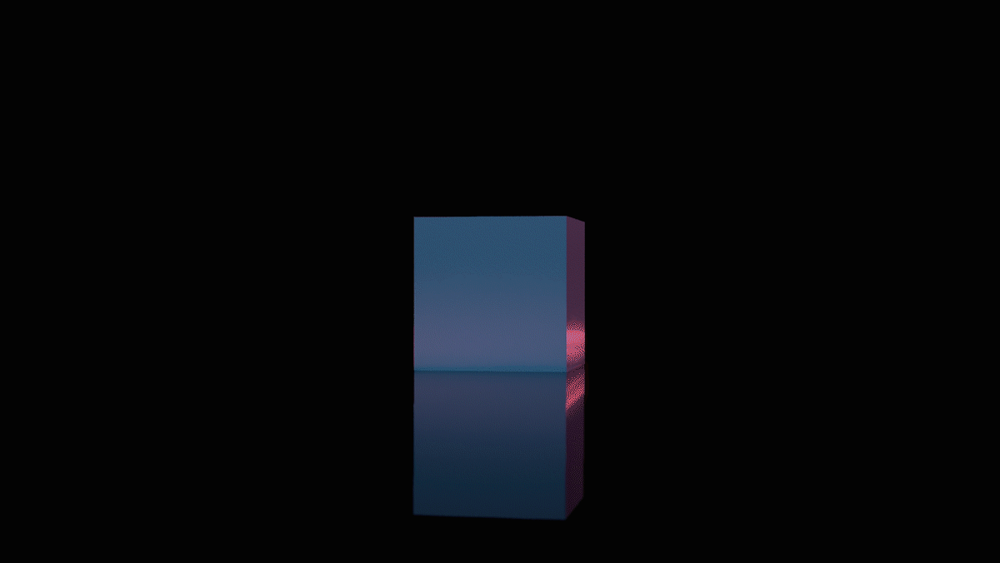

The tutorial is based off of the [Unreal Engine 5 - Generative Motion Graphics / VFX](https://www.udemy.com/course/ue5-procedural-vfx-motion-graphics/) tutorial by Yu Fujishiro and is further developed and presented by Sylvia Rybak and Lena.

Most of the explanations are copied from or based on the official [Unreal Documentation](https://dev.epicgames.com/documentation/en-us/unreal-engine). 

* [Tutorial - Dancing Cubes](#tutorial---dancing-cubes)
* [The Algorithm](#the-algorithm)
    * [Scene and Component Setup](#scene-and-component-setup)
        * [Scene](#scene)
        * [Blueprint Class](#blueprint-class)
    * [Event BeginPlay](#event-beginplay)
    * [Event Sequence](#event-sequence)
        * [The Split Event](#the-split-event)
        * [The Spawn Event](#the-spawn-event)
    * [Check for the First Cube](#check-for-the-first-cube)
    * [The Jumping](#the-jumping)
        * [Enabling Physics](#enabling-physics)
    * [Generations](#generations)
    * [The Spawning Event](#the-spawning-event)
* [Performance Optimization](#performance-optimization)
    * [Optional Physics Constraints For Parent](#optional-physics-constraints-for-parent)
* [The Material](#the-material)
    * [Material Network](#material-network)
    * [Parametrization](#parametrization)
* [Adjusting Material Parameters in the Blueprint](#adjusting-material-parameters-in-the-blueprint)
    * [Shifting Hue](#shifting-hue)
    * [Spiking Emission](#spiking-emission)
* [Particles](#particles)

## The Algorithm

The main idea of the algorithm is to create new instances of the Blueprint class, we are creating, meaning recursion. Specifically, this means that for each cube, we are generating eight new instances of that cube.

The main steps are as follows:

* We manually set up a start cube with 8 locators that define the position and scale for the new cube instances. A cube is evenly split into eight smaller cubes that together make up the large cube. Splitting means spawning new instances of the Blueprint class.
* Before we start the spawning, we
    * Check whether it is the first cube; if not, we add a physics impulse for a little jump
    * Increment a counter for how often we have already split the cubes (called *generations*) and stop the recursion if we reached a certain number of generations
* For the spawning, 
    * We take the position and rotation of the locators and half the size of the parent.
    * We transfer the generation counter to the newly spawned class for being able to still track the number of generations.

We will also create a dynamic material and a Niagara system for some fanciness.

### Scene and Component Setup

#### Scene

There is no specific scene needed beyond a floor. You can choose a scene that already has one set up or create one from scratch. 

#### Blueprint Class

First we create a Blueprint, which is where we build up the system and which we are going to instance for our simulation. Blueprints are used to define object-oriented (OO) classes or objects in the engine. Blueprint Classes are basically assets that allow us to easily add functionality on top of existing gameplay classes. 

* Right click in the **Content Browser** and select *Blueprint Class*. Select *Actor* as the parent class. An Actor is simply an object that can be placed or spawned in the world. The object we have created is currently empty and we will fill it up with meshes as interactions in the next steps.

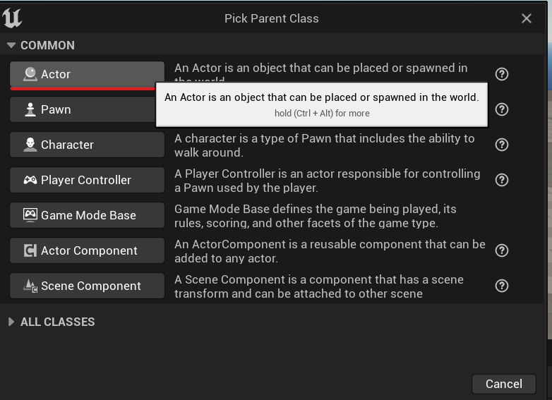

* Open the Blueprint and add a Cube. This adds a cube mesh, which is now contained within our Actor.

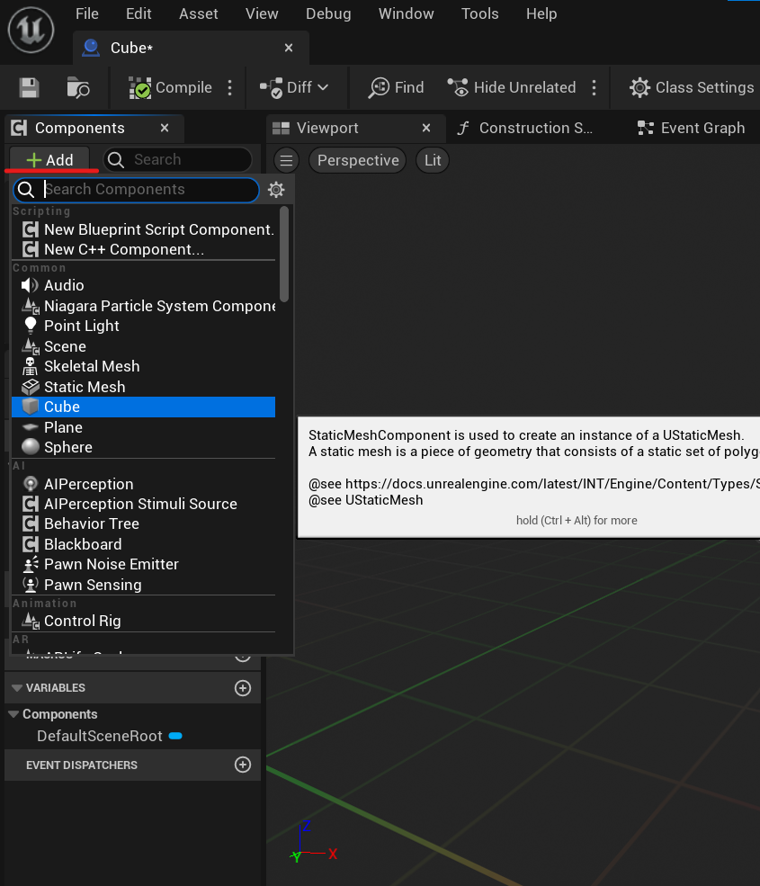

* You’ll see that the cube is automatically parented (or attached) to the **Default Scene Root** Component, making it what we refer to as a “child” component. Actors have a designated single Scene Component as "root", meaning that the Actor's world location, rotation, and scale are drawn from that Component. The components, which are the children of the Scene Root inherit basic parameters of the parent.

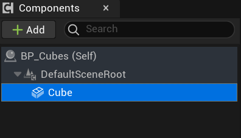

Drag the Cube component over the Default Scene Root. 

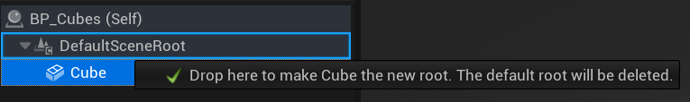

This changes the Cube into the Scene Root like in the image below. This means that the cube is now the Scene Root and the central component of the actor. 

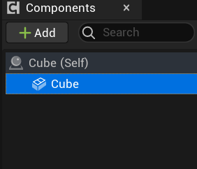

* Let's make the cube a bit bigger. Within the Cube component (Brick icon), e.g., set the scale of the cube to 1.2 on every axis. 

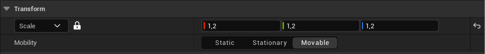

* Change the view to Top Perspective. 

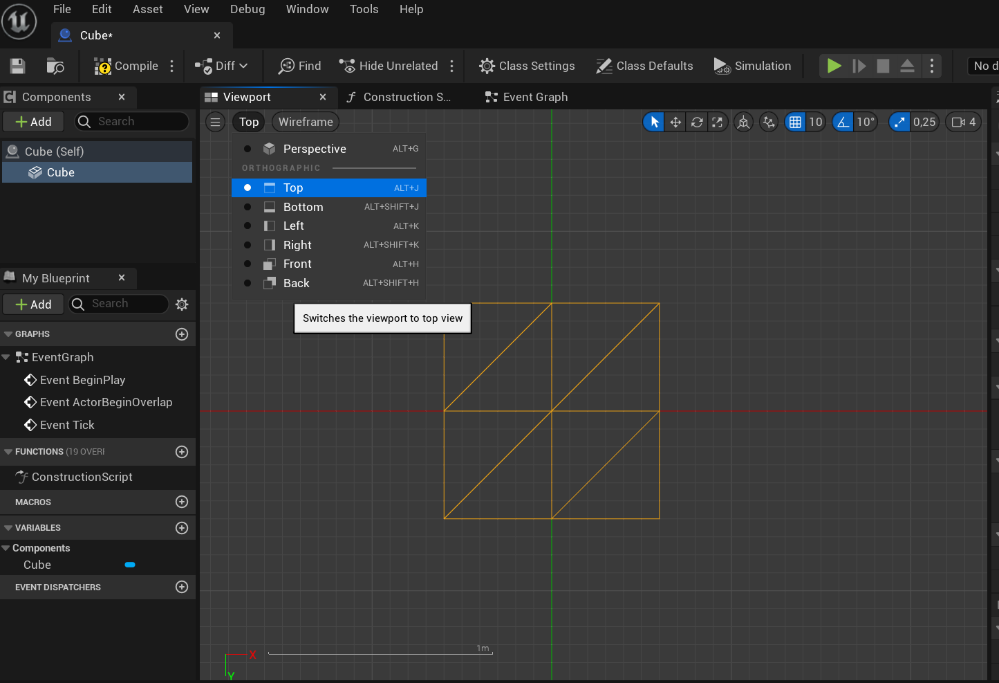

* Now we create locators from which the smaller cubes spawn. We place them in the middle of each cube subdivision like in the image below. 

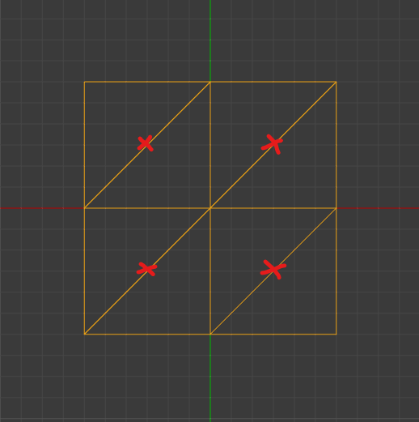

To do this add a [Scene Component](https://docs.unrealengine.com/4.27/en-US/ProgrammingAndScripting/ProgrammingWithCPP/UnrealArchitecture/Actors/Components/) to your blueprint (with the Add button like the Cube before). Name it 'p1'.

A Scene Component supports location-based behaviors that do not require a geometric representation. Their position is defined by a transform class, which contains the location, rotation, and scale of the Component. It is currently just an empty vessel, which we will use to anchor the position from which the smaller cubes will spawn. 

* Grab and move the **Scene** component to the position of one of the points from the drawing above. We have to make sure that its location is **exactly** in the middle, so make sure the location values are precise and the number are rounded. 

The scale should be set to 0,5 on all axes, this means that the cubes that spawn in this position will inherit the scale of the Scene component and be half the size of the original cube.

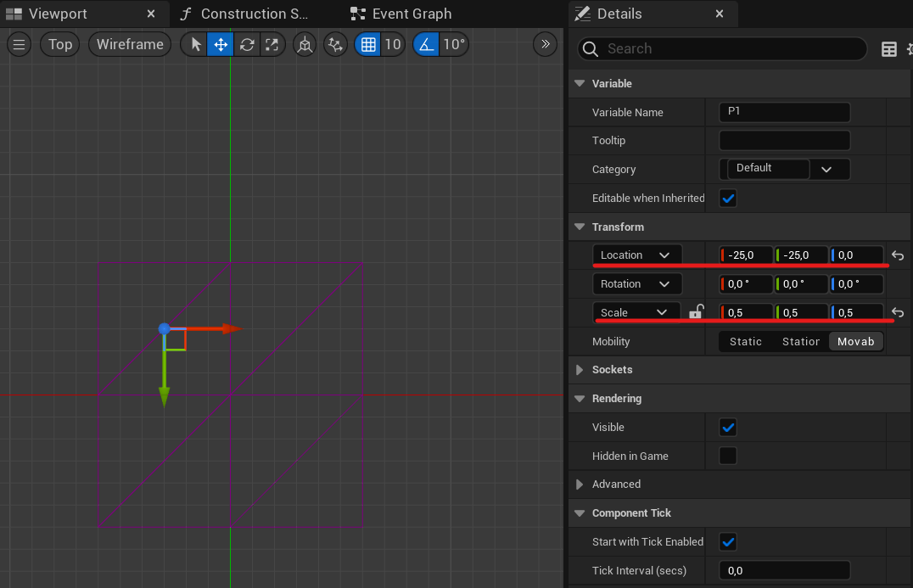

* Following the previous step, create 3 more Scene components (P2, P3, P4) and place them in the remaining 3 positions on the cube, following the sketch in Step 6. Make sure their scale is also set to 0.5. As of now, the scale has no meaning here, but later, when we spawn new cubes from this component, we are going to use this relative scale as factor for scaling the children cubes. 

* Next, copy these 4 components (Cmd/Ctrl+C) and paste them (Cmd/Ctrl+V) underneath. 

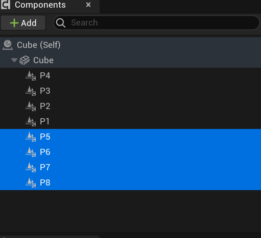

* While you still have **all** the 4 new components selected, change their Z value to -25. This will move the 4 anchor points down on the Z axis, so that the cube is divided 3-dimensionally and not just from the top. 

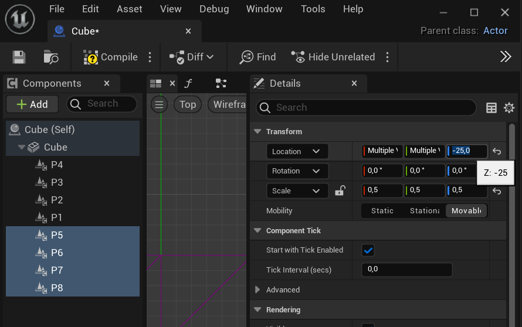

* Compile the Blueprint. 

### Event BeginPlay

We are using the EventGraph for our simulation. The EventGraph of a Blueprint contains a node graph that uses events and function calls to perform actions in response to gameplay events associated with the Blueprint. This is used to add functionality that is common to all instances of a Blueprint. This is where interactivity and dynamic responses are setup. 

* Open the **Event Graph** tab in this Blueprint and delete all other nodes except for the *Event BeginPlay*. This node triggers events within the actor as soon as one starts playing the game. Next, drag and drop all of the newly created Scene Components (P1-P8) into the node area. 

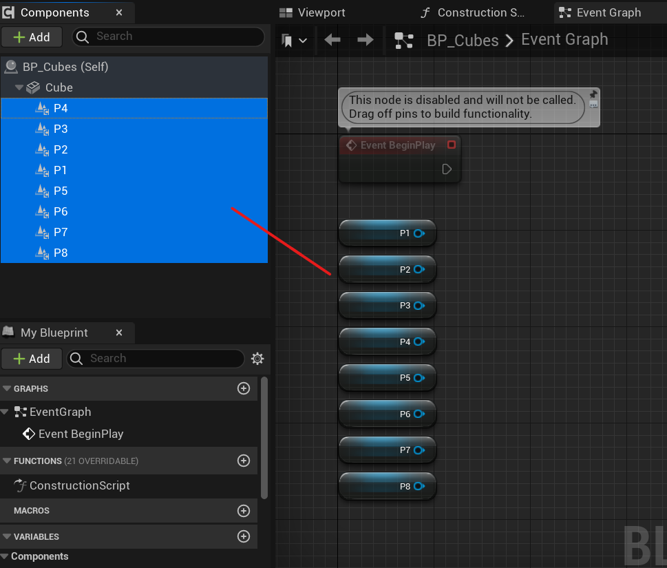

* For being able to iterate over all scene components, we combine them in an array node. Add a *Make Array* node and plug in all the components. You can add pins by pressing the *Add pin* button on the right side of the node. Now all the components are all stored together in a single array.

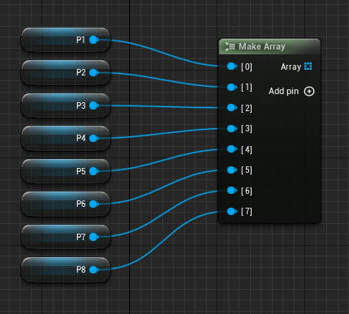

* Blueprints also use [Variables](https://docs.unrealengine.com/5.1/en-US/blueprint-variables-in-unreal-engine/) to hold a value or reference an Object or Actor in the world. On the bottom left, you can see the **Variables** section, where variables which reference the components (P1-8) have been automatically created. Duplicate one of the component variables and rename it to 'Spawn Location' or add a new one of the type Scene Component - Object. For the 'Spawn Location' variable, change the variables Container Type to *Array* in the **Details** browser on the right, by pressing the downwards facing arrow on the right side of *Variable Type* . 

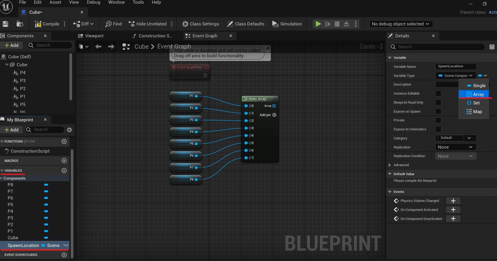

* Drag and drop your new variable into the graph and select *Set Spawn Location*. Get is used for retrieving a value and Set is used for assigning a value to variables. We want to assign the values from our newly created array to our new variable. 
As we plug in the Array node, the variable now holds all the values of the array we have just created. 
Connect the *Event BeginPlay* to this node as well.

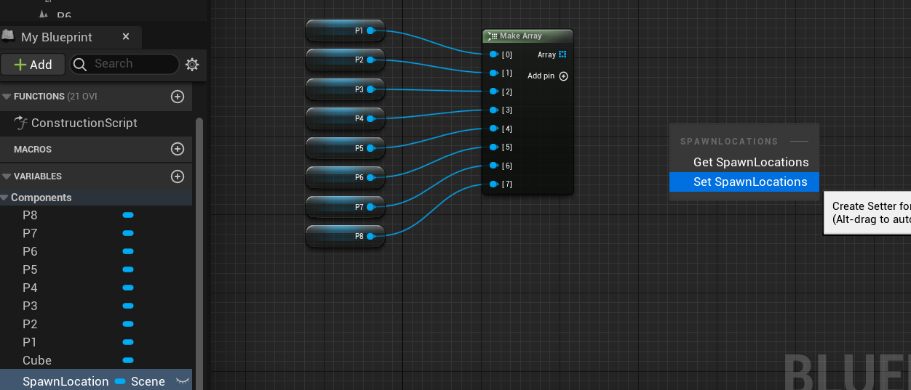

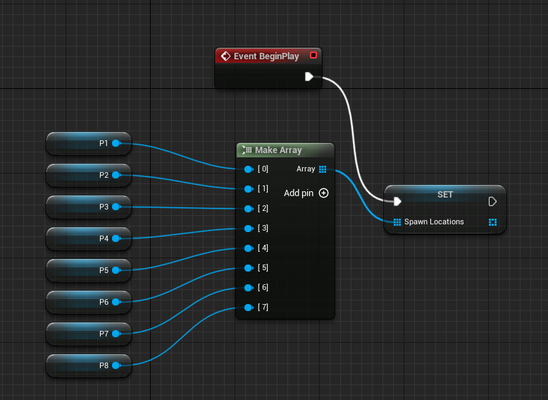

* Next, we need to define a maximum amount of times the new cubes can spawn, so that the spawning does not happen infinitely and crash the engine.

Create a new variable, name it 'MaxDivisions' and set its type to *integer*. This integer will be the maximum of times the new cubes will spawn from a larger cube. 

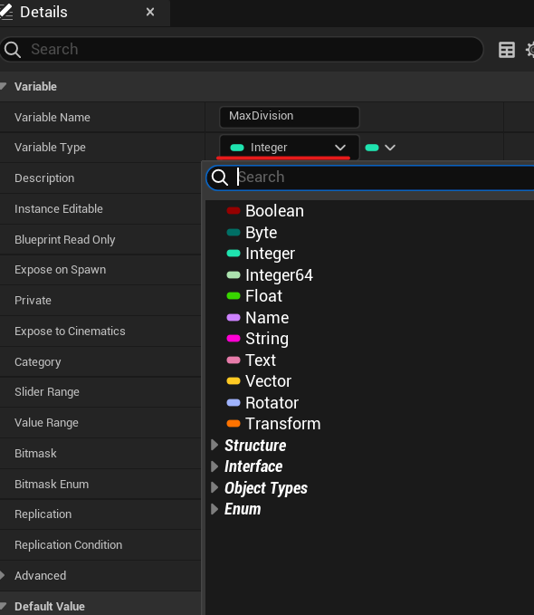

Make sure its Container type is *Single*, as we just need a single numerical value for this.

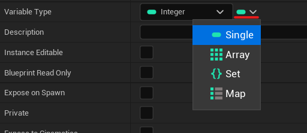
 
Drag the variable into the Event Graph and select *Set MaxDivisions*. Connect it to the Spawn Locations node. Set the value to 3 for the time being. This means the cubes will not spawn more than three times in a row.

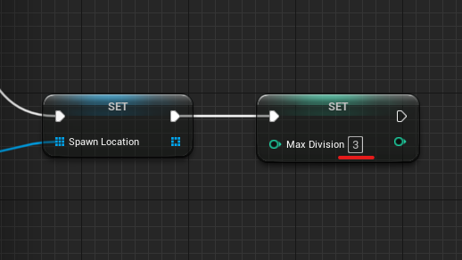

Alternatively, to make the cubes a bit more varied, we can also randomize the amount of times the cubes break down. To do this, we would randomize the number of generations each cube would produce. For that  attach a **Random Integer in Range** to a Set Max Divisions value and set the values between 2 and 5, for example. 

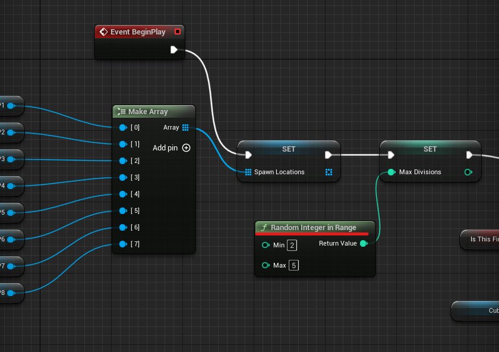

### Event Sequence

We are using Custom Event Nodes to build a sequence of steps. Custom Events provide you with a way to create your own events that can be called at any point in your Blueprint's sequence.  

One event is responsible to check whether we should further spawn new cubes or stop and the other event is doing the actual spawning of new cubes.

#### The Split Event

* Return back to the Cube blueprint's Event Graph.

* Create a **Custom Event Node** in any place in the Event Graph by typing 'Add Custom Event' into the search bar and hitting Enter. Rename it to 'Start Split'.
[Custom Events](https://dev.epicgames.com/documentation/en-us/unreal-engine/custom-events-in-unreal-engine?application_version=5.3) define an entry point for the execution of an individual network. You can imagine setting up a Custom Event Node like a function definition, which you must call to be executed. Similarly, a Custom Event Node must be explicitly called from the EventGraph execution sequence, to start its network. 

We call the 'Start Split' event from our initial node set up, which stems from Event Begin Play. In turn, the 'Start Split' event then triggers another series of nodes, which we create in the next steps. 

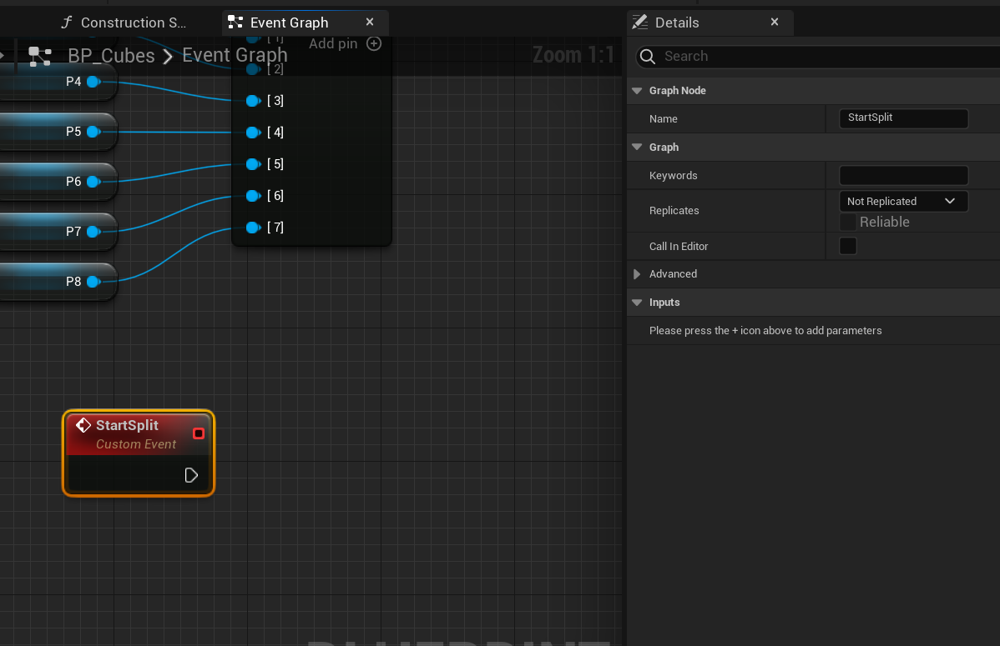

#### The Spawn Event

* As second event add another **Custom Events** nodes and name it 'SpawnCubes'. In later steps, we set up our nodes to trigger this event.   

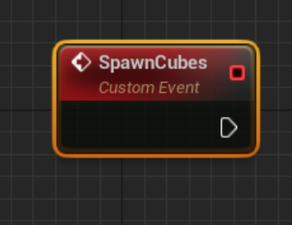

### Check for the First Cube

Now, that we have planned our overall sequence, we build the details as networks in between. For that we start with the Begin Play Event at the top.

In the following steps, we add a little jump, before we call the Start Split Event. However, we do not want to add this jump to the first cube as it is already laying peacefully on the ground.

Hence, we want to identify the first cube. We do so with a conditional (a Branch node) and assigning a boolean variable to each spawned cube, which indicates whether the cube is the first cube or not.

* Add a [*Branch*](https://docs.unrealengine.com/5.1/en-US/BlueprintAPI/Utilities/FlowControl/Branch/) node and attach it to the Max Divisions node. This allows us to trigger events based on whether the result of a boolean is true or false. Promote the *Condition* (this will be the true or false statement that triggers the event) of the branch to a variable by right clicking the *Condition* pin and selecting *Promote to Variable*. 

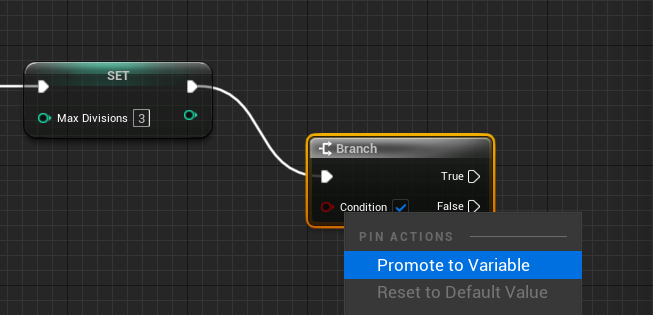

* Select the newly created variable and rename it to IsThisFirstCube. Here we will be asking the question: 'Is this the first cube?'. Based on whether this is true or not, we will trigger a different event. 

Change the Default Value of the boolean to false. For that make sure that the blueprint is compiled and then tick the checkbox under **Default Value** in the details of the variable (if the blueprint is not compiled the checkbox does not appear). We will use this variable to mark an instance of the blueprint class in the scene editor manually as first cube - just follow along, this makes sense in a second. 

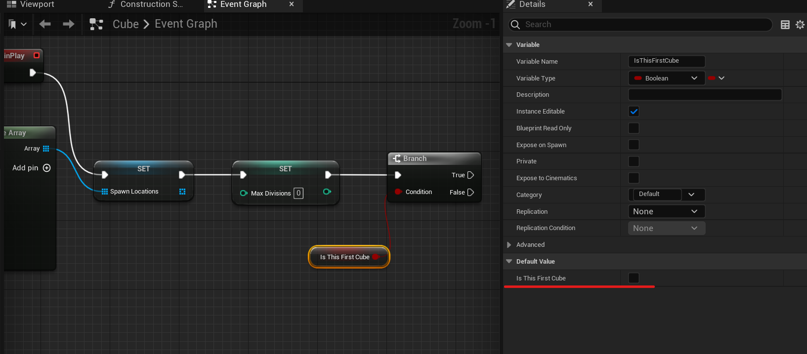
 
* Now, we will make the variable externally editable by clicking the closed eye icon next to its name in the Variable browser. 

 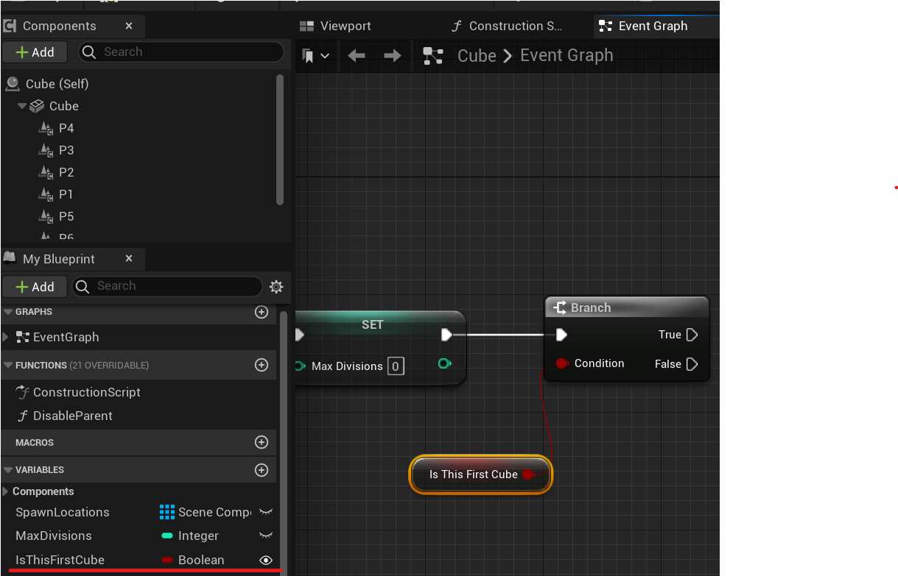

* Compile the blueprint and close the window to return to your scene. Drag the blueprint into the scene. Make sure the cube is laying on top of the floor (z location `60` should do so).

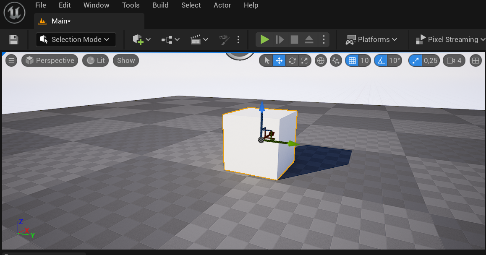

* If it is not selected, click on the cube in your scene. In the details on the right, you should be able to see the promoted variable. Tick the box next to its name. 

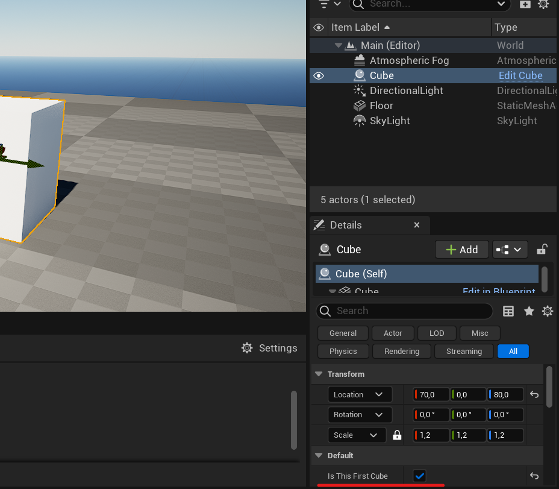

This means, that the original cube that is placed in the scene is now marked as the first cube. However, we set the value of the IsThisFirstCube variable in our event graph to false, which means all the newly spawned cubes after this one will have a false value.
This means, when the question "Is this the first cube?" is asked, the answer for the first iteration is "yes" and after the first run, will always be "no". 
This allows us to differentiate between the first cubes and all the new ones that are created.

### The Jumping

Before a cube is split, there should be a small 'jump' as interesting effect. However, we do not want the first cube to do the jump. For that we can now use the conditional with the 'Is this first cube' variable that we created above.

If it is the first cube, meaning the branch node evaluates to true, just call the 'Start Split' custom node without any jumping (go back to the blueprint editor):

* Directly add a call to the 'Start Split' custom node. For that, right click and start typing 'Start Split'. This will create a call of the Start Split event, which is currently still empty. Connect it to the *True* pin in the *Branch* node. 

Otherwise, meaning for all other cubes, we want to add a jump effect and then call the 'Start Split' node:

* Add an [**Add Impulse (Cube)**](https://docs.unrealengine.com/5.1/en-US/BlueprintAPI/Pawn/Components/CharacterMovement/AddImpulse/) node. An impulse is an instantaneous physics force, usually applied once. Check *Vel Change* (red pin), which means the velocity changes from the impulse relative to the cube's mass. 
* For the direction of the impulse, create a **Random Unit Vector** node.
* As factor for the impulse, create a New Variable, change its type to a *float*, rename it to 'Impulse Scalar', drag and drop it into the graph and select *Get Impulse Scalar*. Select the node and set its Default value to 100. (This influences how much the cubes will 'jump' as they spawn)
* Create a **Multiply** node and multiply the Random Unit Vector by the *Impulse Scalar* variable. 
* Connect the Multiply's node output to the Add Impulse node's **Impulse** parameter.
* Add another **Start Split** node and connect it to the Add Impulse node. 

Your network should look as follows:

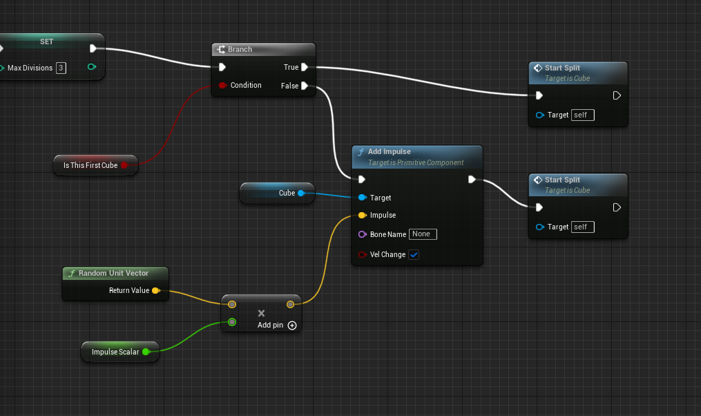

#### Enabling Physics

For the impulse force to work, we have to enable physics in our cube system. 

Select the Cube Scene Root, in the components on the right, enable *Simulate Physics* and set *Linear and Angular Damping* to 0.5. These damping values are primarily used to simulate drag. Later you can adjust these values up to your liking.

[Linear Damping](https://dev.epicgames.com/documentation/en-us/unreal-engine/physics-damping-in-unreal-engine?application_version=5.3) controls how much the Physics Body (the cubes) resists translation, and Angular Damping controls how much they resist rotating. 

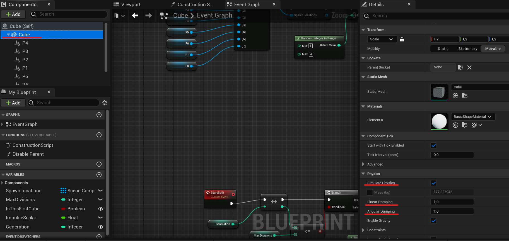

### Generations

We now define what should happen when the Start Split is called from our main branch (as set in the previous step).

For each call of the 'Start Split' event, we want to increment a new 'Generation' variable (the first cube would be the 1st Generation, the next 4 cubes would be 2nd Generation and so on). We want to only proceed if Generation is smaller than Max Divisions:

* Add a new integer variable called 'Generation', drag it into the graph and select *Get*.
* Starting from our Start Split event node, add an **Increment Int**, connect Generation to its second pin.
* Connect the increments node to the first input of a **Less Equal** node.
* Drag in MaxDivisions from the **Variables** section on the left one more time and select *Get MaxDivisions* and use it as second pin in the Less Equal node.
* Connect the incremented number as the first input to a new Branch node, and the result of the Less Equal node to the condition of the branch node (its second pin).

The network should look as follows:
  
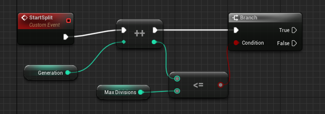

We want to start the actual splitting with a random delay for each cube to make the simulation more interesting.  For that 

* Add a **Random Float in Range** and a **Delay** node. Connect the output of the previously created branch node to the first pin of the Delay node and the Random Float in Range output to Delay's second pin. The **Min** and **Max** of the Random Float in Range node, e.g. to be between 1 to 4 seconds.
* Connect the Delay node's output to a new **Spawn Cubes** node.

Your network should look as follows:

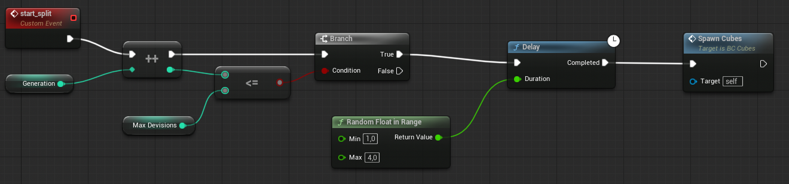

We have now set up the nodes, so that if the generation number is below the limit, this network calls the **Spawn Event** with a delay. 

* Compile and save!

### The Spawning Event

Lastly, we setup the Spawn Event that spawns eight new, smaller cubes for each existing one. 

* In order to spawn the cubes, we have to use the array we created in the very first steps. Once again drag the *SpawnLocations* variable into the Event Graph and select *Get SpawnLocations*. 
* We iterate with a **For Each Loop** over all cubes to spawn the new ones, so attach a For Each Loop node to the array variable. Plug *SpawnCubes* into the Exec pin like in the image below. 

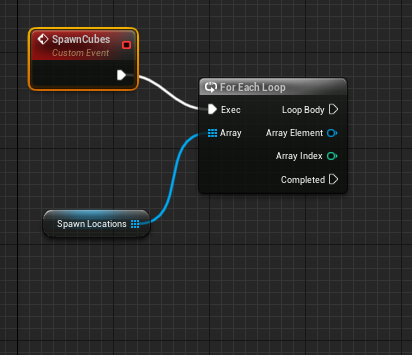

The spawning itself is done with a **Spawn Actor from Class** node. This node creates a new Actor from the selected class and with a given transform, which we put together and input into the node.

* Firstly, add a **Spawn Actor from Class** node. 
* Connect the **Loop Body** output of the For Each Loop with the SpawnActor node's input.
* In the **SpawnActor** node, select the name of your blueprint as the class, since it should spawn itself, meaning more cubes with exactly the same behavior. 

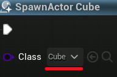

* In the SpawnActor node, also change the *Collision Handling Override* to *Always Spawn, Ignore Collisions*. This means we spawn the cubes no matter if they are intersecting or not (collision detection might prevent the cubes from spawning). You can test different settings for these values, which also depend on whether you destroy the parent actors (and they are out of the way anyways) or not.

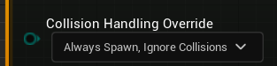

Next, we compute the transform that the new cubes should get. For Location and Rotation, we want the same values as the cube that we are currently splitting has and re-use its values in World coordinates. The Scale should decrease.

*  Create a **Make Transform** node and input its output into the **Spawn Transform** pin of the SpawnActor node.
* Create **Get World Location**, **Get World Rotation**, with any Component name as we delete that anyways. Next, delete the nodes that are inputs and plug in **Array Element** from the For Each Loop node instead. Plug the Location and Rotation nodes outputs as input into the Make Transform node.
* The scaling, we want to further adjust. With each iteration the cube size should be halved. Luckily, we gave our start components that we have saved in the array the scale that we want use here, meaning `0,5`. We can access this scale as *relative scale* from the parent and multiply this factor with the incoming scaling of the parent in world coordinates. To set this up, grab the *Array Element* pin in your **For Each Loop** node. Start dragging and you will see a line extending from it. Release and when a search window pops up, search for Relative Scale 3D and select **Get Relative Scale 3D**. Create a new **Get Actor Scale 3D**  and a multiply node and multiply the Relative Scale 3D node with the Get Actor Scale 3D. This setup means that we multiply the incoming parent's world scale with the parent's relative scale of 0,5 (we have set the scene component up like this above in step *Scene and Component Setup*). Connect the multiply node to the Make Transform's node Scale input. The network should look similar to:

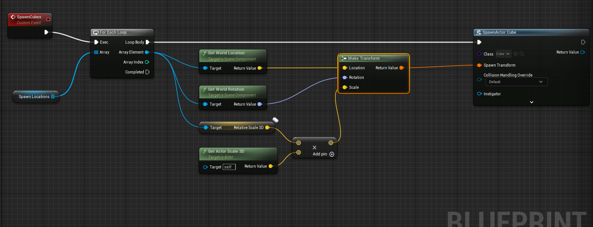
  
By default, variable values are not carried over to the new spawned actor class. This means that as of now the spawning of the cubes would never stop and with that the scene would crash because the *Generation* variable that we count up is not transferred and with that always has its default value. To transfer the variable value to the newly spawned Actor, we need to check in the generations variable's details section *Expose on Spawn* and *Instance Editable*. Expose on Spawn makes the variable accessible to its spawned children and Instance Editable allows the variable to be editable on any instance of the blueprint, meaning the spawned child actors can continue to count it up.  

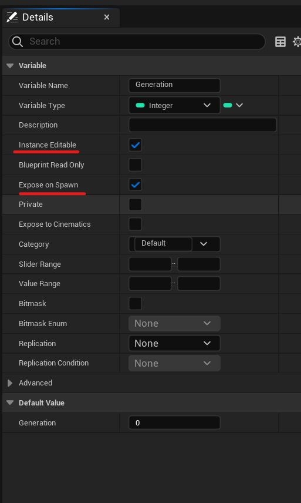

* To apply these changes, compile the Blueprint.
* Right click the **Spawn Actor** node and select *Refresh Node*. You should have a new pin called *Generation* appear on your node, since we enabled for it to be editable in the blueprint. Plug in the existing Generation variable reference node here. 

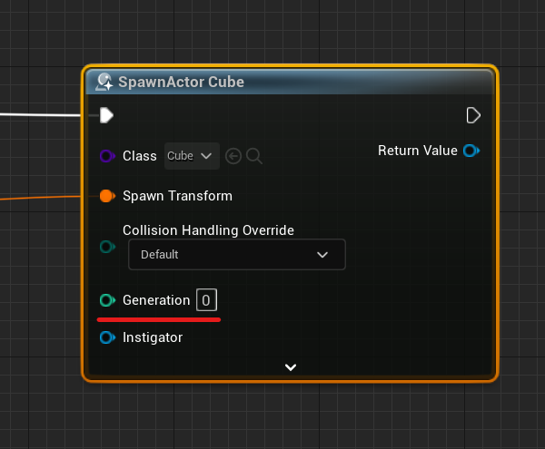

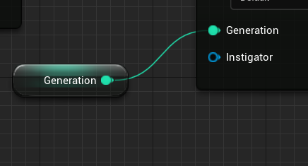

In summary, this enables the new cubes that have spawned, to receive the updated Generation value, so that they are not labelled as the first generation every time they spawn. 
  
You might want to delete the older generation of cubes, once they have spawned their children. This depends on which look you like better. In case you want to make the older cubes to disappear, add a **Destroy Actor** node to the *Completed* position in the **For Each Loop** as in the image below. 

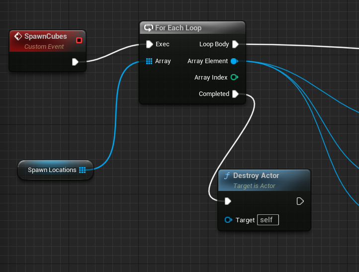

We are almost done! This is our full EventGraph now:

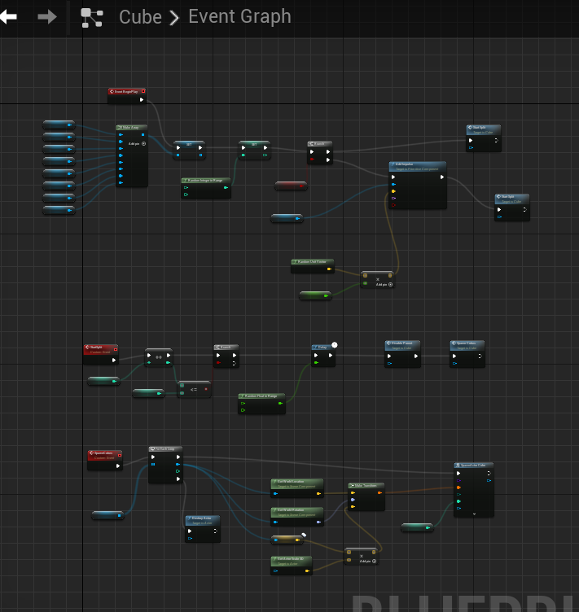

* Compile and press play in the scene and hopefully the cubes are now subdividing! 

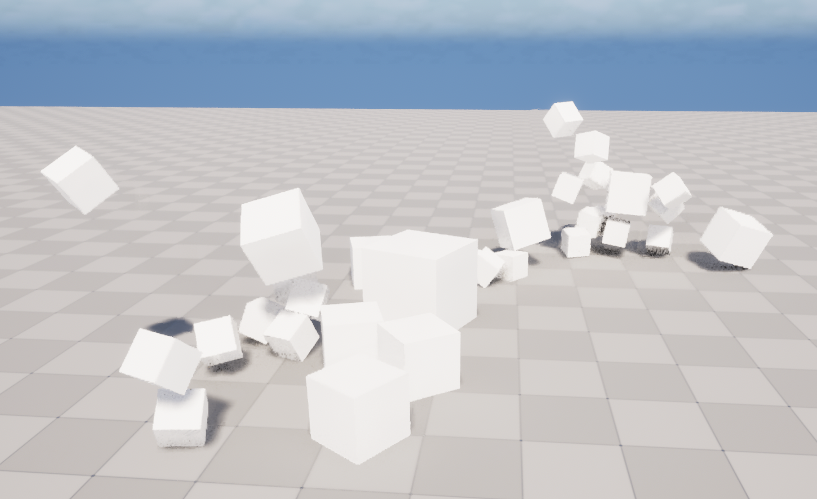

## Performance Optimization

For improving performance, click **Class Defaults** on the top of the blueprint window.

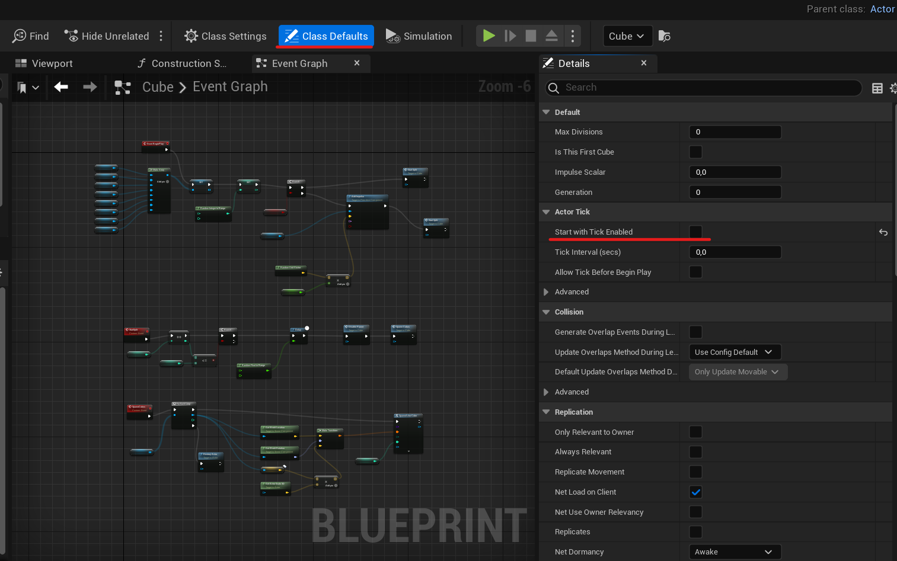

* In the details section on the right, under **Actor Tick** uncheck the first box *Start with Tick Enabled*. Since our blueprint does not require ticks to function, it is ideal to disable it altogether. If you want to know what ticking is, you can read about it in the [Documentation](https://dev.epicgames.com/documentation/en-us/unreal-engine/actor-ticking-in-unreal-engine?application_version=5.3).
* The sleep settings indicate how long a component reacts to a physics simulation before it goes to sleep. If we increase the *Custom Sleep Threshold Multiplier*, objects go earlier to sleep and with that make the simulation leaner.

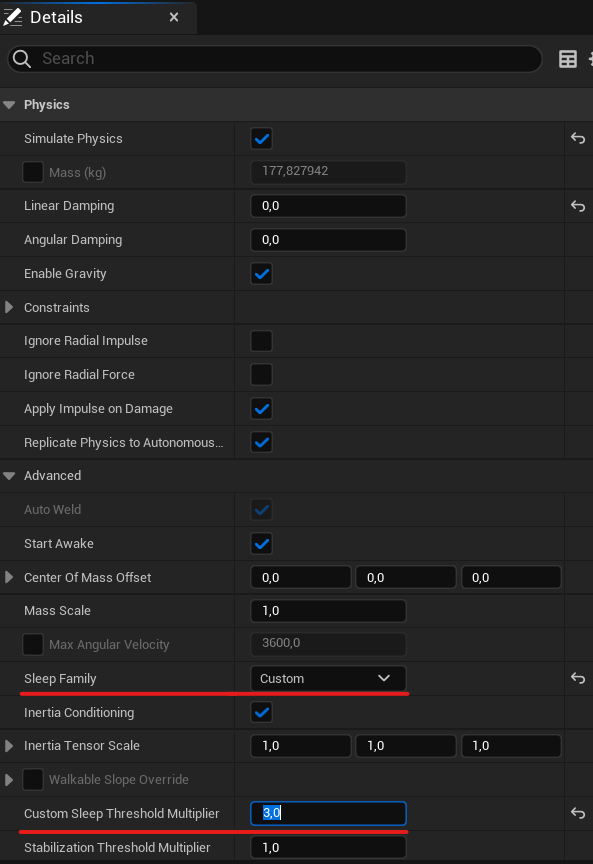

* Collision detection can also influence the performance of a simulation quite significantly. With the [Collision Response Settings](https://dev.epicgames.com/documentation/en-us/unreal-engine/collision-response-reference-in-unreal-engine?application_version=5.3), we can eliminate checks that are not needed within our scenario.

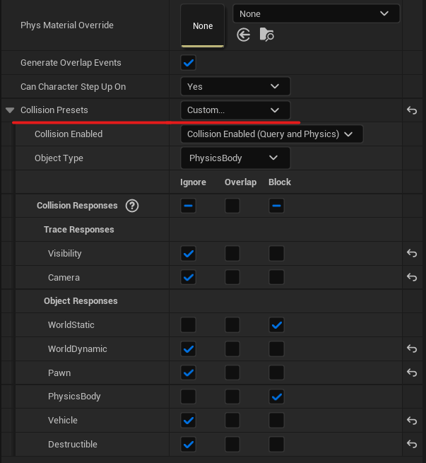

### Optional Physics Constraints For Parent

The original tutorial disables any kind of physics simulation for the parent, once the process of spawning new cubes is started. This is up to personal taste. However, it is a nice example of using a function on a Blueprint.

* Add a new function by clicking the small + next to the **Functions** section name on the left.  

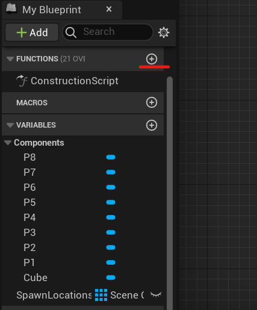

* This should open a new tab. Rename the function to 'DisableParent'.

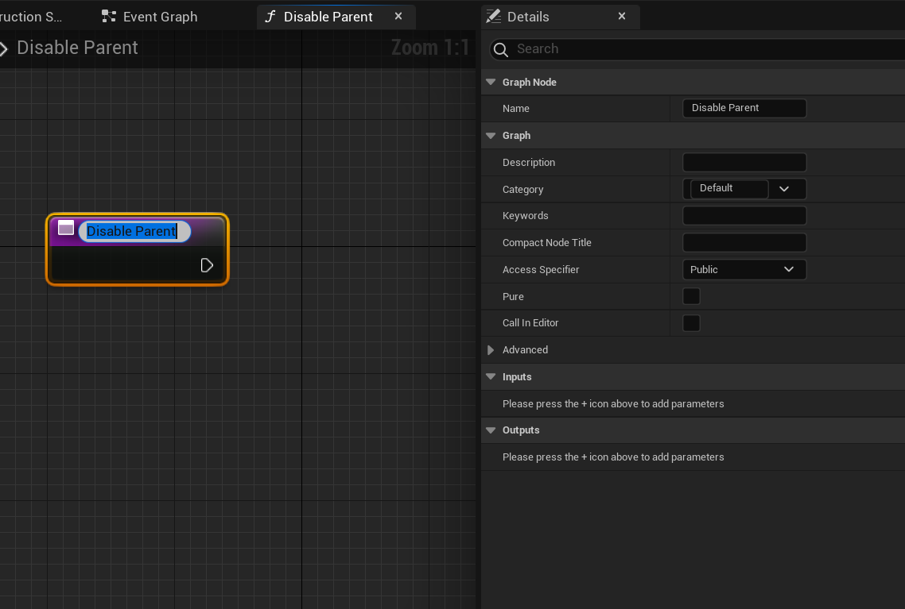

* Set up the nodes within the function like in the image below. The purpose of this function is to disable all collision settings, so that all the smaller cubes can respawn as if the previous cube did not exist. 

All nodes have the original Cube component set as the target. (It will also become automatically appended when you create the nodes, I just use one for all the nodes for a cleaner)

Make sure to compile after the nodes have been set up. 

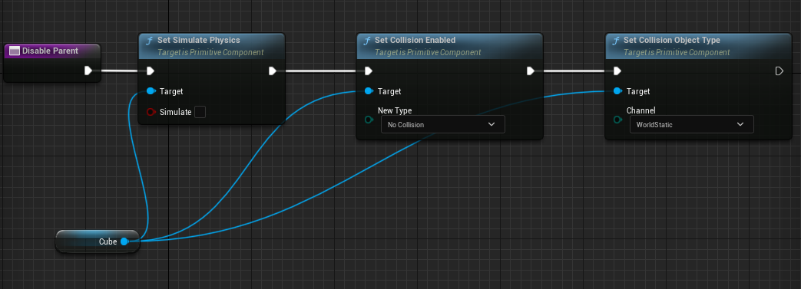

* Now, return to your Event Graph and drag the function into the graph (from the **Functions** section on the left side of the screen) between the Delay node and the Spawn Cube event. Most likely, you will now need to adjust the settings of the Physics simulation to create a good looking effect.

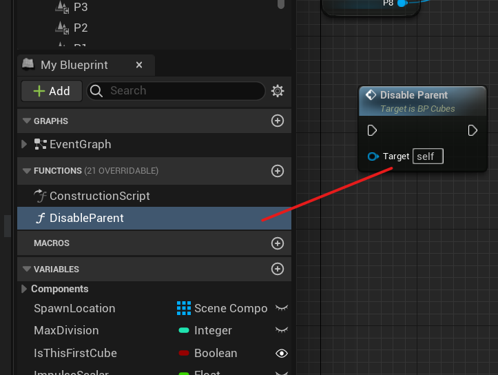

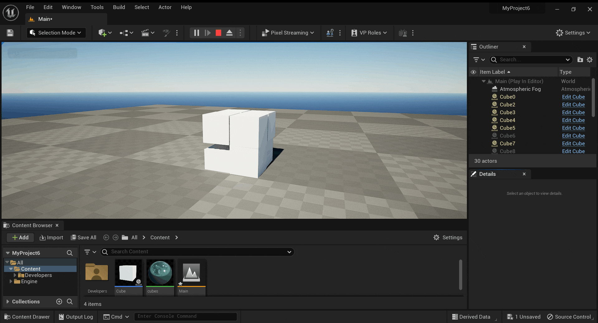

## The Material

For the material of the cubes, we want to create two effects: 

* A color Adjustment For Each Generation
* Upon spawning the cubes, there is a glow effect

### Material Network

Specifically, we implement a hue shift in the Base Color for each generation.

* Create a new material
* Hold '3' and click into the material editor to create a new **Constant 3 Vector**. Choose a color of your liking.
 

We create the material network that shifts the value for the hue based on the already existing 'generation' variable in the Blueprint. For this to work, we also need to add some nodes in the Blueprint, but we start with the material.

* Create a **Hue Shift** node and connect the Color pin of the Constant 3 Vector node to the **Texture** pin of the Hue Shift (this is the second pin). This node shifts the hue of the incoming texture (in our case a color) by a factor coming in into the first pin. The incoming value for the shift needs to be 0..1 which represents the shift in 0..360 for the hue. E.g., an input value of 0.5 shifts the hue by 180. We will come back to this in a second.
* Connect the output of the Hue Shift to the Base Color.
* Hold '1' and click into the material editor to create a new **Constant** node, and multiply it with the output of the Hue Shift and connect it to the **Emissive Color** of the material.

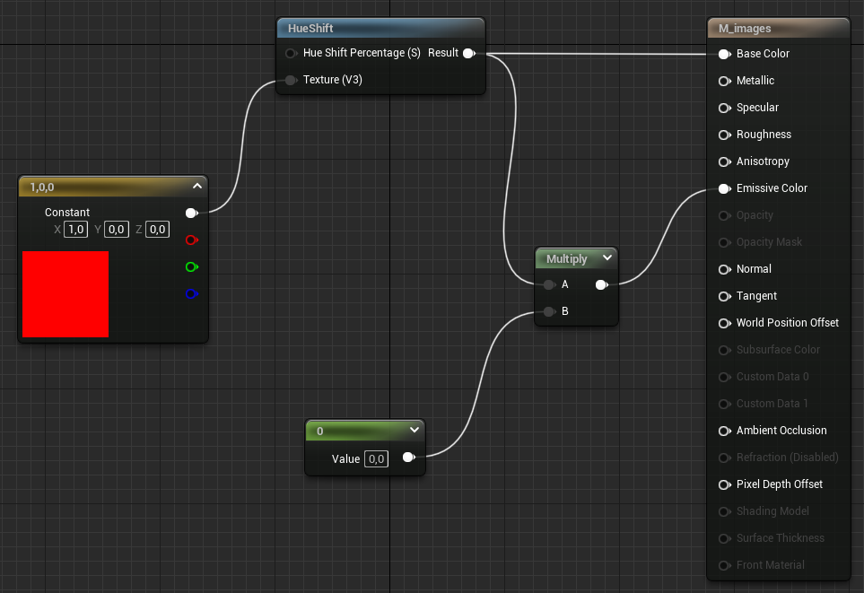

* To control that the input values for the hue shifting are between 0..1, we use a **Remap Value Range** node as input. With this node we can map an incoming value from one value range to another one. For example the input range is 0..500, and the target range 0..1. If the incoming value is 250, the output of the Remap value is 0.5.
* Each input of the Remap node requires a constant, hence hold '1' and click five times into the editor for creating 5 constant node. Connect each to an input of Remap. Set the input for Target low and high to 0 and 1.

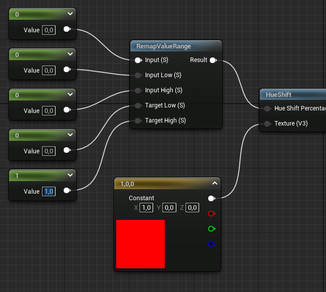

With setting a range for input low and high (the incoming range), we define how we sample the hue spectrum. E.g., if we set the incoming range to 0..10, we indirectly divide the hue range 0..360 into 10 steps, each with a value range of 36: 0..35, 36...71, 72...107 etc. Hence, the range 0..10 is mapped to 0..360.

### Parametrization

We want to access and adjust the hue shift and emission during run time from the Blueprint. For that we use Material instancing.

[Material instancing](https://dev.epicgames.com/documentation/en-us/unreal-engine/instanced-materials-in-unreal-engine?application_version=5.3) is used to change the appearance of a Material without incurring an expensive recompilation of the Material. Whereas a typical Material cannot be changed without recompiling (something that must happen prior to gameplay), a parameterized Material can be edited in a Material instance without such recompilation. This has numerous workflow advantages, and can improve Material performance. Certain types of instanced Materials can even change during gameplay in response to in-game events (such as a tree whose Material blackens and chars while it burns). This allows tremendous visual flexibility in your artistic elements.

To make Material attributes editable within an instance, you must designate them as parameters in the parent Material. This is called parameterizing your Material. To make an attribute or node a parameter, right-click on it and select *Convert To Parameter*.
  
Convert the following nodes to parameters:

* The constant value controlling the **Emissive Color** (going into the second pin of the multiply node) call the parameter **emission**.
* The constant value controlling the **Input S** of the Remap node, call the parameter **hue_offset**.
* The constant value controlling the **Input High S** of the Remap node, call the parameter **hue_step**.

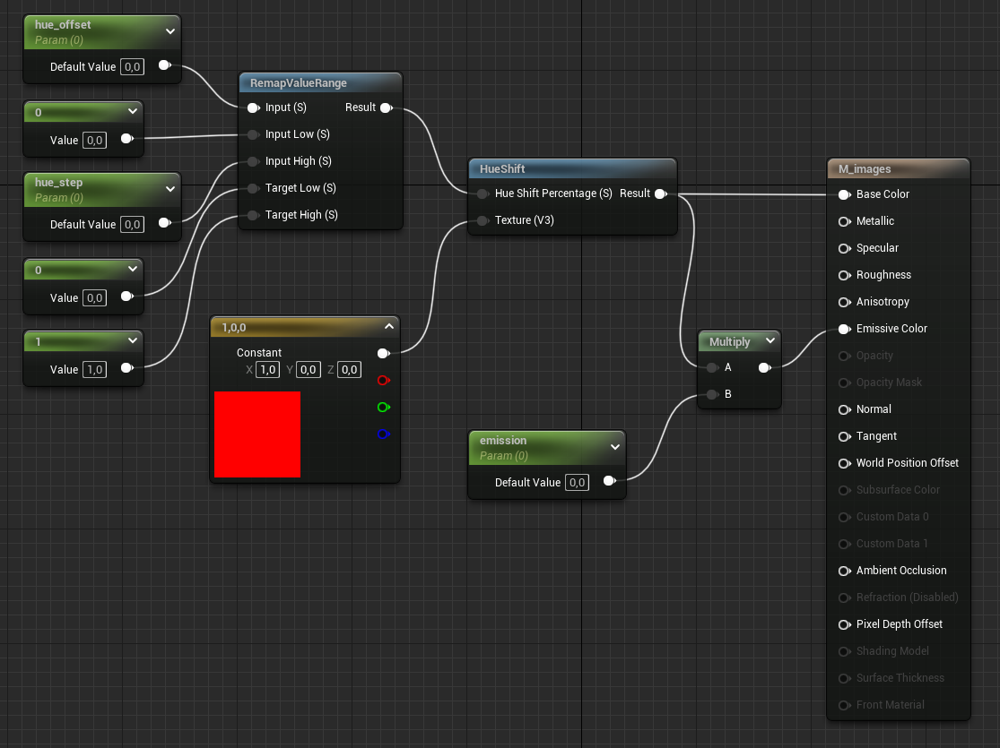

Now, we can access these parameters in the Blueprint. For performance, preventing a recompile of the whole material upon a change of a parameter, we should always use an Instance of the material, we just created.

* Go to the Content Browser, right-click on the Material and select **Create Material Instance**.

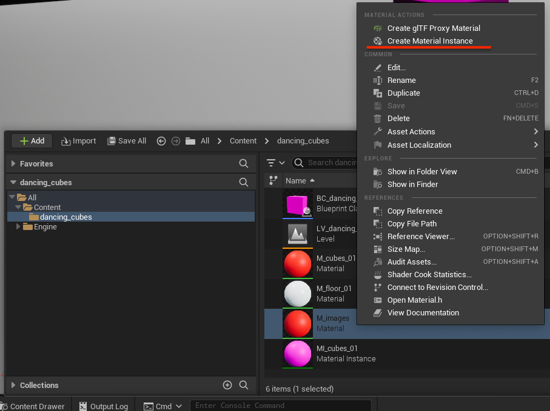

## Adjusting Material Parameters in the Blueprint

We are now implementing the shift of hue and emission values in the Blueprint. Open the Blueprint.

### Shifting Hue

* Select the cube and in its Details tab, assign the instanced material, we just created.

We are working in the network following the **Event Begin Play** sequence. Depending on the generation we shift hue_offset.

As orientation, we are now creating the orange box, marked in red. Navigate there:

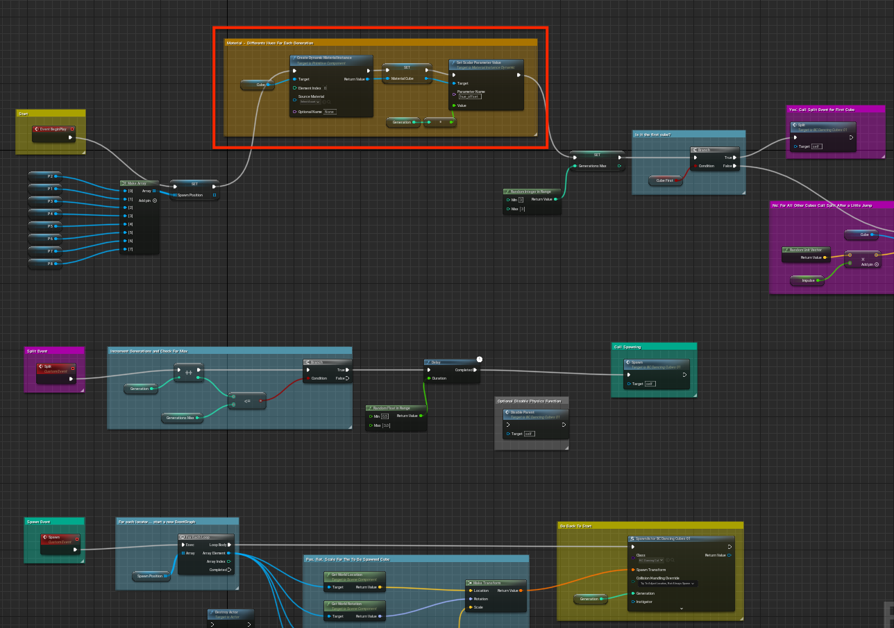

* Drag the cube into the editor (close to the Event Begin Play node) and with it still selected, create a **Create Dynamic Material Instance**. This node enables the access to an instanced material within a Blueprint. Connect the output of Set Spawn Position node to the first pin of the Create Dynamic Material Instance node. As **Source Material** within the node, chose the instanced Material, we created above. 

To eventually assign a new value to the material, we first have to create a variable for it (I am not entirely sure why, but this just seems to be how it is).

* Drag out of the second output pin from the Create Dynamic Material Instance and select **Promote To Variable**, name the variable in the variable menu on the left. 
* Connect the second output pin of the SET node to a **Set Scalar Parameter Value** node. Within that node put in 'hue_offset' as **Parameter Name**. This means we can now change the hue_offset value of the instanced and previously accessed material. 

Now, we want to input the existing generation variable into the **Value** input pin of the Set Scalar Parameter Value node.

* Drag generation from the left variable menu into the editor, get it, and connect it to Value. This automatically creates a int to float node for us in between (thanks Unreal!).
* Connect the output of the Set Scalar Parameter Value to the existing SET Max Divisions node.

All in all we have for the hue shift now the following network (the image has slightly different names):

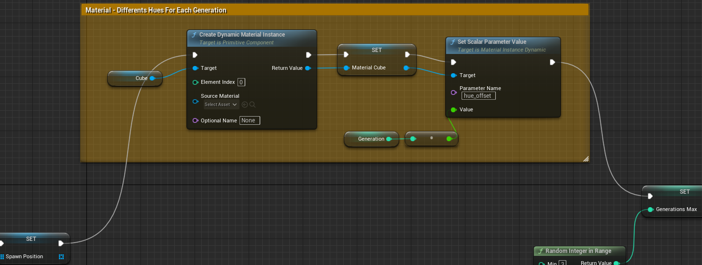

### Spiking Emission

With the 'jumping' and the spawning of new cubes, we add a temporary change of emission for a glow effect.

For that we work right after calling the Start Split event. As orientation, we now create the second yellow box, marked in red:

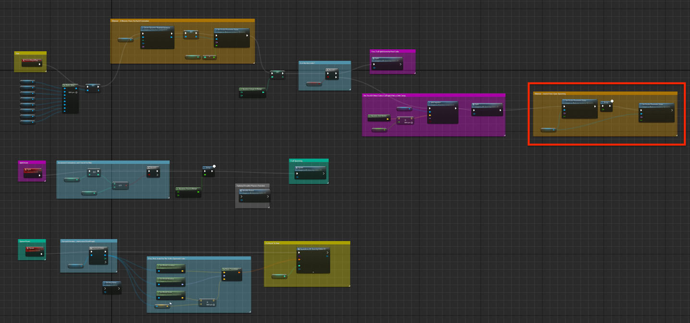

* Drag and get the variable of the instanced material that we created from the left into the editor, right next to the Split Start call.
* Drag its output and create a **Set Scalar Parameter Value** node. Set its **Parameter Name** to 'emission' and set its value to 5 (that is the factor for the Emissive Color in the Material).

After a certain amount of time, we want to set the emission back to zero.

* Connect to Set Scalar Parameter Value a **Delay** node, e.g. with the value of 0.1 as delay.
* Duplicate the Set Scalar Parameter Value node, connect it to the output of Delay and set the Value to 0. Connect the instanced material node to the Target (same as above).

In total we now have for the glow effect:

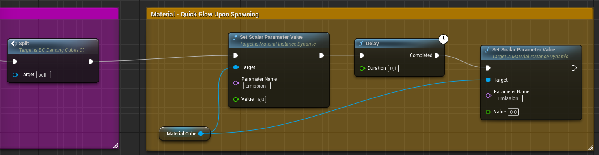

You can test different hue_step values in the instanced material. The higher the value for the step, the smaller the color variation between generations.

## Particles

To make the spawning even more exciting, we can add a subtle dust with a particle system by connecting it to the sequence of events in our Blueprint.

The system in Unreal to create particles, is called Niagara. Next week we will talk in more detail about Niagara. For now, we are just using it for one, tiny effect.

A Niagara system comprises of an *Emitter*, which generates particles. A particle is an object which has a location and can be assigned any number of properties to determine its look and behavior.
  

* Create a new Niagara system. Select **New System from Selected Emitters**, and chose **Omnidirectional Burst** as template.

Let's first integrate it into the Blueprint so that it is triggered when new cubes are spawned. Afterwards we adjust some parameters of the Niagara system.

* Open the Blueprint. We add some nodes now, before the spawning. As orientation, we create the blue box, marked in red:

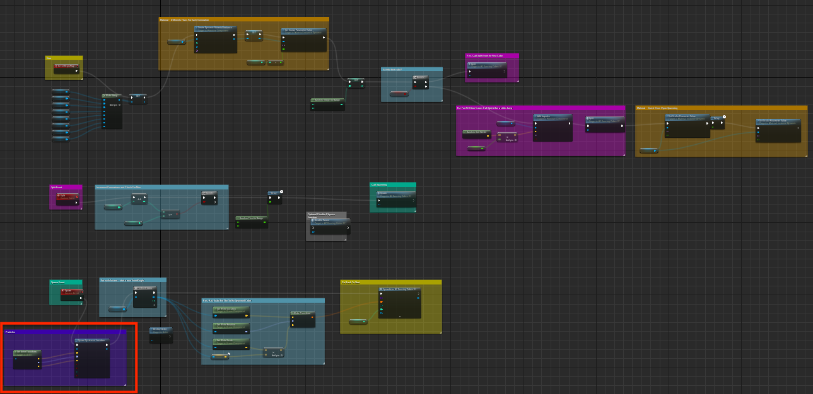

* Next to the Spawn Custom Event node, create a **Spawn System at Location** node. As **System Template** select the Niagara System, we just created. As input it gets the output from the Spawn Custom Event node, the new nodes output goes into the existing For Each Loop node.
* As input location create a new **Get Actor Transform** node. As we need all transform channels separately, right-click on Get Actor Transform's pin **Return Value** and execute **Split Struct Pin**. This gives us access to each channel separately. Connect its location to the input location pin of Spawn System at Location and do the same with rotation and scale.
* Compile and execute the simulation in the main viewport. You should see some particles bursting when the cubes are spawned.

If not, your particles might be too small. In general, I recommend to first increase the particles size (Emitter -> Initialize Particle -> Uniform Sprite Size Max / Min) to actually see what is going on.

* In the Niagara editor let's make some adjustments to the particle systems (this is purely up to taste, do whatever you want):
    * Spawn Burst Instantaneous -> Spawn Count -> 80
    * Initialize Particle
        * Lifetime Min -> 0.5
        * Lifetime Max -> 2.0
        * Set a color
        * Uniform Sprite Size min -> 1
        * Uniform Sprite Size Max -> 8
    * Add Velocity
        * Min -> 75
        * Max -> 400
    * Gravity Force -> z -> 40
    * Drag -> 1

Done!

