**Procedural Generation and Simulation**

Prof. Dr. Lena Gieseke \| l.gieseke@filmuniversitaet.de

---

# Zander Federico

All of Zander Federico's submitted images, grouped by exercise and task. Back to the [full gallery](../README.md).

## Exercise 01

### Task 01.03 – Designing Patterns

  <figure class="pgs-tile">
    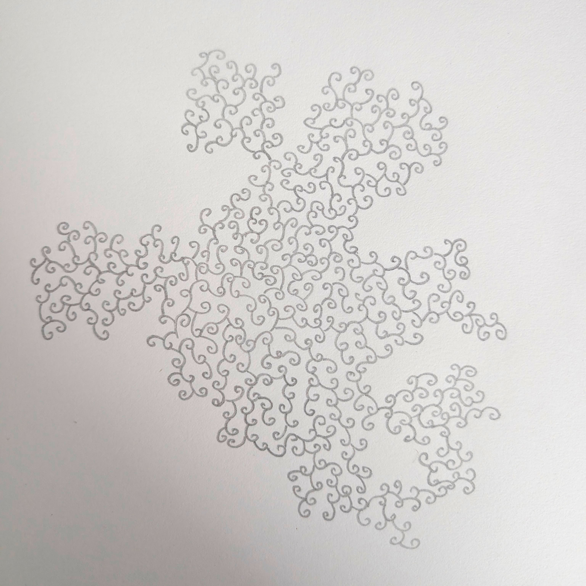
    <figcaption>Zander Federico &mdash; Exercise 01, Task 01.03</figcaption>
  </figure>

### Task 01.04 – Seeing Faces

  <figure class="pgs-tile">
    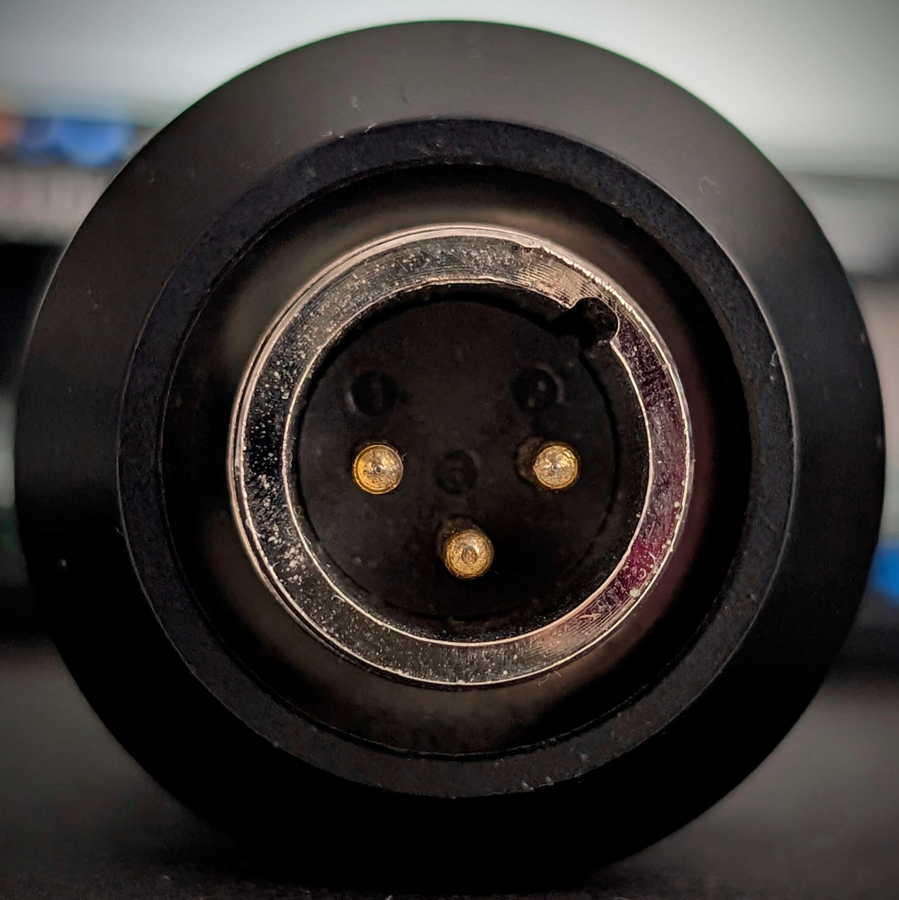
    <figcaption>Zander Federico &mdash; Exercise 01, Task 01.04</figcaption>
  </figure>

### Task 01.05 – Painting

  <figure class="pgs-tile">
    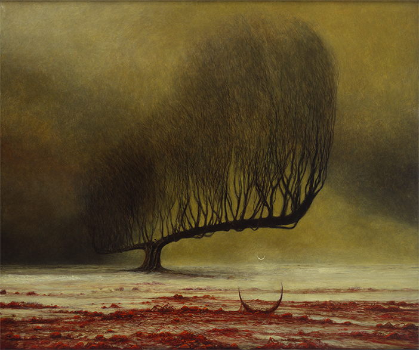
    <figcaption>Zander Federico &mdash; Exercise 01, Task 01.05</figcaption>
  </figure>

### Task 01.06 – Artistic Expression in CGI

  <figure class="pgs-tile">
    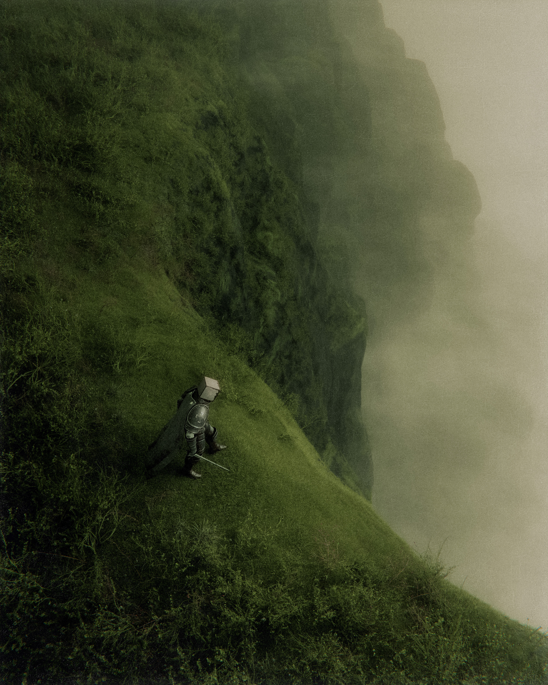
    <figcaption>Zander Federico &mdash; Exercise 01, Task 01.06</figcaption>
  </figure>
  <figure class="pgs-tile">
    
    <figcaption>Zander Federico &mdash; Exercise 01, Task 01.06</figcaption>
  </figure>

### Task 01.07 – Unreal Documentation & Getting Started

  <figure class="pgs-tile">
    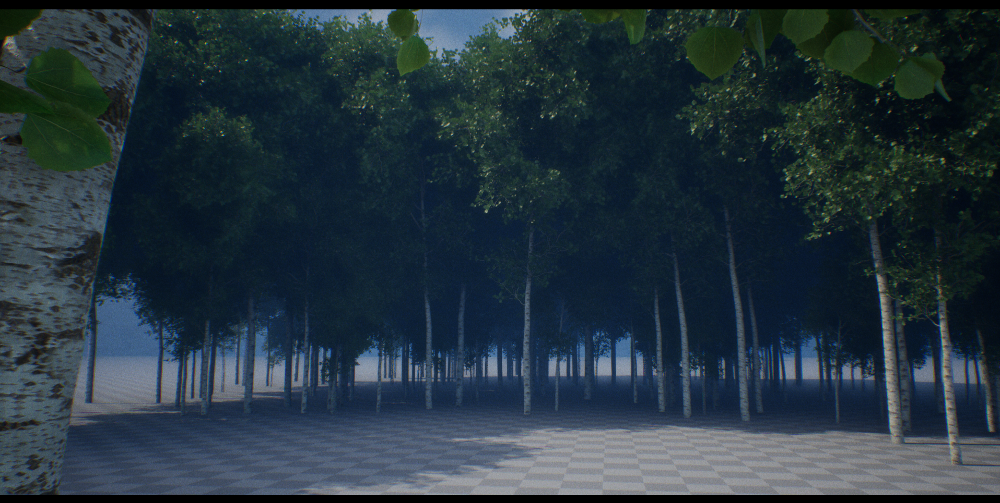
    <figcaption>Zander Federico &mdash; Exercise 01, Task 01.07</figcaption>
  </figure>

## Exercise 02

### Task 02.02 – Function Design

  <figure class="pgs-tile">
    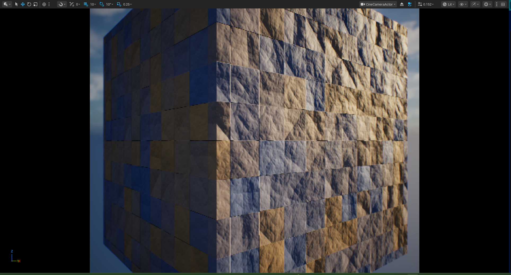
    <figcaption>Zander Federico &mdash; Exercise 02, Task 02.02</figcaption>
  </figure>
  <figure class="pgs-tile">
    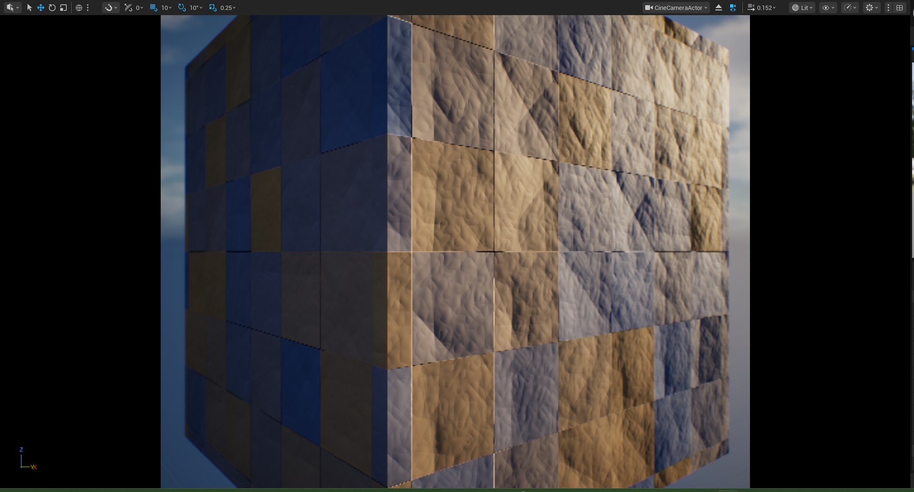
    <figcaption>Zander Federico &mdash; Exercise 02, Task 02.02</figcaption>
  </figure>
  <figure class="pgs-tile">
    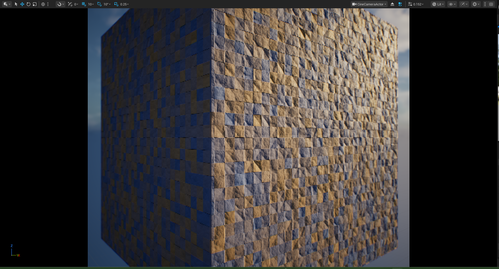
    <figcaption>Zander Federico &mdash; Exercise 02, Task 02.02</figcaption>
  </figure>
  <figure class="pgs-tile">
    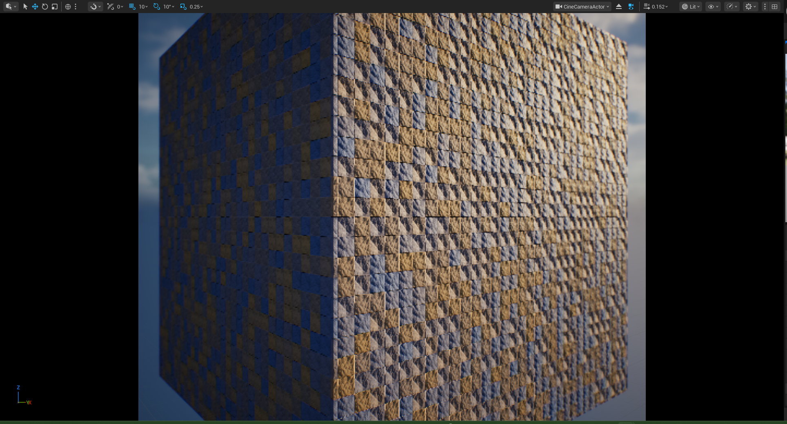
    <figcaption>Zander Federico &mdash; Exercise 02, Task 02.02</figcaption>
  </figure>
  <figure class="pgs-tile">
    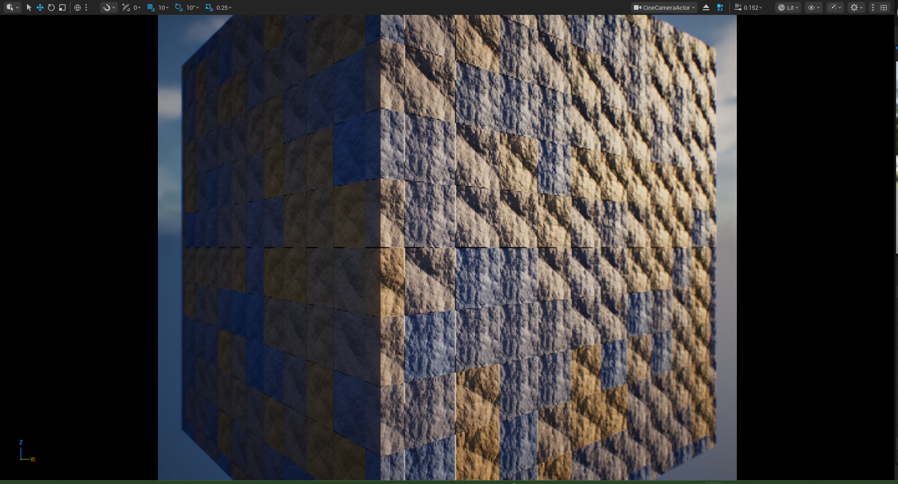
    <figcaption>Zander Federico &mdash; Exercise 02, Task 02.02</figcaption>
  </figure>

## Exercise 04

### Task 04.01 – Collecting Inspiration

  <figure class="pgs-tile">
    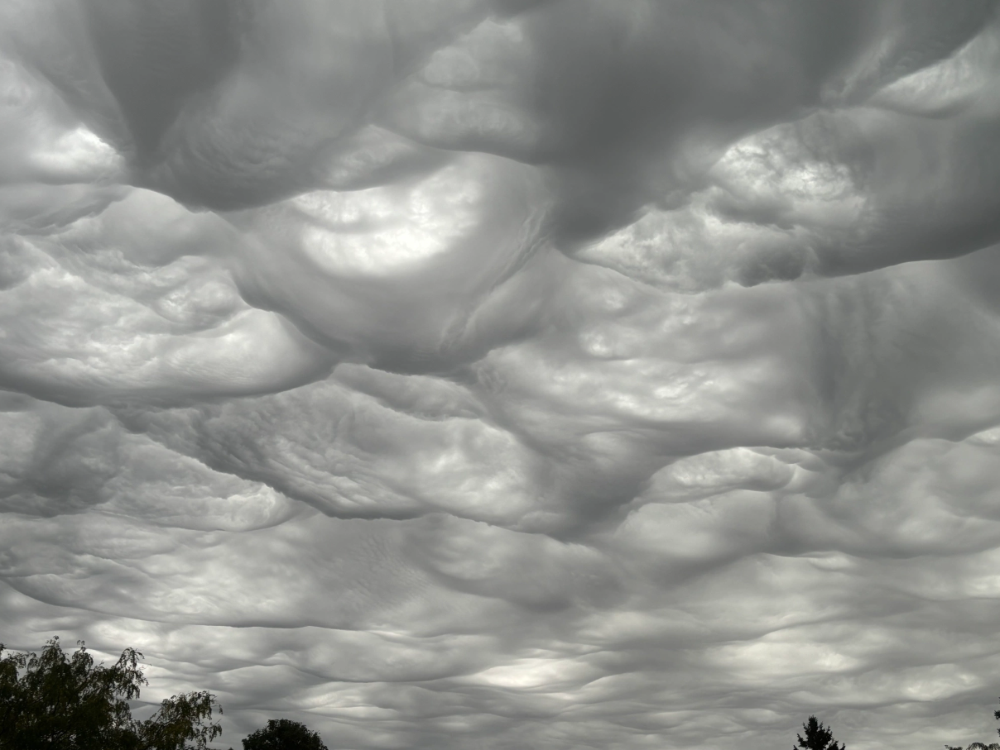
    <figcaption>Zander Federico &mdash; Exercise 04, Task 04.01</figcaption>
  </figure>
  <figure class="pgs-tile">
    
    <figcaption>Zander Federico &mdash; Exercise 04, Task 04.01</figcaption>
  </figure>
  <figure class="pgs-tile">
    
    <figcaption>Zander Federico &mdash; Exercise 04, Task 04.01</figcaption>
  </figure>

### Task 04.02 – Randomness or Noise as Design Element

  <figure class="pgs-tile">
    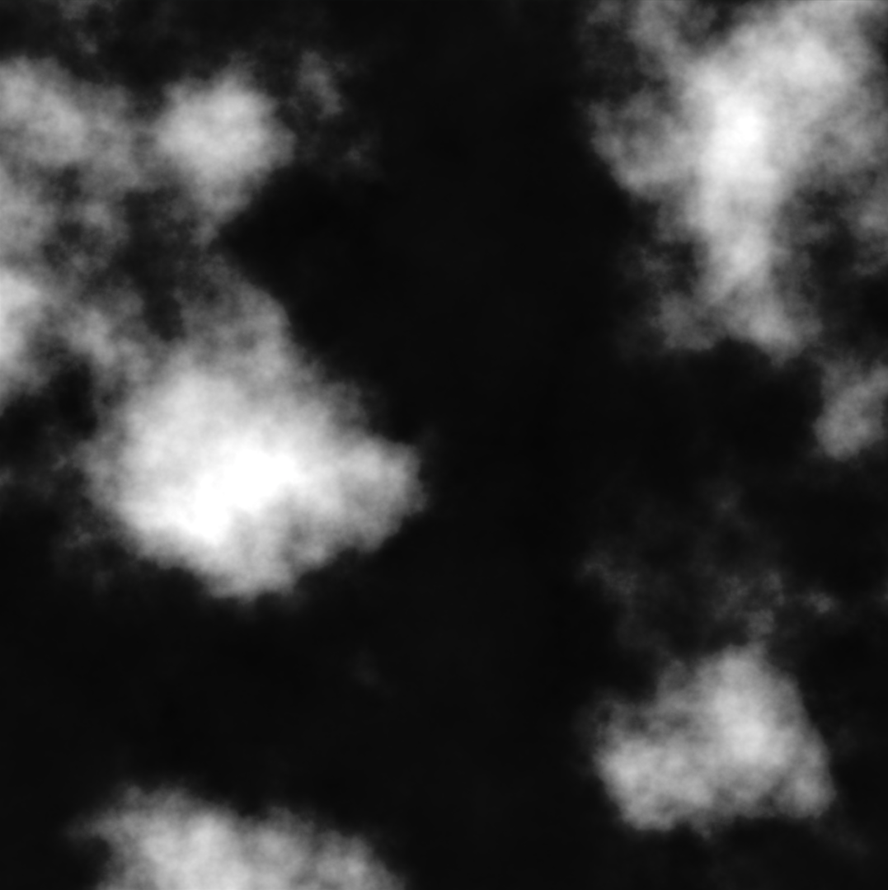
    <figcaption>Zander Federico &mdash; Exercise 04, Task 04.02</figcaption>
  </figure>

