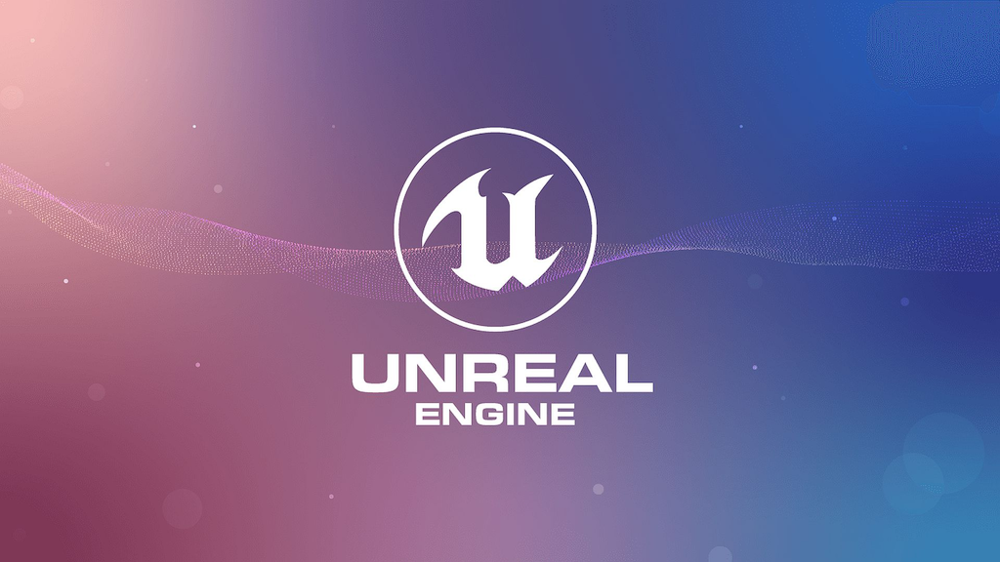

# Procedural Generation and Simulation

Prof. Dr. Lena Gieseke \| l.gieseke@filmuniversitaet.de  
  

# Unreal Engine 5

* [What is Unreal?](#what-is-unreal)
* [Unreal vs. Unity](#unreal-vs-unity)
* [Unreal in Virtual Production](#unreal-in-virtual-production)
* [Tutorials and Resources](#tutorials-and-resources)
    * [Text Based](#text-based)
    * [Video Tutorials](#video-tutorials)
    * [First Steps Tutorials](#first-steps-tutorials)
* [Features](#features)
    * [Assets and the Market Place](#assets-and-the-market-place)
    * [Marketplace](#marketplace)
    * [Quixel Bridge](#quixel-bridge)
    * [Megascans](#megascans)
    * [Content Browser](#content-browser)
    * [Project Organisation](#project-organisation)
    * [Level and Maps](#level-and-maps)
    * [Actors](#actors)
        * [ChatGPT 4.o "In Unreal Engine \>5, what is an actor?":](#chatgpt-4o-in-unreal-engine-5-what-is-an-actor)
        * [Components](#components)
    * [Material Editor](#material-editor)
    * [Blueprints](#blueprints)
        * [ChatGPT 4.o "In Unreal Engine \>5, what is a blueprint?":](#chatgpt-4o-in-unreal-engine-5-what-is-a-blueprint)
    * [The Procedural Generation Plugin](#the-procedural-generation-plugin)
        * [Tutorials](#tutorials)
        * [Procedural Workflows](#procedural-workflows)
    * [Niagara](#niagara)
        * [Tutorials](#tutorials-1)
    * [Post-Processing](#post-processing)
    * [Nanite](#nanite)
    * [Lumen](#lumen)
    * [HLSL](#hlsl)
* [References](#references)

*Please note that not all links in this script are updated to 2026. I will do so topic by topic.*

## What is Unreal?

[[pcgamesn]](https://www.pcgamesn.com/unreal-engine-5-demo)

* [Unreal Engine 5 - Sizzle Reel 2024](https://www.youtube.com/watch?v=tNwG-M-q0lI&t=8s)
* [Unreal Creators Showcase - GDC 2024](https://www.youtube.com/watch?v=7-oiuy0Vnpw)

* 3D computer graphics game engine developed by Epic Games
* Made attractive changes to product offerings due to the commercial success of Fortnite
    * Reduced Marketplace revenues (30% to 12%)
    * Waived royalties margin for games until developers have earned US$1 million in revenue and the fee is waived if developers publish on the Epic Games Store
    * Epic MegaGrants
    * Fellowships
* Direct competitor of Unity, with Unity being more popular (by game count)
    * Market share in 2024 was ca. 28% (Unreal) vs. 50% (Unity) for games on Steam
    * Revenue share in 2024 was ca. 31% (Unreal) vs. 26% (Unity) on Steam

[[1]](https://en.wikipedia.org/wiki/Unreal_Engine)  

## Unreal vs. Unity

Unity

* Best for creating simple mobile apps, cross-platform
* Speedy coding with C#
* Powerful asset store
* Graphic polishing needs time and work (if at all possible)
* Rendering can get slow without optimization
* Easy to use

Unreal

* Highest quality of graphics (rendering, VFX, animation)
* Fast post-processing features
* Coding with C++ and Blueprints
* Used for film productions and virtual production
* At times a bit clumsy
* Steeper learning curve than Unity

[[2]](https://externlabs.com/blogs/unity-vs-unreal/)[[3]](https://www.evercast.us/blog/unity-vs-unreal-engine)  

## Unreal in Virtual Production

[[mages.edu.sg]](https://mages.edu.sg/blog/unreal-engine-and-virtual-production/)

* [Virtual Production Sizzle Reel 2022 - Unreal Engine](https://www.youtube.com/embed/_oMH_gy7r60)

## Tutorials and Resources

### Text Based

* [Official Unreal 5 Documentation](https://dev.epicgames.com/documentation/en-us/unreal-engine/unreal-engine-5-3-documentation) (make sure to select the Unreal version, you are using)
    * Bookmark this page, this should be your go-to place for Unreal questions
    * Beginner content: [Understanding the Basics of Unreal](https://dev.epicgames.com/documentation/en-us/unreal-engine/understanding-the-basics-of-unreal-engine?application_version=5.3)
* [Epic Games Dev Community](https://dev.epicgames.com/community/)
    * This is an online forum for everything Unreal related, sorted by topics and level of advancement
    * The page also has a [learning portal](https://dev.epicgames.com/community/unreal-engine/learning), where one can search through content such as [beginner tutorials](https://dev.epicgames.com/community/unreal-engine/learning?is_beginner=true)
* [Unreal Community Wiki](https://unrealcommunity.wiki/)
    * Content is provided by the Unreal community
* [80.lv](https://80.lv/)
    * Unreal news, examples and tutorials of projects created by artists sometimes along with breakdowns of their process
    * Text and video tutorials.
* [Kodeco](https://www.kodeco.com/library?q=Unreal)
    * Text based tutorials 
    * For example there is a [tutorial for Blueprints](https://www.kodeco.com/36212581-unreal-engine-5-blueprints-tutorial) 

### Video Tutorials

* [Official Unreal Youtube](https://www.youtube.com/user/UnrealDevelopmentKit/playlists)
* [Artstation](https://www.artstation.com/learning/unreal-engine)
* [William Fauchner](https://www.youtube.com/channel/UCGKjGGjdl-GzEcFPf1EQwqw)
    * This is a VFX/CGI professional artist who has worked for Marvel and HBO. These tutorials are mainly for cinematics in UE in contrast to game development. They are high quality and well explained but not for absolute beginners. Also has very nice and short introductory videos explaining Unreal functionalities such as Nanite or Lumen.
* [Ben Cloward](https://www.youtube.com/@BenCloward)
    * Good resource for shaders and post-processing effects.
* [Matthew Wadstein](https://www.youtube.com/@MathewWadsteinTutorials)
    * Currently the most extensive resource for blueprints. Unfortunately all tutorials are for UE4, however the majority of the content is still applicable to UE5. 
* [Virtus Learning Hub](https://www.youtube.com/@VirtusEdu)
    * Popular youtube channel with very condensed tutorials of unreal development fundamentals. 

### First Steps Tutorials

* [Your First Hour in Unreal Engine - Epic](https://dev.epicgames.com/documentation/unreal-engine/first-hour-in-unreal-engine)
* Playlist: [Unreal Engine 5 Beginner Tutorial 2025: Introduction - Bad Decisions Studio](https://www.youtube.com/watch?v=L9qixi858Ag&list=PLIn-yd4vnXbjWeYqU7epakdnVzoysMToy)
    * Explains UE as a rendering tool: [Unreal Engine 5 Beginner Tutorial Part 19: Render Setting & Console Commands - Bad Decisions Studio](https://www.youtube.com/watch?v=lhGweZQIQ6s&list=PLIn-yd4vnXbjWeYqU7epakdnVzoysMToy&index=20)
* [Unreal Engine 5 Beginner Tutorial | Getting Started (2026)](https://www.youtube.com/watch?v=gBIFMoFkZP4&t=1537s)
* [How to Make Your First Game in Unreal Engine 5 in 2026 - Full Beginner Course](https://www.youtube.com/watch?v=e_SPuvO_l1w)
* As a start, a good idea is also to browse through the [content examples](https://dev.epicgames.com/documentation/unreal-engine/content-examples-sample-project-for-unreal-engine?application_version=5.7) provided by Unreal, which contain maps showcasing different concepts and functionalities.
* [Unreal Engine 5 Beginner Tutorial - UE5 Starter Course - Unreal Sensei](https://www.youtube.com/watch?v=k-zMkzmduqI) (5 hours!)

## Features

### Assets and the Market Place

### Marketplace

The Marketplace is the source of thousands of digital assets, which one can use for their 3D projects including plugins, blueprints, animations, 3D models, characters and so on. There are many free assets available, but the ones of good quality are unfortunately, usually paid. 

### Quixel Bridge
Quixel Bridge is a very widely used plugin, which lets you access the Megascans library to bring environments, materials, and MetaHumans into Unreal Engine.

[Here](https://docs.unrealengine.com/5.0/en-US/quixel-bridge-plugin-for-unreal-engine/) is a tutorial on how to set it up.

### Megascans
Megascans is often used as a source for terrains and vegetation in Unreal scenes. It is a massive online library of physically-based scans, be it full 3D scans all the way from giant objects to small debris, high-resolution vegetation atlases, tileable surfaces, sculpting brushes, scan-based 3D plants and tree systems and more. They are free for use.

Source: [80.vl](https://80.lv/articles/quixel-megascans-scanning-materials-for-games-film/)

### Content Browser

The Content Browser is the primary area of the Unreal Editor for creating, importing, organizing, viewing, and managing content Assets within your Unreal project. You can also use it to manage content folders and perform specific Asset operations, such as: 
* Browse to and interact with all of the Assets in your project.
* Find Assets using a text filter, which you can optionally combine with more advanced filtering.
* Organize Assets into private, local, or shared collections.
* Identify Assets that might contain problems.
* Migrate Assets between content folders or to a different project. 

Source: [UE 5.3 Documentation - Content Browser](https://dev.epicgames.com/documentation/en-us/unreal-engine/content-browser-in-unreal-engine?application_version=5.3)

Further resources:

* [Content Browser Explained: 7 Expert Tips You Should Know! (UE5)](https://gamedevexp.com/unreal-engine-content-browser/)

### Project Organisation

How you organize your project is of course completely up to your own preferences and judgement. However, it is usually good practice to establish a cohesive system, as sometimes your project folders can become very large and contain hundreds of files. There are certain general naming conventions and folder organisation strategies within the Unreal community, which might help structure your content in a way that makes it more approachable to both yourself and other developers who may want to access your project.

General Rules
* All asset dependencies should be in the same folder. (except for shared assets)
* Asset type determines prefix.
Blueprint is *BP_assetname_01*
* Certain types (eg. textures) use a suffix to specify sub-types. Eg. 
*T_Grass_01_N* for normal maps
* Use underscores to split type from identifier and numeric values. Eg. 
*SM_DoorHandle_01*
* Use numeric values with 2 digits. Eg. 
*SM_Pipe_01*

All game content is placed in a sub-folder. eg. *Content/MyGame/UI/…* This helps in migrating between projects and splitting your content from marketplace packs that are added like *Content/MyMarketplacePack/…*

Here is a [condensed naming convention guide](https://www.tomlooman.com/unreal-engine-naming-convention-guide/) and a very extensive [style guide](https://github.com/Allar/ue5-style-guide) you can apply to your Unreal projects.

### Level and Maps

* Unreal Documentation: [Levels](https://dev.epicgames.com/documentation/en-us/unreal-engine/levels-in-unreal-engine), [Working with Levels](https://dev.epicgames.com/documentation/en-us/unreal-engine/working-with-levels-in-unreal-engine)
* Video: [Unreal Engine: Understanding Maps, Levels, and Sublevels using the Levels Tab](https://www.youtube.com/watch?v=o7JVENd7Jq0)
* Text-based tutorial: [Levels: Unreal Engine 5 (Beginner’s Guide)](https://gamedevexp.com/unreal-engine-levels/)

A **Level** is all or part of your game's "world". Levels contain everything a player can see and interact with, like environments, usable objects, other characters, and so on. Unreal Engine saves each Level as a separate .umap file, which is why you will sometimes see Levels referred to as **Maps**.

You will always have a **Persistent Level**, and you can have one or [more sublevels](https://docs.unrealengine.com/5.1/en-US/managing-multiple-levels-in-unreal-engine/) that are always loaded or are streamed in with Level Streaming Volumes, Blueprints, or C++ code. 

### Actors

An Actor is any object that can be placed into a level, such as a Camera, static mesh, or player start location. Actors support 3D transformations such as translation, rotation, and scaling. They can be created (spawned) and destroyed through gameplay code (C++ or Blueprints).

Source: [UE 5.0 Documentation - Components](https://dev.epicgames.com/documentation/en-us/unreal-engine/components-in-unreal-engine?application_version=5.0)

#### ChatGPT 4.o "In Unreal Engine >5, what is an actor?":

In Unreal Engine 5, an Actor is one of the most fundamental classes in the engine — it’s the base class for any object that can be placed or spawned in a level.

Key Points about Actors:
* Definition: An Actor is a container for components and logic that defines behavior in the world. It exists in the 3D world and has a transform (position, rotation, scale).
* Examples: Static meshes, lights, cameras, characters, triggers, and custom gameplay objects — all are types of Actors.
* Components: Actors are made up of Components, like:
* StaticMeshComponent (for visible geometry),
* CameraComponent,
* AudioComponent, etc.
  
These components define the functionality and appearance of the Actor.
* Blueprint or C++: You can create Actors using Blueprints (visual scripting) or in C++ (code-based logic).
* Types of Actor subclasses include:
* Pawn – actors that can be controlled by players or AI.
* Character – a more complex pawn with movement and animation.
* GameMode, GameState, PlayerController, etc. – special actors for game management.

Summary:  
  
An Actor in Unreal Engine 5 is a basic building block of the world — anything that has a presence in a level and can interact with other objects or be manipulated is likely an Actor or derived from it.

#### Components

Components are a special type of Object that Actors can attach to themselves as sub-objects. Components are useful for sharing common behaviors, such as the ability to display a visual representation, play sounds. They can also represent project-specific concepts, such as the way a vehicle interprets input and changes its own velocity and orientation. For example, a project with user-controllable cars, aircraft, and boats could implement the differences in vehicle control and movement by changing which Component a vehicle Actor uses.

Source: [UE 5.0 Documentation - Components](https://dev.epicgames.com/documentation/en-us/unreal-engine/components-in-unreal-engine?application_version=5.0)

### Material Editor

Materials tell the engine exactly how a surface should interact with the light in your scene. Materials define every aspect of a surface, including color, reflectivity, roughness, transparency, and so on. Materials are built by combining nodes called Material Expressions in a shader graph and passing the results into the inputs on the Main Material Node. 

As with your assets, there are also certain [organisational strategies](https://docs.unrealengine.com/5.1/en-US/organizing-a-material-graph-in-unreal-engine/) you can apply to your material graphs. 

Another important concept is **Material Instances**, which allows you to change the appearance of a Material without incurring an expensive recompilation of the Material. This means you do not have to edit the material graph itself each time you want to create a variation of a material, but you can **promote** certain parameters, which can be changed within the instances themselves. 

* [SARKAMARI - UE5 Series: 02 Intro to Materials in UNREAL Engine 5](https://www.youtube.com/watch?v=N4PT3FhW_wU)

### Blueprints

A Blueprint is a visual scripting system that allows you to create gameplay mechanics, object behavior, and interactions without writing code from within Unreal Editor. As with many common scripting languages, it is used to define object-oriented (OO) classes or objects in the engine.
  
A Blueprint is a visual representation of an Unreal C++ class, allowing you to:
* Design logic and interactivity using nodes and connections
* Add components (meshes, lights, sounds, etc.)
* Override functions and respond to events (e.g., collisions, button presses)

This system is extremely flexible and powerful as it provides the ability for designers to use virtually the full range of concepts and tools generally only available to programmers. In addition, Blueprint-specific markup available in Unreal Engine's C++ implementation enables programmers to create baseline systems that can be extended by designers. 

* [Unreal Engine Blueprints Tutorials – Complete Guide](https://gamedevacademy.org/unreal-blueprints-tutorial/)
* [Blueprint Variables: What you need to know](https://www.unrealdirective.com/articles/blueprint-variables-what-you-need-to-know)
* [10 Tips for Blueprint Organization in Unreal Engine](https://www.techarthub.com/10-tips-for-blueprint-organization-in-unreal-engine/)

#### ChatGPT 4.o "In Unreal Engine >5, what is a blueprint?":

### The Procedural Generation Plugin
The Procedural Generation Plugin has been introduced as an experimental feature with Unreal 5.2, which has just been released. It allows for procedural workflows within real-time with which you can for example use to define rules and parameters to populate large scenes with Unreal Engine assets of your choice.

#### Tutorials

* Unreal Engine - [Procedural Content Generation in UE5: GDC 2023](https://www.youtube.com/watch?v=aoCGLW53fZg&t=324s) 
* Gorka Games - [NEW Unreal Engine 5.2 Procedural Plugin Tutorial - How to Use It Very Easy!](https://www.youtube.com/watch?v=0YiDT08W_q8)
* UnrealityBites - [UE5.2: Procedural Content Generation (inc. how to exclude zones)](https://www.youtube.com/watch?v=RBFvkfZxJJk), [UE5.2: Dramatically Improve Moving Foliage Performance using this PCG parameter](https://www.youtube.com/watch?v=9DY9Xe1KRW8)
* UNF Games - [Procedural Content Generation Tutorial Unreal Engine 5 - Create a Forest](https://www.youtube.com/watch?v=8c1t4Pok_E8)

#### Procedural Workflows

There are some practical guidelines, you can keep in mind in order to adhere to a procedural workflow:

* Always think about your work as creating a process, rather than a thing
    * For example, don't make a table, but a procedure that builds tables and which is adaptable
* Avoid viewport tool interactions
* Avoid traditional box modeling workflows
* Avoid modeling operations that are dependent on specific point or primitive numbers
* Think about what needs manual art-direction and what can be left to your system to handle
* Changes upstream should never break the network downstream

### Niagara

Niagara is Unreal Engine's VFX system, it allows you to create particle effects, complex animations, liquids and so on. 
The main terminology for Niagara is as follows:

A Niagara **system** contains all of the components that build the effect. Inside that system, you may have different building blocks that stack up to help you produce the overall effect.

**Emitters** are where particles are generated in a Niagara system. An emitter controls how particles are born, what happens to the particles as they age, and how the particles look and behave.

The emitter is organized in a **stack**. Inside that stack are several groups, inside which you can put modules that accomplish individual tasks. The groups are as follows.

* Emitter Spawn (initial setups and defaults) and Update (occur every frame)
* Particle Spawn and Update (follows same rules as above)
* Event Handler (create *Generate* and *Listening*, which trigger actions between different emitters)
* Render (define the display of the particle and set up one or more renderers for your particles)

**Modules** are the sub-blocks of emitters. They are built using High-Level Shading Language (HLSL), but can be built visually in a Graph using nodes. 
You can create functions, include inputs, or write to a value or parameter map.

**Parameters** are an abstraction of data in a Niagara simulation. Parameter types are assigned to a parameter to define the data that parameter represents.

You can find a more detailed overview of Niagara systems within the [Unreal documentation](https://docs.unrealengine.com/5.1/en-US/overview-of-niagara-effects-for-unreal-engine/). 

#### Tutorials

##### Introduction

There are various introductory tutorials for Niagara in different lengths, complexity etc. on Youtube. Just search for Niagara on Youtube and go with what looks good to you, e.g.:

* [Youtube, My GameDev Pal: UE5 Niagara in 300 Seconds](https://www.youtube.com/watch?v=Wxx_2ZLoKbI)
* [Youtube, My GameDev Pal: UE5 Visual Effects](https://www.youtube.com/playlist?list=PLuGJ2Hd3jyy1BqrVyX9YbmRPKggAv8DI8)
* [Youtube, unreal magic: Niagara system beginner tutorial in unreal engine 5](https://www.youtube.com/watch?v=_6YbcMhfHWg&t=40s)
* [Youtube, PrismaticaDev: Intro to Niagara Particles](https://www.youtube.com/watch?v=04k9JDx-KTM&list=PLUi8nuTUEtTshYxpmR7brPE3tV7JsO0VP&pp=iAQB)
* [Youtube, CGHOW: Unreal Engine 5 Niagara Beginner Tutorial - UE5 Niagara Starter Course!](https://www.youtube.com/watch?v=NcJ1ZP7tFUk)
* [Youtube, Mr. Hollt: Learn This UNREAL 5 NIAGARA Particle Sim](https://www.youtube.com/watch?v=hcGDnIqXlXw&t=34s)

Beyond Youtube there are not that many resources yet, but we do recommend any material from the official documentation:

* [Niagara Tutorials](https://docs.unrealengine.com/5.1/en-US/tutorials-for-niagara-effects-in-unreal-engine/)

##### Special Topics

For topic-specific tutorials, have a look into these:

* [Youtube, Ghislain Girardot: A deep dive into Boids using Niagara in Unreal Engine](https://www.youtube.com/watch?v=9iDA6WMqEyQ) (55min)
* [Youtube, CGHOW: Magical Trails ](https://www.youtube.com/watch?v=N3Bwa_urhG8) (18 mins)
* [Youtube, CGHOW: Nebulae](https://www.youtube.com/watch?v=4DoiE8Amxro) (8 mins)
* [Youtube, CGHOW: Ribbons](https://www.youtube.com/watch?v=92z2tA8ZrEI) (16 mins)
* [Youtube, CGHOW: Disintegration](https://www.youtube.com/watch?v=4dYg4bvf4Rc) (27 mins)
* [Youtube, CGHOW: Chladni Patterns Niagara](https://www.youtube.com/watch?v=CrOWIqJcguM) (23 mins)
* [Youtube, renderBucket: Unreal Engine 5 Flamethrower](https://www.youtube.com/watch?v=k3EBxQGVSj8) (2 Parts: 18 and 14 mins)
* [Youtube, FXology: Tentacles in Niagara](https://www.youtube.com/watch?v=aDDCKeEWt4g&t=861s) (22 mins)
* [Youtube, Sem Schreuder: Let's build this Unreal Niagara audio visualizer within 10 minutes](https://www.youtube.com/watch?v=aDDCKeEWt4g&t=861s) (Unreal 4!)(11 mins)

##### Fluids

* [Official Unreal: Niagara Fluids Learning Path for Beginners (Niagara Fluid Plugin)](https://dev.epicgames.com/community/learning/paths/mZ/niagara-fluids)
* [Working with Niagara Fluids to Create Water Simulations](https://80.lv/articles/working-with-niagara-fluids-to-create-water-simulations/)
* [Youtube, UNF Games: Unreal Engine 5 Niagara Fluids Tutorial for Beginners](https://www.youtube.com/watch?v=kGG4xTTbF_I) (51 Minutes)
* [Youtube, renderBucket: Niagara Fluids & Intro To FLIP Fluids/3D Water & Foam](https://www.youtube.com/watch?v=1pISJAPjDS4) (21 Minutes)

### Post-Processing

Post Process Effects allow us to tweak the overall look and feel of the scene. Examples of elements and effects include bloom (HDR blooming effect on bright objects), ambient occlusion, tone mapping, but also "camera lens" settings such as depth of field and exposure. 

To use Post-Processing effects within your scene, you have to first add a *Post Process Volume* into your level. It will look like an empty box, which you have to resize it to cover all the elements within your scene (or just the ones you want the effect applied to). There is also an official [Post-Processing Unreal tutorial](https://dev.epicgames.com/community/learning/courses/pE2/unreal-engine-introducing-post-processing/mZ11/unreal-engine-introducing-post-processing-overview) on this very topic. 

### Nanite

Nanite is Unreal Engine 5's new virtualized geometry system, which uses a new internal mesh format and rendering technology to render pixel scale detail and high object counts.

Source: [CGHero Glossary](https://cghero.com/glossary/what-is-nanite)

To put it simply, it allows you to place complex 3D models (for example with high poly counts) into your scene and optimized them to work in real-time. Using it is rather simple as well - when you import a mesh, you can choose to import it as either a static mesh or a nanite mesh within your settings. There is also an Epic games tutorial on [Nanite Essentials](https://dev.epicgames.com/community/learning/courses/rwK/nanite-essentials/vK2/introduction-to-nanite-essentials) available as well. 

### Lumen

Lumen is a fully dynamic global illumination and reflections system, which now serves as the default illumination and reflection system in Unreal Engine 5. It is based on ray-tracing, or a more optimised, hybrid version of it. Lumen was introduced as an alternative to static light systems, which would require light [baking](https://vintay.medium.com/difference-between-realtime-mixed-and-baked-lighting-in-unity-6bda1f24bfb#:~:text=Baked%20Lighting%20Mode%3A,just%20prior%20to%20project%20release), which was a very time consuming process. 

This [video](https://www.youtube.com/watch?v=1e6oOiKh91U&t=12s&pp=ygUPbHVtZW4gZXhwbGFpbmVk) by William Fauchner, provides a clear explanation of Lumen and its functionalities and so does this Epic Games [Lumen tutorial](https://dev.epicgames.com/community/learning/courses/2Wo/lumen-essentials/dL16/introduction-to-lumen-essentials).

Sources: [CGHero Glossary](https://cghero.com/glossary/what-is-lumen)

### HLSL

HLSL is the C-like high-level shader language. It is the default shading language within Unreal.
 
Behind the scenes, material node graphs within Unreal are silently translated to HLSL. You can view the HLSL code of a Material by going to Window > Shader Code > HLSL Code in the Material Editor. You cannot directly edit HLSL shader code within the Unreal Editor, but you can create nodes, which contain custom HLSL code.

## References
  
[[1] Wiki - Unreal Engine](https://en.wikipedia.org/wiki/Unreal_Engine)  
[[2] Extern Labs - Unity vs. Unreal](https://externlabs.com/blogs/unity-vs-unreal/)  
[[3] Evercast - Unity vs. Unreal Engine](https://www.evercast.us/blog/unity-vs-unreal-engine)  
  

---

The End

👩🏻‍🎤 🦹🏽‍♂️ 🧙🏻‍♂️