# Procedural Generation and Simulation

Prof. Dr. Lena Gieseke \| l.gieseke@filmuniversitaet.de \| Film University Babelsberg KONRAD WOLF


# Function Design

* [Topics](#topics)
* [Learning Objectives](#learning-objectives)
* [Environment](#environment)
* [2D Design](#2d-design)
    * [1D Examples](#1d-examples)
* [Example Circle Pattern](#example-circle-pattern)
    * [1. Radial Layout](#1-radial-layout)
    * [2. Ridges](#2-ridges)
    * [3. Repetitive Cells](#3-repetitive-cells)
    * [4. Mirroring in x and y](#4-mirroring-in-x-and-y)
* [Building Blocks](#building-blocks)
* [Transitions](#transitions)
    * [Step Function](#step-function)
    * [Linear Interpolation](#linear-interpolation)
    * [Bilinear Interpolation](#bilinear-interpolation)
    * [Trilinear Interpolation](#trilinear-interpolation)
    * [Interpolation Functions](#interpolation-functions)
    * [Smooth Step](#smooth-step)
    * [Bias and Gain](#bias-and-gain)
        * [Bias](#bias)
        * [Gain](#gain)
    * [Interpolation in Houdini](#interpolation-in-houdini)
    * [Interpolation in CSS](#interpolation-in-css)
* [Function Primitive Components](#function-primitive-components)
    * [Modulo](#modulo)
    * [Floor](#floor)
    * [Sign](#sign)
    * [Absolute](#absolute)
    * [Min and Max](#min-and-max)
* [Periodicity](#periodicity)
    * [Square](#square)
    * [Sawtooth](#sawtooth)
    * [Triangle](#triangle)
* [Advanced Shapes](#advanced-shapes)
    * [Pulse](#pulse)
    * [Parabola](#parabola)
    * [Impulse](#impulse)
    * [Power Curve](#power-curve)
    * [Sinc Curve](#sinc-curve)
* [Design Goals](#design-goals)
* [Next](#next)
    * [Tilings](#tilings)
* [References](#references)

In the last chapter we were looking at existing numbers and curve equations. Even though that was a lot of fun and beautiful, those equations are also somewhat limited in their possible usage and designs. Hence, in this chapter we are going to have a look into how to combine functions to come up with individual designs. 

For function designs the ultimate rock star / god / person of incredible awesomeness is [Inigo Quilez](http://www.iquilezles.org). His [articles page](http://www.iquilezles.org/www/index.htm) is a resource of unmeasurable value. If interested, check out his explanations on [Making a heart with mathematics](https://www.youtube.com/watch?v=aNR4n0i2ZlM) (which is a somewhat advanced example though).

[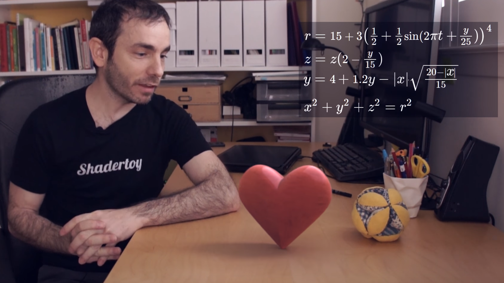](https://www.youtube.com/watch?v=aNR4n0i2ZlM)

If you ever try to win the heart of a mathematician, here some inspiration:

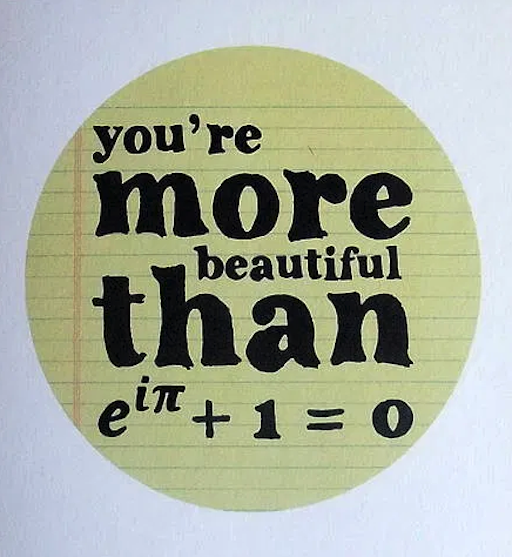  
[[notonthehighstreet]](https://i2.wp.com/www.notonthehighstreet.com/system/product_images/images/001/458/342/original_mathematics-formula-valentine-s-day-card.jpg)  
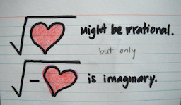  
[[melaniedreams]](https://melaniedreams.files.wordpress.com/2012/02/v1.jpg?w=329&h=192)  
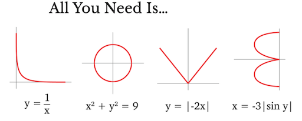  
[[mor.news]](https://mor.news/2019/07/07/all-you-need-is/)  
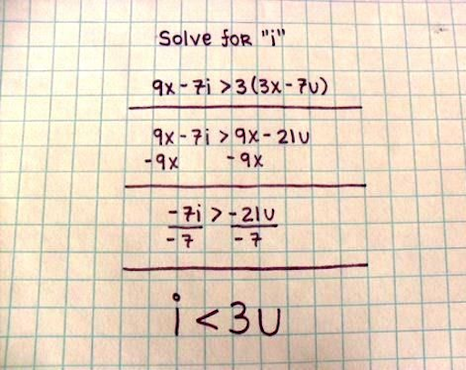  
[[pinimg]](https://i.pinimg.com/originals/1b/cc/d7/1bccd7db44c93fac51ad995aa5996dfd.jpg)  

or [TED Talk: The Mathematics of Love by Hannah Fry.](https://www.ted.com/talks/hannah_fry_the_mathematics_of_love)  

You are welcome.

## Topics

* Transitions
* Primitive Components
* Periodicity

## Learning Objectives

With this chapter, you will

* gain an intuitive understanding of the visual qualities of different operators and function components.
* gain some understanding of how to put the different function components together to create a specific design goal.

*How does the following look like when plotted in a 2D Cartesian coordinate system?*

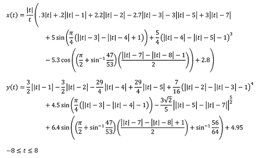  
[[geogebra]](https://www.geogebra.org/m/Wkjz2X92)  

You are right, [it is Batman!](https://www.youtube.com/watch?v=oaIsCJw0QG8&feature=youtu.be)

[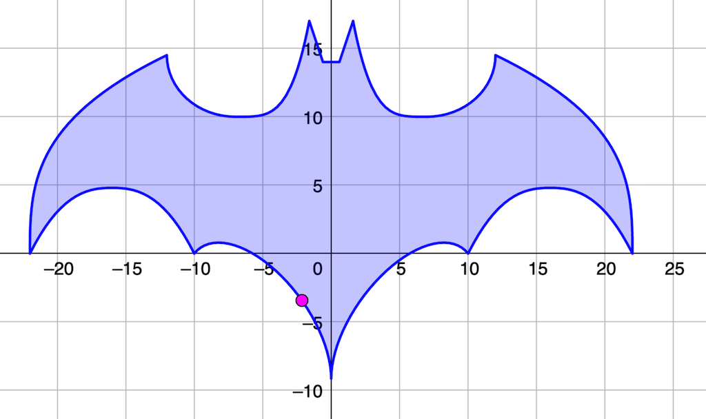](https://www.geogebra.org/m/Wkjz2X92)  
[[geogebra]](https://www.geogebra.org/m/Wkjz2X92)  

By slicing together different functions, you can achieve many different curve designs.

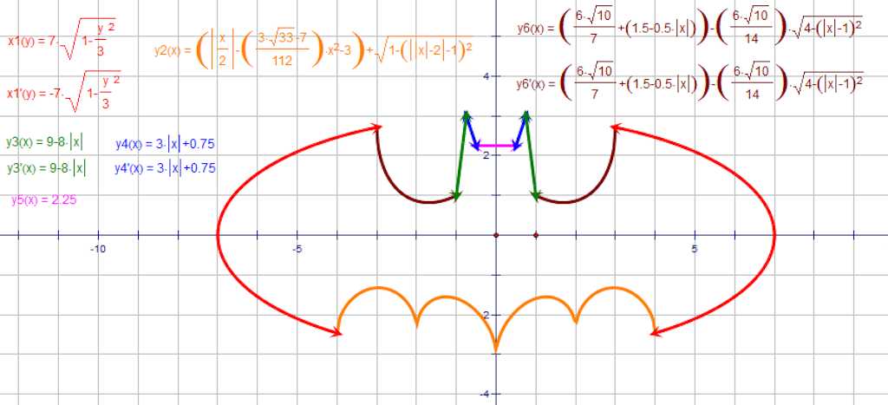  
[[math.stackexchange]](https://math.stackexchange.com/questions/54506/is-this-batman-equation-for-real)  

For now, we are having a look into somewhat simpler equations.  

The underlying idea is to modify and shape different functions and by combining these we can almost draw anything. Such individually shaped functions can be used for a variety of applications, such as textures, shading, animation, geometry, dance, etc. 

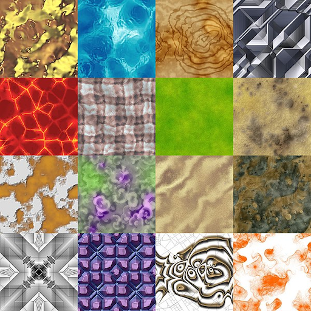  
[[wiki]](https://en.wikipedia.org/wiki/File:Tiling_procedural_textures.jpg)  

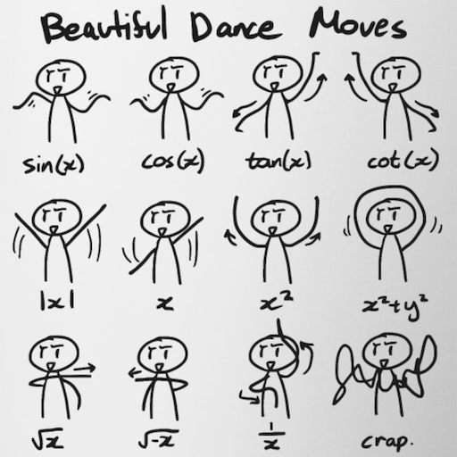  
[[webcomicms]](https://webcomicms.net/clipart-9428627-math-related-pictures)  

We will focus in this script on the generation of 2D graphics but please keep in mind that most functions are equally useful in different contexts and even dimensions.


## Environment

The examples in this section are written in GLSL (OpenGL Shading Language) and run as fragment shaders. A fragment shader is a small program that runs once per pixel and decides what color that pixel should be. This means there is no explicit loop over pixels — the GPU runs the shader in parallel for all pixels at once, which makes it very efficient.

To follow along in Visual Studio Code, you can use the [glsl-canvas Extension](https://marketplace.visualstudio.com/items?itemName=circledev.glsl-canvas), which lets you preview GLSL fragment shaders directly in the editor.

A minimal starting point looks like this:

```glsl
#ifdef GL_ES
precision mediump float;
#endif

uniform vec2 u_resolution;

void main() {

    // Normalisation of the incoming screen coordinate
    vec2 coord = (2.0 * gl_FragCoord.xy - u_resolution.xy) / u_resolution.y;

    // r, g, b channels from 0..1
    vec3 color = vec3(0.5, 0.0, 0.0);

    // Set the final "pixel" colour
    gl_FragColor = vec4(color, 1.0);
}
```

Here `gl_FragCoord.xy` gives the pixel position in screen space and dividing by `u_resolution` normalises it to the range 0..1. The final color is written to `gl_FragColor` as a four-component vector (red, green, blue, alpha).

The `#ifdef` directive, which sets the precision of our float values at the top of the file is need by the glsl-canvas extension and we can ignore it.


## 2D Design

Let’s assume we want to color a canvas, meaning giving each pixel a color value, e.g. when computing a texture.

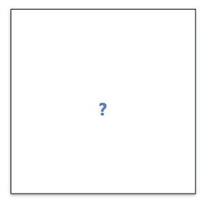  

To color this area, we can use a 2D function, meaning a function depending on two input parameters such as *x, y* in 3D space. Please note that in the following examples *z* is the up-axis of the coordinate system.

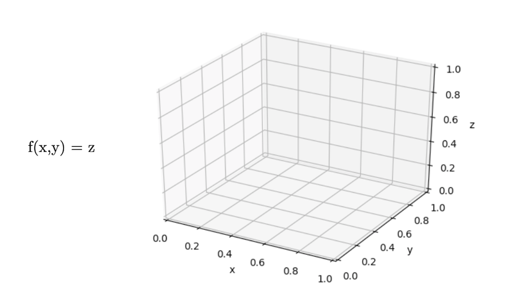  

Then we interpret the value of *f(x,y) = z*, hence *z*, as color value.

For example,

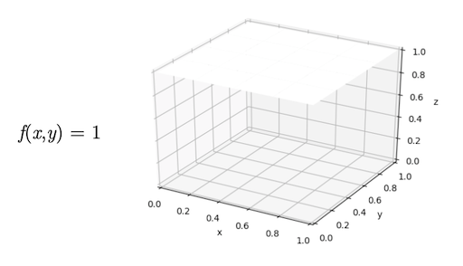  

with *z* interpreted as color value between 0..1 on a 2D canvas:

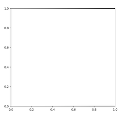.  

Or

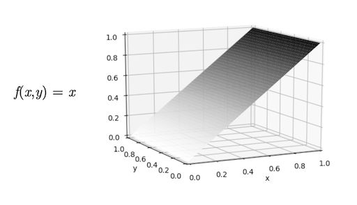  
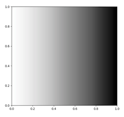  

You can imagine this as if looking in -z direction onto the plotted gray value, or as if projecting the plot onto the xy-plane.

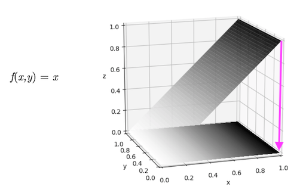  
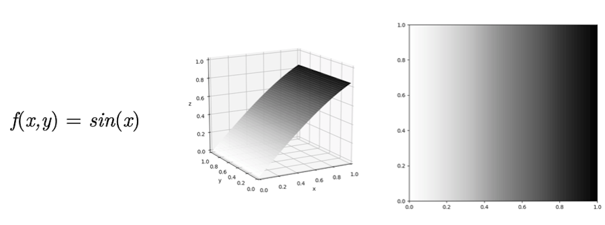  
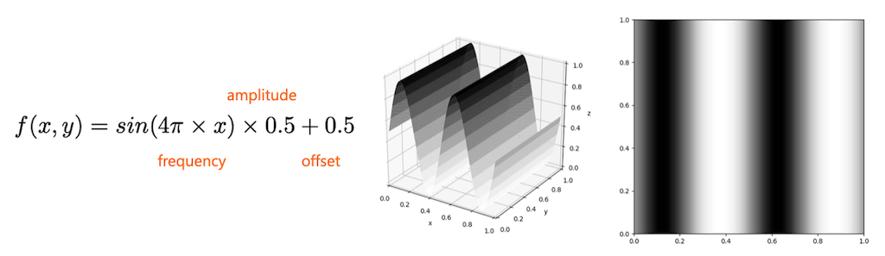  

You could also map the function value to a color range such as

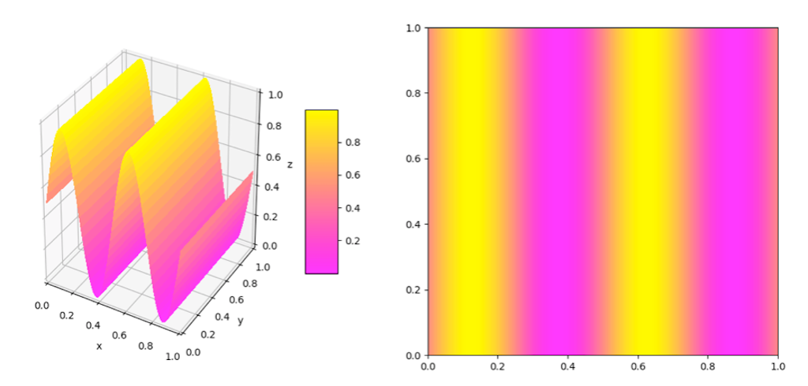  

Also, the combination of simple  functions can already lead to pleasing patterns

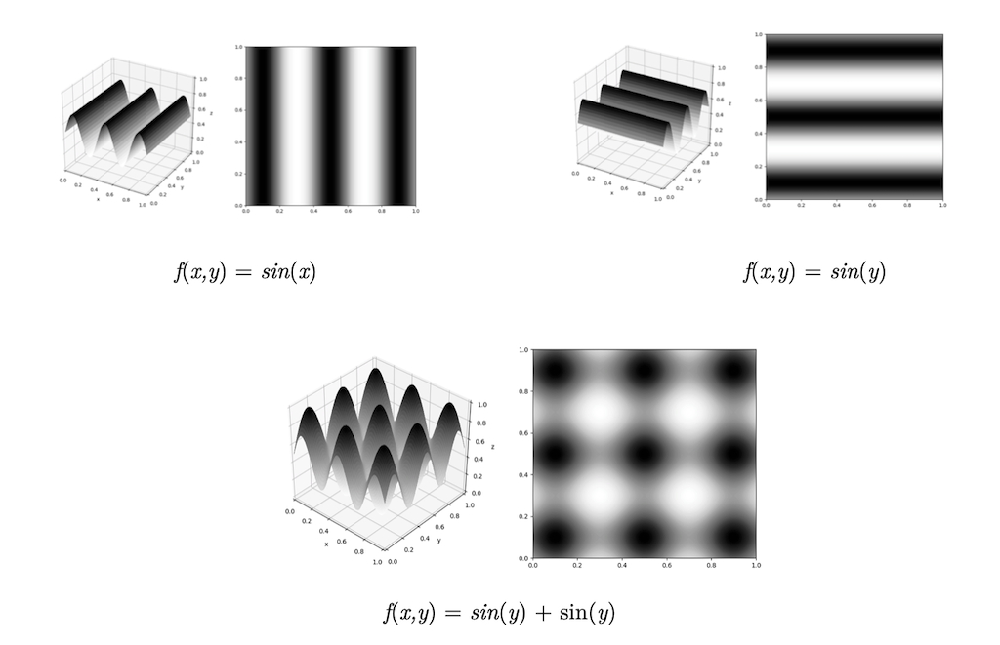  

In the above plots frequency, amplitude and offset have been adjusted but left out in the equation for simplicity.

```glsl
#ifdef GL_ES
precision mediump float;
#endif

#define PI 3.14159265359
uniform vec2 u_resolution;

void main() {
    vec2 pt = (2.0 * gl_FragCoord.xy - u_resolution.xy) / u_resolution.y;

    // Increase frequency to fit more sin waves 
    // between 0..1
    float verti = sin(8.0 * PI * pt.x);
    float hori = sin(8.0 * PI * pt.y);

    // Create vec3 from value
    vec3 color = vec3(hori + verti);

    // Assign frag color with alpha
    gl_FragColor = vec4(color,1.0);
}
```

Code rendering:  
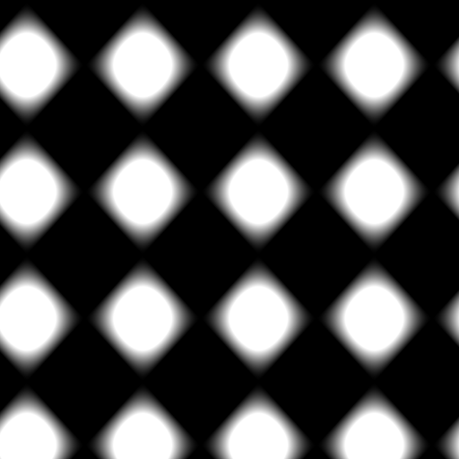  

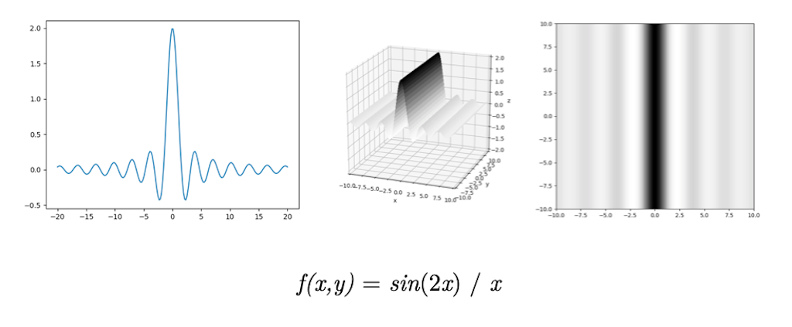  

### 1D Examples

You will often find examples and explanations in lower dimensions, meaning in 1D, as the graphs for these functions are easier to visualize:

*f(x) = c*

with *c* as the gray or color value.

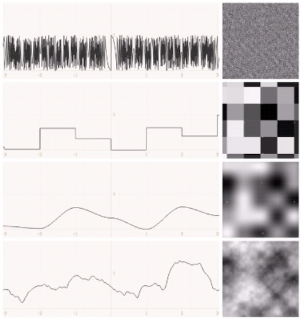  
[[tobyschachman]](http://tobyschachman.com/Shadershop/)

How to interpret in these scenarios the needed second dimension depends on the context. Often it is simply left out as an influencing parameter such as in our start example

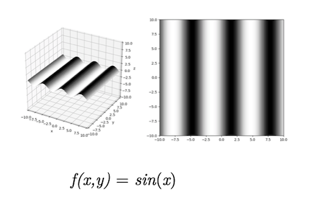  


## Example Circle Pattern

Before we dive into the specific building blocks of procedural generation algorithms, let's look at an example.

In this example, I am walking you through the steps to re-create this subtle pattern. It is a fairly easy design but practices several common approaches when putting functions together.

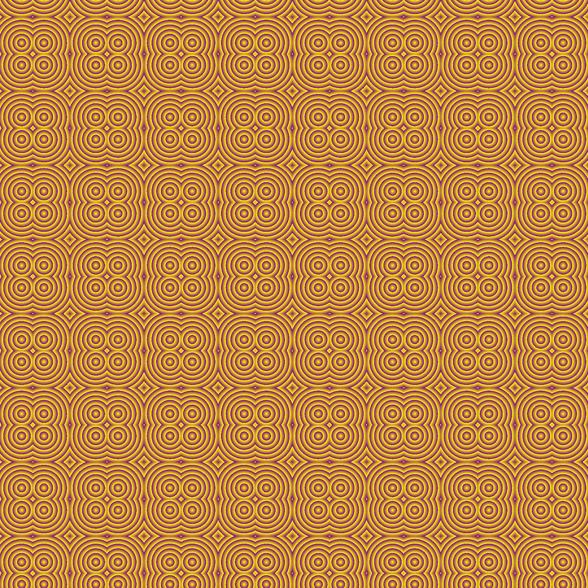  

*What do you see? What could be the steps to recreate this pattern?*


We start with the following code, which sets a fixed color to each pixel:

```glsl
#ifdef GL_ES
precision mediump float;
#endif

uniform vec2 u_resolution;

void main() {

    // Normalization of the incoming
    // screen coordinate
    vec2 coord = (2.0 * gl_FragCoord.xy - u_resolution.xy) / u_resolution.y;


    // r, g, b channels from 0..1
    vec3 color = vec3(0.5, 0.0, 0.0);

    // Set the final "pixel" color
    gl_FragColor = vec4(color, 1.0);
}
```


### 1. Radial Layout

When working on repetitive patterns, one usually starts with one cell and repeats that cell in a second step.  


Let's start with creating a circle...

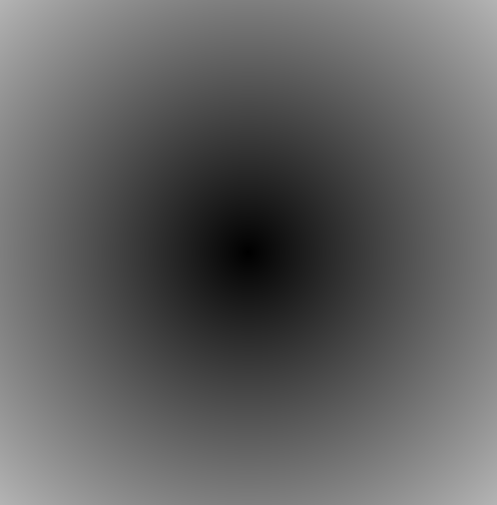

How could we create this?


...by plotting the distance of each coordinate to the center point `0.0`, `0.0`!

* The [`distance()`](https://www.khronos.org/registry/OpenGL-Refpages/gl4/html/distance.xhtml) function calculates the distance between two points.
* The [`mix()`](https://www.khronos.org/registry/OpenGL-Refpages/gl4/html/mix.xhtml) function linearly interpolates between two values.


```glsl
#ifdef GL_ES
precision mediump float;
#endif

uniform vec2 u_resolution;

void main() {

    // Normalization of the incoming
    // screen coordinate
    vec2 coord = (2.0 * gl_FragCoord.xy - u_resolution.xy) / u_resolution.y;

    // 1. Radial Layout
    float d = distance(coord, vec2(0.0));

    // 1a. Use d to interpolate between two colors
    vec3 color = mix(vec3(1.0, 1., 0.0), vec3(0.5, 0.0, 0.5), d);

    // Set the final "pixel" color
    gl_FragColor = vec4(color, 1.0);
}
```

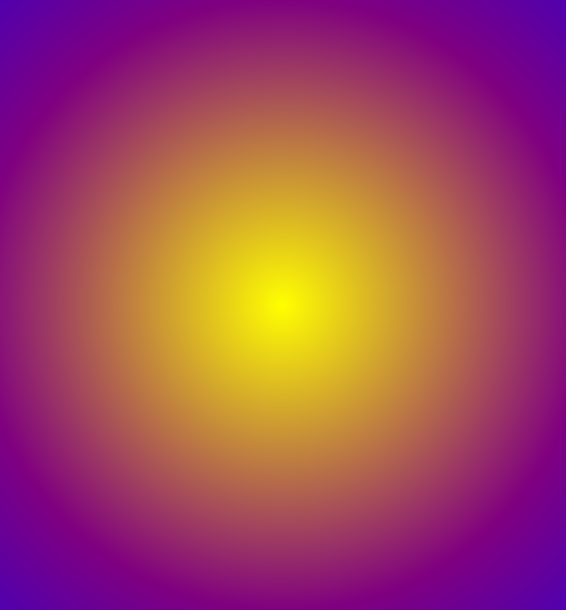  


### 2. Ridges

Next, let's create ridges with the [`floor`](https://www.khronos.org/registry/OpenGL-Refpages/gl4/html/floor.xhtml) function. We do so by manipulating `d` before using it for the interpolation between colors.

Multiplying `d` by 8 stretches the value range of the distance computation that currently runs from 0 (center point) to max. values around 1 to max. values around 8.

*On a side note*: The actual maximum distance from center depends on the canvas aspect ratio, e.g., for a square canvas the corners are at distance sqrt(2) ≈ 1.41, for 16:9 the corners reach about 2. The visible ring count is then also not exactly 8 but closer to 8 times that max distance (for a squared canvas you get around 11 rings).

Then subtracting `floor(d)` removes the integer part and keeps only the fractional remainder. The result is a value that resets to 0 every time the distance crosses a whole number, producing the concentric rings. This is equivalent to the built-in GLSL function `fract(d)`.


```glsl
#ifdef GL_ES
precision mediump float;
#endif

uniform vec2 u_resolution;

void main() {

    // Normalization of the incoming
    // screen coordinate
    vec2 coord = (2.0 * gl_FragCoord.xy - u_resolution.xy) / u_resolution.y;

    // 1. Radial Layout
    float d = distance(coord, vec2(0.0));

    // 2. Ridges
    d *= 8.0;
    d -= floor(d);

    // 1a. Use d to interpolate between two colors
    vec3 color = mix(vec3(1.0, 1., 0.0), vec3(0.5, 0.0, 0.5), d);

    // Set the final "pixel" color
    gl_FragColor = vec4(color, 1.0);
}
```


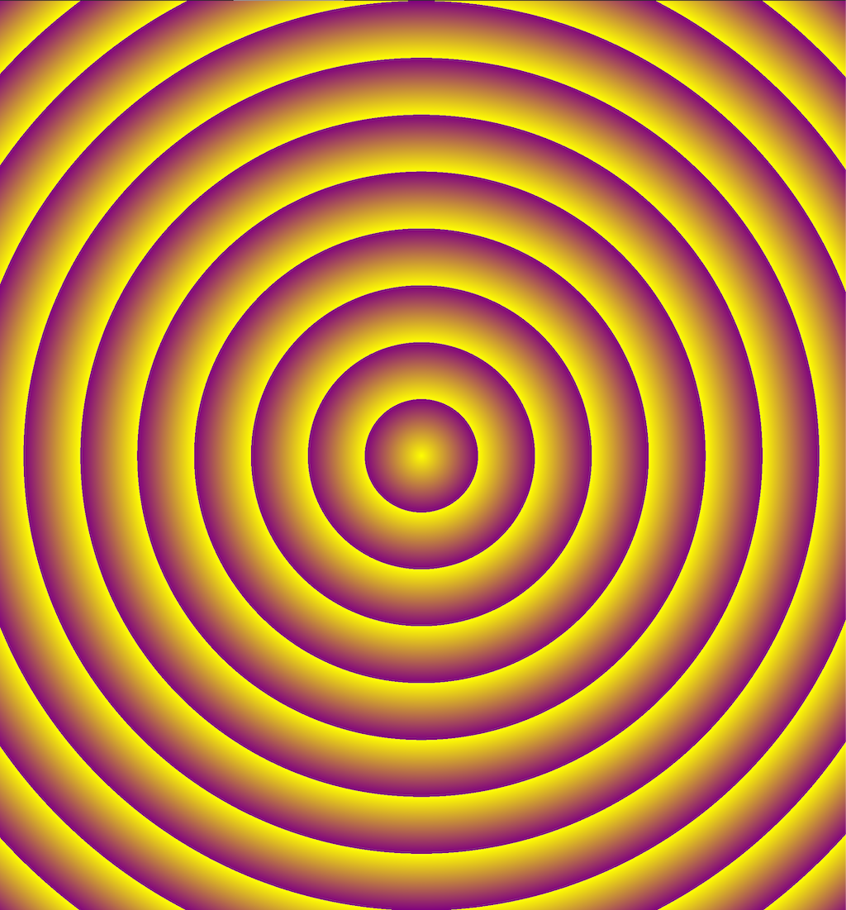  


### 3. Repetitive Cells

Next, let's create the cells by dividing the coordinate by the cell size.

Dividing `coord` by `CELLSIZE` scales the coordinate range up, e.g., with `CELLSIZE = 0.2` the canvas is going to be split into five cells, with a range at this point from -5..5. Subtracting `floor(coord)` removes the integer part and keeps only the fractional remainder in the range 0..1. Every pixel on the canvas is now mapped into the same normalised cell space, making the pattern repeat automatically without any explicit loop.

So framing looks a bit different because after subtracting `floor`, each cell runs from 0 to 1, and not as before from -1..1. Hence the point we compute the distance to (vec2(0.)) under 1.) is now the bottom left corner of the cell. If you want to see the circle again, change the reference point of the distance computation from `float d = distance(coord, vec2(0.0));` to `float d = distance(coord, vec2(0.5));`

```glsl
#ifdef GL_ES
precision mediump float;
#endif

uniform vec2 u_resolution;

// 3. Size of the cells - relative, hence 0..1
float CELLSIZE = 0.2;


void main() {

    // Normalization of the incoming
    // screen coordinate
    vec2 coord = (2.0 * gl_FragCoord.xy - u_resolution.xy) / u_resolution.y;


    // 3. Create Cells
    coord /= CELLSIZE;
    // Get into one cell
    coord -= floor(coord);


    // 1. Radial Layout
    float d = distance(coord, vec2(0.0));

    // 2. Ridges
    d *= 8.0;
    d -= floor(d);

    // 1a. Use d to interpolate between two colors
    vec3 color = mix(vec3(1.0, 1., 0.0), vec3(0.5, 0.0, 0.5), d);

    // Set the final "pixel" color
    gl_FragColor = vec4(color, 1.0);
}
```
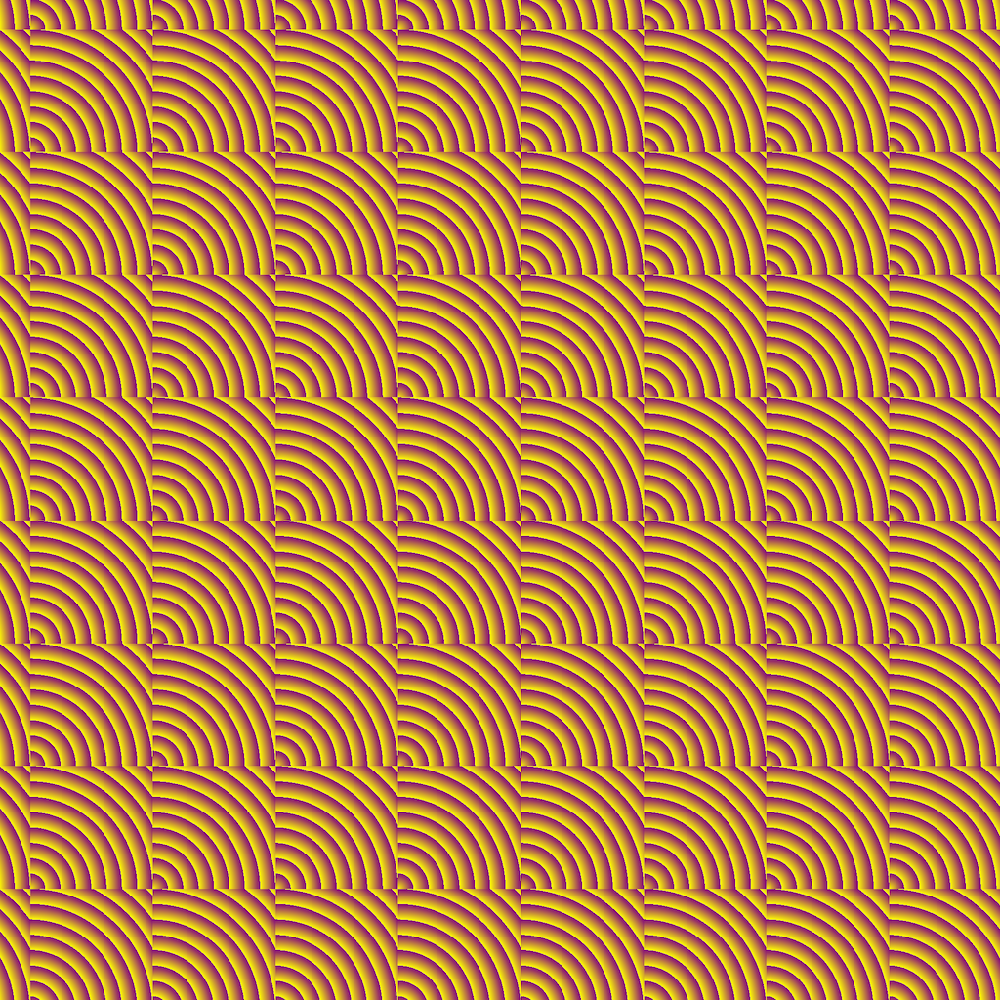  


### 4. Mirroring in x and y

We want to add more details to the cell. Instead of having just one circle, we want to mirror the design within the cell.

By pushing the coordinate values (before we do anything else with them) into the negative range and then flipping them back into positive space with `abs`, we create a 4-fold mirroring effect in both x and y. The trick is to remap the 0..1 coordinate range to the -1..1 range and then apply the absolute value. This causes the pattern to be reflected across both axes, producing four symmetric copies within the same area.

The mirroring looks best if we add an offset to the center of the circle (to which we compute the distance to). We do this by introducing a new variable `vec2 OFFSET = vec2(0.3);` and using that as reference point in the distance computation under 1.).

```glsl
#ifdef GL_ES
precision mediump float;
#endif

uniform vec2 u_resolution;

// 3. Size of the cells - relative, hence 0..1
float CELLSIZE = 0.2;

// 4. Point we compute the distance to
vec2 OFFSET = vec2(0.3);


void main() {

    // Normalization of the incoming
    // screen coordinate
    vec2 coord = (2.0 * gl_FragCoord.xy - u_resolution.xy) / u_resolution.y;

    // 3. Create Cells
    coord /= CELLSIZE;
    // Get into one cell
    coord -= floor(coord);


    // 4. Modify value range from 0..1 to -1..1
    // and then taking the absolute to create
    // a mirroring within the cell
    vec2 coord_remap = abs((coord - 0.5) * 2.0);


    // 1. Radial Layout
    float d = distance(coord_remap, OFFSET);

    // 2. Ridges
    d *= 8.0;
    d -= floor(d);

    // 1a. Use d to interpolate between two colors
    vec3 color = mix(vec3(1.0, 1., 0.0), vec3(0.5, 0.0, 0.5), d);

    // Set the final "pixel" color
    gl_FragColor = vec4(color, 1.0);
}
```

  


I hope you didn't go blind by this example... sorry.


## Building Blocks

In the following we will go through the most common building block of procedural generation algorithms, as, e.g., found on shadertoy.

## Transitions

The above examples have already shown one overall principle, namely *how to get from one value to another value* or in our context *how to get from one color (e.g. white) to another color (e.g. black)*?

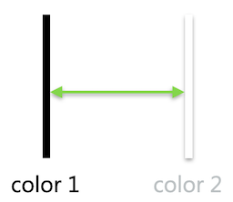  

In more general terms we can understand this as defining a transition function *t*:

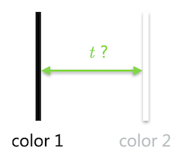  

### Step Function

The simplest of transitions is the step function, which switches between values based on a threshold, meaning with a fixed value that *t* is smaller or larger to.

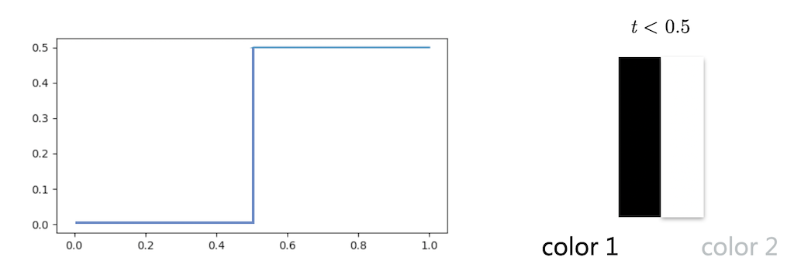  

```glsl
#ifdef GL_ES
precision mediump float;
#endif

#define PI 3.14159265359
uniform vec2 u_resolution;

void main()
{
    vec2 pt = (2.0 * gl_FragCoord.xy - u_resolution.xy) / u_resolution.y;

    // The following step function returns
    //  0.0 when x is smaller than 0.4 and
    //  1.0 otherwise
    float step_value = step(0.4, pt.x);

    // Our "pattern":
    float hori = sin(8.0 * PI * pt.y);

    // Multiplying 0 or 1 with the pattern
    // depending on the step function value
    vec3 color = vec3(step_value * hori);

    // Assign frag color with alpha
    gl_FragColor = vec4(color,1.0);
}
```

Code rendering:  
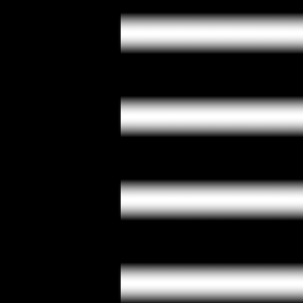  


More often we want a smoother transition, e.g.

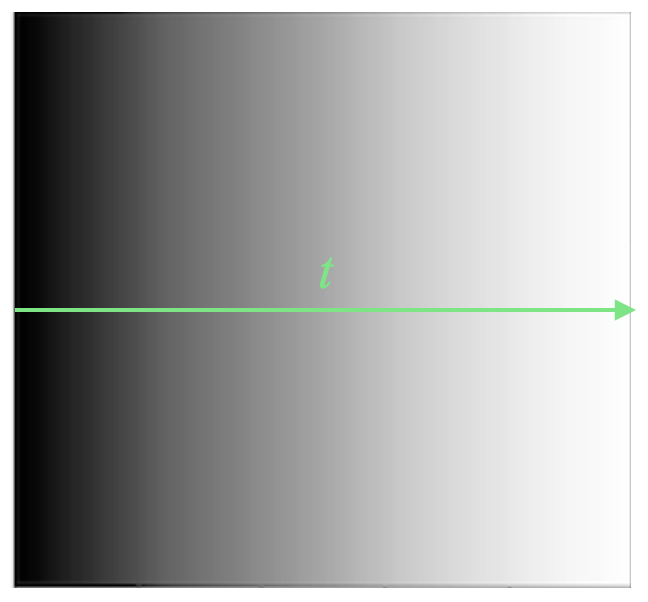  


This is called an *interpolation*.

### Linear Interpolation

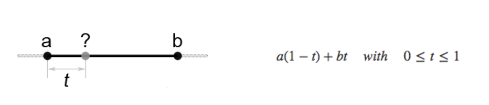  

[[1]](https://www.scratchapixel.com/lessons/procedural-generation-virtual-worlds)

```glsl
#ifdef GL_ES
precision mediump float;
#endif

#define PI 3.14159265359
uniform vec2 u_resolution;

void main()
{
    vec2 pt = (2.0 * gl_FragCoord.xy - u_resolution.xy) / u_resolution.y;

    // Our "pattern":
    float verti = sin(8.0 * PI * pt.x);
    float hori = sin(8.0 * PI * pt.y);

    vec3 color = vec3(pt.x * hori + ((1.0 - pt.x) * verti));

    // https://registry.khronos.org/OpenGL-Refpages/gl4/html/mix.xhtml
    // vec3 color = vec3(mix(hori, verti, pt.x));

    // Assign frag color with alpha
    gl_FragColor = vec4(color,1.0);
}
```

Code rendering:  
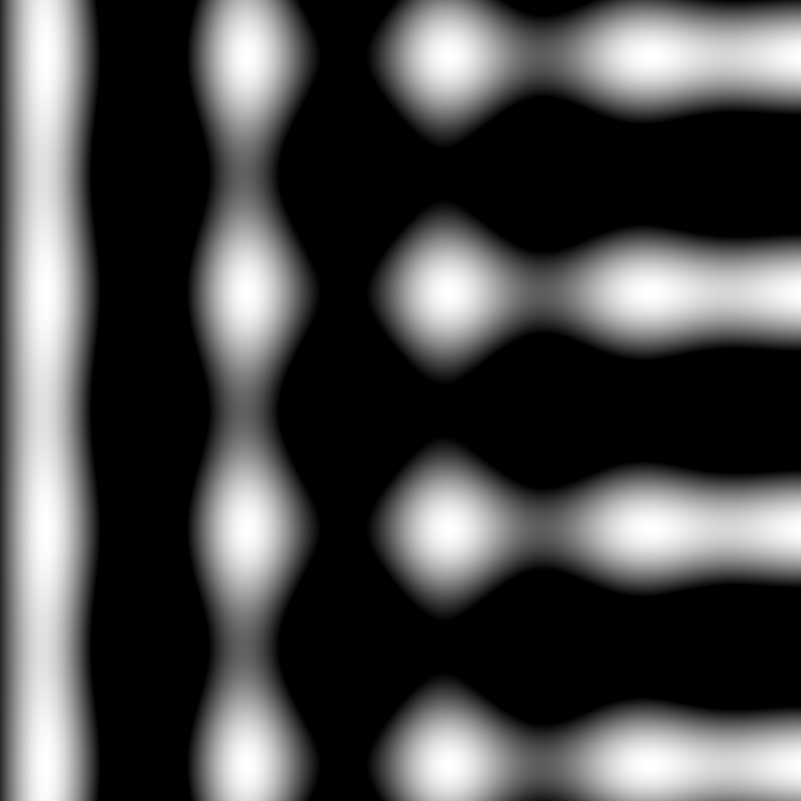  

### Bilinear Interpolation

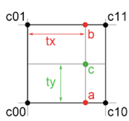  
[[scratchapixel]](https://www.scratchapixel.com/lessons/procedural-generation-virtual-worlds)

A bilinear interpolation is the linear interpolation of two linear interpolations, hence

* two linear interpolations to get `a` and `b` in one direction (here `tx`)
* one linear interpolation of `a` to `b` in the second direction (here `ty)`

```
a = c00 * (1 - tx) + c10 * tx; 
b = c01 * (1 - tx) + c11 * tx; 

c = a * (1) - ty) + b * ty; 
```

Linear and bilinear interpolation is usually called `lerp()`, e.g. [`lerp` in p5](https://p5js.org/reference/#/p5.Vector/lerp) or [`lerp` in vex](http://www.sidefx.com/docs/houdini/vex/functions/lerp.html) or [`mix`](https://www.khronos.org/registry/OpenGL-Refpages/gl4/html/mix.xhtml) in GLSL or the [Lerp node](https://www.youtube.com/watch?v=SiPhlGjqdyo) in Unreal's Material Graph.

```glsl
#ifdef GL_ES
precision mediump float;
#endif
#define PI 3.14159265359
uniform vec2 u_resolution;

void main()
{
    vec2 pt = (2.0 * gl_FragCoord.xy - u_resolution.xy) / u_resolution.y;


    vec3 color1 = vec3(1., 0. , 0.);
    vec3 color2 = vec3(0., 1. , 0.);
    vec3 color3 = vec3(0., 0. , 1.);
    vec3 color4 = vec3(1., 1. , 0.);

    vec3 interpol1 = mix(color1, color2, pt.x);
    vec3 interpol2 = mix(color3, color4, pt.x);
    // vec3 color = interpol1;

    vec3 interpol3 = mix(interpol1, interpol2, pt.y);
    vec3 color = interpol3;

    // Assign frag color with alpha
    gl_FragColor = vec4(color,1.0);
}
```

Code rendering:  
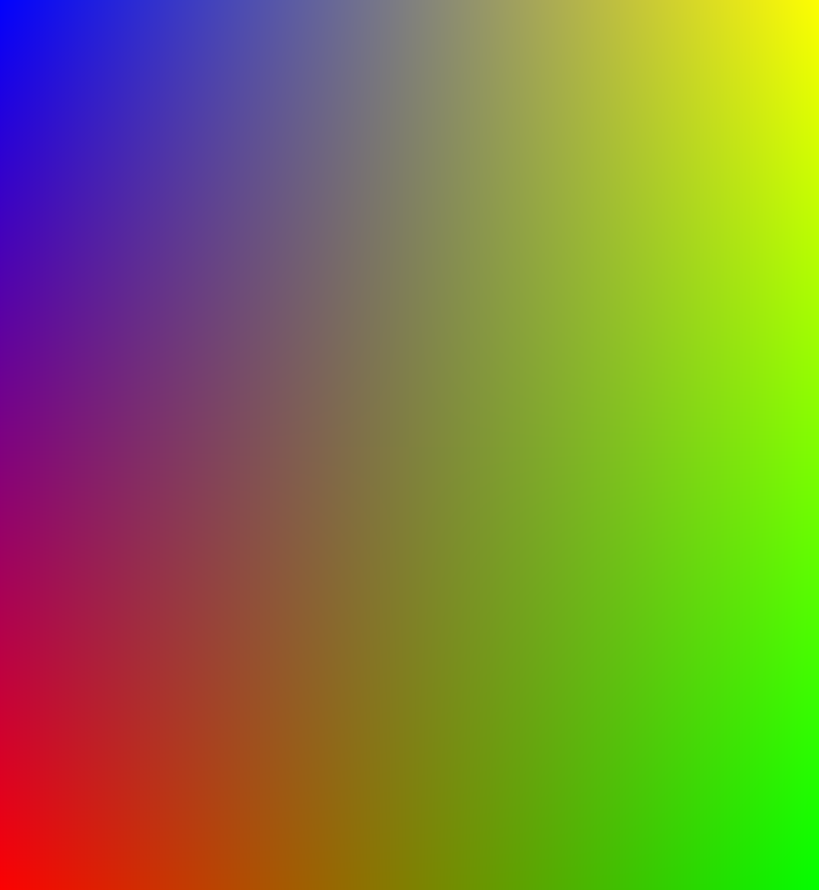  


### Trilinear Interpolation

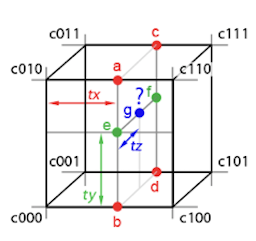  
[[scratchapixel]](https://www.scratchapixel.com/lessons/procedural-generation-virtual-worlds)

A trilinear interpolation is the linear interpolation of two bilinear interpolations.

```
e = bilinear(tx, ty, c000, c100, c010, c110); 
f = bilinear(tx, ty, c001, c101, c011, c111); 

g = e * ( 1 - tz) + f * tz; 
```

By the way, *what is a voxel*?

A voxel is like a pixel but in 3D and represents a value on a regular 3D grid. We need voxels for volumes, for example.

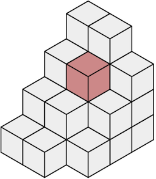  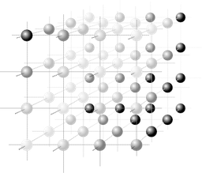
[[wiki]](https://en.wikipedia.org/wiki/Voxel)

### Interpolation Functions

To move between values, we have many options. Simply taking different exponents for *t* in a linear interpolation changes the transition between the values notably.

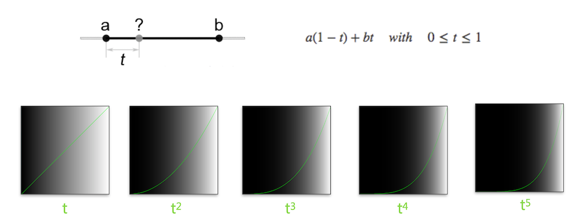  

For example, in 3D software such as Houdini, there are several interpolation functions to choose from. Here, some comparisons:

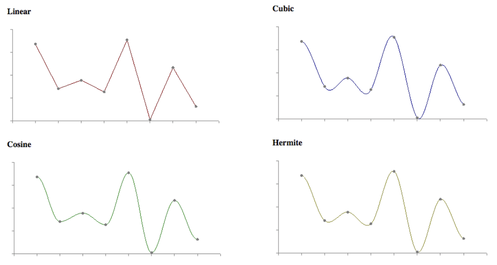  
[[paulbourke]](http://paulbourke.net/miscellaneous/interpolation/)

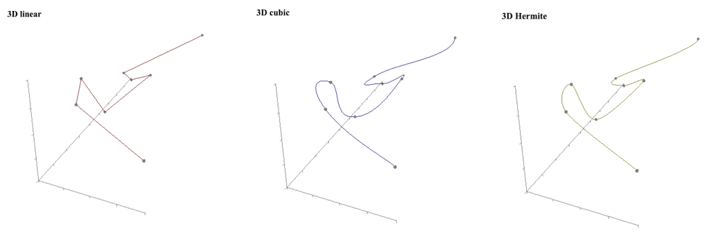  
[[paulbourke]](http://paulbourke.net/miscellaneous/interpolation/)

These different functions lead to different visual designs, depending on the context, e.g. for interpolating between colors for an image or positions for an animation. From left to right, Nearest Neighbor, Bilinear, Lagrange Bicubic interpolation (only interpolates values, not slopes), Hermite Bicubic interpolation:

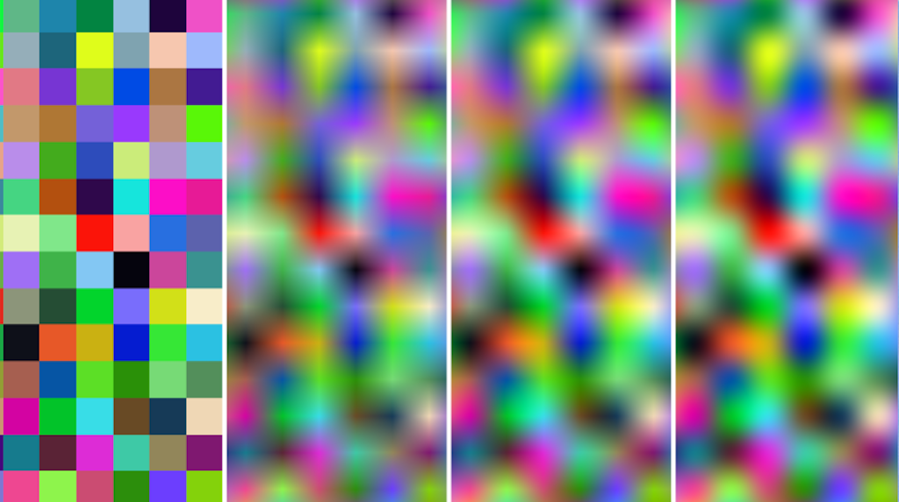  
[[demofox]](https://blog.demofox.org/2015/08/15/resizing-images-with-bicubic-interpolation/)  


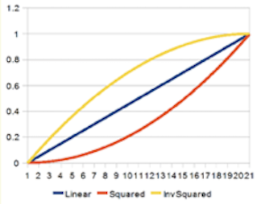  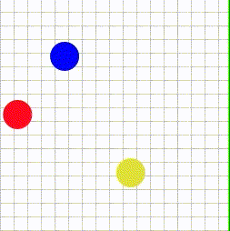
[[gfxile]](http://sol.gfxile.net/interpolation/)  

### Smooth Step

Smoothstep is one of the most commonly used interpolation and clamping function in graphics and is often given as a built-in function from a framework. 

*On a side note:* What is a *clamping* function? In computer graphics, clamping is the process of limiting a value to a range. Unlike wrapping, clamping merely moves the point to the nearest available value. [[2]](https://en.wikipedia.org/wiki/Clamping_(graphics))

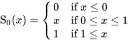

*S* is a [sigmoid function](https://en.wikipedia.org/wiki/Sigmoid_function), which is bounded and often used in the context of mapping a potentially indefinite range of values to a range.

Often smoothstep implements a cubic Hermite interpolation after clamping:

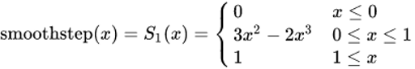

```glsl
float smoothstep(float edge0, float edge1, float x)
{
    x = clamp((x, 0.0, 1.0); 
    return x * x * (3 - 2 * x);
}

float clamp(float x, float lowerlimit, float upperlimit)
{
    if (x < lowerlimit)
        x = lowerlimit;
    if (x > upperlimit)
        x = upperlimit;
    return x;
}
```

Smoother Steps is an improved version of the smoothstep function, created by Ken Perlin.

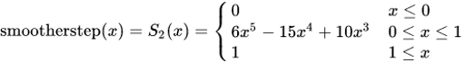

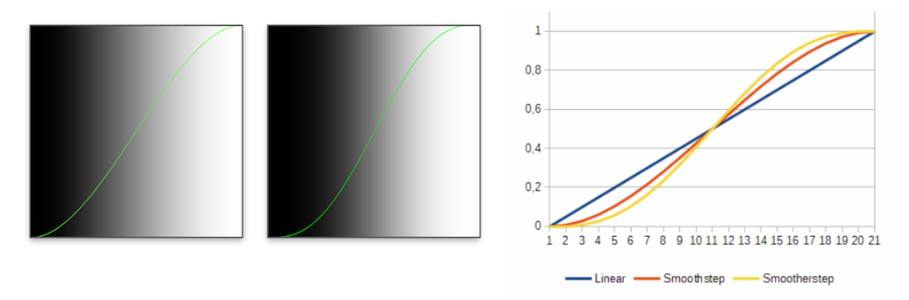
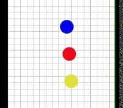  
[[gfxile]](http://sol.gfxile.net/interpolation/)  

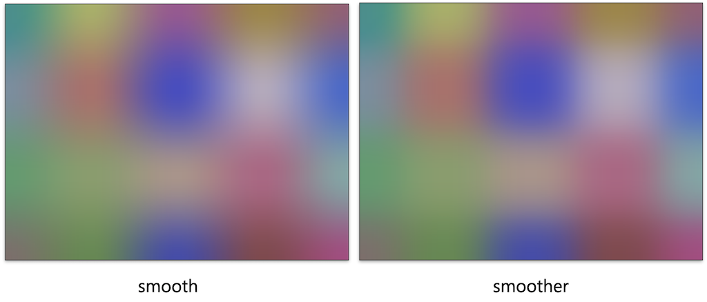  [[4]](https://cis700-procedural-graphics.github.io/)

[[3]](https://en.wikipedia.org/wiki/Smoothstep)

### Bias and Gain

Bias and gain are parameters that give further control for the fine-tuning of an interpolation function curve. This has been, once again, [Ken Perlin's idea](http://demofox.org/biasgain.html).

#### Bias

Bias represents *how much time is spent at either end of the transition*? The larger the values, the faster grows the value at the beginning.

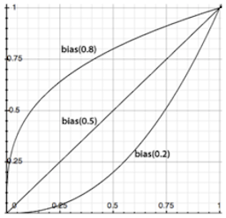 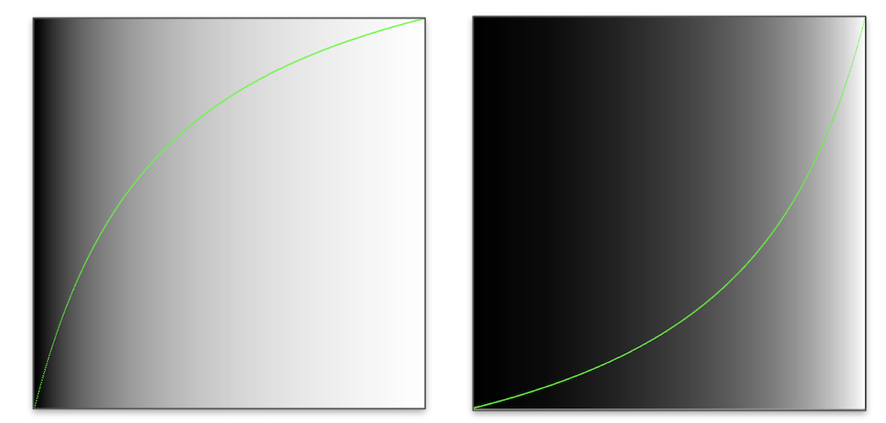

```glsl
float get_bias(float t, float bias)
{
    return (t / (((1.0 / bias) - 2.0) * (1.0 - t)) + 1.0);
}
```

#### Gain

Gain represents *how much time is spent in the middle of the transition*? The larger the value, the slower changes the value around the middle.

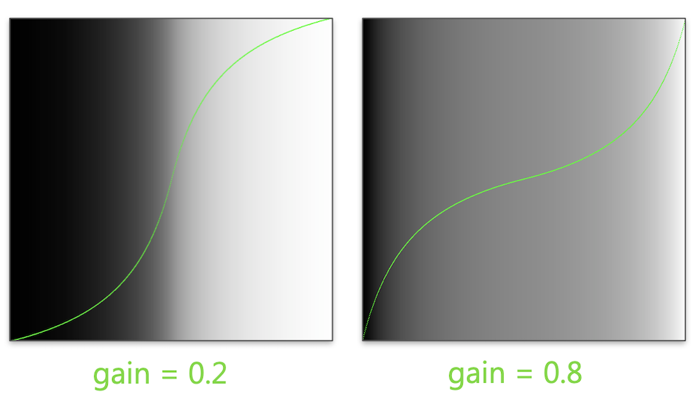

```glsl
float get_gain(float t, float gain)
{
    if(t < 0.5)
        return get_bias(t * 2.0, gain) / 2.0;
    else
        return get_bias(t * 2.0 - 1.0, 1.0 - gain) / 2.0 + 0.5;
}
```

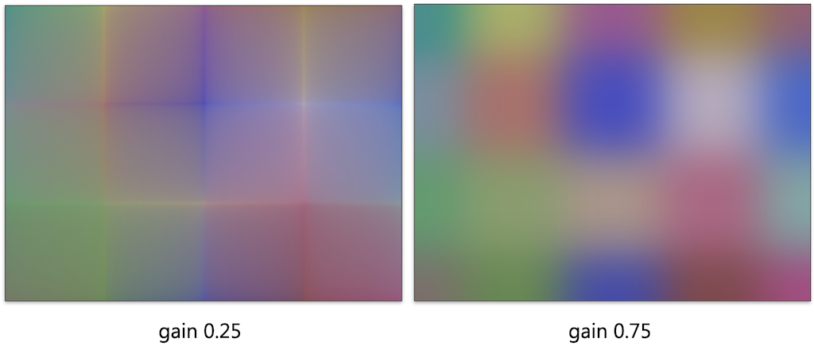 [[4]](https://cis700-procedural-graphics.github.io/)

For further information, read Perlin's blog post [Bias And Gain Are Your Friend](https://blog.demofox.org/2012/09/24/bias-and-gain-are-your-friend/).

### Interpolation in Houdini

In Houdini interpolation is relevant in numerous places, e.g. for the [ramp parameter control](https://www.sidefx.com/docs/houdini/network/ramps.html).

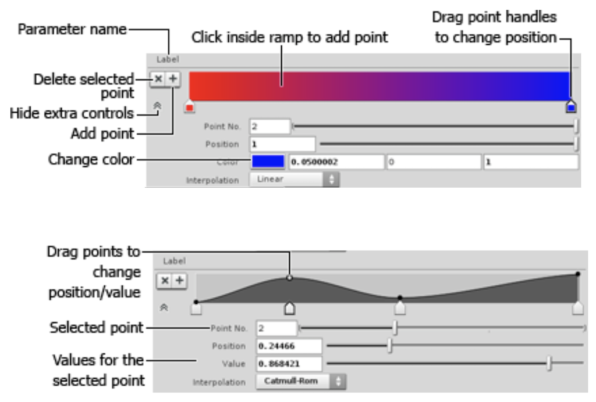  
[[houdini]](https://www.sidefx.com/docs/houdini/network/ramps.html)  

With the interpolation functions

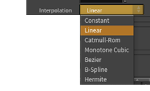  

* Constant
    * Holds the value constant until the next key.
* Linear
    * Does a linear (straight line) interpolation between keys.
* Catmull-Rom
    * Interpolates smoothly between the keys. See [Catmull-Rom_spline](https://en.wikipedia.org/wiki/Cubic_Hermite_spline#Catmull%E2%80%93Rom_spline).
* Monotone Cubic
    * Another smooth interpolation that ensures that there is no overshoot. For example, if a key’s value is smaller than the values in the adjacent keys, this type ensures that the interpolated value is never less than the key’s value.
* Bezier
    * Cubic Bezier curve that interpolates every third control point and uses the other points to shape the curve. See [Bezier curve](https://en.wikipedia.org/wiki/B%C3%A9zier_curve).
* BSpline
    * Cubic curve where the control points influence the shape of the curve locally (that is, they influence only a section of the curve). See [B-Spline](https://en.wikipedia.org/wiki/B-spline).
* Hermite
    * Cubic Hermite curve that interpolates the odd control points, while even control points control the tangent at the previous interpolation point. See [Hermite spline](https://en.wikipedia.org/wiki/Cubic_Hermite_spline).

[[5]](http://www.sidefx.com/docs/houdini/hom/hou/rampBasis.html)

### Interpolation in CSS

These discussed principles and properties of interpolation are the same as *easing functions* in CSS.

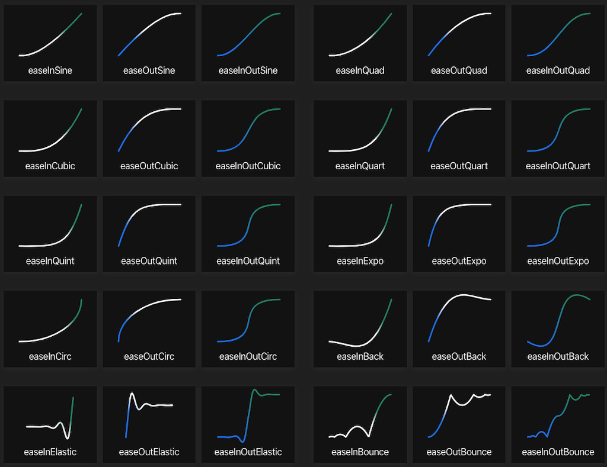  
[[easings]](https://easings.net/)  

## Function Primitive Components

So far, we can only transition from one value or function exemplar to another one. That is a bit boring. The following presents a list of the most commonly used function components for putting together an individual design goal.

A great tool to work with function components and test how to put them together is the [Graph Toy](https://graphtoy.com/).

### Modulo

With modulo you can easily iterate ranges and therefore loops, for example.

```js
y = x % 0.5;
```

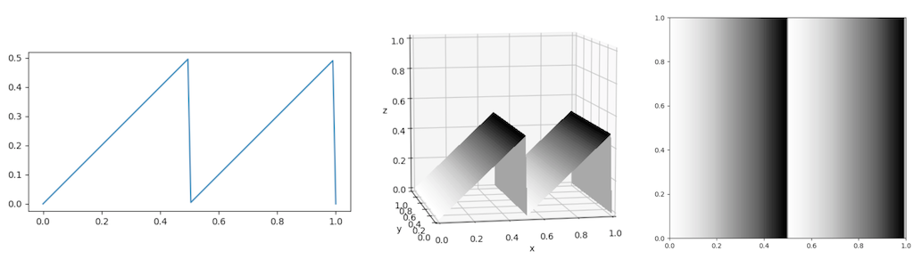

### Floor

Floor ignores fraction and creates with that a continuous step function.

```js
y = floor(x);
```

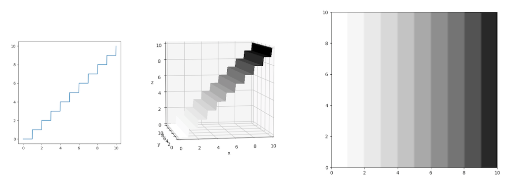

### Sign

Sign extracts the sign of a real number and is therefore either `1` or `-1`.

```js
y = sign(x);

//-1 if x < 0, 0 if x==0, 1 if x > 0
```

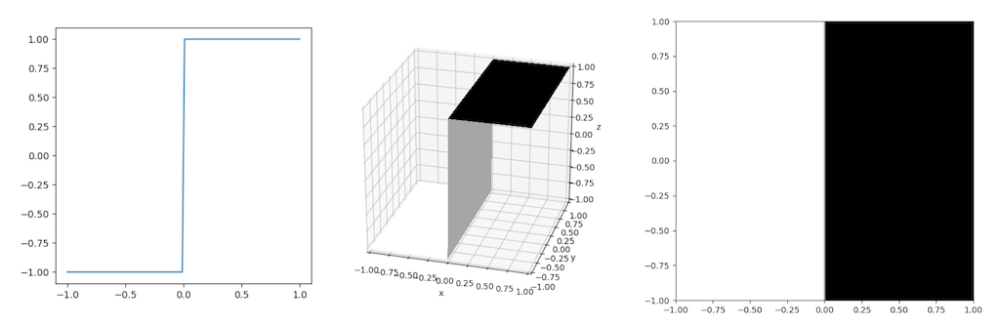

### Absolute

The absolute keeps values always positive.

```js
y = abs(x);
```

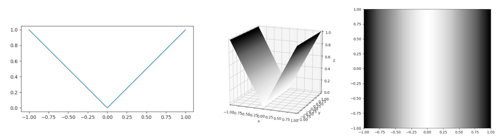

### Min and Max

Min and Max are used to define lower and upper borders.

```js
y = min(x, 0.5);

y = min(x, 0.2);
```

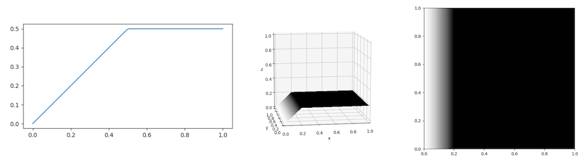

## Periodicity

Often times we want to repeat certain visual features, which can be done in its simplest form e.g. with a `sin` function. However, there are several other design options. The following functions are also often called *wave functions*.


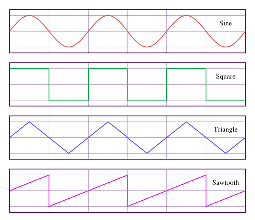  
[[wiki]](https://en.wikipedia.org/wiki/Square_wave#/media/File:Waveforms.svg)

Wave functions have two common properties

* frequency (“*how often*”), and
* amplitude (“*how much*”).

<!-- 

used as

```glsl
(t * frequency) % amplitude;
``` 

-->

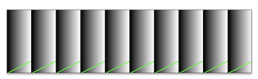

### Square

The square wave enables a sharp oscillation between two values.

```glsl
float wave_square(float t, float frequency, float amplitude)
{
  return floor(t* frequency) % 2 * amplitude;
}
```

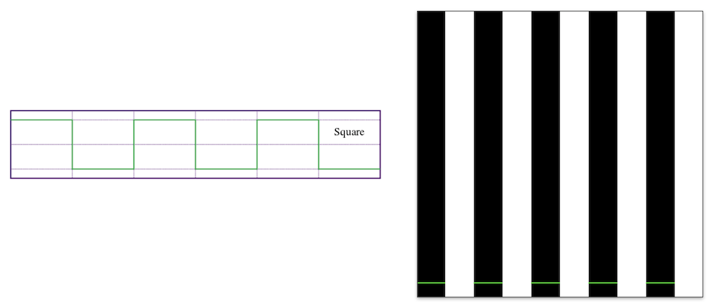

### Sawtooth

The sawtooth wave enables a jagged oscillation — a value increases linearly and then resets.

```glsl
float waveSawTooth(float t, float frequency, float amplitude)
{
  return (t * frequency - floor(t* frequency)) * amplitude;
}
```

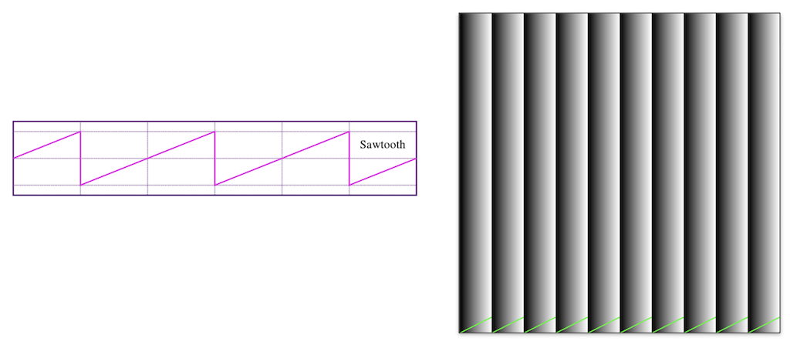


### Triangle

The triangle wave enables a linear oscillation between two values.

```glsl
float waveTriangle(float t, float frequency, float amplitude)
{
  return abs((t * frequency) % amplitude - (0.5 * amplitude));
}
```

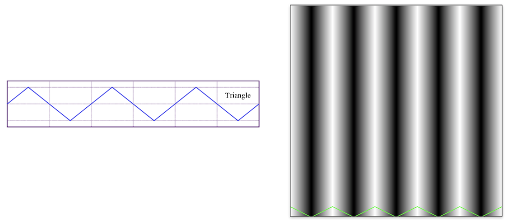

Again, the formula starts with:

```glsl
float waveTriangle(float t, float frequency, float amplitude)
{
  return ((t * frequency) % amplitude);
}
```


Then, we scale the triangle side by half in order to fit two of them :

```glsl
float waveTriangle(float t, float frequency, float amplitude)
{
  return ((t * frequency) % amplitude - (0.5 * amplitude));
}
```

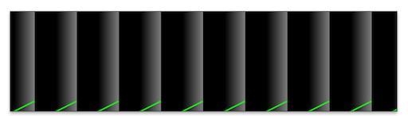

Lastly, we take the `abs` value in order to repeat the triangle side in the other direction:

```glsl
float waveTriangle(float t, float frequency, float amplitude)
{
  return abs((t * frequency) % amplitude - (0.5 * amplitude));
}
```

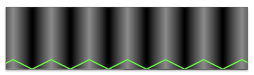

## Advanced Shapes

There are various other [function shapes](http://www.iquilezles.org/www/articles/functions/functions.htm), which you could integrate into your design. The following examples are somewhat advanced and it is fine if you just skim through them and come back to them in case of need.

### Pulse

The pulse function mimics a gaussian shape. Parameters:

* `c` controls centering
* `w` controls taper length

This function is useful for isolating a feature or for turning something on and off.

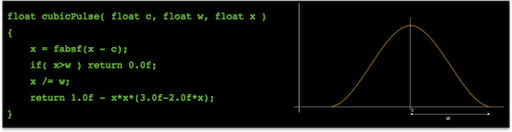  
[[iquilezles]](http://www.iquilezles.org/www/articles/functions/functions.htm)

### Parabola

The parabola function remaps the `[0, 1]` interval such that `f(0) = f(1) = 0` and `f(1/2) = 1`. Parameters:

* `k` controls steepness


Similar to pulse, use this function for symmetric shapes and for turning something on and off.

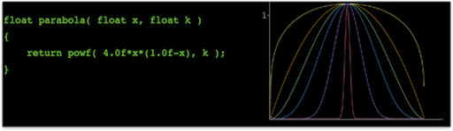  
[[iquilezles]](http://www.iquilezles.org/www/articles/functions/functions.htm)


### Impulse

The impulse function reaches a maximum value and then gradually decays. Parameters:

* `k` controls the rate of decay

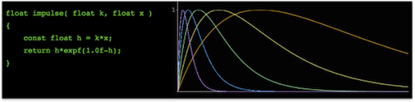  
[[iquilezles]](http://www.iquilezles.org/www/articles/functions/functions.htm)

### Power Curve

The power curve function skews a pulse-like curve to one side. Parameters:

* `a` and `b` control the bias toward either side

This function is good for creating shapes and for nudging signals off-center.

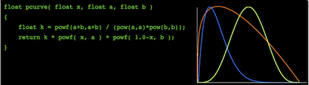  
[[iquilezles]](http://www.iquilezles.org/www/articles/functions/functions.htm)

### Sinc Curve

The sinc curve function is a phase shifter. Parameters:

* `k` tweaks the amount of bounces

This function is useful for e.g. the creation of bounces.

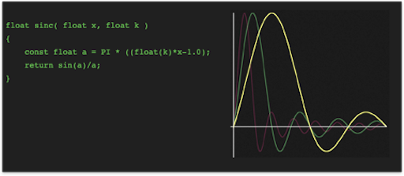  
[[iquilezles]](http://www.iquilezles.org/www/articles/functions/functions.htm)

[[6]](http://www.iquilezles.org/www/articles/functions/functions.htm)

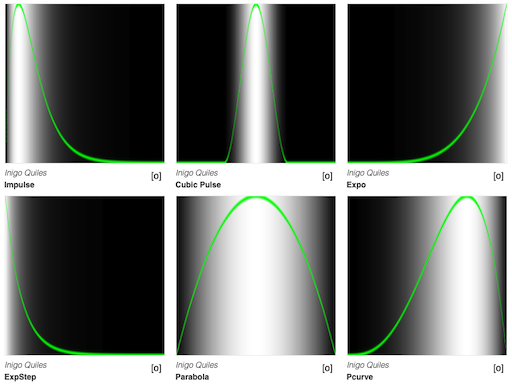  
[[thebookofshaders]](https://thebookofshaders.com/05/)


More functions

* [Polynomial Shaping Functions](http://www.flong.com/texts/code/shapers_poly/)
* [Exponential Shaping Functions](http://www.flong.com/texts/code/shapers_exp/)
* [Circular & Elliptical Shaping Functions](http://www.flong.com/texts/code/shapers_circ/)
* [Bezier and Other Parametric Shaping Functions](http://www.flong.com/texts/code/shapers_bez/)

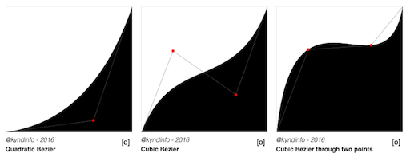  
[[thebookofshaders]](https://thebookofshaders.com/05/)

<!--   
[[Creation by Silexars]](https://www.shadertoy.com/view/XsXXDn) -->

[[7]](https://thebookofshaders.com/)  

## Design Goals

To understand the above described different components is hopefully with some brain power manageable. But putting components together can be quite daunting. Also, don't be scared away by cryptic examples you will find on the web. Function design code is notoriously difficult to read as it is often optimized for performance.

The best site for finding shader inspirations is [Shadertoy](https://www.shadertoy.com/) run by Inigo Quilez. ShaderToy is packed with very good examples (but also some bad ones...) and code to steal. Unfortunately, ShaderToy is slightly its own world with different variables namings and core functions. We will come back to the awesomeness that is ShaderToy in the Shader Programming workshop.

Whenever you find function designs that you would like to understand, you should try to find the overall *gist* of the design.

*How to find the gist of a function design?*

Divide and conquer:

* Test different values for constants and defines
* Separate functionalities, e.g. turn off animation, sound, interaction etc.
* Go line by line and display the result of each line separately
* Take out all scaling factors, offsets, etc.

Here, only practice and patience help.  

Then, at some point you will not only be as happy as this blobby creature but you might also be able to program this fully procedurally generated scene (including the renderer and such!), which is one of [the masterpieces of Inigo Quilez](https://www.shadertoy.com/view/3lsSzf).

  
[[Happy Jumping by Iq]](https://www.shadertoy.com/view/3lsSzf)

If you are interested in how Inigo built this scene, there is a 6 hours (!) recorded live stream, deconstructing the [Happy Jumping mathematical animation](https://www.youtube.com/watch?v=Cfe5UQ-1L9Q). I tried to watch the video several times but terribly failed each time. Inigo might be a shader mastermind, didactically he is not always.


<!-- 

### Brick Pattern

The brick pattern is a classic example that brings together several of the building blocks covered in this chapter. It shows how to create a tiling with offset rows, mortar gaps, and smooth or sharp transitions — all without any explicit loop.

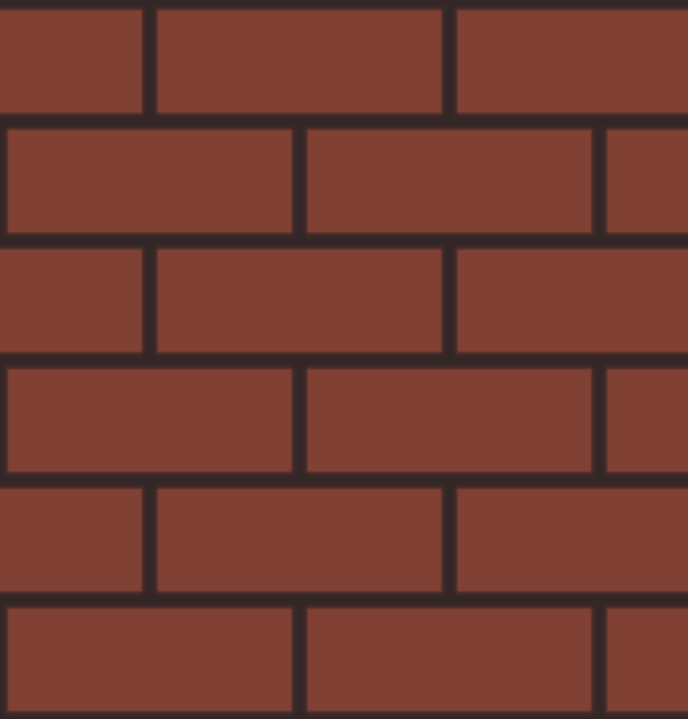  

The parameters that define the geometry of one brick tile are shown below.

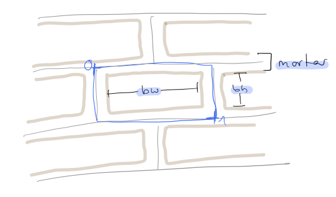  

We start by defining our basic dimensions and normalising the fragment coordinate:

```glsl
float BRICK_W = 0.3;  
float BRICK_H = 0.1; 
float MORTAR  = 0.02; 

vec2 coord = gl_FragCoord.xy/u_resolution.y;
```

The variable `coord` is normalised so that it runs between 0..1 across the canvas. For example, if the window is 512 pixels wide and the current fragment is at x position 200, then `coord.x = 200 / 512 = 0.39`.

Next we compute the combined size of one brick plus its surrounding mortar:

```glsl
float brick_mortar_w = BRICK_W + MORTAR;
float brick_mortar_h = BRICK_H + MORTAR;
```

We then create the tiling by converting the 0..1 coordinate range into a range of 0..number_of_tiles, where each individual tile occupies one unit:

```glsl
// The value range is converted from 0..1
// to 0.0..number_of_tiles,
// where one tile runs from n_tile to n_tile + 1
float x = coord.x / brick_mortar_w;
float y = coord.y / brick_mortar_h;
```

We also apply the same coordinate transformation to the mortar sizing so that it is expressed in the same normalised tile space:

```glsl
float mortar_half_norm_w = (MORTAR * 0.5) / brick_mortar_w;
float mortar_half_norm_h = (MORTAR * 0.5) / brick_mortar_h;
```

Real brickwork staggers every other row by half a brick width. We achieve this by using `floor(y)` to find which row we are in and then shifting x by 0.5 for every even row:

```glsl
// Shift the brick x position in every other row
float y_index = floor(y);
if (mod(y_index, 2.0) == 0.0) {
    x += 0.5;
}
```

For example, if `y = 1.4` the row index is 1 and the condition is false, so x is not shifted. If `y = 2.6` the row index is 2, the condition is true, and x is shifted by 0.5.

After the shift we normalise both coordinates so that they run between 0..1 within a single brick tile:

```glsl
// x and y should run again between 0..1 on a single brick
// (including one half of the mortar around the brick)
x -= floor(x);
y -= y_index;
```

So a value like 1.4 becomes 0.4, and 2.6 becomes 0.6.

To draw the mortar gap we use the step function to create a sharp brick outline. Recall that `step(t, x)` returns 0.0 if `x < t` and 1.0 otherwise. By subtracting two step functions we isolate just the brick area and leave the mortar as zero:

```glsl
// Creating the brick outline
float w = step(mortar_half_norm_w, x) - step(1.0 - mortar_half_norm_w, x);
float h = step(mortar_half_norm_h, y) - step(1.0 - mortar_half_norm_h, y);
```

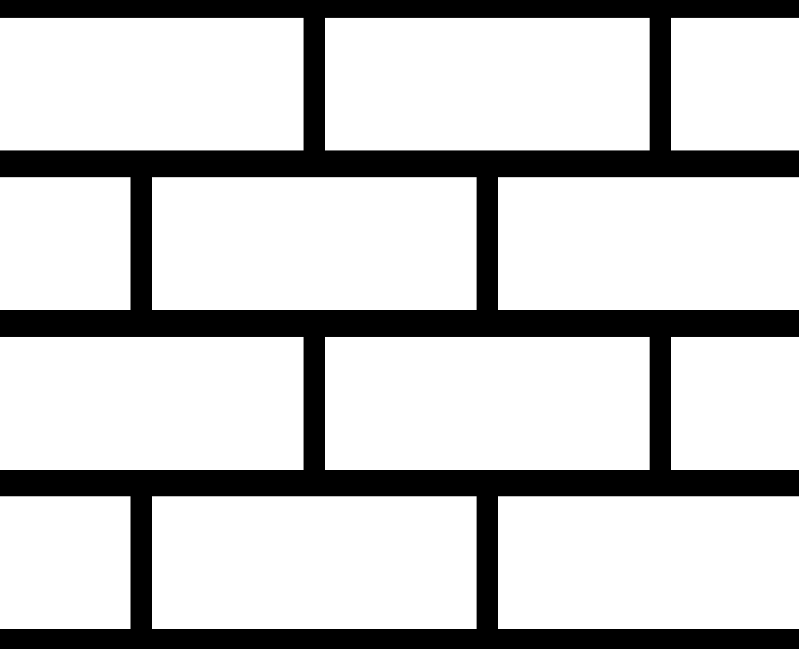  

For a smoother, more realistic mortar edge we can replace `step` with `smoothstep`. The `smoothstep` function returns 0.0 if the input is at or below `edge0` and 1.0 if it is at or above `edge1`, with a smooth Hermite curve in between:

```glsl
// Creating the brick outline with smooth edges
float w = smoothstep(0.0, mortar_half_norm_w, x)
           - smoothstep(1.0 - mortar_half_norm_w, 1.0, x);
float h = smoothstep(0.0, mortar_half_norm_h, y)
           - smoothstep(1.0 - mortar_half_norm_h, 1.0, y);
```

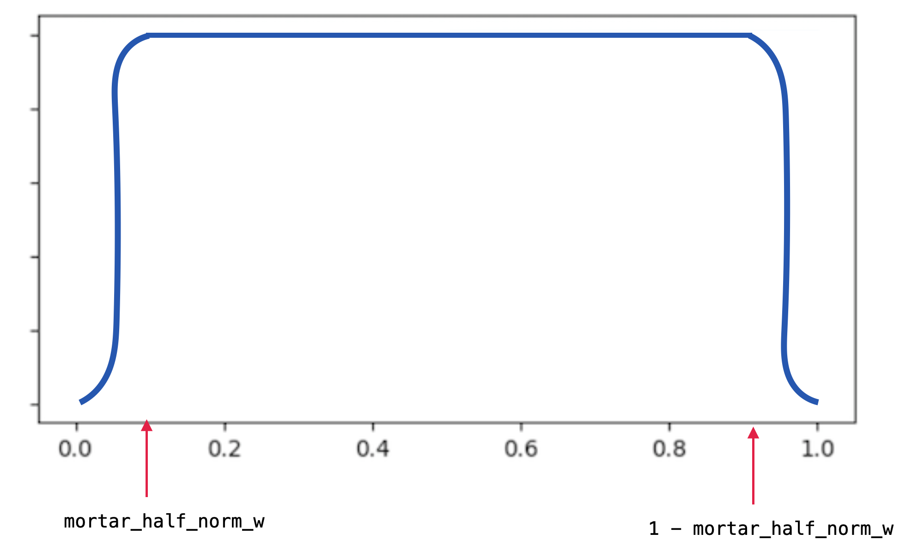  

We can go one step further and apply the `bias` function to the smoothstep curves to create an asymmetric transition that fakes a subtle shadow at the mortar edge. A lower bias value on the rising edge makes the dark transition longer, while a higher bias value on the falling edge makes the bright highlight shorter:

```glsl
// Fake shadow using bias to create an asymmetric mortar curve
float w = getBias(smoothstep(0.0, mortar_half_norm_w, x), 0.3) 
             - getBias(smoothstep(1.0 - mortar_half_norm_w, 1.0, x), 0.7);
float h = getBias(smoothstep(0.0, mortar_half_norm_h, y), 0.3) 
             - getBias(smoothstep(1.0 - mortar_half_norm_h, 1.0, y), 0.7);
```

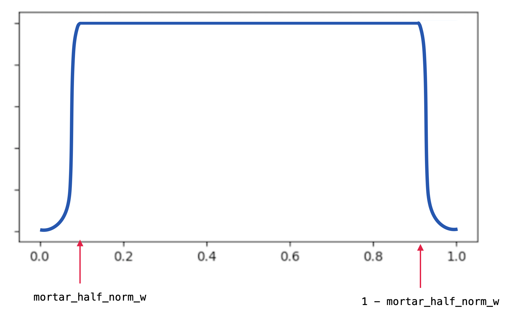  

The final brick colour is then computed from the combined width and height mask:

```glsl
float brick = w * h;
vec3 color = mix(mortarColor, brickColor, brick);
gl_FragColor = vec4(color, 1.0);
```

  

This example demonstrates how a handful of simple operations — division, floor, modulo, step, smoothstep, and bias — can be composed to produce a convincing procedural surface. 


-->

## Next

### Tilings

Next we look into the deeper meanings of repetition:

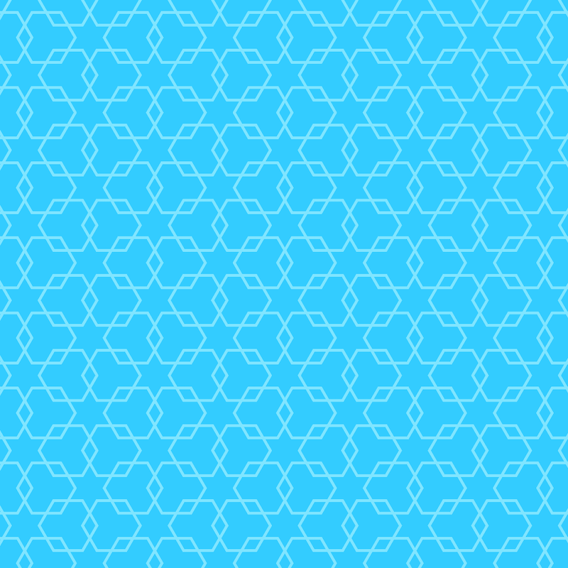
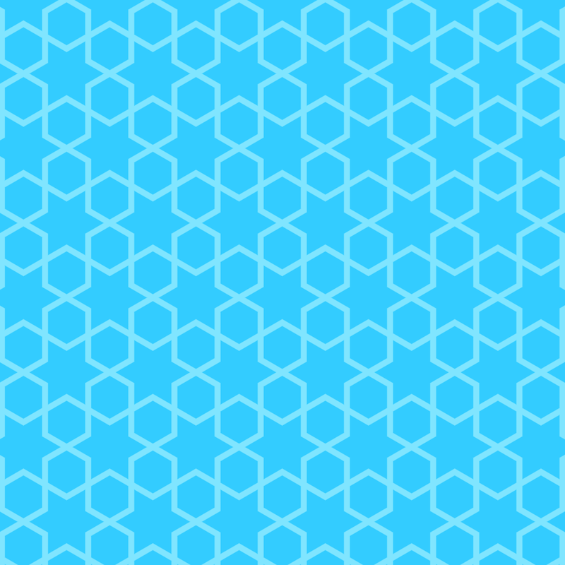
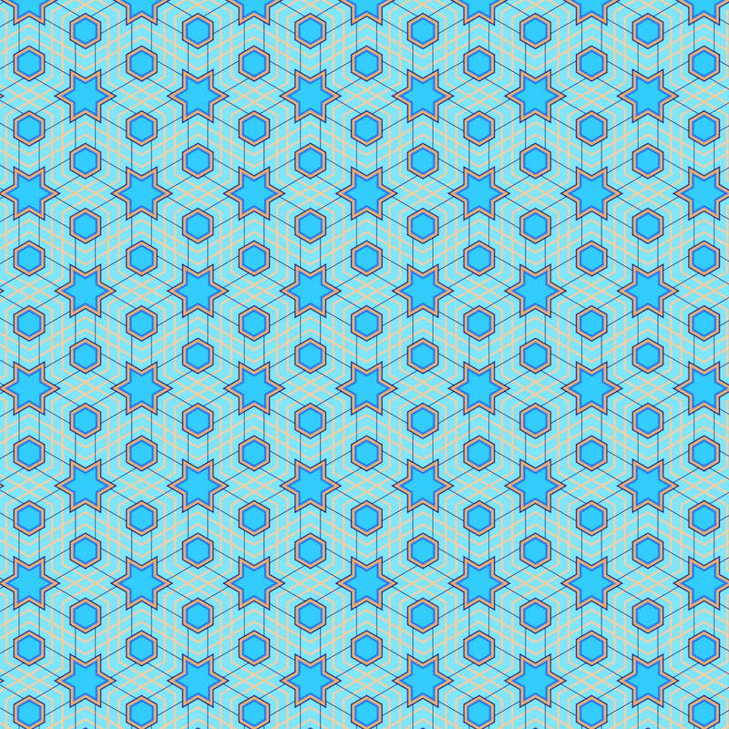
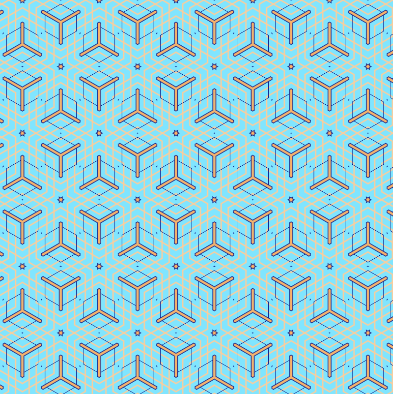

---

## References

[[1] Scratch a Pixel](https://www.scratchapixel.com/lessons/procedural-generation-virtual-worlds)  
[[2] Wiki - Clamping](https://en.wikipedia.org/wiki/Clamping_(graphics))  
[[3] Wiki - Smooth Step](https://en.wikipedia.org/wiki/Smoothstep)  
[[4] CIS 700 - Special Topics in Computer Graphics, University of Pennsylvania, Rachel Hwang](https://cis700-procedural-graphics.github.io/)  
[[5] Houdini Docs - Ramp Basics](http://www.sidefx.com/docs/houdini/hom/hou/rampBasis.html)  
[[6] Inigo Quilez - Functions](http://www.iquilezles.org/www/articles/functions/functions.htm)  
[[7] Vivo, Patricio Gonzalez, and Lowe, Jen (2015). The Book of Shaders.](https://thebookofshaders.com/)  
[[8] Floersch, Brian (2019). Intro to 2D signed distance functions and drawing touch controls with the GPU](https://blog.sb1.io/intro-to-2d-signed-distance-functions/)  
[[9] Böhringer, Ronja (2018). 2D Signed Distance Field Basics](https://www.ronja-tutorials.com/2018/11/10/2d-sdf-basics.html)  


---

The End

📐 🔵 ➕ 🔸 🟩  
