# Procedural Generation and Simulation

Prof. Dr. Lena Gieseke \| l.gieseke@filmuniversitaet.de \| Film University Babelsberg KONRAD WOLF

# Chapter 07 - Dynamics

* [Learning Objectives](#learning-objectives)
* [Moving Stuff](#moving-stuff)
    * [How To Move Stuff](#how-to-move-stuff)
    * [Keyframe Animation](#keyframe-animation)
    * [Kinematic Animation](#kinematic-animation)
        * [Indirect Kinematic Animation](#indirect-kinematic-animation)
    * [Animation in Unreal](#animation-in-unreal)
        * [MetaHumans](#metahumans)
* [Dynamics](#dynamics)
    * [Forces](#forces)
    * [Time](#time)
* [Mathematical Fundamentals](#mathematical-fundamentals)
    * [Velocity](#velocity)
        * [Slope](#slope)
        * [Differentiation](#differentiation)
    * [Acceleration](#acceleration)
    * [In Summary](#in-summary)
    * [Newton's Three Laws of Motion](#newtons-three-laws-of-motion)
        * [Newton's First Law of Motion](#newtons-first-law-of-motion)
        * [Newton's Third Law of Motion](#newtons-third-law-of-motion)
        * [Newton's Second Law of Motion](#newtons-second-law-of-motion)
    * [How To Integrate](#how-to-integrate)
    * [Euler Integration](#euler-integration)
    * [Summary](#summary)
* [Creating Forces](#creating-forces)
    * [Example Air and Fluid Resistance](#example-air-and-fluid-resistance)
* [Dynamics in Unreal](#dynamics-in-unreal)
    * [Niagara Visual Effects System](#niagara-visual-effects-system)
* [References](#references)

---

<span style="font-size: 2em; color: red;">This script is a bit messy and needs updating. If in doubt, stick to the [slides](../03_slides/pgs_06_dynamics_slides.html)!</span>


---

## Learning Objectives

With this script you gain

* an understanding of the different approaches to moving stuff,
* an understanding of the theoretical backgrounds of dynamics
    * Calculus
    * Velocity, acceleration, forces
    * Newton's Laws of Motion
    * Euler Integration and numerical approximation.

## Moving Stuff

The more common term for *moving stuff* is *animation*.  

For visual properties, animation can be understood as the depiction of spatially and temporally varying structures and behavior. You can animate the position of an object, its form and Gestalt and also its environment with e.g. animating lights and cameras.

*Animation* comes from the Latin *animatus*, the past participle of *animare*, meaning *to give life to*. *Animare* comes from the Latin word *anima*, meaning *breath* or *soul*. From *anima* comes, among other words, also *animal* for example. A characteristic of animals is their ability to move. When a cartoon is drawn and filmed in such a way that lifelike movement is produced, it is animated. An animated film seems to have a life of its own. [[1]](https://www.merriam-webster.com/dictionary/animate)

There has been various research that shows that movement is one of, if not the most crucial aspect, for humans to assign liveness to objects. For example, the study  

> Heider, Fritz; Simmel, Marianne (1944). *[An Experimental Study of Apparent Behavior](https://doi.org/10.2307%2F1416950)*. American Journal of Psychology. 57 (2): 243–259. doi:10.2307/1416950

explores with which sentiments the animation of simple geometric objects is perceived.

Test it yourself, if you want - watch [the animation](https://www.youtube.com/watch?v=VTNmLt7QX8E) and ask yourself what is happening:

[](https://www.youtube.com/watch?v=VTNmLt7QX8E)  
[[ajp, Heider and Simmel]](https://doi.org/10.2307%2F1416950)

The study shows that humans are inclined to ascribe intentions to simple visualizations of movements. What Heider and Simmel discovered is that many people who watched this abstract film of simple shapes roaming around were quick to see a story unfold. In those simple shapes, viewers often saw characters with emotions, motivations, and purpose. Simmel and Heider established a *human instinct for storytelling* and served important data in the study of theory of mind. 

More recently, [seven comedians gave their interpretation of the classic short film](https://www.youtube.com/watch?v=ZAnt9II-5Co&feature=youtu.be). How funny their interpretations actually are is up to personal taste.  

You can also [create your own animations](https://hsit.ict.usc.edu/), a project of the [Narrative Group](https://ict.usc.edu/groups/narrative/) at the [Institute for Creative Technologies](https://ict.usc.edu/) at University of Southern California. Their project aims at using the created data to train computers to impose a story on the Heider-Simmel film.

I personally find this line of research truly fascinating but know very little about it. Maybe it is time for a project in regard to this? Who wants to participate? 😁

[[2]](http://trbq.org/play/)  

### How To Move Stuff

There are two main principles to animate objects.

You can define an animation explicitly, meaning you tell each object precisely where to go. This is done directly with *keyframe animation* and indirectly with *inverse kinematics*.

The second principle to animation is the application of a *dynamic system*. This constitutes a *physically motivated animation* and implements how *forces* act on masses. As part of a dynamic system, objects can have influencing properties such as a mass or agency, but overall they do not know where to go next but mainly react to their environment.

Let's have a brief look into keyframe animation. But as this class is about proceduralism and the manual placement of keyframes is kind of an opposing principle to that, we will not spend much time on this. Instead we will focus on dynamics in a bit.

### Keyframe Animation

A keyframe in traditional animation is a drawing that defines the starting and ending points of any smooth transition. The drawings are called *frames* because their position in time was measured in frames on a strip of film. A sequence of keyframes defines an overall movement. Keyframes have the advantage that they give direct control to the animator.


For example, this bouncing ball animation

   
[[wiki]](https://en.wikipedia.org/wiki/Animation#/media/File:Animexample.gif)

consists of these six frames:

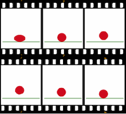  
[[wiki]](https://en.wikipedia.org/wiki/Animation#/media/File:Animexample3edit.png)


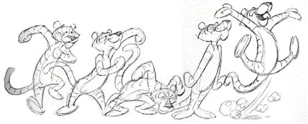  
[[pinimg]](https://i.pinimg.com/564x/f1/38/6e/f1386ee03fbbda3dfc5cf6f2d0c7dad4.jpg)

To create a smooth and fluid animation the remaining frames are filled with *inbetweens*. For hand-drawn animations these are usually done by the assistants of the animator, while for computer animations the missing frames are interpolated by the software. Keep in mind that for computer animation there are no explicit keyframes. Rather there are object attributes which are keyed, resulting in a set of frames for which there are keys.

  
[[script-tutorials]](https://www.script-tutorials.com/css-animation-guide-for-novices/)

Once again, there are different interpolation formulas, which are crucial for the final look.

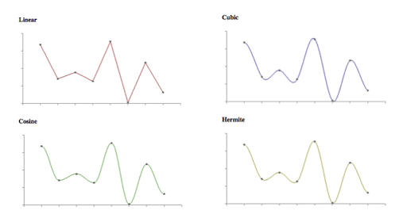  
[[paulbourke]](http://paulbourke.net/miscellaneous/interpolation/)

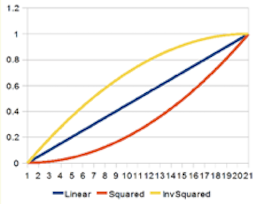  [interpolation_07](img/dynamics/interpolation_07.gif)  
[[sol.gfxile]](sol.gfxile.net/interpolation/)

If you want to know how to set keyframes in Houdini, check out this 2 minutes [video](https://vimeo.com/116173730). The most important tool to work with keyframes is the Graph Editor or [Graph View](https://www.sidefx.com/docs/houdini/ref/panes/changraph.html), which exists in some form or the other in all 3D animation packages.

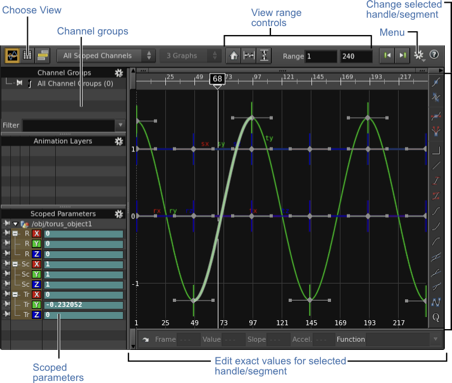  
[[sidefx]](https://www.sidefx.com/docs/houdini/ref/panes/changraph.html)

Keyframe animation is truly an art in itself. It takes practice and overall a lot of time and effort. To me personally it has always been the hardest aspect of doing 3D. I think I have just no eye for it, I only know when it is wrong but I have no understanding and intuition about what to change to make it right. I have spent countless hours practicing to animate walk cycles, with very disappointing results. Why am I telling you this? Because I want you to internalize how much time, effort, and experience it takes to create a keyframe animation. Ideally, have an expert around to do it for you!

### Kinematic Animation

Kinematics, as a field of study, is often referred to as the *geometry of motion*. A kinematics problem begins by describing the geometry of the system and declaring all initial conditions of any known values within the system, such as position. Any unknown parts of the system, such as the position in the next frame, can then be derived from the geometry of the system.  

Path animation, a common approach within 3D animation, is an example of *direct kinematic animation*. For path animation an object follows a specified path from control points. Aspects to look out for are the orientation of the object and whether velocity control, meaning slow-in/slow-outs, are needed.  

  
[[coherent-labs]](https://coherent-labs.com/posts/create-motion-path-animation-animate/)

In Houdini this is done with the  
[](http://www.sidefx.com/docs/houdini/shelf/constraintpath.html)

[[3]](https://en.wikipedia.org/wiki/Kinematics)  

#### Indirect Kinematic Animation

For indirect kinematic animation there is no direct information such as a path for a certain object in the scene. Instead, these objects derive their movement from the movement of other objects, e.g. with a hierarchy of joints. 

  
[[wiki]](https://en.wikipedia.org/wiki/Inverse_kinematics#/media/File:Modele_cinematique_corps_humain.svg)

There are two types of indirect kinematic animation, namely *forward kinematics* and *inverse kinematics*.

For forward kinematics we map the space of the joints to the Cartesian space of the scene. This means that we move the joints (e.g. from an arm) and get back a position and an orientation in scene space (e.g. for a hand).

  
[[generationrobots]](https://www.generationrobots.com/de/403512-roboterarm-reactorx-200.html) *The joints in green are rotated and the position of the hand is moved by that.*

For inverse kinematics, it is the other way around. We map the Cartesian space of the scene to the space of the joints. This means that we move a target handle, also called the *end effector* (e.g. a hand) and from that the orientation of the joints (e.g. for an arm) is derived. The addition of constraints, limits, collision detections, etc. plays a crucial part in inverse kinematics. For example, when building a human leg system, you want to make sure that you can rotate the knee joints only about 135° in the direction of the back of the leg.

  
[[generationrobots]](https://www.generationrobots.com/de/403512-roboterarm-reactorx-200.html) *The handle in green is moved in space and the rotation of the joint is computed from that.*

  
[[grandscratchybluetonguelizard]](https://gfycat.com/grandscratchybluetonguelizard) *An inverse kinematic setup.*

If you are interested in implementing kinematics, have a look at the tutorials from our BFF, Dan Shiffman:

[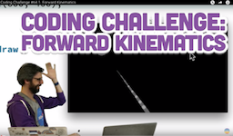](https://www.youtube.com/watch?v=xXjRlEr7AGk) [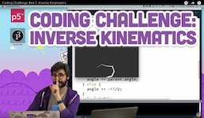](https://www.youtube.com/watch?v=hbgDqyy8bIw)

Now, onwards to the topic we are actually interested in: moving stuff without lifting a finger. Or something like that. Well, at least without creating a zillion keyframes...

### Animation in Unreal

Unreal Engine provides sophisticated animation tools, including full rigging systems, inverse kinematic solvers, and the MetaHuman framework.

* [Full-Body Inverse Kinematics](https://dev.epicgames.com/documentation/en-us/unreal-engine/control-rig-full-body-ik-in-unreal-engine?application_version=5.5)

  
[[epicgames]](https://dev.epicgames.com/documentation/en-us/unreal-engine/physics-in-unreal-engine)

Further reading: [Animating Characters and Objects](https://dev.epicgames.com/documentation/en-us/unreal-engine/animating-characters-and-objects-in-unreal-engine?application_version=5.5)

#### MetaHumans

MetaHuman is a complete framework for creating and animating realistic digital human characters.

<video width="768" controls autoplay loop muted>
  <source src="img/dynamics/metahumans_01.mp4" type="video/mp4">
</video> 

[[metahuman]](https://www.metahuman.com)

Each MetaHuman ships with:

* A rigged skeletal mesh
* A complete facial rig using both bones and the Control Rig system
* Hair (either strand-based or card-based)
* A body proportioned to the MetaHuman skeleton standard

<video width="768" controls autoplay loop muted>
  <source src="img/dynamics/metahumans_03.mp4" type="video/mp4">
</video>

[[metahuman]](https://www.metahuman.com)

<video width="768" controls autoplay loop muted>
  <source src="img/dynamics/metahumans_02.mp4" type="video/mp4">
</video>

[[metahuman]](https://www.metahuman.com)

MetaHumans come with several dedicated tools:

* **MetaHuman Creator** — a browser-based (or in-engine) tool for customizing the character's appearance
* **Mesh to MetaHuman** — converts a scanned or hand-modeled mesh into a MetaHuman
* **MetaHuman Animator** — drives facial animation, including markerless motion capture from video

<video width="768" controls autoplay loop muted>
  <source src="img/dynamics/metahumans_04.mp4" type="video/mp4">
</video>

[[metahuman]](https://www.metahuman.com)

To access the functionality, select the *MetaHuman Creator Core Data* as part of the Unreal Engine installation process and enable the MetaHuman Creator plugin in your project.

[MetaHuman Sizzle Reel 2026 | Unreal Fest Chicago](https://www.youtube.com/watch?v=_mMZNx9AWTg)

[NEW Unreal Engine 5.8 MetaHuman Markerless Mocap Tutorial](https://www.youtube.com/watch?v=b2i1aZbhxAU)

[[epicgames - MetaHuman]](https://www.metahuman.com)

## Dynamics

A dynamic system computes the motion of objects — such as point masses, solid rigid bodies, or systems of points — under the influence of *forces*.

A dynamic system is, for example, useful for the animation of a large number of objects, such as a *particle system*. Particle systems are easily made of thousands of particles and most sane people would not want to set keyframes for every single particle.

Imagine the scenario where we have an object or a collection of objects, such as a ball or debris, and we have two forces, such as gravity and wind. We want to compute the movement of all objects under the influence of those forces — specifically, the position of all objects at each frame.

### Forces

Intuitively, the application of a force can be described as a *push* or a *pull*. More precisely, in physics, a force is any interaction that, when unopposed, will change the motion of an object. A force can cause an object with mass to change its *velocity* (which includes beginning to move from a state of rest), that is to *accelerate*. A force has potentially both *magnitude* and *direction*, making it a vector quantity. [[4]](https://en.wikipedia.org/wiki/Force)  

For using the magic of forces, we first have to dig into some mathematical background. 🤓

### Time

Dynamic forces can change over time. This means we must not only compute the effect of forces at a single moment, but track how the system evolves step by step. The system is *stateful*: past states, such as the previous velocity or position, influence future states.

This is why a dynamic solver must recompute at each time step — recalculating the force, acceleration, velocity, and position every frame.

## Mathematical Fundamentals

We are now going through the math needed to understand how a force changes the position of an object. We start by investigating what happens when an object moves, build up to velocity and acceleration, and then connect those back to force via Newton's second law.

### Velocity

Let's say we want to get from point **a** to point **b**. For that we add a vector to **a**, which moves it to **b**.

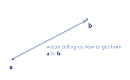 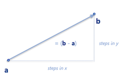

This is the *velocity* vector (*Geschwindigkeit*) that tells us where to go. The velocity of an object is the *rate of change of its position* over time, and it is a function of time. Velocity is equivalent to a specification of an object's speed and direction of motion (e.g. 60 km/h to the north). Do not confuse velocity and speed. *Speed* (*Tempo*) is the scalar magnitude of a velocity vector and denotes only how fast an object is moving. Velocity also includes the direction of motion. Hence, velocity as a physical vector quantity needs to define both magnitude and direction. For example, *5 metres per second* is a scalar, whereas *5 metres per second east* is a vector. [[7]](https://en.wikipedia.org/wiki/Velocity)

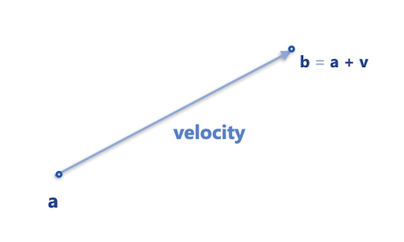

In short:

> Velocity is a *rate of change*.

It tells us: how much does position change when time changes?

Computations in regard to moving objects and changing positions are part of *[Calculus](https://en.wikipedia.org/wiki/Calculus)*, *the study of change*.  

> Calculus is the mathematical study of change, in the same way that Geometry is the study of shape, and Algebra is the study of operations and their application to solving equations. [[5]](https://books.google.de/books?id=-WC_AAAAQBAJ&printsec=frontcover&hl=de&source=gbs_ge_summary_r&cad=0#v=onepage&q&f=false)

#### Slope

If we draw the position of an object over time on a graph and ask "how fast was it moving between two moments?", we can read that off directly. The object moved from position y₁ to y₂ between times t₁ and t₂, so its velocity was:

$$m = \frac{\Delta y}{\Delta t} = \frac{y_2 - y_1}{t_2 - t_1}$$

where the symbol Δ (Delta) is an abbreviation for *change in*. This ratio — how much y changes when t changes — is what we call the *slope* **m** of the line on the graph. Slope and velocity are not two separate ideas: for a position-over-time graph, slope **is** velocity.

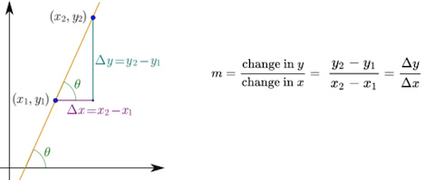

A straight line has the same slope everywhere — this corresponds to a constant velocity. But what if the object is speeding up? The position graph curves, and the slope changes at every point.

*How do we compute the slope at a single point on a curve?*

We shrink the distance between two neighboring points towards zero:

  
[[wiki]](https://en.wikipedia.org/wiki/Derivative)

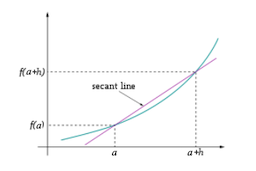  
[[wiki]](https://en.wikipedia.org/wiki/Derivative)

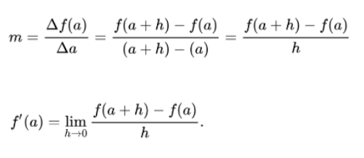  
[[wiki]](https://en.wikipedia.org/wiki/Derivative)

Similarly, imagine we are animating the position of one red particle in y, based on the formula *y = 2(t-0.5)³*. We can visualize the particle's movement against time in x:

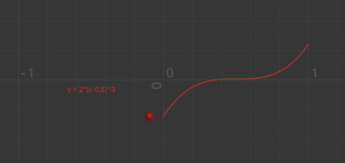  
[[6]](https://entagma.com/particles-part-03-the-principle-of-particle-simulation/)

Visualization of the red particle's slope at each moment in time:

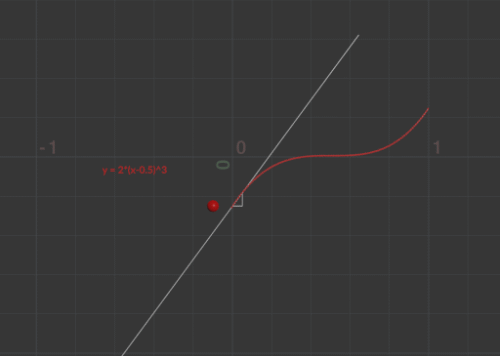  
[[6]](https://entagma.com/particles-part-03-the-principle-of-particle-simulation/)

#### Differentiation

*Differentiation* is a method to find an *exact value for the slope*, hence the rate of change at any given time t. 

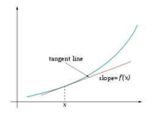  
[[wiki]](https://en.wikipedia.org/wiki/Derivative)

This means:

> The first derivative of the function *y = f(t)* is a measure of the rate at which the value *y* of the function changes with respect to the change of the time *t*.

We can easily plot the derivative of the position of the particle — that is, its velocity — based on the analytically computed derivative (shown in yellow):

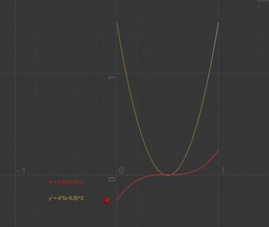  
[[6]](https://entagma.com/particles-part-03-the-principle-of-particle-simulation/)

For many functions there are [differentiation rules](https://en.wikipedia.org/wiki/Differentiation_rules) that let us find derivatives analytically. If an analytical solution is not possible, numerical approximations are used instead.

In summary:

> The velocity function is the first derivative of the position function. Conversely, the position function is the integral of the velocity function.

To have a *constant* velocity, an object must have a constant speed in a constant direction.

### Acceleration

Velocity says "move this much per frame." But what if "this much" is itself changing?

If there is a change in speed, direction, or both, then the object has a changing velocity and is said to be undergoing an *acceleration* (*Beschleunigung*). For example, a car moving at a constant 20 kilometres per hour in a circular path has a constant speed, but does not have a constant velocity because its direction changes. Hence, the car is considered to be undergoing an acceleration.

> Acceleration measures the rate of change of velocity over time. Acceleration can be described as the first derivative of velocity and the second derivative of position.

Again, we can easily plot the analytical derivative of the velocity of the particle — its acceleration — shown in blue:

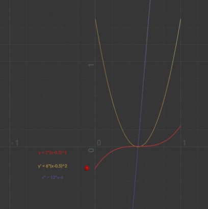  
[[6]](https://entagma.com/particles-part-03-the-principle-of-particle-simulation/)

### In Summary

* Velocity measures the rate of change of position over time.
* Acceleration measures the rate of change of velocity over time.

The quantities **v**, **a**, and **p** are all *vectors* — they carry both a magnitude and a direction. In 3D space each is a triple of values, e.g. **p** = (x, y, z). This means the formulas below work in any direction simultaneously, and any force we add later will simply be another vector entering the same chain.

The relationship between position, velocity, and acceleration follows directly from integration — the inverse of differentiation:

**v'** = **v** + ∫**a** dt  
**p'** = **p** + ∫**v** dt

That is: the integral of acceleration over a time step gives the change in velocity, and the integral of velocity over a time step gives the change in position.


Imagine integration like filling a tank from a tap. The input (before integration) is the flow rate from the tap (velocity). Integrating the flow (adding up all the little bits of water) gives us the volume of water (new position) in the tank. Imagine the flow starts at 0 and gradually increases (maybe a motor is slowly opening the tap). As the flow rate increases, the tank fills up faster and faster. With a flow rate of 2x, the tank fills up at x². We have integrated the flow to get the volume. [[9]](https://www.mathsisfun.com/calculus/integration-introduction.html)  

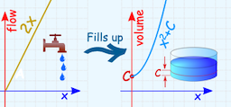  
[[mathsisfun]](https://www.mathsisfun.com/calculus/integration-introduction.html)

Well, that is all fun and games but didn't we want to figure out how a *force* changes the position of an object? Remember that we earlier learned that a force is a vector that causes an object with mass to *accelerate*. It seems like we are getting closer. But first, Newton.

[[7]](https://en.wikipedia.org/wiki/Velocity)

### Newton's Three Laws of Motion

  
[[wiki]](https://en.wikipedia.org/wiki/Isaac_Newton) *Sir Isaac Newton is widely recognized as one of the most influential scientists of all time and as a key figure in the scientific revolution.*

We are actually only really interested in [Newton's](https://en.wikipedia.org/wiki/Isaac_Newton) *second* law of motion. But as we are currently in the business of movement, and as we also want to be overall well-educated people, let's also have a brief look at the first and third law.

#### Newton's First Law of Motion

> An object at rest stays at rest and an object in motion stays in motion.

...for a constant speed and direction — as we already know! A force will mix things up. For example, a ball tossed in the earth's atmosphere slows down because of air resistance, which is a force.

#### Newton's Third Law of Motion

> For every action there is an equal and opposite reaction.

This law is a bit tricky to understand. The third law states that all forces between two objects exist in equal magnitude and opposite direction: if one object A exerts a force **F**<sub>A</sub> on a second object B, then B simultaneously exerts a force **F**<sub>B</sub> on A, and the two forces are equal in magnitude and opposite in direction: **F**<sub>A</sub> = −**F**<sub>B</sub> [29, as cited in [8]]. The third law means that all forces are interactions between different bodies [30, 31, as cited in [8]] and thus that there is no such thing as a force that is not accompanied by an equal and opposite force. This law is sometimes referred to as the *action-reaction law*.

From a conceptual standpoint, Newton's third law is seen when a person walks: they push against the floor, and the floor pushes against the person. In swimming, a person interacts with the water, pushing the water backward, while the water simultaneously pushes the person forward. The reaction forces account for the motion in these examples.

The good news is that in computer graphics we do not have to stay true to physics but only need to model the perceived visual results of the law, such as a character walking.

[[8]](https://en.wikipedia.org/wiki/Newton%27s_laws_of_motion#Newton's_third_law)  

And now, drum roll please, the second law of motion.

#### Newton's Second Law of Motion

> Force equals mass times acceleration, hence **F** = m · **a**.

With **F** as force, m as mass, and **a** as acceleration. Note that **F** and **a** are vectors (bold), while m is a scalar — mass has no direction, only magnitude.

Why is this exciting? Now we have a formula that directly ties a force to acceleration, which we had already tied to a change of position, meaning moving stuff.

The law says that acceleration is directly proportional to force and inversely proportional to mass. This means if you get pushed, the harder you are pushed the faster you will accelerate, and the bigger you are the slower you will accelerate.

*On a Side Note*: Weight vs. Mass vs. Density

* The *mass* of an object is a measure of the amount of matter in the object (measured in kilograms).
* *Weight*, though often mistaken for mass, is technically the force of gravity on an object. From Newton's second law, we can calculate it as mass times the acceleration of gravity (w = m · g). Weight is measured in newtons.
* *Density* is defined as the amount of mass per unit of volume (grams per cubic centimetre, for example).
* An object with a mass of one kilogram on earth would have a mass of one kilogram on the moon. However, it would weigh only one-sixth as much.

We can also express acceleration directly:


**a** = **F** / m

In computer graphics we work with a virtual world and can set our own values. If we give objects a mass of 1, then **a** = **F** — the acceleration of an object equals the force applied. How easy is that!

If we have more than one force, such as gravity and wind, the more precise formulation is: *the net force equals mass times acceleration*, meaning acceleration equals the *sum of all forces* divided by mass.

Now back to the question: how does a force change the position of an object? The complete chain is:

1. Add up all forces: **F** = ΣF
2. Compute the acceleration: **a** = **F** / m
3. Compute the velocity: **v'** = **v** + ∫**a** dt
4. Compute the position: **p'** = **p** + ∫**v** dt

Steps 3 and 4 require integration. The question is: how do we actually compute those integrals?

### How To Integrate

There are two approaches.

The first is an *analytical solution*: applying integration rules to find an exact formula. This is accurate and necessary for real-world physical simulations, but requires that the function be integrable by known rules. [[Integration rules]](https://iacedcalculus.com/integration-rules/)

The second is *numerical approximation*: replacing the integral with a sum of small steps. This trades exactness for simplicity and works well for computer graphics. Additionally, for complex systems of many particles and forces, an analytical solution is often impossible — approximation is the only practical option.

> How to integrate really depends on the scenario.

### Euler Integration

So, we are in the situation that we want to integrate the acceleration function (blue) to get the velocity function (yellow), and then integrate the velocity function to get the position function (red).

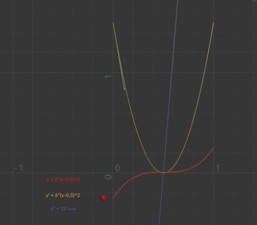  
[[6]](https://entagma.com/particles-part-03-the-principle-of-particle-simulation/)

The acceleration function (blue) is defined by the rate of change of the velocity function (yellow). This rate of change is the slope at each point of the velocity graph.

Instead of integrating analytically, we approximate by following the slope in small time steps. The key idea:

> At each step we pretend that acceleration (and velocity) are constant over the duration of that step.

Under that assumption, the integral over one small time step Δt simplifies from a curve to a rectangle — a multiplication:

∫**a** dt ≈ **a** · Δt  
∫**v** dt ≈ **v** · Δt

This gives us the *Euler Integration* formulas:

**v'** = **v** + **a** · Δt  
**p'** = **p** + **v'** · Δt

In other words: at each step, read the current slope (the derivative at the current point) and walk along it for one small step. This is equivalent to moving a short distance along the tangent line to the curve at that point.

> From any point on a curve, you can find an approximation of a nearby point on the curve by moving a short distance along a line tangent to the curve.

  

The "direction of change" in each step is exactly the rate of change we established earlier:

* To step position forward: the direction of change is **velocity** (the derivative of position)
* To step velocity forward: the direction of change is **acceleration** (the derivative of velocity)

The smaller the time steps, the more accurately the approximation follows the true curve. However, smaller steps mean more computation per second of simulated time, which can cause performance issues.

**Number Example**

Consider a ball falling under gravity. We set mass m = 1 (so **a** = **F** directly), gravity force F = 10 (downward), and time step Δt = 1 for clean numbers. Starting position p = 0, starting velocity v = 0.

| Step | a = F/m | v' = v + a·Δt      | p' = p + v'·Δt     |
| ---- | ------- | ------------------ | ------------------ |
| 0→1  | 10      | 0 + 10·1 = **10**  | 0 + 10·1 = **10**  |
| 1→2  | 10      | 10 + 10·1 = **20** | 10 + 20·1 = **30** |
| 2→3  | 10      | 20 + 10·1 = **30** | 30 + 30·1 = **60** |

Velocity grows by the same amount each step — constant acceleration produces linear growth in velocity. Position grows by more each step — the ball falls further in each equal time interval. This is exactly the accelerating fall we would expect from gravity.

Note: Δt = 1 is unrealistically large and used here only for clean numbers. In a real simulation each frame is approximately 1/60 second.

There are a number of different numerical integration methods, such as [Verlet Integration](https://en.wikipedia.org/wiki/Verlet_integration) or the famous [Runge-Kutta Integration](https://en.wikipedia.org/wiki/Runge%E2%80%93Kutta_methods). These methods are mathematically more complex but potentially more accurate and/or more efficient. They differ in mathematical complexity, accuracy, performance, and stability. Most of the time Euler integration is good enough and has the advantage of being simple and fast.

### Summary

For computing a dynamic system, e.g. a particle simulation, we start with the forces. The forces create acceleration, the acceleration is integrated to find the velocity, and the velocity is integrated again to find the position. That position is then assigned to the moving element or particle.

> In a dynamic system we define forces, these forces create acceleration, from these we compute the velocity, and from that the position.

As dynamic forces might change over time, we repeat the computation at each time step — recomputing the force, acceleration, velocity, and position each frame.

A simple representation in [p5.js](https://p5js.org/):

```javascript
class Mover {
  constructor() {
    this.position = createVector(width / 2, height / 2);
    this.velocity = createVector(0, 0);
    this.acceleration = createVector(-0.001, 0.01);
  }

  update() {
    this.velocity.add(this.acceleration);
    this.position.add(this.velocity);
    // Depending on the scenario you may want to reset
    // acceleration to zero here, or limit the speed.
  }

  show() {
    // draw the object
  }
}
```

[[6]](https://entagma.com/particles-part-03-the-principle-of-particle-simulation/)


## Creating Forces

Once again, a force is just a vector applied to an object. We divide the force by the object's mass and add it to the object's acceleration vector.

*But how do we get such a force vector?*

Well, there are several ways. For one, we can simply make one up for our make-believe pixel worlds (e.g. we do so in the exercise) 🎉.  
  
Or, we can model a force according to the physics of the real world. For this we need to look up their defining formulas and translate them into source code. I would like to guide you through one example, as this is a really good exercise for becoming more comfortable with formulas that look intimidating but are not, once you have a closer look.

Such existing forces include gravity, electromagnetism, friction, tension, elasticity, etc. There is still quite some flexibility when modeling forces for our purposes. For which characteristics we are flexible depends on the force and the context. As always with coding, you can decide by testing different values and trial and error (my favorite approach 🙃).

Always keep in mind that forces usually highly depend on the existing velocity of the object we want to apply the force to. So most of the time you need to integrate the object's velocity into the formula of a force. It is also always helpful to really understand the overall concept behind a force. What does tension mean? How does the effect look? What do we want to do with it?

When we look up a formula, we always follow the same principle for working with any force — we need to deconstruct the force's formula into two parts:

1. How do we compute the force's *direction*?
2. How do we compute the force's *magnitude*?

### Example Air and Fluid Resistance

Friction occurs when a body passes through a liquid or gas. This force is called a *drag force*, a *viscous force*, or *fluid resistance*. With that we want to model e.g. a drag force for a liquid (the gray area):

  
[[codingtrain]](https://editor.p5js.org/codingtrain/sketches/5V8nSBOS)  

Or the air resistance for a plane:

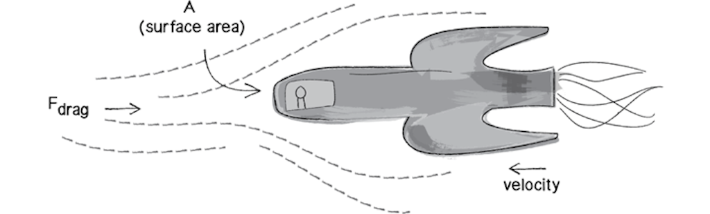  
[[10]](http://natureofcode.com/book/chapter-1-vectors/)  


A textbook, meaning [wikipedia](https://en.wikipedia.org/wiki/Drag_(physics)), gives you the formula for a drag force as

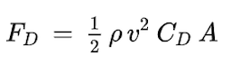  

where

* F<sub>D</sub> is the drag force,
* 𝞺 (rho) is the density of the fluid,
* *v* is the speed of the object,
* A is the cross sectional area, and
* C<sub>D</sub> is the drag coefficient.

Let's understand that better. What can we understand about the force's direction and magnitude? We have a magnitude with v as the speed of the object, meaning the magnitude of the object's velocity. But there is no obvious direction. This means that the drag force does not change the object's direction. Nonetheless we always need a direction for a force.

But wait. In our scenario visualized above, the balls slow down and F<sub>drag</sub> in the image is *facing* the airplane. This means we have to use the opposite direction of the object's current velocity vector. But we do not want to interfere with the formula's own speed information. Hence, for direction we multiply by the inverse of the incoming unit velocity vector v̂ (length of one, direction only).

Now let's decipher the formula step by step:

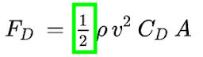  

1. Factors like this are usually irrelevant for our make-believe worlds as we can set our own values. We simply ignore this.

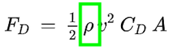  

2. This is the density of the liquid. We can simplify the problem and treat this as a constant value of 1.

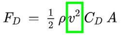  

3. We already identified this as the magnitude of the velocity vector (which is then squared), hence the speed of the object.

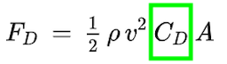  

4. *C<sub>D</sub>* stands for the coefficient of drag. This is the only constant we will keep, to determine the strength of the drag force.


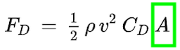  

5. *A* stands for the frontal area of the object pushing through the liquid. For a basic simulation, we can ignore it.

With the steps taken above,

  

reduces to

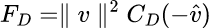  
[[10]](http://natureofcode.com/book/chapter-1-vectors/)  

and a simple implementation in Processing could look like the following:

```java
//https://natureofcode.com/book/chapter-2-forces/

void drag(Liquid l)
{
    float speed = velocity.mag();

    // magnitude
    float dragMagnitude = l.c * speed * speed; // CD * v^2

    // direction
    PVector drag = velocity.get();
    drag.mult(-1); // opposite of velocity
    drag.normalize();

    // Putting magnitude and direction together
    drag.mult(dragMagnitude);

    // Apply the force.
    applyForce(drag);
}

...

void applyForce(PVector force)
{
    PVector f = PVector.div(force, mass);
    acceleration.add(f);
}
```

The above code produces something like the already shown example:

  
[[codingtrain]](https://editor.p5js.org/codingtrain/sketches/5V8nSBOS)  


You can also have a look at the [live demo in p5](https://editor.p5js.org/codingtrain/sketches/5V8nSBOS) from Dan Shiffman and test different values for the drag coefficient. There is also a [video about the drag force](https://thecodingtrain.com/tracks/the-nature-of-code-2/noc/2-forces/4-drag-force) from him (updated in 2020!).  
  
One last question about this force:

*Why do the smaller objects slow down more than the larger objects?*

In this implementation, the balls have a mass related to their size, meaning smaller balls have a smaller mass. The mass is considered in the example above by the line

```java
PVector f = PVector.div(force, mass);
```

Back to our favorite insight of this chapter, Newton's second law with **a** = **F** / m. We know that acceleration is inversely proportional to mass, meaning the smaller the mass, the higher the acceleration. In this example, the smaller the mass the more strongly the force affects the object's movement.

If you are further interested in creating your own forces and working with them, I recommend [Chapter 2. Forces](https://natureofcode.com/book/chapter-2-forces/) in Dan's [Nature of Code book](https://natureofcode.com/) and his [video series about forces](https://www.youtube.com/playlist?list=PLRqwX-V7Uu6ZV4yEcW3uDwOgGXKUUsPOM). 


[[10]](http://natureofcode.com/book/chapter-1-vectors/)  
  


## Dynamics in Unreal

From Unreal Engine 5, the physics engine is [Chaos Physics](https://dev.epicgames.com/documentation/en-us/unreal-engine/physics-in-unreal-engine), which replaced the previously used PhysX engine.

  
[[epicgames]](https://dev.epicgames.com/documentation/en-us/unreal-engine/physics-in-unreal-engine)

Chaos Physics is well documented at a basic level and has many introductory tutorials. Going beyond the basics is harder — fewer in-depth tutorials exist and the system can at times be unstable.

Chaos Physics covers a wide range of simulation features:

* Destruction
* Networked Physics
* Rigid Body Dynamics
* Physical Animation
* Cloth Physics
* Ragdoll Physics
* Vehicles
* Fluid Simulation
* Hair Physics
* Flesh Simulation

Some of these features, in particular particle-based effects, are accessed through the Niagara system.

### Niagara Visual Effects System

[Niagara](https://dev.epicgames.com/documentation/en-us/unreal-engine/tutorials-for-niagara-effects-in-unreal-engine) is Unreal's node-based visual effects system, designed for particle-based simulations such as:

* Smoke, fire, sparks
* Magic effects, rain, explosions

Niagara is:

* **Node-based** — visual scripting, no raw code required
* **GPU and CPU** — simulations can run on either processor
* **Modular** — reusable blocks called modules define particle properties and behaviors
* **Interactive** — can react to gameplay events in real time
* **Integrated** — works with Blueprints, Materials, and Skeletal Meshes

Niagara also provides access to [fluid simulation](https://dev.epicgames.com/documentation/en-us/unreal-engine/fluid-simulation-in-unreal-engine---overview).

  
[[epicgames]](https://dev.epicgames.com/documentation/en-us/unreal-engine/creating-visual-effects-in-niagara-for-unreal-engine)

[[epicgames - Key Concepts in Niagara]](https://dev.epicgames.com/documentation/en-us/unreal-engine/key-concepts-in-niagara-effects-for-unreal-engine)

---

## References

[[1] Merriam Webster - animate](https://www.merriam-webster.com/dictionary/animate)  
[[2] TRB - Heider-Simmel: Is there a story?](http://trbq.org/play/)  
[[3] Wiki - Kinematics](https://en.wikipedia.org/wiki/Kinematics)  
[[4] Wiki - Force](https://en.wikipedia.org/wiki/Force)  
[5] Kadry, S., 2014. [Mathematical Formulas For Industrial And Mechanical Engineering](https://books.google.de/books?id=-WC_AAAAQBAJ&printsec=frontcover&hl=de&source=gbs_ge_summary_r&cad=0#v=onepage&q&f=false). London: Elsevier.  
[[6] Entagma - Particles Part 03 – The Principle Of Particle Simulation](https://entagma.com/particles-part-03-the-principle-of-particle-simulation/)  
[[7] Wiki - Velocity](https://en.wikipedia.org/wiki/Velocity)  
[[8] Wiki - Newton's Third Law](https://en.wikipedia.org/wiki/Newton%27s_laws_of_motion#Newton's_third_law)  
[[9] Maths is Fun - Introduction to Integration](https://www.mathsisfun.com/calculus/integration-introduction.html)  
[[10] The Nature of Code - Forces](https://natureofcode.com/book/chapter-2-forces/)  
[[11] The Nature of Code - Autonomous Agents](https://natureofcode.com/book/chapter-6-autonomous-agents/)  
[[12] Wiki - Boids](https://en.wikipedia.org/wiki/Boids)  

---

The End

🦾 🌪 🔥 
