name: inverse
layout: true
class: center, middle, inverse
---


# Procedural Generation and Simulation

#### - Beauty in Maths -

<br />


### Prof. Dr. Lena Gieseke | l.gieseke@filmuniversitaet.de  

#### Film University Babelsberg KONRAD WOLF


???
* https://www.nytimes.com/interactive/2025/03/18/arts/design/mondrian-flowers.html?smid=nytcore-ios-share&referringSource=articleShare
* 


---
layout:false

## Beauty in Maths

.center[]

---

## Beauty in Maths

.center[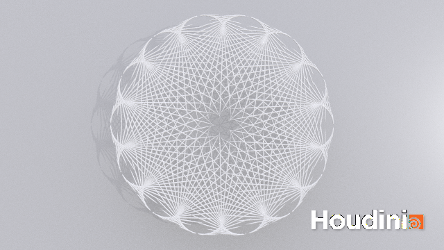]


---
layout: false

## Beauty in Maths

--
* Beautiful Numbers

--
* Beautiful Curves

???
**What is a fractal?** A fractal is a geometric object that shows self-similarity across scales: zoom in on any part and you find structure resembling the whole, repeating at every level of magnification without ever resolving into simple smooth shapes.

Benoit Mandelbrot coined the term in 1975 from the Latin **fractus**, meaning broken or irregular. Mandelbrot's point was that the interesting geometry of the real world is precisely in the broken, jagged, fragmented parts that classical geometry ignored or could not handle. A coastline is not poorly approximated by a smooth curve. It is fundamentally a different kind of object that requires a different mathematical language entirely.

They appear throughout nature: coastlines, snowflakes, fern leaves, blood vessel branching, lightning. Nature repeatedly solves structural problems with self-similar geometry because it is an efficient way to pack complexity into simple recursive rules.


* What is a pattern?
    * Repetitive structures that follow some sort of creation principles.
    * Mandelbrot: Bottomless wonders spring from simple rules, which are repeated without end.

* What means Self-Similarity?
    * In mathematics, a self-similar object is exactly or approximately similar to a part of itself (i.e., the whole has the same shape as one or more of the parts). Many objects in the real world, such as coastlines, are statistically self-similar: parts of them show the same statistical properties at many scales.
* What is an abstraction?
    * Breaking with e.g. visuals from reality
    * Abstraction came to live when artists moved away from visually representing reality in a literal fashion.
    * With the start of the last century, artists broke with visuals from reality and became more and more *non-representational*. Also, in terms of meaning artist broke free and did not aim to convey a certain, specific *subject matter* anymore. Instead, artist rely on form, color, or technique to engage the viewer on a more *intuitive* level.
* Procedural Generation
* Advantages
    * Compactness
        * Few kilobytes for textures and volumes
    * Continuous and multi-resolution
        * Any resolution
        * Any extent
        * E.g. for VR scenes
    * Potentially randomly accessible
        * Meaning, you can for example compute the color value for one pixel of a rasterimage independently from all other pixel in no particular order.
        * It can be evaluated in a constant time, regardless of the location of the point of evaluation, and regardless of previous evaluations.
        * Harness the power of multi-pipe GPU’s and multi-core CPU’s.
    * Parametrized
        * Often specify a whole visual category or class with controlling large amounts of details
        * Fast to interact with and flexible, e.g. in an interactive system
        * Remain editable throughout an entire visual effect production pipeline for example
* Disadvantages
    * Parametrized
        * Non-intuitive
            * Too abstract characteristics of the underlying functions (e.g. *frequency*)
            * Overlapping effects
        * Too little control
            * Surprising results can also be seen as positive
            * Almost never allow per-pixel control of the output 
        * Time-consuming exploration
    * Implementation effort
    * Limited design space
    * Potential evaluation time issues
    * Potential aliasing issues


---
layout: false

## Beauty in Maths

* Beautiful Numbers
* Beautiful Curves

???

*The Mandelbrot set* is a collection of points in the complex plane that don't "escape to infinity" under a simple repeated operation.

The operation: take a complex number c, start with z = 0, then keep applying:  
`z → z² + c`

The question: does z stay bounded, or blow up toward infinity?

If you keep squaring and adding c and the result stays finite forever, then c is in the Mandelbrot set. If it eventually races off to infinity, it's out.

Computing it is simple:
* Pick a point c on the plane (e.g. c = 0.3 + 0.5i)
* Iterate z = z² + c starting from z = 0
* If |z| exceeds 2 at any point, it will escape — stop and mark c as outside
* If it hasn't escaped after some maximum iteration count (say, 1000), assume it's inside
Repeat for every pixel on screen

The famous fractal image comes from coloring outside points by how quickly they escaped. Points that flee after 3 iterations get a different color than those that survive 800.

The boundary between "escapes" and "doesn't escape" is where all the visual chaos lives — infinitely complex, no matter how far you zoom in.

One of the most intricate objects in mathematics falls out of z² + c. The universe has a sense of humor.


---
template: inverse

# Beauty in Maths

---
template:inverse

# $e^{i\pi} + 1 = 0$


???
  

where

* $e$ is Euler's number, the base of natural logarithms,
* $i$ is the imaginary unit, which by definition satisfies $i^{2} = −1$, and
* $\pi$ is pi, the ratio of the circumference of a circle to its diameter.


---
## Euler's Identity

The formula is considered to be an exemplar of vast mathematical beauty.


???
  

* Its beauty arises from its simplicity while expressing highly complex behavior and its profound connection between the most fundamental numbers in mathematics.

https://www.britannica.com/video/222290/Your-Daily-Equation-11-Eulers-Identity-or-The-Most-Beautiful-of-all-Equations

--

Stanford University mathematics professor Keith Devlin has said,  

> ...like a Shakespearean sonnet that captures the very essence of love, or a painting that brings out the beauty of the human form that is far more than just skin deep, Euler's equation reaches down into the very depths of existence. [4] 

--

Beauty *on a mathematical level* is *not* our topic but..  

--
  
...*visual representations and characteristics* of numbers and equations.

---
template: inverse

# Golden Ratios


???
  

* What is the golden ratio?

---
## The Golden Ratio

We have a *golden* ratio if the ratio of two quantities is the same as the ratio of their sum to the larger of the two quantities.

$\frac{a+b}{a} = \frac{a}{b}$


???
  

* A ratio describes one quantity in relationship to another one, e.g. how long the width of an image is in relationship to its height. 


--

Line segments in the golden ratio:

.center[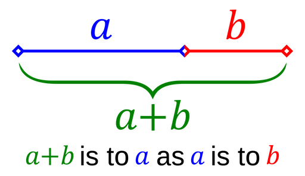  
.imgref[[[wiki]](https://en.wikipedia.org/wiki/Golden_ratio)]]


---
## The Golden Rectangle

.left-even[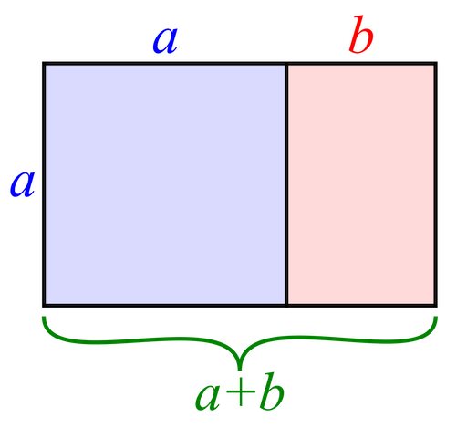  
.imgref[[[wiki]](https://en.wikipedia.org/wiki/Golden_ratio)]]


???
  

* Whether this is a *beautiful* ratio or not is up to personal taste. Be careful though not to believe the widespread understanding that the golden ratio is the *natural blueprint* for beauty. There is very little *scientific* evidence for that. You can find ratios similar to the golden ratio in the world, such as in human faces, the Parthenon, etc. but the emphasis is on *similar* and also there are various other prominent ratios out there. With the golden ratio we might have a case of *you find what you are looking for*.

--

.right-even[ 

<br >

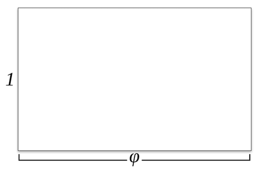]

---
## The Golden Rectangle

.left-quarter[  
]
.right-quarter[
     
This ratio is therefore also defined as $\varphi$:

$\frac{a+b}{a} = \frac{a}{b} \stackrel{\mathrm{def}}{=} \varphi$
]


???
  

* $\varphi$ is a very special number - why?

---
.header[The Golden Rectangle]
## Phi

$\frac{a+b}{a} = \frac{a}{b} \stackrel{\mathrm{def}}{=} \varphi$
  
--
  
<br >
One of the special properties of the Golden Ratio is that *it can be defined in terms of itself*:

--

$1+\frac{1}{\varphi}=\varphi$


---
.header[The Golden Rectangle]

### Derivation of $1+\frac{1}{\varphi}=\varphi$

--

This ratio is defined as $\varphi$:

(1) $\frac{a+b}{a} = \frac{a}{b} \stackrel{\mathrm{def}}{=} \varphi$

--

One method for finding the value of $\varphi$ is to start with the left fraction. 

(2) $\frac{a+b}{a}=\frac{a}{a}+\frac{b}{a} = 1+\frac{b}{a}$

--

We can derive from (1) $\frac{a}{b} = \varphi$ that $\frac{b}{a} = \frac{1}{\varphi}$ and put that into (2)

(3) $1+\frac{b}{a}=1+\frac{1}{\varphi}$

--

Setting that equal to the right side of (1), we get

$1+\frac{1}{\varphi}=\varphi$.

.footnote[[wiki](https://en.wikipedia.org/wiki/Golden_ratio)]

---
.header[The Golden Rectangle]
## Phi

$\varphi$'s definition with itself leads to a *continued fraction*:

$1+{\cfrac {1}{1+{\cfrac {1}{1+{\cfrac {1}{1+{\cfrac {1}{1+\ddots }}}}}}}}$

???
I we put phi into the equation with its definition

--

This is not valid and $\varphi$ can't be expressed as a regular fraction.

---
.header[The Golden Rectangle]
## Phi

A number which cannot be constructed from ratios (or fractions) of integers is an *irrational number*.   

--

Their decimal expansions neither terminate nor become periodic.
  
--

<br >
  
Rational Number:

$1.5 = \frac{3}{2}$  → *This is a ratio*

--
  
Irrational Number:

$\pi = 3.14159... = \frac{?}{?}$  → *No ratio possible*
  

---
.header[The Golden Rectangle]
## Phi


You can solve $1+\frac{1}{\varphi}=\varphi$ for $\varphi$ algebraically with the quadratic formula to 

--

$\frac{1+{\sqrt{5}}}{2} = 1.618\,033\,988\,7\dots$  
  

???
  

Multiplying by φ  gives
φ + 1 = φ^2 
which can be rearranged to
φ^2 − φ − 1 = 0

* Because $\varphi$ is the ratio between positive quantities, $\varphi$ is necessarily positive
* https://en.wikipedia.org/wiki/Golden_ratio

---
.header[The Golden Rectangle]
## Phi

.left-even[
In summary, we can represent $\varphi$ as  

|                    |                                  $\varphi$                                  |
| ------------------ | :-------------------------------------------------------------------------: |
| Decimal            |                          1.6180339887498948482...                           |
| Continued fraction | $1+{\cfrac {1}{1+{\cfrac {1}{1+{\cfrac {1}{1+{\cfrac {1}{1+\ddots }}}}}}}}$ |
| Algebraic          |                          $\frac{1+{\sqrt{5}}}{2}$                           |
  
]

--

.right-even[

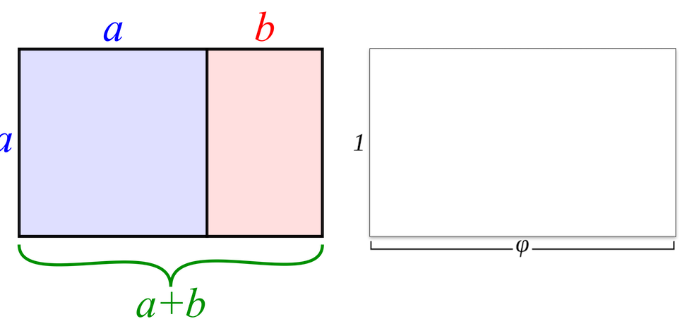

$\frac{1.618}{1} = \frac{(1.618 + 1)}{1.618} = \frac{2.618}{1.618} ≈ 1.618$  

]

???
  
* If b = 1, then a ≈ 1.618, giving:
* You can find $\varphi$ everywhere in nature - mathematically

---
## $\varphi$ in Nature


???
  

* Imagine you are a plant and you can spread leaves all around your stem. Now, being a plant, needing Photosynthesis and such, you want all of your leaves to soak up as much sun (and rain) as possible. So when you sprout a new leaf, you don’t want it to block your other leaves.

--
.center[]


---
## $\varphi$ in Nature


.center[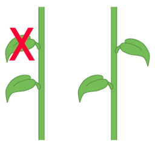  
.imgref[[[gofiguremath]](http://gofiguremath.org/natures-favorite-math/the-golden-ratio/the-golden-angle/)]]


---
## $\varphi$ in Nature

.center[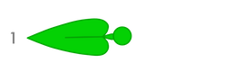]

.footnote[[[gofiguremath]](http://gofiguremath.org/natures-favorite-math/the-golden-ratio/the-golden-angle/)]

---
## $\varphi$ in Nature

.center[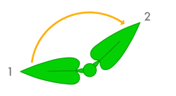]

.footnote[[[gofiguremath]](http://gofiguremath.org/natures-favorite-math/the-golden-ratio/the-golden-angle/)]

---
## $\varphi$ in Nature

.center[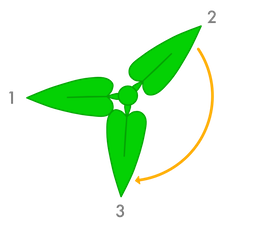]

.footnote[[[gofiguremath]](http://gofiguremath.org/natures-favorite-math/the-golden-ratio/the-golden-angle/)]

---
## $\varphi$ in Nature

.center[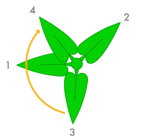]

.footnote[[[gofiguremath]](http://gofiguremath.org/natures-favorite-math/the-golden-ratio/the-golden-angle/)]

---
## $\varphi$ in Nature

.center[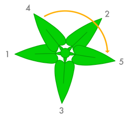]

.footnote[[[gofiguremath]](http://gofiguremath.org/natures-favorite-math/the-golden-ratio/the-golden-angle/)]

---
## $\varphi$ in Nature

.center[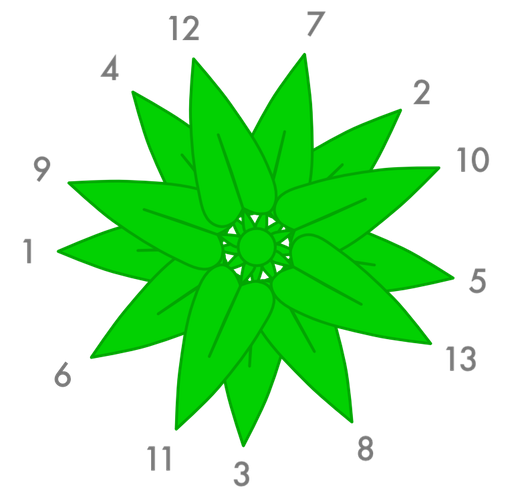]

.footnote[[[gofiguremath]](http://gofiguremath.org/natures-favorite-math/the-golden-ratio/the-golden-angle/)]


???
  

* What you want is to turn for every new leaf a certain degree as follows (the numbers indicate the order in which the leaves grew).

---
## $\varphi$ in Nature

.center[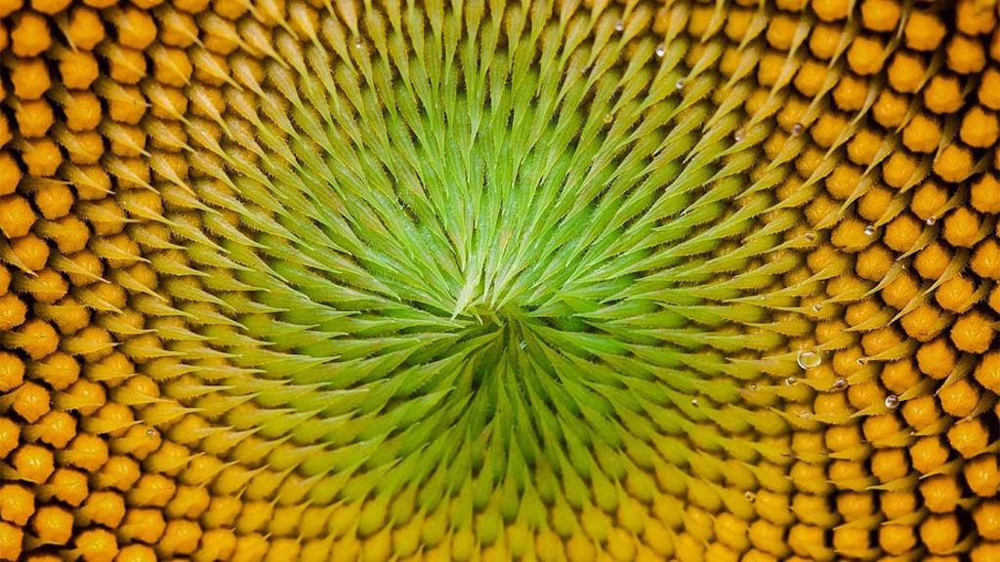  
.imgref[[[gofiguremath]](http://gofiguremath.org/natures-favorite-math/the-golden-ratio/the-golden-angle/)]]


???
  

* The same problem applies if you imagine to be a sunflower and you want to pack as many seeds as possible, while all of them getting as much sun as possible.

---
## Golden Angle

The flowers are making a turn to grow a new leaf or place a new seed with the *golden angle*.

.left-even[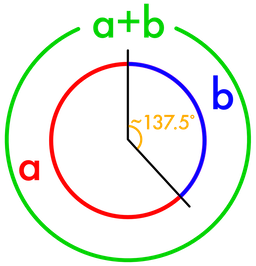  .imgref[[[gofiguremath]](http://gofiguremath.org/natures-favorite-math/the-golden-ratio/the-golden-angle/)]]

???

In geometry, the golden angle is the smaller of the two angles created by sectioning the circumference of a circle according to the golden ratio; that is, into two arcs such that the ratio of the length of the smaller arc to the length of the larger arc is the same as the ratio of the length of the larger arc to the full circumference of the circle: [[23]](https://en.wikipedia.org/wiki/Golden_angle)


--
.right-even[
* 360° / φ ≈ 222.5°
* 360° / φ² ≈ 137.5°

<br >
By convention, the golden angle is defined as the smaller of the two, which is 137.5°.
]


???
The deeper reason why φ² specifically appears, rather than just saying "the smaller arc," connects to how φ satisfies the equation:
`φ² = φ + 1`
(φ = 1 + 1/φ and multiply both sides by φ)

This self-referential property is what makes φ the most irrational number in the continued fraction sense. The angle 360°/φ² lands precisely in the gap that maximally avoids all rational subdivisions of the circle, for exactly the same reason φ itself does in the continued fraction.


---
## Golden Angle

.left-even[$~137.5°$

* Solution to *how far to turn from the last leaf* in degrees
]


---
## Golden Angle

.left-even[$~137.5°$

* Solution to *how far to turn from the last leaf* in degrees
* That is what plants do:]

???
  

* each new branch fits into the largest still-existing gap between older branches, cutting a constant fraction off that gap.
* Let δ=2zπ be the angle between two branches. We see that z can't be a rational number, otherwise after enough steps we'd have gaps that will never be filled. Let's instead construct a sequence of rationals zn converging to the real z
* At the n-th step we'd have zn=pnqn, which means, counting from 0, that the qn-th branch coincides with the 0-th and that we've done pn turns around the center.

http://jacquerie.github.io/sunflower/

--

.right-even[
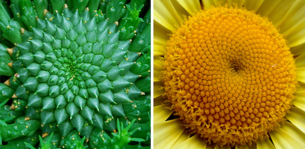  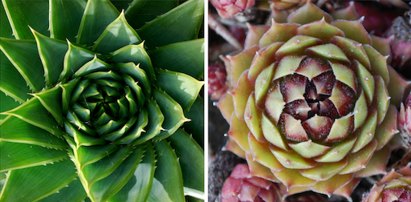  
.imgref[[[LeerZelfBeleggen]](https://leerzelfbeleggen.com/wp-content/uploads/2018/08/Fibonacci-trading-leren-traden-met-de-geheime-formule-voorbeelden.jpeg)]]

---
## Golden Angle

Such an arrangement of leaves, which applies the golden angle, is also called *phyllotaxis* (*leaf arrangement* in Greek) in botany. 


???
  

* Phyllotaxis is the botanical study of the arrangement of phylla (leaves, petals, seeds, etc.) on plants.

---
.header[Golden Angle]

## Phyllotaxis

There is a simple algorithm for it by Helmut Vogel.

--

.center[ .imgref[[[gofiguremath]](http://gofiguremath.org/natures-favorite-math/the-golden-ratio/the-golden-angle/)]]

---
.header[Golden Angle]

## Phyllotaxis

There is a simple algorithm for it by Helmut Vogel.


[.left-even[]](https://editor.p5js.org/legie/sketches/iVLdC_coE)


???
  

* https://editor.p5js.org/legie/sketches/iVLdC_coE
* If we change the angle from the golden angle to an arbitrary angle between 0..360 we get vastly different designs for only very small changes. The following code maps the angle to turn to the mouse position in x. Try the code for yourself: https://editor.p5js.org/legie/sketches/jnrQubUwZ
    * Say you place each seed 1/5 of a full circle apart, meaning 72 degrees. Seed 1 lands at 0°, seed 2 at 72°, seed 3 at 144°, seed 4 at 216°, seed 5 at 288°, seed 6 back at 360° which is identical to 0°. You get exactly 5 spokes radiating outward and nothing else. Every subsequent seed falls on top of an existing spoke. The space between spokes is wasted entirely. Any angle that is a rational fraction of 360° does this. It eventually cycles back and creates a fixed number of spokes, leaving gaps.
    * The golden angle defeats this. The golden angle is approximately 137.5°. More precisely it is 360° divided by φ², where φ is the golden ratio. The golden ratio is irrational, meaning it cannot be expressed as any fraction of whole numbers, not even approximately well. It is in a precise mathematical sense the most irrational number: the hardest to approximate closely by any rational fraction. This means the golden angle never cycles back. No two seeds ever land in exactly the same angular position. Ever. Across arbitrarily many seeds the angular positions remain distinct and spread as evenly as possible around the circle.


* https://www.sciencedirect.com/science/article/abs/pii/0025556479900804

--

.right-even[
    
<br /><br /><br /><br />
***How to put points on a circle?***
]

---
template:inverse

### Detour
## Circle Equations

---
.header[Detour | Circle Representations]
## Circle Equation in Parametric Form


.left-even[
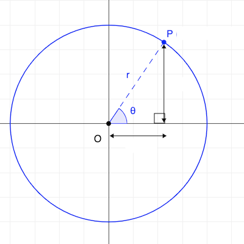
]

.right-even[
<br /><br /><br /><br />
*What is P expressed in $x, y$?*
]

---
.header[Detour | Circle Representations]
## Circle Equation in Parametric Form


.left-even[
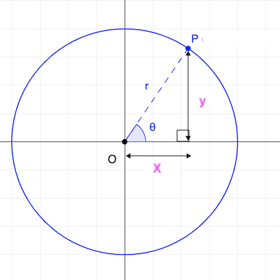
]

.right-even[
<br /><br /><br /><br />
*What is P expressed in $x, y$?*
]

???
* .todo[TODO: Herleitung]
  


---
.header[Detour | Circle Representations]
## Degrees vs. Radians

--

.left-even[
* Humans: degree $0..360°$
* Maths: radians $0..2*\pi$
]


???

Radians are the unit in which the underlying mathematics is actually defined. 


---
.header[Detour | Circle Representations]
## Degrees vs. Radians


.left-even[
* Humans: degree $0..360°$
* Maths: radians $0..2*\pi$

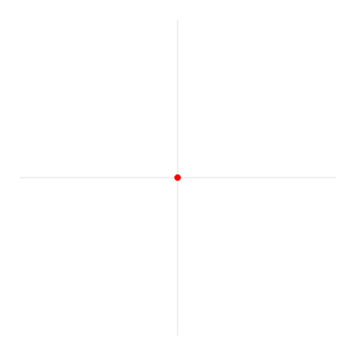
.imgref[[wiki](https://en.wikipedia.org/wiki/Radian)]]

???

An arc of a circle with the same length as the radius of that circle subtends an angle of 1 radian. 
On a unit circle is the x-coordinate of a point on the circle cos(angle), the y-coordinate is sin(angle).
* angle = 0        ->  point is at (1, 0)      ->  cos(0) = 1,   sin(0) = 0
* angle = pi/2     ->  point is at (0, 1)      ->  cos(pi/2) = 0, sin(pi/2) = 1
* angle = pi       ->  point is at (-1, 0)     ->  cos(pi) = -1, sin(pi) = 0
* angle = 3*pi/2   ->  point is at (0, -1)     ->  cos(3pi/2) = 0, sin(3pi/2) = -1

To get to sin, cos's periodic functions, we take the angle as it increases continuously from 0 upward, without wrapping in x (instead of the angle living on the circle, you stretch it out into a straight line)  and sin(angle) or cos(angle) in y. 

--
.right-even[

$radians = degrees * (\pi/ 180)$

*  $360° = 2\pi$
*  $180° = \pi$
*  $90° = \frac{\pi}{2}$
]


---
.header[Detour | Circle Representations]
## Circle Equation in Parametric Form


```c++

//count: number of points on circle

for(int i = 0; i < count; ++i) {

    float circleposition = i / count;

    float x = sin(circleposition * PI * 2.0) * radius;
    float y = cos(circleposition * PI * 2.0) * radius;
    float z = 0.0;

    vec3 position = vec3(x, y, z);
}
```


???

https://editor.p5js.org/legie/sketches/0iNVaazoy

---
.header[Detour | Circle Representations]
## Circle Equation in Polar Form


.left-even[

]

.right-even[
<br /><br /><br /><br />
*What if P is expressed in $r, \theta$?*
]

???
As in the Phyllotaxis algorithm by Helmut Vogel.


---
.header[Detour | Circle Representations]
## Circle Equation in Polar Form


.left-even[
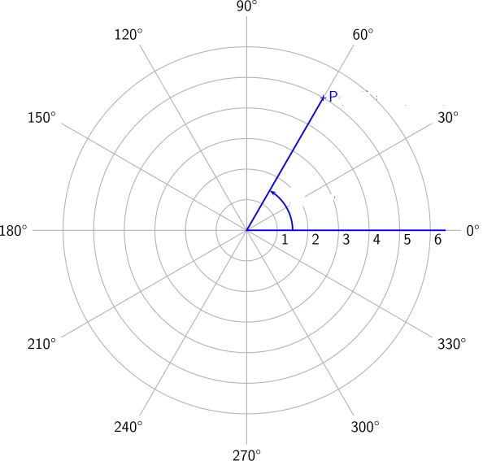
]

.right-even[
<br /><br /><br /><br />
*What if P is expressed in $r, \theta$?*
]


---
.header[Detour | Circle Representations]
## Circle Equation in Polar Form


.left-even[
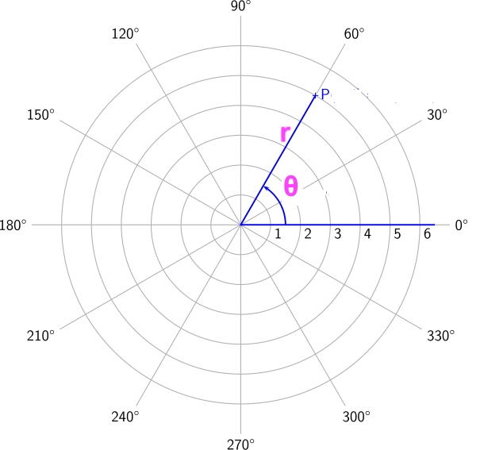
]

.right-even[
<br /><br /><br /><br />
*What if P is expressed in $r, \theta$?*
]


---
.header[Detour | Circle Representations]
## Circle Equation in Polar Form


.left-even[

]

.right-even[
<br /><br /><br /><br />
*What if P is expressed in $r, \theta$?*
* Distance from a reference point, usually the center point
* Angle from a reference direction, usually the horizontal axis
]

---
.header[Detour | Circle Representations]
## Circle Equation in Polar Form


.left-even[

]

.right-even[
<br /><br /><br /><br />
*How to from $x,y$ to $r, \theta$ (and back)?*
]


???
* .todo[TODO: Herleitung]
  


---
.header[Detour | Circle Representations]
## Polar vs. Cartesian Coordinates

.left-even[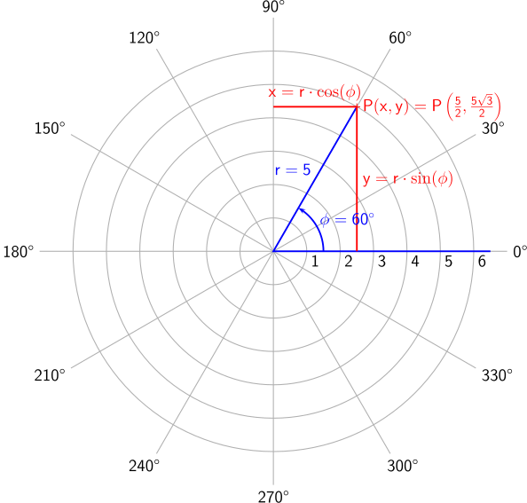]
.imgref[[[wiki]](https://de.wikipedia.org/wiki/Datei:Ebene_polarkoordinaten.svg)]

.right-even[  
  
$x = r \cos{\phi}$  
$y = r \sin{\phi}$
]


???


---
.header[Detour | Circle Representations]
## Polar vs. Cartesian Coordinates

.left-even[]
.imgref[[[wiki]](https://de.wikipedia.org/wiki/Datei:Ebene_polarkoordinaten.svg)]

.right-even[  
  
$x = r \cos{\phi}$  
$y = r \sin{\phi}$

<br />
and

$r = \sqrt{{x^2 + y^2}}$  
$\phi = \tan^{-1}{\left (\frac{y}{x}\right )}$

]


???


---
.header[Golden Angle | Phyllotaxis]

## Polar Coordinates


> Most appropriate when there is a *direction* and *length* from a *center point*.


???
  

* Polar coordinates are most appropriate in any context where the phenomenon being considered is inherently tied to *direction* and *length* from a *center point*, such as with spirals. Please make sure that you know what polar coordinates are and how to use them. We are going to need them all the time.


* $r$ as the distance from the origin,
* $\theta$ as the angle (in radians) from the horizontal axis


In polar coordinates, different, e.g., spiral designs can be compactly expressed with

* $a$ and $b$ as constants that allow for shaping the different designs


---
.header[Golden Angle]

## Phyllotaxis

There is a simple algorithm for it by Helmut Vogel.


[.center[]](https://editor.p5js.org/legie/sketches/iVLdC_coE)


???
  

* https://editor.p5js.org/legie/sketches/iVLdC_coE
* If we change the angle from the golden angle to an arbitrary angle between 0..360 we get vastly different designs for only very small changes. The following code maps the angle to turn to the mouse position in x. Try the code for yourself!
* https://www.sciencedirect.com/science/article/abs/pii/0025556479900804


---
.header[Golden Angle | Phyllotaxis]

## Vogel Algorithm

Place n seeds, using polar coordinates $(r, \theta)$, with

--

<br />

$r(n) = \sqrt{n}$  

--

$\theta(n) = n \theta$

--

<br />

with $\theta ≈ 137.5^\circ$ as the golden angle 


???
  

Each new seed is rotated from the previous one by the golden angle, roughly 137.5°. Each new seed is placed slightly further from the center than the last, with distance proportional to the square root of its index number.
* https://graphtoy.com/?f1(x,t)=sqrt(x)&v1=true&f2(x,t)=x&v2=true&f3(x,t)=&v3=false&f4(x,t)=&v4=false&f5(x,t)=&v5=false&f6(x,t)=&v6=false&grid=1&coords=1.0808576275049777,1.8768099227872905,9.917355371900843

Unreal
* https://daninverno.com/blog/phyllotaxisGenerator.html


---
.header[Golden Angle | Phyllotaxis | Vogel Algorithm]

```js
//https://editor.p5js.org/legie/sketches/iVLdC_coE
function draw() {
    
    // Move to the center of the canvas
    translate(width * 0.5, height * 0.5);

    let r = c * sqrt(n);
    let theta = n * 137.5;

    
    // Convert to cartesian coordinates
    // for being able to use x, y as position
    let x = r * cos(theta);
    let y = r * sin(theta);

    fill(n % color_ramp, 1 , 1);
    circle(x , y , c);

    n++
}
```


???
* https://editor.p5js.org/legie/sketches/iVLdC_coE
* r is the distance from the center. Multiplying by c controls how spread out the spiral is "how much breathing room there is between elements". A larger c pushes each new dot further out from the previous one, making a looser spiral. A smaller c packs the dots closer together.


---
.header[Golden Angle | Phyllotaxis]

.center[[](https://editor.p5js.org/legie/sketches/jnrQubUwZ)]


???
  

* Fractions for the `ratio` value lead to spikes, while getting closer to an irrational number produces dense distributions:
* https://editor.p5js.org/legie/sketches/jnrQubUwZ


---
.header[Golden Angle]

## Phyllotaxis


???
  

* What to do with this? Well, now it is up to being creative. Just connecting the elements by lines already gives interesting designs:

--
.center[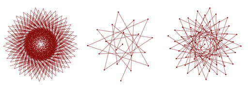  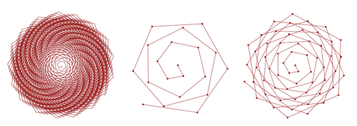  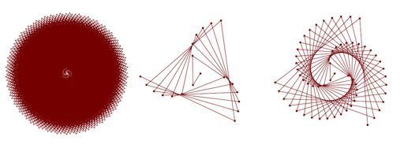]  
.center[.imgref[[[codeproject]](https://www.codeproject.com/Articles/1221341/The-Vogel-Spiral-Phenomenon)]]


???
  
* https://editor.p5js.org/legie/sketches/n-oQYMRLD
* https://openprocessing.org/@u593285/2915207
* https://openprocessing.org/@Kazoops/2843009
* https://openprocessing.org/@Kazoops/2843009 (overview)


* Of course formulas such as the phyllotaxis one above have been used over and over,... and over again. We have seen these visuals. That doesn't mean that there aren't plenty of options left to work with these fascinating structures. What I am trying to say is that by just simply plotting the base examples, you will not get a creativity medal. You will have to really think about a visualization / application to make them interesting anew.


---
.header[Golden Angle]

## Phyllotaxis

.center[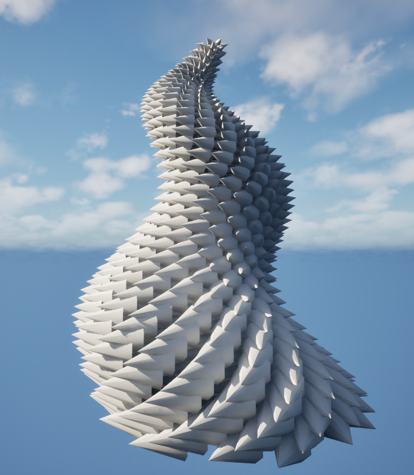 .imgref[[[daninverno]](daninverno)]]


---
.header[Golden Angle]

## Phyllotaxis

<iframe width="698" height="393" 
  src="https://www.youtube.com/embed/yGwhnt7mZ50?start=7&end=20&mute=1" 
  title="TD Essentials: Create a Swept Phyllotaxis Operator in Houdini" 
  frameborder="0" 
  allow="accelerometer; autoplay; clipboard-write; encrypted-media; gyroscope; picture-in-picture; web-share" 
  referrerpolicy="strict-origin-when-cross-origin" 
  allowfullscreen>
</iframe>

.imgref[[[Entagma]](https://www.youtube.com/watch?v=yGwhnt7mZ50)]

???
* [Phyllotaxis Spiral Pattern on a Sphere](https://demonstrations.wolfram.com/PhyllotaxisSpiralPatternOnASphere/)


---
template:inverse

# Curves


???
  

* Next to spirals as curve designs, there are several similarly simple functions that create aesthetically pleasing curves. At first sight, the Wikipedia and Wolfram pages of these functions can appear a bit intimidating. But I would like to show you that it is actually not that hard to get a grip on these functions.

Let's have a look into the rose curve.


---
.header[Curves]

## Spirals

.center[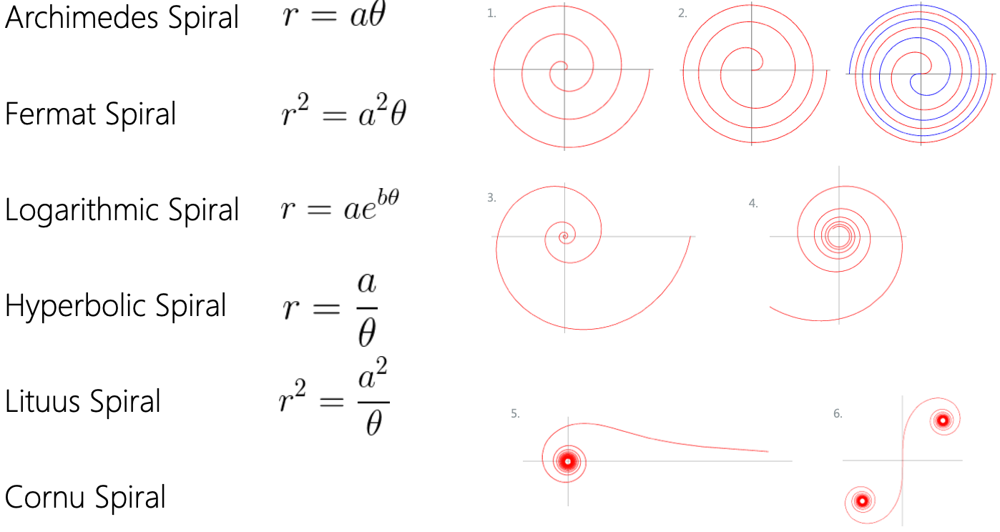]


???
https://editor.p5js.org/legie/sketches/bwAXaNS1j
* r is for any given angle and would run forever
* We decide with turns when to stop and do that in the unit of "turns" as that is intuitively understandable. It is not in the mathematics, it is you choosing a section of the curve to draw.
    * `turns` controls how many times the spiral winds around the center before it stops.
* [Logarithmic_spiral](https://en.wikipedia.org/wiki/Logarithmic_spiral)
* [Hyperbolic_spiral](https://en.wikipedia.org/wiki/Hyperbolic_spiral)
    * For an arbitrary choice of the scale factor a


---
.header[Curves]

## The Rose Curve

.left-even[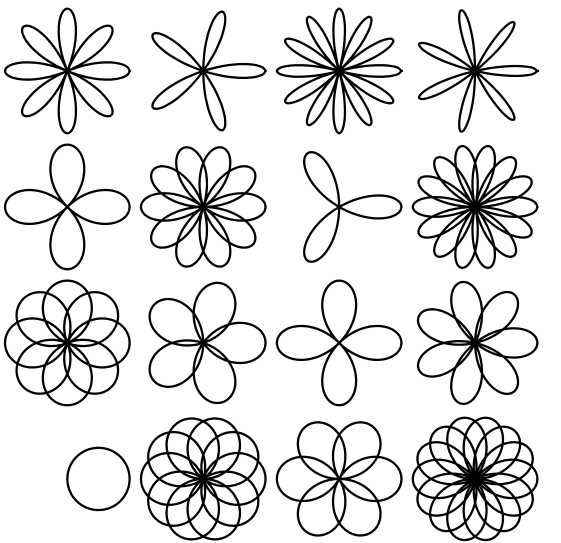 .imgref[[[wiki]](https://en.wikipedia.org/wiki/Rose_\(mathematics\)]]

--

.right-even[A multi-lobed curve with varying number of lobes.]


---
.header[Curves]

## The Rose Curve

.left-even[ .imgref[[[wiki]](https://en.wikipedia.org/wiki/Rose_\(mathematics\)]]


.right-even[

A multi-lobed curve with varying number of lobes.
]

???
  
* [wiki](https://en.wikipedia.org/wiki/Rose_(mathematics))
* [Wolfram](https://mathworld.wolfram.com/RoseCurve.html)

* This page is still somewhat simple and well-arranged. Sometimes these pages overflow with explanations, different representations, history and proofs, etc. Fear not! What you always want to look out for is the *coordinates* you can plot, be it polar or Cartesian coordinates (we know how to go from one to the other so it does not really matter what we get).

**What is the Polar Coordinate System? **
* In mathematics, the polar coordinate system is a two-dimensional coordinate system in which each point on a plane is determined by a distance from a reference point and an angle from a reference direction.

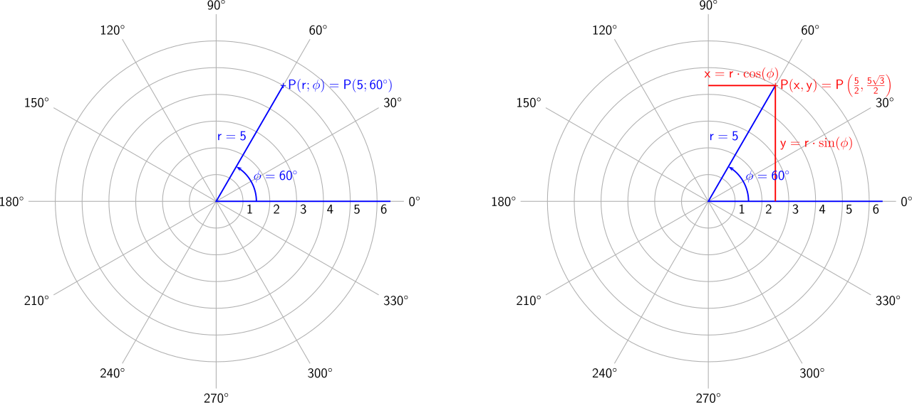  
[[wiki]](https://de.wikipedia.org/wiki/Datei:Ebene_polarkoordinaten.svg)

(here with $\phi$ as name for the angular coordinate, often called the polar angle)

Hence,  
  
$x = r \cos{\phi}$  
$y = r \sin{\phi}$

and

$r = \sqrt{{x^2 + y^2}}$  
$\phi = \tan^{-1}{\left (\frac{y}{x}\right )}$

Polar coordinates are most appropriate in any context where the phenomenon being considered is inherently tied to *direction* and *length* from a *center point*, such as with spirals. Please make sure that you know what polar coordinates are and how to use them. We are going to need them all the time.


---
.header[Curves]

## The Rose Curve

.left-even[ .imgref[[[wiki]](https://en.wikipedia.org/wiki/Rose_\(mathematics\)]]


.right-even[

A multi-lobed curve with varying number of lobes.


<br >

Rose curves are defined by 

$r = a \cos(k\theta)$

]


---
.header[Curves]

## The Rose Curve

.left-even[ .imgref[[[wiki]](https://en.wikipedia.org/wiki/Rose_\(mathematics\)]]


.right-even[

A multi-lobed curve with varying number of lobes.


<br >

Rose curves are defined by 

$r = a \cos(k\theta)$

<br />
* With the angular frequency of $k$ and an amplitude of $a$  
* $k = \frac{n}{d}$ to generate the different designs

]


---
.header[Curves]

## The Rose Curve

```js
function draw() {
    background(255);
    translate(width * 0.5, height * 0.5);

    let r = width * 0.4;
    let n = floor(map(mouseX, 0, width, 1, 10));
    let d = floor(map(mouseY, 0, height, 1, 10));  
    let k = n / d;

    beginShape();
    for (let theta = 0; theta < TWO_PI * d; theta+= 0.01) {

        let x = r * (cos(k*theta) * cos(theta));
        let y = r * (cos(k*theta) * sin(theta));
        vertex(x, y);
    }
    endShape(CLOSE);
}
```


???
  

* https://editor.p5js.org/legie/sketches/p7nFMtCEa
* Now, have fun exploring the design space. If you couldn't follow the above explanation, feel free to ask [Dan](https://www.youtube.com/watch?v=f5QBExMNB1I).

---
.header[Curves]

## The Maurer Rose

--

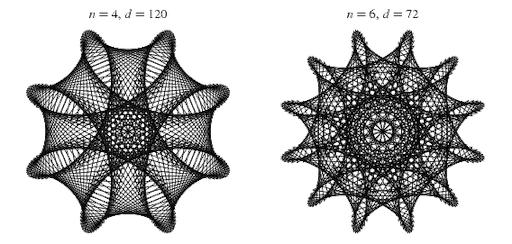

--
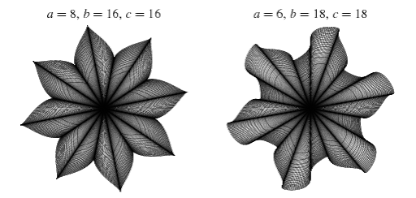
.imgref[[[wolfram]](https://mathworld.wolfram.com/MaurerRose.html)]  


???
  

* E.g. the [maurer rose](https://en.wikipedia.org/wiki/Maurer_rose) and the [starr rose](https://mathworld.wolfram.com/StarrRose.html) are versions of the basic rose algorithm (even though the starr rose will take some more figuring out...)

---
.header[Curves]

## The Heart Curve

--

.center[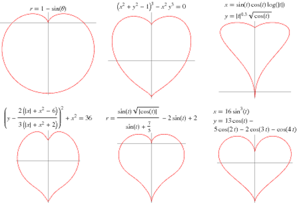  .imgref[[[wolfram]](https://mathworld.wolfram.com/HeartCurve.html)]]


???
  

* If you feel adventurous, for example implement the heart curve: [wiki](https://en.wikipedia.org/wiki/Heart_symbol#Parametrisation), [wolfram](https://mathworld.wolfram.com/HeartCurve.html), [shiffman](https://www.youtube.com/watch?v=oUBAi9xQ2X4)


---
.header[Curves]

## Golden Spiral

--

Growth factor $b$ is based on $\varphi$, the golden ratio:

.center[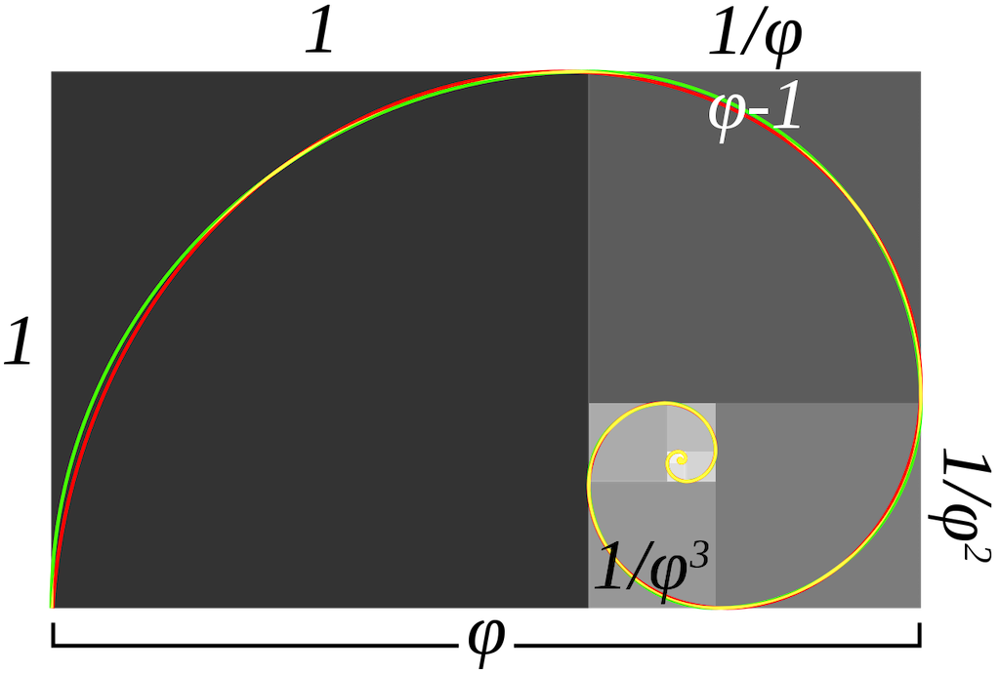  
.imgref[[[wiki]](https://commons.wikimedia.org/wiki/File:FakeRealLogSpiral.svg)]]

???

The special value for the growth factor $b$ is based on $\varphi$, the golden ratio. The golden spiral gets wider (or further from its origin) by a factor of $\varphi$ for every quarter turn it makes.


---
.header[Curves | Golden Spiral]

.center[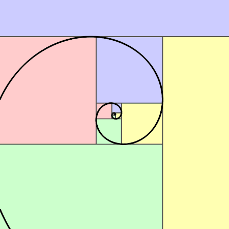  
.imgref[[[wiki]](https://commons.wikimedia.org/wiki/File:GoldenSpiralLogarithmic_color_in.gif)]]


???
  

* Golden spirals are self-similar. The shape is infinitely repeated when magnified.
* https://www.thecollector.com/what-is-the-golden-ratio-and-how-does-it-apply-to-art/
* https://www.shutterstock.com/blog/what-is-the-golden-ratio


---
.header[Curves]

## Golden Spiral


Approximates the segmentation of a rectangle as follows:

.center[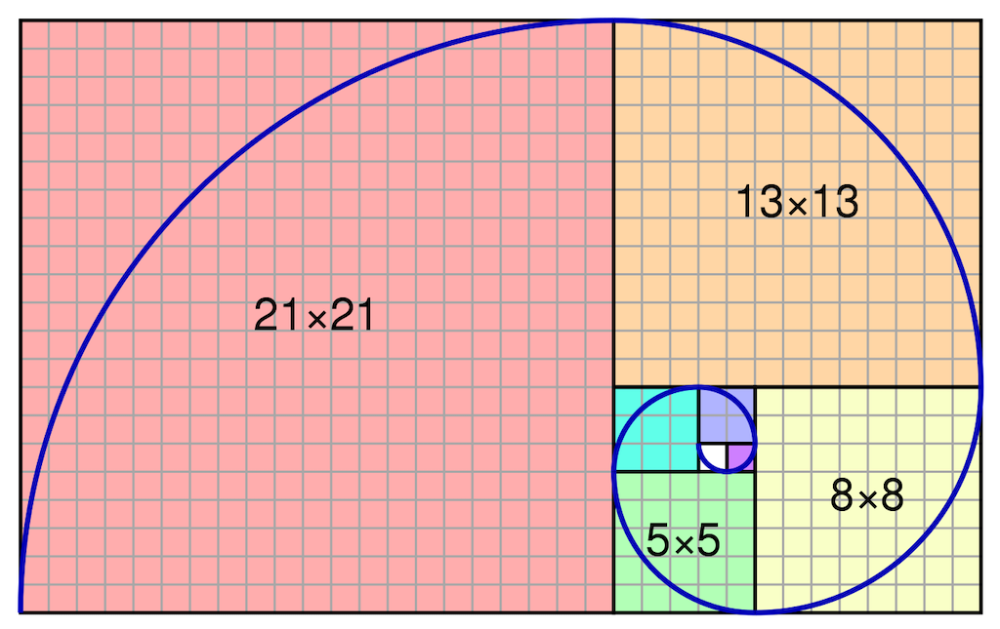  .imgref[[[wiki]](https://commons.wikimedia.org/wiki/File:34*21-FibonacciBlocks.png)]]


???
  

* But wait. What is a *spiral* and why is it *golden*? Don't we need $\varphi$ for anything to be golden?


---
.header[Curves]

## Golden Spiral

Approximates the segmentation of a rectangle as follows:

.center[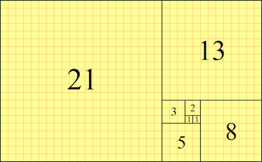  .imgref[[[wiki]](https://commons.wikimedia.org/wiki/File:34*21-FibonacciBlocks.png)]]


---
template:inverse

## $0, 1, 1, 2, 3, 5, 8, 13, 21, 34, 55, 89, ...$


???
  

* Do you recognize the following sequence of numbers? How is the sequence constructed?
* Fibonacci Sequence

---
## Fibonacci Sequence

Each number is the sum of the two preceding ones, starting from $0$ and $1$. That is, 


???
  

* In mathematics, the Fibonacci numbers, commonly denoted $F_n$, form a sequence, called the Fibonacci sequence, such that each number is the sum of the two preceding ones, starting from $0$ and $1$. That is, 

--

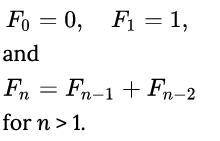

--

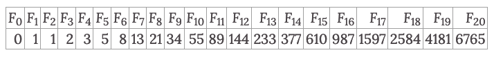


???
  

* Knowledge of the Fibonacci sequence was expressed by the Indian mathematician [Acharya Pingala](https://en.wikipedia.org/wiki/Pingala) in connection with a study of poetic metres and verse in Sanskrit as early c. 450 BC–200 BC. Outside India, the Fibonacci sequence first appears in the book [Liber Abaci](https://en.wikipedia.org/wiki/Liber_Abaci) (1202) by [Fibonacci](https://en.wikipedia.org/wiki/Fibonacci) using it to calculate the growth of rabbit populations. [7][8][9][10]


---
## Fibonacci Sequence & Phi

???
  

* There is a special relationship between the Golden Ratio and Fibonacci Numbers in that the ratio of two successive Fibonacci numbers is close to the golden ratio:

--

.center[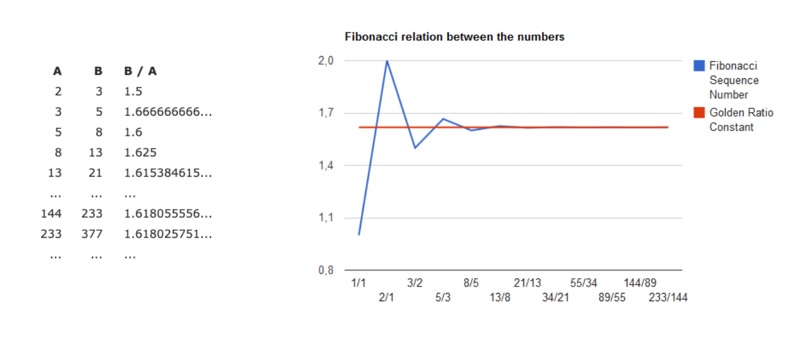  .imgref[[[hydrogen2oxygen]](https://hydrogen2oxygen.net/en/2012/06/21/the-fibonacci-sequence-is-the-mathematical-first-cousin-of-the-golden-ratio/)]]


---

## Fibonacci Sequence & Mandelbrot

--

The number of spiral arms at the bulbs manifests a Fibonacci sequence.

.center[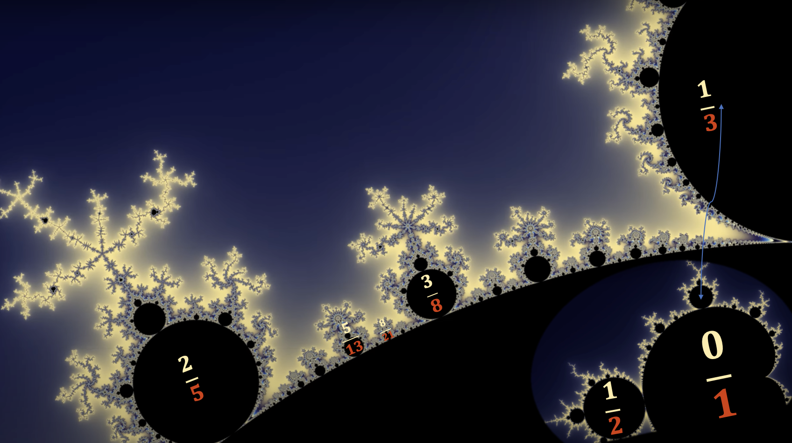  
.imgref[[[wiki]](https://en.wikipedia.org/wiki/Mandelbrot_set#/media/File:Fibonacci_sequence_within_the_Mandelbrot_set.png)]]

.footnote[[[Spektrum der Wissenschaft](https://www.spektrum.de/kolumne/in-der-mandelbrot-menge-steckt-die-fibonacci-folge/2094057)]]


???
* 
https://www.spektrum.de/kolumne/in-der-mandelbrot-menge-steckt-die-fibonacci-folge/2094057


---
template:inverse

# Famous Irrational Numbers


---
## Famous Irrational Numbers

--

* $\varphi = 1.61803398874989484820...$
    * The most irrational of them all  
--
* $\pi = 3.1415926535897932384626433832795...$

--
    * The rockstar of the irrational numbers
--
    * The popular approximation of $\frac{22}{7} = 3.1428571428571$ is close but not accurate
--
    * Over a quadrillion decimal places have been calculated and *still there is no pattern!!!*
--
* $e = 2.7182818284590452353602874713527$
    * Euler's Number
    * Base of the Natural Logarithms

???
  

* Many square roots, cube roots, etc. are also irrational numbers.
    * $\sqrt{3} = 1.7320508075688772935274463415059...$
    * $\sqrt{99} = 9.9498743710661995473447982100121...$
    * But e.g. $\sqrt{4} = 2$ (rational), and $\sqrt{9} = 3$ (rational), so not all roots are irrational.

---
.header[Famous Irrational Numbers]
## Pi

$\pi = 3.14159 26535 89793 23846 26433 83279 50288 41971 ...$

???
  

* $\pi$ is a real crowd-pleaser. Why is that?

--

> Omnipresent in formulas for areas and volumes of geometrical shapes based on circles.


???
  

$\pi$ appears in formulae for areas and volumes of geometrical shapes based on circles, such as ellipses, spheres, cones, and tori. Below are some of the more common formulae that involve $\pi$.

---
.header[Famous Irrational Numbers]
## Pi

.left-even[
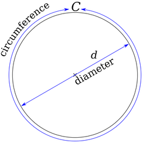  
.imgref[[[wiki]](https://en.wikipedia.org/wiki/Pi#/media/File:Pi_eq_C_over_d.svg)]]

.right-even[

$\frac{C}{d} = \pi$

]

---
.header[Famous Irrational Numbers]
## Pi

.left-even[
  
.imgref[[[wiki]](https://en.wikipedia.org/wiki/Pi#/media/File:Pi_eq_C_over_d.svg)]]

.right-even[

$\frac{C}{d} = \pi$

<br />
With radius r 

* Circumference: $2\pi r$
* Area of a circle: $\pi r^2$
* Sphere volume: $\frac{4}{3}\pi r^3$
* Sphere surface area $4\pi r^2$
]


???
  

* $\pi$ appears in many, many other formulas in all areas of mathematics and physics.  
* Its omnipresence and usefulness play a big role for $\pi$'s popularity. But its inherent characteristic are also truly captivating.

---
.header[Famous Irrational Numbers | Pi]


.center[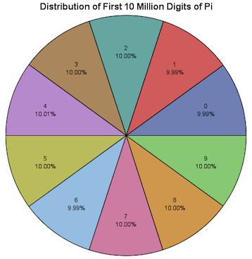  
.imgref[[[sas blogs]](https://blogs.sas.com/content/iml/2015/03/12/digits-of-pi.html#prettyPhoto)]]


???
  

* The digits of $\pi$ are uniformly randomly distributed, meaning that its digits 0 through 9 appear equally often, as do pairs of digits, trios of digits, and so forth. If you don't believe it you can count digits in its first [10 million decimal places](https://introcs.cs.princeton.edu/java/data/pi-10million.txt).
* The digits of $\pi$ pass every test for randomness, yet $\pi$ is a precise mathematical value that describes the relationship between the circumference of a circle and its diameter. This dichotomy between *very random* and *very structured* blows my mind. [[20]](https://blogs.sas.com/content/iml/2015/03/12/digits-of-pi.html#prettyPhoto)


---
.header[Famous Irrational Numbers | Pi]


.center[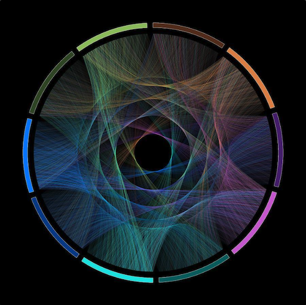  
.imgref[[[fineartamerica]](https://fineartamerica.com/featured/flow-of-life-flow-of-pi-cristian-ilies-vasile.html)]]


???
  

* https://mk.bcgsc.ca/pi/piday2024/#l1home
* In honor of $\pi$ day, which is on March 14th according to the North American date formatting of 03.14., several artists visually represent $\pi$ each year anew in a creative and beautiful manner.
* http://mkweb.bcgsc.ca/
* Here, the digits of $\pi$ are represented as a path traced by links between successive digits. Each digit is assigned a segment around the circle and a link between segment $i$ and $j$ corresponds to the appearance of $ij$ in $\pi$. For example, the $14$ in $3.14...$ is drawn as a link between segment $1$ and segment $4$. [[21]](http://mkweb.bcgsc.ca/pi/art/method.mhtml)

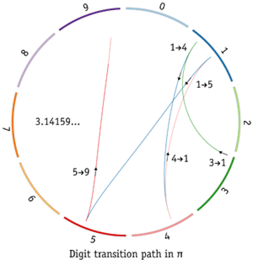  
[[mkweb]](http://mkweb.bcgsc.ca/pi/art/method.mhtml)

As more digits are added to the path, the image becomes a weaving mandala.


---

## Fibonacci Sequence & Pi

.center[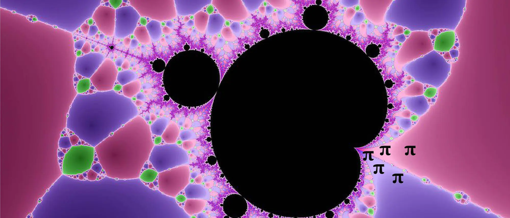  
.imgref[[[© Georg-Johann Lay / Mandelbrotmenge / public domain; Bearbeitung: Spektrum der Wissenschaft (Ausschnitt)]](https://www.spektrum.de/kolumne/pi-ist-ueberall-auch-in-der-mandelbrotmenge/1996588)]]


.footnote[[[Spektrum der Wissenschaft]](https://www.spektrum.de/kolumne/pi-ist-ueberall-auch-in-der-mandelbrotmenge/1996588)]


???

Near the point where the main bulb of the Mandelbrot set meets the second bulb (at approximately -0.75 on the real axis), if you pick a point just outside the boundary and count how many iterations it takes before it escapes, that count multiplied by your distance from -0.75 converges to pi.


distance = 0.001   ->   iterations ≈ 3141
distance = 0.0001  ->   iterations ≈ 31415
The closer you get, the more digits of pi appear in the iteration count.

Near that neck point the iteration behaves locally like a rotation around a circle. Pi enters for exactly the same reason it always does: there is circular geometry hiding underneath. The Mandelbrot set is built from complex number arithmetic, and complex numbers encode rotation naturally, so pi is never far away.

It is worth noting this is a verified mathematical observation, but a full formal proof of exactly why pi appears there involves complex dynamics beyond our scope.

https://www.spektrum.de/kolumne/pi-ist-ueberall-auch-in-der-mandelbrotmenge/1996588


Multiplication on a Circle With Modulo 

.center[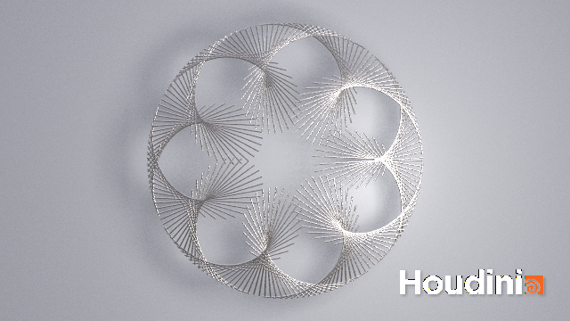]

  

* Start on a circle
* Distribute evenly a number of points on the circle
* Label them 1.. (numbers continue) -> Number of points on the circle is one parameter
* Iterate over the numbers, multiply by 2 -> Number to multiply is the other parameter)
    * 0*2 = 0
    * 1*2 = 2
    * 2*2 = 4
    * 2*3 = 6
    * For results > the number of points, we take the modulo with the number of points
        * E.g. 10 points on the circle
        * Multiplier 2 for point 7 = 14
        * 14 modulo 10 = 4
* Connect start number with its result
* Easier
    
https://editor.p5js.org/legie/sketches/zv3Vf3JZI

https://www.redblobgames.com/x/1847-mathologer-modulo-circle/#N=500&M=2&color=angle  
https://demonstrations.wolfram.com/ModularMultiplicationOnACircle/
https://github.com/sebasvega95/mod-mult-circle-p5/blob/master/sketch.js
https://en.wikipedia.org/wiki/Cardioid#Cardioid_as_envelope_of_a_pencil_of_lines

---
template:inverse

## Next

---
.header[Next]

##  Function Design

Next we are going to have a look into how to design and put together functions ourselves.

.center[  
.imgref[[[webcomicms]](https://webcomicms.net/clipart-9428627-math-related-pictures)]]


---
template:inverse

### The End

# 👋🏻
