name: inverse
layout: true
class: center, middle, inverse
---


# Procedural Generation and Simulation

#### - Function Design -

<br />

### Prof. Dr. Lena Gieseke | l.gieseke@filmuniversitaet.de  

#### Film University Babelsberg KONRAD WOLF

???

Modulo on a Circle: https://editor.p5js.org/legie/sketches/zv3Vf3JZI

* Start on a circle
* Distribute evenly a number of points on the circle
* Label them 1.. (numbers continue) -> Number of points on the circle is one parameter
* Iterate over the numbers, multiply by 2 -> Number to multiply is the other parameter
    * 0*2 = 0
    * 1*2 = 2
    * 2*2 = 4
    * 2*3 = 6
    * For results > the number of points, we take the modulo with the number of points
        * E.g. 10 points on the circle
        * Multiplier 2 for point 7 = 14
        * 14 modulo 10 = 4
* Connect start number with its result
    
https://demonstrations.wolfram.com/ModularMultiplicationOnACircle/


---
layout: false

.center[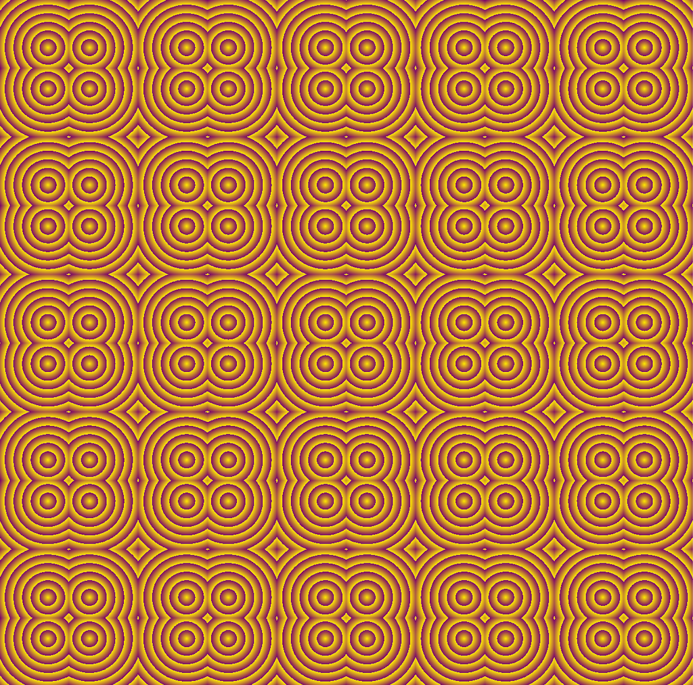]


???
  
* Functions (in GLSL)
* Material nodes (in Unreal)
* Functions (in Unreal)
* High-level shader language

* Function Components
    * Transitions
    * Primitive Components
    * Periodicity
* Examples

---

.center[]

???
  
* Functions (in GLSL)
* Material nodes (in Unreal)
* Functions (in Unreal)
* High-level shader language
 

Unreal's Custom node uses HLSL, not GLSL (those are two different shader languages with different syntax, though both compile to GPU instructions).
  
`f(coordinate) → color`
  
For each pixel/fragment, the shader receives some input (UV, world position, etc.) and returns a value. This is exactly the same abstraction whether you are writing a GLSL fragment shader in something like Shadertoy or writing HLSL in Unreal's Custom node.


---

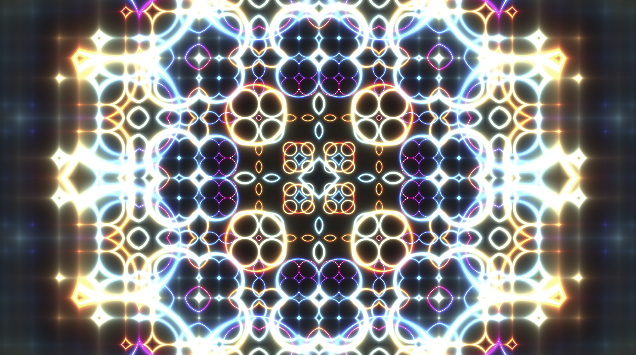  

---
## Function Design

* Example Ridges
* Function Components
    * Transitions
    * Primitive Components
    * Periodicity
* (Example Kishimisu)


---
## Function Design

.center[  
.imgref[[[geogebra]](https://www.geogebra.org/m/Wkjz2X92)]]
  


???
  

* *What does the following look like when plotted in a 2D Cartesian coordinate system?*
* You are right, [it is Batman!](https://www.youtube.com/watch?v=oaIsCJw0QG8&feature=youtu.be)

---
## Function Design

.center[  

.imgref[[[geogebra]](https://www.geogebra.org/m/Wkjz2X92)]]

---
## Function Design

.center[  

.imgref[[[geogebra]](https://www.geogebra.org/m/Wkjz2X92)]]


By slicing together different functions, you can achieve many different curve designs.

---
## Function Design

.center[]  
.imgref[[[math.stackexchange]](https://math.stackexchange.com/questions/54506/is-this-batman-equation-for-real)]  


???
  

* For now, we are having a look into somewhat simpler equations.  

---
## Function Design

.center[  
.imgref[[[Making a heart with mathematics]](https://www.youtube.com/watch?v=aNR4n0i2ZlM)]]  
  


???
  

* For function designs the ultimate rock star / god / person of incredible awesomeness is [Inigo Quilez](http://www.iquilezles.org). His [articles page](http://www.iquilezles.org/www/index.htm) is a resource of unmeasurable value. If interested, check out his explanations on [Making a heart with mathematics](https://www.youtube.com/watch?v=aNR4n0i2ZlM) (which is a somewhat advanced example though).


---
## Function Design

> We want to modify, shape and to combine different functions. 

--

With this approach we can almost draw anything. 

--

.center[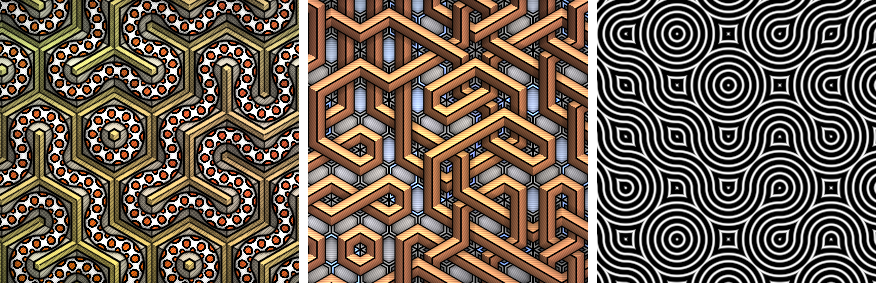] .imgref[[[Shane - shadertoy]](https://en.wikipedia.org/wiki/File:Tiling_procedural_textures.jpg)]  


???
  

* Such individually shaped functions can be used for a variety of applications, such as textures, shading, animation, geometry, dance, etc. 
* We will focus in this script on the generation of 2D graphics but please keep in mind that most functions are equally useful in different contexts and even dimensions.
* https://www.shadertoy.com/view/llSyDh
* https://www.shadertoy.com/view/WdcBDB
* https://www.shadertoy.com/view/ls33DN

---
## 2D Design

Let’s assume we want to color a canvas, meaning giving each pixel a color value, e.g. when computing a texture.

<br />

  

---
## 2D Design

.center[]  

Then we interpret the value of *f(x,y) = z*, hence *z*, as color value.


???
  

* To color this area, we can use a 2D function, meaning a function depending on two input parameters such as *x, y* in 3D space. Please note that in the following examples *z* is the up-axis of the coordinate system.

---
## 2D Design

With *z* interpreted as color value between 0..1 on a 2D canvas:

.  

---
## 2D Design


???
  

* You can imagine this as if looking in -z direction onto the plotted gray value, or as if projecting the plot onto the xy-plane.

---
## 2D Design

You often map the function value 0..1 to a color range such as

.center[]  

---
## 2D Design

Also, the combination of simple functions can already lead to pleasing patterns

.center[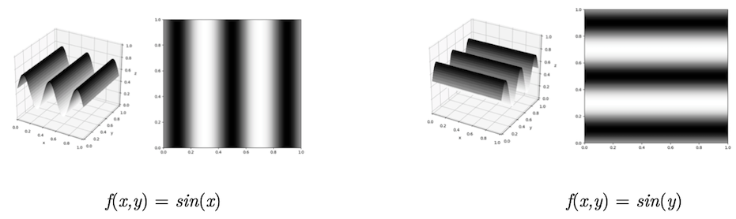]  


???
  

* In the above plots frequency, amplitude and offset have been adjusted but left out in the equation for simplicity.
* PI for sin is one huegel
* code/glsl/lecture03/sin.frag

---
## 2D Design

Also, the combination of simple  functions can already lead to pleasing patterns

.center[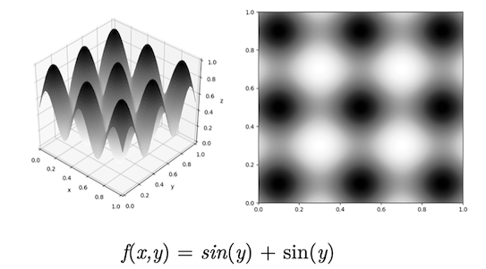]  

???

.center[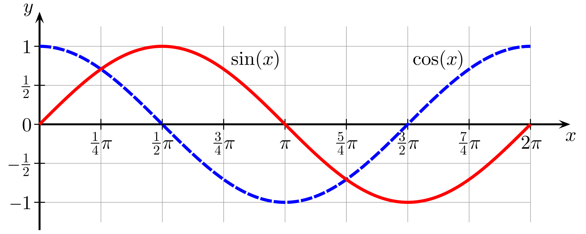]  

---
## 2D Design

.left-quarter[
*f(x) = c*
]

.right-quarter[ .imgref[[[tobyschachman]](http://tobyschachman.com/Shadershop/)]]


???
  

* You will often find examples and explanations in lower dimensions, meaning in 1D, as the graphs for these functions are easier to visualize: with *c* as the gray or color value. 
* How to interpret in these scenarios the needed second dimension depends on the context. Often it is simply left out as an influencing parameter such as in our start example

  


---
template:inverse

# Example


???
  

* In this example, I am walking you through the steps to re-create this subtle pattern. It is a fairly easy design but includes several of the most common approaches when putting functions together.

---
.header[Example]

## Environment
  
--
  
Class: GLSL + Fragment Shader


???

OpenGL Shading Language

--

* Efficient code, e.g. no explicit loop over pixels

--
* Simplest environment for what we are aspiring to learn


--

<br />

Also possible: HLSL within Unreal, example to follow!

---
.header[Example | Environment]

## GLSL + Fragment Shader

Visual Studio Code: [glsl-canvas Extension](https://marketplace.visualstudio.com/items?itemName=circledev.glsl-canvas)

---
.header[Example | Environment |  GLSL + Fragment Shader]

```glsl
uniform vec2 u_resolution;

void main() {

    // Normalization of the incoming
    // screen coordinate
    vec2 coord = (2.0 * gl_FragCoord.xy - u_resolution.xy) / u_resolution.y;


    // r, g, b channels from 0..1
    vec3 color = vec3(0.5, 0.0, 0.0);

    // Set the final "pixel" color
    gl_FragColor = vec4(color, 1.0);
}
```


???
* function_design_startscene.glsl

```
// Better
// vec2 coord = (2.0 * gl_FragCoord.xy - u_resolution.xy) / u_resolution.y;
```

---

.center[]  


???
  

*What do you see? What could be the steps to recreate this pattern?*

---
.header[Example]

## One Cell

When working on repetitive patterns, one usually starts with one cell and repeats that cell in a second step.  

.center[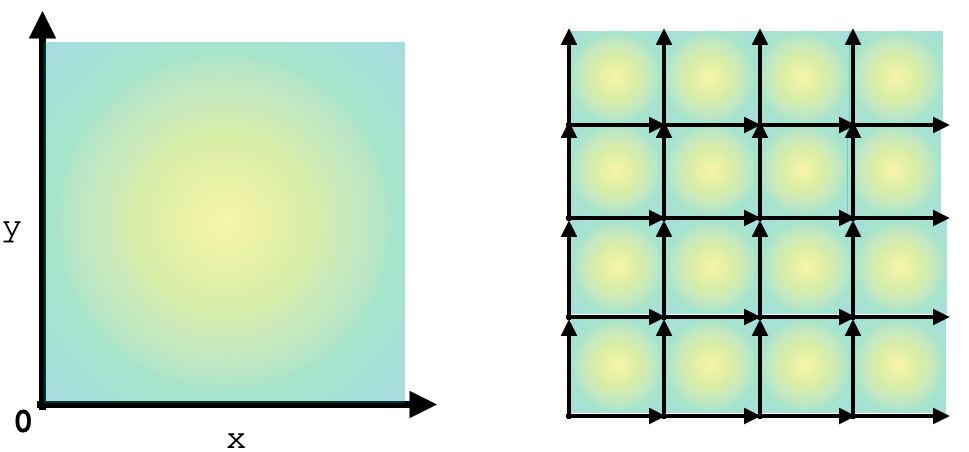]  

---
.header[Example]

## One Cell

Let's start with creating a circle...

.left-even[]  


???
  

* How could we create this?

--

...by plotting the distance of each coordinate to the center point `0.0`, `0.0`.


???
  

* The [`distance()`](https://www.khronos.org/registry/OpenGL-Refpages/gl4/html/distance.xhtml) function calculates the distance between two points.
* The [`mix()`](https://www.khronos.org/registry/OpenGL-Refpages/gl4/html/mix.xhtml) function linearly interpolates between two values.

---
.header[Example]

## One Cell


```glsl
    vec2 coord = (2.0 * gl_FragCoord.xy - u_resolution.xy) / u_resolution.y;

    // 1. One Cell, distance to center point
    float d = distance(coord, vec2(0.));

    vec3 color = mix(vec3(0.5, 0.0, 0.0), vec3(0.35, 0.2, 0.5), d);
    gl_FragColor = vec4(color, 1.0);
```

???

mix(a, b, t) linearly interpolates between two values a and b based on a factor t, where t = 0 returns a and t = 1 returns b

---
.header[Example]

## Ridges

Next, let's create ridges with the [`floor`](https://www.khronos.org/registry/OpenGL-Refpages/gl4/html/floor.xhtml) function.

--

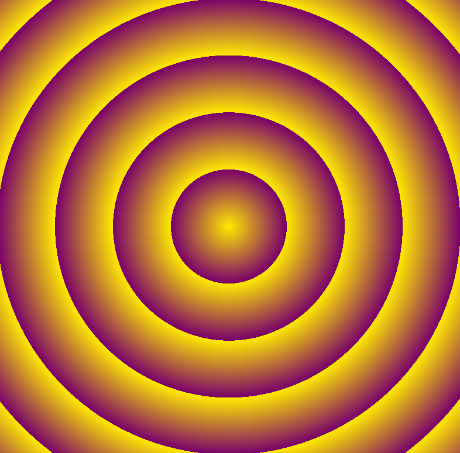

---
.header[Example]

## Ridges


```glsl
    vec2 coord = (2.0 * gl_FragCoord.xy - u_resolution.xy) / u_resolution.y;

    float d = distance(coord, vec2(0.));

    // 2. Ridges
    d *= 8.0;
    d -= floor(d);

    vec3 color = mix(vec3(0.5, 0.0, 0.0), vec3(0.35, 0.2, 0.5), d);
    gl_FragColor = vec4(color, 1.0);
```

---
.header[Example] 

## Repetitive Cells

Next, let's create the cells...
  
.left-even[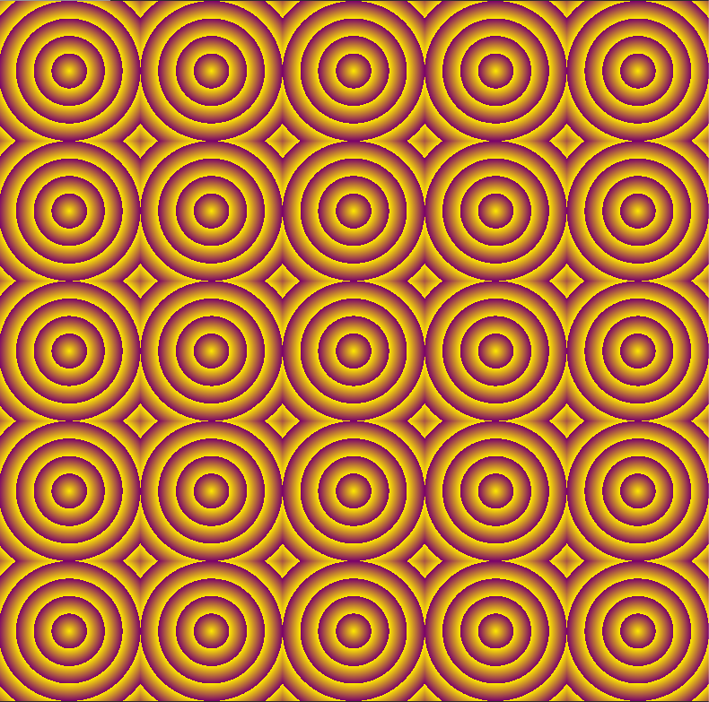]  

--
.right-even[...by dividing the 0..1 original x,y coordinate by the cell size.]


---
.header[Example] 

### Repetitive Cells

```glsl
    float CELLSIZE = 0.2; //relative, hence 0..1

    vec2 coord = (2.0 * gl_FragCoord.xy - u_resolution.xy) / u_resolution.y;

    // 3. Create Cells
    // Get into one cell
    float x = coord.x / CELLSIZE;
    float y = coord.y / CELLSIZE;
    x -= floor(x);
    y -= floor(y);
    
    float d = distance(vec2(x, y), vec2(0.5));
    d *= 8.0;
    d -= floor(d);

    vec3 color = mix(vec3(0.5, 0.0, 0.0), vec3(0.35, 0.2, 0.5), d);
    gl_FragColor = vec4(color, 1.0);
```

---
.header[Example] 

## Repetitive Cells

.center[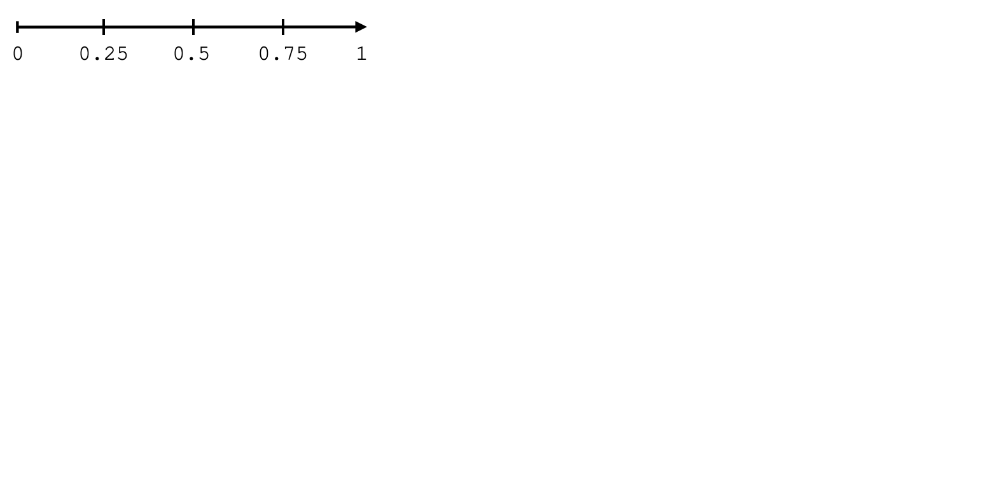] 

---
.header[Example] 

## Repetitive Cells

.center[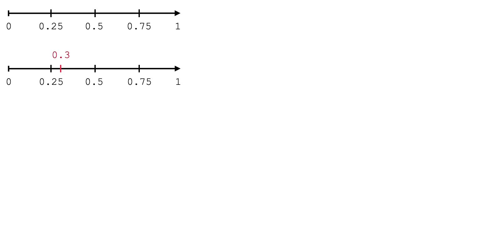] 

---
.header[Example] 

## Repetitive Cells

.center[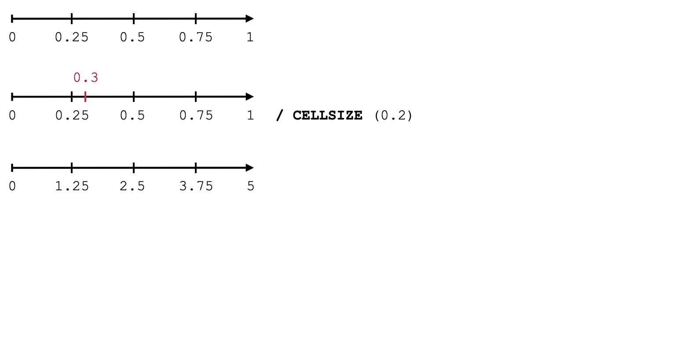] 

---
.header[Example] 

## Repetitive Cells

.center[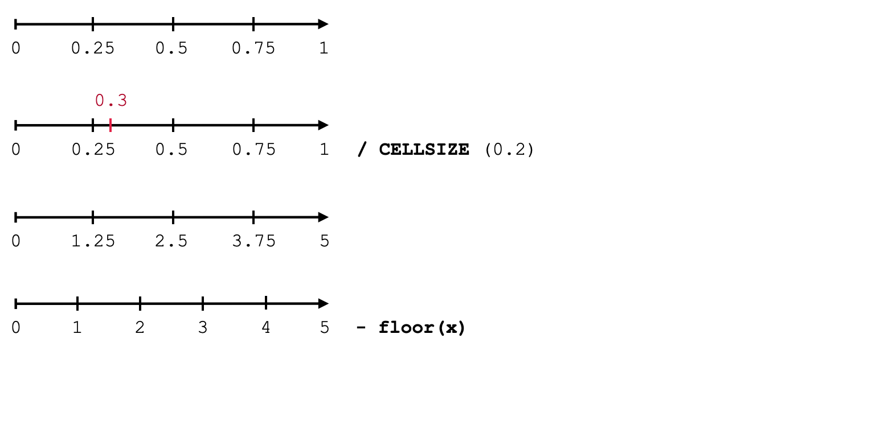] 

---
.header[Example] 

## Repetitive Cells

.center[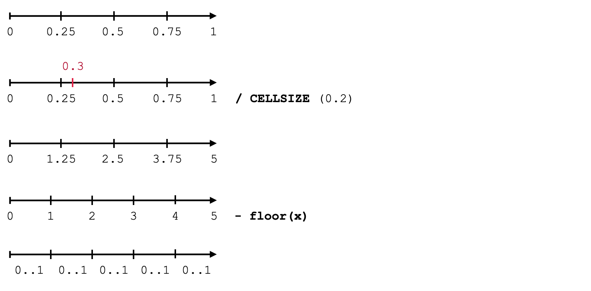] 

---
.header[Example] 

## Repetitive Cells

.center[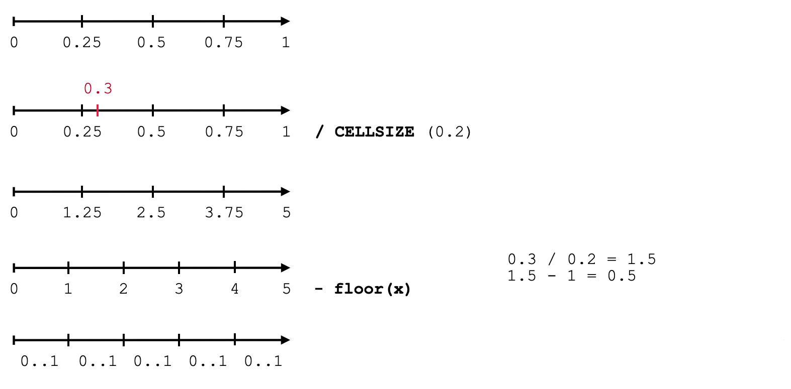] 

---
.header[Example] 

## Repetitive Cells

.center[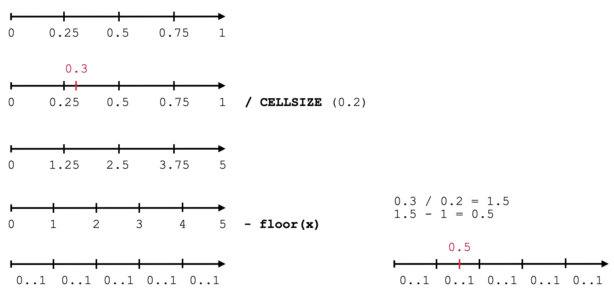] 


---
.header[Example] 

## Repetition Within The Cell

.left-even[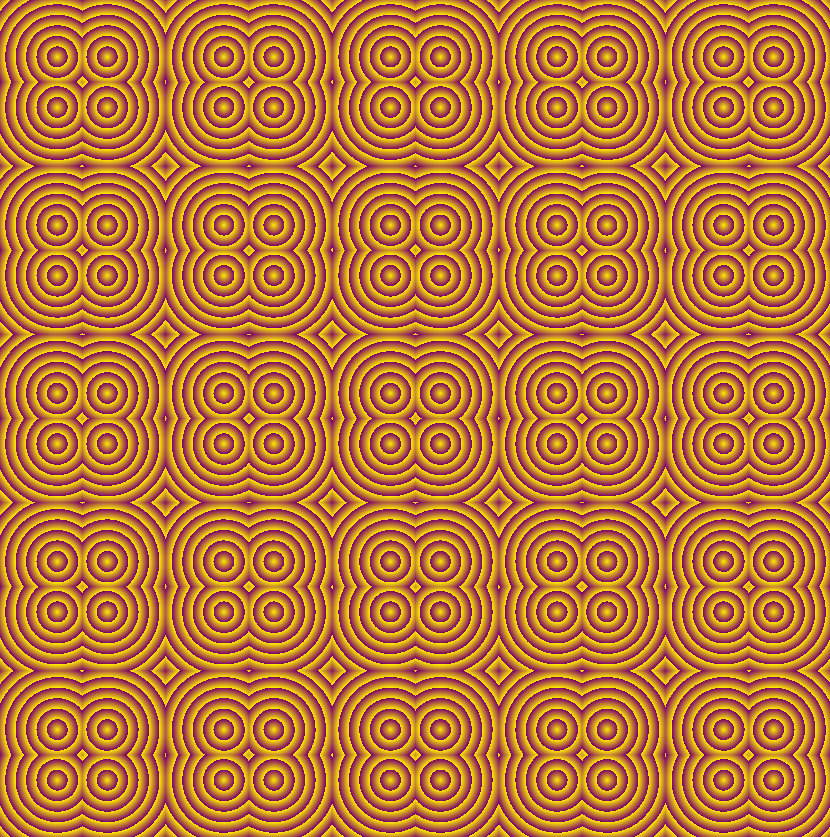]  

--
.right-even[
1. Move Circle Center
2. Move value range from 0..1 to -1..1 and take the absolute 
]
---
.header[Example] 

### 1. Move Center

Now, we simply move the center point (the one that we are computing the distance to for the circles).

--

.center[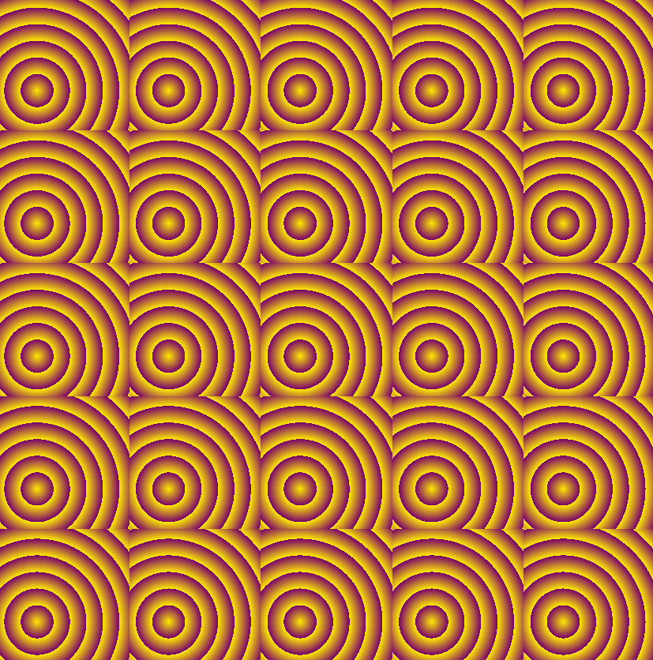]  

---
.header[Example] 

### 1. Move Center


```glsl
float CELLSIZE = 0.2; //relative, hence 0..1
vec2 OFFSET = vec2(0.3);

    vec2 coord = (2.0 * gl_FragCoord.xy - u_resolution.xy) / u_resolution.y;

    float x = coord.x / CELLSIZE;
    float y = coord.y / CELLSIZE;
    x -= floor(x);
    y -= floor(y);

    // 4. Move center point by OFFSET to compute distance to
    float d = distance(vec2(x, y), OFFSET);
    d *= 8.0;
    d -= floor(d);

    vec3 color = mix(vec3(0.5, 0.0, 0.0), vec3(0.35, 0.2, 0.5), d);
    gl_FragColor = vec4(color, 1.0);
```

---
.header[Example] 

### 2. Repetition Within Cell


Lastly, we want to repeat the pattern within the cell as well and also flip it. For this we remap the original value range from 0..1 to -1..1 and take the absolute of those values.

--

.center[]  


---
.header[Example] 

### Repetition Within Cell

```glsl
    ...
    // 5a. Remapping the range
    float x = coord.x / CELLSIZE;
    float y = coord.y / CELLSIZE;
    x -= floor(x);
    y -= floor(y);

    // Modify value range from 0..1 to -1..1
    float x_remap = (x - 0.5) * 2.0;
    float y_remap = (y - 0.5) * 2.0;
    
    float d = distance(vec2((x_remap), (y_remap)), OFFSET);
    d *= 8.0;
    d -= floor(d);

    vec3 color = mix(vec3(0.5, 0.0, 0.0), vec3(0.35, 0.2, 0.5), d);
    gl_FragColor = vec4(color, 1.0);
```

---
.header[Example] 

## Repetition Within Cell

... and taking the absolute of the new value range


---
.header[Example] 

### Repetition Within Cell

```glsl
    ... 
    // 5a. Remapping the range
    float x = coord.x / CELLSIZE;
    float y = coord.y / CELLSIZE;
    x -= floor(x);
    y -= floor(y);

    // Modify value range from 0..1 to -1..1
    float x_remap = abs((x - 0.5) * 2.0);
    float y_remap = abs((y - 0.5) * 2.0);
    
    float d = distance(vec2((x_remap), (y_remap)), OFFSET);
    d *= 8.0;
    d -= floor(d);

    vec3 color = mix(vec3(0.5, 0.0, 0.0), vec3(0.35, 0.2, 0.5), d);
    gl_FragColor = vec4(color, 1.0);
```


---
## Example

.center[]  


???
  

* I hope you didn't go blind by this example... sorry.

---
```glsl
    vec2 coord = (2.0 * gl_FragCoord.xy - u_resolution.xy) / u_resolution.y;

    // Create Cells
    // Get into one cell
    float x = coord.x / CELLSIZE;
    float y = coord.y / CELLSIZE;
    x -= floor(x);
    y -= floor(y);

    // Modify value range from 0..1 to -1..1
    // and then taking the absolute
    float x_remap = abs((x - 0.5) * 2.0);
    float y_remap = abs((y - 0.5) * 2.0);
    
    // Ridges
    float d = distance(vec2((x_remap), (y_remap)), OFFSET);
    d *= 8.0;
    d -= floor(d);

    vec3 color = mix(vec3(0.5, 0.0, 0.0), vec3(0.35, 0.2, 0.5), d);
    gl_FragColor = vec4(color, 1.0);
```


---
.header[Example | Using Vectors] 

```glsl
vec2 coord = (2.0 * gl_FragCoord.xy - u_resolution.xy) / u_resolution.y;

// Create Cells
// Get into one cell
coord /= CELLSIZE;
coord -= floor(coord);

// Modify value range from 0..1 to -1..1
// and then taking the absolute
vec2 coord_remap = abs((coord - 0.5) * 2.0);

// Ridges
float d = distance(coord_remap, OFFSET);
d *= 8.0;
d -= floor(d);

vec3 color = mix(vec3(1.0, 0.9176, 0.0), vec3(0.4745, 0.0, 0.4196), d);
gl_FragColor = vec4(color, 1.0);
```

---

## Unreal Version

.center[]

???
  
* Functions (in GLSL)
* Material nodes (in Unreal)
* Functions (in Unreal)
* High-level shader language

---

## Unreal Version

```glsl
float2 coord = UV;

float2 xy = coord / CELLSIZE;
xy -= floor(xy);

float2 xy_remap = abs((xy - 0.5) * 2.0);

float d = distance(xy_remap, OFFSET);
d *= 8.0;
d -= floor(d);

float3 color = lerp(float3(1.0, 0.9176, 0.0), float3(0.4745, 0.0, 0.4196), d);

return(color);
```


---

## From GLSL to HLSL

* `vec2/3/4` becomes `float2/3/4`
* `mix()` becomes `lerp()`
* `uniform` variables move come from input pins (usually)
* No `void main(){}`
* Built-in input variables like `gl_FragCoord` and `gl_FragColor` are replaced by parameters and return values

---
template:inverse

# The Building Blocks


---
template:inverse

#### The Building Blocks

# Transitions

---


## Transitions

*How to go from one color to another?*

???
  

* The above examples have already shown one overall principle, namely *how to get from one value to another value* or in our context *how to get from one color (e.g. white) to another color (e.g. black)*?

--

  

---
## Transitions

In more general terms we can understand this as defining a transition function *t*:

  


???
  

.  

---
## Transitions


.center[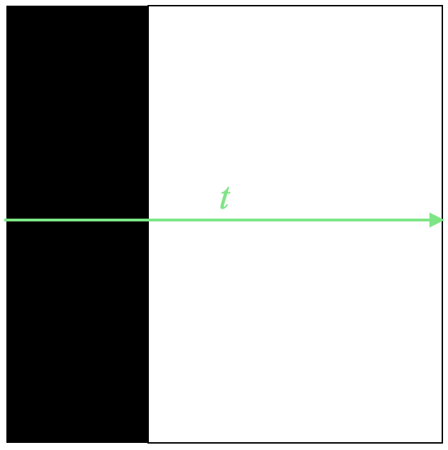]


---
.header[Transitions]

## Step Function

.center[]  

???
  

* The simplest of transitions is the step function, which switches between values based on a threshold, meaning with a fixed value that *t* is smaller or larger to.

---
.header[Transitions]

## Step Function

.center[]  

---
.header[Transitions]

## Step Function


```glsl
    vec2 pt = gl_FragCoord.xy/u_resolution;


    // Increase frequency to fit more sin waves 
    // between 0..1
    float verti = sin(8.0 * PI * pt.x);
    float hori = sin(8.0 * PI * pt.y);

    float step_value = step(0.3, pt.x);
    vec3 color = vec3(step_value * hori);

    // Assign frag color with alpha
    gl_FragColor = vec4(color,1.0);

```


???
  

* code/glsl/lecture03/step.frag

---
## Transitions


More often we want a smoother transition, e.g.

.center[]


???
  

* This is called an *interpolation*.


---
.header[Transitions]

## Linear Interpolation

.center[]  

---
.header[Transitions]

## Linear Interpolation

.center[]  

---
.header[Transitions]

## Linear Interpolation

```glsl
vec2 pt = gl_FragCoord.xy/u_resolution;

// Our "pattern":
float verti = sin(8.0 * PI * pt.x);
float hori = sin(8.0 * PI * pt.y);

// Interpolating between the pattern and 1.
// depending on the x coordinate, meaning
// with t = pt.x

vec3 color = vec3(pt.x * hori + ((1.0 - pt.x) * verti));

// Assign frag color with alpha
gl_FragColor = vec4(color,1.0);
```


???
  

* code/glsl/lecture03/interploation.frag
* https://registry.khronos.org/OpenGL-Refpages/gl4/html/mix.xhtml


---
.header[Transitions]

## Bilinear Interpolation

  
.imgref[[[scratchapixel]](https://www.scratchapixel.com/lessons/procedural-generation-virtual-worlds)]
  
---
.header[Transitions]

## Bilinear Interpolation

.left-even[
  
.imgref[[[scratchapixel]](https://www.scratchapixel.com/lessons/procedural-generation-virtual-worlds)]]
  
  
A linear interpolation of two linear interpolations, hence
* two linear interpolations to get `a` and `b` in one direction (here `tx`)
* one linear interpolation of `a` to `b` in the second direction (here `ty)`

--

```
a = c00 * (1 - tx) + c10 * tx; 
b = c01 * (1 - tx) + c11 * tx; 

c = a * (1) - ty) + b * ty; 
```


---
.header[Transitions]

## Interpolation

* Linear and bilinear interpolation is usually called `lerp()`, e.g.
    * [`lerp`](https://p5js.org/reference/#/p5.Vector/lerp) in p5
    * [`lerp`](http://www.sidefx.com/docs/houdini/vex/functions/lerp.html) in vex
    * [`mix`](https://www.khronos.org/registry/OpenGL-Refpages/gl4/html/mix.xhtml) in glsl
    * [Lerp node](https://www.youtube.com/watch?v=SiPhlGjqdyo) in Unreal's Shader Graph


---
.header[Transitions]

## Bilinear Interpolation

.left-quarter[
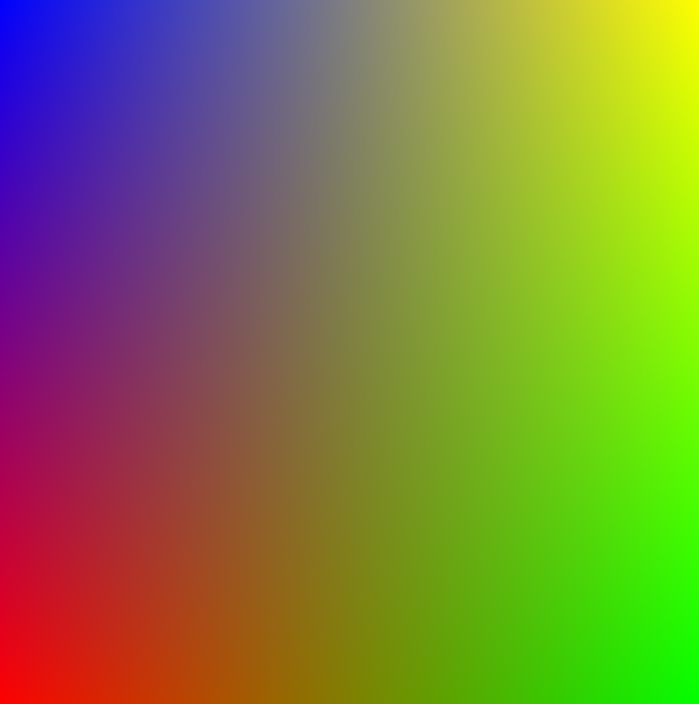]

.right-quarter[

```glsl
vec2 pt = gl_FragCoord.xy/u_resolution;

vec3 color1 = vec3(1., 0. , 0.);
vec3 color2 = vec3(0., 1. , 0.);
vec3 color3 = vec3(0., 0. , 1.);
vec3 color4 = vec3(1., 1. , 0.);

vec3 interpol1 = mix(color1, color2, pt.x);
vec3 interpol2 = mix(color3, color4, pt.x);

vec3 interpol3 = mix(interpol1, interpol2, pt.y);
vec3 color = interpol3;

gl_FragColor = vec4(color,1.0);
```
]

???
  

* bliniear_interpolation.frag

---
.header[Transitions]

## Trilinear Interpolation

 

--


???
  

* By the way, *what is a voxel*?

A voxel is like a pixel but in 3D and represents a value on a regular 3D grid. We need voxels for volumes, for example.

--


.imgref[[[scratchapixel]](https://www.scratchapixel.com/lessons/procedural-generation-virtual-worlds)
[[wiki]](https://en.wikipedia.org/wiki/Voxel)]

A trilinear interpolation is the linear interpolation of two bilinear interpolations.


???
  

```
e = bilinear(tx, ty, c000, c100, c010, c110); 
f = bilinear(tx, ty, c001, c101, c011, c111); 

g = e * ( 1 - tz) + f * tz; 
```


---
.header[Transitions]

## Interpolation Functions


???
  

* To move between values, we have many options. Simply taking different exponents for *t* in a linear interpolations changes the transition between the values notably.
* code/glsl/lecture03/*_exponent.frag

--

.center[]  

---
.header[Transitions]

## Interpolation Functions

.center[] .imgref[[[paulbourke]](http://paulbourke.net/miscellaneous/interpolation/)]


???
  

* For example, in 3D software such as Houdini, there are several interpolation functions to choose from. Here, some comparisons:


---
.header[Transitions]

## Interpolation Functions

.center[] .imgref[[[demofox]](https://blog.demofox.org/2015/08/15/resizing-images-with-bicubic-interpolation/)]  


???
  

* These different functions lead to different visual designs, depending on the context, e.g. for interpolating between colors for an image or positions for an animation. From left to right, Nearest Neighbor, Bilinear, Lagrange Bicubic interpolation (only interpolates values, not slopes), Hermite Bicubic interpolation

---
.header[Transitions]

## Interpolation Functions

.center[ 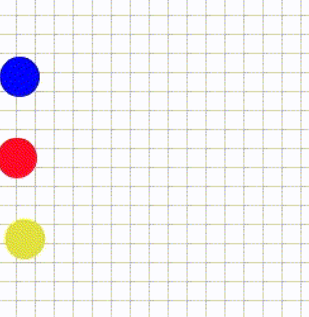] .imgref[[[gfxile]](http://sol.gfxile.net/interpolation/)]  

---
.header[Transitions]

## Interpolation Functions

.center[ ] .imgref[[[gfxile]](http://sol.gfxile.net/interpolation/)]  


---
.header[Transitions | Interpolation Functions]

## Smooth Step

Smoothstep is one of the most commonly used interpolation and clamping function in graphics and is often given as a built-in function from a framework. 

--

*On a side note:* What is a *clamping* function? 

--


???
  

* In computer graphics, clamping is the process of limiting a value to a range. Unlike wrapping, clamping merely moves the point to the nearest available value. [[2]](https://en.wikipedia.org/wiki/Clamping_(graphics))
* *S* is a [sigmoid function](https://en.wikipedia.org/wiki/Sigmoid_function), which is bounded and often used in the context of mapping a potentially indefinite range of values to a range.

---
.header[Transitions | Interpolation Functions]

## Smooth Step

Often smoothstep implements a cubic Hermite interpolation after clamping:


--

.center[]  


???
  

* Smoother Steps is an improved version of the smoothstep function, created by Ken Perlin.


---
.header[Transitions | Interpolation Functions]

## Smooth Step

```glsl
float smoothstep(float edge0, float edge1, float x) {

    x = clamp((x, 0.0, 1.0); 
    return x * x * (3 - 2 * x);
}

float clamp(float x, float lowerlimit, float upperlimit) {

    if (x < lowerlimit)
        x = lowerlimit;
    if (x > upperlimit)
        x = upperlimit;
    return x;
}
```


???
  

* https://docs.gl/sl4/smoothstep

---
.header[Transitions | Interpolation Functions]

## Smooth Step

.center[]  
.imgref[[[gfxile]](http://sol.gfxile.net/interpolation/)]  

---
.header[Transitions | Interpolation Functions]

## Smooth Step

.center[]  
[[4]](https://cis700-procedural-graphics.github.io/)


---
.header[Transitions | Interpolation Functions]

## Bias and Gain

Bias and gain are parameters that give further control for the fine-tuning of an interpolation function curve. 


???
  

* This has been, once again, [Ken Perlin's idea](http://demofox.org/biasgain.html).

---
.header[Transitions | Interpolation Functions]

## Bias

*How much time is spent at either end of the transition*?  

--

.left-even[]  

--
.right-even[
The larger the bias value, the faster the function grows at the beginning.]


---
.header[Transitions | Interpolation Functions]

## Bias

*How much time is spent at either end of the transition*?  

The larger the values, the faster grows the value at the beginning.


.center[]  
---
.header[Transitions | Interpolation Functions]

## Bias

  

```glsl
float get_bias(float t, float bias) {
    
    return (t / (((1.0 / bias) - 2.0) * (1.0 - t)) + 1.0);
}
```


---
.header[Transitions | Interpolation Functions]

## Gain

*How much time is spent in the middle of the transition*?  

The larger the value, the slower changes the value around the middle.

--

.center[]  

---
.header[Transitions | Interpolation Functions]

## Gain

.center[]  
.imgref[[[cis700]](https://cis700-procedural-graphics.github.io/)]


???
  

* For further information, read Perlin's blog post [Bias And Gain Are Your Friend](https://blog.demofox.org/2012/09/24/bias-and-gain-are-your-friend/).

???
.task[COMMENT:] 

.center[]  
[[houdini]](https://www.sidefx.com/docs/houdini/network/ramps.html)  


 

* In Houdini interpolation is relevant in numerous places, e.g. for the [ramp parameter control](https://www.sidefx.com/docs/houdini/network/ramps.html).
* With the interpolation functions

  

---
.header[Transitions | Interpolation Functions]

## Common Interpolation Functions

--

* Constant
* Linear
* [Catmull-Rom Spline](https://en.wikipedia.org/wiki/Cubic_Hermite_spline#Catmull%E2%80%93Rom_spline)
* [Monotone Cubic](https://en.wikipedia.org/wiki/Monotone_cubic_interpolation)
* [Bezier curve](https://en.wikipedia.org/wiki/B%C3%A9zier_curve)
* [B-Spline](https://en.wikipedia.org/wiki/B-spline)
* [Hermite spline](https://en.wikipedia.org/wiki/Cubic_Hermite_spline)


???
  


* Constant
    * Holds the value constant until the next key.
* Linear
    * Does a linear (straight line) interpolation between keys.
* Catmull-Rom
    * Interpolates smoothly between the keys. See [Catmull-Rom_spline](https://en.wikipedia.org/wiki/Cubic_Hermite_spline#Catmull%E2%80%93Rom_spline).
* Monotone Cubic
    * Another smooth interpolation that ensures that there is no overshoot. For example, if a key’s value is smaller than the values in the adjacent keys, this type ensures that the interpolated value is never less than the key’s value.
* Bezier
    * Cubic Bezier curve that interpolates every third control point and uses the other points to shape the curve. See [Bezier curve](https://en.wikipedia.org/wiki/B%C3%A9zier_curve).
* BSpline
    * Cubic curve where the control points influence the shape of the curve locally (that is, they influence only a section of the curve). See [B-Spline](https://en.wikipedia.org/wiki/B-spline).
* Hermite
    * Cubic Hermite curve that interpolates the odd control points, while even control points control the tangent at the previous interpolation point. See [Hermite spline](https://en.wikipedia.org/wiki/Cubic_Hermite_spline).

[[5]](http://www.sidefx.com/docs/houdini/hom/hou/rampBasis.html)

---
template:inverse

#### The Building Blocks

# Function Primitive Components


???
  

* So far, we can only transition from one value or function exemplar to another one. That is a bit boring. The following presents a list of the most commonly used function components for putting together an individual design goal.

A great tool to work with function components and test how to put them together is the [Graph Toy](https://graphtoy.com/).

---
.header[Function Primitive Components]

## Modulo

```js
y = x % 0.5;
```


???
  

* How would it look like? -> Draw on board
--

.center[]  

--


---
.header[Function Primitive Components]

## Modulo

With modulo you can easily iterate ranges and therefore loops, for example.

--

* `x % 10`
    *  `0 % 10 = 0`
    *  `1 % 10 = 1`
    *  ...
    *  `9 % 10 = 9`
    *  `10 % 10 = 0`
    *  `11 % 10 = 1`
    *  ➝ 0..9, 0..9, 0..9


---
.header[Function Primitive Components]

## Floor


```js
y = floor(x);
```

???
  

* How would it look like?

--
.center[]  

--

Floor ignores fraction and creates with that a continuous step function.


---
.header[Function Primitive Components]

`floor` might also be used to create repeating ranges.

```glsl
// Ridges
float d = distance(coord, vec2(0.)); // 0..1

d *= 8.0; // 0..8
d -= floor(d); // 8x 0..1, 0..1, ...
```

--

The same with modulo:

```glsl
float d = distance(coord, vec2(0.)); // 0..1

d *= 8.0; // 0..8
d = d % 1.0; // 8x 0..1, 0..1, ...
```


???

or GLSL < 3.0

```
d = mod(d, 1.0);
```


---
.header[Function Primitive Components]

## Sign

```js
y = sign(x);
```

???
  

* How would it look like?


---
.header[Function Primitive Components]

## Sign

```js
y = sign(x);

//-1 if x < 0, 0 if x==0, 1 if x > 0
```

.center[]  

--

Sign extracts the sign of a real number and is therefore either `1` or `-1`.


---
.header[Function Primitive Components]

## Absolute

```js
y = abs(x);
```


???
  

* How would it look like?

--
.center[]  


--

The absolute keeps values always positive.

---
.header[Function Primitive Components]

## Min and Max

```js
y = min(x, 0.5);
```

???
  

* How would it look like?


--
.center[]  

--

Min and Max are used to define lower and upper borders.


---
template:inverse

#### The Building Blocks

# Periodicity

---
## Periodicity

  
.imgref[[[wiki]](https://en.wikipedia.org/wiki/Square_wave#/media/File:Waveforms.svg)]


???
  

* Often times we want to repeat certain visual features, which can be done in its simplest form e.g. with a `sin` function. However, there are several other design options. The following functions are also often called *wave functions*.

---
.header[Periodicity]

## Wave Functions

Wave functions have two common properties

* frequency (“*how often*”), and
* amplitude (“*how much*”).


???
  

* 23/code/glsl/lecture03/periodicity.frag

---
.header[Periodicity]

## Square

Enables a sharp oscillation between two values:

```glsl
float wave_square(float t, float frequency, float amplitude) {

    return floor(t* frequency) % 2 * amplitude;
}
```

.center[]  


???
  
* https://graphtoy.com/
* https://torstencurdt.com/tech/posts/modulo-of-negative-numbers/
* https://www.geeksforgeeks.org/modulus-on-negative-numbers/


---
.header[Periodicity]

## Sawtooth

Enables a jagged oscillation — a value increases linearly and then resets:

```glsl
float waveSawTooth(float t, float frequency, float amplitude) {

    return (t * frequency - floor(t* frequency)) * amplitude;
}
```

.center[]  

---
.header[Periodicity]

## Triangle

Enables a linear oscillation between two values:

```glsl
float waveTriangle(float t, float frequency, float amplitude) {

    return abs((t * frequency) % amplitude - (0.5 * amplitude));
}
```

.center[]  


???
  


```glsl
float waveTriangle(float t, float frequency, float amplitude)
{
  return ((t * frequency) % amplitude);
}
```


Then, we scale the triangle side by half in order to fit two of them :

```glsl
float waveTriangle(float t, float frequency, float amplitude)
{
  return ((t * frequency) % amplitude - (0.5 * amplitude));
}
```


Lastly, we take the `abs` value in order to repeat the triangle side in the other direction:

```glsl
float waveTriangle(float t, float frequency, float amplitude)
{
  return abs((t * frequency) % amplitude - (0.5 * amplitude));
}
```


---
## Function Design


There are various other [function shapes](http://www.iquilezles.org/www/articles/functions/functions.htm), which you could integrate into your design. 


---
template: inverse

# Design Goals


???
  

* To understand the above described different components is hopefully manageable with some brain power. But putting components together can be quite daunting. Also, don't be scared away by cryptic examples you will find on the web. Function design code is notoriously difficult to read as it is often optimized for performance.

The best site for finding shader inspirations is [Shadertoy](https://www.shadertoy.com/) run by Inigo Quilez. ShaderToy is packed with very good examples (but also some bad ones...) and code to steal. Unfortunately, ShaderToy is slightly its own world with different variables namings and core functions. We will come back to the awesomeness that is ShaderToy in the Shader Programming workshop.


---
## Design Goals


Whenever you find function designs that you would like to understand, you should try to find the overall *gist* of the design.

--

>How to find the gist of a function design?

---
## Design Goals

Divide and conquer:

--
* Separate functionalities, e.g. turn off animation, sound, interaction etc.

--
* Test different values for constants and defines

--
* Take out all scaling factors, offsets, etc.

--
* Go line by line and display the result of each line separately

--
  
Here, only practice and patience help.  


---
.header[Example]

.center[] .imgref[[[Happy Jumping by Iq]](https://www.shadertoy.com/view/3lsSzf)]


???
  

* Then, at some point you will not only be as happy as this blobby creature but you might also be able to program this fully procedurally generated scene (including the renderer and such!), which is one of [the masterpieces of Inigo Quilez](https://www.shadertoy.com/view/3lsSzf).
* If you are interested in how Inigo built this scene, there is a 6 hours (!) recorded live stream, deconstructing the [Happy Jumping mathematical animation](https://www.youtube.com/watch?v=Cfe5UQ-1L9Q). I tried to watch the video several times but terribly failed each time. Inigo might be a shader mastermind, didactically he is not always.


---

  
.footnote[[[kishimisu - ShaderToy]](https://www.shadertoy.com/view/mtyGWy)]


---
template:inverse

# Next

---
.header[Next]

## Tilings

Next we are looking into the deeper meanings of repetition:

.center[]


???
  

* 23/code/glsl/pattern_islamic_hex/pattern_islamic_hex.frag

---
template:inverse

### The End

# 👋🏻
