name: inverse
layout: true
class: center, middle, inverse
---

# Procedural Generation and Simulation

#### - Tilings & the Universe -

 

### Prof. Dr. Lena Gieseke | l.gieseke@filmuniversitaet.de  

#### Film University Babelsberg KONRAD WOLF

---
layout: false

  
.center[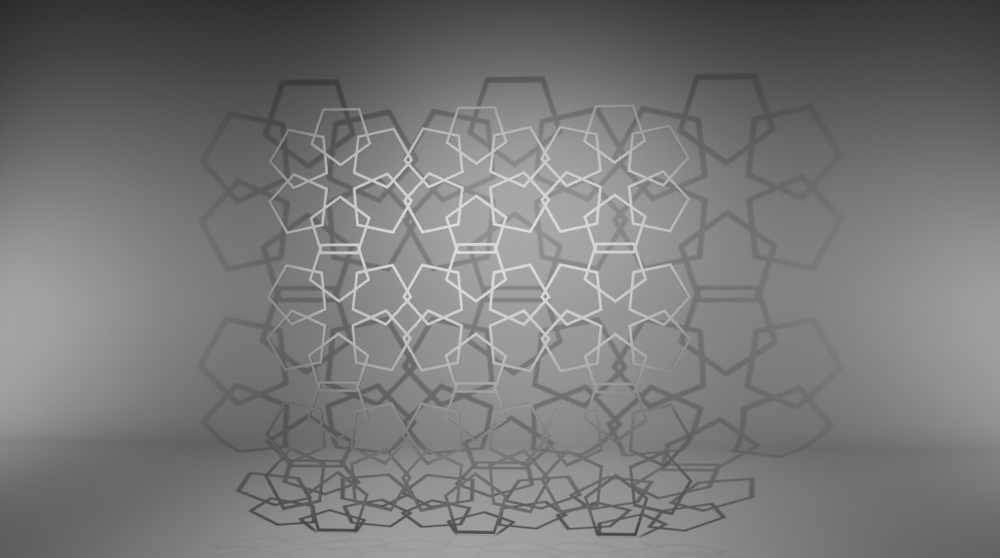]  
  

---

## Tilings

???
  

* What is a tiling?

--

A tiling is a flat surface with some pattern of geometric shapes (*tiles*), with no overlaps or gaps.  

---
## Tilings

 
.imgref[[[pi.math.cornell]](http://pi.math.cornell.edu/~mec/2008-2009/KathrynLindsey/PROJECT/Page2.htm)]

---
## Tilings

.center[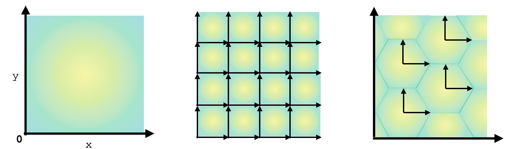]

???

So far, we have used simple grids to create repetitive patterns. However, grid with hexagons are also very commonly used!

* Unreal would be the way to go: https://www.youtube.com/watch?v=hc6msdFcnA4
* https://www.youtube.com/watch?v=VmrIDyYiJBA

---
.header[Tilings]

.center[]

---
.header[Tilings]

.center[ ]

---
.header[Tilings]

.center[]

---
.header[Tilings]

.center[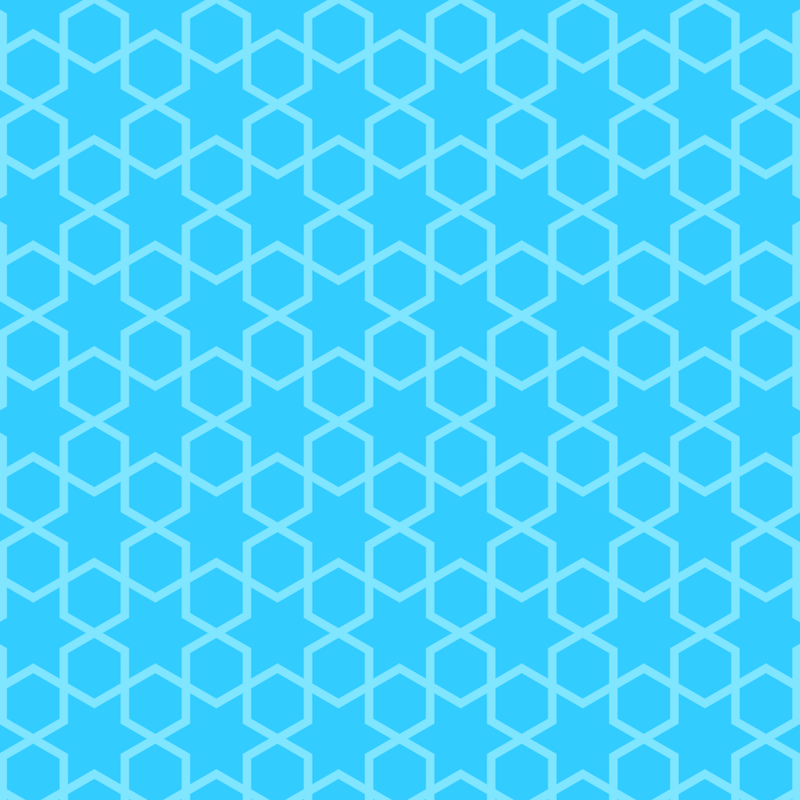]

---
.header[Tilings]

.center[ ]

---
.header[Tilings]

.center[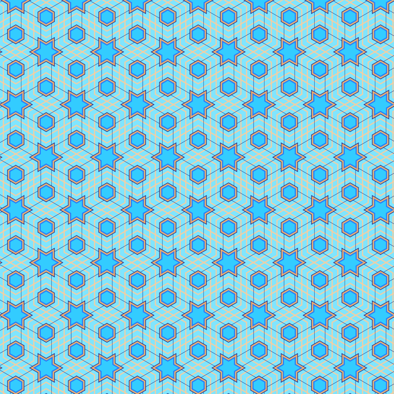]

---
.header[Tilings]

.center[ 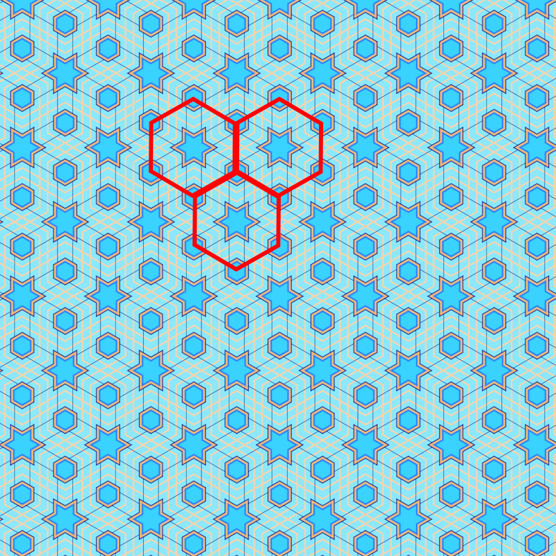]

---
.header[Tilings]

.center[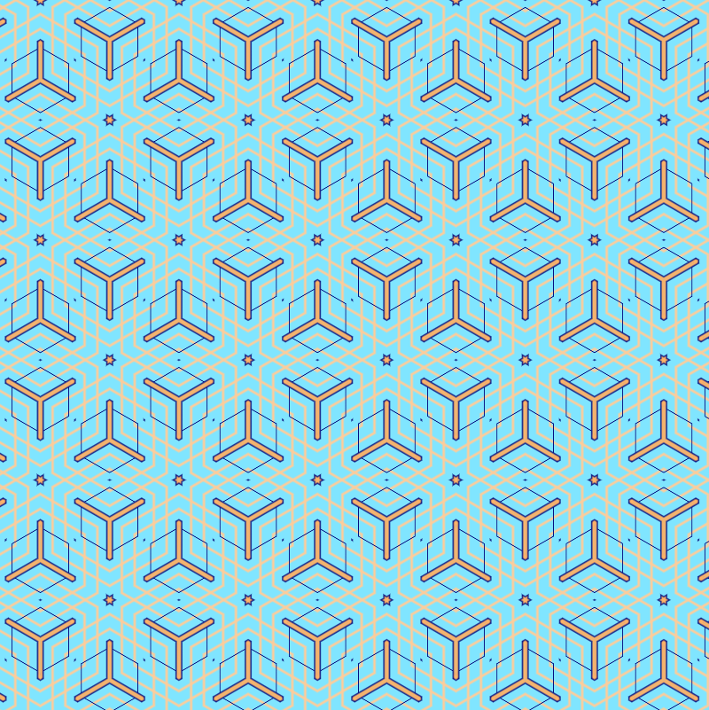]

---
.header[Tilings]

.center[ 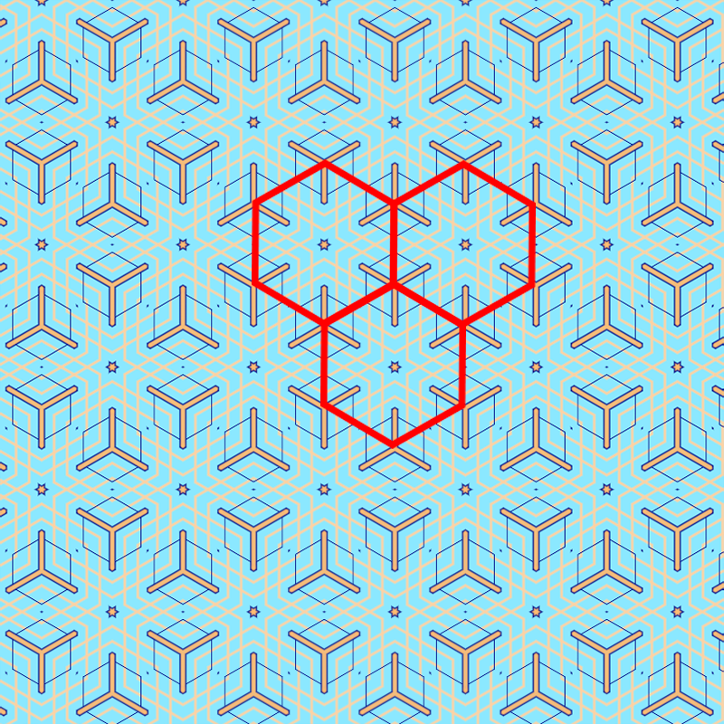]

???
  

* pattern_islamic_hex.frag

---
.header[Tilings]

## Hexagonal Grids

--

.center[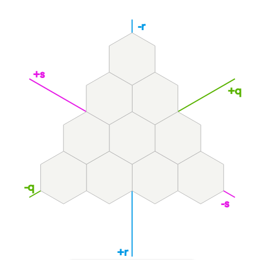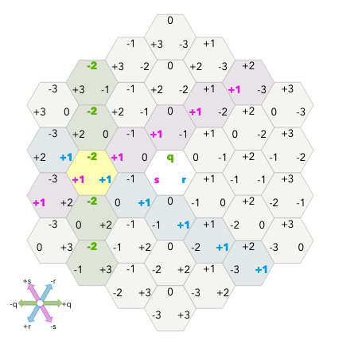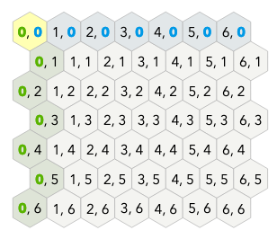]

???
  

* Another way to look at hexagonal grids is to see that there are three primary axes, unlike the two we have for square grids. There's an elegant symmetry with these.
* https://www.redblobgames.com/grids/hexagons

---
.header[Tilings]

## Distances in Grids 

.center[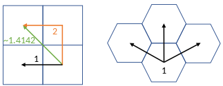]  
.imgref[[[wiki]](https://en.wikipedia.org/wiki/Hex_map)]

???
  

* Advantage of hex maps in games: consistent distance from center to center compared to squares.
* This distance is √3 times that of a hexagon side.

he primary advantage of a hex map over a traditional square grid map is that the distance between the center of each and every pair of adjacent hex cells (or hex) is the same. By comparison, in a square grid map, the distance from the center of each square cell to the center of the four diagonal adjacent cells it shares a corner with is √2 times that of the distance to the center of the four adjacent cells it shares an edge with. This equidistant property of all adjacent hexes is desirable for games in which the measurement of movement is a factor. The other advantage is the fact that neighbouring cells always share edges; there are no two cells with contact at only a point. 

* https://pro.arcgis.com/en/pro-app/latest/tool-reference/spatial-statistics/h-whyhexagons.htm

---
.header[Tilings]

## Hexagonal Grids

.center[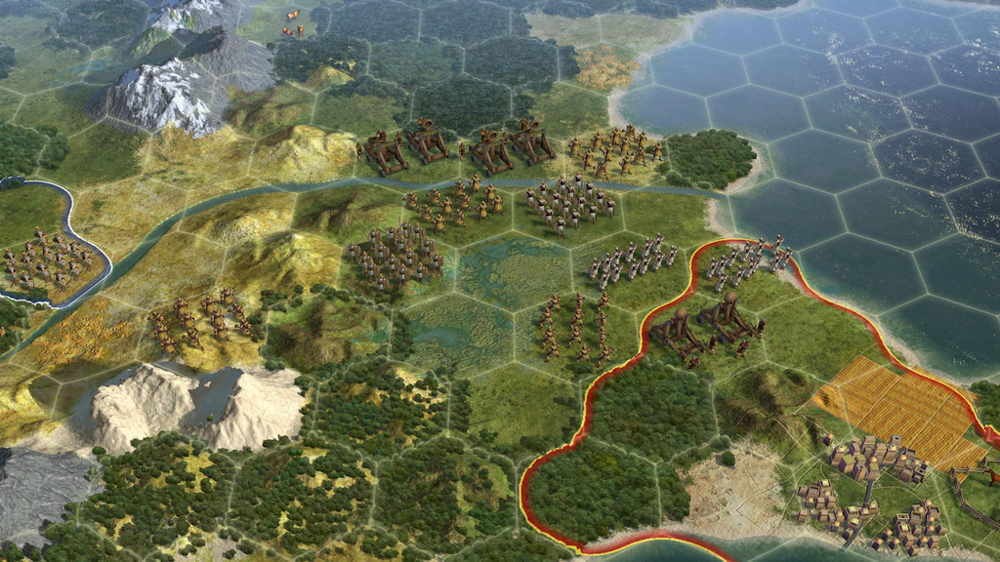] .imgref[[[gamedev]](https://gamedev.stackexchange.com/questions/83412/hexagonal-game-board-modal)]

---
.header[Tilings]

## Hexagonal Grids

.center[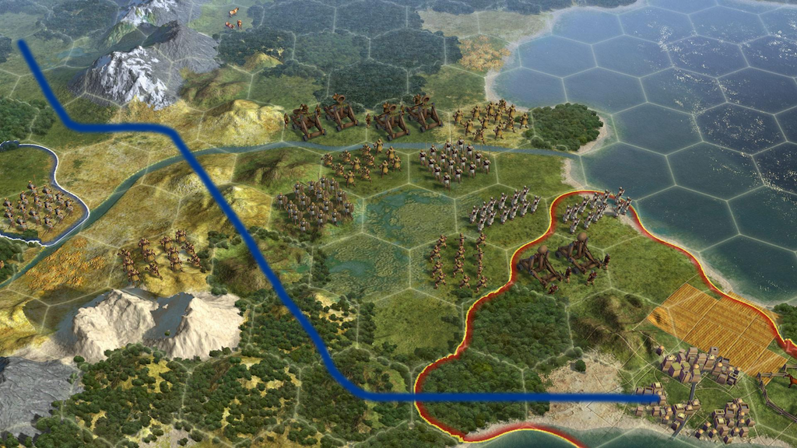] .imgref[[[gamedev]](https://gamedev.stackexchange.com/questions/83412/hexagonal-game-board-modal)]

???
  

* https://www.shadertoy.com/view/4dGGzc

.center[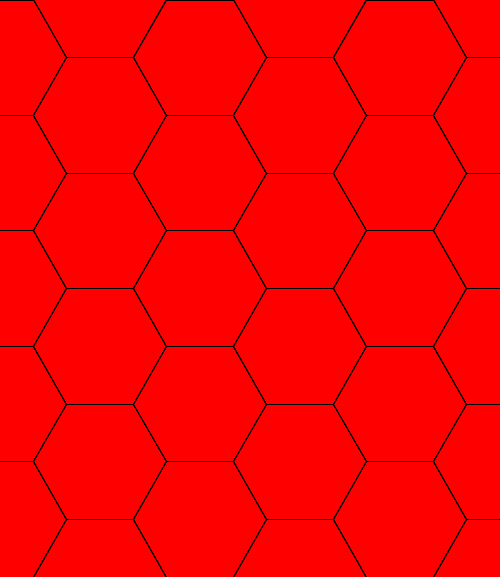[[wiki]](https://en.wikipedia.org/wiki/File:ChamferedHexTilingAnimation.gif)]

* A chamfered hexagonal tiling replacing edges with new hexagons and transforms into another hexagonal tiling. In the limit, the original faces disappear, and the new hexagons degenerate into rhombi, and it becomes a rhombic tiling. 
* https://www.youtube.com/watch?v=A-1O4BHdkfA

---
.header[Tilings]

## Hexagonal Grids in Nature?

---
.header[Tilings]

## Hexagonal Grids in Nature

.left-even[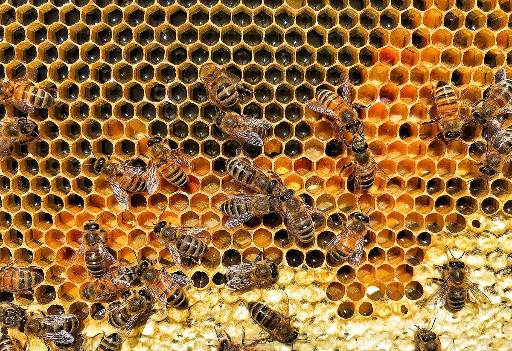  
.imgref[[[documentarytube]](https://www.documentarytube.com/articles/the-hexagon-nature-s-most-powerful-creation/)]]  

???
  

* Least amount of vax and most amount of storage space
* https://www.youtube.com/watch?v=QEzlsjAqADA
* [March is hexagonal awareness month](https://hexnet.org/content/hexagonal-awareness-month-2012)

--
.right-even[
> Why do honeybees love hexagons? Cause hexagons are the bestagons!
]

---
.header[Tilings]

## Hexagonal Grids in Nature

.center[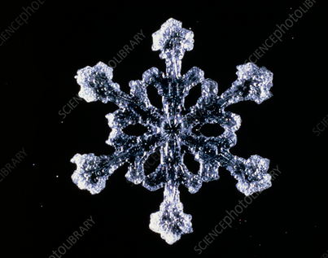]   
*Macrophotograph of a snow crystal showing characteristic hexagonal symmetry.*  
.imgref[[[sciencephoto]](https://www.sciencephoto.com/media/161797/view)]

???
  

* ach crystal is made up from water molecules, arranged with 2 hydrogen atoms making an angle of 105 degrees with 1 oxygen atom. The fixed shape of the water molecule means they can assume a stable crystal arrangement only when arranged as a 6-branched figure. Despite essential hexagonal similarity no two snowflakes are identical because their growth from cloud, through sky, to the ground is influenced by temperature, humidity, air currents etc. & these conditions are never identical for two snowflakes. Magnification: x5 (35mm size).

---
.header[Tilings]

## Figurative Tilings

--

.center[  M.C. Escher, Lizard, 1942]

---
.header[Tilings | Figurative Tilings]

.center[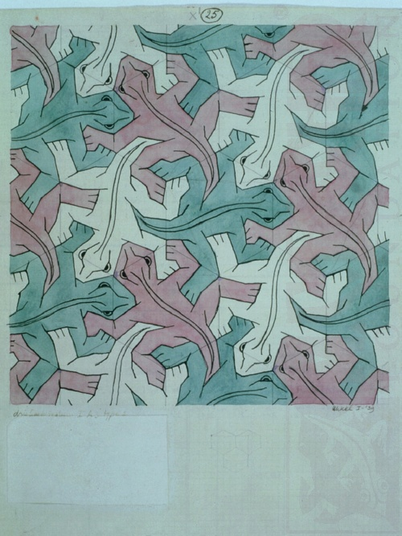]

???
* https://graphicdesign.stackexchange.com/questions/90537/how-did-escher-make-his-tesselations

---
.header[Tilings | Figurative Tilings]

.center[]

---
.header[Tilings | Figurative Tilings]

.center[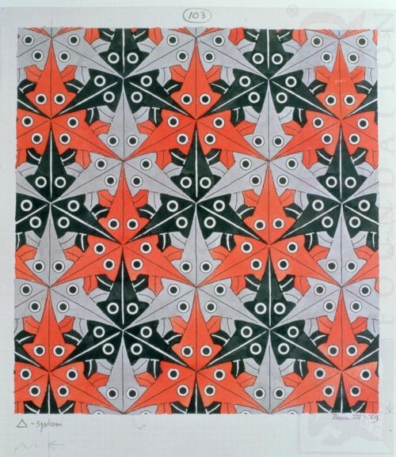]

---
.header[Tilings | Figurative Tilings]

## M.C. Escher

<iframe width="741" height="408" src="https://www.youtube.com/embed/Kcc56fRtrKU" title="The Mathematical Art Of M.C. Escher" frameborder="0" allow="accelerometer; autoplay; clipboard-write; encrypted-media; gyroscope; picture-in-picture; web-share" referrerpolicy="strict-origin-when-cross-origin" allowfullscreen></iframe>

---
.header[Tilings]

## Figurative Tilings

<iframe width="741" height="417" src="https://www.youtube.com/embed/3VSyDpCEiyY" title="What is a Tessellation?" frameborder="0" allow="accelerometer; autoplay; clipboard-write; encrypted-media; gyroscope; picture-in-picture; web-share" referrerpolicy="strict-origin-when-cross-origin" allowfullscreen></iframe>

???
COMMENT: 
* [Tessellations by Recognizable Figures](https://eschermath.org/wiki/Tessellations_by_Recognizable_Figures.html)
* https://eschermath.org/wiki/Regular_Division_of_the_Plane_Drawings.html
* https://www.youtube.com/watch?v=ZNVyrxdlrGQ

---
## Tilings

How about pentagons?

.left-even[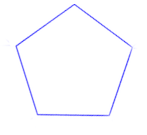]

---
## Tilings

How about pentagons?

.left-even[]

--

vs.

.right-even[  
.imgref[[[pi.math.cornell]](http://pi.math.cornell.edu/~mec/2008-2009/KathrynLindsey/PROJECT/Page2.htm)]]

---

## Tilings

.center[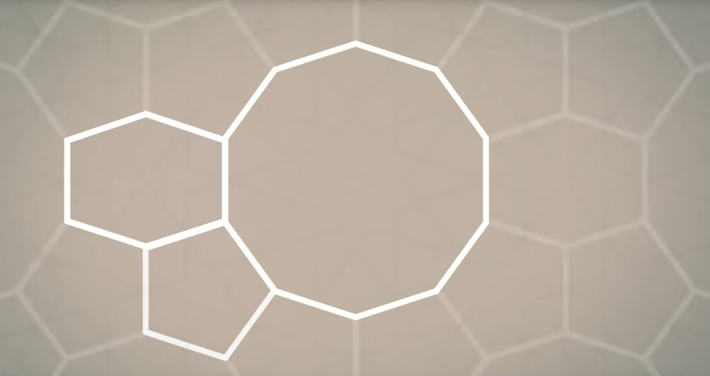]

---

## Tilings

Tillings can have various properties and and various mathematical questions can be derived from them.

???
  

* A tiling is said to be periodic if there exist, among the symmetries of the tiling, at least two translations in non-parallel directions.

.center[[[pi.math.cornell]](http://pi.math.cornell.edu/~mec/2008-2009/KathrynLindsey/PROJECT/Page2.htm)] 

???
  

* A non-periodic tiling can not simply be constructed based on two translations in non-parallel directions.
* Above, the central star occurs nowhere else in the tiling, and so no translations are possible.
  
* A much more complex question is to ask which shapes can tile a plane in a pattern that does not repeat?

---

## Tilings

.center[  
*Penrose rhomb tile*  
.imgref[[[aperiodictiling]](https://www.aperiodictiling.org/wpaperiodictiling/)]]

???
  

* What kind of tiling is this?
* A non-repeating pattern, is call an *aperiodic* tiling. Hence, a set of polygons that tile the plane but never form a periodic tiling.
  
* This means the pattern is not constructable by simple translations of potentially arbitrarily large periodic patches. Shifting an aperiodic tiling cannot produce the same tiling. 
* It is not possible to create the tiling by taking some (potentially very large) section and repeating it over and over again. 
* Around 1973/74 Roger Penrose found a set of two tiles that only tile non periodically. 

---
.header[Tilings]

## Aperiodic Tilings

.left-even[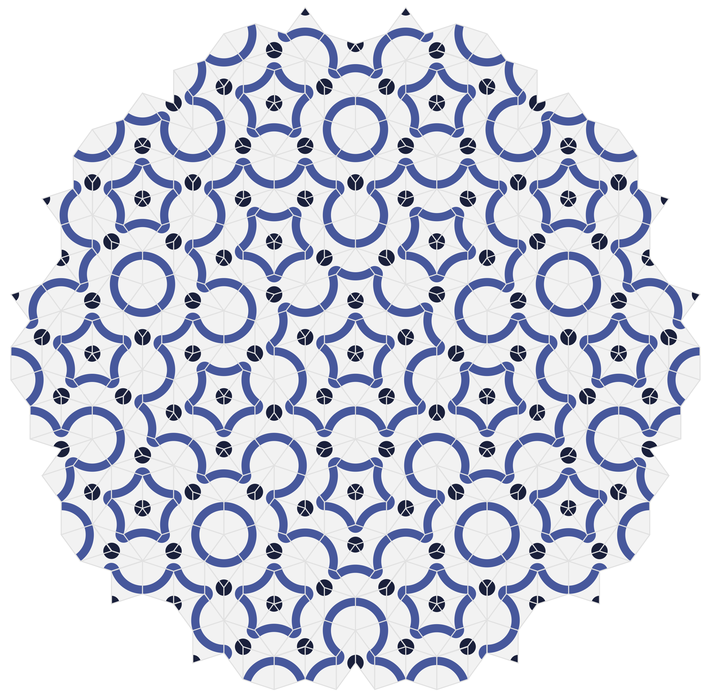]

.right-even[
A tiling that does not repeat
]

---
.header[Tilings]

## Aperiodic Tilings

.left-even[]

.right-even[
A tiling that does not repeat

* Shifting an aperiodic tiling cannot produce the same tiling
* Lokal patches can be identical
]

---
.header[Tilings]

## Aperiodic Tilings

.left-even[]

.right-even[
A tiling that does not repeat

* Shifting an aperiodic tiling cannot produce the same tiling
* Lokal patches can be identical

> What is the smallest number of prototiles necessary to tile the plane aperiodically?

]

---
.header[Tilings]

## Aperiodic Tilings

.left-even[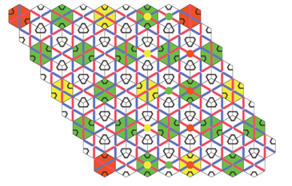 .imgref[[technologyreview](https://www.technologyreview.com/2010/03/25/205077/first-aperiodic-tiling-with-a-single-shape/)]]

.right-even[

The first aperiodic set was constructed by Robert Berger in 1966 and it contained 20426 prototiles.
]

???
  

* https://web.archive.org/web/20060830155826/http://www.uwgb.edu/dutchs/symmetry/aperiod.htm
* https://ics.uci.edu/~eppstein/junkyard/tiling.html

---
.header[Tilings]

## Penrose Tilings

.left-even[]

.right-even[

The last improvement was found in the 1970s by Roger Penrose and it includes two rhombuses.
]

---
.header[Tilings]

## Einstein Tilings

.left-even[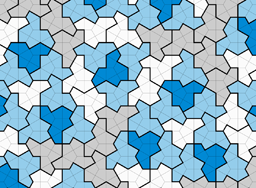]

.right-even[

Last year the Einstein-tile was finally found...
]

---
.header[Tilings]

## Einstein Tilings

.left-even[]

.right-even[

Last year the Einstein-tile was finally found...
  
...by an amateur!

]

---
.header[Tilings]

## Einstein Tilings

.left-even[]

.right-even[

Last year the Einstein-tile was finally found...
  
...by an amateur!
  
 
And then proven by mathematicians.
]

???
  

* https://cs.uwaterloo.ca/~csk/hat/

---
.header[Tilings]

## Einstein Tilings

[How a Hobbyist Solved a 50-Year-Old Math Problem (Einstein Tile):](https://www.youtube.com/watch?v=A1BhOVW8qZU&t=564s)

<iframe width="640" height="360" src="https://www.youtube.com/embed/A1BhOVW8qZU" title="How a Hobbyist Solved a 50-Year-Old Math Problem (Einstein Tile)" frameborder="0" allow="accelerometer; autoplay; clipboard-write; encrypted-media; gyroscope; picture-in-picture; web-share" referrerpolicy="strict-origin-when-cross-origin" allowfullscreen></iframe>

---
template:inverse

# Islamic Patterns

---
## Islamic Patterns

.center[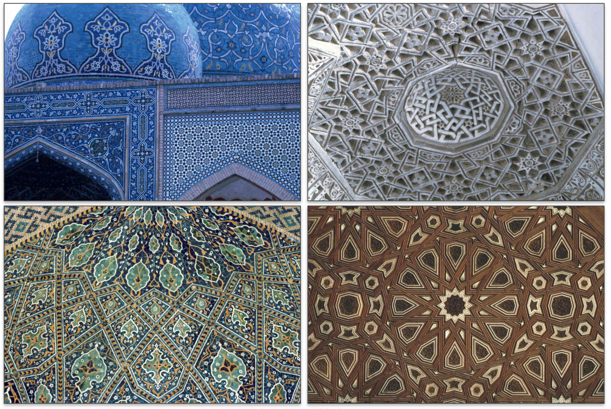]

???
  

## Islamic Art

Covers a wide range of lands, periods, and genres.

Began in the 8th century

* Influences Roman and Persian cultures
* Islamic Golden age
    * 8th century to the 14th century
    * Fundamental advancements in science and mathematics
    * Resulting also in complex geometry in art

---
## Islamic Art

> Patterns are everywhere...

--

Some interpretations of Islam include a ban of depiction of animate beings

* Prohibition of idolatry
* Belief that creation of living forms is God's prerogative

???
  

* also known as aniconism

--

Characterized by three recurrent motifs

1. Calligraphy
2. Arabesques
3. Geometry

???
  

Based on this exclusion of depicting any figural form of living creatures, there are three distinct disciplines that constitute the core elements of Islamic art, namely

---
.header[Islamic Art]
## Geometry

Patterns and tile work that seem to repeat infinitely

--
* Kaleidoscopic effects

--
* Inspiring contemplation of eternal order

---

## Islamic Patterns

Traditional Islamic art is composed with only compasses and a ruler. Therefore, designs are based on circles and lines.

  
.imgref[[[ricoflow]](https://www.youtube.com/watch?v=FqBWjJQKICk)]

---

## Islamic Patterns

.center[] 

--

The circle as a symbol of unity and as ultimate source of all diversity in creation.

???
  

* Each design starts with a circle. 
* The division of the circle into regular divisions is a ritual starting point

---
.header[Islamic Patterns]

## Construction Example

.center[] 

???
  

1. Cell design with construction lines
2. Tessellation

Construction lines
* Normally Invisible
* Determine the scale
* Maintain accuracy

---
.header[Islamic Patterns]

## Construction Example

.center[] 

---
.header[Islamic Patterns]

## Construction Example

.center[] 

---
.header[Islamic Patterns]

## Construction Example

.center[] 

---
.header[Islamic Patterns]

## Construction Example

.center[] 

---

## Islamic Patterns

Many different designs can be derived from the same construction lines by picking different segments.

---

## Islamic Patterns

.center[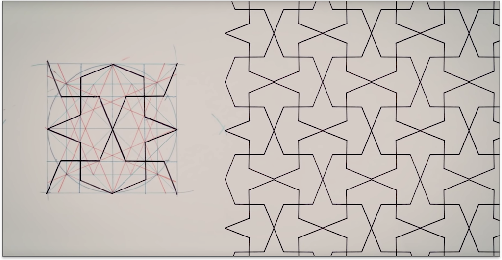] 

---

## Islamic Patterns

.center[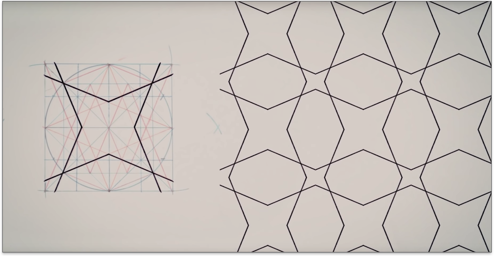] 

---

## Islamic Patterns

.center[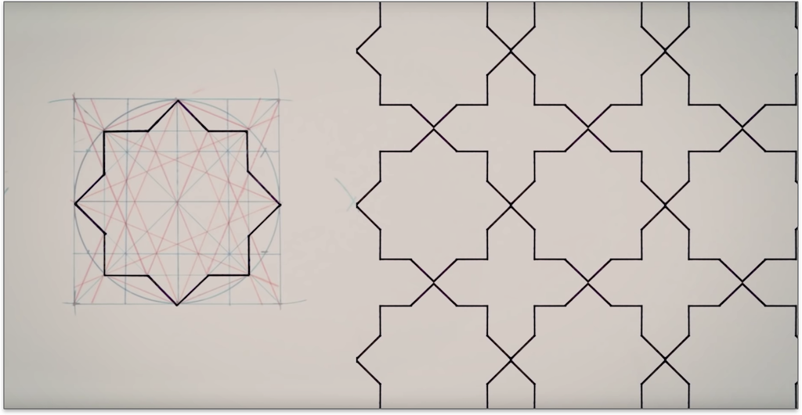] 

---

## Islamic Patterns

.center[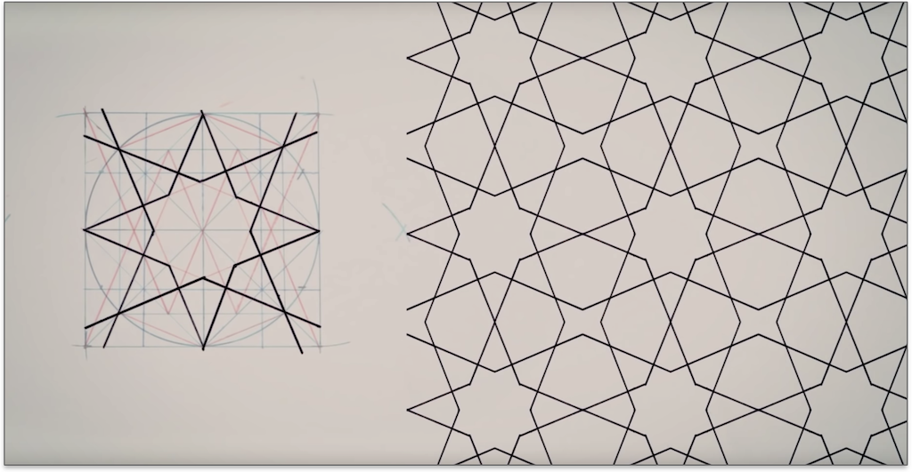] 

---
.header[Islamic Patterns]

## "Fake" Implementation

.center[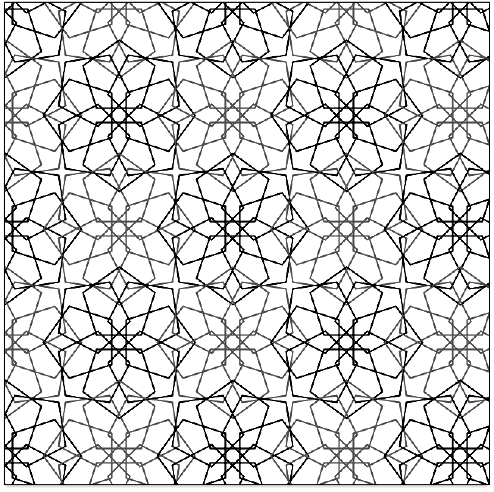] 

---
.header[Islamic Patterns]

## "Fake" Implementation

.center[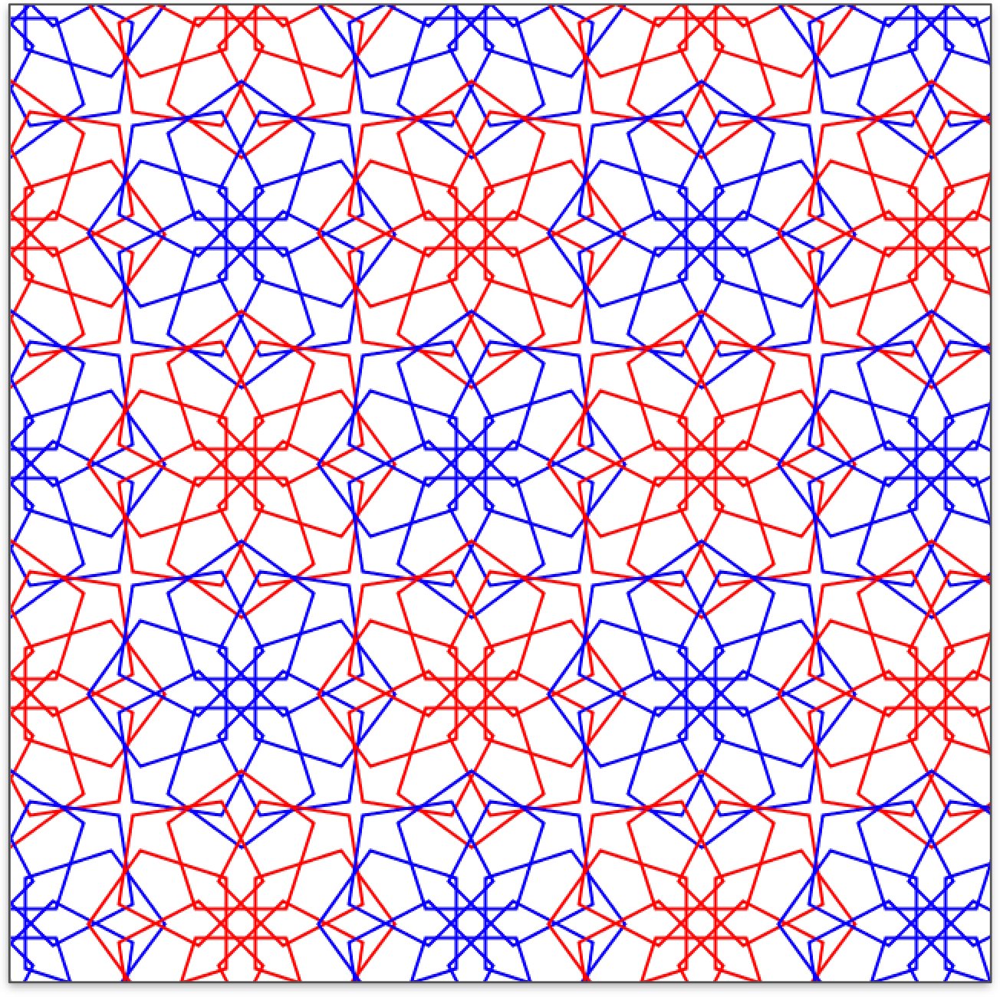] 

---
.header[Islamic Patterns]

## "Fake" Implementation

.center[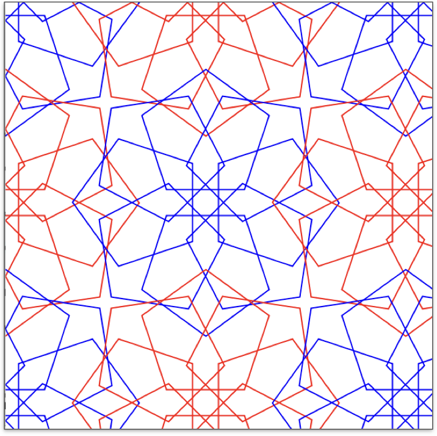] 

---
.header[Islamic Patterns]

## "Fake" Implementation

.center[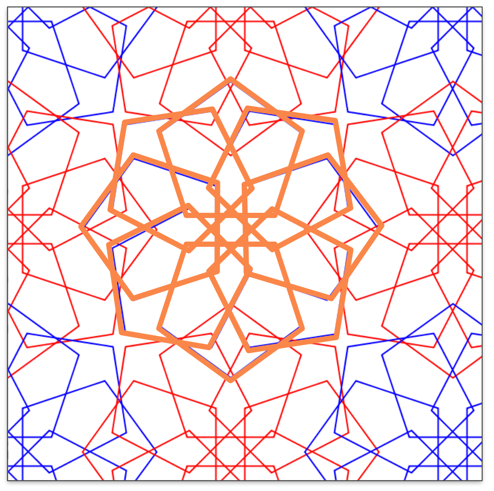] 

---
.header[Islamic Patterns]

## "Fake" Implementation

.center[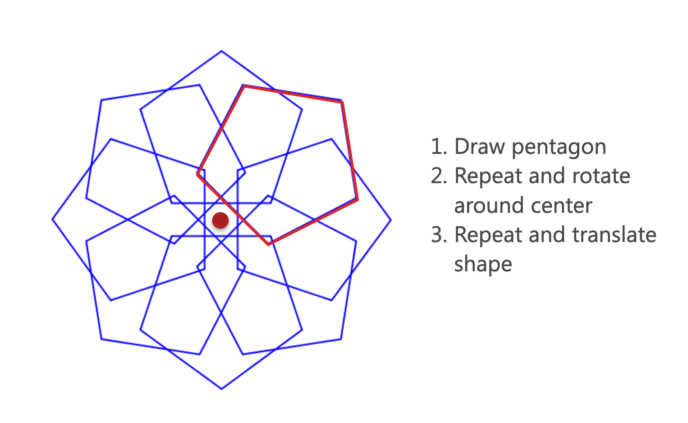] 

???
  

* https://editor.p5js.org/legie/sketches/nX6glgYEE

---
  
.center[]  
  

---

## Islamic Patterns

.center[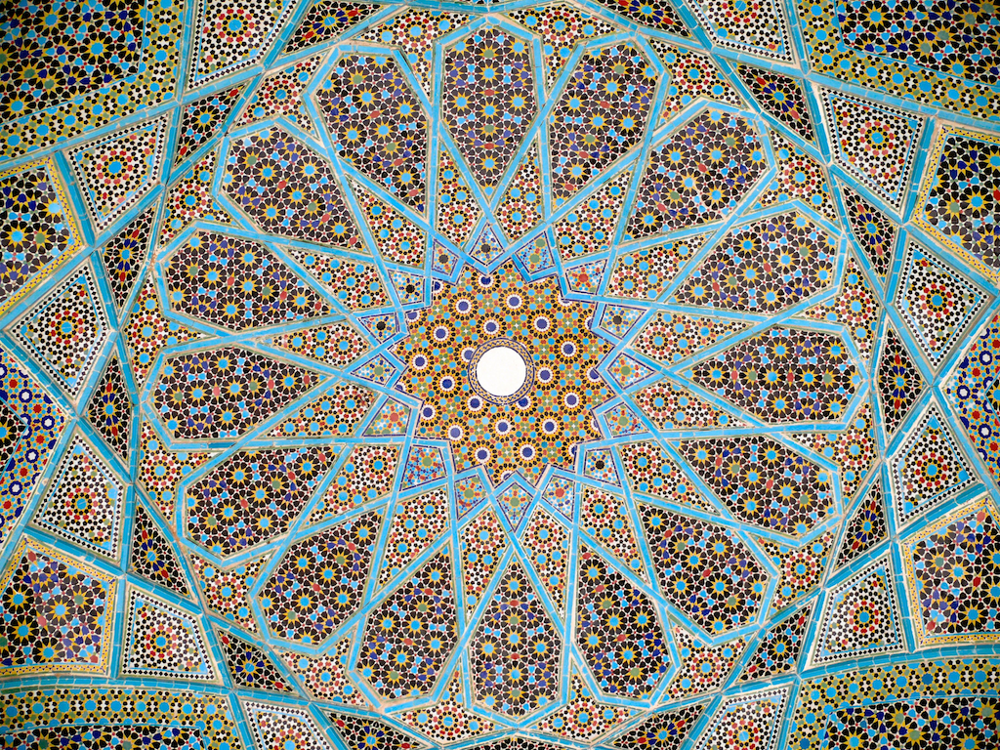 .imgref[[[wiki]](https://en.wikipedia.org/wiki/File:Roof_hafez_tomb.jpg)]]

???
  

* Complex girih patterns with 16-, 10- and 8-point stars at different scales in ceiling of the Tomb of Hafez in Shiraz, 1935.
 

* Through their intricate design, patterns and tile work often appear to repeat infinitely, with kaleidoscopic effects. This might be understood as invitation to contemplate eternal order.

---

## Islamic Patterns

.left-even[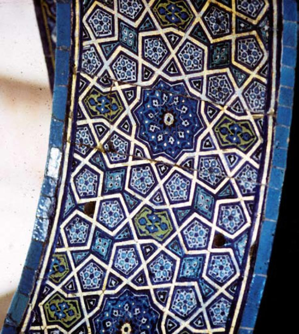 .imgref[[[wiki]](https://en.wikipedia.org/wiki/File:Roof_hafez_tomb.jpg)]]
  
*Interior archway at the opening of the Sultan's Lodge in the Ottoman Green Mosque in Bursa, Turkey (1424), with 10-point stars and pentagons*

???
  

* https://www.sciencenews.org/article/ancient-islamic-penrose-tiles-0

--

.right-even[

* Similar to a Penrose tiling?
* 500 years before Penrose...

]

???
  

* In principle, by repeatedly scaling up the tiling in this way, they could have covered an arbitrarily large wall with a Penrose tiling.
* Lu also figured out that the girih tiles could be broken up into the kites and darts of Penrose tiles. When he divided the tiles in this way, one building, the Darb-i Imam shrine, had a near-perfect Penrose tiling. The shrine was built in 1453, and it would be another 500 years before the mathematics behind Penrose tiles was developed.

---
template:inverse

# Sacred Geometry

???
  

* Speaking of religion, there is a discipline called *sacred geometry*. Sacred geometry ascribes symbolic and sacred meanings to certain geometric shapes and certain geometric proportions [1, as cited in [[7]](https://en.wikipedia.org/wiki/Sacred_geometry)]. It is associated with the belief that god is a mathematician, specializing in geometry, applying this mastery when building the world. Here, the synchronicity of the universe is determined by certain mathematical constants, which express themselves in the form of patterns and cycles in nature. The geometry used in the design and construction of religious structures such as churches, temples, mosques, religious monuments, altars, and tabernacles has then sometimes been considered sacred. 

[[7]](https://en.wikipedia.org/wiki/Sacred_geometry) [[8]](http://www.ancient-wisdom.com/sacredgeometry.htm)  

---
.header[Sacred Geometry]

## The Pentagram of Venus

.left-even[  
.imgref[[[Greg Evans]](http://www.gregegan.net/) [[johncarlosbaez]](https://johncarlosbaez.wordpress.com/2014/01/04/the-pentagram-of-venus/)]
]  

.right-even[A slightly simplified visualization of Venus's path observed from Earth.
]
  

???
  

* The image shows the plane of the solar system with the earth positioned at the centre of the diagram and the curve representing the direction and distance of Venus as a function of time. This is called *the pentagram of venus* or the *rose of venus*.
* With the passage of one year, the sun goes around the earth. As the sun goes around the earth 8 times, venus goes around the sun 13 times, then the same paths start again.  

## The Pentagram of Venus

.center[]  
  
[[johncarlosbaez]](https://johncarlosbaez.wordpress.com/2014/01/04/the-pentagram-of-venus/) *Detail from James Ferguson’s, Astronomy Explained Upon Sir Isaac Newton’s Principles, 1799 ed., plate III, opp. p. 67.*

* This is also called the pentagram of Venus, because the path has 5 ‘lobes’ where Venus makes its closest approach to Earth. At each closest approach, Venus move backwards compared to its usual motion across the sky: this is called [retrograde motion](https://en.wikipedia.org/wiki/Apparent_retrograde_motion).  

---
.header[Sacred Geometry]

## The Seed of Life

.center[ .imgref[[[etemetaphysical]](https://blog.etemetaphysical.com/seedoflife/)]]  

???
  

 *Top row, left to right:  Variations on the central rosette on 17th century BCE Greek coins, an early 15th century CE Arabic tile, and the Gundestrup cauldron of Denmark.  Middle row, left to right:  Examples of the rosette net pattern on a 1st century BCE mosaic in Israel, a monastery window on Crete, and a sketch by Leonardo da Vinci.  Bottom row, left to right: The rosette can be used to generate more complicated geometric patterns like the rose window of Saint Stephen’s cathedral in Vienna, a 2nd century CE Roman mosaic in France, and an early 17th century Chinese illumination for a Qu’ran. Image Source: Public domain, Wikimedia Commons.* [[9]](https://blog.etemetaphysical.com/seedoflife/)  

**Well, believe what you want to believe. I am all for an appreciation of maths and geometry but let me just throw into the discussion here that maybe the *seed of life* design has been around for so long because it is easy to create with compasses and looks nice.**

---
.header[Sacred Geometry]

## The Seed of Life

.center[ .imgref[[[travelingalchemists]](https://travelingalchemists.wordpress.com/)]]  

???
  

* From the The Traveling Alchemists’ Outreach Society
* The above image, depicts the *seed of life*, which is believed to be an ancient geometric universal symbol for all creation.

---
template:inverse

### The End

# 👋🏻
