name: inverse
layout: true
class: center, middle, inverse
---


# Procedural Generation and Simulation

#### - Noise -

<br />

### Prof. Dr. Lena Gieseke | l.gieseke@filmuniversitaet.de  

#### Film University Babelsberg KONRAD WOLF

???


---
layout:false
## Nature

.center[]


???
  

* https://www.shadertoy.com/view/XslGRr
* https://www.shadertoy.com/view/MdfGRX

---
## Nature

.center[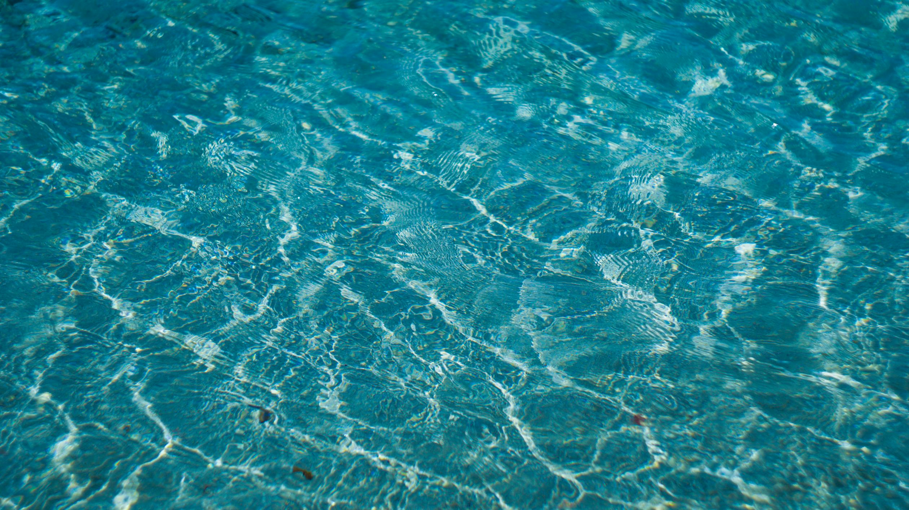]
.imgref[[Olena Goldman](https://www.pexels.com/photo/photo-of-water-ripples-933701/)]

---
## Noise

.center[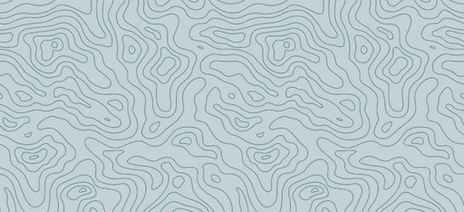]


---
## Noise

.center[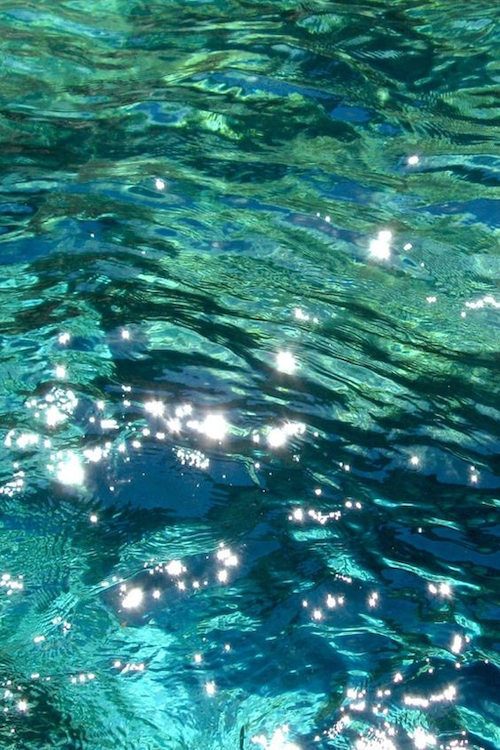]


---
## Noise

.center[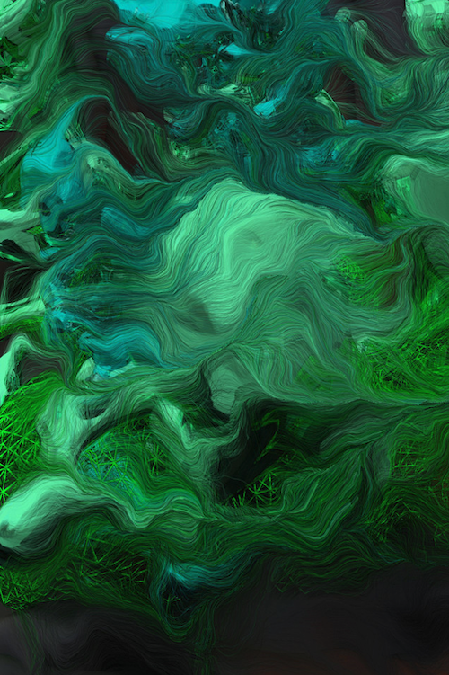]


---
## Noise

.center[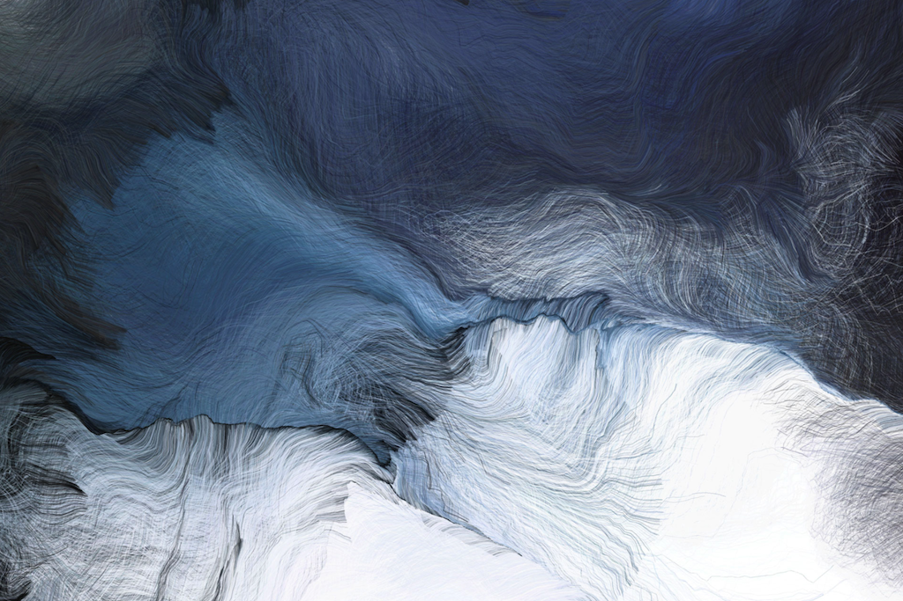]


???
  


---
## Noise

.center[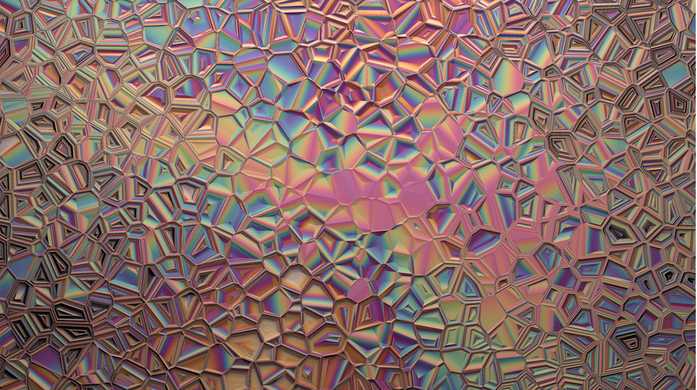]

---
## Noise

.center[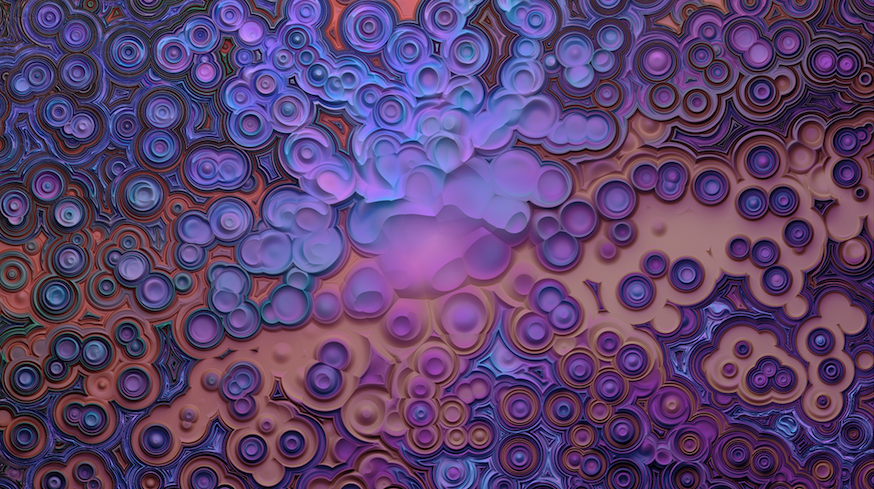]


---
.header[Noise]

## Faking Complex Systems

.center[]


???
  

* Almost all natural systems appear to combine structure with randomness even though they in fact follow complex creation rules on different scales. As proper simulations of the underlying rules are usually quite expensive to compute, a simple addition of noise is used fake natural systems.  

---
.header[Noise]

## Faking Complex Systems

 .imgref[[[thisiscolossal]](https://www.thisiscolossal.com/wp-content/uploads/2016/11/mush-1.gif)]


???
  
 
* The mushrooms appear to us to grow pretty random even though their growth is greatly controlled by factors such as light and foil properties.


---
.header[Applications for Noise]

## Faking Complex Systems

.left-even[  
.imgref[[[thisiscolossal]](https://www.thisiscolossal.com/wp-content/uploads/2016/11/mush-1.gif)]]


.right-even[
> Noise adds variation for designed systems to look natural and for an aesthetic appeal.
]


---
template:inverse

# Randomness, Noise, Chaos


---
## Post-World War II

> There is no other concept that was more influential in the history of contemporary art of the post-World War II era than "randomness". [...] It profoundly altered its main modes of expression in both the arts and the sciences.

—Matilde Marcolli

.footnote[Marcolli, M. 2020. Lumen naturae: Visions of the abstract in art and mathematics. The MIT Press, Cambridge, MA.]


???
  

* This coming to terms with the concept of randomness caused a major shift in consciousness and world view

---
## World War II

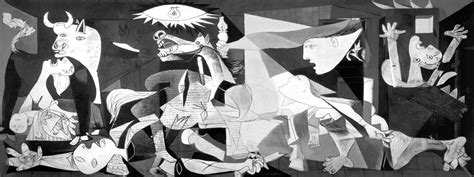 Pablo Picasso, *Guernica*, 1937.

???
  

* The bombing of Guernica was the first areal bombing in Europe
* Most of the destruction of European cities was then caused by aerial bombings
* What was hit was determined by randomness

.footnote[Marcolli, M. 2020. Lumen naturae: Visions of the abstract in art and mathematics. The MIT Press, Cambridge, MA.]

---
## Post-World War II

World War II marked the end of religion for a large part of the European intelligentsia.

--

> Only his nonexistence can excuse God.

-- Allegedly Einstein

--

<br >

A broader sense of the predictability of life had come to an end.

.footnote[Marcolli, M. 2020. Lumen naturae: Visions of the abstract in art and mathematics. The MIT Press, Cambridge, MA.]

---

## Post-World War II


> Meditating upon the ruins of Europe at the end of World War II, people saw the deterministic view of the Enlightenment crumble, replaced by a new understanding of the dominant force of nature: mindless, blind chance.

—Matilde Marcolli

.footnote[Marcolli, M. 2020. Lumen naturae: Visions of the abstract in art and mathematics. The MIT Press, Cambridge, MA.]


---

## Post-World War II

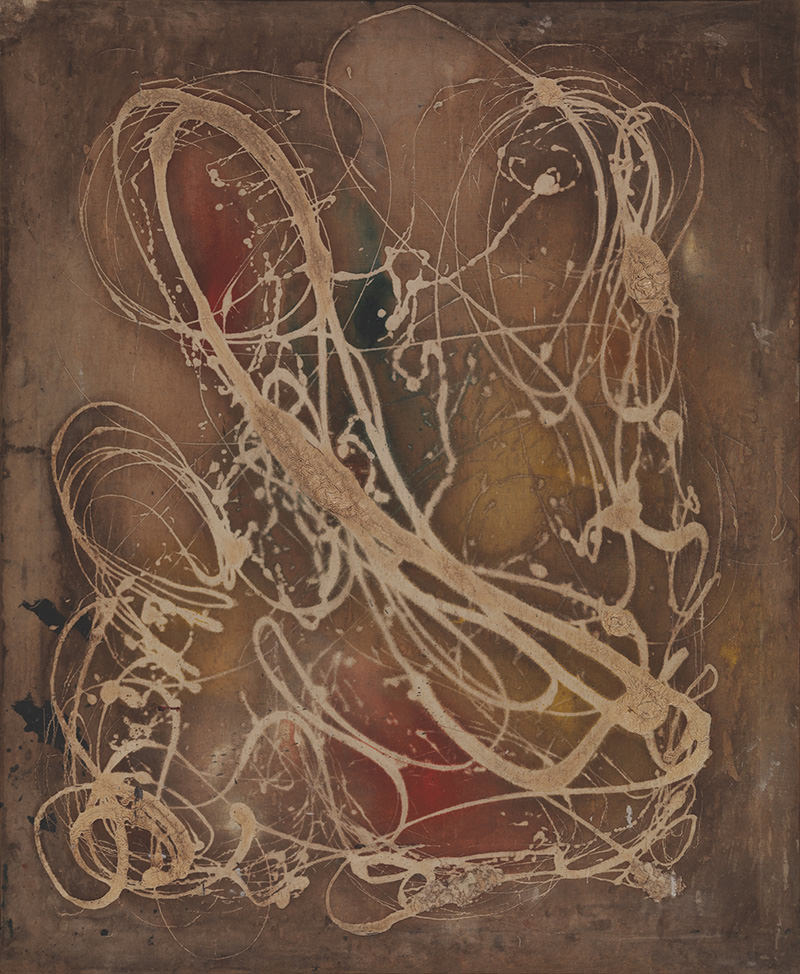 Georges Mathieu, *Évanescence*, 1945.

---

## Post-World War II

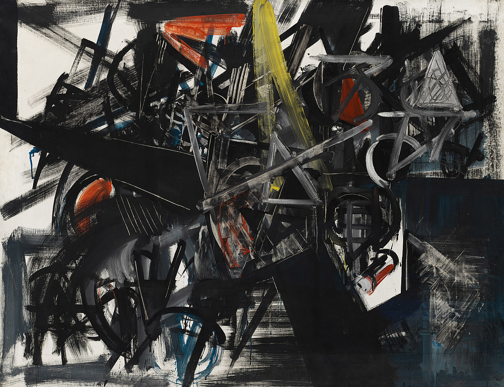  
Emilio Vedova, *Image of Time (Barrier)*, 1951.


???
  

* https://www.guggenheim.org/artwork/4142

Emilio Vedova produced art in response to contemporary social upheavals, however his political position was contrary to that of his early modern counterparts, the Italian Futurists, who coalesced as a group in the years preceding World War I. While the Futurists romantically celebrated the aggressive energies inherent in societal conflict and technological advancement, Vedova’s feverish, violent canvases convey—in abstract terms—his horror and moral protestation in the face of man’s assault on his own kind.

Vedova expressed a political consciousness in his work for the first time during the late 1930s, when his works were inspired by the Spanish Civil War. His continuing commitment to social issues gave rise to series such as Cycle of Protest (Ciclo della protesta, 1956) and Image of Time (Immagine del tempo, 1946–59). Although the motivation behind Image of Time (Barrier) (Sbarramento) is political, its formal preoccupations parallel those of the American Abstract Expressionists, namely Franz Kline. The drama of the angular, graphic slashes of black on white is heightened with accents of orange-red. Occupying a shallow space, pictorial elements are locked together in formal combat and emotional turmoil.

---

## Post-World War II

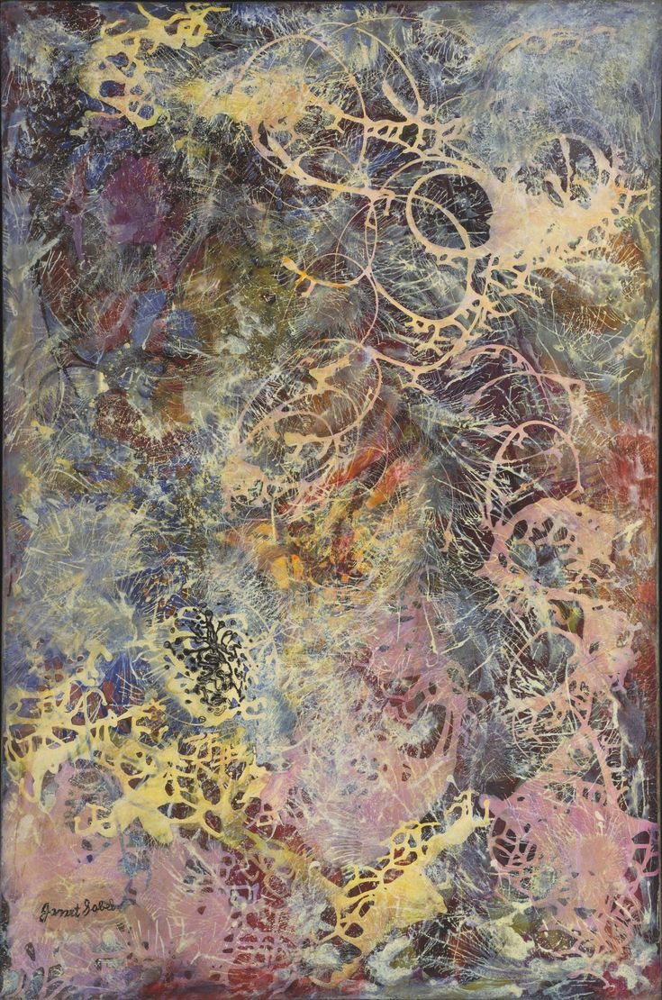 Janet Sobel. *Milky Way*. 1945.


???
  

> The randomness of this painting it compared to a cosmic strucutre, the galaxy, seen as the larger home of humanity, our home in the universe, in a larger perspective that moves away from the devastation of nation-states at war.

* [Janet Sobel: Forgotten Female Artist Who Influenced Jackson Pollock](https://www.dailyartmagazine.com/janet-sobel-forgotten-female-artist/)
* Although almost entirely erased from the canon of Abstract Expressionist art, Janet Sobel (born Jennie Olechovsky) is now slowly gaining recognition as one of the original creators of the “drip painting” technique that many critics have previously associated with Jackson Pollock.

---

## Post-World War II

> New needs need new techniques, and the modern artists have found new ways and new means of making their statements: the modern painter cannot express this age, the airplane, the atom bomb, the radio, in the old forms of the Renaissance or any other past culture.

-- Jackson Pollock


---

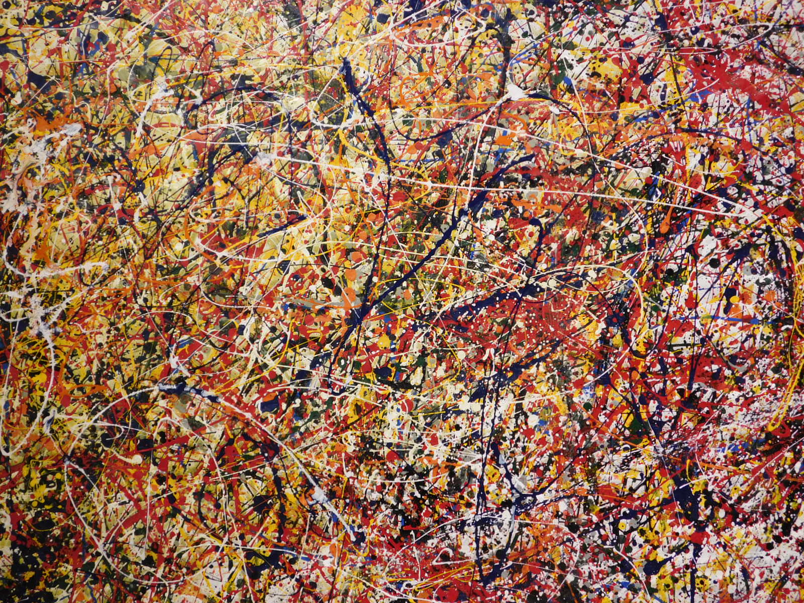  
*Jackson Pollock: Drip Painting, 1951. Woodshed Art Auctions.*


???
  

[[woodshedartauctions]](https://woodshedartauctions.com/wp-content/uploads/2017/11/Jackson-Pollock-1951-Woodshed-Art-Auctions.jpg)


---

## Randomness

> Lines not short, not straight, crossing and touching, drawn at random, using four colors, uniformly dispersed with maximum density, covering the entire surface of the wall.
  
— Sol Lewitt

.footnote[Marcolli, M. 2020. Lumen naturae: Visions of the abstract in art and mathematics. The MIT Press, Cambridge, MA.]


???
  

* ... but what does “at random ... uniformly dispersed with maximum density” mean? what kind of randomness?


---

## Randomness

> Lines not short, not straight, crossing and touching, drawn at random, using four colors, **uniformly dispersed with maximum density**, covering the entire surface of the wall.
  
— Sol Lewitt

.footnote[Marcolli, M. 2020. Lumen naturae: Visions of the abstract in art and mathematics. The MIT Press, Cambridge, MA.]


???
  

* ... but what does “at random ... uniformly dispersed with maximum density” mean? what kind of randomness?

---

## Randomness

.footnote[Marcolli, M. 2020. Lumen naturae: Visions of the abstract in art and mathematics. The MIT Press, Cambridge, MA.]

.left-even[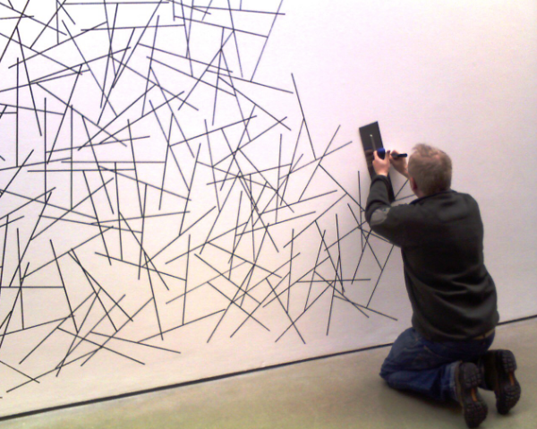  
]

.right-even[*Sol LeWitt’s wall drawing being made at Dia Beacon.*]


???
  

* ... but what does “at random ... uniformly dispersed with maximum density” mean? what kind of randomness?


---

## Randomness

.center[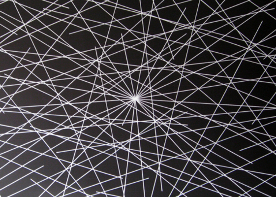  
Sol LeWitt, Wall Drawing 289, 1978.]  


---

## Randomness

.center[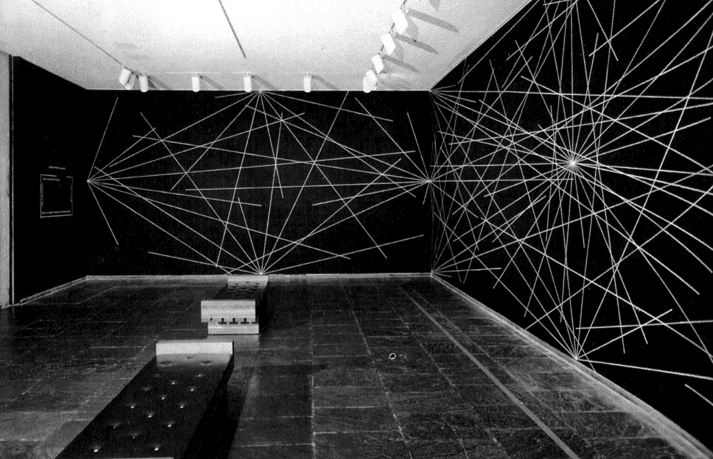  
Sol LeWitt, Wall Drawing 289, 1978]


---

## Randomness

.center[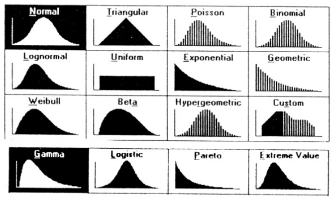]  

.footnote[Marcolli, M. 2020. Lumen naturae: Visions of the abstract in art and mathematics. The MIT Press, Cambridge, MA.]


???
  

* Continuous: Normal distribution, uniform distribution, triangular distribution,...
* Discrete: Bernoulli distribution, Poisson distri-
bution, hypergeometric distribution,...

---

## Randomness

 

.footnote[Marcolli, M. 2020. Lumen naturae: Visions of the abstract in art and mathematics. The MIT Press, Cambridge, MA., Norvig, P. 2012. [Warning Signs in Experimental Design and Interpretation](https://norvig.com/experiment-design.html). Online.]

--

> Which of these plots used the uniform distribution?


???
  

*  In one of the plots each of the blue points is sampled with equal probability from the entire square. Which one is it?
* Most people say the rightmost plot is "most random". Those with some statistical sophistication suspect it may be too random, and pick the middle plot. In fact, it is the leftmost plot that is a uniform random sample of 250 points on the unit square. In the middle plot, the grid is divided into the 25 squares shown by the light lines, and ten points are placed (with a random uniform distribution) in each of the 25 squares. The plot on the right is formed in a similar way, except it is composed of 64 smaller squares (not shown by lines), each of which has 4 points placed at random. People don't like the leftmost plot because it has several clumps of points that seem non-random. In fact, true randomness consists of a mixture of clumps and non-clumps. Randomness is different from homogeneity. 

---

## Randomness

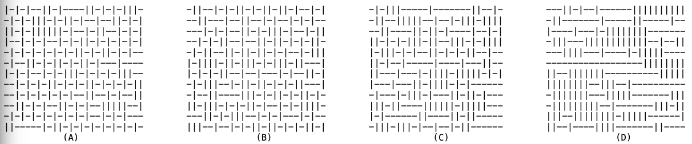

.footnote[Marcolli, M. 2020. Lumen naturae: Visions of the abstract in art and mathematics. The MIT Press, Cambridge, MA., Norvig, P. 2012. [Warning Signs in Experimental Design and Interpretation](https://norvig.com/experiment-design.html). Online.]


???
  

* I asked 10 people; 2 said A, 6 said B, 2 said C, and none said D. Everyone agreed that D has too many long runs of horizontal or vertical marks. Of the others there was disagreement, but the majority said B was about right: not too many long runs, nor too few. In fact C is the correct answer; in C each tick mark is the same as the one before it with probability 1/2. In A the marks flip from one direction to the other 3/4 of the time; in B 2/3 of the time, and in D 1/4 of the time. Presumably my subjects didn't like C because of the several long runs of 6 or 7 ticks in a row. But a run of 7 tick marks should occur with probability 1/64, so in a sample of 300 tick marks, you should expect about 4 or 5 of them. Yet when they do occur, people see it as a pattern, not as randomness. 

---

## Randomness

 

.footnote[Marcolli, M. 2020. Lumen naturae: Visions of the abstract in art and mathematics. The MIT Press, Cambridge, MA., Norvig, P. 2012. [Warning Signs in Experimental Design and Interpretation](https://norvig.com/experiment-design.html). Online.]


???
  

* The first one is uniformly distributed
* Uniform randomness does not exhibit any correlation pattern between position of points
* Entropy = Disorder; Information = Order, Entropy as a measure of Disorder
    * High Entropy states are disordered; while Low Entropy states (like crystals) have highly ordered structures
* Entropy and Thermodynamics: Entropy measures how much energy degrades towards less and less “usable” forms... no perpetual motion machine can ever exis
    * Thermodynamics developed out of the need to understand the efficiency of machines turning energy into work: Entropy limits the efficiency of mechanical machines


--

> More visual regularity usually means more correlations!


---

## Intuition of Randomness

 

> Humans are very good at detecting patterns, but rather poor at detecting randomness!
  

.footnote[Marcolli, M. 2020. Lumen naturae: Visions of the abstract in art and mathematics. The MIT Press, Cambridge, MA., Norvig, P. 2012. [Warning Signs in Experimental Design and Interpretation](https://norvig.com/experiment-design.html). Online.]

  
---

## Intuition of Randomness

???

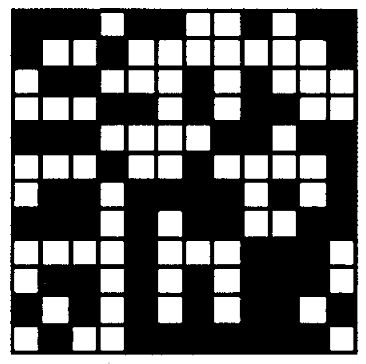


  

* The categorization of events into random or non-random is often done
intuitively. Moreover, the emergence of “patterns” from what is essentially
“noise” is so powerful, that people may reject the statistical analysis, even
when it is available, in favor of the intuitive feeling. The perception,
whether visual or conceptual, is so compelling as to withstand analysis.
Much as the famous Miiller-Lyer illusion is not dispelled by measurement
(see Fig. 11,the perceived “clumping” of random events is not dispelled by
statistical analysis (see Fig. 2). Indeed, it has led to the development of
what statisticians call clumping theory.


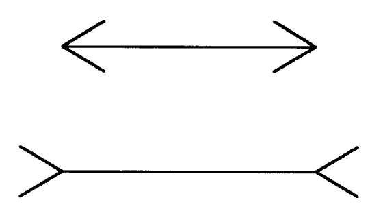 


--

* We perceive irregular clusters that form in a random arrangement as "pattern"

.footnote[Marcolli, M. 2020. Lumen naturae: Visions of the abstract in art and mathematics. The MIT Press, Cambridge, MA., Bar-Hill, M., Wagenaar, W. 1991. The perception of randomness. Elsevier.]


--
* Perceived evenness is an indicator of nonrandom structures and correlations


???
  

* We expect random incidents of cancer to be spread homogeneously, when in fact true randomness results in random clusters, not homogeneity. We need careful statistical tests to distinguish between random and non-random clusters. 
* A recent article in London's Sunday Times reported that clusters of cancer centered around seven different mobile telephone masts, raising the concern that mobile phone radiation might cause cancer.  However, there are 47,000 mobile phone masts in England. The article was titled Cancer clusters at phone masts but for all the details it contains it could just as well have been titled Cell phone masts prevent cancer clusters 99.985% of the time. It is certainly legitimate to be concerned about these seven cancer clusters, but before concluding that cell phones have anything to do with it, we'd need more data: how many of the other 47,000 masts have cancer clusters? How does that number compare to what we would expect by chance? 

---
.header[Procedural Noise]

## Intuition of Randomness


.center[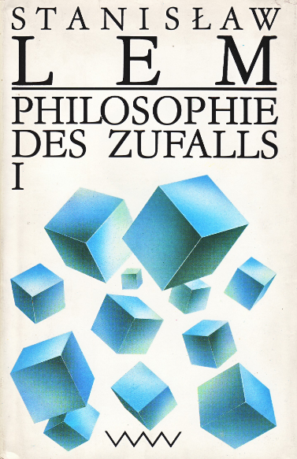] 


???
  

* So gern Lem auch fabuliert – seine Leidenschaft ist die Therorie. Am literarischen Werk als seinem Erkenntnisgegenstand probiert er der Reihe nach die verschiedenen Erkenntnismethoden aus: die semantische und die semiologische, die pragmatische und die logische Sprachtheorie, die Kybernetik und die Literatursoziologie. Die biologische Evolution liefert Lem ein fruchtbares Modell für das Verständnis von Literatur: das literarische Werk unterliegt, ebenso wie Tierarten in der Natur, einem Selektionsprozeß. Erst in der gesellschaftlichen Rezeption, die einer mehrstufigen Selektion vergleichbar ist, wird entschieden, ob ihm »literarischer Wert« zuerkannt wird. Dabei spielen, wie in der Natur, Zufallserscheinungen eine wichtige Rolle. Lem läßt ein Feuerwerk von Ideen vor dem Leser aufsprühen und macht keinen Hehl daraus, welche Freude es ihm selbst bereitet, sich dem Zufallsprinzip zu überlassen und sich in vielerlei überraschenden Abschweifungen zu ergehen.


---

## Randomness vs. Chaos

--

* Chaos does not mean randomness, in most cases it is deterministic

.footnote[Marcolli, M. 2020. Lumen naturae: Visions of the abstract in art and mathematics. The MIT Press, Cambridge, MA.]

--
> Chaos means sensitive dependence on the initial conditions.
  
--
  
Small differences are amplified by the dynamics of the system, making it effectively unpredicatable, even though the system itself remains fully deterministic.

---

## Randomness vs. Chaos

.center[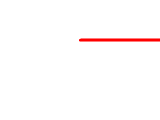]  .imgref[[wiki](https://en.wikipedia.org/wiki/Chaos_theory)]


???
  

* An animation of a double-rod pendulum at an intermediate energy showing chaotic behavior. Starting the pendulum from a slightly different initial condition would result in a vastly different trajectory. The double-rod pendulum is one of the simplest dynamical systems with chaotic solutions.


---
.header[Procedural Noise]

## Noise

--

 

>What to engineer for randomness in visual arts?


---
template: inverse

# Procedural Noise

---

## Procedural Noise

.center[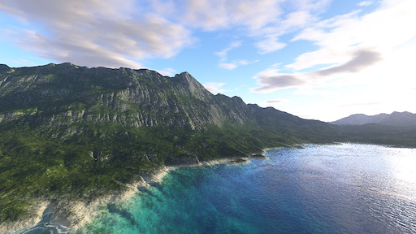]


???
  

* https://www.shadertoy.com/view/MdX3Rr
  

---

## Procedural Noise

Engineering of the *appearance of randomness*.

--
  
<br >

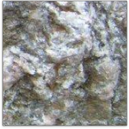 vs. 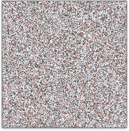 .imgref[[[scratchapixel]](https://www.scratchapixel.com/lessons/procedural-generation-virtual-worlds)]


???
  

*What are the differences?*  

--

> We want small variations locally and large variations globally!


---

## Procedural Noise

Engineering of the *appearance of randomness*.

.center[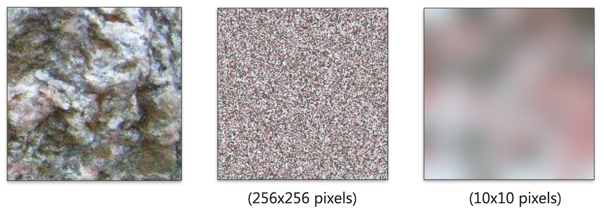]

???
  


---
.header[Procedural Noise]

## Requirements For Procedural Noise

???
  

For good noise functions there are overall the following requirements.

--

* Spatial correlation

???
  

* Minimal location shifts should not result in huge value differences, creating a smooth behavior. This means that local value changes are gradual, while global changes can be large.

--
*  No periodicity

???
  

* At least, we do not want to see it.

---
.header[Procedural Noise]

## Requirements For Procedural Noise

* Spatial correlation
* No periodicity

  

---
.header[Procedural Noise]

## Requirements For Procedural Noise

* Spatial correlation
* No periodicity
* A defined distribution

???
  

* We want some control over the function, e.g. how smooth it is.

--
* Reproducibility

???
  

* The noise should look the same every time we compute is, e.g. in every frame we render unless we explicitly want a change e.g. for an animation.

---
template:inverse

# Noise Function Designs

---

## Noise Function Designs

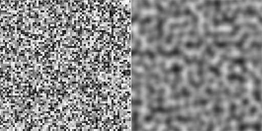 .imgref[[[scratchapixel]](https://www.scratchapixel.com/lessons/procedural-generation-virtual-worlds/procedural-patterns-noise-part-1/creating-simple-1D-noise)]

```
y = rng(x) 
```

vs. 

```
y = noise(x)
```

???
  

How could a naive implementation look like?

* https://graphtoy.com/?f1(x,t)=fract(sin(floor(x))%20*%209999)&v1=false&f2(x,t)=smoothstep(0,%201,%20fract(x))&v2=false&f3(x,t)=f1(x)%20*%20f2(x)&v3=false&f4(x,t)=f1(x%20-1)%20*%20(f2(x-1)%20*%20-1%20+%201)%20&v4=false&f5(x,t)=f3(x)%20+%20f4(x)&v5=true&f6(x,t)=&v6=false&grid=1&coords=6.192408033759523,-4.246031813029018,68.71509170736068

* https://www.shadertoy.com/view/4djSRW
* https://www.random.org/?__cf_chl_tk=AnrMdAxJ_TmMhTcof684OR_ZyfJcFT0EyMMUcH3j5jM-1713422854-0.0.1.1-1279
* https://en.wikipedia.org/wiki/Random_number_generation
* https://scholar.google.com/scholar?as_ylo=2025&q=random+number&hl=en&as_sdt=0,5


---
.header[Noise Function Designs]

## (Lattice) Value Noise

--

.left-even[
* A fixed grid (the *lattice*)
    * Relates the noise to space
    * Defines the basic scale
]
.right-even[
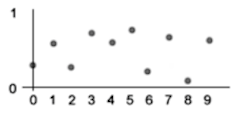
]

---
.header[Noise Function Designs]

## (Lattice) Value Noise

.left-even[
* A fixed grid (the *lattice*)
    * Relates the noise to space
    * Defines the basic scale
* A random number for each grid point
    * E.g. rng(x)
]
.right-even[

]

---
.header[Noise Function Designs]

## (Lattice) Value Noise

.left-even[
* Interpolate in-between
    * Again, many interpolation algorithms available
    * Ensures spatial correlation in-between
]
.right-even[
  
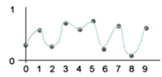
]


---
.header[Noise Function Designs]

## (Lattice) Value Noise

.center[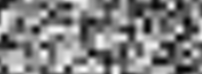.imgref[[[iquilezles]](http://www.iquilezles.org/)]]

---
.header[Noise Function Designs]

## Perlin Noise

.center[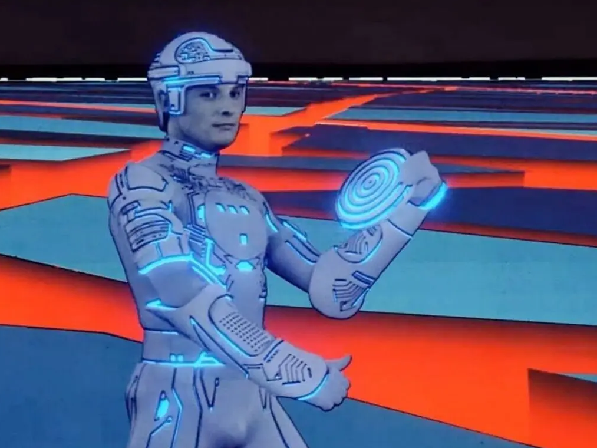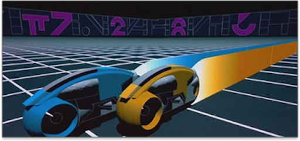]

.footnote[Ken Perlin. 1985. An image synthesizer. In Proceedings of the 12th annual conference on Computer graphics and interactive techniques (SIGGRAPH ’85). Association for Computing Machinery, New York, NY, USA, 287–296. DOI:https://doi.org/10.1145/325334.325247]


???
  

* Ken Perlin was commissioned to generate more realistic textures for the movie Tron in the early 1980s. He task was to break with the solid shaded look that have been used so far. The idea was to add to the solid colors a noise texture. For that he came up with an elegant noise algorithm, the *Perlin noise*. In 1997 he won the Academy Award for Technical Achievement from the Academy of Motion Picture Arts.

---
.header[Noise Function Designs]

## Perlin Noise

So what did Perlin invent?

---
.header[Noise Function Designs]

## Perlin Noise

.left-even[
Instead of values, Perlin uses random normalized *gradients* on a grid for each sample point. 
]

--

.right-even[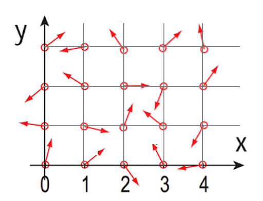  
.imgref[[[Stefan Gustavson]](https://muugumuugu.github.io/bOOkshelF/generative%20art/simplexnoise.pdf)]]
  


???
  

* To get uneven frequency changes under control, we can define random normalized gradients, meaning random vectors, on a grid for each sample point instead of simply using values. 
* The dot product tells you what amount of one vector goes in the direction of another / The dot product 𝑎⃗ ⋅𝑏⃗  is related to the angle 𝜃 between 𝑎⃗  and 𝑏⃗  


---
.header[Noise Function Designs]

## (Lattice) Gradient Noise

> Perlin noise reduces uneven frequency changes!

--

.center[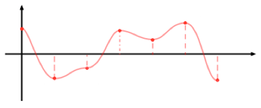.imgref[[[scratchapixel]](https://www.scratchapixel.com/lessons/procedural-generation-virtual-worlds/perlin-noise-part-2)]]

---
.header[Noise Function Designs]

## (Lattice) Gradient Noise

> Perlin noise reduces uneven frequency changes!

.center[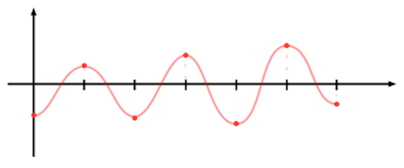.imgref[[[scratchapixel]](https://www.scratchapixel.com/lessons/procedural-generation-virtual-worlds/perlin-noise-part-2)]]


???
  

* The benefit of perlin noise is the overall distribution of frequencies. Since value noise uses simple values that are interpolated, there is a higher chance, that a row of several values only differs a little. The consequence is, that some regions of your picture may contain little changes and some regions a lot of changes.

By using gradients you are reducing this effect because the interpolation is not done by value but instead calculated between tangents. Now it's more difficult to have a flat curve (both tangents must be collinear).

*  In the case of value noise, we generate random values at integer positions along the "line" and interpolate these values between these integer positions (as shown in Figures 5 and 6). Though note that we choose these values randomly, several successive values may be very similar (as illustrated in Figure 6). This is not great because some parts of the noise will vary quickly (when consecutive values are very different from each other), and some parts will change slowly (when successive values along the x-axis are similar: for example, have the same sign). Parts of the noise function where values change slowly are said to have a low frequency compared to parts of the noise where the values change quickly, which are said to have a higher frequency. This generally means that value noise (when you check the frequencies the noise is made of) is composed of high and low frequencies. A good noise is a noise that looks random and changes smoothly locally but also generally presents a pretty homogeneous look. In other words, the features the noise is made of should generally have a similar size (a similar frequency). 
*  https://www.scratchapixel.com/lessons/procedural-generation-virtual-worlds/perlin-noise-part-2/perlin-noise.html
*  

---
.header[Noise Function Designs]

## (Lattice) Gradient Noise

* Define random normalized gradients, meaning random vectors, on a grid 
* Interpolate a smooth function between those vectors

.center[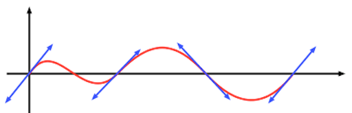 .imgref[[[scratchapixel]](https://www.scratchapixel.com/lessons/procedural-generation-virtual-worlds/perlin-noise-part-2)]]


???
  

* The Perlin noise technique is very similar to the value noise algorithm though rather than selecting random values at integer positions along the line, we choose "gradients". Gradients can be seen as "tangents" to the 1D noise function at the lattice points. As you can see in Figures 7 and 8, it doesn't matter in which direction the gradient points because if **it causes the curve to go up on one side of the lattice point** (say on the right of a lattice point as shown in Figure 8), **it causes the curve to go down on the other side of that same point **(say on the left of that point). In the worse case, if two successive lattice points have gradients that aim at radically opposite directions (one points up and the other points down), then the noise function will have an "S" like shape between the two points (as shown in Figure 8a). In the other case, the curve will either go up or down (Figure 8b and 8c). **But one can easily see that because of this construction, all features have more or less the same size**. **It's either a bump or a dent or an "S" like shape between two consecutive lattice points.** As a result, **the distribution of frequencies in the Perlin noise is more regular** than the value noise's frequency spectrum (in particular, it removes the low frequencies you can find in the latter). As Perlin notes in his paper:

    The above texture has a band-limited character; there is no detail outside a certain size range.

This is an important property, especially when it comes to filtering the function (check the lesson on filtering).


---
.header[Noise Function Designs | (Lattice) Gradient Noise]

## Worst Case

* The first gradient points up and the successive one points down
* Then the noise function will have a "S" like shape between the two points


.center[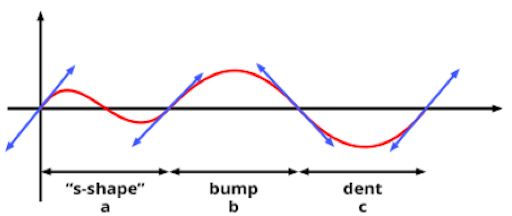 .imgref[[[scratchapixel]](https://www.scratchapixel.com/lessons/procedural-generation-virtual-worlds/perlin-noise-part-2)]]

???
  

* The worst case in regard to a uneven frequency distribution happens when two successive lattice points have gradients that aim at opposite directions (one points up and the other points down). Then the noise function will have a "S" like shape between the two points.

* This causes the curve to go up on one side of the lattice point and down on the other side of that same point such as


---
.header[Noise Function Designs]

## (Lattice) Gradient Noise

Through the use of random vectors, the distribution of frequencies in the Perlin noise is more regular than the value noise's frequency spectrum.

--

.center[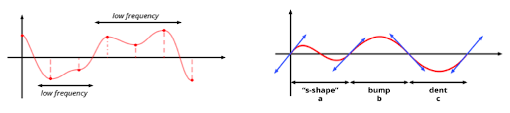.imgref[[[scratchapixel]](https://www.scratchapixel.com/lessons/procedural-generation-virtual-worlds/perlin-noise-part-2)]]

---
.header[Noise Function Designs]

## (Lattice) Gradient Noise

.center[.imgref[[[scratchapixel]](https://www.scratchapixel.com/lessons/procedural-generation-virtual-worlds/perlin-noise-part-2)]]

>  The texture has a band-limited character; there is no detail outside a certain size range.


---
.header[Noise Function Designs]

## (Lattice) Gradient Noise

.center[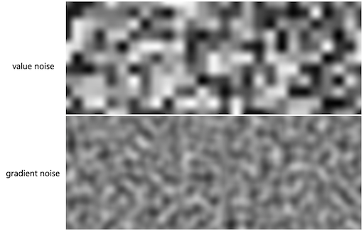.imgref[[[scratchapixel]](https://www.scratchapixel.com/lessons/procedural-generation-virtual-worlds/perlin-noise-part-2)]]


---
.header[Noise Function Designs]

##  Simplex Noise

Perlin was still not satisfied with his gradient noise and presented 2001 the *simplex noise*.  

---
.header[Noise Function Designs]

##  Simplex Noise

* Use a triangular tiling instead of a grid tiling

--


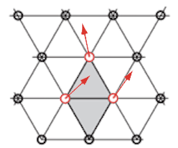

.imgref[[[Stefan Gustavson]](https://muugumuugu.github.io/bOOkshelF/generative%20art/simplexnoise.pdf)]


???
  

* Perlin correctly argues that a square has more corners than necessary. The simplest and most compact shape that can be repeated to fill a space is an equilateral triangle. For more details about the simplex noise, please refer to [this detailed explanation](https://muugumuugu.github.io/bOOkshelF/generative%20art/simplexnoise.pdf).
* OpenSimplex Noise (Kurt Spencer, 2011), Designed as a patent-free alternative to Simplex Noise.

---
.header[Noise Function Designs | Perlin Noise]

.center[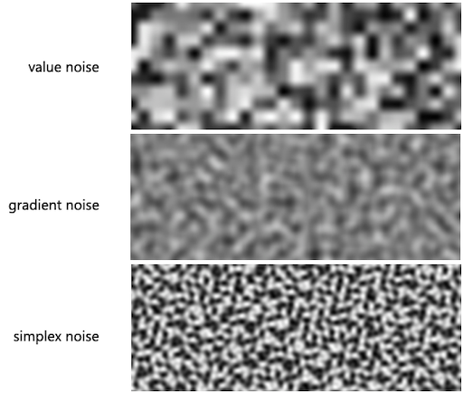.imgref[[[iquilezles]](http://www.iquilezles.org/)]]

---
.header[Noise Function Designs | Perlin Noise]

.center[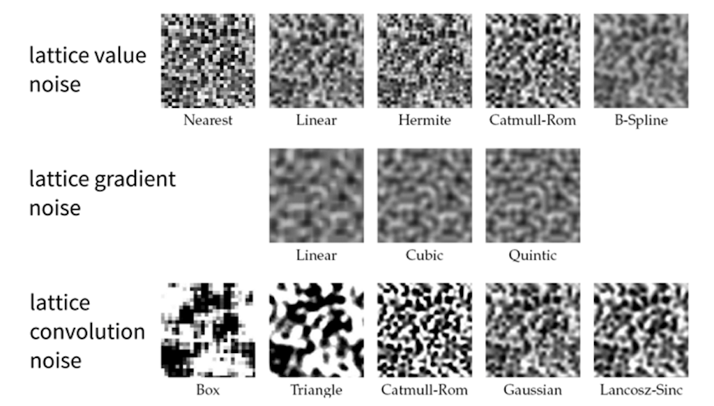]


???
* Convolution noise: For any input coordinate x, noise is calculated as the sum of kernel contributions from nearby lattice points.
    * Convolution is a mathematical operation that blends two functions. In graphics, we usually use it to apply a filter (kernel) to a signal (image, texture, sound, etc.).
    * A kernel is the function or array of weights used during convolution. It defines the shape, frequency, or orientation of the effect.


---
.header[Noise Function Designs]


## `noise()`

In almost all environments you have pre-defined noise functions such as 

```glsl
// 1D
noise(x); 

//2D
noise(x, y);

//3D
noise(x, y, z);
```

--

* Investigate based on which algorithm
* If not suitable, define your own noise function


???

For full control over your results, check which algorithm the `noise()` function is based and whether the noise creates the distribution you want. If not you can always go back to defining your own noise function. 


---
## Using Noise Functions

Noise functions are usually used as

```glsl
value = amplitude * noise(frequency * x + offset);
```

.center[  
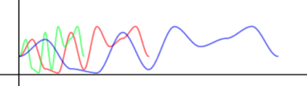]


???
  


## Amplitude

The amplitude controls the maximum absolute value that a specific noise function can output.  

For example, for a 1D `y = noise(x)` this would mean the range the noise can spread in `y`:


## Frequency

The frequency parameter can be understood as the density of the noise, or its *bumpiness*.


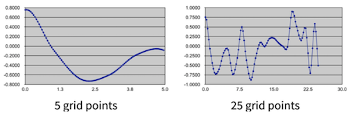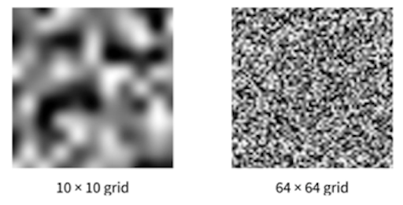


## Offset

The offset selects different locations of the noise function. Hence, the offset enables you to use the same noise function multiple times, each version looking differently.

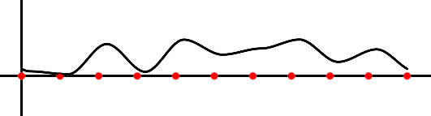


---
template:inverse

# Component Frequencies

---
## Component Frequencies

.center[.imgref[[[thebookofshaders]](https://thebookofshaders.com/11/)]]


???
  

* In the above example we can observe well that organic patterns have *multiple levels* of detail with self-similar structures.

---
## Component Frequencies

.center[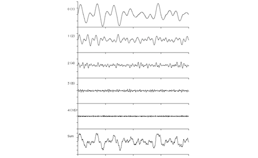]

To represent this, we can sum up multiple noise functions (so-called *octaves*) at different frequencies and amplitudes.

???
  

* The represent this, we remember the insights we gained from Fourier transformations and that any function, or signal, can be decomposed into simple component signals at different frequencies.

---
## Component Frequencies

.center[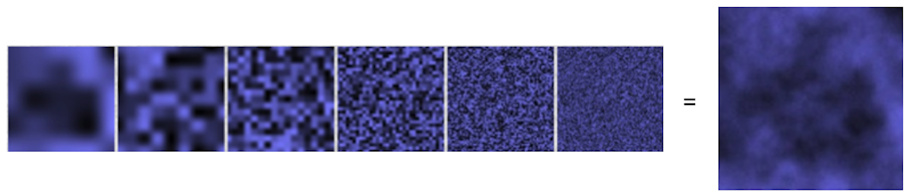 .imgref[[[hugo.elias]](https://web.archive.org/web/20150316212611/http://freespace.virgin.net/hugo.elias/models/m_perlin.htm)]]

--

* Define a relationship between frequency, amplitude and octaves

???
There are several techniques for computing such multi-level noises and all follow the same principle of **defining a relationship between frequency, amplitude and successive octaves**.

--

* Ususally, for each level *increase the frequency* and *decrease the amplitude*

---
## Component Frequencies

.center[ .imgref[[[hugo.elias]](https://web.archive.org/web/20150316212611/http://freespace.virgin.net/hugo.elias/models/m_perlin.htm)]]

* Turbulent noise
* Fractal Brownian Motion (fBM)
* Fractal Noise
* Multi-Octave Noise


---
.header[Component Frequencies]

## Perlin’s Turbulence Noise


--
  
Levels to add are:

 

---
.header[Component Frequencies]

## Perlin’s Turbulence Noise


???
  

* *On a side note:* Turbulent noise is often considered as Perlin noise. This is not true. Perlin’s main contribution is the noise function itself. He used in his paper a specific turbulent noise setup as an example application for his noise function. But the internet doesn't understand this.


---
.header[Component Frequencies]

## Naive Implementation

```c#
const int octaves = 6;
float amplitude = 2;
float frequency = 2;

// Loop of octaves
for (int k = 1; k <= octaves; k++) {

    amplitude = pow(2, -k);
    frequency = pow(2, k);

    y += amplitude * noise(frequency*x);
}
```

---
.header[Component Frequencies | Naive Implementation II]

```c#
// Properties
const int octaves = 6;
float lacunarity = 2.0;
float gain = 0.5;

// Initial values
float amplitude = 0.5;
float frequency = 1.;

// Loop of octaves
for (int i = 0; i < octaves; i++) {

    y += amplitude * noise(frequency*x);

    frequency *= lacunarity;
    amplitude *= gain;
}
```

.footnote[[thebookofshaders](https://thebookofshaders.com/13/)]


???
  

* https://www.shadertoy.com/view/4dS3Wd

---
.header[Component Frequencies]

## Fractal Brownian Noise

  
.imgref[[[Warping by Iq]](https://www.shadertoy.com/view/4s23zz)]


???
  

* https://iquilezles.org/articles/fbm/
* https://iquilezles.org/articles/morenoise/
* For example, Inigo Quiles applied fbm noise to wrap the space of a fbm noise again with the following results:
* If you want to understand this better, Inigo also wrote [an article](https://www.iquilezles.org/www/articles/warp/warp.htm) about it.


---
.header[Component Frequencies]

## Noise Terminology


.left-even[
* Amplitutude & Frequency
* Octaves
* Persistence / Gain
* Lacunarity
* Point spacing
]

--

.right-even[
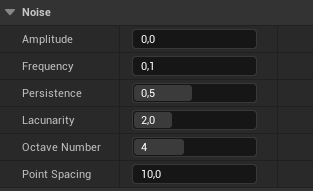 

]

---
.header[Component Frequencies]

## Noise Terminology


.left-even[
* Amplitutude & Frequency
* Octaves: *Number of layers to be added*
* Persistence / Gain: *Factor to scale the amplitude each octave*
* Lacunarity: *Factor to scale the frequency each octave*
* Point spacing: *Size of the lattice*
]
.right-even[
 

]


???
  

 * Amplitutude: "Size" of waves
* Frequency: Period of noise / "repetition" of waves


---
template:inverse

# Other Types of Noise


---
## Worley Noise

--

Steven Worley. 1996. A cellular texture basis function. In Proceedings of the 23rd annual conference on Computer graphics and interactive techniques (SIGGRAPH '96). ACM, New York, NY, USA, 291-294.

.center[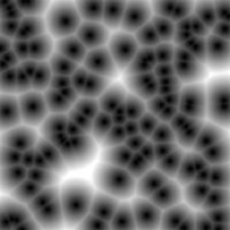 .imgref[[[wiki]](https://en.wikipedia.org/wiki/Worley_noise)]]


???
  

* Worley noise is based on a distance field, for which you compute for each pixel the distance to a set of points. Then, we take the closest distance to all points found and use that as color information, e.g. black and white.
* This set of points are often randomly distributed feature points. 

---
## Worley Noise


.center[]

???
  

* Worley noise is based on a distance field, for which you compute for each pixel the distance to a set of points. Then, we take the closest distance to all points found and use that as color information, e.g. black and white.
* This set of points are often randomly distributed feature points. 

---
## Worley Noise


.center[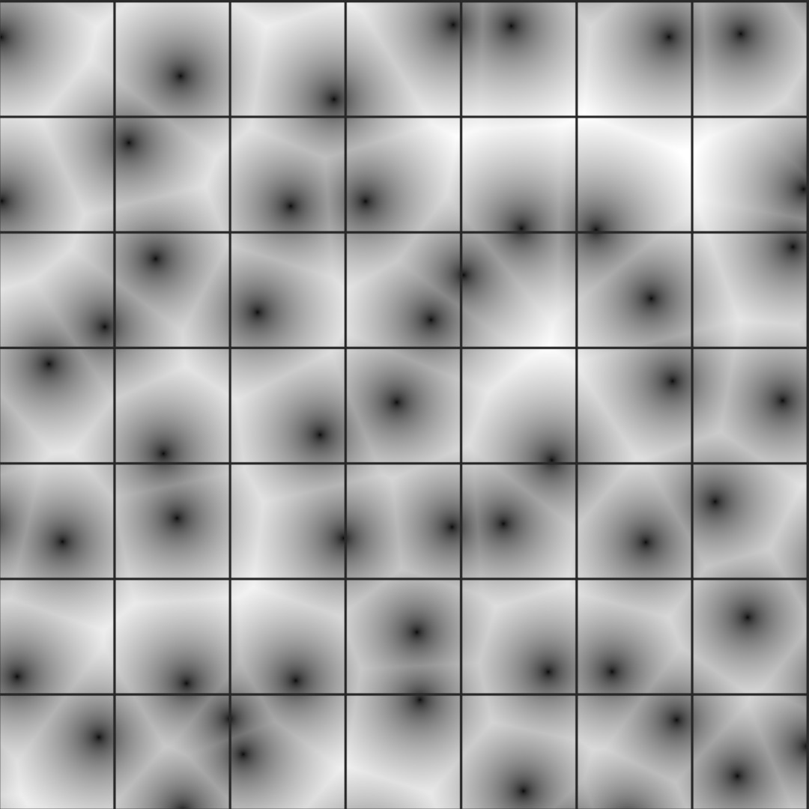 .imgref[[[wiki]](https://en.wikipedia.org/wiki/Worley_noise)]]


???
  
* Not every pixel needs to check the distance to every single point. 
* Also, to avoid aberrations at the edges between cells we need to check for the distances to the points on the neighboring cells. That's the main brillant idea of Steven Worley's paper. At the end, each pixel needs to check only nine positions: their own cell's point and the points in the 8 cells around 


* Recapping: we subdivide the space into tiles; each pixel will calculate the distance to the point in their own tile and the surrounding 8 tiles; store the closest distance. The result is a distance field that looks like the following example:
* https://iquilezles.org/articles/smoothvoronoi/

---
## Worley Noise


.center[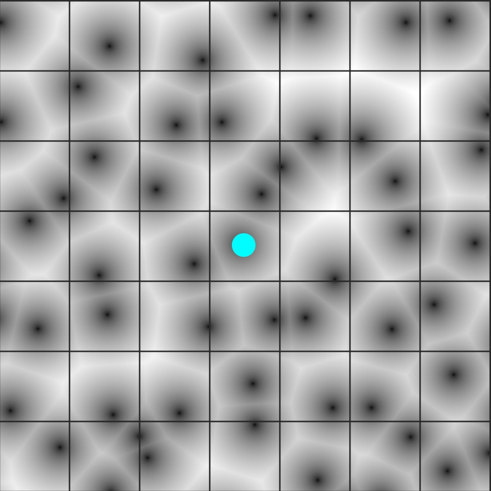 .imgref[[[wiki]](https://en.wikipedia.org/wiki/Worley_noise)]]


???
  
* Not every pixel needs to check the distance to every single point. 
* Also, to avoid aberrations at the edges between cells we need to check for the distances to the points on the neighboring cells. That's the main brillant idea of Steven Worley's paper. At the end, each pixel needs to check only nine positions: their own cell's point and the points in the 8 cells around 


* Recapping: we subdivide the space into tiles; each pixel will calculate the distance to the point in their own tile and the surrounding 8 tiles; store the closest distance. The result is a distance field that looks like the following example:
* https://iquilezles.org/articles/smoothvoronoi/

---
## Worley Noise


.center[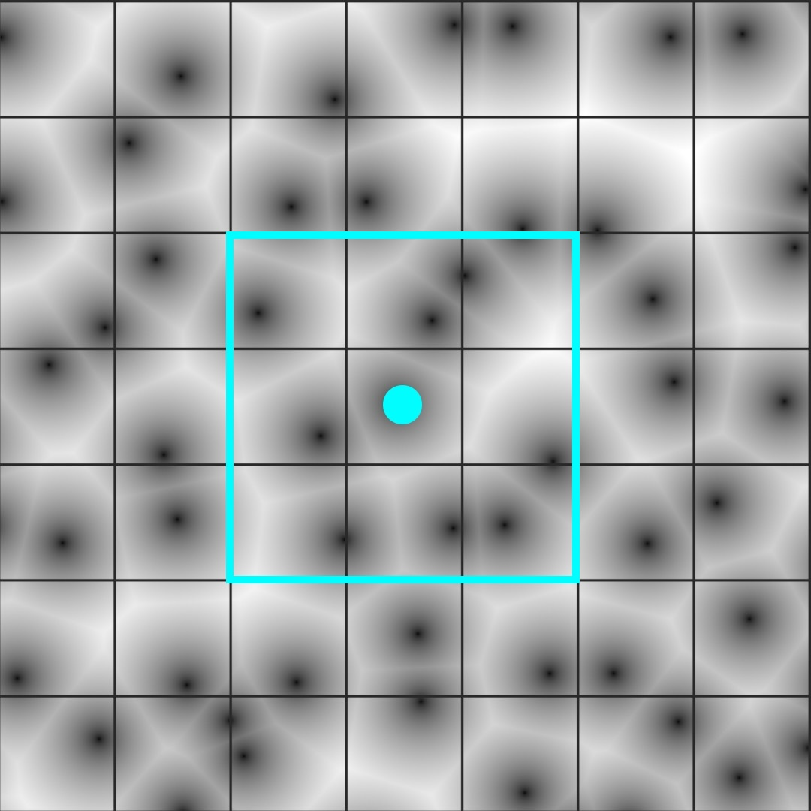 .imgref[[[wiki]](https://en.wikipedia.org/wiki/Worley_noise)]]


???
  
* Not every pixel needs to check the distance to every single point. 
* Also, to avoid aberrations at the edges between cells we need to check for the distances to the points on the neighboring cells. That's the main brillant idea of Steven Worley's paper. At the end, each pixel needs to check only nine positions: their own cell's point and the points in the 8 cells around 


* Recapping: we subdivide the space into tiles; each pixel will calculate the distance to the point in their own tile and the surrounding 8 tiles; store the closest distance. The result is a distance field that looks like the following example:
* https://iquilezles.org/articles/smoothvoronoi/


---
## Worley Noise


.center[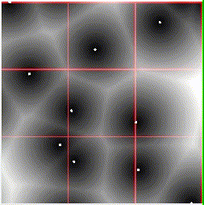 .imgref[[[thebookofshaders]](https://thebookofshaders.com/12/)]
]


???
  
* Not every pixel needs to check the distance to every single point. 
* Also, to avoid aberrations at the edges between cells we need to check for the distances to the points on the neighboring cells. That's the main brillant idea of Steven Worley's paper. At the end, each pixel needs to check only nine positions: their own cell's point and the points in the 8 cells around 


* Recapping: we subdivide the space into tiles; each pixel will calculate the distance to the point in their own tile and the surrounding 8 tiles; store the closest distance. The result is a distance field that looks like the following example:
* https://iquilezles.org/articles/smoothvoronoi/


---
## Worley Noise

.center[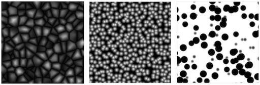]  
.imgref[[[thebookofshaders]](https://thebookofshaders.com/12/)]


---
## Voronoi Diagram

--

.left-even[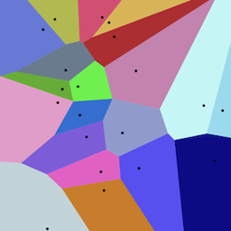  
.imgref[[[wiki]](https://en.wikipedia.org/wiki/Voronoi_diagram#/media/File:Euclidean_Voronoi_diagram.svg)]]


???
  

* A Voronoi diagram is a slight variation from the Worley noise in the sense that is doesn't save the closest distance for each pixel to a feature point, but it saves for each pixel the feature point itself, e.g. by assigning the color of the closest point, disregarding the actual distance. 

--

.right-even[
* Partitioning of a plane into *n* convex polygons (*cells*).
]


???
  

* A Voronoi diagram has the following characteristics:

---
## Voronoi Diagram


.left-even[  
.imgref[[[wiki]](https://en.wikipedia.org/wiki/Voronoi_diagram#/media/File:Euclidean_Voronoi_diagram.svg)]]


.right-even[
* Partitioning of a plane into *n* convex polygons (*cells*).
* Each point in a cell is closer to the cell’s generating point than any of the other *n* possible generating points.
]


???
  

* A Voronoi diagram has the following characteristics:

---
## Voronoi Diagram


.left-even[  
.imgref[[[wiki]](https://en.wikipedia.org/wiki/Voronoi_diagram#/media/File:Euclidean_Voronoi_diagram.svg)]]


.right-even[
* Partitioning of a plane into *n* convex polygons (*cells*).
* Each point in a cell is closer to the cell’s generating point than any of the other *n* possible generating points.
* Line segments are equidistant to two generating points; Nodes (corners) equidistant to three (or more) generating points.
]


???
  

* A Voronoi diagram has the following characteristics:
* https://www.shadertoy.com/view/ldB3zc

---
## Voronoi Diagram

.left-even[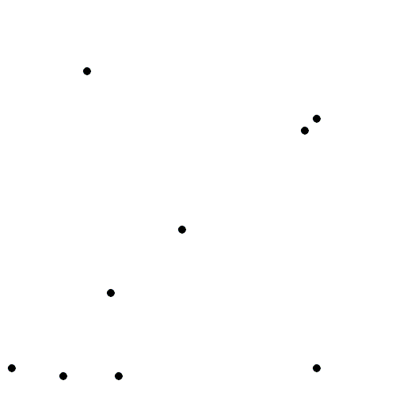.imgref[[[wiki]](https://de.wikipedia.org/wiki/Datei:Voronoi_growth_euclidean.gif)]]

???
  

* You could also understand the algorithm from the perspective of the points (not the pixels). This would mean that each point grows its area until it finds the growing area from another point. This mirrors some of the growth rules in nature.  

--

.right-even[
Living forms: tension between an inner force to expand and grow, and limitations by outside forces.]


???
* Living forms are shaped by this tension between an inner force to expand and grow, and limitations by outside forces.


---
.center[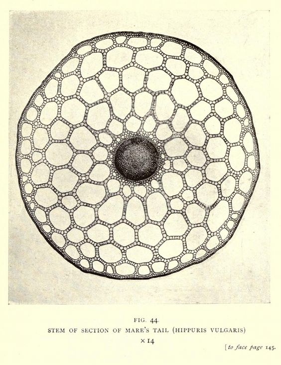]  

---
.center[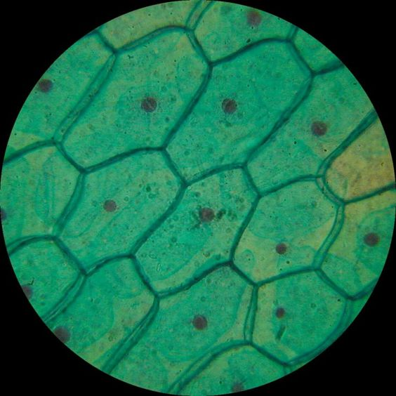]  

---
.center[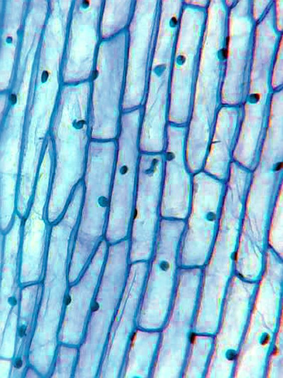]  

---
.center[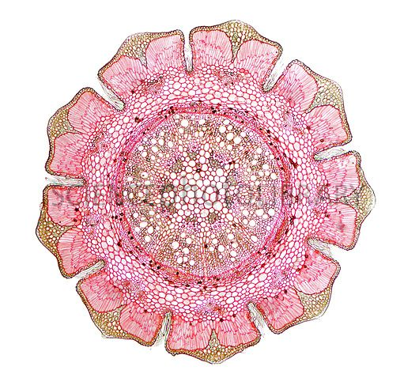]  

---
.center[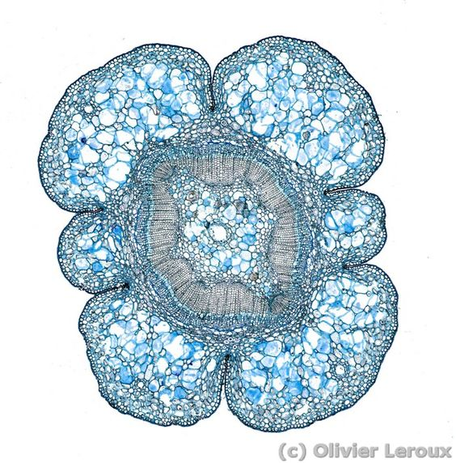]  

---
.center[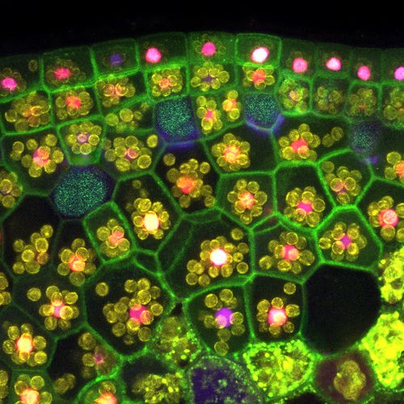]  

---
.center[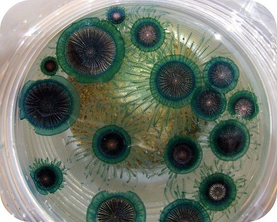]  

---
.center[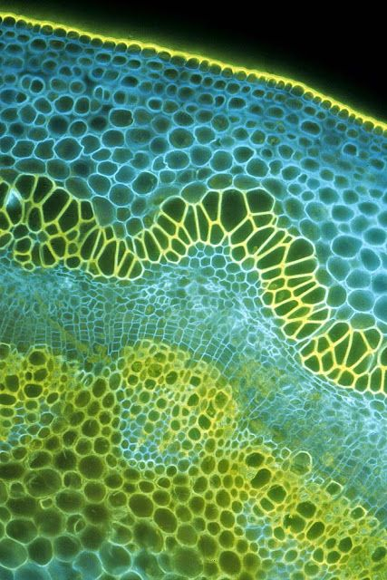]  

---
.center[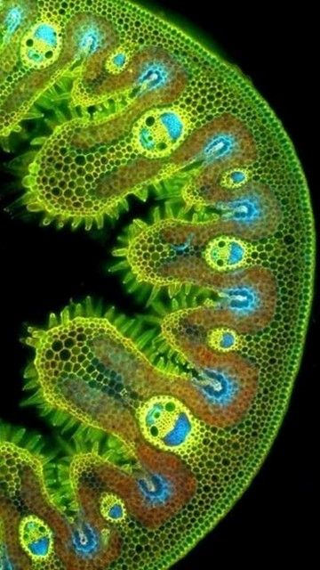]  


???
  

* https://www.pinterest.de/aaziah/pattern/


---
## Voronoi Algorithm

.left-even[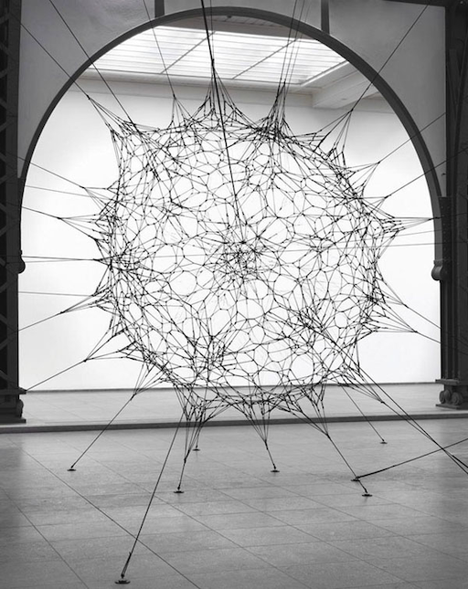  
.imgref[[[thebookofshaders]](https://thebookofshaders.com/12/)]] *Cloud Cities - Tomás Saraceno (2011)*

---
## Voronoi Algorithm

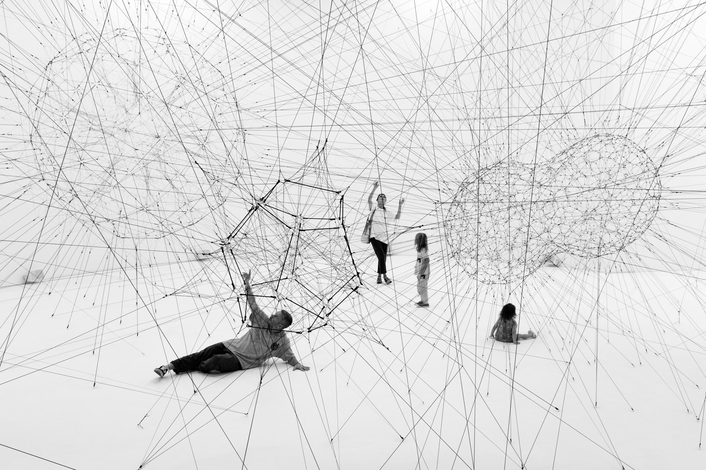  
 *Algo-r(h)i(y)thms  - Tomás Saraceno (2018)*


---
## Voronoi Algorithm

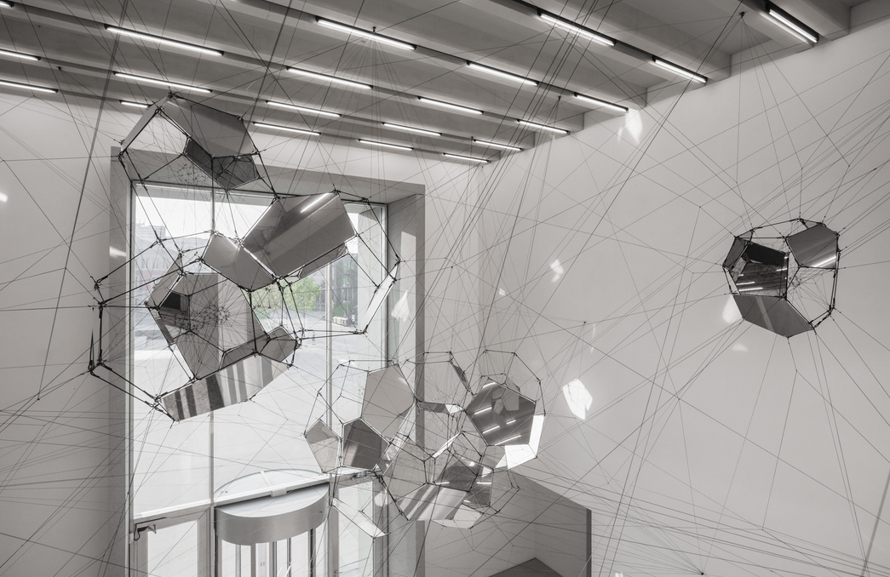  
 *Sundial for Spatial Echoes - [Tomás Saraceno](https://studiotomassaraceno.org/artwork/) (2019)*


---
## Voronoi Algorithm

.left-even[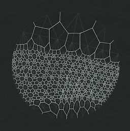  
.imgref[[[thebookofshaders]](https://thebookofshaders.com/12/)]]  [*Accretion Disc Series - Clint Fulkerson*](https://www.clintfulkerson.com/Accretion-Disc-Series)

---
## Voronoi Algorithm

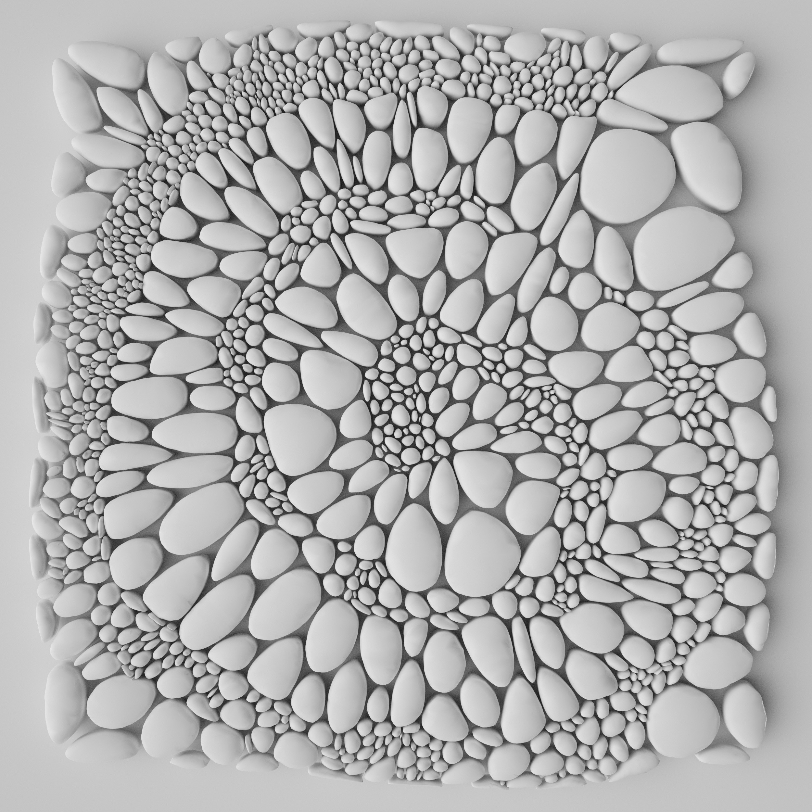    

---
## Voronoi Algorithm

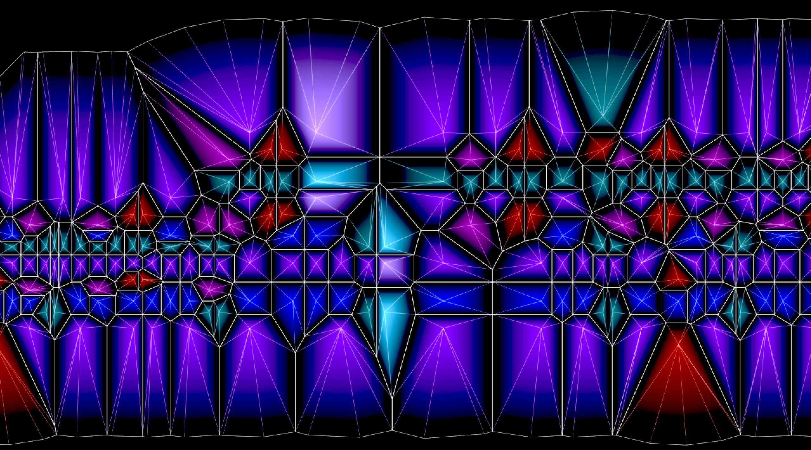  
.imgref[[[musanim]](http://www.musanim.com/Voronoi/)]


---
.header[Voronoi Algorithm]

## Distances

We are free to define any kind of distance. So far we have used the most common one, the *Euclidian distance*.


???
  

* Euclidean distance, Manhattan distance and Chebyshev distance are all distance metrics which compute a number based on two data points. All the three metrics are useful in various use cases and differ in some important aspects which we bring out in this article. 

---
.header[Voronoi Algorithm]

## Distances

.center[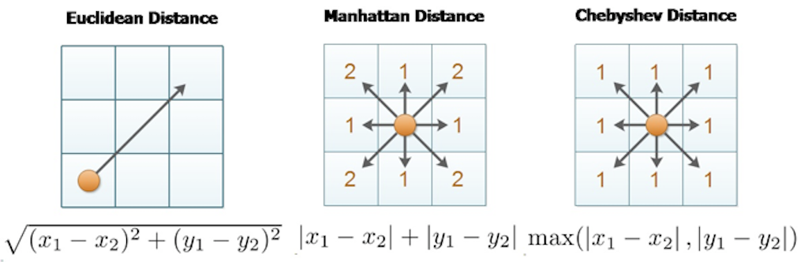
.imgref[[[wiki]](https://en.wikipedia.org/wiki/Taxicab_geometry)]]


???
  

* Different distance might look as

---
.header[Voronoi Algorithm | Distances]

.center[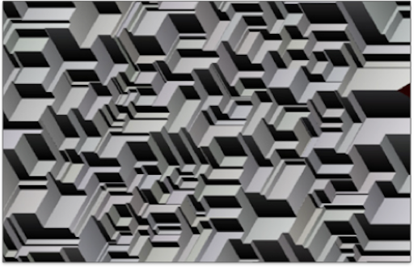].imgref[[[iquilezles]](http://iquilezles.org/www/articles/cellularffx/cellularffx.htm)]


---

## Curl Noise


.center[
.imgref[[[Richard Bourne]](https://openprocessing.org/sketch/1601829)]]


---

## Curl Noise


.center[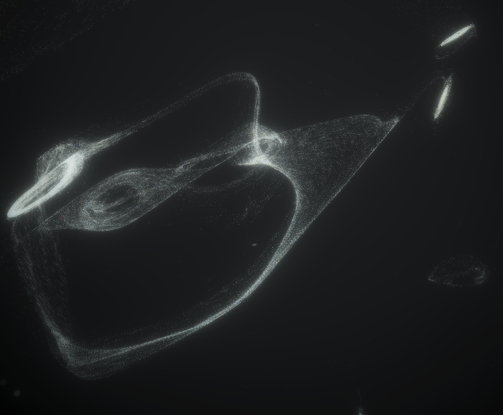]


.footnote[[Unity Graphics Programming vol.1, [freder.github](https://freder.github.io/UnityGraphicsProgrammingBook1/html-translated/vol2/Chapter%206%20_%20Curl%20Noise-Explanation%20of%20Noise%20Algorithms%20for%20Pseudo-Fluids.html)]]


---

## Curl Noise


.center[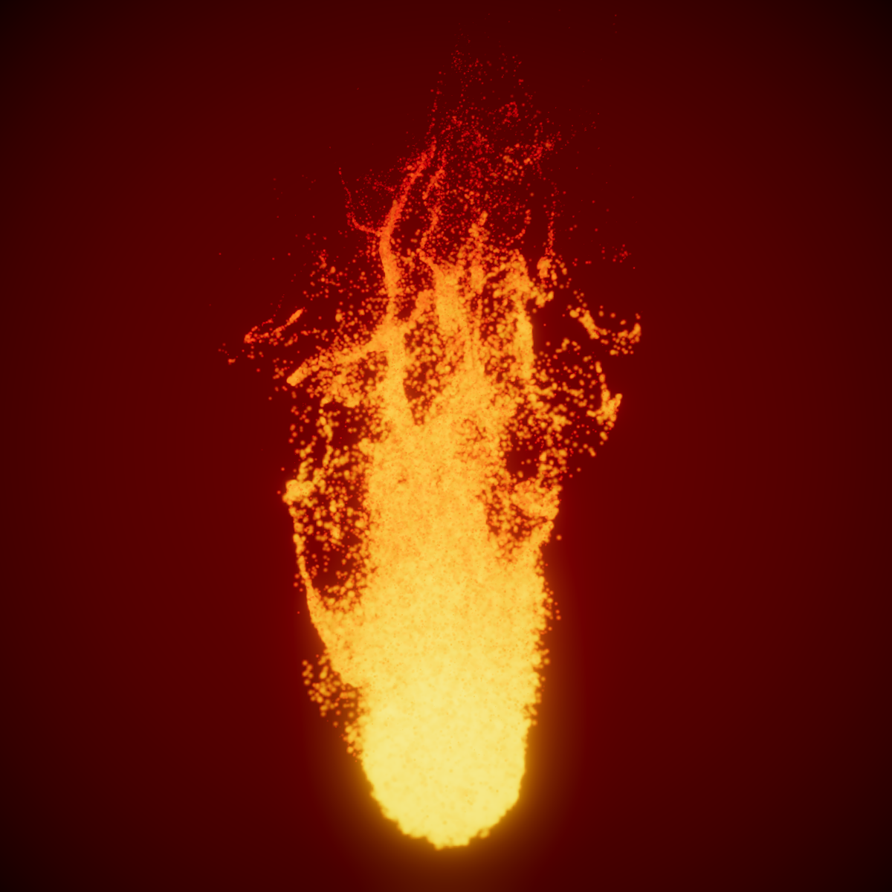]


.footnote[[Unity Graphics Programming vol.1, [freder.github](https://freder.github.io/UnityGraphicsProgrammingBook1/html-translated/vol2/Chapter%206%20_%20Curl%20Noise-Explanation%20of%20Noise%20Algorithms%20for%20Pseudo-Fluids.html)]]


---

## Curl Noise


A pseudo-fluid noise algorithm:

.center[]

.footnote[[Unity Graphics Programming vol.1, [freder.github](https://freder.github.io/UnityGraphicsProgrammingBook1/html-translated/vol2/Chapter%206%20_%20Curl%20Noise-Explanation%20of%20Noise%20Algorithms%20for%20Pseudo-Fluids.html)]]


---
template:inverse

# Using Noise

---
## Using Noise

Usually the different software packages and environments offer various noise functions.

---
.header[Using Noise | Houdini]

.center[
.imgref[[[sidefx]](https://vimeo.com/75313908)]]


???
  

* https://www.shadertoy.com/view/3dVXDc
* https://www.shadertoy.com/view/4sfGzS
* https://www.shadertoy.com/view/wtXXD2
  
Unreal > 5
* Material Editor: Value Noise
* Niagara
    * NoiseField
    * Vector Noise (Perlin-like)
    * Curl Noise
* https://www.fab.com/search?q=Noise&asset_formats=unreal-engine&min_unreal_engine_version=UE_5.0&max_unreal_engine_version=UE_5.5
  


---
.header[Using Noise]

## Texture Packs

.center[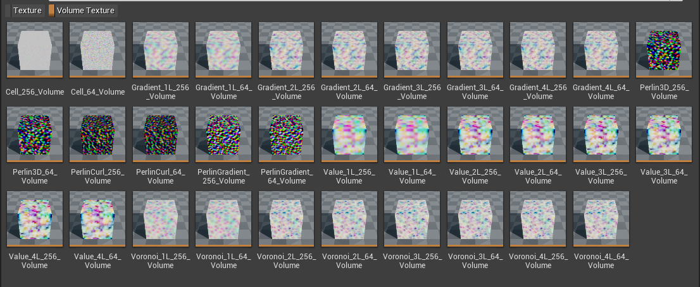
.imgref[[[polycount]](https://polycount.com/discussion/220333/80-pre-baked-3d-noise-volume-textures-for-unreal-engine-4-25)]]


???


---
## Using Noise

--

For textures and materials, we map the output of a noise function to color, gradients and such.

.center[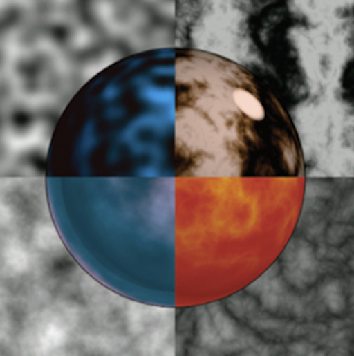  
.imgref[[[thebookofshaders]](https://thebookofshaders.com/11/)]]


---
.header[Using Noise]

## Height Maps

--

With height fields, we use for example, a noise function value as a displacement along normals to make terrain.

.center[  
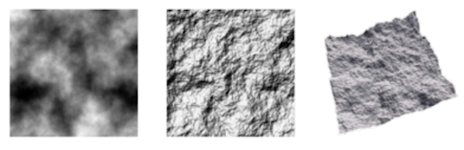]


???
  

* Bump map vs. displacement map?


---
.header[Using Noise | Height Maps]

## Bump vs. Displacement Maps?

--
* Bump maps (also called normal maps) do not change the geometry but only the normal

--

* Displacement maps alter the geometry at render time

---
.header[Using Noise | Height Maps]

## Bump vs. Displacement Maps?

.center[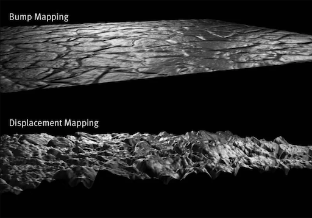  
.imgref[[[photigy]](https://www.photigy.com/school/bump-mapping-vs-displacement-mapping/)]]


???
  

* Working with a displacement map will add actual new geometry based on the provided displacement map at render time. For this, the renderer subdivides the existing geometry and moves it according to the noise values.

When working with a normal or bump map (different names for the same thing), only the appearance of additional surface detail is created by changing the surface's normals at render time, without actually creating additional geometry. This approach is much faster and use less memory.


---
.header[Using Noise]

## Height Maps

In Unreal you can also build landscapes with the help of heigh maps.

.center[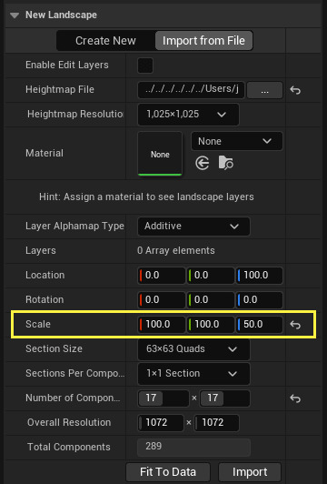  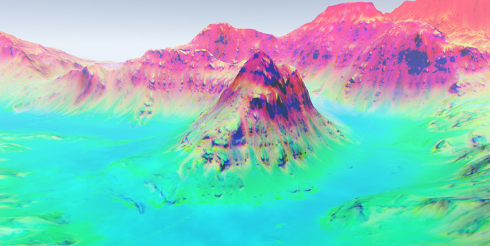 .imgref[[[docs.unrealengine]](https://docs.unrealengine.com/5.2/en-US/landscape-technical-guide-in-unreal-engine/)]]


???
  

* https://dev.epicgames.com/documentation/en-us/unreal-engine/landscape-noise-tool-in-unreal-engine?application_version=5.5
* https://www.unrealengine.com/marketplace/en-US/product/heightmap-collection?sessionInvalidated=true

---

.center[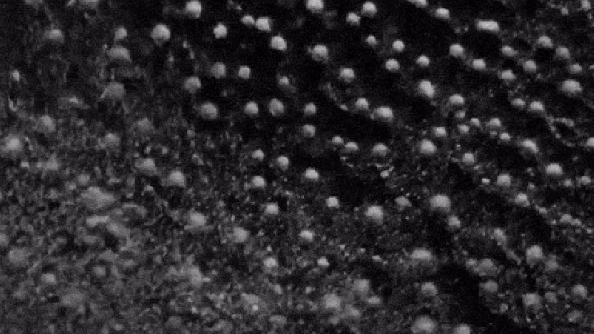
.imgref[[[vimeo]](https://vimeo.com/74130357?embedded=true&source=vimeo_logo&owner=4665192)]]

???
  

* https://www.fubiz.net/2013/09/14/cymatics/
* https://www.susisie.de/
* https://www.gizmodo.com.au/2013/09/this-unreal-video-captures-the-dance-of-sound-waves-through-powder/
* This video looks absolutely computer-generated, as though it were made by some super-advanced particle engine. But this is actual, real-world video footage, showing a fine power called Lycopodium reacting to vibrations from speakers placed directly below it. Amazing! 
* Cymatics was produced and directed by German artist Susi Sie, who tapped CypherAudio for the music. The video’s title refers to the act of making objects or materials vibrate with sound. In this case, the material is lycopodium powder, which is usually used for pyrotechnics. But thanks to its unique properties that cause it to clump and re-clump when subject to vibration, it also forms the mesmerizing patterns in Sie’s video.


---
template:inverse

### The End

# 👋🏻
