name: inverse
layout: true
class: center, middle, inverse
---

# Procedural Generation and Simulation

#### - Dynamics -

 

### Prof. Dr. Lena Gieseke | l.gieseke@filmuniversitaet.de  

#### Film University Babelsberg KONRAD WOLF

---
layout: false

## Dynamic Systems

.center[]

---
## Dynamic Systems

.center[]

???

.center[]
Todo: gif

---
template: inverse

# Animation

---
layout: false

## Animation

--

> Technically, animation is the depiction of spatially and temporally varying structures and behavior. 

--

Latin roots are

--

* *Animation* from *animatus*, the past participle of *animare*, meaning *to give life to*

--
* *Animare* from *anima*, meaning *breath* or *soul*

???
  

*Animation* comes from the Latin *animatus*, the past participle of *animare*, meaning *to give life to*. *Animare* comes from the Latin word *anima*, meaning *breath* or *soul*. From *anima* comes, among other words, also *animal* for example. A characteristic of animals is their ability to move. When a cartoon is drawn and filmed in such a way that lifelike movement is produced, it is animated. An animated film seems to have a life of its own.
* For visual properties, animation can be understood as the depiction of spatially and temporally varying structures and behavior. You can animate the position of an object, its form and Gestalt and also its environment with e.g. animating lights and cameras.

---

## Animation

.left-even[[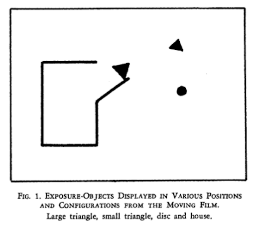](https://www.youtube.com/watch?v=VTNmLt7QX8E)  
.imgref[[[Heider and Simmel]](https://doi.org/10.2307%2F1416950)]]

???
  

* https://www.youtube.com/watch?v=VTNmLt7QX8E

--
.right-even[
> Movement is one of, if not the most crucial aspect, for humans to assign liveness to objects!
]

???
  

* explores with which sentiments the animation of simple geometric objects is perceived.
* Which story does unfold here?

---
.header[Animation]

## How To Animate?

???
  

* what are the two main principles to animate objects?

--
* Keyframes

???
  

* You can define an animation explicitly, meaning you tell each object precisely where to go. 

--
* Kinematic solver

???
  

* Direct / Inverse kinematic? *geometry of motion*
    * A kinematics problem begins by describing the geometry of the system and declaring all initial conditions of any known values within the system such as of the position. Then, any unknown parts of the system, such as the position in the next frame can be derived from the geometry of the system.
    * Path animation
    * There are two types of indirect kinematic animation, namely *forward kinematics* and *inverse kinematics*.
--
* Dynamic solver

???
  

* This constitutes a *physically motivated animation* and implements how *forces* act on masses.
* As part of a dynamic system, objects can have influencing properties such as a mass or agency, but overall they do not know where to go next but mainly react to their environment.

--

A solver analyzes and predicts behavior...

---
template:inverse

#  Keyframe Animation

---
.header[Animation]

##  Keyframe Animation

A keyframe in traditional animation is a drawing that defines the starting and ending points of any smooth transition.  

--

 

A sequence of keyframes defines an overall movement. 

???
  

* The drawings are called *frames* because their position in time were measured in frames on a strip of film.
* Keyframes have the advantage that they give direct control to the animator.

---
.header[Animation]
##  Keyframe Animation

To create a smooth and fluid animation the remaining frames are filled with *inbetweens*. 
  
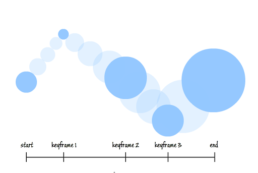 .imgref[[[script-tutorials]](https://www.script-tutorials.com/css-animation-guide-for-novices/)]

???
  

* Once again, there are different interpolation formulas, which are crucial for the final look.
* If you want to know how to set keyframes in Houdini, check out this 2 minutes [video](https://vimeo.com/116173730). The most important tool to work with keyframes is the Graph Editor or [Graph View](https://www.sidefx.com/docs/houdini/ref/panes/changraph.html), which exists in some form or the other in all 3D animation packages.
* Keyframe animation is truly an art in itself. It takes practice and overall a lot of time and effort. To me personally it has always been the hardest aspect of doing 3D. I think, I have just no eye for it, I only know when it is wrong but I have no understanding and intuition about what to change to make it right. I have spent countless hours with practicing to animate walk cycles, with very disappointing results. Why am I telling you this? Because I want you to internalize to never underestimate what it takes to create a keyframe animation in regard to time, effort and experience. Ideally, have an expert around to do it for you!

---
.header[Animation]

## Kinematic Solver

--

Also known as *kinematic animation*.  
  

--

Kinematic solvers are based on the *geometry of motion*.  

--

* The geometry of the system and all initial conditions are given

--
* Any unknown parts of the system, such as the next position, are solved from the geometry of the system  

???
  

* A kinematics problem begins by describing the geometry of the system and declaring all initial conditions of any known values within the system such as of the position. 
* Then, any unknown parts of the system, such as the position in the next frame can be derived from the geometry of the system. 
  
---
.header[Kinematic Solver]

## Direct Kinematic Animation

--
  
  

.imgref[[[coherent-labs]](https://coherent-labs.com/posts/create-motion-path-animation-animate/)]

E.g. path animation is an example of *direct kinematic animation*.

???
  

*  For path animation an object follows a specified path from control points. Aspects to look out for are the orientation of the object and whether velocity control, meaning slow-in/slow-outs, are needed.  
*  In Houdini this is done with the 

[[3]](https://en.wikipedia.org/wiki/Kinematics)  

---
.header[Kinematic Solver]

## Indirect Kinematic Animation

Objects derive their movement from the movement of other objects.
  

???
  

* For indirect kinematic animation there is no direct information such as a path for certain object of the scene, but these objects derive their movement from the movement of other objects, e.g. with a hierarchy of joints. 
  

---
.header[Kinematic Solver]

## Indirect Kinematic Animation

.left-even[Objects derive their movement from the movement of other objects.
  
E.g. with a hierarchy of joints: 
] 
  
.right-even[

 .imgref[[[wiki]](https://en.wikipedia.org/wiki/Inverse_kinematics#/media/File:Modele_cinematique_corps_humain.svg)]]

???
  

* For indirect kinematic animation there is no direct information such as a path for certain object of the scene, but these objects derive their movement from the movement of other objects, e.g. with a hierarchy of joints. 
  
---
.header[Kinematic Solver]

## Indirect Kinematic Animation

There are two types of indirect kinematic animation:

* *Forward kinematics* 
* *Inverse kinematics*

---
.header[Kinematic Solver | Indirect Kinematics]

## Forward Kinematic Animation

--

We are moving the joints (e.g. from an arm) and get back a position and an orientation in scene space (e.g. for a hand).

--

.left-even[.imgref[[[generationrobots]](https://www.generationrobots.com/de/403512-roboterarm-reactorx-200.html)]]  

   
  
--
  
 
*The joints in green are rotated and the position of the hand is moved by that.*

???
  

* For forward kinematics we map the space of the joints to the cartesian space of the scene.
* 

---
.header[Kinematic Solver | Indirect Kinematics]

## Inverse Kinematic Animation

--

We are moving a target handle, also called the *end effector* (e.g. a hand) and from that the orientation of the joints (e.g. for an arm) is derived. 
--

.left-even[ .imgref[[[generationrobots]](https://www.generationrobots.com/de/403512-roboterarm-reactorx-200.html)]]  
  
  
--
  
 

*The handle in green is moved in space and the rotation of the joint is computed from that.*

???
  

* For inverse kinematic, it is the other way around. We are mapping the cartesian space of the scene to the space of the joints.
* The addition of constraints, limits, collision detections, etc. play a crucial part in inverse kinematic. E.g when building a human leg system, you want to make sure that you can rotate the knee joints only about 135° in the direction of the back of the leg.

---
.header[Kinematic Solver | Indirect Kinematics]

## Inverse Kinematic Animation

.center[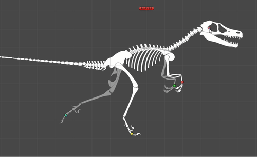  *An inverse Kinematic setup*].imgref[[[grandscratchybluetonguelizard]](https://gfycat.com/grandscratchybluetonguelizard)] 

???
  

* The addition of constraints, limits, collision detections, etc. play a crucial part in inverse kinematic. E.g when building a human leg system, you want to make sure that you can rotate the knee joints only about 135° in the direction of the back of the leg.
* Now, onwards to the topic we are actually interested in: moving stuff without lifting a finger. Or something like that. Well, at least without creating a zillion keyframes...

---

## Animation in Unreal

* [Full-Body Inverse Kinematics](https://dev.epicgames.com/documentation/en-us/unreal-engine/control-rig-full-body-ik-in-unreal-engine?application_version=5.5)

  .imgref[[[epicgames]](https://dev.epicgames.com/documentation/en-us/unreal-engine/physics-in-unreal-engine)] 

---
template:inverse

#### Quick Detour

# MetaHumans

---
## MetaHumans

 <video width="768" controls autoplay loop muted>
  <source src="../02_scripts/img/dynamics/metahumans_01.mp4" type="video/webm">
</video> [[metahuman]](https://www.metahuman.com)

A complete framework for creating and animating realistic and digital human characters

???

* A complete framework for creating and animating realistic and digital human characters
* Each MetaHuman ships with a rigged skeletal mesh, complete facial rig (bones plus the Control Rig system), hair (strand-based or cards), and a body proportioned via the MetaHuman skeleton standard. 
* They are generated and customized through MetaHuman Creator (browser-based, recently folded into MetaHuman Animator/MetaHuman Plugin workflows inside UE5) or built locally via MetaHuman Creator in-engine depending on version.

---
## MetaHumans

 <video width="768" controls autoplay loop muted>
  <source src="../02_scripts/img/dynamics/metahumans_03.mp4" type="video/webm">
</video> [[metahuman]](https://www.metahuman.com)

A MetaHuman has a rigged skeletal mesh, facial rig, hair, and a body

???

* A complete framework for creating and animating realistic and digital human characters
* Each MetaHuman ships with a rigged skeletal mesh, complete facial rig (bones plus the Control Rig system), hair (strand-based or cards), and a body proportioned via the MetaHuman skeleton standard. 
* They are generated and customized through MetaHuman Creator (browser-based, recently folded into MetaHuman Animator/MetaHuman Plugin workflows inside UE5) or built locally via MetaHuman Creator in-engine depending on version.

---
## MetaHumans

 <video width="768" controls autoplay loop muted>
  <source src="../02_scripts/img/dynamics/metahumans_02.mp4" type="video/webm">
</video> [[metahuman]](https://www.metahuman.com)

A MetaHuman has a rigged skeletal mesh, facial rig, hair, and a body

???

* A complete framework for creating and animating realistic and digital human characters
* Each MetaHuman ships with a rigged skeletal mesh, complete facial rig (bones plus the Control Rig system), hair (strand-based or cards), and a body proportioned via the MetaHuman skeleton standard. 
* They are generated and customized through MetaHuman Creator (browser-based, recently folded into MetaHuman Animator/MetaHuman Plugin workflows inside UE5) or built locally via MetaHuman Creator in-engine depending on version.

---
## MetaHumans

 <video width="768" controls autoplay loop muted>
  <source src="../02_scripts/img/dynamics/metahumans_04.mp4" type="video/webm">
</video> [[metahuman]](https://www.metahuman.com)

Comes with many dedicated tools, such as MetaHuman Creator, Mesh to MetaHuman, and MetaHuman Animator

???

* A complete framework for creating and animating realistic and digital human characters
* Each MetaHuman ships with a rigged skeletal mesh, complete facial rig (bones plus the Control Rig system), hair (strand-based or cards), and a body proportioned via the MetaHuman skeleton standard. 
* They are generated and customized through MetaHuman Creator (browser-based, recently folded into MetaHuman Animator/MetaHuman Plugin workflows inside UE5) or built locally via MetaHuman Creator in-engine depending on version.
* 

* A MetaHuman has a rigged skeletal mesh, facial rig, hair, and a body
*  MetaHuman Creator, Mesh to MetaHuman, and MetaHuman Animator, etc.

---
## MetaHumans

> To access the functionality, select the MetaHuman Creator Core Data as part of the Unreal Engine installation process and enable the MetaHuman Creator plugin in your project. 

---

## Animation in Unreal

<iframe width="792" height="446" src="https://www.youtube.com/embed/VGxrkqRbd4k" title="MetaHuman Sizzle Reel | Unreal Fest 2025" frameborder="0" allow="accelerometer; autoplay; clipboard-write; encrypted-media; gyroscope; picture-in-picture; web-share" referrerpolicy="strict-origin-when-cross-origin" allowfullscreen></iframe>

???
  
<iframe width="792" height="446" src="https://www.youtube.com/embed/_mMZNx9AWTg" title="MetaHuman Sizzle Reel 2026 | Unreal Fest Chicago" frameborder="0" allow="accelerometer; autoplay; clipboard-write; encrypted-media; gyroscope; picture-in-picture; web-share" referrerpolicy="strict-origin-when-cross-origin" allowfullscreen></iframe>

* [Animating Characters and Objects](https://dev.epicgames.com/documentation/en-us/unreal-engine/animating-characters-and-objects-in-unreal-engine?application_version=5.5)
* [Animating in Engine: Settings, Preferences & Hotkeys](https://dev.epicgames.com/community/learning/tutorials/W5vD/unreal-engine-animating-in-engine-settings-preferences-hotkeys)
* [Ask A Dev](https://www.youtube.com/@livinfreestyle6727/videos)

---

## Animation in Unreal

<iframe width="792" height="446" src="https://www.youtube.com/embed/b2i1aZbhxAU" title="NEW Unreal Engine 5.8 MetaHuman Markerless Mocap Tutorial" frameborder="0" allow="accelerometer; autoplay; clipboard-write; encrypted-media; gyroscope; picture-in-picture; web-share" referrerpolicy="strict-origin-when-cross-origin" allowfullscreen></iframe>

---
template:inverse

# Dynamics

---
## Dynamic Solver

.center[].imgref[[[tlemco]](https://tlemco.medium.com/tylers-life-hacks-01-e87f6fb3397a)]

---
## Dynamic Solver

--

A dynamic solver computes the reaction of masses, e.g. their motion, under the influence of *forces* over time. 

???
  

* Why do we use dynamics systems for particle setups?
    * Particle systems are easily made of thousands of particles and most sane people would not want to set keyframes for every single particle.

--
  
> What is the position of an object at a specific time?

--

 
  
Key components:

--

* Time

--
* Forces

--
* Objects (might have a certain mass)

---
.header[Dynamic Solver]

## Forces

???
  

* Intuitively, the application of a force can be described as a *push* or a *pull*.

--

A force is any interaction that, when unopposed, will change the motion of an object.  

--

 

* A force has potentially both *magnitude* and *direction*, making it a **vector**.

--

* Forces can also be dynamic, meaning they can change over time.  
  

--

 

> How does a *force* change the position of an object?

???
  

* **This is now the question we want to answer**
* For using the magic of forces, we first have to dig into some mathematical backgrounds
* A force can cause an object with mass to change its *velocity* (which includes to begin moving from a state of rest), that is to *accelerate*.
* We are now going through the math that is needed to compute how a force changes the position of an object. For that we start the other way around, by investigating first what is happening when we change the position of an object.

---

.header[Dynamic Solver]

## Time

Changes over time

???
As dynamic forces might change over time, we need to account for and track the evolution of system states over time.

--

* Account for and track the evolution of system states

--

 

*Stateful*: meaning past states (such as previous states of the forces) might influence future states.

---
## Dynamic Solver

A dynamic solver computes the reaction of masses, e.g. their motion, under the influence of *forces* over time. 

> What is the position of an object at a specific time?

--

 

**forces → position?**

--

**position?**

---
template:inverse

#### Dynamic Solver
# "Movement"

---
.header[Dynamic Solver]

## Movement

.left-even[<iframe width=480 height=450 src="https://editor.p5js.org/legie/full/2jszhHJ9T"></iframe>]

--

.right-even[
    
  
    
*How to compute "movement"?*
]

---
.header[Dynamic Solver]

## Movement

--

.center[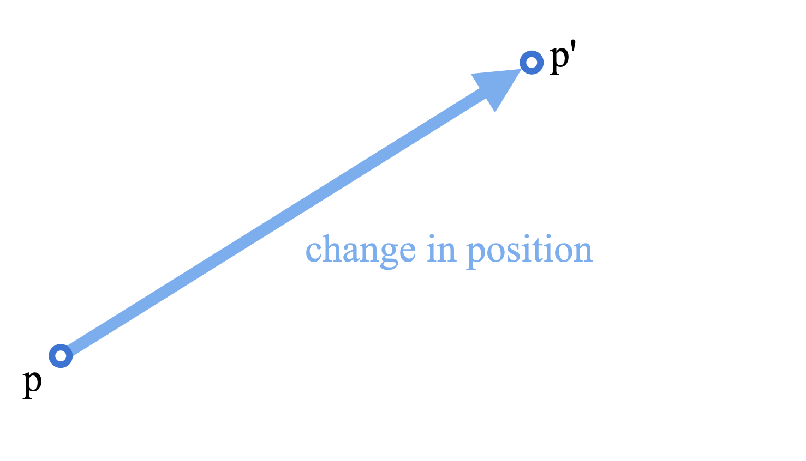]  

???
  

* Let's say we want to get from **a** to **b**. For that we add a vector to **a**, which moves it to **b**.

---
.header[Dynamic Solver]

## Movement

.center[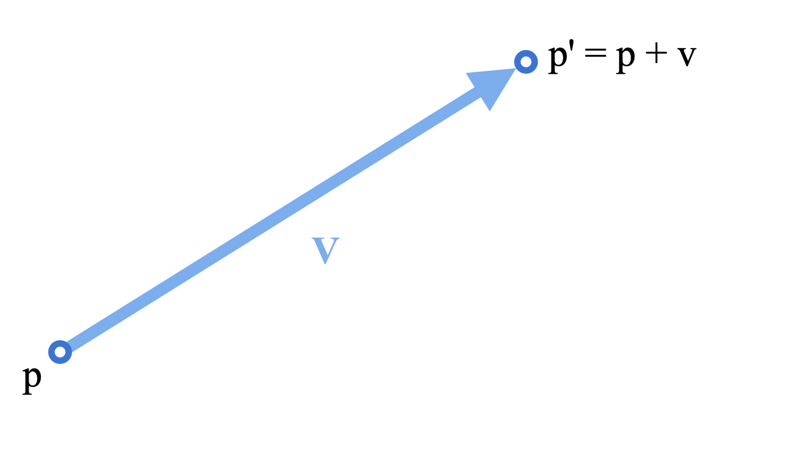]  

---
.header[Dynamic Solver]

## Movement

.center[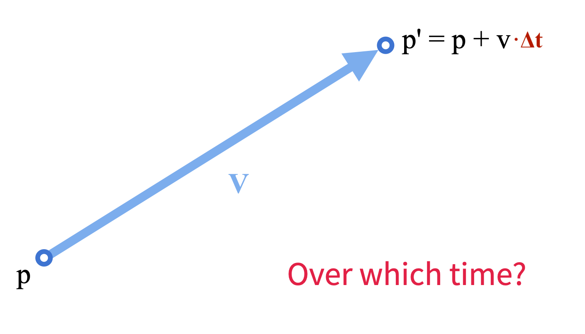]  

???
We add how fast we are going, multiplied by how long we travel, to get where you end up.

---
.header[Dynamic Solver]

## Rate of Change

.center[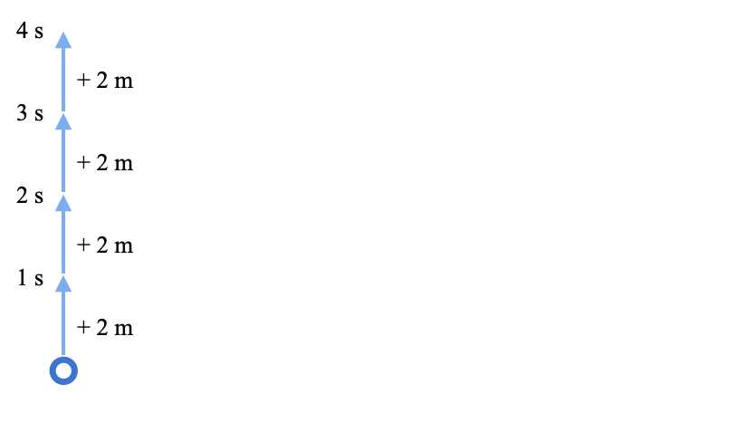]  

---
.header[Dynamic Solver]

## Rate of Change

.center[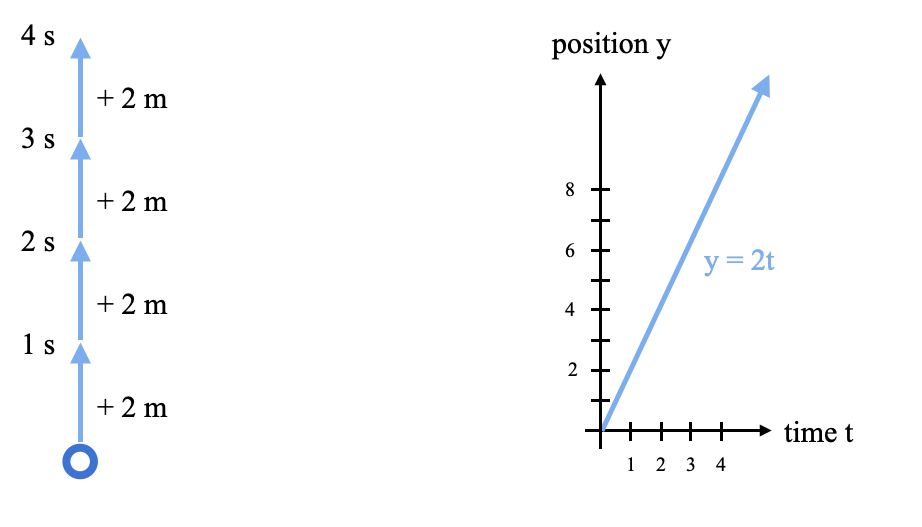]  

---
.header[Dynamic Solver]

## Velocity

--

.left-even[]  

--

.right-even[
  
 
  
> The velocity of an object is the rate of change of its position over time.

] 

???
  

* Velocity is equivalent to a specification of an object's speed and direction of motion (e.g. 60 km/h to the north)
* In short, velocity is a *rate of change*.

---
.header[Dynamic Solver]

## Velocity

.left-even[]  

.right-even[
  
 
  
> The velocity of an object is the **rate of change** of its position **over time**.

] 

???
  

* Velocity is equivalent to a specification of an object's speed and direction of motion (e.g. 60 km/h to the north)
* In short, velocity is a *rate of change*.

---
.header[Dynamic Solver]

## Velocity

.left-even[]  

.right-even[
  
 
  
> The velocity of an object is the **rate of change** of its position **over time**.  
  
 
  
*Velocity (Geschwindigkeit) is telling us where to go.*
] 

???
  

* Velocity is equivalent to a specification of an object's speed and direction of motion (e.g. 60 km/h to the north)
* In short, velocity is a *rate of change*.

---
.header[Dynamic Solver]

## Velocity Vector

.left-quarter[
* Speed
* Direction]  
.right-quarter[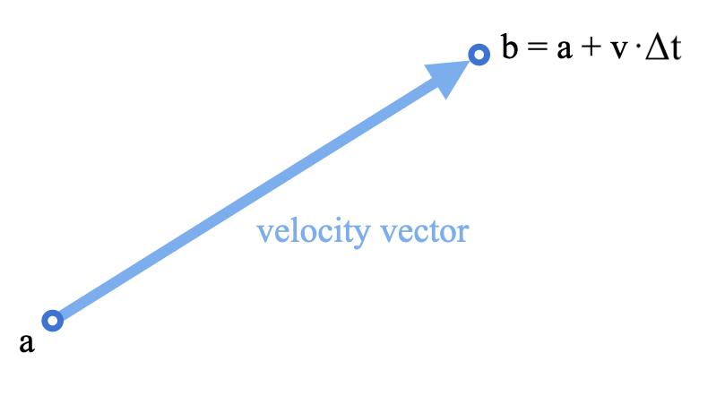]  

???
  

* The magnitude represents the speed, and direction, direction.

---
.header[Dynamic Solver]

## Velocity?

.left-even[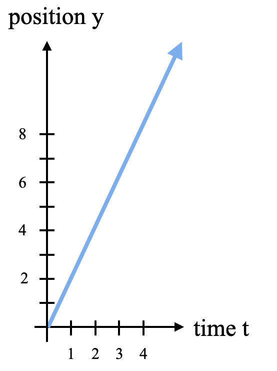]  

.right-even[

]  

???
Let's say we measured where this object was at every moment and drew it on a graph. **Can we read the velocity off that graph?**

Eventually we start with forces, which create some form of velocity, which changes position. At every step a solver is trying to figure out rates of change from what it currently knows. Being able to look at a position curve and ask "how fast is this changing right now?" is exactly that skill.

---
.header[Dynamic Solver]

## Velocity?

.left-even[]  

.right-even[

*How much does y change, when t changes?*
]  

???
* how much did y change, divided by how much did t change. 

That ratio has a name — it is the slope of the line. So slope and velocity are not two separate ideas. They are the same quantity, one described physically and one described geometrically.

---
.header[Dynamic Solver]

## Velocity?

.left-even[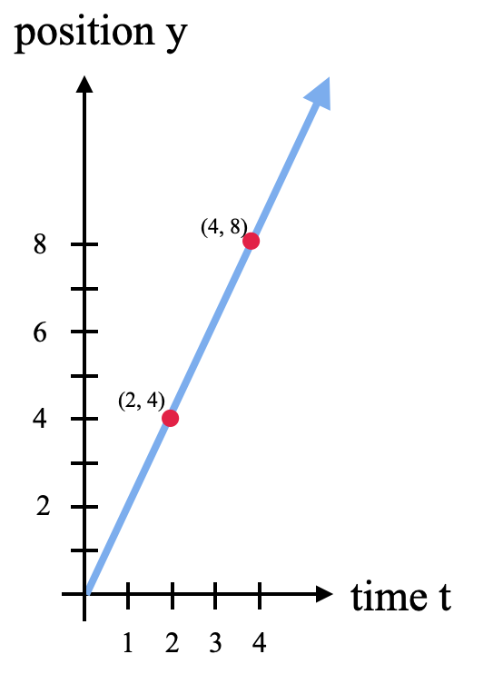]  

.right-even[

]  

---
.header[Dynamic Solver]

## Velocity?

.left-even[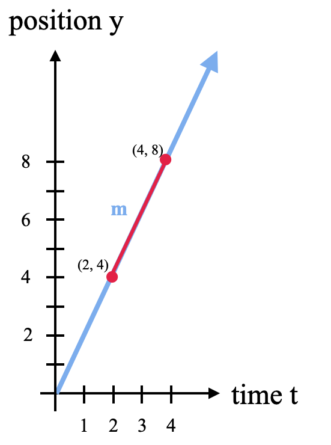]  

.right-even[

]  

---
.header[Dynamic Solver | Velocity]

## Slope

.left-even[]  

.right-even[
$m = ?$
]  

---
.header[Dynamic Solver | Velocity]

## Slope

.left-even[]  

.right-even[
$m = ?$  

 
The velocity of a line, meaning its rate of change, is the same as its **slope** $m$.
]  

---
.header[Dynamic Solver | Velocity]

## Slope

.left-even[]  

.right-even[
$m = \frac{\text{change in y}}{\text{change in t}}$
]  

---
.header[Dynamic Solver | Velocity]

## Slope

.left-even[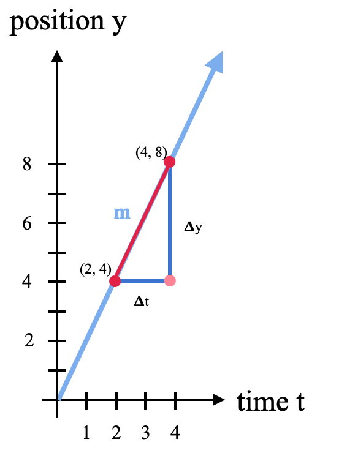]  

.right-even[
$m = \frac{\text{change in y}}{\text{change in t}} = \frac{\Delta y}{\Delta t}$
]  

???
* The symbol Δ (delta) is an abbreviation for *"change in"*.

---
.header[Dynamic Solver | Velocity]

## Slope

.left-even[]  

.right-even[
$m = \frac{\text{change in y}}{\text{change in t}} = \frac{\Delta y}{\Delta t} = \frac{y_2 - y_1}{t_2 - t_1}$
]  

---
.header[Dynamic Solver | Velocity]

## Slope

.left-even[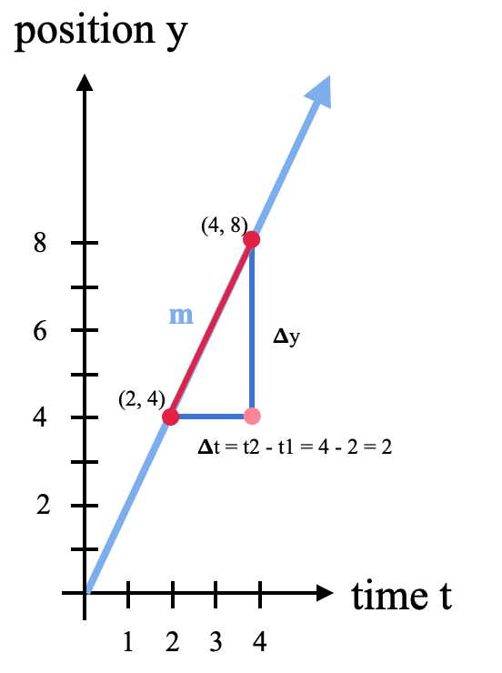]  

.right-even[
$m = \frac{\text{change in y}}{\text{change in t}} = \frac{\Delta y}{\Delta t} = \frac{y_2 - y_1}{t_2 - t_1}$  
  
 

$m = \frac{\Delta y}{t_2 - t_1} = \frac{\Delta y}{4 - 2} = \frac{\Delta y}{2}$  
]  

---
.header[Dynamic Solver | Velocity]

## Slope

.left-even[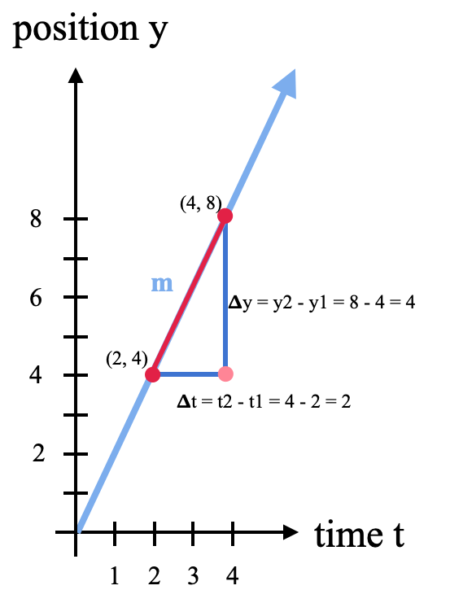]  

.right-even[
$m = \frac{\text{change in y}}{\text{change in t}} = \frac{\Delta y}{\Delta t} = \frac{y_2 - y_1}{t_2 - t_1}$  
  
 

$m = \frac{y_2 - y_1}{t_2 - t_1} = \frac{8 - 4}{4 - 2} = \frac{4}{2} = 2$  
]  

---
.header[Dynamic Solver | Velocity]

## Slope

.left-even[]  

.right-even[
$m = \frac{\text{change in y}}{\text{change in t}} = \frac{\Delta y}{\Delta t} = \frac{y_2 - y_1}{t_2 - t_1}$  
  
 

$m = \frac{y_2 - y_1}{t_2 - t_1} = \frac{8 - 4}{4 - 2} = \frac{4}{2} = 2$  
]  

---
.header[Dynamic Solver]

## Velocity

.left-even[]  

.right-even[

The velocity of a line, meaning its rate of change, is the same as its **slope** $m$.
  
 
  
$m = 2$  
]  

---
.header[Dynamic Solver | Velocity]

## Line Description

.left-even[]  

.right-even[
$y = mx + b$ 
]  

---
.header[Dynamic Solver | Velocity]

## Line Description

.left-even[]  

.right-even[
$y = mt + b$ 
  
* $m$: slope
* $b$: y-intercept
* $t$: the independent variable of the function
]  

---
.header[Dynamic Solver | Velocity]

## Line Description

.left-even[]  

.right-even[
$y = mt + b$ 
  
* $m$: slope
* $b$: y-intercept
* $t$: the independent variable of the function
   
 
$y = 2t$
]  

---
.header[Dynamic Solver | Velocity]

## Line Description

.center[
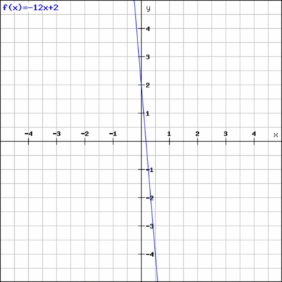
]

???
  

* * Also called the line's **gradient** or **rate of change**, describing the steepness and direction of a line

---
.header[Dynamic Solver]

## Constant Velocity

.left-even[<iframe width=480 height=450 src="https://editor.p5js.org/legie/full/2jszhHJ9T"></iframe>]  

.right-even[

]

???
* How is this velocity description limited?

---
.header[Dynamic Solver]

## Constant Velocity

.left-even[]  

<iframe width=480 height=450 src="https://editor.p5js.org/legie/full/2jszhHJ9T"></iframe>

???
* How is this velocity description limited?

  

---
.header[Dynamic Solver]

## Dynamic Velocity

Position function:  $y = 2(t - 0.5)^3$

--

 

.center[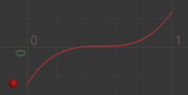 .imgref[[[entagma]](https://entagma.com/particles-part-03-the-principle-of-particle-simulation/)]] 

???
  

* Similarly, imagine we are animating the position of one red particle in y, based on the formula *y = 2(t-0.5)^3*. We can visualize the particle's movement in regard to the time in x.

---
.header[Dynamic Solver]

## Dynamic Velocity

$y = 2(t - 0.5)^3$

 

 .imgref[[[entagma]](https://entagma.com/particles-part-03-the-principle-of-particle-simulation/)]

> How to compute velocity if it changes over time?

---
.header[Dynamic Solver | Velocity]

## Slope

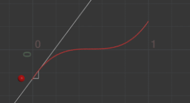 .imgref[[[entagma]](https://entagma.com/particles-part-03-the-principle-of-particle-simulation/)] 

We need to be able to compute the slope at a single point!

---
.header[Dynamic Solver | Velocity]

## Slope

.left-even[]  

--

.right-even[
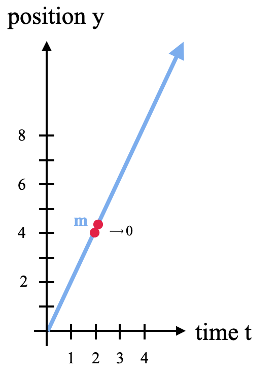
]  

---
.header[Dynamic Solver | Velocity]

## Slope

.left-even[  .imgref[[[wiki]](https://en.wikipedia.org/wiki/Derivative)]]

???
  

* For that, we shrink the difference to the neighboring point towards zero

--

.right-even[We shrink the difference between neighboring point towards zero!]

---
.header[Dynamic Solver | Velocity]

## Slope

.left-quarter[  .imgref[[[wiki]](https://en.wikipedia.org/wiki/Derivative)]]

.right-quarter[

$m = \frac{\Delta f(x)}{\Delta x} = \frac{f(x + h) - f(x)}{(x + h) - (x)} = \frac{f(x + h) - f(x)}{h}$
  
]

---
.header[Dynamic Solver | Velocity]

## Slope

.left-quarter[  .imgref[[[wiki]](https://en.wikipedia.org/wiki/Derivative)]]

.right-quarter[

$m = \frac{\Delta f(x)}{\Delta x} = \frac{f(x + h) - f(x)}{(x + h) - (x)} = \frac{f(x + h) - f(x)}{h}$
  
 
  
$m = \lim_{h \to 0}{ \frac{f(x + h) - f(x)}{h}} $

]

---
.header[Dynamic Solver | Velocity]

## Slope

.left-quarter[  .imgref[[[wiki]](https://en.wikipedia.org/wiki/Derivative)]]

.right-quarter[

$m = \frac{\Delta f(x)}{\Delta x} = \frac{f(x + h) - f(x)}{(x + h) - (x)} = \frac{f(x + h) - f(x)}{h}$
  
 
  
$m = \lim_{h \to 0}{ \frac{f(x + h) - f(x)}{h}} $

  
 
  
$f'(x) = \lim_{h \to 0}{ \frac{f(x + h) - f(x)}{h}} $
]

---
.header[Dynamic Solver]

## Differentiation

--

*Differentiation* is a method to find an *exact value for the slope*, hence the rate of change at any given time t. 

--

> The first derivative of the function *y = f(t)* is a measure of the rate at which the value *y* of the function changes with respect to the change of the time *t*.

???
  

* This means in our context the first derivative of the function *y = f(t)* is a measure of the rate of change.

---
.header[Dynamic Solver]

## Differentiation

.left-even[

Position function: $y = 2(t-0.5)^3$ 

]

.right-even[  .imgref[[[entagma]](https://entagma.com/particles-part-03-the-principle-of-particle-simulation/)]] 

???
  

* The first derivative of the function y = f(t) is a measure of the rate at which the value y of the function changes with respect to the change of the time t.
* https://www.mathsisfun.com/calculus/derivatives-rules.html
* For many functions there are [differentiation rules](https://en.wikipedia.org/wiki/Differentiation_rules) to find a function's derivatives such as analytical solution in yellow shown above. If an analytical solution (meaning to calculate the exact solution by well-defined steps, such as the rules to derivate a function statement) is not possible, numerical approximations are used instead. We will come back to that.
* y = 2(t-0.5)^3 => 6*(t-0.5)^2

---
.header[Dynamic Solver]

## Differentiation

.left-even[

Position function: $y = 2(t-0.5)^3$ 
  
Velocity function: $y' =$ ?

]

.right-even[  .imgref[[[entagma]](https://entagma.com/particles-part-03-the-principle-of-particle-simulation/)]] 

???
  

* The first derivative of the function y = f(t) is a measure of the rate at which the value y of the function changes with respect to the change of the time t.
* https://www.mathsisfun.com/calculus/derivatives-rules.html
* For many functions there are [differentiation rules](https://en.wikipedia.org/wiki/Differentiation_rules) to find a function's derivatives such as analytical solution in yellow shown above. If an analytical solution (meaning to calculate the exact solution by well-defined steps, such as the rules to derivate a function statement) is not possible, numerical approximations are used instead. We will come back to that.
* y = 2(t-0.5)^3 => 6*(t-0.5)^2

---
.header[Dynamic Solver]

## Differentiation

.left-even[

Position function: $y = 2(t-0.5)^3$ 
  
Velocity function: $y' =$ ?

 
The velocity function is the first derivative of the position function.

]

.right-even[  .imgref[[[entagma]](https://entagma.com/particles-part-03-the-principle-of-particle-simulation/)]] 

???
  

* The first derivative of the function y = f(t) is a measure of the rate at which the value y of the function changes with respect to the change of the time t.
* https://www.mathsisfun.com/calculus/derivatives-rules.html
* For many functions there are [differentiation rules](https://en.wikipedia.org/wiki/Differentiation_rules) to find a function's derivatives such as analytical solution in yellow shown above. If an analytical solution (meaning to calculate the exact solution by well-defined steps, such as the rules to derivate a function statement) is not possible, numerical approximations are used instead. We will come back to that.
* y = 2(t-0.5)^3 => 6*(t-0.5)^2

---
.header[Dynamic Solver]

## Differentiation

.left-even[

Position function: $y = 2(t-0.5)^3$ 
  
Velocity function: $y' = 6(t-0.5)^2$ 

 
The velocity function is the first derivative of the position function.

]

.right-even[  .imgref[[[entagma]](https://entagma.com/particles-part-03-the-principle-of-particle-simulation/)]] 

???
  

* The first derivative of the function y = f(t) is a measure of the rate at which the value y of the function changes with respect to the change of the time t.
* https://www.mathsisfun.com/calculus/derivatives-rules.html
* For many functions there are [differentiation rules](https://en.wikipedia.org/wiki/Differentiation_rules) to find a function's derivatives such as analytical solution in yellow shown above. If an analytical solution (meaning to calculate the exact solution by well-defined steps, such as the rules to derivate a function statement) is not possible, numerical approximations are used instead. We will come back to that.
* y = 2(t-0.5)^3 => 6*(t-0.5)^2

---
.header[Dynamic Solver]

## Differentiation

.left-even[

Position function: $y =$ ?
  
Velocity function: $y' = 6(t-0.5)^2$ 

 
The velocity function is the first derivative of the position function.

]

.right-even[  .imgref[[[entagma]](https://entagma.com/particles-part-03-the-principle-of-particle-simulation/)]] 

---
.header[Dynamic Solver]

## Differentiation

.left-even[

Position function: $y = 2(t-0.5)^3$ 
  
Velocity function: $y' = 6(t-0.5)^2$ 

 
The position function is the first derivative of the velocity function.
]

.right-even[  .imgref[[[entagma]](https://entagma.com/particles-part-03-the-principle-of-particle-simulation/)]] 

---
.header[Dynamic Solver]

## Differentiation & Integration

.center[]

???
  

* The inverse of derivation is integration

---
.header[Dynamic Solver]

## Calculus

  
> Calculus is the mathematical study of change, in the same way that Geometry is the study of shape, and Algebra is the study of operations and their application to solving equations. [[5]](https://books.google.de/books?id=-WC_AAAAQBAJ&printsec=frontcover&hl=de&source=gbs_ge_summary_r&cad=0#v=onepage&q&f=false)
  

???
  

* *the study of change*
  
--
* Calculus is the study of change
* Calculus helps us to describe the object's position as a function over time...

???
 

Computations regarding moving objects and changing positions are part of *[Calculus](https://en.wikipedia.org/wiki/Calculus)*.  

---
## Dynamic Solver

Let's imagine, we have a function over time, $f(t)$, that computes how forces change the position of an object.

> How to find the position of the object at time t?

--

Integration! 

---
.header[Dynamic Solver]

## Integration

--

Integration determines the accumulation of a function over a time period.

--

.center[ .imgref[[[socratic]](https://socratic.org/questions/what-is-an-integral)]]

--

An integral is the continuous analog of a sum. 

???
  

* The definite integral of a function f over an interval [a,b] represents the area defined by the function and the x-axis from point a to point b, as seen below.

---
.header[Dynamic Solver]

## Integration
 
Integration determines the accumulation of a function over a time period:

.center[ 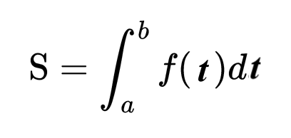]

???
  

* The definite integral of a function f over an interval [a,b] represents the area defined by the function and the x-axis from point a to point b, as seen below.
* Imagine integration like filling a tank from a tap. The input (before integration) is the flow rate from the tap (velocity). Integrating the flow (adding up all the little bits of water) gives us the volume of water (new position) in the tank. Imagine the flow starts at 0 and gradually increases (maybe a motor is slowly opening the tap). As the flow rate increases, the tank fills up faster and faster. With a flow rate of 2x, the tank fills up at x2. We have integrated the flow to get the volume
* dx tells us with which variable we are integrating

--

The integration of $f(t)$ computes how forces change the position of an object over a period of time.

---
.header[Dynamic Solver]
## In Summary

Velocity measures the rate of change in position over a certain time.
  

--
  
 
> **velocity → position:**   

--

> The integration of velocity **v** computes how the position of an object changes over a period of time.
  

???

* The integral of the object’s velocity over time tells us the position when that time period ends.
* Strictly speaking, we need to integrate the velocity over the time step delta

  
--
  

 
*In turn:*   
Velocity can be described as the first derivative of position.

???

BUT: velocity alone cannot explain what we actually see.

Drop a ball. At the moment we release it, velocity is zero — it is not moving yet. If velocity were the only thing driving position, it would just stay there. But it does not stay there. Something is changing the velocity.
  
**Velocity just says "move this much per frame." To change how the circle moves over time, we need something that changes the velocity itself. That is acceleration.**
  
Velocity explains where something goes. Acceleration explains why it goes there differently over time.

force → acceleration → velocity → position

---
.header[Dynamic Solver]

## Movement

Velocity says "move this much per frame."

--

 

> What if "this much" is itself changing?

--

 

If there is a change in speed, direction or both, then the object has a changing velocity and is said to be undergoing an ***acceleration*** (*Beschleunigung*). 

???
  

* For example, a car moving at a constant 20 kilometers per hour in a circular path has a constant speed, but does not have a constant velocity because its direction changes. Hence, the car is considered to be undergoing an acceleration.

---
.header[Dynamic Solver]

## Acceleration

--

Acceleration measures the rate of change in velocity over a certain time.  

--
  
 
> **acceleration → velocity → position:**   

--

> The integration of acceleration **a** computes how the velocity of an object changes over a period of time.  
  
--
  
(*The integration of velocity **v** computes how the position of an object changes over a period of time.*)

  

---
.header[Dynamic Solver]

## Acceleration

  
Acceleration measures the rate of change in velocity over a certain time.  

  
  
 
> **acceleration → velocity → position:**   
  

> The integration of acceleration **a** computes how the velocity of an object changes over a period of time.  
  
 
*In turn:*  
Acceleration can be described as the first derivative of velocity and the second derivative of position.

---
.header[Dynamic Solver]

## Acceleration

.left-even[

Position function: $y = 2(t-0.5)^3$ 
  
Velocity function: $y' = 6(t-0.5)^2$ 
  
Acceleration function: $y'' = 12t-6$ 

]

.right-even[  .imgref[[[entagma]](https://entagma.com/particles-part-03-the-principle-of-particle-simulation/)]] 

???
  

* Again, we can easily plot the analytical solution of the derivative of the velocity of the particle, or the second derivative of the position, hence its acceleration (in blue)
* * y = 2(t-0.5)^3 => 6*(t-0.5)^2 => 12t-6

---
.header[Dynamic Solver]

## In Summary

--
* Velocity measures the rate of change in position over time

--
* Acceleration measures the rate of change in velocity over time  
  

--

 

$\mathbf{v'} = \mathbf{v} + \int \mathbf{a} \, dt$  
$\mathbf{p'} = \mathbf{p} + \int \mathbf{v} \, dt$

???

The integral of acceleration computes the change in velocity, which you then add to the current velocity to get the new velocity. Same for position.

--

 
  
After a given time step:

* The integral of the object's acceleration computes the change in velocity
* The integral of the object's velocity computes the change in position
  

---
.header[Dynamic Solver]

## How To Integrate?

--
  
Analytical solution

--
* Accurate
  
--
  
* Needed for real-world physical simulations
  
--
   
* [Integration rules](https://iacedcalculus.com/integration-rules/)

???
  

* Finding an integral is the reverse of finding a derivative

---
.header[Dynamic Solver]

## How To Integrate?
  
Approximation

???
  

*  Additionally, we might not be able to solve the integral analytically, as it is very likely that a system e.g. of many particles and forces is too complex for that
* We can approximate the analytical solution with numerical integration, which also requires to make small steps over time. A method, which is also called the method of small steps is the Euler method.

--
* Working with additions and sums instead of functions
* Just fine for CGI

--

 

> How to integrate really depends on the scenario!

---
.header[Dynamic Solver | Integration]

## Approximation - Euler Integration

???
  

The metaphor: imagine you are standing on a hill in fog. You cannot see far ahead, so you look down at your feet, check the slope right where you are standing, and take one small step in that direction. Then you look down again, check the new slope at your new position, and take another step. You are always using local information to decide where to go next.

The word "direction" is doing double duty here: it means both the sign (positive or negative, up or down, left or right) and the magnitude (steep or shallow slope, fast or slow velocity). In multiple dimensions it becomes a vector, but the idea is the same.

The key limitation this reveals: you only sample the slope at the start of each step, not along it. If the slope curves mid-step, you miss that, which is why large time steps cause Euler to drift or blow up.

--

Follow $f(t)$ in small, discrete time steps

.left-even[.imgref[[[wiki]](https://www.wikiwand.com/en/Euler_method)]]

--

 
* Start at a known point, e.g., zero
* Take a step in the direction of change
* Repeat

---
.header[Dynamic Solver | Integration | Approximation | Euler Integration]

## Direction of Change?

---
.header[Dynamic Solver | Integration | Approximation | Euler Integration]

## Direction of Change

The **rate of change** — the slope of the function at the current point.

--

 

* To step position forward: the direction of change is **velocity**.
* To step velocity forward: the direction of change is **acceleration**.

---
.header[Dynamic Solver | Integration | Approximation | Euler Integration]

## Approximation - Euler Integration

In other words, at each step, read the current slope and walk along it for one small time step $\Delta t$:

--

.center[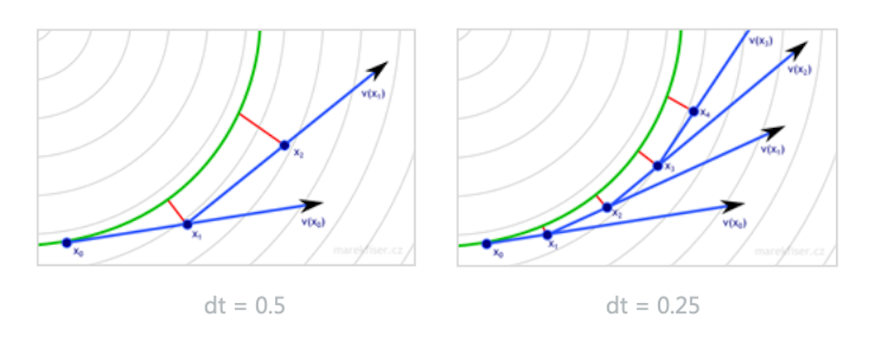]

???
  

* We start at an initial condition, e.g. zero and travel a small step along the line of the slope (the line tangent to that point) and add that velocity to the initial velocity. Then we travel on the tangent of that point a small step, finding the next velocity, and again and again. This is called Euler Integration.
* the slope of the tangent line to the curve can be computed at any point on the curve, once the position of that point has been calculated
* https://www.wikiwand.com/en/Euler_method

---
.header[Dynamic Solver | Integration | Approximation | Euler Integration]

## Approximation - Euler Integration

In other words, at each step, read the current slope and walk along it for one small time step $\Delta t$:

.center[]

For finding the position, at each step we pretend to have a constant velocity.  

--

For finding the velocity, at each step we pretend to have a constant acceleration.

---
.header[Dynamic Solver | Integration | Approximation | Euler Integration]

## From Integral to Time Step

$\mathbf{v'} = \mathbf{v} + \int \mathbf{a} \, dt \quad$  
$\mathbf{p'} = \mathbf{p} + \int \mathbf{v} \, dt$

--

 

At each step we pretend acceleration and velocity are constant over $\Delta t$.

--

 

Under that assumption the integral simplifies to a multiplication:

$\int \mathbf{a} \, dt \approx \mathbf{a} \cdot \Delta t \qquad \int \mathbf{v} \, dt \approx \mathbf{v} \cdot \Delta t$

--

 

$\mathbf{v'} = \mathbf{v} + \mathbf{a} \cdot \Delta t$  
$\mathbf{p'} = \mathbf{p} + \mathbf{v'} \cdot \Delta t$

???
* https://editor.p5js.org/legie/sketches/6sWJaNsTj
* https://natureofcode.com/vectors/#acceleration

---
.header[Dynamic Solver | Integration | Approximation | Euler Integration]

## Vectors

$\mathbf{v'} = \mathbf{v} + \mathbf{a} \cdot \Delta t$  
$\mathbf{p'} = \mathbf{p} + \mathbf{v'} \cdot \Delta t$

--

 

The bold notation marks **v**, **a**, and **p** as *vectors* — they have both a magnitude and a direction.

???

In 3D space each is a triple of values:

$\mathbf{p} = (x, y, z)$

This means the same formulas work in any direction simultaneously — and any force we add later will simply be a vector added into the same chain.

---
.header[Dynamic Solver | Integration]

## Approximations

Alternatives to Euler integration are, e.g., [Verlet Integration](https://en.wikipedia.org/wiki/Verlet_integration) or [Runge-Kutta Integration](https://en.wikipedia.org/wiki/Runge%E2%80%93Kutta_methods).

--
  
 

.left-even[
Approximations differentiate in 

* Mathematical complexity
* Accuracy
* Performance
* Stability
]

--

.right-even[

]

???
* If you have precision and / or performance issues, you might be able to change the integration computation.

---

## Dynamic Solver

$\mathbf{v'} = \mathbf{v} + \mathbf{a} \cdot \Delta t$  
$\mathbf{p'} = \mathbf{p} + \mathbf{v'} \cdot \Delta t$

---
## Dynamic Solver

.imgref[[[tlemco]](https://tlemco.medium.com/tylers-life-hacks-01-e87f6fb3397a)]

--

A dynamic solver computes how ***forces*** change the position of an object over time. 

---
.header[Dynamic Solver]

## Forces

???
  

* Intuitively, the application of a force can be described as a *push* or a *pull*.

--

A force is any interaction that, when unopposed, will change the motion of an object.  

--

 

A force has potentially both *magnitude* and *direction*, making it a **vector**.

--

 

> How can a *force* change the position of an object?

???
  

* **This is now the question we want to answer**
* For using the magic of forces, we first have to dig into some mathematical backgrounds
* A force can cause an object with mass to change its *velocity* (which includes to begin moving from a state of rest), that is to *accelerate*.
* We are now going through the math that is needed to compute how a force changes the position of an object. For that we start the other way around, by investigating first what is happening when we change the position of an object.

---
template:inverse

### Dynamic Solver

## Newton’s Second Law of Motion

---
.header[Dynamic Solver]
## Newton’s Laws of Motion

.left-even[
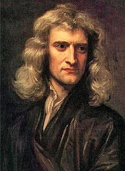  
.imgref[[[wiki]](https://en.wikipedia.org/wiki/Isaac_Newton)]
]

???

Sir Isaac Newton is widely recognized as one of the most influential scientists of all time and as a key figure in the scientific revolution, which marked the emergence of modern science.

--
1. An object at rest stays at rest and an object in motion stays in motion.

--
2. ...

--
3. For every action there is an equal and opposite reaction.

???
  

* 1.:...for a constant speed and direction - as we already know! A force will mix things up. For example, a ball tossed in the earth’s atmosphere slows down because of the air resistance, which is a force.
* 3.: This law is a bit tricky to understand. The third law states that all forces between two objects exist in equal magnitude and opposite direction: if one object A exerts a force **F**A on a second object B, then B simultaneously exerts a force **F**B on A, and the two forces are equal in magnitude and opposite in direction: **F**A = −**F**B [29, as cited in [8]]. The third law means that all forces are interactions between different bodies [30, 31, as cited in [8]] and thus that there is no such thing as a force that is not accompanied by an equal and opposite force. This law is sometimes referred to as the *action-reaction law*, with one force called the *action* and the other one as the *reaction*.  
* From a conceptual standpoint, Newton's third law is seen when a person walks: they push against the floor, and the floor pushes against the person. In swimming, a person interacts with the water, pushing the water backward, while the water simultaneously pushes the person forward — both the person and the water push against each other. The reaction forces account for the motion in these examples. These forces depend on friction; a person or car on ice, for example, may be unable to exert the action force to produce the needed reaction force to move [32, as cited in [8]].
* The good news is that in computer graphics we don't have to stay true to physics but only need to model the perceived visual results of the law such as a character walking.

---
.header[Dynamic Solver]
## Newton’s Second Law of Motion

--

> Force equals mass times acceleration, hence $\mathbf{F} = m \cdot \mathbf{a}$  

--

With $\mathbf{F}$ as force, $m$ as mass and $\mathbf{a}$ as acceleration.

???
  

* Why is this exciting? Well, now we have a formula that directly ties a force to acceleration, which we had already tied to a change of position, meaning, moving stuff. 
* The law says that acceleration is directly proportional to force and that acceleration is inversely proportional to mass. This means if you get pushed, the harder you are pushed, the faster you’ll move (or accelerate) and the bigger you are, the slower you’ll move!
    * The *mass* of an object is a measure of the amount of matter in the object (measured in kilograms).
    * *Weight*, though often mistaken for mass, is technically the force of gravity on an object. From Newton’s second law, we can calculate it as mass times the acceleration of gravity (w = m * g). Weight is measured in newtons.
    * *Density* is defined as the amount of mass per unit of volume (grams per cubic centimeter, for example).
    * An object that has a *mass* of one kilogram on earth and would have a *mass* of one kilogram on the moon. However, it would *weight* only one-sixth as much.

--
   

In turn:

--

$\mathbf{a} = \mathbf{F} / m$

???
  

* We can also now express acceleration simply as..
* Once again, let's keep in mind that we work with a pretend pixel world. If we want to, objects can have a mass equal to 1.

--
  
 
With mass equal to 1, we have $\mathbf{a} = \mathbf{F}$
!

???
  
If we want to, objects can have a mass equal to 1. Then we have **A** = **F**, meaning that the acceleration of an object is equal to the force applied. 

---
.header[Dynamic Solver]
## Newton’s Second Law of Motion

$\mathbf{a} = \mathbf{F} / m$

 

More precisely:

--

*The net force equals mass times acceleration*, 

--

meaning that acceleration is equal to the **sum of all forces** divided by mass!

???
  

* If we have more than one force such as gravity and wind, we refer to a more precise formulation of the second law as *the net force equals mass times acceleration*, meaning in turn that acceleration is equal to the *sum of all forces* divided by mass.

---
.header[Dynamic Solver]
## Newton’s Second Law of Motion

> How can a *force* change the position of an object?

???
  

* Ok, now. Back to the question: how does a force change the position of an object? We know that with a mass of one, the force equals the acceleration of the object. 

--
  
 
  
$\mathbf{v'} = \mathbf{v} + \mathbf{a} \cdot \Delta t$  
$\mathbf{p'} = \mathbf{p} + \mathbf{v'} \cdot \Delta t$

---
.header[Dynamic Solver]
## Newton’s Second Law of Motion

> How can a *force* change the position of an object?

  
 
  
$\mathbf{v'} = \mathbf{v} + \mathbf{F} \cdot \Delta t$  
$\mathbf{p'} = \mathbf{p} + \mathbf{v'} \cdot \Delta t$

  

--
  
 
  
**forces → acceleration → velocity → position**   

---
.header[Dynamic Solver]
## Newton’s Second Law of Motion

> How can a *force* change the position of an object?

--

1. Add up all forces

--
2. Compute the acceleration (a = F / m)

--
3. Compute the velocity

--
4. Compute the position

--

*Compute*: integrate analytically or approximate it.

???
  

* So, we start with the force or acceleration and want to compute the velocity and position from that.
* Seems like we somehow need to go the steps we took to get from position to acceleration the other way around.  
  
*What is this other way around?*    
*What is the inverse of a derivation?*

* The inverse of derivation is integration

---
.header[Dynamic Solver]
## Dynamic Solver

> In a dynamic system we define forces, these forces create acceleration, from these we compute the velocity and from that the position.

???
* The same again in prose

--

 
As forces might change over time, we repeat the computation at each time step, recomputing the force, acceleration, velocity, and position each frame.

???
  

*  Hence, at each time step we compute the force, add it to the velocity and add the velocity to the position. 

---
template:inverse

# Dynamics in Unreal

---

## Dynamics in Unreal

Unreal's physics engine > version 5: [Chaos Physics](https://dev.epicgames.com/documentation/en-us/unreal-engine/physics-in-unreal-engine)

???
* Replaces PhysX engine
* [Chaos Destruction in 300 Seconds](https://www.youtube.com/watch?v=paNTx_uviWg)

--

.center[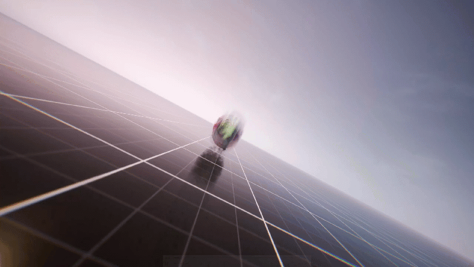 .imgref[[[Unreal Docs]](https://dev.epicgames.com/documentation/en-us/unreal-engine/physics-in-unreal-engine)]]

---

## Dynamics in Unreal

Unreal's physics engine > version 5: [Chaos Physics](https://dev.epicgames.com/documentation/en-us/unreal-engine/physics-in-unreal-engine)

--
* In parts documented well
  
--
  
* Easy start, many intro tutorials; hard to go beyond, few in-depth tutorials

--
* At times unstable

---
## Dynamics in Unreal

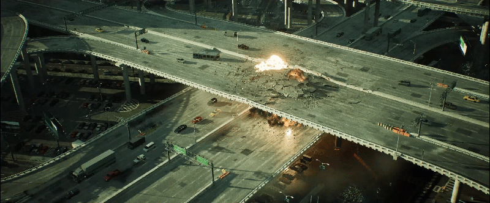  .imgref[[[epicgames]](https://dev.epicgames.com/documentation/en-us/unreal-engine/physics-in-unreal-engine)] 

---
## Dynamics in Unreal

.left-even[
[Chaos Physics](https://dev.epicgames.com/documentation/en-us/unreal-engine/physics-in-unreal-engine)
* Destruction
* Networked Physics
* Rigid Body Dynamics
* Physical Animation
* Cloth Physics
]
.right-even[
 
* Ragdoll Physics
* Vehicles
* Fluid Simulation
* Hair Physics
* Flesh Simulation
]

???
  

* Replaces PhysX engine

---

## Dynamics in Unreal

[Chaos Physics](https://dev.epicgames.com/documentation/en-us/unreal-engine/physics-in-unreal-engine)
* Some of the features are accessed through Niagara
 

---
## Dynamics in Unreal

[Niagara Visual Effects System](https://dev.epicgames.com/documentation/unreal-engine/getting-started-in-niagara-effects-for-unreal-engine)

--

 

.left-even[

For particle-based effects
* Smoke
* Fire
* Sparks
* Magic
* Rain
* Explosions
]

--

.right-even[
  

]

---
## Dynamics in Unreal

[Niagara Visual Effects System](https://dev.epicgames.com/documentation/en-us/unreal-enginetutorials-for-niagara-effects-in-unreal-engine)

 

* Node-based
* Supports GPU and CPU simulations
* Modular: Reusable blocks that define properties
* Interactive, e.g. reacting to gameplay
* Integrates with Blueprints, Materials, and Skeletal Meshes

???
  

* https://dev.epicgames.com/documentation/en-us/unreal-engine/key-concepts-in-niagara-effects-for-unreal-engine

---
## Dynamics in Unreal

[Niagara Visual Effects System](https://dev.epicgames.com/documentation/en-us/unreal-enginetutorials-for-niagara-effects-in-unreal-engine)

  
* [Fluids](https://dev.epicgames.com/documentation/en-us/unreal-engine/fluid-simulation-in-unreal-engine---overview)

.center[  .imgref[[[epicgames]](https://dev.epicgames.com/documentation/en-us/unreal-engine/creating-visual-effects-in-niagara-for-unreal-engine)]]

???

## Destruction

* Geometry Collection
* Fracturing
* Clustering
* Fields
* Caching

.footnote[[My GameDev Pal, [Chaos Destruction in 300 Seconds](https://www.youtube.com/watch?v=paNTx_uviWg)]]

## Geometry Collection

.center[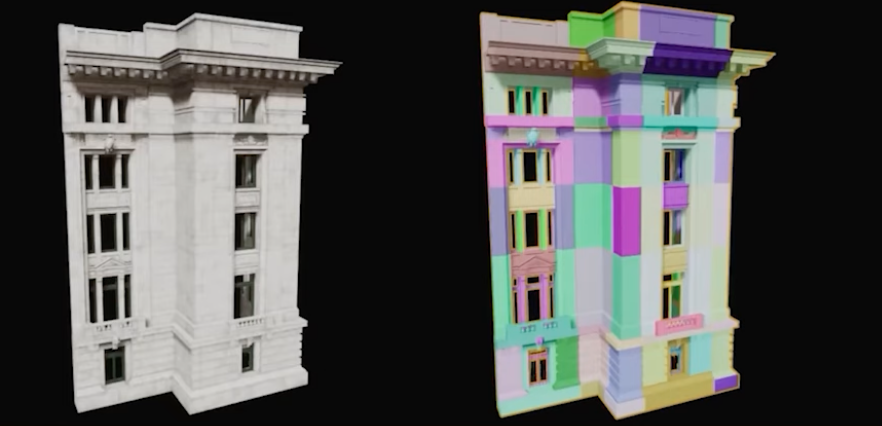]

.footnote[[My GameDev Pal, [Chaos Destruction in 300 Seconds](https://www.youtube.com/watch?v=paNTx_uviWg)]]

???
  

* Geometry collections that define which objects are going to be destroyed
* Destruction within the kill system starts with the geometry collection asset. This can be built from one or more static meshes or blueprints containing static meshes. The easiest way to create a geometry collection is to drag the static mesh to which you want to apply chaos destruction into your level or use the default. Edit the cube and scale and Z-axis to form resemble a pillar. 

## Fracturing

.center[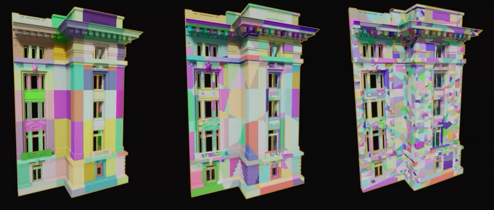]

.footnote[[My GameDev Pal, [Chaos Destruction in 300 Seconds](https://www.youtube.com/watch?v=paNTx_uviWg)]]

???
  

* Fracturing which defines how these collections are destroyed

## Fracturing

.center[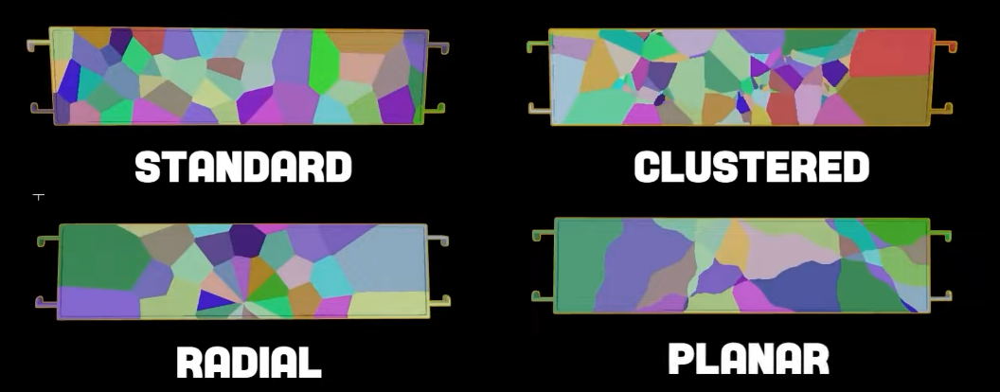]

.footnote[[My GameDev Pal, [Chaos Destruction in 300 Seconds](https://www.youtube.com/watch?v=paNTx_uviWg)]]

???

* There are several types of methods available to define how we want to break it up during destruction
* Combining these will lead to more interesting looking destruction. 
* All these methods are based off the Voronoi pattern 

## Clustering

.center[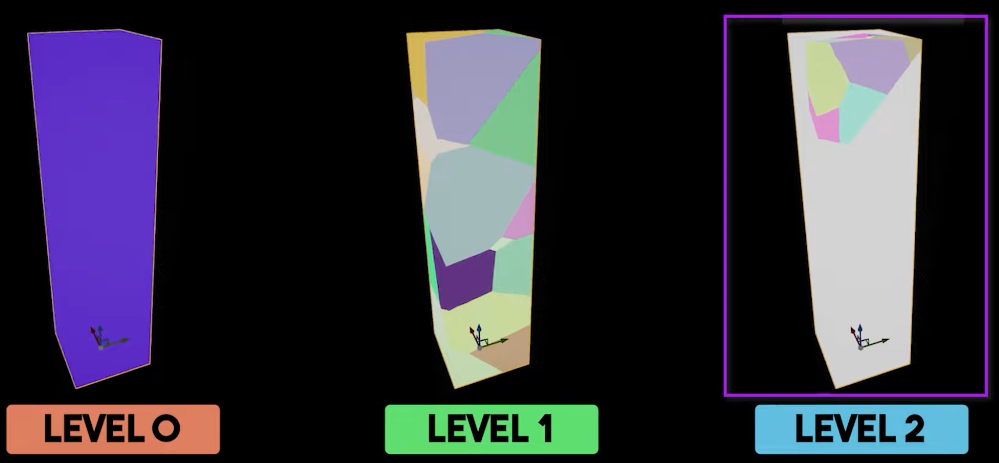]

.footnote[[My GameDev Pal, [Chaos Destruction in 300 Seconds](https://www.youtube.com/watch?v=paNTx_uviWg)]]

???
  

* Clustering that defines the different levels in which collections are destroyed.
* Fracture hierarchy window has opened up. This is a useful tool for debugging and selecting specific parts of your fracture, allowing you to switch between bone index and then view the fracture one of our regions even further. Simply selected, choose the fracture type settings and press fracture. As you can see, both visually and in the fracture hierarchy, our region has been fractured
into another subregion containing 20 or more fractures. What this has done is create an additional level of destruction. As it stands, our palette has three of these level zero. The initial state of our pillar level one, our first 20 region fracture and level to our second 20 region fracture. In order to visualize one of these levels at a time. You can use the shift W key to go down the level or shift s to go up a level. These levels of destruction are also referred to as clusters. The cluster tools are often used to control the visual quality and performance of a fractured mesh. A common use case is specifying different damage thresholds for each cluster in your fracture. To do this, navigate to the physics section of your geometry collection in the details panel and under the cluster settings, you'll see a damage threshold array. The array represents the level of your cluster, which the damage threshold corresponds to. So in our case, the value an index zero defines the amount of damage required to break apart our pillar.
In our first t fracture cluster, an index one defines the damage to further break out pillar into the level two cluster. If we set index zero to 800 and index one to 1 million, you can see that our second cluster never breaks apart. But if we set our index one to something like 200, then both of them break. Note that you can set these values in the details panel on the per basis as we did here, or you could set them directly in the geometry collection asset when clustering. It can be useful to see
03:52
the number of fractures within each cluster to do this. 

## Clustering

.center[]

.footnote[[My GameDev Pal, [Chaos Destruction in 300 Seconds](https://www.youtube.com/watch?v=paNTx_uviWg)]]

## Clustering

.center[]

.footnote[[My GameDev Pal, [Chaos Destruction in 300 Seconds](https://www.youtube.com/watch?v=paNTx_uviWg)]]

## Fields

.center[]

.footnote[[My GameDev Pal, [Chaos Destruction in 300 Seconds](https://www.youtube.com/watch?v=paNTx_uviWg)]]

* Fields apply behaviors and effects onto collections within regions of space. 
* These fields are used to effect simulations of chaos objects by occupying a region of space and applying different behaviors and breakage effects in that space. There are three main types of physics fields, transient fields which are created executed and destroyed at runtime
04:16
during a function, call or event. These are used to add a temporary effect to the physics simulation. Then we have construction fields which are created in the construction script or the field blueprint. And finally, we have the persistent fields which are created and remain active until they're explicitly removed. Each of these fields applies to a specific physics type. Fields can also use different types of metadata to add additional information on how they behave. We'll create a cluster strain field
04:40
which will decay and break away the central pillar, resulting in its eventual collapse As field systems are currently in beta. You need to enable this plugin manually in the plugins window.

## Fields

.center[]

## Fields

.center[]

## Fields

.center[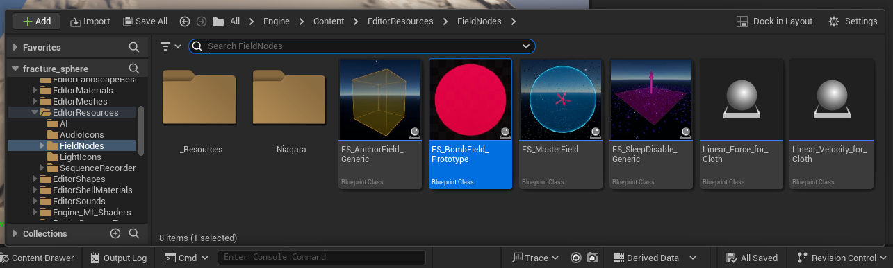]

* Search in the content browser for *bomb*

## Fields

.center[]

## Chaos Cache Manager

.center[]

* With the Geometry Collection selected

## Chaos Cache Manager

.center[]

1. Cache Mode: RECORD
2. Cache Mode: Static Pose

---
template:inverse

## The End

# 👋🏻
