name: inverse
layout: true
class: center, middle, inverse
---


# Procedural Generation and Simulation

#### - Wrap-Up -

<br />

### Prof. Dr. Lena Gieseke | l.gieseke@filmuniversitaet.de  

#### Film University Babelsberg KONRAD WOLF


---
layout: false


## Learning Objectives


--
* Overview about techniques and their capabilities

--
* Understanding of formal theories and algorithms

--
* Practical implementation experiences

--
* Implementation of specific design goals

---
template:inverse

# Introduction

---
.header[Introduction]

## Patterns

--
* The recognition of suitable design goals

--
* An understanding of what a procedural technique is and what it is capable of

--
* An broad overview of approaches

---
.header[Introduction]

## Patterns

.center[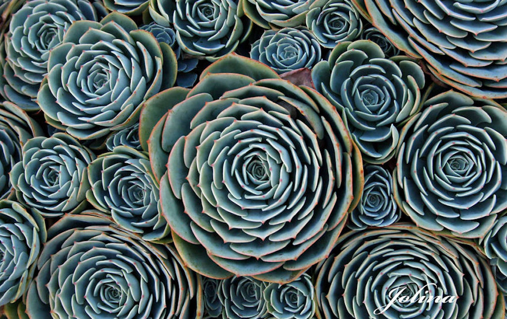].imgref[[[boredpanda]](https://www.boredpanda.com/geometry-symmetry-plants-nature/?utm_source=google&utm_medium=organic&utm_campaign=organic)]

---
.header[Introduction]
## Patterns

.center[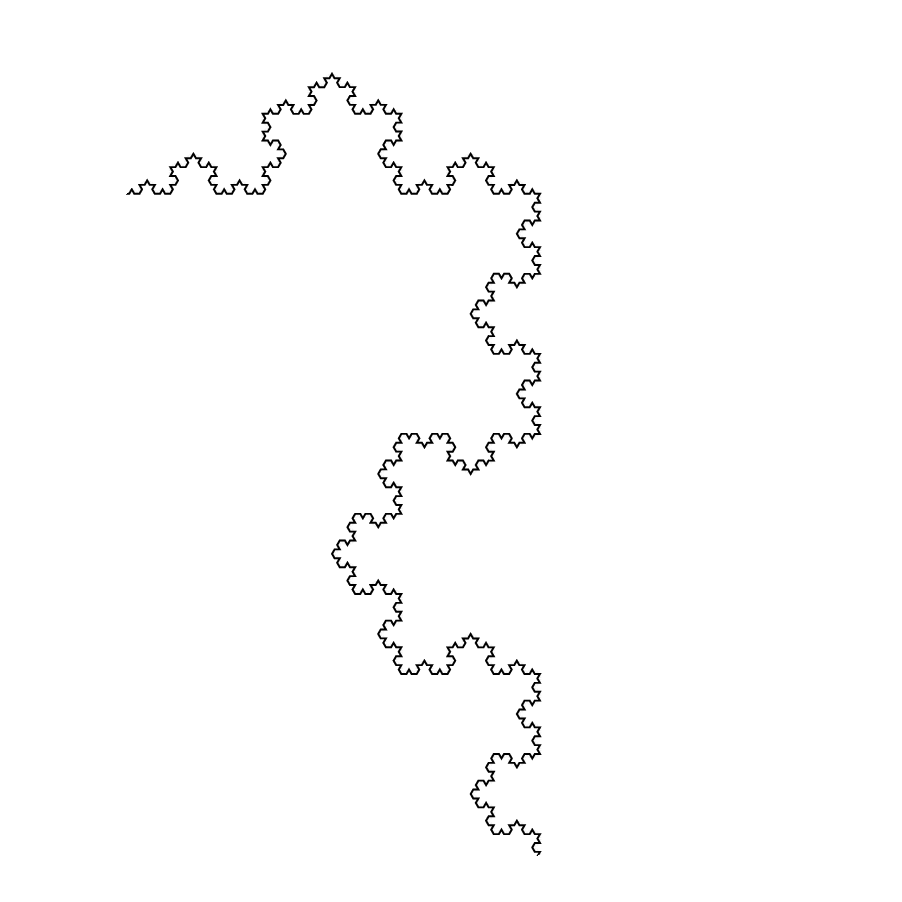] .imgref[[[stackexchange]](https://tex.stackexchange.com/questions/404925/animated-koch-snowflake)]


---
.header[Introduction]
## Abstraction

--
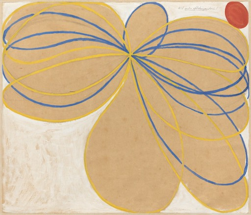  
  
.footnote[[[Hilma af Klint, Group V, The Seven-Pointed Star, 1908]](https://medium.com/as-mag/modern-mystic-hilma-af-klint-c4ef6c27467c)]  

---
.header[Introduction]
## Abstraction

  

.footnote[[[Francis Picabia, Quadrato rosso, Kazimir Malevich, 1915]](https://en.wikipedia.org/wiki/File:Francis_Picabia,_1912,_La_Source,_The_Spring,_oil_on_canvas,_249.6_x_249.3_cm,_Museum_of_Modern_Art,_New_York._Exhibited,_1912_Salon_d%27Automne,_Paris.jpg)]

---
.header[Introduction]
## Abstraction

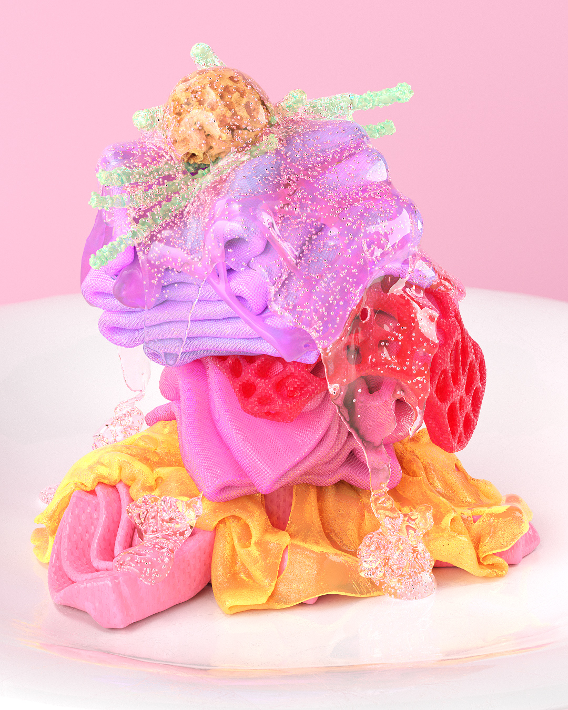  

.footnote[[[Albert Omoss]](https://omoss.io/)]  


---
.header[Introduction]
## Abstraction

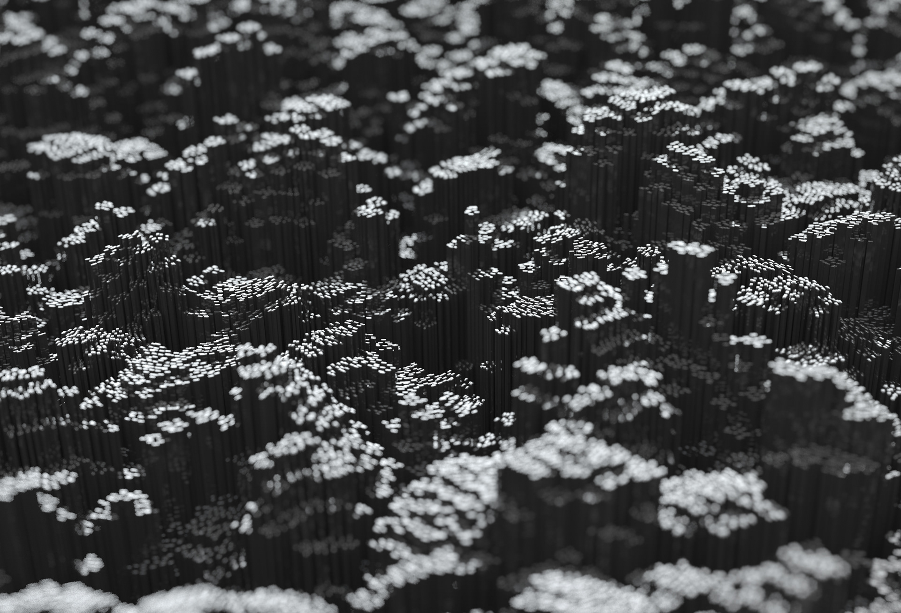  
  
.footnote[[[Lee Griggs]](https://leegriggs.com)]

---
.header[Introduction]
## Procedural Generation

--


---
.header[Introduction]
## Procedural Generation


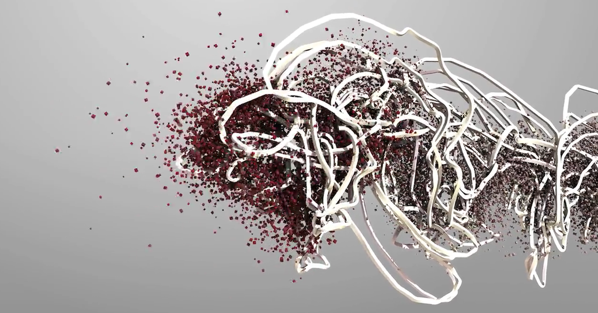  

.footnote[[Forms by Memo Akten and Quayola](https://vimeo.com/38017188)]


???
  

* Forms is a series of studies on human motion, and its reverberations through space and time. [...] Rather than focusing on observable trajectories, it explores techniques of extrapolation to sculpt abstract forms, visualizing unseen relationships – power, balance, grace and conflict – between the body and its surroundings.
  
* The project investigates athletes; pushing their bodies to their extreme capabilities, their movements shaped by an evolutionary process targeting a winning performance. Traditionally a form of entertainment in todays society with an overpowering competitive edge, the disciplines are deconstructed and interrogated from an exclusively mechanical and aesthetic point of view; concentrating on the invisible forces generated by and influencing the movement.
  
* The source for the study is footage from the Commonwealth Games. The process of transformation from live footage to abstract forms is exposed as part of the interactive multi-screen artwork, to provide insight into the evolution of the specially crafted world in which the athletes were placed.


---
## Unreal

  
.imgref[[[pcgamesn]](https://www.pcgamesn.com/unreal-engine-5-demo)]

--

> Always think about your work as creating a process, rather than a thing.  
  


---
template:inverse

# Beauty in Maths

???
  

---
## Beauty in Maths

--
* Learn about visual properties of some numbers and curves

--
* Get an intuition on how to use formulas in regard to their design space and their implementation

--
* Learn how to grow leaves like a plant

---
## Beauty in Maths

.center[.imgref[[[wiki]](https://commons.wikimedia.org/wiki/File:FibonacciSpiral.svg)]]  


???
  

* The above segmentation of an rectangle approximates the *golden spiral*. 
* We have a *golden* ratio if the ratio of two quantities is the same as the ratio of their sum to the larger of the two quantities.

$\frac{a+b}{a} = \frac{a}{b}$

---
## Beauty in Maths


  
.imgref[[[gofiguremath]](http://gofiguremath.org/natures-favorite-math/the-golden-ratio/the-golden-angle/)]

  
.imgref[[[fineartamerica]](https://fineartamerica.com/featured/1-golden-angle-thomas-festerscience-photo-library.html)]


???
  

* 
The best solution to *how far to turn from the last leaf* in degree is therefore $~137.5°$, and that is what all kinds of plants do.

---
## Beauty in Maths


  


???
  

* Vogel, H (1979). **A better way to construct the sunflower head**. Mathematical Biosciences 44 (44): 179–189.

---
## Beauty in Maths

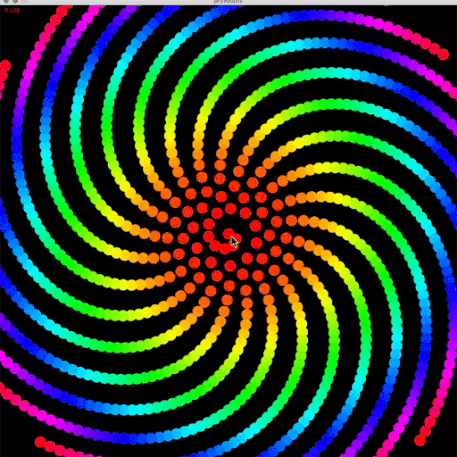  


???
  

* But the fascination doesn't stop here. If we change the angle from the golden angle to an arbitrary angle between 0..360 we get vastly different designs for only very small changes. The following code maps the angle to turn to the mouse position in x. Try the code for yourself!
* Fractions for the `ratio` value lead to spikes, while getting closer to an irrational number produces dense distributions:

---
## Beauty in Maths

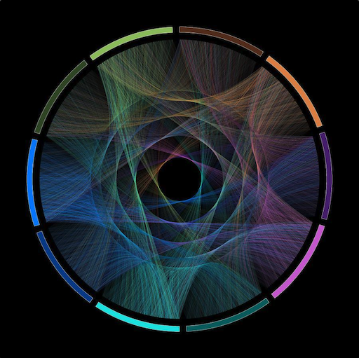  
[[fineartamerica]](https://fineartamerica.com/featured/flow-of-life-flow-of-pi-cristian-ilies-vasile.html)

---
## Beauty in Maths

### The Rose Curve

.center[.imgref[[[wiki]](https://en.wikipedia.org/wiki/Rose_(mathematics)]]  
  
---
## Beauty in Maths

.center[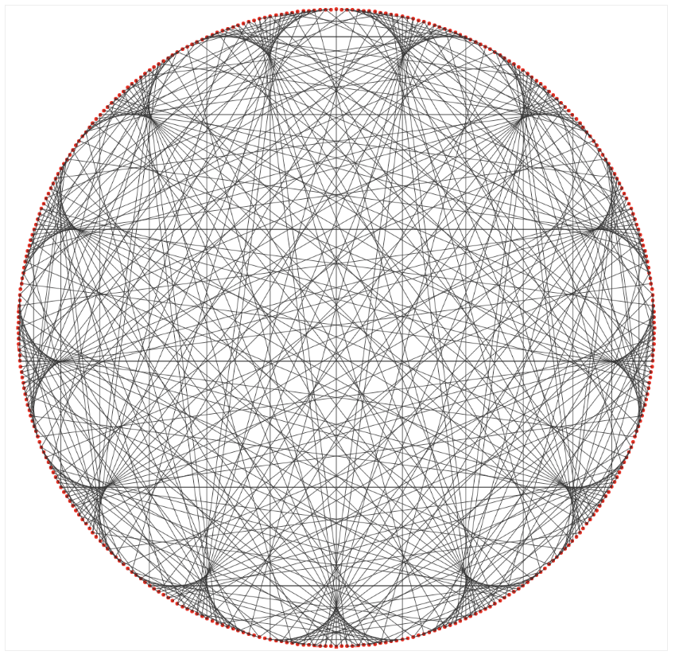]

---
template:inverse

# Function Design


???
  

With this chapter, you will

* gain an intuitive understanding of the visual qualities of different operators and function components.
* gain some understanding of how to put the different function components together to create a specific design goal.

---
## Function Design

Gain an understanding of

--

* the visual qualities of different operators and function components

--
* how to put the different function components together to create a specific design goal


---
## Function Design

.center[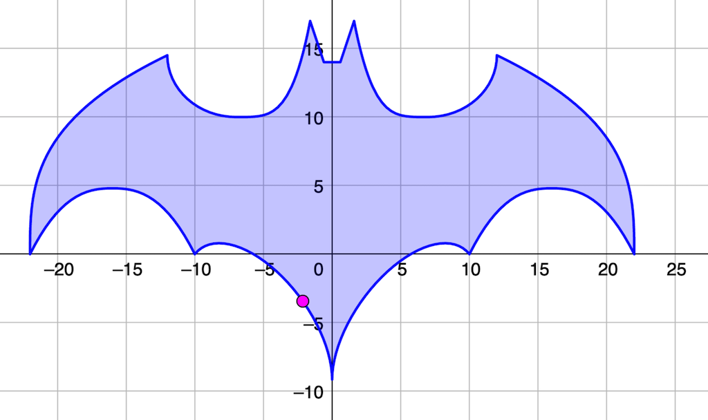  .imgref[[[geogebra]](https://www.geogebra.org/m/Wkjz2X92)]]


---
## Function Design

.center[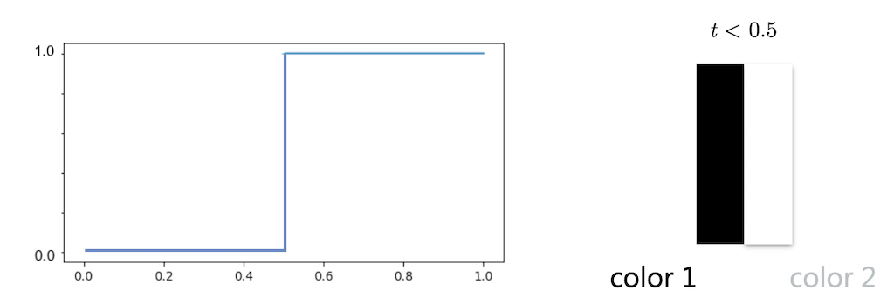]  

???
  

* The simplest of transitions is the step function, which switches between values based on a threshold, meaning with a fixed value that *t* is smaller or larger to.


---
## Function Design

.center[

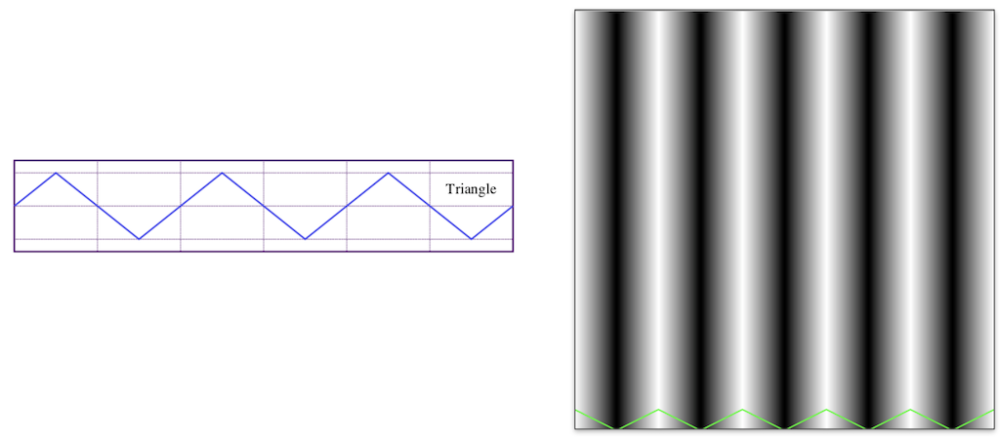]


???
  

* Often times we want to repeat certain visual features, which can be done in its simplest form e.g. with a `sin` function. However, there are several other design options. The following functions are also often called *wave functions*.
* Wave functions have as common properties
    * frequency (“*how often*”), and
    * amplitude (“*how much*”).


---
## Function Design


.center[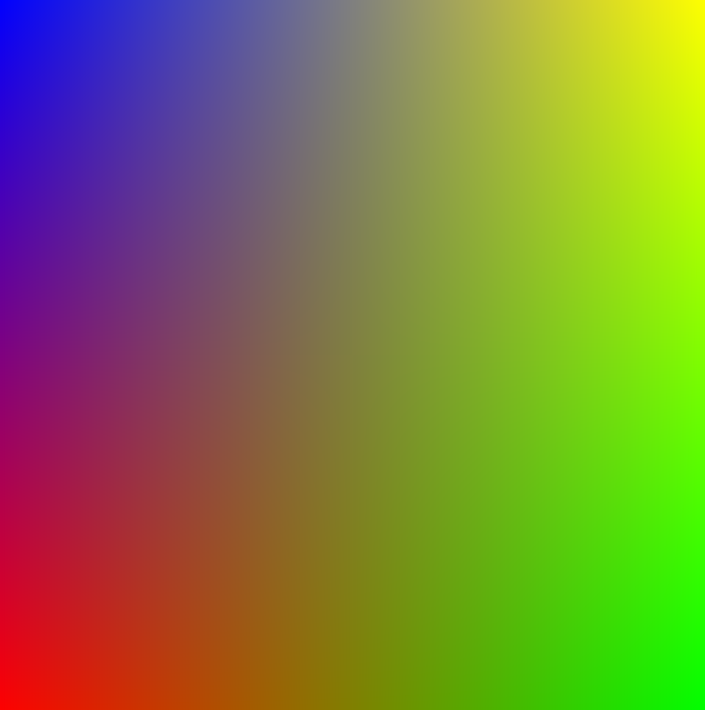]

---
## Function Design

.center[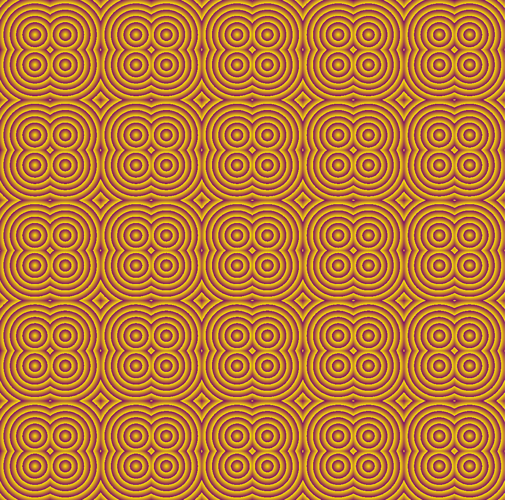]  

---
## Function Design


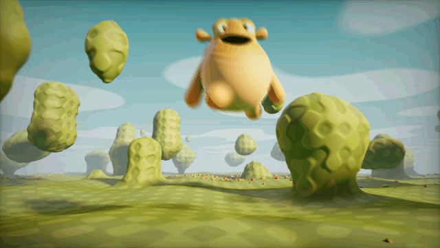  
.footnote[[Happy Jumping by Iq](https://www.shadertoy.com/view/3lsSzf)]


---
template:inverse

# Tilings

---
## Tilings


--
* Know about the formal world of tilings and be aware of their mathematical complex constructions

--
* Know which terms to investigate if you are further interested in the formal aspects of tilings

--
* Understand the design principles of Islamic art

--
* Learn about contexts and interpretations of geometry


---
## Tilings

So far, we have used simple grids to create repetitive patterns. However, grid with hexagons are also very commonly used!

.center[]


???
  

* In previous years I have explained how to create a hex tiling in glsl.
* Unreal would be the way to go: https://www.youtube.com/watch?v=hc6msdFcnA4

* https://www.youtube.com/watch?v=VmrIDyYiJBA


---
.header[Tilings]

## Hexagonal Grids


.center[]

---
.header[Tilings]

## Hexagonal Grids


.center[ ]

---
.header[Tilings]

## Hexagonal Grids


.center[ ]


---
.header[Tilings]

## Hexagonal Grids


.center[]

---
.header[Tilings]

## Hexagonal Grids


.center[ ]

---
.header[Tilings]

## Hexagonal Grids


.center[]

---
.header[Tilings]

## Hexagonal Grids


.center[ ]

---
.header[Tilings]

## Hexagonal Grids


.center[]

---
.header[Tilings]

## Hexagonal Grids


.center[ ]


???
  

* pattern_islamic_hex.frag


---
## Tilings

  
*Penrose rhomb tile* .imgref[[[aperiodictiling]](https://www.aperiodictiling.org/wpaperiodictiling/)] 


???
  

* What kind of tiling is this?
* A non-repeating pattern, is call an *aperiodic* tiling. Hence, a set of polygons that tile the plane but never form a periodic tiling.
  
* This means the pattern is not constructable by simple translations of potentially arbitrarily large periodic patches. Shifting an aperiodic tiling cannot produce the same tiling. 
* It is not possible to create the tiling by taking some (potentially very large) section and repeating it over and over again. 
* Around 1973/74 Roger Penrose found a set of two tiles that only tile non periodically. 


---
## Tilings

There is a new tile in town - the Einstein tile. 


???
  

After 50 years of almost no developments in finding new aperiodic tiles, a commoner fund a solution for a aperiodic tile with just one time (hence Ein-Stein tile)!

If you are interested, I highly recommend this great overview of the new developments:

[How a Hobbyist Solved a 50-Year-Old Math Problem (Einstein Tile)](https://www.youtube.com/watch?v=A1BhOVW8qZU&t=564s):

--

<iframe width="640" height="360" src="https://www.youtube.com/embed/A1BhOVW8qZU" title="How a Hobbyist Solved a 50-Year-Old Math Problem (Einstein Tile)" frameborder="0" allow="accelerometer; autoplay; clipboard-write; encrypted-media; gyroscope; picture-in-picture; web-share" referrerpolicy="strict-origin-when-cross-origin" allowfullscreen></iframe>


???
  

.center[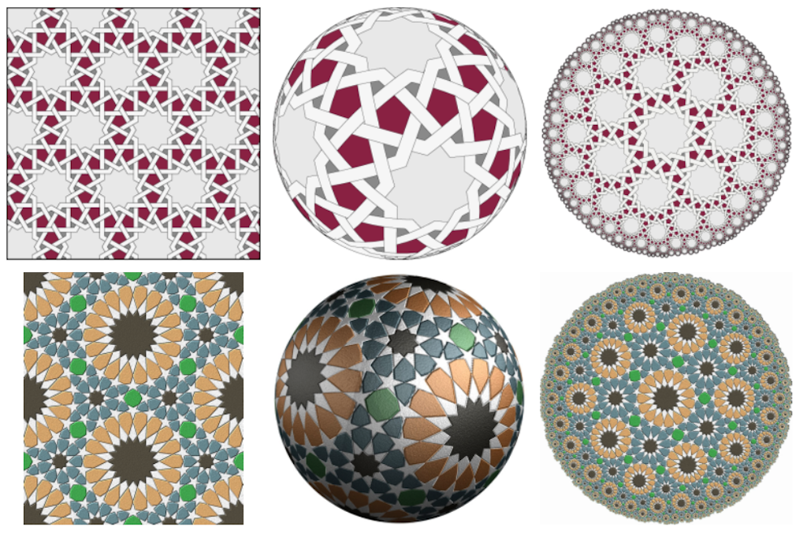]
  
[[Craig S. Kaplan]](http://www.cgl.uwaterloo.ca/csk/projects/starpatterns/)


* Computer generated star patterns, inspired by islamic art, applied to the Euclidean plane, the surface of the sphere, and the hyperbolic plane.

---
## Tilings

.center[]

.imgref[[[ricoflow]](https://www.youtube.com/watch?v=FqBWjJQKICk)]


---
## Tilings

.center[]  
  
.imgref[[[travelingalchemists]](https://travelingalchemists.wordpress.com/)] 


???
  

* The above image, depicts the *seed of life*, which is believed to be an ancient geometric universal symbol for all creation.
* Speaking of religion, there is a discipline called *sacred geometry*. Sacred geometry ascribes symbolic and sacred meanings to certain geometric shapes and certain geometric proportions. It is associated with the belief that god is a mathematician, specializing in geometry, applying this mastery when building the world. Here, the synchronicity of the universe is determined by certain mathematical constants, which express themselves in the form of patterns and cycles in nature. The geometry used in the design and construction of religious structures such as churches, temples, mosques, religious monuments, altars, and tabernacles has then sometimes been considered sacred. 

---
## Tilings

.center[]  

.imgref[[[etemetaphysical]](https://blog.etemetaphysical.com/seedoflife/)] 

???
  

* The above image, depicts the *seed of life*, which is believed to be an ancient geometric universal symbol for all creation.
* Speaking of religion, there is a discipline called *sacred geometry*. Sacred geometry ascribes symbolic and sacred meanings to certain geometric shapes and certain geometric proportions. It is associated with the belief that god is a mathematician, specializing in geometry, applying this mastery when building the world. Here, the synchronicity of the universe is determined by certain mathematical constants, which express themselves in the form of patterns and cycles in nature. The geometry used in the design and construction of religious structures such as churches, temples, mosques, religious monuments, altars, and tabernacles has then sometimes been considered sacred. 

???
  

.center[]

[[forgingmind]](https://www.forgingmind.com/collections/frontpage/products/bioluminescence)


---
template:inverse

# Noise Functions


---
## Noise Functions

Gain an understanding of 

--
* what a procedural noise function is and the requirements for it

--
* the different types of noise

--
* how to use noise

---
## Noise Functions

.center[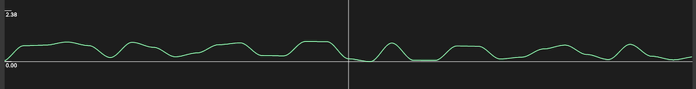]

```js

smooth_pseudo_noise(x) = smooth_saw(x) * step_random(x) 
                         + smooth_saw(x - 1) * (step_random(x - 1) * -1 + 1)
```

--

There is good noise and bad noise.


???
  

* Spatial correlation
* No periodicity
* A defined distribution
* Reproducibility


---
## Noise Functions

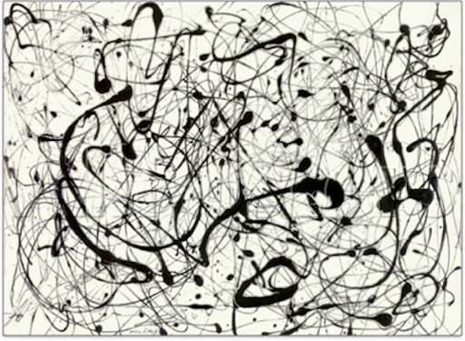  
.footnote[[[Jackson Pollock - Number 14 gray (1948)]](https://thebookofshaders.com/11/)]


---
## Noise Functions

  

.footnote[[[processing]](https://www.processing.org/examples/bouncybubbles.html)]


???
  

  
[[iquilezles]](http://www.iquilezles.org/)

---
## Noise Functions

.center[]
[[sidefx]](https://vimeo.com/75313908)

---
## Noise Functions

### Turbulence Noise

  
  


---
## Noise Functions

  

.footnote[[[Warping by Iq]](https://www.shadertoy.com/view/4s23zz)]


---
## Noise Functions

### Cellular Noise

 .imgref[[[thebookofshaders]](https://thebookofshaders.com/12/)]

--
  
 .imgref[[[wiki]](https://en.wikipedia.org/wiki/Voronoi_diagram#/media/File:Euclidean_Voronoi_diagram.svg)]

---
template:inverse

# Dynamics


---
## Dynamics

--
* An understanding of the different approaches to moving stuff,

--
* An understanding of the theoretical backgrounds of dynamics
    * Calculus
    * Velocity, acceleration, forces, ...
    * Newton’s Laws of Motion
--
* The ability to transfer the theory to examples of dynamic systems in Unreal


---
## Dynamics


???
  

In short, velocity is a *rate of change*.

Computations in regard to moving objects and changing locations are part of *[Calculus](https://en.wikipedia.org/wiki/Calculus)*, *the study of change*.  

---
## Dynamics

If we want to compute a new location for a point **p** over time t, we apply its velocity **v** and acceleration **a**:

**v'** = **v** + **a** · **Δt**  
**p'** = **p** + **v'** · **Δt**  

* Velocity measures the change in location over a certain time.
* Acceleration measures the change in velocity over time

---
## Dynamics

#### Newton’s Second Law of Motion

> Force equals mass times acceleration, hence **F** = **M** · **A**.  

With **F** as force, **M** as mass and **A** as acceleration.

--


---
## Dynamics

### Example Air and Fluid Resistance

  
.footnote[[[codingtrain]](https://editor.p5js.org/codingtrain/sketches/5V8nSBOS)]  

???
  

* Friction occurs when a body passes through a liquid or gas. This force is called a *drag force*, or a *viscous force*, or *fluid resistance*. With that we want to model e.g. a drag force for a liquid (the gray area).


---
template:inverse

# Particles

---
## Particles

Gain an understanding of

--
* the components of particles systems

--
* the characteristics for more natural movements with agents

--
* how to transfer the theory to examples of dynamic particle systems Unreal

---
## Particles

.center[]

---
## Particles

.center[]

.footnote[[[princeton.edu]](https://www.princeton.edu/news/2013/02/07/birds-feather-track-seven-neighbors-flock-together) *Flocks of birds.*, [[pinterest]](https://www.pinterest.de/pin/31243791139408749/) *A school of fish.*]

---
.header[Particles]

## Agency

.center[]

Agency as the desire to move in a certain way.

---
.header[Particles]

## Boids

.left-even[  
.imgref[[[codingtrain]](https://editor.p5js.org/codingtrain/sketches/ry4XZ8OkN)]]

.right-even[
* Separation  
* Alignment 
* Cohesion 
]

???
  

* The left slider adjusts the influence of alignment, the middle one cohesion and the right one separation
* http://www.basis64.nl/flocking3D/


## Fluids

Gain an understanding of

* what a fluid is an its properties
* the formal representation of a fluid
* a real-time solution for a fluid visualization in the context of VFX


## Fluids


.center[]  
[[Created with Wind Tunnel/Quanta Magazine]](https://www.quantamagazine.org/what-makes-the-hardest-equations-in-physics-so-difficult-20180116/)


## Fluids


---
template: inverse

# *That's it!*

---
template:inverse

# *What Next?*


---
.header[*What Next?*]

## Unreal

--
* C++ in Unreal

--
* Procedural Content Generation

---
.header[*What Next?* | Unreal]

## Procedural Content Generation 

.center[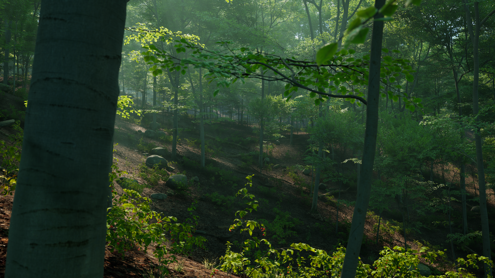] .imgref[[[epicgames]](https://dev.epicgames.com/documentation/en-us/unreal-engine/procedural-content-generation-overview?application_version=5.3)]

---
.header[*What Next?*]

## Unreal

* C++ in Unreal
* Procedural Content Generation
* Motion Design

---
.header[*What Next?* | Unreal]

## Motion Design

.left-even[]  
<br /><br /><br /><br />
By Linus Käpling


---
.header[*What Next?*]

## Unreal

* C++ in Unreal
* Procedural Content Generation
* Motion Design
* Player mode / VR

---
.header[*What Next?*]


## CTech Workshops

--
* Shader Programming (WS2627)

--
* Materials & Shading (WS2627)

--
* Fluids & Volumes (?)

--
* Houdini (VFX)

---
.header[*What Next?*]

## Projects

Does it makes sense for you

--
* ...to have procedural generation in your set of skills? If yes, 
    * with which tool do you want to work with?
    * which outputs / designs / setups are you aiming for?
--
* ...to have Unreal in your set of skills? If yes, 
    * which Unreal topic so you want to look into next?
    * which outputs / designs / setups are you aiming for?


---
template:inverse

## The End

# 👋🏻
