name: inverse
layout: true
class: center, middle, inverse
---

# Procedural Generation and Simulation

### Prof. Dr. Lena Gieseke | l.gieseke@filmuniversitaet.de  

#### Film University Babelsberg KONRAD WOLF

---
template:inverse

# Fluid Simulation

???
  

* What do you consider a fluid?

---
layout: false

## Fluids

.center[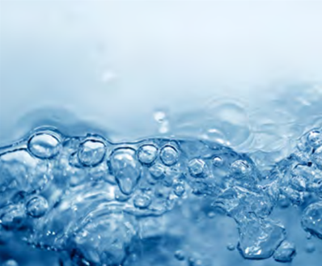] .imgref[[[factspage]](https://factspage.blogspot.com/2013/12/what-is-fluid.html)]

---
## Fluids

.center[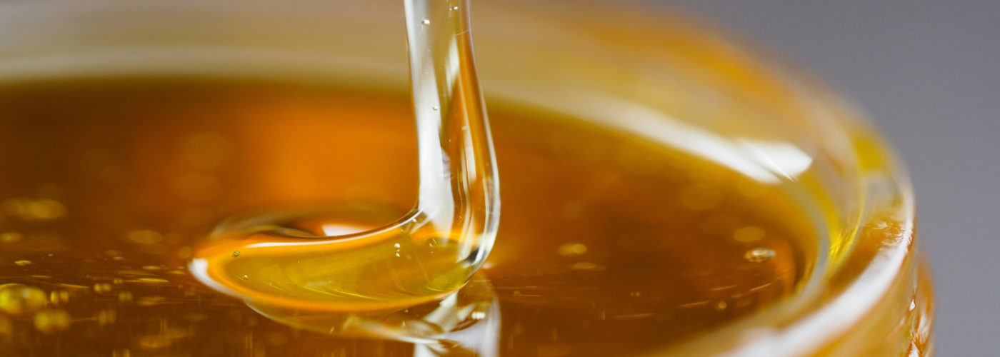] .imgref[[[organiclifestylemagazine]](https://www.organiclifestylemagazine.com/is-your-honey-actually-honey)]

---
## Fluids

.center[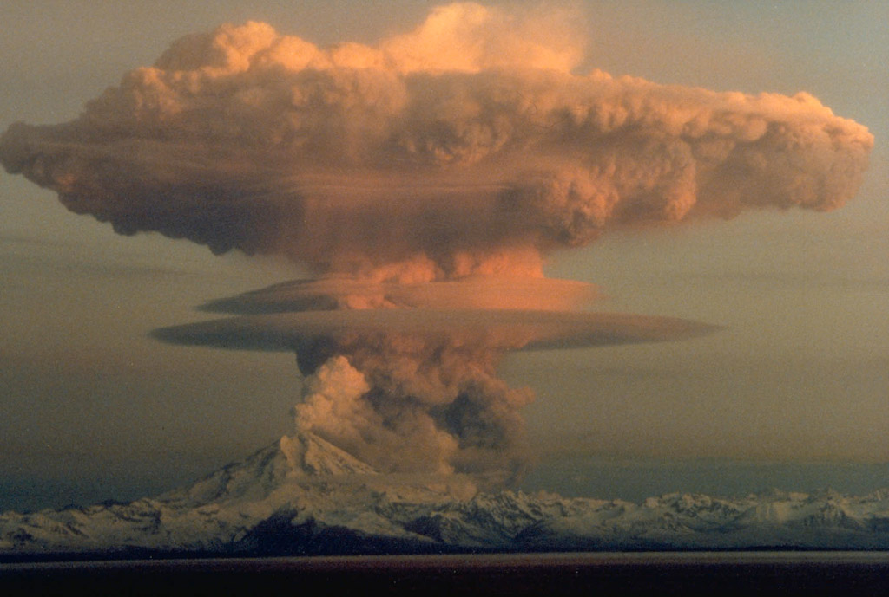] .imgref[[[wiki]](https://www.wikiwand.com/en/Gas)]

???
  

* 21 April 1990 eruption of Mount Redoubt, Alaska, illustrating real gases not in thermodynamic equilibrium. 

---
## Fluids

.center[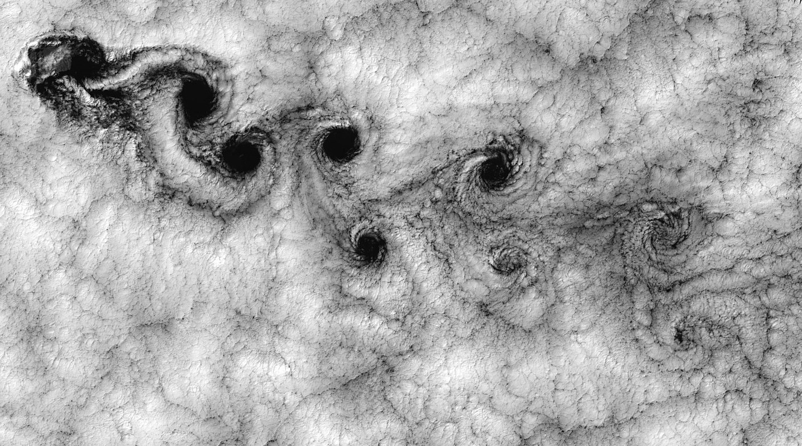] .imgref[[[wiki]](https://www.wikiwand.com/en/Gas)]

???
  

* Satellite view of weather pattern in vicinity of Robinson Crusoe Islands on 15 September 1999, shows a turbulent cloud pattern called a Kármán vortex street

---
## Fluids

.center[] .imgref[[[wiki]](https://www.wikiwand.com/en/Gas)]

---
## Fluids

.center[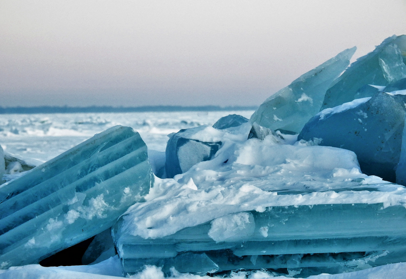] .imgref[[[freep]](https://eu.freep.com/story/news/local/michigan/2019/02/08/blue-ice-great-lakes-michigan/2780668002/)]

  
---
## Fluids

--

* Liquid
* Gas
* Any material that continuously deforms, e.g. ice

???
  

* Which main properties do fluids have?

--

The main defining physical properties are

--
* permanent deformation (*flowing*),

???
  

* resisting only relative rates of deformation in a dissipative, frictional manner, and

--
* under applied shear stress, or external force.

.footnote[[[wiki]](https://www.wikiwand.com/en/Fluid)]

???
  

* also described as the ability to take on the shape of the container
* In physics, a fluid is a liquid, gas, or other material that continuously deforms (flows) under an applied shear stress, or external force.[1] They have zero shear modulus, or, in simpler terms, are substances which cannot resist any shear force applied to them. 
* Shear stress acts parallel to the surface
* Depending upon the medium, shear stress may cause a change in fluid flow between layers. 

---
## Fluids

In physics, fluids are usually represented as particle systems.

.center[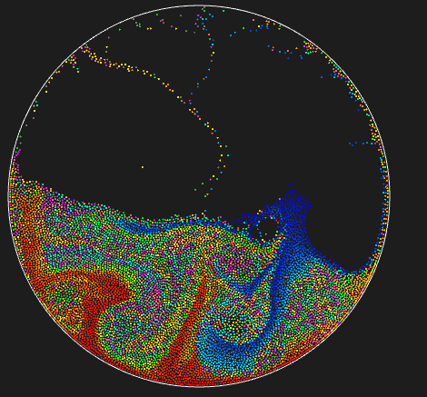] .imgref[[[ttnghia]](https://ttnghia.github.io/posts/fluid-simulation-2d/)]

???
  

* https://ttnghia.github.io/posts/fluid-simulation-2d/
* Liquid particles, e.g. pile to the ground where as gas particles would take up the whole space of the container.

---
## Fluids

In physics, fluids are usually represented as particle systems.

.center[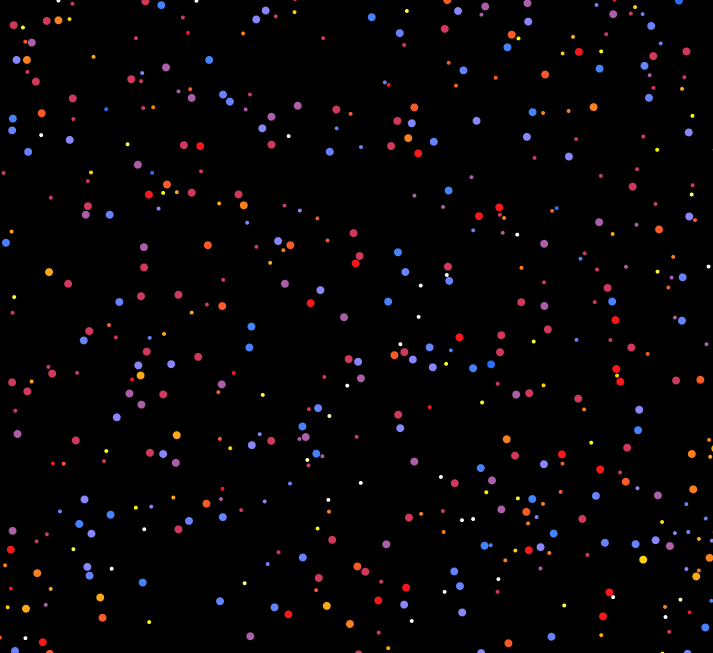] .imgref[[[falstad]](https://www.falstad.com/gas/)]

???
  

* https://www.falstad.com/gas/
* Liquid particles, e.g. pile to the ground where as gas particles would take up the whole space of the container.
* Fluids can mix with other fluids

---
## Fluids' Properties

--
* Density
    * Mass per volume

.footnote[[The following list is based on: [Understanding liquids for dynamic simulations - Houdini 18]](https://www.youtube.com/watch?v=fcJSG2ooh1M)]

---
## Fluids' Properties

.left-even[
* Density
    * Mass per volume
* Viscosity
    * Resistance to deformation
]

.right-even[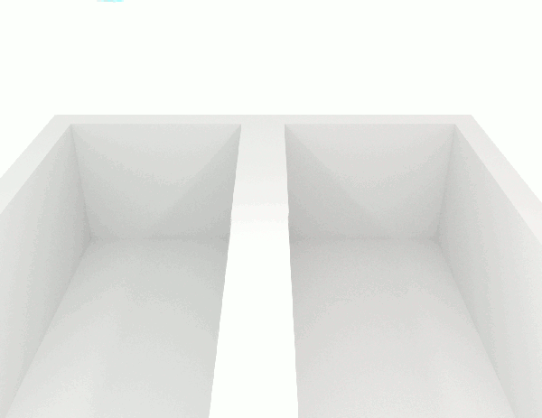  
.imgref[[[wiki]](https://www.wikiwand.com/en/Viscosity)]]

---
## Fluids' Properties

* Density
    * Mass per volume
* Viscosity
    * Resistance to deformation
* Temperature
    * Aggregation states
???
  

* Water, e.g., ice, water, gas

--
* Cohesion and adhesion
    * Surface attraction

---
.header[Fluids' Properties]
## Cohesion and Adhesion

.center[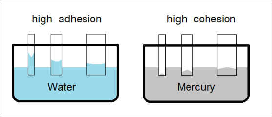]  
.imgref[[[wiki]](https://www.wikiwand.com/en/Cohesion_(chemistry)]

---
.header[Fluids' Properties]
## Cohesion and Adhesion

.center[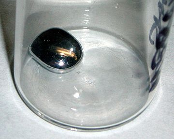]  
.imgref[[[quora]](https://www.quora.com/What-is-cohesion-adhesion-in-fluid-mechanics?redirected_qid=22078838)]

---
## Fluids' Properties

* Density
    * Mass per volume
* Viscosity
    * Resistance to deformation
* Temperature
    * Aggregation states
* Cohesion and adhesion
    * Surface attraction
* Surface tension

---
.header[Fluids' Properties]
## Surface Tension

.center[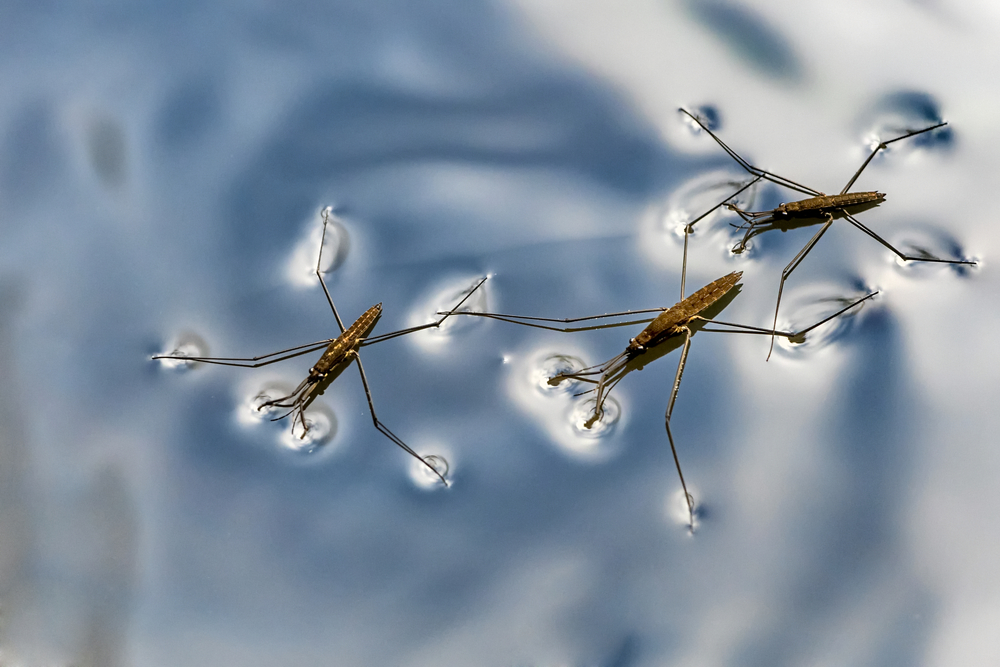]  
.imgref[[[scienceabc]](https://www.scienceabc.com/pure-sciences/what-is-surface-tension-definition-causes-examples.html)]

???
  

* simply put, surface tension is the tendency of molecules of a liquid to be attracted more towards one another at the surface of a liquid than to the air above it.
* As mentioned earlier, surface tension is important for water striders, one of the few creatures who can move across the surface of water without falling in. This phenomenon is because the strider’s legs are “nonwettable”, meaning that the striders’ legs repel water and capture air, allowing them to essentially depress the surface of the water, without breaking it. The hairs also increase the water striders’ surface area, which means less force is being exerted on the surface of the water. It is a mind-boggling combination of delicate force and ideal adaptation.
  
* Color
* Transparency

---
.header[Fluids' Properties]

## Example - Water

.center[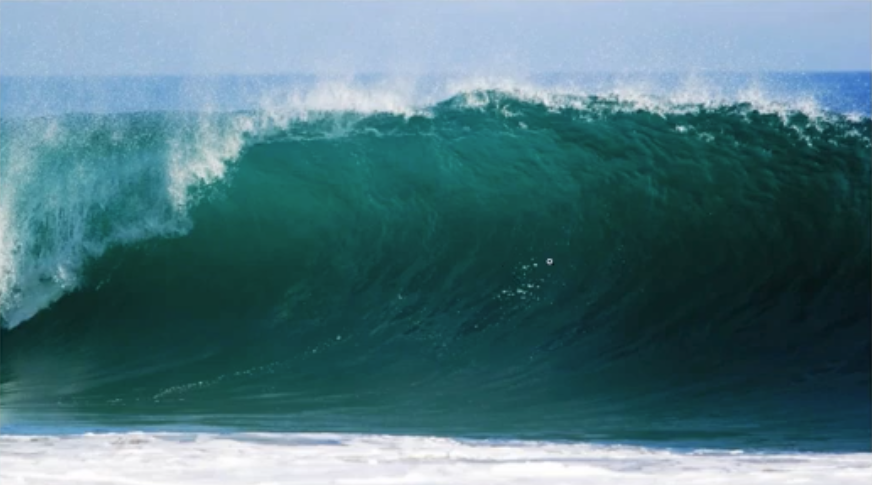  
.imgref[[[VoxelFX]](https://www.youtube.com/watch?v=fcJSG2ooh1M)]]  

???
  

* What else do you see here?

---
.header[Fluids' Properties]

## Example - Water

.center[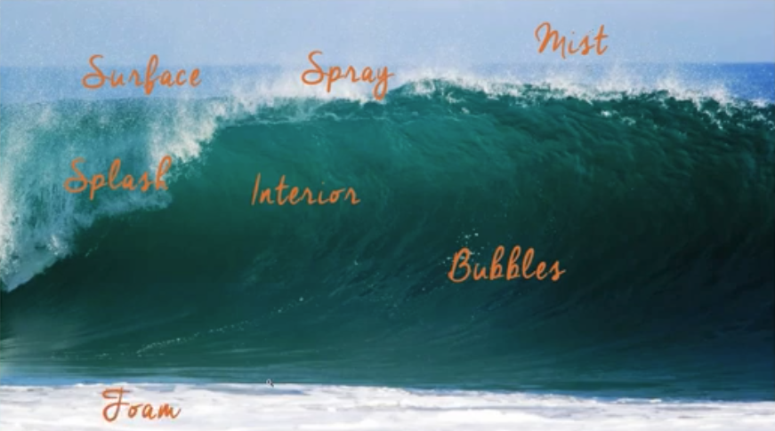  
.imgref[[[VoxelFX]](https://www.youtube.com/watch?v=fcJSG2ooh1M)]]  

---
template:inverse

## Navier-Stokes Equations

---
.header[Fluid Simulation]

## Navier-Stokes Equations

.center[  
.imgref[[MIT]]]  

---
.header[Fluid Simulation]

## Navier-Stokes Equations

.center[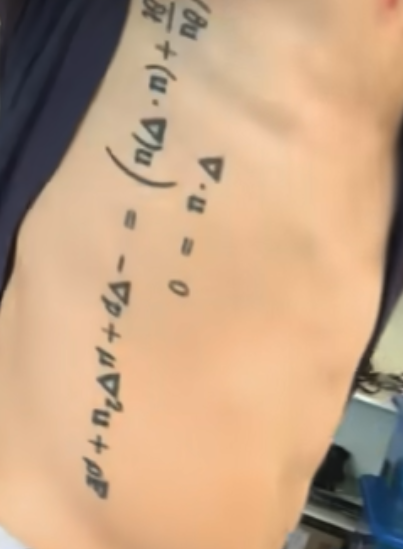 .imgref[[Numberphile]]]  

---
.header[Fluid Simulation]

## Navier-Stokes Equations

Mathematical model for describing dynamic motion of incompressible fluids.

--

> How fluids flow...

???
  

* This equation can model any fluid
* A fluid changes shape to match the container it is contained in
* https://www.ibiblio.org/e-notes/webgl/gpu/fluid.htm
* These equations are at the heart of fluid flow modeling. Solving them, for a particular set of boundary conditions (such as inlets, outlets, and walls), predicts the fluid velocity and its pressure in a given geometry.

--

.center[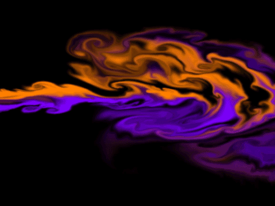] .imgref[[[Created with Wind Tunnel/Quanta Magazine]](https://www.quantamagazine.org/what-makes-the-hardest-equations-in-physics-so-difficult-20180116/)]

---
## Fluids

.center[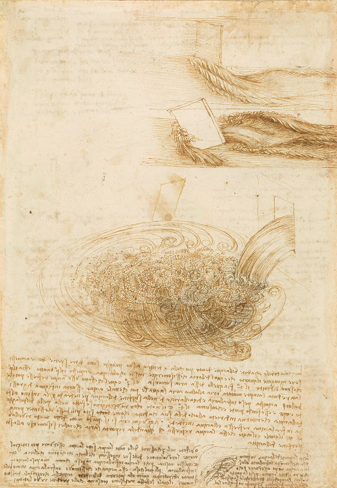 .imgref[[[wiki]](https://simple.wikipedia.org/wiki/Fluid_mechanics)]]  

---
.header[Fluid Simulation]

## Navier-Stokes Equations

Based on

--
1. Conservation of mass

???
  

* The incompressibility of the fluid

--

.center[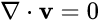] 

???
  

* v as speed with a direction
* Nabla is a gradient, a derivative -> do differentiate
    * Change in x, change in y, change in z
* The equal zero tells us that mass is conserved
    * Newton's Second Law for fluids, stating that mass times the acceleration of fluid particles is proportional to the forces acting on them. 
    * Mass cannot be created nor destroyed

---
.header[Fluid Simulation]

## Navier-Stokes Equations

Based on

1. Conservation of mass
2. Conservation of momentum
  
--
  
Newton's 2nd law of motion:

.center[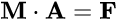] 

---
.header[Fluid Simulation]

## Navier-Stokes Equations

.center[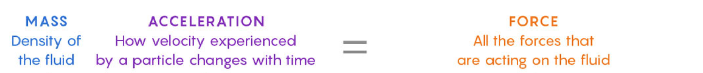] 

.footnote[[[Quanta Magazine - What Makes the Hardest Equations in Physics So Difficult?]](https://www.quantamagazine.org/what-makes-the-hardest-equations-in-physics-so-difficult-20180116/)]

---
.header[Fluid Simulation]

## Navier-Stokes Equations

.center[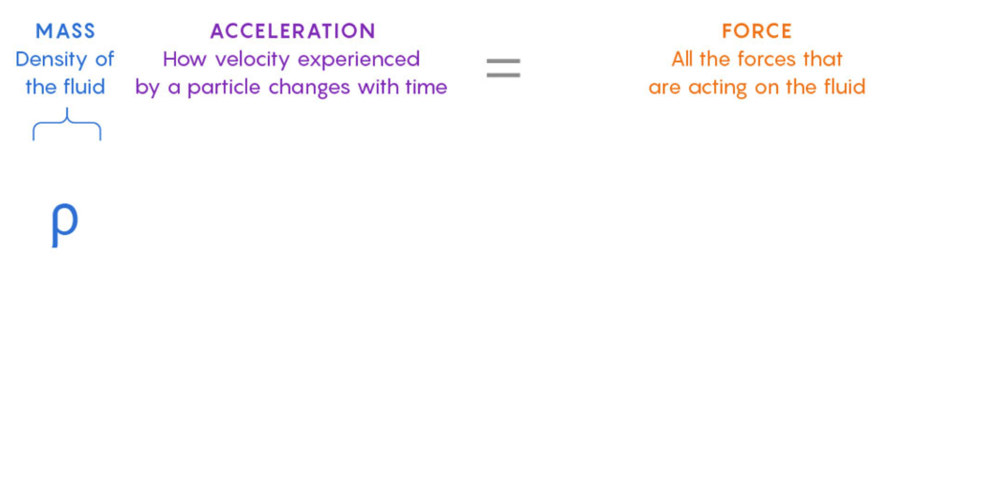] 

.footnote[[[Quanta Magazine - What Makes the Hardest Equations in Physics So Difficult?]](https://www.quantamagazine.org/what-makes-the-hardest-equations-in-physics-so-difficult-20180116/)]

???
  

* Mass is here a density, they are the same thing when it comes to fluids

---
.header[Fluid Simulation]

## Navier-Stokes Equations

.center[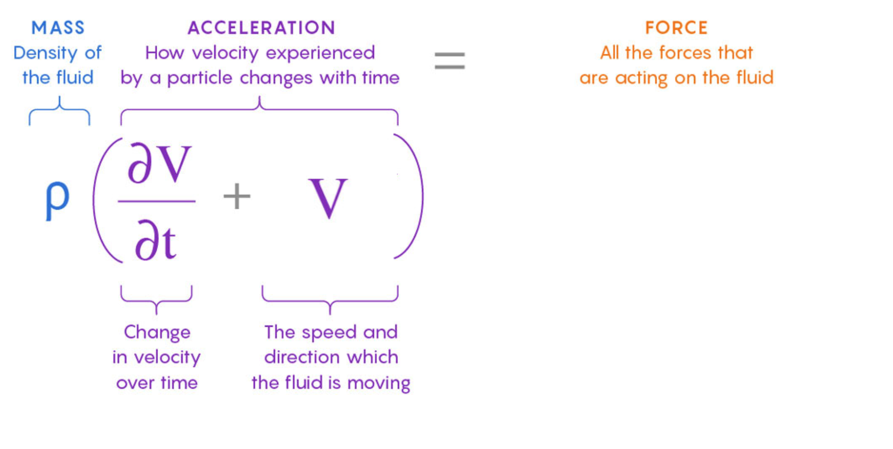] 

.footnote[[[Quanta Magazine - What Makes the Hardest Equations in Physics So Difficult?]](https://www.quantamagazine.org/what-makes-the-hardest-equations-in-physics-so-difficult-20180116/)]

---
.header[Fluid Simulation]

## Navier-Stokes Equations

.center[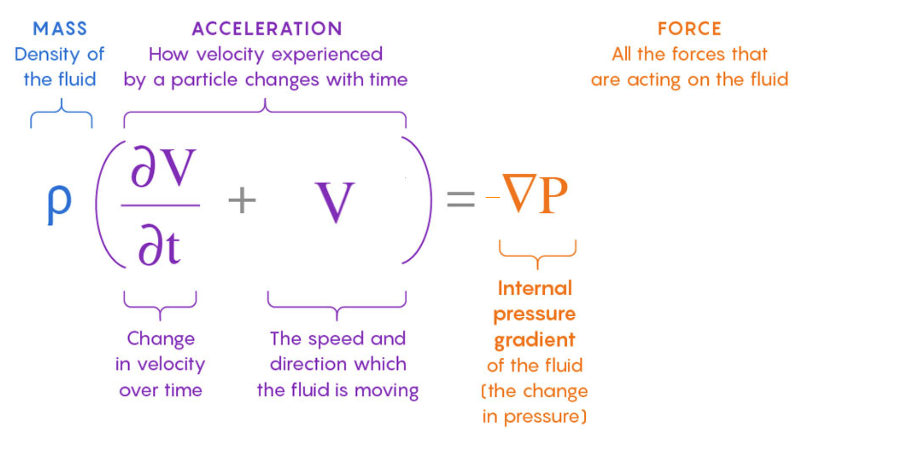] 

.footnote[[[Quanta Magazine - What Makes the Hardest Equations in Physics So Difficult?]](https://www.quantamagazine.org/what-makes-the-hardest-equations-in-physics-so-difficult-20180116/)]

???
  

* The first two terms: the internal forces, force between the internal particles
    * P is the change in pressure, fluids have the tendency to flow from high pressure areas to low pressure areas.
    * the middle term is viscosity, a higher the values the higher the friction between the fluid's particles (air vs. honey)

---
.header[Fluid Simulation]

## Navier-Stokes Equations

.center[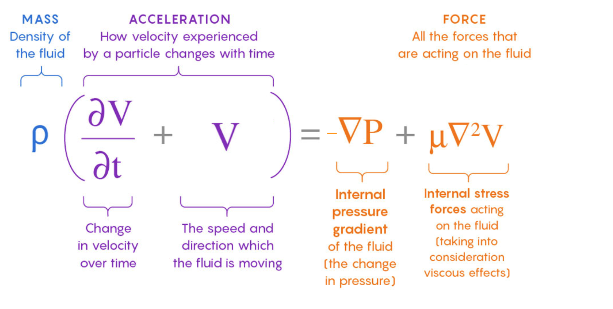] 

.footnote[[[Quanta Magazine - What Makes the Hardest Equations in Physics So Difficult?]](https://www.quantamagazine.org/what-makes-the-hardest-equations-in-physics-so-difficult-20180116/)]

???
  

* The first two terms: the internal forces, force between the internal particles
    * P is the change in pressure, fluids have the tendency to flow from high pressure areas to low pressure areas.
    * the middle term is viscosity, a higher the values the higher the friction between the fluid's particles (air vs. honey)

---
.header[Fluid Simulation]

## Navier-Stokes Equations

.center[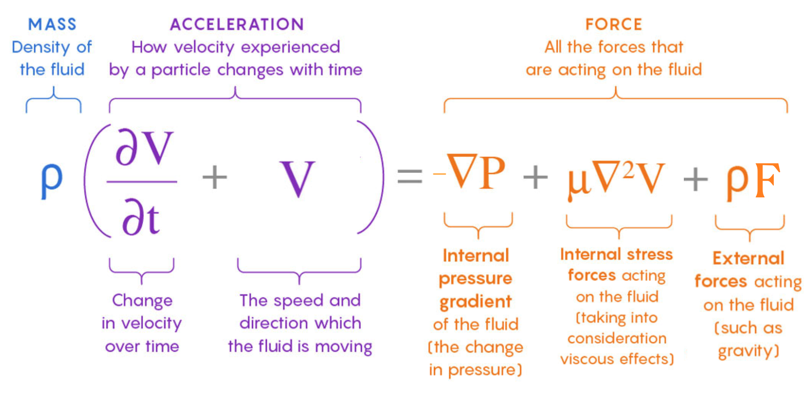] 

.footnote[[[Quanta Magazine - What Makes the Hardest Equations in Physics So Difficult?]](https://www.quantamagazine.org/what-makes-the-hardest-equations-in-physics-so-difficult-20180116/)]

???
  

* F are the external forces
    * Gravity
    * Walls
    * Wind

---
.header[Fluid Simulation]

## Navier-Stokes Equations

  
#### 1. Conservation of mass:  
  
  
  
#### 2. Conservation of momentum:   
   
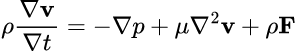

???
  

* A time derivative of velocity is acceleration
* rho is the density, hence we have mass times acceleration
* The right side is pretty much the sum of various forces

* This formula should be pretty straight forward:
    * Masses are conserved, Newton's second law, everything makes sense
    * nothing anyone can disagree with, based on standard laws of physics
* Practically we are happy with Navier-Stokes. It is not enough for mathematicians to know that it works in every case we can think of, they want proof.
* https://texmex.mit.edu/pub/emanuel/CLASS/12.340/navier-stokes%282%29.pdf

--

After nearly 200 years of experiments, it’s clear the equations work: The flows predicted by Navier-Stokes consistently match flows observed in experiments. 

.footnote[[[Quanta Magazine - What Makes the Hardest Equations in Physics So Difficult?]](https://www.quantamagazine.org/what-makes-the-hardest-equations-in-physics-so-difficult-20180116/)]

--

But mathematically they do not behave!

???
  

* If you’re a physicist working in a lab, that correspondence might be enough. But mathematicians want to know more than that — they want to be able to check if one can follow the equations all the way through, to see exactly how a flow changes moment by moment (for any initial configuration of a fluid) and even to pinpoint the onset of turbulence.
* “The behavior of fluids provides surprises,” said Fefferman. “The surprises are in principle explained by the fundamental equations that tell fluids how to move, but getting from the equations that tell fluids how to move to any description of how fluids actually move is very mysterious.”

---
.header[Fluid Simulation]

## Navier-Stokes Equations

Mathematically, a solution must (from any starting conditions, indefinitely far):

* exists
* be unique
* be smooth and well behaved

???
  

* Solutions exists for tiny values and finite time

--

In three dimensions Navier-Stokes solutions might blow up!

.footnote[[[Navier-Stokes Equations - Numberphile]](https://www.youtube.com/watch?v=ERBVFcutl3M)]

???
  

* Navier-Stokes Equations lead to impossible results
* It works and it is well behaved in 2D
* In a blowup scenario you’d say the equations break down and solutions don’t exist

---
.header[Fluid Simulation]

## Navier-Stokes Equations

.center[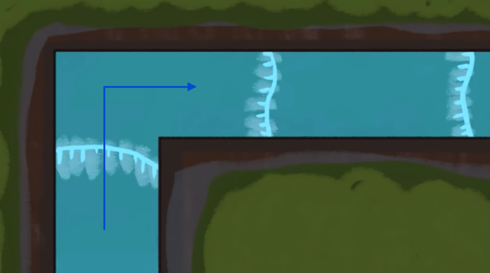] .imgref[[[Navier-Stokes Equations - Numberphile]](https://www.youtube.com/watch?v=ERBVFcutl3M)]

---
.header[Fluid Simulation]

## Navier-Stokes Equations

.center[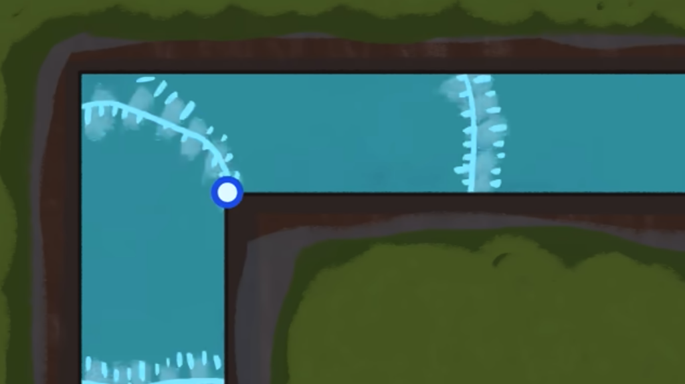] .imgref[[[Navier-Stokes Equations - Numberphile]](https://www.youtube.com/watch?v=ERBVFcutl3M)]

???
  

* If you would build this canal you would be happy, you can compute the flow everywhere... except of at that corner.

---
.header[Fluid Simulation]

## Navier-Stokes Equations

.center[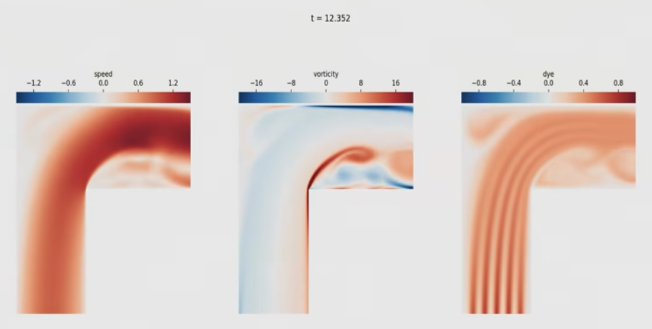]  .imgref[[[Navier-Stokes Equations - Numberphile]](https://www.youtube.com/watch?v=ERBVFcutl3M)]

???
  

* The value at the corner grows to infinity
* A particle in the fluid is moving infinitely fast
* What e.g. a computer presents as a solution is physically not possible. There is something missing the in the equation.
* Similar how division works: there is just this one glitch, if you divide by zero it doesn't work.

---
.header[Fluid Simulation]

## Navier-Stokes Equations

Turbulence is one of the least understood parts of the physical world.

--

.center[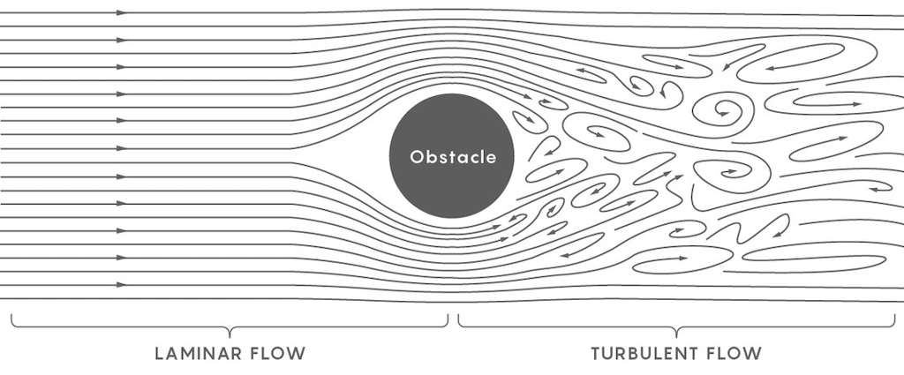] .imgref[[[Lucy Reading-Ikkanda/Quanta Magazine]](https://www.quantamagazine.org/what-makes-the-hardest-equations-in-physics-so-difficult-20180116/)]

???
  

* Different parts of the flow move in different directions at different velocities.
* Turbulence is always averaged. It is not mathematically correct.
  
* When you start modeling a flow using Navier-Stokes, your fluid will have some initial amount of energy. But in a turbulent flow, that energy can get concentrated. Instead of being distributed evenly across the river, kinetic energy may gather in arbitrarily small eddies, and particles in those eddies could (theoretically) be accelerated to infinite velocity.
* The difficulty of the mathematics of the equation is, in some sense, an exact reflection of the complexity of the turbulent flows they’re supposed to be able to describe.

---
.header[Fluid Simulation]

## Navier-Stokes Equations

.center[] .imgref[[[Created with Wind Tunnel/Quanta Magazine]](https://www.quantamagazine.org/what-makes-the-hardest-equations-in-physics-so-difficult-20180116/)]

???
  

* Approximation: averaging, discretized, Rynolds averaging

---
.header[Fluid Simulation]

## Navier-Stokes Equations

.center[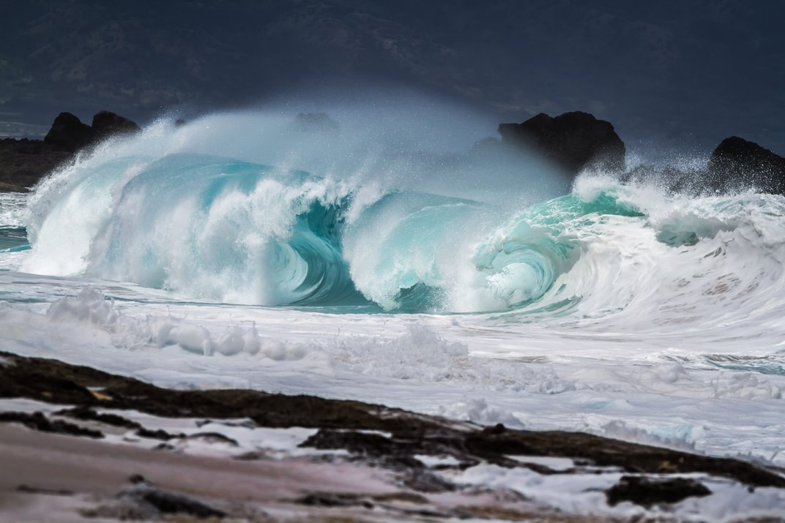] .imgref[[[smithsonianmag]](https://photocontest.smithsonianmag.com/photocontest/detail/big-crashing-wave-on-the-beach/)]

???
  

* Two waves crashing into each other, that is as random and chaotic as it can get in the physical world. (if you do it again, you do not expect the same outcome)

---
.header[Fluid Simulation]

## Navier-Stokes Equations

You get a $1 million reward, as a problem of the [Millennium Problems](http://www.claymath.org/millennium-problems), if you

--

> ...further our understanding of the Navier-Stokes equation.

--

E.g.,

--
* Prove that solutions will always exist

--
* Prove that the maximum velocity of any particle within the fluid stays bounded below some finite number

.footnote[[[Navier-Stokes Equations - Numberphile]](https://www.youtube.com/watch?v=ERBVFcutl3M), [[Quanta Magazine - What Makes the Hardest Equations in Physics So Difficult?]](https://www.quantamagazine.org/what-makes-the-hardest-equations-in-physics-so-difficult-20180116/)]

---
template:inverse

## Real-Time Fluid Dynamics Simulation

---
.header[Fluid Simulation]

## Real-Time Simulation

.center[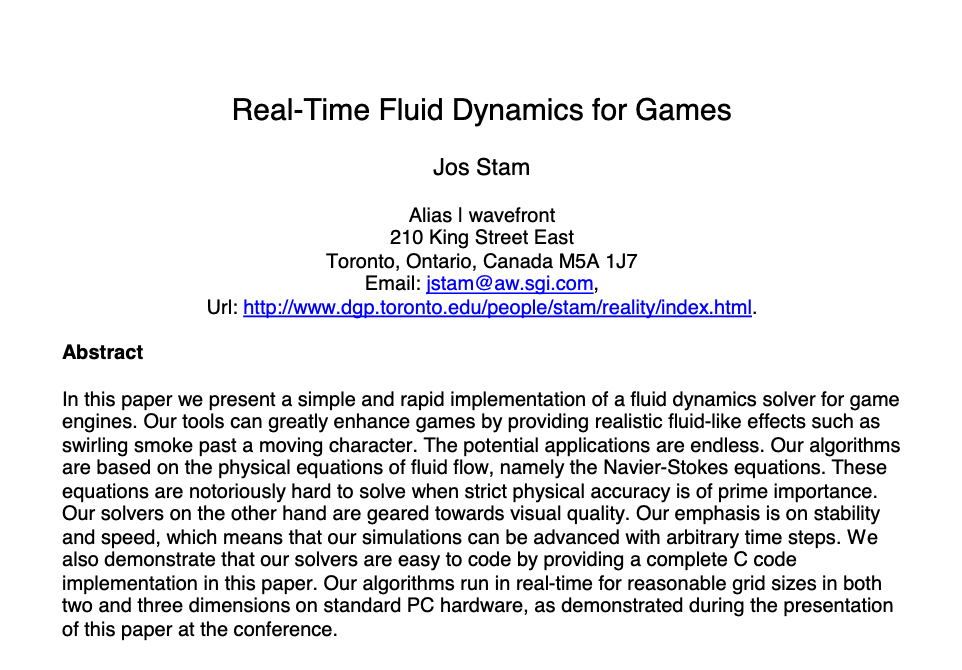[[Stam]](https://www.dgp.toronto.edu/public_user/stam/reality/Research/pub.html)]

---
.header[Fluid Simulation]

## Real-Time Simulation

... (another time).

---
.header[Fluid Simulation]

## Real-Time Simulation

* Algorithm custom tailored for visual effects

--
* Explicitly stabilized, no blow ups

--
* Discretized representation, hence only an approximation

---
.header[Fluid Simulation | Real-Time Simulation]

## Representation

Instead of following particles, we work with a stationary, same-size grid with cells.

.center[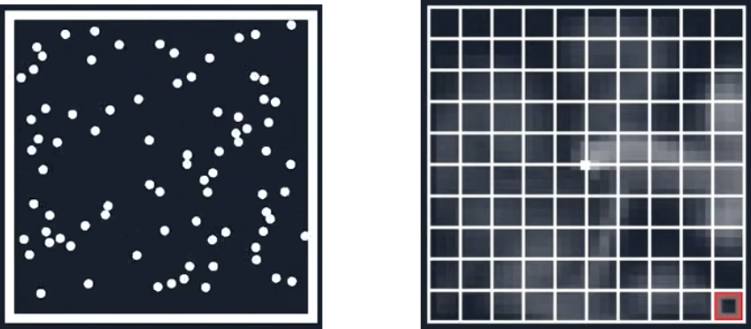  

.imgref[[[Gonkee]](https://www.youtube.com/watch?v=qsYE1wMEMPA)]]

???
  

* Each grid cell saves values such as velocity, density, temperature, etc.
* https://developer.nvidia.com/gpugems/gpugems3/part-v-physics-simulation/chapter-30-real-time-simulation-and-rendering-3d-fluids

---
.header[Fluid Simulation | Real-Time Simulation]

## Representation

--
* Values can change over time

--
* Values are vectors, e.g. for velocity

--

.center[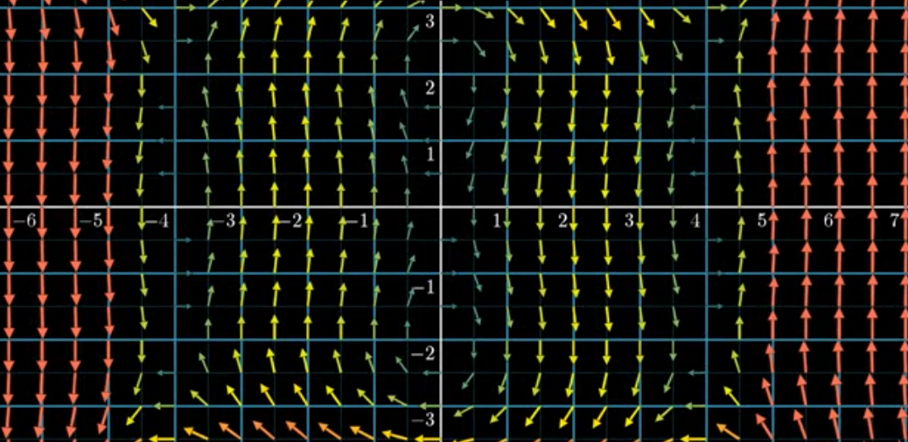] .imgref[[[3Blue1Brown]](https://www.youtube.com/watch?v=rB83DpBJQsE)]

???
  

* How fast and in which direction is the fluid moving?

---
.header[Fluid Simulation | Real-Time Simulation]

## Velocity Field

 .imgref[[[3Blue1Brown]](https://www.youtube.com/watch?v=rB83DpBJQsE)]
  
--
  
* Naive approach: follow a particle through the grid by applying the velocity of each cell

???
  

* A particle is moved through the grid by applying the surrounding velocities given by the field.

--
* For all particles this becomes prohibitively expensive

---
.header[Fluid Simulation | Real-Time Simulation]

## Velocity Field

 .imgref[[[3Blue1Brown]](https://www.youtube.com/watch?v=rB83DpBJQsE)]
  

> Single particles are replaced by a density function, which for every point in space tells us the amount of particles present.

--

* E.g., use density values as color

???
  

* The density usually takes values between zero and one: where there is no smoke the density is zero, and elsewhere it indicates the amount of particles present

---
.header[Fluid Simulation | Real-Time Simulation]

## Velocity Field

* Follow the density function through the velocity field

???
  

* Instead of following particles through the velocity field, we follow a density function through the velocity field.

--

> The Navier-Stokes Equations are a precise description of the evolution of a density field through a velocity field over time.

???
  

* Given the current state of the velocity and a current set of forces, the equations tell us precisely how the velocity will change over an infinitesimal time step

--

Jos Stamos's algorithms re-models certain qualities of the equation!

---
.header[Fluid Simulation | Real-Time Simulation]

## Data Structure

--
* A velocity field,

???
  

* The velocity field represents the fluid, while the density field represents the particles affected by the fluid e.g. dust, dye.

--
representing the fluid

--
* A density field,

--
representing the particles affected by the fluid, e.g., dust

???
  

* Of course, moving water is really boring if there's nothing in it, because you can't see it moving! So we'll add some dye so we can actually see it moving around. The water is equally dense everywhere, but some of it has more dye than others, and this variation lets us see things moving. So remember, whenever I'm talking about "density", I'm actually talking about the density of the dye, not the density of the fluid. (This took me about six months to figure out, that's why I'm so insistent.)
  
---
.header[Fluid Simulation | Real-Time Simulation]

## The Algorithm
  

* We have a snapshot of all attributes at a given time

--
* We compute how the attributes change between time

--
    * Internal forces
    * External forces   
???
  

* Forces will set the fluid into motion while sources will inject densities into the environment. In a game the forces could come from a virtual fan, a creature blowing air or a falling object, while the density sources could be located at the tip of a burning cigarette or at the top of a smoke stack. 
* The simulation is therefore a set of snapshots of the velocity and density grids. We assume that the time spacing between the snapshots is given by the fixed variable dt in the remainder of this paper.
* , e.g. user interaction.

--

Specifically, we solve for the change in

--
* Velocity

--
* Density

???
  

* Attributes can be changes at all times e.g. through user interaction

---
.header[Fluid Simulation | Real-Time Simulation]

## The Density Solver

--

The solver computes based on an initial density

--
1. Addition 
    * The density increases due to sources
--
2. Diffusion
    * The density may spread at a certain rate 
--
3. Advection
    * The density moves according to the velocity field

???
  

* The Navier Stokes equation states that the changes in density over a single time step are due to three causes. These causes are the three terms on the right hand side of the equal sign in the equation.

---
.header[Fluid Simulation | Real-Time Simulation]

## The Density Solver

### Addition 

--

* Sources are given, e.g., in an array

???
  

* We assume that the sources for a given frame are provided, e.g. in an array.
* Could be filled in from the user’s mouse movement

--
* Add the sourced density to the current density

???
  

* The solver then adds the sourced density to the current density.

---
.header[Fluid Simulation | Real-Time Simulation]

## The Density Solver

### Diffusion

--

.left-even[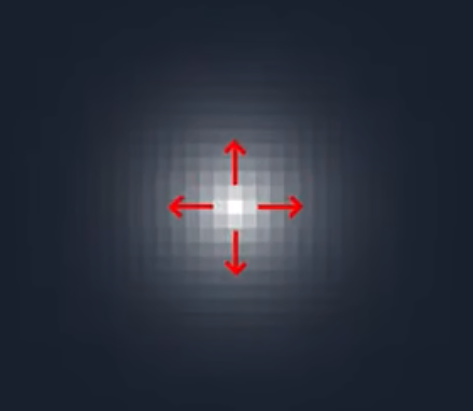  
.imgref[[[Gonkee]](https://www.youtube.com/watch?v=qsYE1wMEMPA)]]  
  
--
  
Density spreads across the grid cells.

---
.header[Fluid Simulation | Real-Time Simulation]

## The Density Solver

### Diffusion

Density of a cell at position $x, y$:  
  
$d(x,y)$  

--

> What is the density at next time step?

???
  

* Start with the current density and add the difference of that with the average of the surrounding area.

---
.header[Fluid Simulation | Real-Time Simulation]

## The Density Solver

### Diffusion

Average the density of all neighboring cells:  
  
$s(x,y) = \frac{d(x+1,y) + d(x-1, y) + d(x, y+1), d(x, y-1)}{4}$  

???
  

* Start with the current density and add the difference of that with the average of the surrounding area.

--
  
 .imgref[[[Gonkee]](https://www.youtube.com/watch?v=qsYE1wMEMPA)]  

--

$d(x,y) \rightarrow s(x,y)$

---
.header[Fluid Simulation | Real-Time Simulation]

## The Density Solver

### Diffusion

.left-even[
$k = \text{amount of change}$  
$c = \text{current iteration (known)}$  
$n = \text{next iteration (unknown)}$  
]

???
  

* The density spreads into the surrounding areas at a certain rate.
* This step accounts for a possible diffusion at a given rate `diff`. 

  
---
.header[Fluid Simulation | Real-Time Simulation]

## The Density Solver

### Diffusion

.left-even[
$k = \text{amount of change}$  
$c = \text{current iteration (known)}$  
$n = \text{next iteration (unknown)}$  

  
$d_n = d_c + k(s_c - d_c)$  
]

  
.right-even[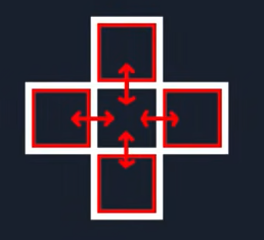 .imgref[[[Gonkee]](https://www.youtube.com/watch?v=qsYE1wMEMPA)]

]  

???
  

* The cell’s density will decrease by losing density to its neighbors, but will also increase due to densities flowing in from the neighbors
* The diffusion solver computes these exchanges at every grid cell and adds them to the existing values.

---
.header[Fluid Simulation | Real-Time Simulation]

## The Density Solver

### Diffusion

.left-even[
$k = \text{amount of change}$  
$c = \text{current iteration (known)}$  
$n = \text{next iteration (unknown)}$  

  
$d_n = d_c + k(s_c - d_c)$  
  

Averaging over the values that surround the current cell, adjusting the existing values.
]

  
.right-even[ .imgref[[[Gonkee]](https://www.youtube.com/watch?v=qsYE1wMEMPA)]

]  

---
.header[Fluid Simulation | Real-Time Simulation]

## The Density Solver

### Diffusion

$d_n = d_c + k(s_c - d_c)$
  
--
  
> Problem: simulation is unstable as values might get negativ or oscillate. Then the simulation becomes useless.  

???
  

00 20 00
20 00 20
00 20 00

->

20 00 20
00 20 00
20 00 20

Large K lead to negative values.

---
.header[Fluid Simulation | Real-Time Simulation]

## The Density Solver

### Diffusion

.center[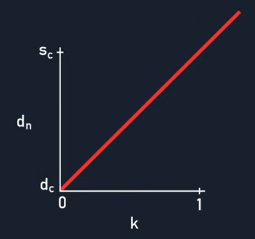 .imgref[[[Gonkee]](https://www.youtube.com/watch?v=qsYE1wMEMPA)]]  

???
  

This behavior is a general problem that plagues unstable methods.

* Thresholding k at 1 would limit expressivness

---
.header[Fluid Simulation | Real-Time Simulation]

## The Density Solver

### Diffusion - Stabilize

> Find the densities that when diffused **backwards** in time result in the densities we started with.

$d_n = d_c + k(s_c - d_c)$  
  
becomes  
  
$d_c = d_n - k(s_n - d_n)$

???
  

* The idea for a stable method
* The same but current and next are swapped and it is minus instead of plus

---
.header[Fluid Simulation | Real-Time Simulation]

## The Density Solver

### Diffusion - Stabilize

> Find the densities that when diffused **backwards** in time result in the densities we started with.

$d_c = d_n - k(s_n - d_n)$

--
  
$d_n = \frac{d_c + ks_n}{1+k}$

???
  

---
.header[Fluid Simulation | Real-Time Simulation]

## The Density Solver

### Diffusion - Stabilize

.center[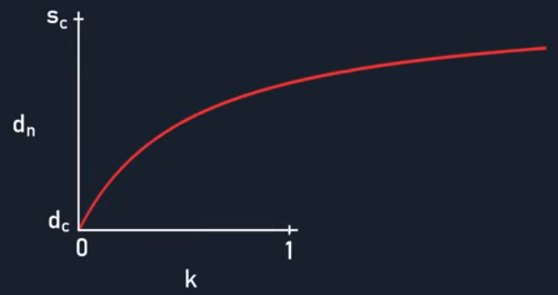 .imgref[[[Gonkee]](https://www.youtube.com/watch?v=qsYE1wMEMPA)]] 
  

???
  

* Now, no matter how big k, the diffuse value never overshoot the target value but converge to it

---
.header[Fluid Simulation | Real-Time Simulation]

## The Density Solver

### Diffusion - Stabilize

But what is the next surrounding average value $s_n$?
  
--
  
$d_n = \frac{d_c + ks_n}{1+k}$  

is

$d_n(x,y) = \frac{d_c(x,y) k(\frac{d(x+1,y) + d(x-1, y) + d(x, y+1), d(x, y-1)}{4})}{1+k}$  

This is a *system of simultaneous equations*.

  
--
  
We can approximate the solution with an iterative solver, called the **Gauss-Seidel method**.

???
  

* Going back to the definition, it shows to be a system of simultaneous equations.
* We repeatedly solve an equation for each square, their density will converge to the diffuse densities.
* Gauss Seidel: is an iterative method used to solve a system of linear equations.
* https://matthias-research.github.io/pages/tenMinutePhysics/index.html

--

The Gauss-Seidel method is fairly easy to implement:

---
.header[Fluid Simulation | Real-Time Simulation]

## The Density Solver

### Advection

--

.left-even[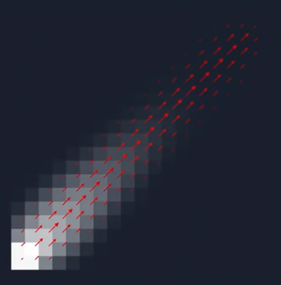 .imgref[[[Gonkee]](https://www.youtube.com/watch?v=qsYE1wMEMPA)]]

???
  

* The density should follow the velocity field

--

Naive approach: trace values though the velocity field. 

???
  

* For example, we could pretend that each grid cell’s center is a particle and trace it through the velocity field as shown in Figure 6 (b).

---
.header[Fluid Simulation | Real-Time Simulation]

## The Density Solver

### Advection

Problem: the velocity vectors do not necessarily point to the center of cell, affecting multiple cells at one:

.center[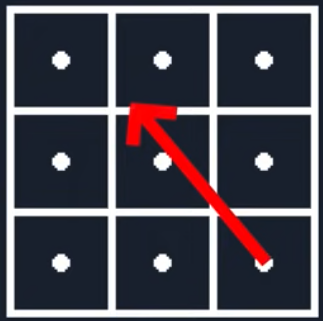 .imgref[[[Gonkee]](https://www.youtube.com/watch?v=qsYE1wMEMPA)]]  

???
  

* To compute how to accurately distribute the density in the surroundings  would be quite challenging
* Also multiple vectors could point to the same spot.

--
Computing a proper distribution would be challenging.

---
.header[Fluid Simulation | Real-Time Simulation]

## The Density Solver

### Advection

Solution: trace backwards which vectors end up exactly at the grid cell’s centers:

.center[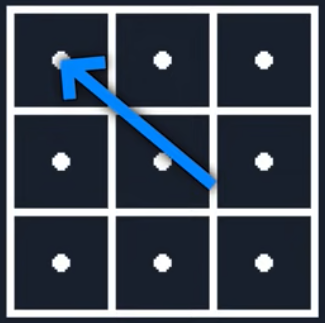 .imgref[[[Gonkee]](https://www.youtube.com/watch?v=qsYE1wMEMPA)]] 

???
  

* over a single time step
  
---
.header[Fluid Simulation | Real-Time Simulation]

## The Density Solver

### Advection

Solution: trace backwards which vectors end up exactly at the grid cell’s centers:

.center[  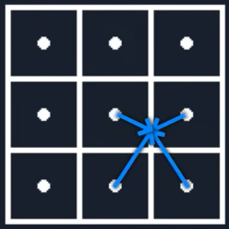 .imgref[[[Gonkee]](https://www.youtube.com/watch?v=qsYE1wMEMPA)]] 

  
  
A linearly interpolation of the four surrounding cell centers gives us the target density. 

???
  

* This way, each square only requires only one calculation.

---
.header[Fluid Simulation | Real-Time Simulation]

## The Density Solver

### Advection

For moving the density function through the velocity field:

--

* Two grids
    * One for the density values from the previous time step 
    * An empty one that will contain the new values
--
* Iterate over the empty grid, for each cell
    * Trace the cell’s center position backwards through the velocity field 
    * Linearly interpolate from the grid of previous density values
    * Assign value to the current grid cell

---
.header[Fluid Simulation]

## Real-Time Simulation

* The Density Solver
    * Addition 
    * Diffusion
    * Advection
--
* The Velocity Solver  
  
  
---
.header[Fluid Simulation | Real-Time Simulation]

## The Velocity Solver

Velocity changes over a time step due to three causes:

* Addition 
    * Forces are added that change the velocity
* Diffusion
    * Viscous diffusion
* Advection
    * The velocity field is moved along itself
  
--

Re-use the functions from the density solver, e.g. `add`, `diffuse`, `move` and apply them to update the velocity field.

---
.header[Fluid Simulation | Real-Time Simulation]

## The Velocity Solver

The velocity needs to conserve mass as the fluid is incompressible and, e.g., doesn't vanish, etc.

???
  

* textWe need one additional step to make sure that the velocity conserves mass, meaning the fluid is incompressible, doesn't vanish, etc.

---
.header[Fluid Simulation | Real-Time Simulation | The Velocity Solver]

## Vector Field Properties

Vector fields can have **curls** and **divergence**.

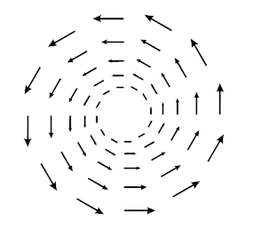  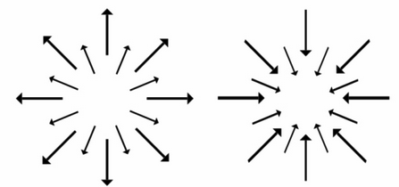

--

Divergence in the fluid would mean that particles are disappearing and appearing out of nothing.

--

We want curls but not divergence.

???
  

* After adding and moving the fields we will have both.
* hence, mass conserving fields lead to realistic swirly-like flows

---
.header[Fluid Simulation | Real-Time Simulation]

## The Velocity Solver

### Mass Conservation - Hodge Decomposition Rule

--

> Every velocity field is the sum of a mass conserving field (free of divergence) and a gradient field (free of curls).

???
  

* The Hodge decomposition rule for vector fields proves

--

.center[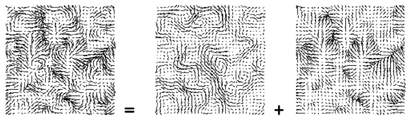] .imgref[[[Stam]](https://www.dgp.toronto.edu/public_user/stam/reality/Research/pdf/GDC03.pdf)]

???
  

* Middle: the mass conserving field has nice swirly-like vortices, typically the type of field we would like to have. 
* Right: The gradient field is the worst possible case as the flow at some points either points all outward or inward.

* In fact the gradient field indicates the direction of steepest descent of some height function. Imagine a terrain with hills and valleys with an arrow at every point pointing in the direction of steepest descent. Computing the gradient is then equivalent to computing a height field.

---
.header[Fluid Simulation | Real-Time Simulation]

## The Velocity Solver

### Mass Conservation

There is no direct way to compute the divergence-free part.

--
  
However, we can fairly easy

--
* Compute the gradient field (free of curls)

--
* Subtract that from the given field
  
--
  
The result is a field that is mass-conserving.

---
.header[Fluid Simulation | Real-Time Simulation]

## The Velocity Solver

### Mass Conservation

.center[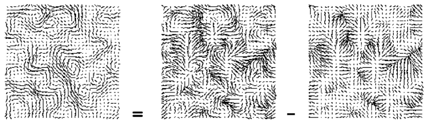] .imgref[[[Stam]](https://www.dgp.toronto.edu/public_user/stam/reality/Research/pdf/GDC03.pdf)]

???
  

* With the side effect of adding lots of swirls.

---
.header[Fluid Simulation | Real-Time Simulation]

## Boundaries

--

No flow should exit the walls.  

--

Set

* the horizontal component of the velocity to zero on the vertical walls
* the vertical component of the velocity to zero on the horizontal walls.

--

There are many other boundary treatments possible, e.g. wrapping.

---
.header[Fluid Simulation]

## Real-Time Simulation

.right-even[
* The Velocity Solver
    * Addition 
    * Diffusion
    * Advection (mass conserving)
* The Density Solver
    * Addition 
    * Diffusion
    * Advection
* Check Boundaries
]
.left-even[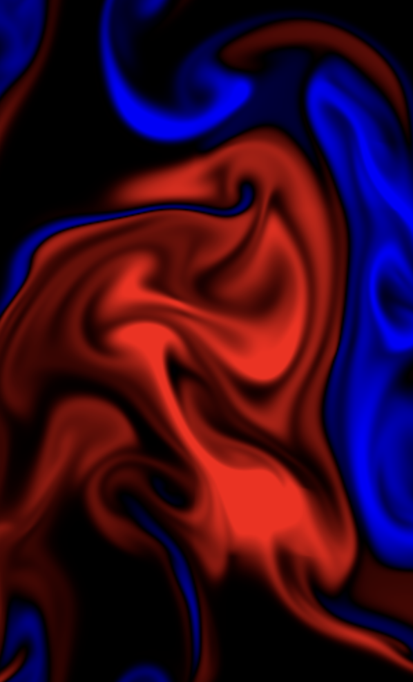]

???
  

* https://www.ibiblio.org/e-notes/webgl/gpu/fluid.htm
* *And now what?*

---
.header[Fluid Simulation]

## Real-Time Simulation

.center[  ]  
[[Stam]](https://www.dgp.toronto.edu/public_user/stam/reality/Research/pub.html)

---
.header[Fluid Simulation]

## Real-Time Simulation

.center[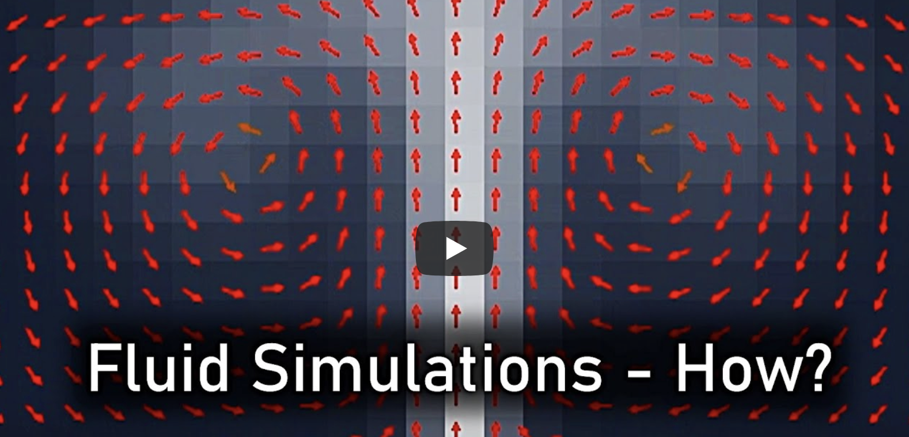]  

[Gonkee - But How DO Fluid Simulations Work? (15 min)](https://www.youtube.com/watch?v=qsYE1wMEMPA)

---
.header[Fluid Simulation]

## Real-Time Simulation

.center[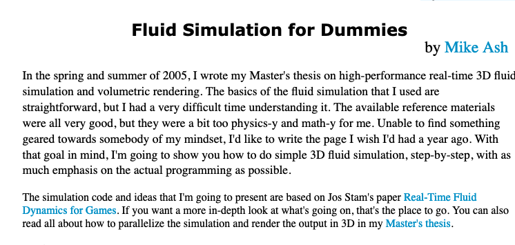]  

[Mike Ash - Fluid Simulation for Dummies](https://mikeash.com/pyblog/fluid-simulation-for-dummies.html)

---
.header[Fluid Simulation]

## Real-Time Simulation

.center[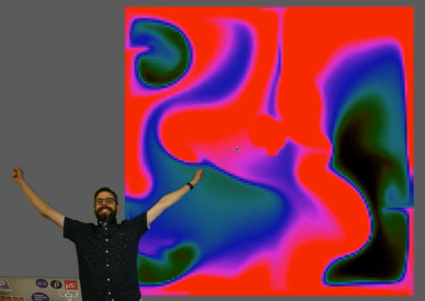]  

* [Coding Challenge #132: Fluid Simulation (55 min)](https://www.youtube.com/watch?v=alhpH6ECFvQ&t=1351s)
* [Coding Challenge #132: Source Code](https://github.com/CodingTrain/Coding-Challenges/tree/main/132_FluidSimulation)

???
  

* https://www.youtube.com/watch?v=dxt3zbVhL-k

---
.header[Fluid Simulation]

## Navier-Stokes

.center[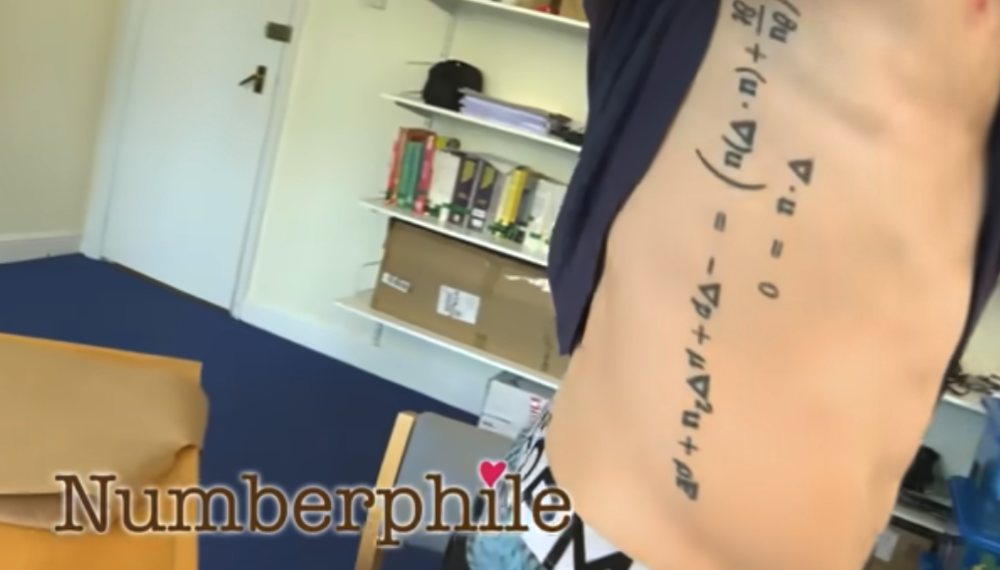]  
  
[Numberphile - Navier-Stokes Equations](https://www.youtube.com/watch?v=ERBVFcutl3M&t=236s)

---

## Fluid Simulation

.center[]  

---

## Fluid Simulation

.center[]  

[Two Minute Papers - Fluid, Cloth and Hair Simulations](https://www.youtube.com/playlist?list=PLujxSBD-JXgnnd16wIjedAcvfQcLw0IJI)

???
  

* Read the original paper [Real-Time Fluid Dynamics for Games](https://www.dgp.toronto.edu/public_user/stam/reality/Research/pdf/GDC03.pdf) from Jos Stam
    * The additional resources in the slides might also help for a better understanding
* Start to implement the paper yourself
    * C++ is a good choice here!
    * For glsl you will probably need to use textures as data structures - manageable but an additional challenge
    * p5

---
template:inverse

## The End

# 💧 🌊 💦
