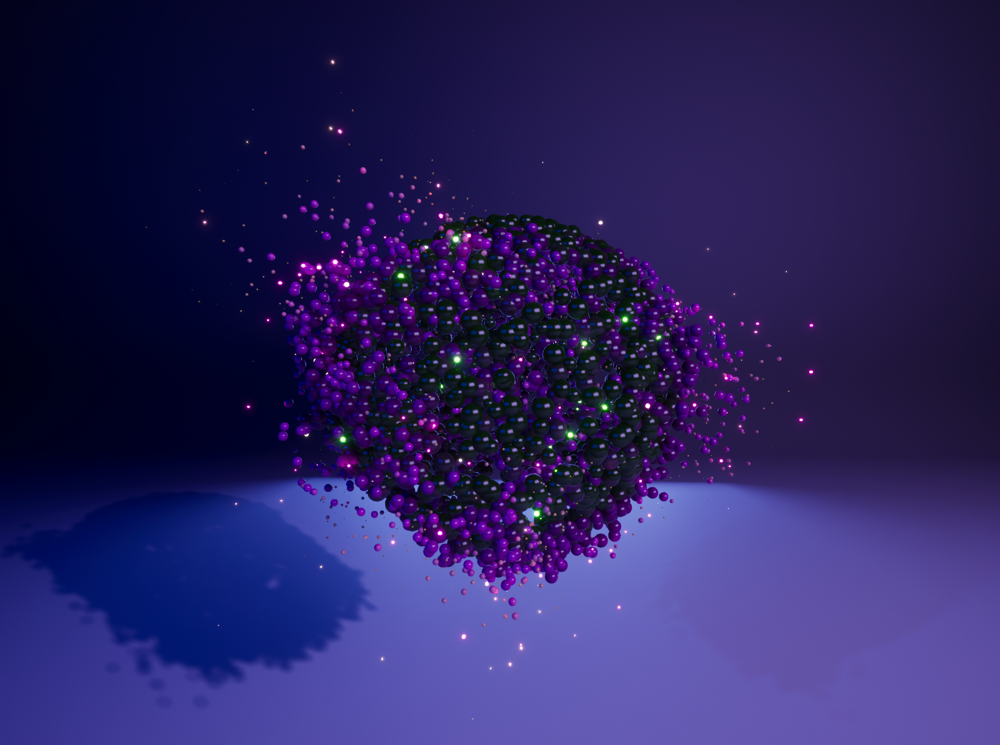

**Procedural Generation and Simulation**  

Prof. Dr. Lena Gieseke \| l.gieseke@filmuniversitaet.de  

# Intro to Niagara

This document accompanies live exploration and is not a self-contained tutorial.

* [The Niagara System](#the-niagara-system)
    * [UI Overview](#ui-overview)
    * [The System Node](#the-system-node)
* [Basic Setup](#basic-setup)
    * [The Emitter](#the-emitter)
    * [Spawning](#spawning)
    * [Adding Velocity](#adding-velocity)
* [Forces](#forces)
* [Colors \& Materials](#colors--materials)
* [Curl Scene](#curl-scene)
    * [Source Mesh Setup](#source-mesh-setup)
        * [*OR* Using a Letter as Source](#or-using-a-letter-as-source)
    * [The Particle System](#the-particle-system)
    * [Spawn on a Mesh](#spawn-on-a-mesh)
        * [Adding the Source Mesh to the Scene](#adding-the-source-mesh-to-the-scene)
    * [Curl Noise](#curl-noise)
    * [Coloring](#coloring)
    * [Shadows](#shadows)
    * [Glow Pass](#glow-pass)

---

> The Unreal Documentation, Unreal's AI Assistant, Claude and Claude Code assisted with the setup and text generation of this text. All concepts, structures, and content decisions were made solely by me. Generated material was reviewed and thoroughly adjusted. However, documentation and tools should be considered reference material throughout.

---

## The Niagara System

* Right-click in the **Content Browser**, select **FX > Niagara System**
* Choose **Create Empty Niagara System**, name it `FX_basics`

### UI Overview

The Niagara editor opens with the following panels:

* **Viewport**: Real-time 3D preview of the effect.
* **System Overview** (Node View): Graph showing the system and its emitters as nodes. Selecting a node opens its stack in the central editing area.
* **Details**: Properties of the currently selected stack item.
* **Timeline**: Playback controls and the overall loop duration of the system.
* **Parameters** (User Parameters): Parameters exposed for override from external systems such as Blueprints.
  
### The System Node

The **System** node in the **System Overview** holds global settings for the entire effect: looping behavior, fixed duration, warm-up time, and fixed bounds. It is the root that all emitters belong to. Setting `Loop Behavior` to *Once*, for example, makes the effect play through once and stop.

## Basic Setup

### The Emitter

An emitter is a self-contained particle generator. It defines how particles are spawned, how they behave over their lifetime, and how they are rendered. A system can contain multiple emitters, each contributing a distinct element to the overall effect.

* In the **System Overview**, click **+** and select **Minimal Emitter**, name it `E_basics`

### Spawning

Niagara provides several modules for controlling when and how particles appear:

* **Spawn Rate**: Continuously spawns particles at a fixed number per second. Use for sustained effects like smoke or fire.
* **Spawn Burst Instantaneous**: Spawns a fixed count of particles all at once at a defined time. Use for one-shot bursts like explosions.
* **Spawn Per Unit**: Spawns particles based on the distance the emitter travels. Use for motion trails.

In **Emitter Spawn**:

* Click **+**, add **Spawn Rate**
    * `SpawnRate` 10

### Adding Velocity

The **Add Velocity** module applies an initial velocity to each spawned particle. The `Velocity Mode` parameter controls how that velocity is directed:

When **Add Velocity** is first added, Niagara flags a missing dependency. Clicking **Fix Issue** automatically inserts the **Solve Forces and Velocity** module, which integrates all accumulated forces and velocity into particle position each frame. Without it, velocity has no visible effect.

The **Initialize Particle** module (inserted automatically at emitter creation) sets initial per-particle values at spawn, e.g., lifetime, sprite size, and color.

In **Particle Spawn**:

* Click **+**, add **Add Velocity**
    * Click **Fix Issue** (inserts **Solve Forces and Velocity**)
* In **Add Velocity**, click the down arrow next to `Velocity` and select **Random Vector** (unit length — randomizes direction only)
* Set `Velocity Scale` to `100`
* Right-click `Velocity Scale`, select **Make Dynamic Input > Random Range Float** to randomize speed per particle

## Forces

**Gravity Force** applies a constant downward acceleration, causing particles to fall and gain speed over time. **Wind** pushes all particles in a fixed direction each frame. **Drag** resists particle motion proportional to speed, decelerating them over time. **Acceleration Force** applies a custom constant acceleration vector, useful for any directional push independent of gravity.

In **Particle Update**:

* Click **+**, add **Gravity Force**
    * `Velocity Speed Scale` 50–500
* Click **+**, add **Wind Force** and **Drag**
    * `Drag` 5
* Click **+**, add **Acceleration Force**
* Click **+**, add **Collision** (particles collide with scene geometry)

## Colors & Materials

The look of particles is defined as much by their material as by emitter settings - also material and particle settings might overwrite each other at times.

* Create material `M_basics`, assign a base color
* In **Render > Sprite Renderer**, set `Material` to `M_basics`
    * To soften hard-edged squares: in the material add a **Radial Gradient Exponential** node connected to **Opacity Mask**, set material **Blend Mode** to *Masked*

To color particles by speed, in the material:
* Add a **Particle Speed** node, divide output by `400`, pipe through **Saturate** (clamps to 0–1)
* Use the result as alpha in a **Lerp** between two colors, connect to **Base Color**

## Curl Scene

Open the studio scene as a background. The goal is a Niagara system that spawns particles across the surface of a 3D letter and drives them with curl noise.

### Source Mesh Setup 

We want to use a static mesh as source for the particles, so we create one in **Modeling Mode** rather than placing a basic shape via **Quick Add**. Quick Add's ready made shapes reference one of the engine's existing meshes directly. They are not saved as a new asset and cannot be reshaped afterward. Creating the mesh in Modeling Mode instead bakes a new Static Mesh asset from the parameters you set, which is saved to the Content Browser and can be reshaped further with other Modeling Mode tools, such as **Remesh** used below for the letter mesh.

In the viewport mode dropdown, select **Modeling Mode**:

* **Create**
    * `Radius` e.g. `60`, `Target Position` Origin, `Pivot` Centered
    * Hit **Accept**

Name the mesh `SM_source` in the **Content Browser** (use **Ctrl+B** to locate it). Return to **Selection Mode**. We will later use this mesh as source but first let's create the particle system itself.

#### *OR* Using a Letter as Source

*(Optional - Skipped in Class)*

The **Motion Design** plugin creates parametric text geometry. Install it if not yet active.

In the viewport mode dropdown, select **Motion Design**:

* In **Actor**, add a **Text Actor**, type a single letter
    * Under **Geometry**, enable **Extrude**, value `8`
    * Enable **Bevel**, value `1`

Exit Motion Design by clicking **Motion Design** in the viewport dropdown again. Compare the letter's scale to a unit cube and resize to match.

The **Static Mesh Location** particle module that we are going to use requires a static mesh as its spawn surface, so the Motion Design text actor must be converted.

In the viewport mode dropdown, select **Modeling Mode**:

* **XForm > Convert**, set **Output Type** to *Static Mesh*, uncheck **Transfer Materials**
* Create and assign a dark gray material to the text

Switch to **Wireframe** view to inspect the topology — the auto-converted mesh is uneven. To fix it:

* Under **Mesh**, run **Remesh** with `5000` triangles

Name the mesh `SM_letter` in the **Content Browser** (use **Ctrl+B** to locate it). Return to **Lit** view and **Selection Mode**.

### The Particle System

* Create a new empty Niagara System `FX_curl` with a new minimal emitter.

We are planning with thousands of particles, hence a GPU simulation is far more efficient than CPU. Switch in **Emitter Properties**:

* Set `Sim Target` to *GPU Sim*
* Enable **Fixed Bounds** and set a bounding box large enough to contain the full effect

Fixed Bounds are required for GPU simulation because particle positions are computed on the GPU and cannot be read back by the CPU to calculate bounds dynamically. Use GPU for large particle counts. Stay on CPU when particle counts are low, when Blueprints need to read individual particle data, or when precise world collision is required.

In **Emitter Spawn**:

* Click **+**, add **Spawn Rate**
    * `SpawnRate` 1000 *(go lower if your computer is slow)*

In **Particle Spawn** (this is a temporary step, we will change this eventually):
* Add **Add Velocity** 
* Click `Fix Issue` to add the **Solve Forces and Velocity** module automatically.
* In the Add Velocity module, click the down arrow on the velocity parameter, select **Random Vector** and set **Vector Scale** to `50`.

You should see your particles moving now. Place  `FX_curl` in the scene, e.g. at `0, 0, 100`.

In **Render**:

* Add **Mesh Renderer**, set mesh to `S-1_Unit_Sphere`
    * Enable **Material Override**, add a new material slot, assign a new material `M_curl` (which you have to create first 😉)

In **Initialize Particle**:
* Set `Mesh Scale Mode` to *Uniform*, value `1`

In **Particle Update**:

* Click **+**, add **Scale Mesh Size**
    * Click the down arrow on the size parameter, select **Make Dynamic Input > Vector from Float**
    * Click the down arrow on that float, select **Float from Curve**
    * Shape the curve how you want their scale to behave over their lifespan, e.g., start at `0`, rise to `1`, then slowly decrease. This means that particles first grow and then shrink again as they age.
    * Use **Scale Curve** to scale the particles overall to your liking.

### Spawn on a Mesh

In **Particle Spawn**:

* Disable **Add Velocity**
* Click **+**, add **Static Mesh Location**
    * Set `Preview Mesh` and `Default Mesh` to the Static Mesh you previously created, `SM_Source`
    * Click **Fix Now** to resolve the dependency error

#### Adding the Source Mesh to the Scene

If your want the mesh to be visible in the scene, we can add it to the scene an make it a parent to the Niagara system.

* In the **Outliner**, drag `FX_curl` onto the letter actor to parent it — particles now follow the letter's transform

To prevent particles from spawning inside the geometry:

* In **Static Mesh Location**, enable `Offset Position Along Sample Geometry` to push spawn points outward to the surface.

### Curl Noise

**Curl Noise Force** applies a turbulent, swirling velocity field derived from a noise function. Unlike random velocity, curl noise is divergence-free — particles flow smoothly around each other rather than scattering.

In **Particle Update**:

* Click **+**, add **Curl Noise Force**
    * Click **Fix Issue**
* Click the down arrow on `Noise Strength`, select **Random Range Float**
    * Min `2`, max `4` or up to your liking
* Set `Noise Pan` X to `0.2` to slowly shift the noise field over time, producing continuously changing flow patterns

In the **M_curl** material:
* Create node **ParticleColor** and use that as **Base Color**
* Adjust the other material settings up to your liking.

### Coloring

We want to set the base color in particle system and still use the shading from the material.

In **Particle Update**:

* Click **+**, add **Color**
    * Click the down arrow on `Color`, select **Color from Curve**
    * Set opacity to `1` across the full curve
    * Create a color ramp (based on the particle's age) up to your liking.

Adjust the lighting of your scene, e.g., make it darker and give the lights coloring for dramatic effect.

### Shadows

* In the scene, select `FX_curl`, enable **Cast Shadows**

### Glow Pass

A second emitter with an emissive material gives a subset of particles a glowing appearance without modifying the base emitter.

* Duplicate `M_curl` as `M_curl_emissive`
    * In the material, connect **Particle Color** to both **Base Color** and **Emissive Color**
* Duplicate the emitter, assign `M_curl_emissive`, reduce `SpawnRate`
    * If you want even more glow, in the **Color** module, click the down arrow on the color value and set `Color Scale` to `10` — this amplifies the color intensity, producing a bright glow through the emissive channel

