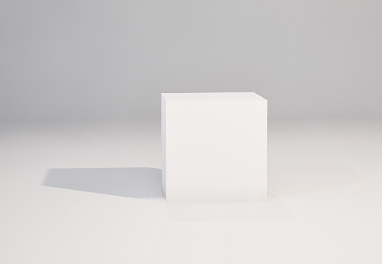
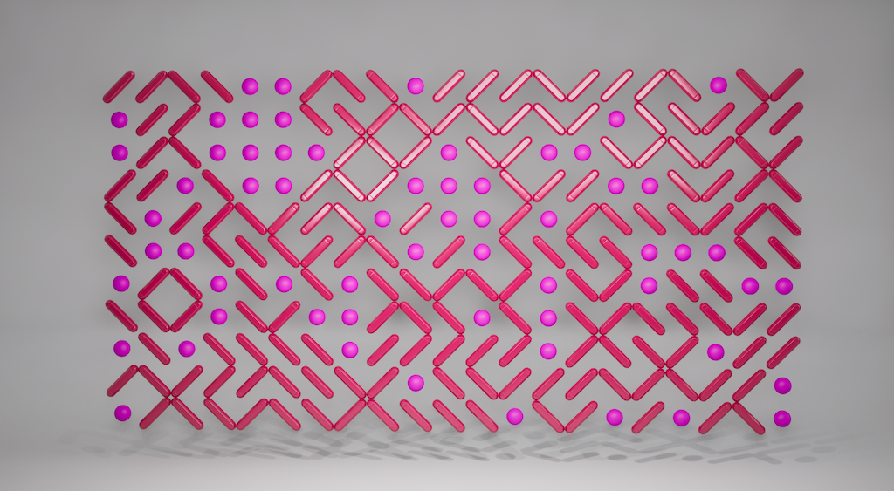

name: inverse
layout: true
class: center, middle, inverse
---

# Procedural Generation and Simulation

#### - Session 04 -

 

### Prof. Dr. Lena Gieseke | l.gieseke@filmuniversitaet.de  

#### Film University Babelsberg KONRAD WOLF

???

---
layout: false

## Today (Maybe)

--

* Unreal Basics & Procedural Geometry Pattern

--
* Function Design Building Blocks

--
* Example Brick Shader

--
* Homework

---
## Procedural Generation by Hand

<iframe width="710" height="400" src="https://www.youtube.com/embed/Is8N7B9b0GQ" title="He Won’t Stop Building a Map to an Imaginary Place" frameborder="0" allow="accelerometer; autoplay; clipboard-write; encrypted-media; gyroscope; picture-in-picture; web-share" referrerpolicy="strict-origin-when-cross-origin" allowfullscreen></iframe>

???

https://www.youtube.com/watch?v=Is8N7B9b0GQ

---

## Unreal Basics & Patterning

.left-even[
1. A Studio Environment
]

--

.right-even[

]

---

## Unreal Basics & Patterning

.left-even[
1. A Studio Environment
2. Procedural Geometry
]

.right-even[

]

---
.header[Unreal Basics & Patterning]

## 1. A Studio Environment

* [Steps Studio Environment](./pgs_02_tutorial_studio_01.md)
* Result: Unreal file `pgs_functiondesign`

--

 

* You can try to follow along but don't have to
* No individual bug tracking

---
.header[Unreal Basics & Patterning]

## 2. Procedural Geometry

* [Steps 10Print Pattern](./pgs_tutorial_blueprintsintro/pgs_tutorial_blueprintsintro.md)
* Result: Unreal file `pgs_pattern10print`

---
template:inverse

### The End

# 👋🏻
