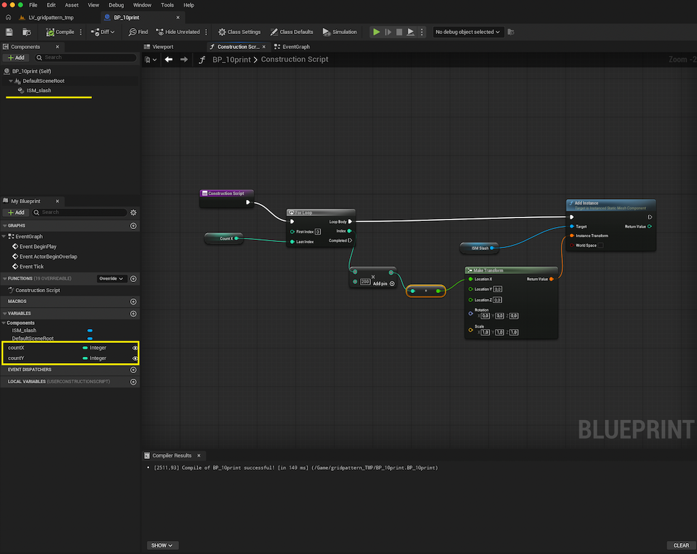
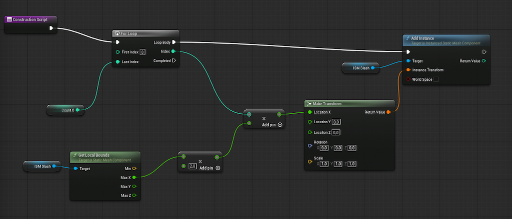
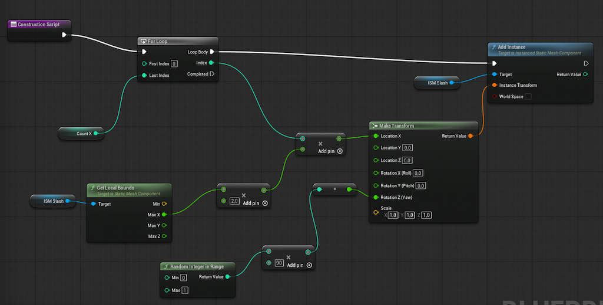
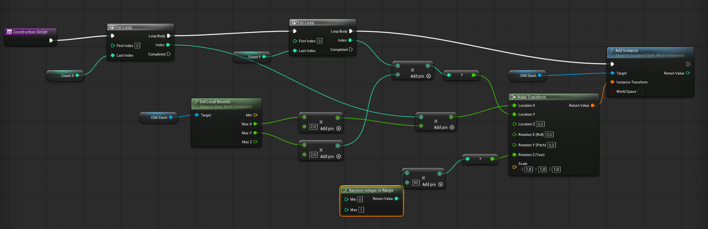
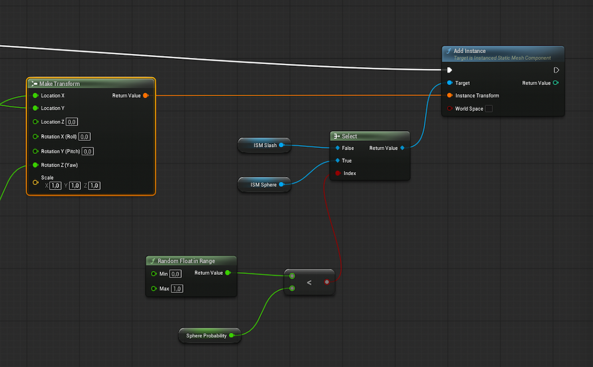

**Procedural Generation and Simulation**  

Prof. Dr. Lena Gieseke \| l.gieseke@filmuniversitaet.de  

# Introduction To Working with Blueprints in Unreal Engine

* [What Is a Blueprint](#what-is-a-blueprint)
* [Creating a Blueprint](#creating-a-blueprint)
* [The Blueprint Editor](#the-blueprint-editor)
    * [Viewport](#viewport)
    * [Event Graph](#event-graph)
    * [Construction Script](#construction-script)
* [Blueprint Types](#blueprint-types)
    * [Game Mode](#game-mode)
    * [Level](#level)
    * [Actor](#actor)
    * [Pawn](#pawn)
    * [Character](#character)
* [Example 10 Print Pattern](#example-10-print-pattern)
    * [Creating the Actor](#creating-the-actor)
    * [Building the Construction Script](#building-the-construction-script)
        * [Placing Elements in X](#placing-elements-in-x)
        * [Procedural Sizing](#procedural-sizing)
        * [Random Rotation](#random-rotation)
        * [Placing Elements in Y](#placing-elements-in-y)
    * [Using a Different Mesh for a Percentage of Instances](#using-a-different-mesh-for-a-percentage-of-instances)
    * [Assigning Random Per-Instance Colors](#assigning-random-per-instance-colors)

*Written for Unreal Engine 5.7 (menu labels and panel names may differ slightly between versions).*

> The Unreal Documentation, Unreal's AI Assistant, Claude and Claude Code assisted with the setup and text generation of this tutorial. All concepts, structures, and content decisions were made solely by me. Generated material was reviewed and thoroughly adjusted. However, documentation and tools should be considered reference material throughout.

*This file is not yet a fully developed tutorial and meant to be used in class together with my explanations. The steps are probably not yet understandable on their own.*

---

## What Is a Blueprint

A Blueprint in Unreal Engine is a class. It bundles together logic (event graphs, functions) and data (variables, components) the same way a C++ class would, but it is built visually with nodes instead of written C++ code.

In simple terms, a Blueprint lets you design how an object looks and behaves by wiring together visual building blocks instead of typing code. A node might say "when this starts" or "if the player gets close, open this door", and you connect such nodes to create sequences and behaviors.

## Creating a Blueprint

In the **Content Browser**, right-click and choose **Blueprint Class**. A picker opens asking for a parent class. Pick the parent class matching what your object should be (see the types below). Rename it (I like the prefix `BP_` for Blueprint names) and double-click it to open the Blueprint Editor.

## The Blueprint Editor

The **Components** panel on the left lists everything attached to this Blueprint, such as meshes, collision shapes or lights. The **Details** panel shows the properties of whichever component or node is selected.

### Viewport

The Viewport shows a 3D preview of this Blueprint built from its components, similar to a level scoped to just this one object. Here you position, rotate and scale this Blueprint's own meshes, lights, cameras and collision shapes relative to each other to form its physical shape.

### Event Graph

The Event Graph holds node-based logic that runs while the game is actually being played, triggered by specific events (rather than at construction time).

Common events are `BeginPlay` (fires once when gameplay starts for this instance) and `Tick` (fires every frame, useful for continuous behaviour, but costly if overused). Other events fire in response to a specific trigger, such as `On Component Begin Overlap` when something enters a collision volume.

Use the Event Graph for creating any behaviour that should happen while playing. For example, wire an `On Component Begin Overlap` event on a trigger volume component to an `Open Door` function so the door opens when the player walks through it.

### Construction Script

The Construction Script runs:

1. Once when an actor is constructed or spawned. "Spawned" means a new instance of an Actor (or Blueprint) class is created while the game is already running, as opposed to being placed in the level beforehand by you in the editor. This includes the moment the level loads (for actors already placed in it) and the moment a new instance is created at runtime via something like Spawn Actor From Class.

2. Repeatedly in the editor during development. Every time you move, rotate, scale, or change an exposed property of that instance in the Details panel, or edit and recompile the Blueprint class itself. This reruns the script so you get a live preview without entering Play mode.

Use Construction Script for procedural or visual setup rather than for gameplay reactions. For example, a fence Blueprint exposing a `Number of Posts` variable, where the Construction Script spawns and evenly spaces that many post meshes, so dragging the variable in the Details panel immediately updates the fence in the Viewport without pressing Play.

## Blueprint Types

The parent class you choose when creating a Blueprint determines which category it falls into, and that choice has real consequences. Only a `Pawn` (or a subclass of it) can be controlled via a controller. Only an `Actor` (or a subclass of it) can be placed into a level at all. A `GameMode` only does anything when assigned as the active game mode, never when placed in a level. Choose the parent class that already provides the closest built-in behaviour to what you need.

In the following the different types are listed from broadest scope of influence (the current play session, then the whole level) to the most specific kind of in-level object. Note that this is a scope ordering rather than a class inheritance chain, `Actor` is technically the base class that `GameMode` and `Pawn` both inherit from.

### Game Mode

A `GameMode` defines the rules for a play session, such as which `Pawn` class to spawn for the player and what counts as winning or losing. Only one `GameMode` is active at a time, set as a project-wide default or overridden per level in its World Settings.

A `GameMode` Blueprint lets you set or script those rules. It is not placed inside the level like an `Actor`, instead it is assigned as that project or level setting. A single project commonly contains several different `GameMode` classes, for example a simple one for the main menu level and a more elaborate one for actual gameplay levels, each reused across every level that should share its rules.

### Level 

Every level has exactly one Level Blueprint, opened from the **Blueprints** menu in the level editor toolbar via **Open Level Blueprint**. Unlike the other types, you do not create instances of it, it belongs to that one level. Use it for level specific scripting, for example running setup logic once when the level starts.

The Level Blueprint has no **Construction Script** tab. 

### Actor

The base class for almost anything that exists in a level. An `Actor` has a transform (location, rotation, scale) and can have components attached to it such as a mesh or a collision box. Static props, pickups, triggers and custom gameplay objects start as an `Actor` Blueprint.  

An `Actor` Blueprint only does anything once an instance of it is placed into a level or spawned into the world at runtime, the asset on its own has no effect.

### Pawn

A `Pawn` is a subclass of `Actor` that can be possessed by a Controller, meaning a player can take control of it and feed it input. A `Pawn` on its own has no movement logic, it is the physical stand-in for whatever is controlling it.

Choose plain `Pawn` over `Character` whenever the thing being controlled does not walk on two legs, since `Character` brings bipedal walking logic you would otherwise have to disable. A simple example is a chess piece that the player selects and moves from tile to tile, a flying drone, or a vehicle with its own physics-driven movement.

### Character

A `Character` is a subclass of `Pawn` specialised for bipedal movement. It already comes with a `CapsuleComponent` for collision and a `CharacterMovementComponent` that handles walking, jumping and falling. 

## Example 10 Print Pattern 

We build a procedural grid generator as Construction Script in an Actor Blueprint.

In summary, we create two nested `For Loop`s (X outer, Y inner) to run `countX × countY` times. On each iteration it builds a `Transform` whose X position is `X_index × Spacing`, Y position is `Y_index × Spacing`, Z position is `0` (default), and whose Yaw rotation is randomly either `0°` or `90°` (via `Random Integer in Range` driving a `Multiply`). That transform is passed to `Add Instance` on the `InstancedStaticMesh` component, placing one mesh instance per grid cell with a randomized 90°-step rotation.

### Creating the Actor

1. In the **Content Browser**, right-click and choose **Blueprint Class**, then pick `Actor` as the parent class. Name it e.g. `BP_gridpattern_instances`.
2. Double-click to open it, switch to the **Viewport** tab and add an `Instanced Static Mesh` component from the **Components** panel.
3. In the **Details** panel of that component, assign a static mesh to it, this is the mesh that will be repeated across the grid.
4. In the **My Blueprint** panel, add two variables, the integers `countX` and `countY`, and mark them as `Instance Editable` so they show up in the Details panel of placed instances.
5. Compile and save.

### Building the Construction Script

#### Placing Elements in X

1. Switch to the **Construction Script** tab. Drag off the entry node's `then` pin and add a `For Loop` node. This is the outer loop.
    * `For Loop` — repeats everything connected to its `Loop Body` pin once for every number from `FirstIndex` to `LastIndex`, outputting the current number on its `Index` pin each time.
2. Drag the `countX` variable from the **My Blueprint** panel to the graph and select `Get`. Connect the new node to the `For Loop` node's `LastIndex` pin.
    * `Get countX` / `Get countY` / `Get Spacing` — reads the current value of that variable on this Blueprint.
3. Drag off the loop's `Loop Body` pin and add an `Add Instance` node, called on a `Get InstancedStaticMesh` reference as its target, with the `Make Transform` output wired into `Instance Transform`.
    * `Get InstancedStaticMesh` — gets a reference to that component on this actor, used here as the target the `Add Instance` call is performed on.
    * `Add Instance` — adds one copy of the component's assigned mesh at the given `Transform`, this is what actually places a mesh in the grid.
4. Add a `Make Transform` node, plug the result into `Add Instance`'s `Instance Transform`
    * `Make Transform` — combines a `Location`, `Rotation` and `Scale` into the single `Transform` struct that positions an object in the world.
4. For the X position, add a `Multiply` node, connect the loop's `Index` output to its first pin and set `200` node to its second pin.
    * `Multiply` — multiplies its two input numbers and outputs the result.

#### Procedural Sizing
1. Drag an instance of the static mesh into the graph and connect its output to a `Get Local Bounds` node
    * `Get Local Bounds` — returns the bounding box of the component's assigned mesh in local space in `Min` and `Max`, **half** the size along each axis.
2. Multiply `Get Local Bounds`'s `Max.X` output by `2.0` to get the mesh's full width, and use that as input for the second multiplication values, where we had `200` before.

#### Random Rotation

1. For a random Z rotation, add a `Random Integer in Range` node with `Min = 0` and `Max = 1`, and multiply its result by `90.0` and set that as input to the `Make Transform` node's `Rotation Z`.
    * `Random Integer in Range` — returns a random whole number between `Min` and `Max`, inclusive on both ends.
    * This produces either `0` or `90`, picked at random each time the script runs. The same pattern extends to more rotation choices, e.g. `Random Integer in Range(0, 3) × 90.0` gives four possible orientations.

#### Placing Elements in Y

1. Drag off the first loop's `Loop Body` pin and add a second `For Loop` node, this is the inner loop. Connect a `Get countY` node to its `LastIndex` pin.
2. Repeat the steps above to adjust the Transform node's y location. 

Compile and save. Back in the level, adjust `countX`, `countY` or `Spacing` on a placed instance in the **Details** panel, the grid of mesh instances rebuilds immediately because the Construction Script reruns on every property change.

### Using a Different Mesh for a Percentage of Instances

An `Instanced Static Mesh` component only ever draws one mesh, so mixing in a second mesh, here a sphere, for a portion of the grid means adding a second such component and deciding per cell which of the two receives the new instance.

1. In the **Components** panel, add a second `Instanced Static Mesh` component, name it e.g. `InstancedStaticMeshSphere`, and in its **Details** panel assign a sphere mesh, Unreal's built in `/Engine/BasicShapes/Sphere` works well for testing.
2. In the **My Blueprint** panel, add a float variable `SphereProbability`, default e.g. `0.3` for 30%, and mark it `Instance Editable`. Treat it as a fraction between `0.0` and `1.0` rather than `0` to `100` to avoid an extra divide.
3. Inside the inner loop, before the existing `Add Instance` node, add a `Random Float in Range` node with `Min = 0.0` and `Max = 1.0`, and a `Less Than` (`<`) node comparing that random value to `Get SphereProbability`.
    * `Less Than` — outputs `true` if its first input is smaller than its second input.
4. Add a `Select` node, wire the boolean result from step 3 into its `Index` pin, `Get InstancedStaticMesh` into its `False` option and `Get InstancedStaticMeshSphere` into its `True` option.
    * `Select` — outputs one of two connected values depending on a boolean index. It works on component references just as well as on numbers, here it picks which of the two components the instance is added to.
5. Reconnect the target of the existing `Add Instance` and `Set Custom Data Values` nodes to this `Select` node's output instead of the fixed `Get InstancedStaticMesh` reference, so whichever component was chosen for this cell receives both the new instance and its random color.
6. Compile and save. Adjust `SphereProbability` on a placed instance in the **Details** panel, roughly that fraction of grid cells now show a sphere instead of the original mesh, each still colored independently via the per-instance custom data from the previous section.

### Assigning Random Per-Instance Colors

All instances on one `Instanced Static Mesh` component share a single material, that is what makes GPU instancing fast, so you cannot simply give each instance its own `Material Instance` without losing that performance benefit. Instead, Unreal lets you attach a small number of custom float values to each individual instance, called **Per-Instance Custom Data**, and read those values back inside the shared material.

*To be added.*

