**Procedural Generation and Simulation**  

Prof. Dr. Lena Gieseke \| l.gieseke@filmuniversitaet.de  

---

# Session 01 - 20 Points

This session is due on **Wednesday, June 10th** before class.

This assignment should take <= 6h. 

* [Syllabus](#syllabus)
    * [Task 01.01 - 1 Point](#task-0101---1-point)
* [Introduction](#introduction)
    * [Task 01.02 - Seeing Patterns - 1 Point](#task-0102---seeing-patterns---1-point)
    * [Task 01.03 - Designing Patterns - 3 Points](#task-0103---designing-patterns---3-points)
    * [Task 01.04 - Seeing Faces - 1 Point](#task-0104---seeing-faces---1-point)
    * [Task 01.05 - Painting - 2 Points](#task-0105---painting---2-points)
    * [Task 01.06 - Artistic Expression in CGI - 2 Points](#task-0106---artistic-expression-in-cgi---2-points)
* [Unreal Engine](#unreal-engine)
    * [Task 01.07 - Unreal Documentation \& Getting Started - 7 Points](#task-0107---unreal-documentation--getting-started---7-points)
* [Learnings](#learnings)
    * [Task 01.08 - 3 Points](#task-0108---3-points)
* [How To Submit](#how-to-submit)
    * [CTech](#ctech)
    * [VFX](#vfx)

## Syllabus

### Task 01.01 - 1 Point

* Which of the chapter topics given in the syllabus are of most interest to you? Why?
* Are there any further topics regarding procedural generation and simulation that would interest you?
* Is there a different tool than Unreal that you would prefer to do the exercises with (e.g. Houdini, Unity, Maya, Blender, JavaScript, p5, GLSL, ...)? If so, which one, and why?

*Submission*: 

I’m especially interested in Pattern/Function Design. A lot of that interest comes from Instagram posts featuring fascinating abstract and organic patterns that I found visually compelling, and I’m excited to learn more about how they are created.Some of my inspirations are listed below. 
Besides Unreal Engine, I’m also interested in creating algorithmic art in TouchDesigner, since it supports generative workflows and makes it easier to integrate interactivity at an early stage.

*Inspriration:*

This project inspired me the most and sparked my interest in Pattern/Function Design with TouchDesigner. It was based on a master’s thesis about using generative art and new media to reconnect with nature, drawing on The Algorithmic Beauty of Plants by Aristid Lindenmayer. The designer translated simple plant-growth rules into a generative system and made it interactive.
- https://www.instagram.com/p/DMfh9uWiGlc/

And those are also super cool examples:
- https://www.instagram.com/p/B26YBmqn5jz/
- https://www.instagram.com/p/DSpCVLNCVql/
- https://www.instagram.com/_mini_uv/reel/DF2-TmQN9M-/
- https://www.instagram.com/_mini_uv/p/DQHSDKSgvGj/

## Introduction

* [Slides Introduction](../../03_slides/pgs_01_intro_slides.html)
* [Script Introduction](../../02_scripts/pgs_01_intro_script.md)

### Task 01.02 - Seeing Patterns - 1 Point

Take at least one picture of a natural pattern and at least one of a man-made one (patterns can be two or three-dimensional). Try to include at least one pattern with self-similarity. Taking pictures with your phone is just fine. 

*Submission*: 

Pattern with self-similarity: Leaf & Clouds

<table>
  <tr>
    <td align="center">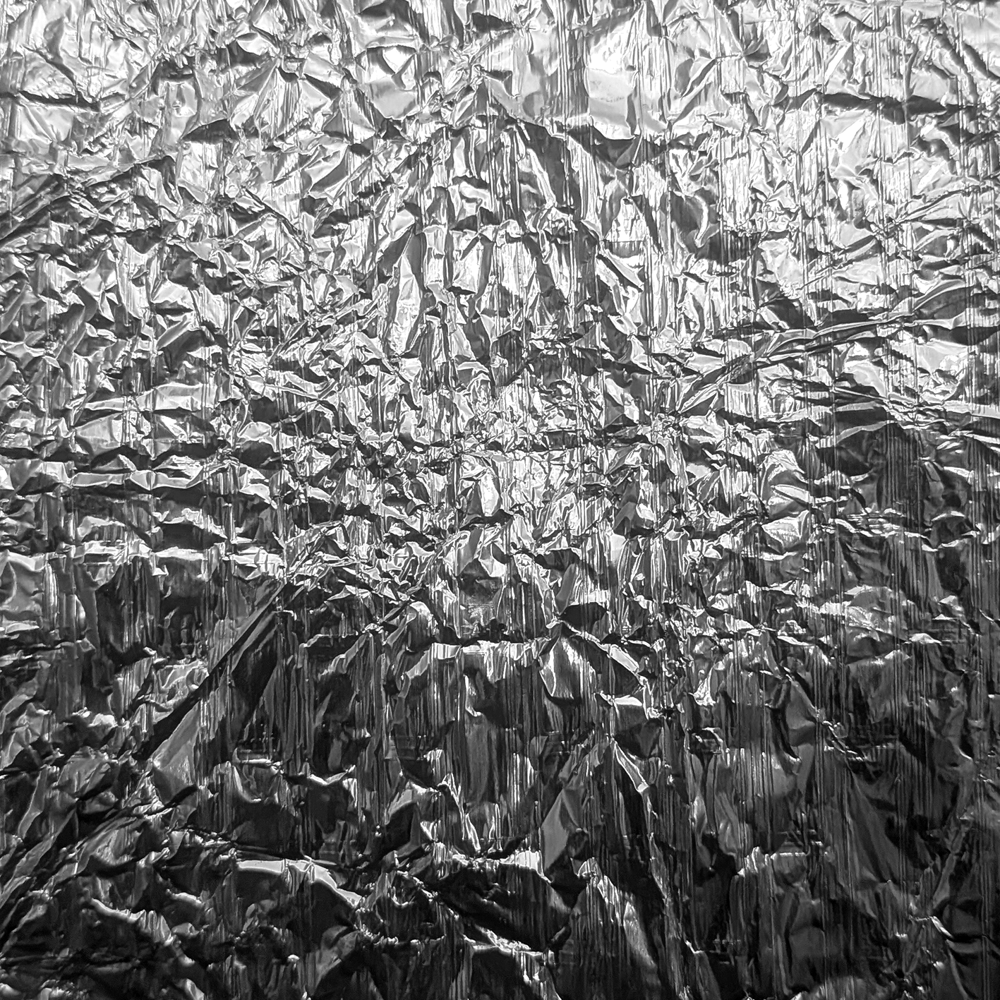 <b>Hum. Pattern Foil </b></td>
    <td align="center"> <b>Hum. Pattern Stone</b></td>
    <td align="center"> <b>Nat. Pattern Cloud</b></td>
    <td align="center">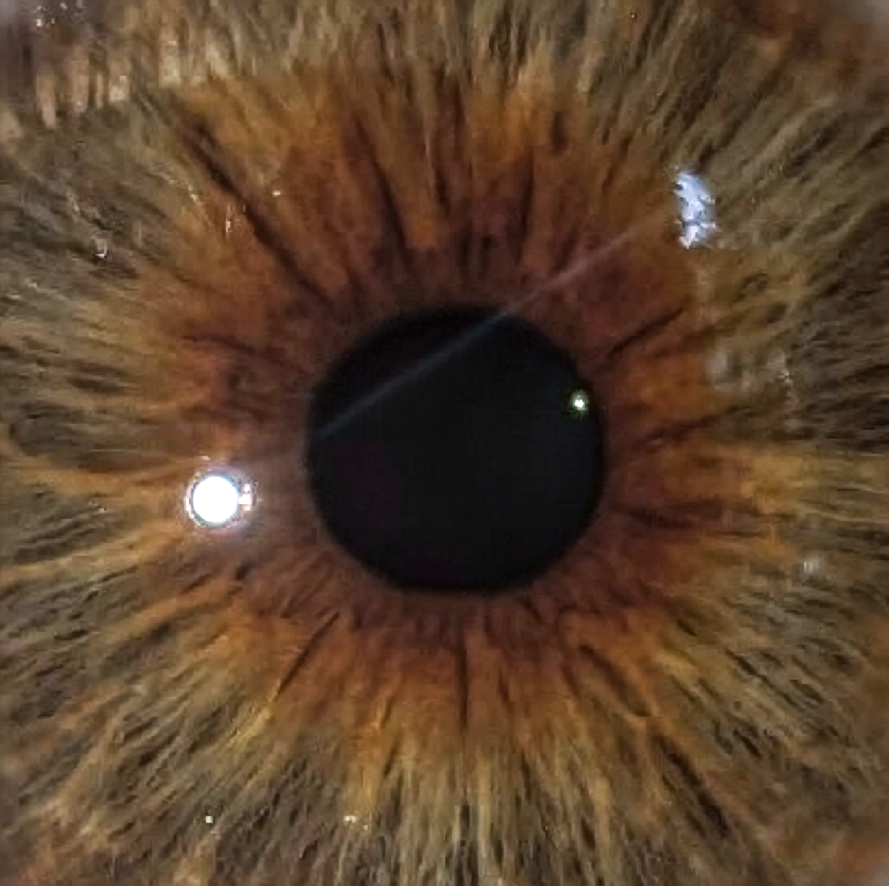 <b>Nat. Pattern Eye</b></td>
    <td align="center"> <b>Nat. Pattern Leaf</b></td>
    <td align="center">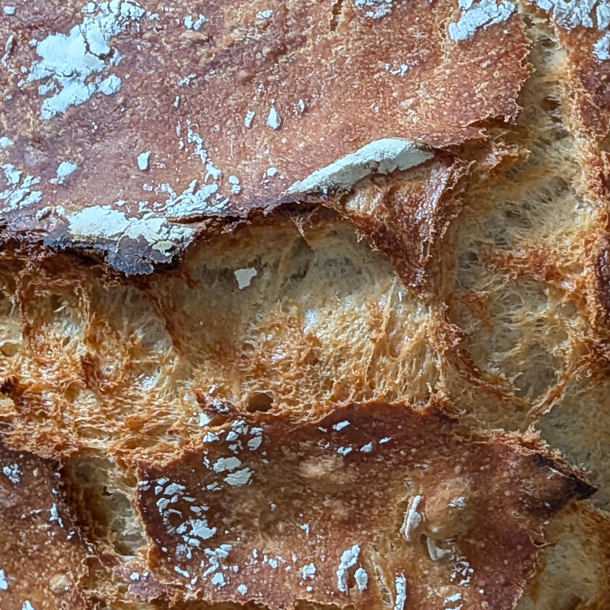 <b>Nat.& Hum. Pattern Bread</b></td>
  </tr>
</table>

### Task 01.03 - Designing Patterns - 3 Points

Create a visual pattern yourself. The pattern must be repetitive - and hand-drawn! It can either be abstracted (CTech) or realism oriented (VFX) or both.
Give pseudo code for its creation algorithm.

*Submission*: 

<table>
  <tr>
    <td align="center">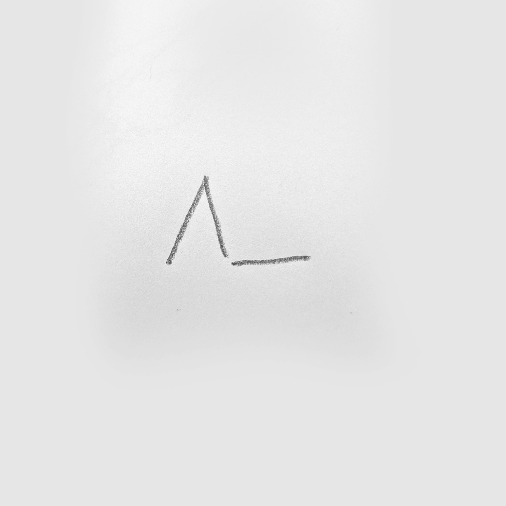</td>
    <td align="center">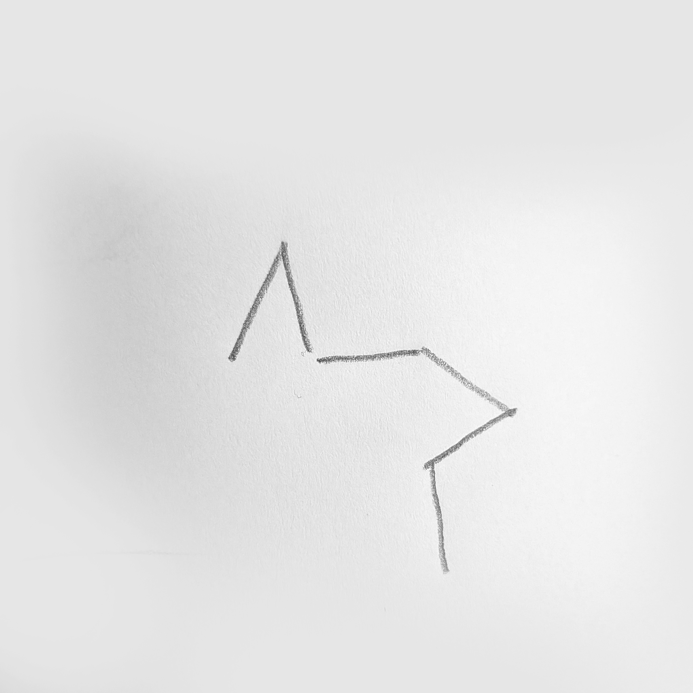</td>
    <td align="center"></td>
    <td align="center"></td>
    <td align="center"></td>
    <td align="center"></td>
    <td align="center"></td>
    <td align="center"></td>
  </tr>
</table>

<table>
  <tr>
    <td align="center">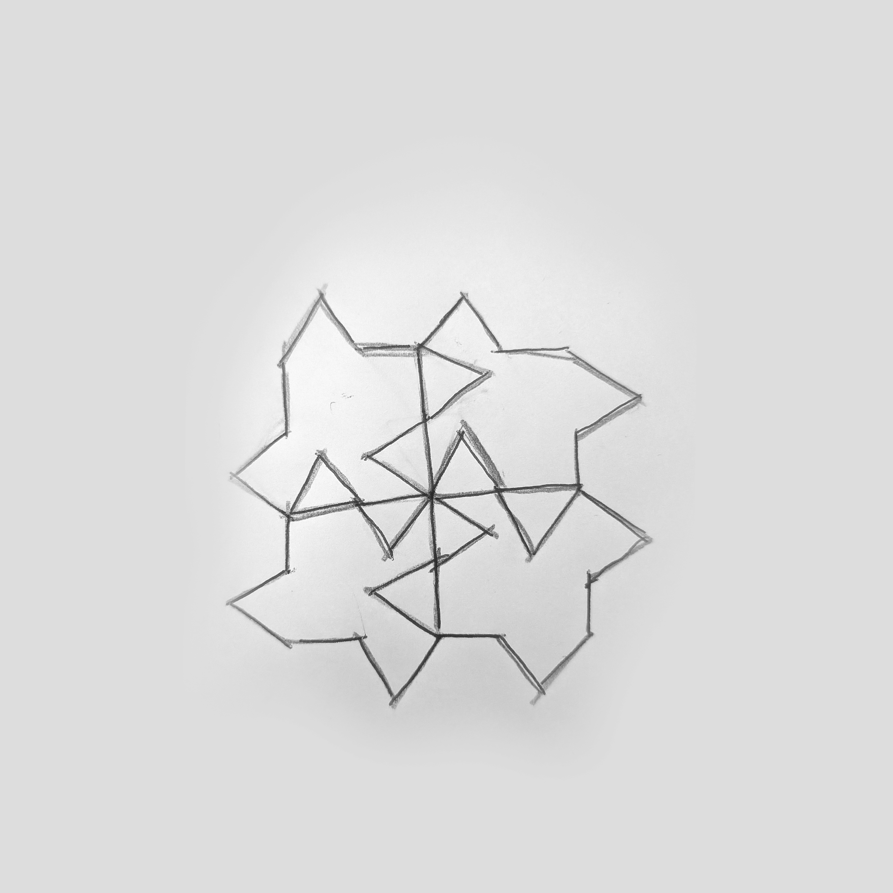 <b>Pattern 4 times (repeats the same shape afterward) </b></td>
    <td align="center"> <b>Pattern 16 times (changed strategy, began freely)</b></td>
  </tr>
</table>

*Pseudo Code:*

1. Draw two lines at +60° and -60° relative to the current orientation.
2. Draw a connector line with length x in the current orientation.
3. Store the endpoint of the connector line as the new starting position.
4. If the current motif is not the fourth motif of the cycle, rotate the orientation by 90°.
5. If the current motif is the fourth motif of the cycle, keep the current orientation and begin a new cycle from the stored endpoint.
6. Repeat the process 4 times.

### Task 01.04 - Seeing Faces - 1 Point

As an exercise to see and understand the environment around you (and to have some fun 😊), try to find at least two faces.  

*Submission*:  

<table>
  <tr>
    <td align="center">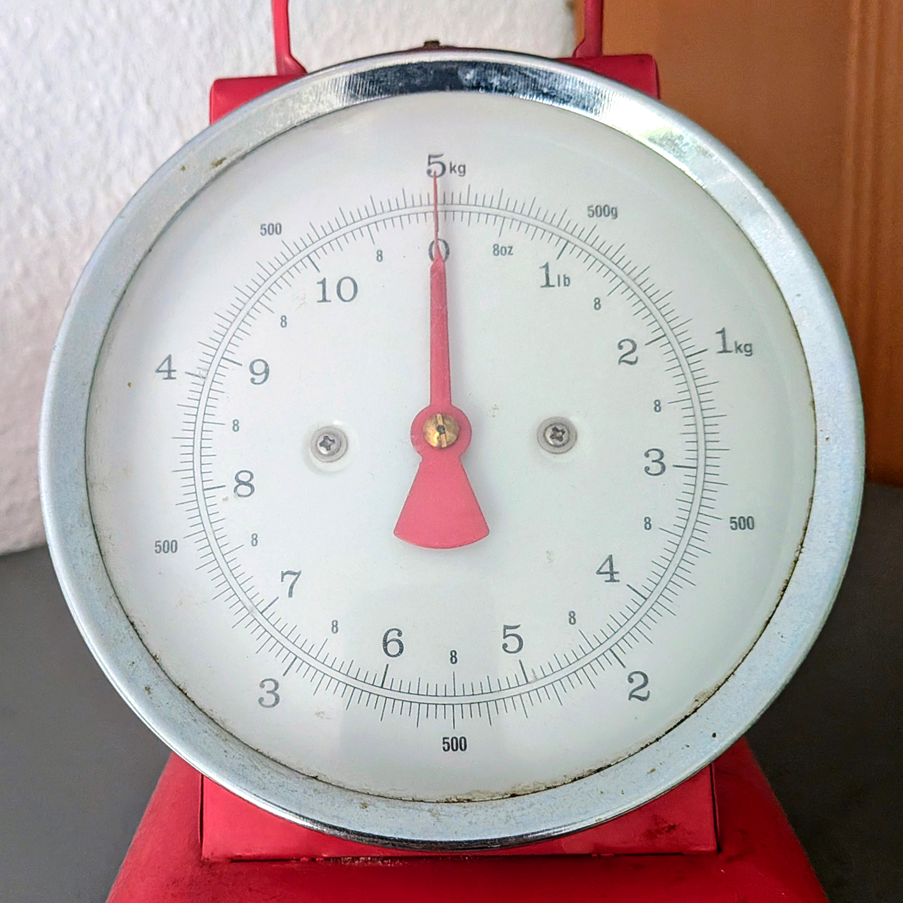 <b>Scale</b></td>
    <td align="center">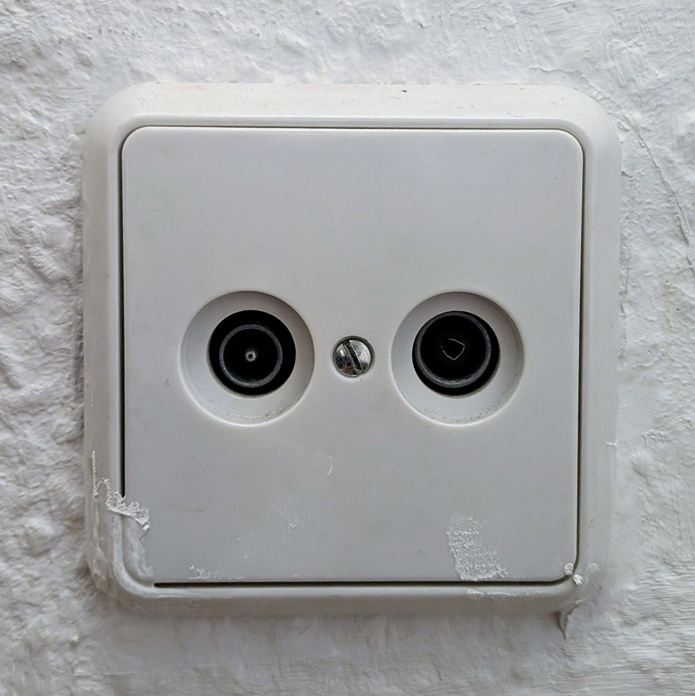 <b>Power outlet</b></td>
  </tr>
</table>

### Task 01.05 - Painting - 2 Points

Choose one "traditional" and analog painting that is inspirational to you. The image can come from the [script](../../02_scripts/pgs_01_intro_script.md#abstraction-in-art) or you can refer to any artist or image you like. It can either be abstracted (CTech) or realism oriented (VFX).

Explain briefly what you like about the painting and how it might inspire you for your own work.

*Submission*: 
<table>
  <tr>
    <td align="center">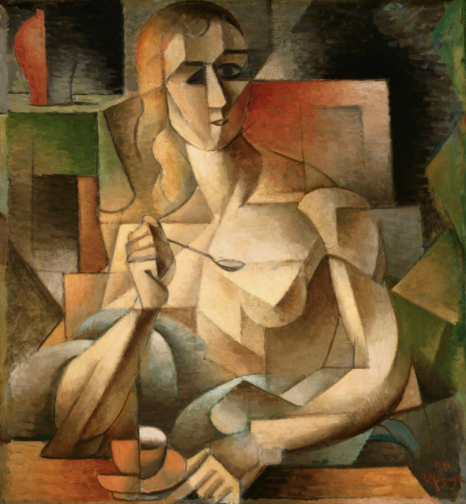 <b>Jean Metzinger - Teestunde, 1911, Öl auf Pappe, 75,9 x 70,2 cm, Philadelphia Museum of Art, The Louise and Walter Arensberg Collection, 1950, Philadelphia</b></td>
  </tr>
</table>

The painting Teestunde by Jean Metzinger inspires me because I struggle to uncover the rules that divide it into different shapes. It is abstracted in a way where some lines don't align with a realistic body, yet they still fit into a coherent system, making the human form recognizable while remaining abstract. 

This difficulty in understanding the underlying system is fascinating and inspiring to me. It shows how common, realistic shapes can be reinterpreted in a new, simplified way. I also admire how Metzinger works with color and gradients to suggest light and shadow.

### Task 01.06 - Artistic Expression in CGI - 2 Points

Choose one CG image, which you like and of which you think that it has an artistic quality to it (also here, it can be realistic and in a VFX context). The image doesn't need to be from the script, again you can choose any CGI image you like (it should use 3D graphics). You can find more examples in the [Summary of Artists](../../02_scripts/pgs_01_intro_script.md#summary-of-artists) section.  

Explain briefly what you like about the image and why you consider it to be artistic. 

*Submission*: 

<table>
  <tr>
    <td align="center">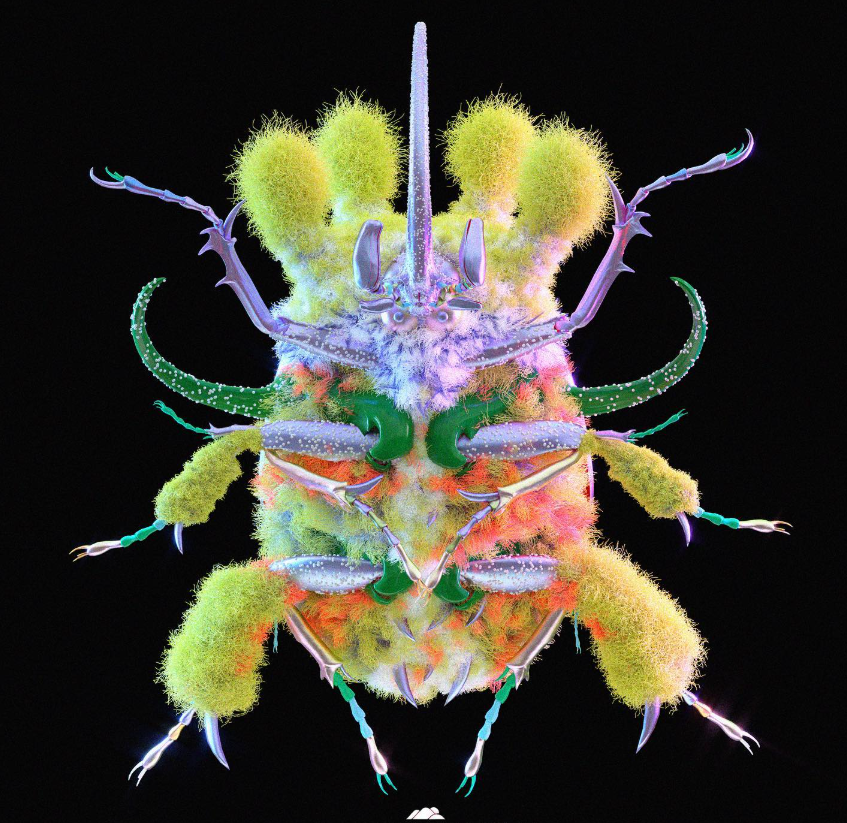 <b>japparii -  https://www.instagram.com/p/CF1ixMahrfZ/</b></td>
  </tr>
</table>

I really enjoy this CGI image by the artist Japparii because I love both the color combinations and the diverse structures of the insect. It feels like it creatively mixes a natural being with unrealistic additions which is a concept I find truly artistic. This image inspired me to add more layers and structures to my own work.

## Unreal Engine

### Task 01.07 - Unreal Documentation & Getting Started - 7 Points

One of the most crucial aspects of learning and working with a new environment, in our case Unreal, is being able to work with its documentation. [Unreal's documentation](https://dev.epicgames.com/documentation/unreal-engine/unreal-engine-5-7-documentation?lang=en-US) is fairly good but a bit unstructured in my opinion. In general, I do recommend to always work as much as you can with the official documentation before turning to resources and tutorials from others. For the latter there is no quality control, while for content in the official documentation you can expect it to be correct.

For this task, no matter your level, pick one or more chapters in [Unreal's documentation](https://dev.epicgames.com/documentation/unreal-engine/unreal-engine-5-7-documentation?lang=en-US) that you don't know yet and learn that topic.

If you are completely new to Unreal, the goal of this task is that you get familiar with Unreal and its interface. Specifically in the documentation, I recommend that you work through:
* [Install Unreal Engine](https://dev.epicgames.com/documentation/unreal-engine/install-unreal-engine)
* [Create your First Project in Unreal](https://dev.epicgames.com/documentation/unreal-engine/create-your-first-project-in-unreal-engine)
* [Unreal Editor Interface](https://dev.epicgames.com/documentation/unreal-engine/unreal-editor-interface)
* [Viewport Controls](https://dev.epicgames.com/documentation/unreal-engine/viewport-controls-in-unreal-engine)
* [Viewport Toolbar](https://dev.epicgames.com/documentation/unreal-engine/viewport-toolbar)
* [Content Browser](https://dev.epicgames.com/documentation/unreal-engine/content-browser-in-unreal-engine)
* [Projects and Templates](https://dev.epicgames.com/documentation/unreal-engine/working-with-projects-and-templates-in-unreal-engine) (without the templates)
* [Levels](https://dev.epicgames.com/documentation/unreal-engine/levels-in-unreal-engine)
  
*Hint:* Make sure to plan in a bit of time for the installation of Unreal (~ 10GB) as it takes a while.

We also have a collection of tutorials and resources for you in the [Unreal script](../../02_scripts/pgs_02_unreal_script.md), e.g. [First Steps Tutorials](../../02_scripts/pgs_02_unreal_script.md#first-steps-tutorials). You can additionally pick a tutorial there, or choose your own one online but this is up to you.

  

*Submission*: 

- All the mentioned pages above (exept Levels)

- Level Designer Quick Start

https://dev.epicgames.com/documentation/unreal-engine/level-designer-quick-start-in-unreal-engine

- Importieren von statischen Meshs

https://dev.epicgames.com/documentation/unreal-engine/importing-static-meshes-in-unreal-engine

<table>
  <tr>
    <td align="center"> <b>Level design quick start</b></td>
    <td align="center">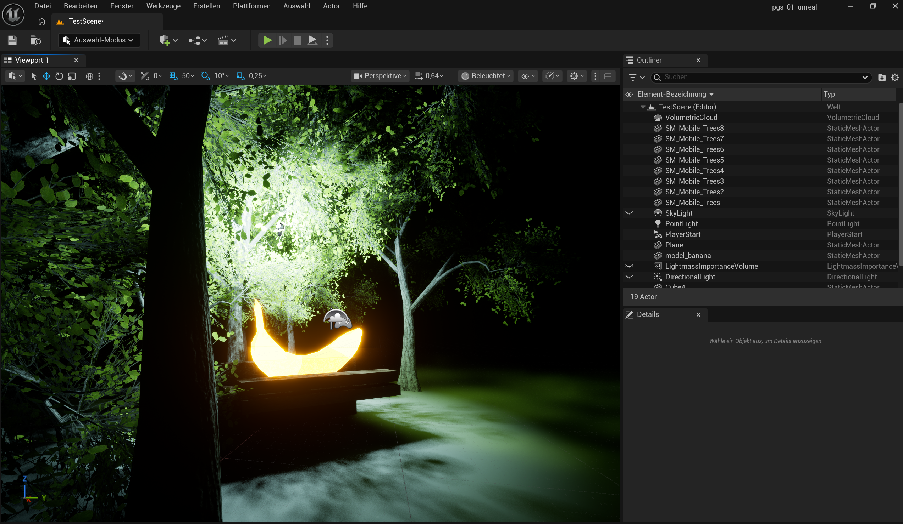 <b>Import static meshes</b></td>
  </tr>
</table>

## Learnings

### Task 01.08 - 3 Points

Summarize your learnings in whole sentences. What was challenging for you in this session? How did you challenge yourself?

*Submission*: 

Thinking in code logic is still a bit challenging for me, but I am getting better at it. Drawing the pattern was fun and helped me understand what is happening. I realize that I mostly need to build up my terminology and learn small logic snippets so I can write pseudocode more confidently.

During my bachelor studies, I also captured images of structures, but with a different goal. It was enjoyable to approach the same task from a new perspective and examine it through an algorithmic lens.

Since I only completed an Unreal Engine tutorial a few years ago, everything feels new again. I am not proficient in gaming, so navigation takes some time to internalize. However, it was fun learning the basics again and noticing the differences compared to other 3D programs. I learned how to set up scenes, load and transform static meshes, create a basic light setup, navigate the environment, and use the main interface functions.

What was especially challenging for me was going beyond the standard documentation pages to research and test light baking in Unreal Engine. This is an area where I generally do not have much experience.

---
## How To Submit

### CTech

Answer all questions directly in a copy of this file and **also link and display all of your images in that file**. Submit your copy as `pgs_XX_lastname.md` in your submissions folder (replace the XX with the number of the session). 

Please add `nav_exclude: true` to the header of your submission file that it is not added to the navigation bar of the overall website.

### VFX

To hand in your homework assignment, you submit images and texts in your OwnCloud document:

* [The OwnCloud Folder](https://owncloud.gwdg.de/index.php/s/CSVXtrxMNDyER3T)
* Open your file, add your text, links, etc.
  

  

---

**Happy Starting!**

