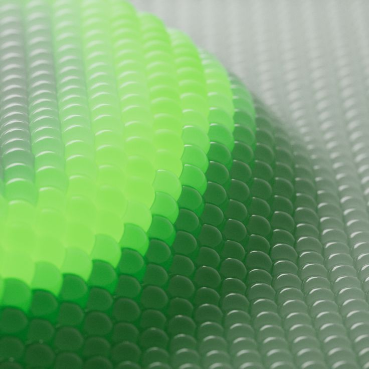
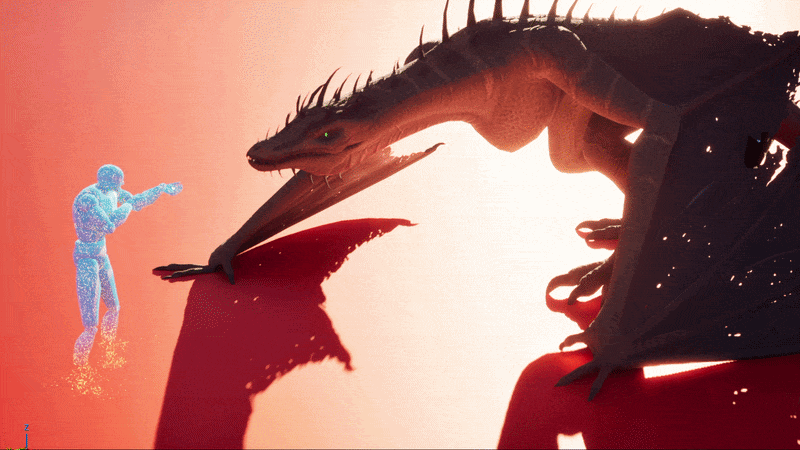
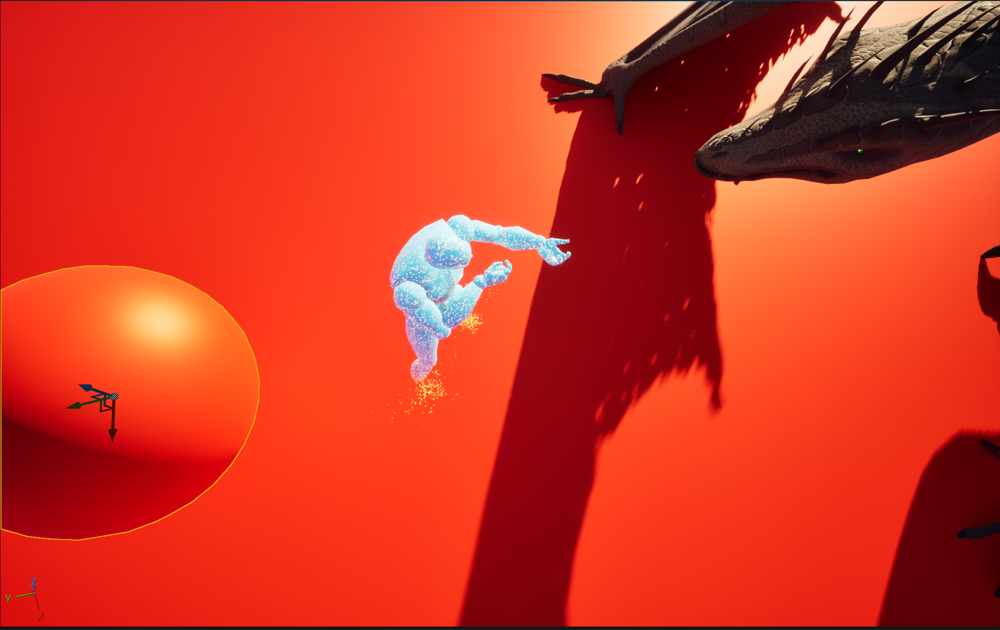

**Procedural Generation and Simulation**  

Prof. Dr. Lena Gieseke \| l.gieseke@filmuniversitaet.de  

---

# Session 04 - 20 Points

This session is due on **Wednesday, July 1st** before class.

This assignment should take <= 6h. As this assignment is open-ended, it is up to you to manage your time.

* [Task 04.01 - Collecting Inspiration - 3 Points](#task-0401---collecting-inspiration---3-points)
* [Task 04.02 - Randomness or Noise as Design Element - 14 Points](#task-0402---randomness-or-noise-as-design-element---14-points)
* [Learnings](#learnings)
    * [Task 03.03 - 3 Points](#task-0303---3-points)
* [How To Submit](#how-to-submit)
    * [CTech](#ctech)
    * [VFX](#vfx)

# Randomness

* [Chapter 06 - Noise](../../02_scripts/pgs_06_noise_script.md)

## Task 04.01 - Collecting Inspiration - 3 Points

* Submit at least three pictures of natural noise patterns. You can photograph them yourself (recommended) or find them on the internet.
* Submit one stylized / artistic image that uses noise as generating principle or design element. You can find it on the internet.

*Submission:* 
## Natural Noise

<table>
  <tr>
    <td align="center"> <b></b></td>
    <td align="center"> </td>
    <td align="center"> </td>
  </tr>
</table>

## Artistic Noise

#### Stephan Dybus
I assume noise was used to create the wobbly, natural clay effect on the character.
https://de.pinterest.com/pin/767723067778618844/

#### Nucor | Made for Good Campaign

In the following images, they probably used noise for both coloring and animation. The campaign includes many different examples of how noise textures can be used.

https://www.behance.net/gallery/184204957/Nucor-Made-for-Good-Campaign

## Task 04.02 - Randomness or Noise as Design Element - 14 Points

You can create any scene you like, with the only requirement that it features noise or some form of randomness. This can be a material, scattering, a dynamic solver, a particle system, or... You are allowed to follow a tutorial but you must modify the result to make it your own. Also, in the end, you must have a good looking result but it doesn't have to be a whole scene, it can be just a material or an actor etc.!

This tasks is as much about working with noise, as it is about creating a concept or finding a tutorial to follow and managing your time. Think small rather than big. Be creative about having limitations 😎.

*Submission:* 

## Learnings

### Task 03.03 - 3 Points

Summarize your learnings in whole sentences. What was challenging for you in this session? How did you challenge yourself?

*Submission*:

I challenged myself by using a different mesh than the one used in the tutorial, which had a different number and order of materials. To get the dissolve effect with curl noise movement working, I had to understand the difference between a material instance and its parent material, and that only the parent material can be edited through the node graph. I also learned that the available material inputs depend on the selected blend mode and that Unreal Engine 5.7 uses the Substrate material system, which differs from the legacy workflow shown in many tutorials. Additionally, I gained a better understanding of Niagara by learning what the colored data type indicators represent and how module outputs are referenced. In the last steps, I learned that hiding or making the trigger mesh translucent can prevent it from contributing to the Global Distance Field, causing the effect to stop working.

---
## How To Submit

### CTech

Answer all questions directly in a copy of this file and **also link and display all of your images in that file**. Submit your copy as `pgs_XX_lastname.md` in your submissions folder (replace the XX with the number of the session). 

Please add `nav_exclude: true` to the header of your submission file so that it is not added to the navigation bar of the overall website.

### VFX

To hand in your homework assignment, you submit images and texts in your OwnCloud document:

* [The OwnCloud Folder](https://owncloud.gwdg.de/index.php/s/CSVXtrxMNDyER3T)
* Open your file, add your text, links, etc.
  

---

**Happy Randomizing!**
