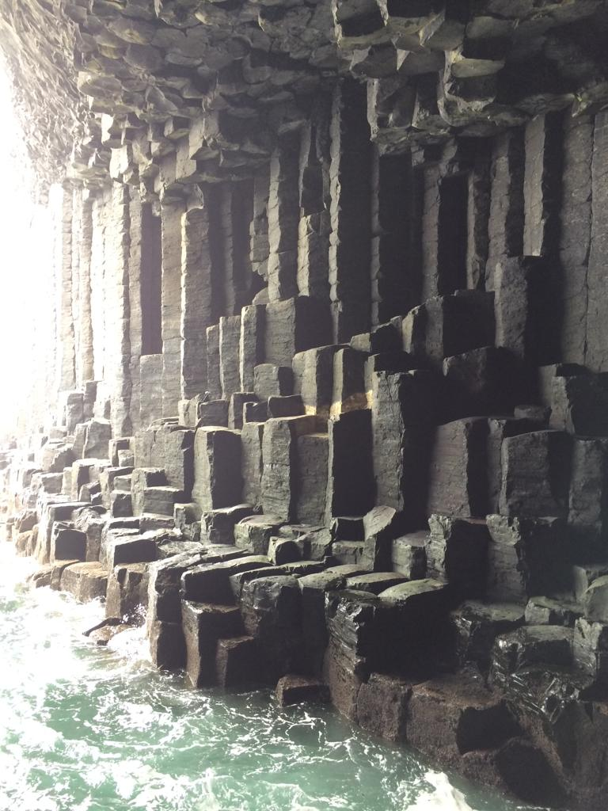
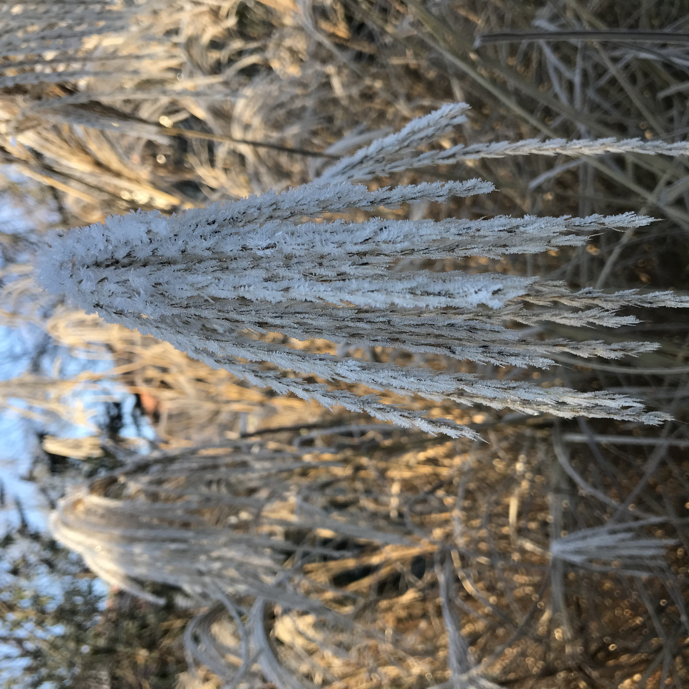
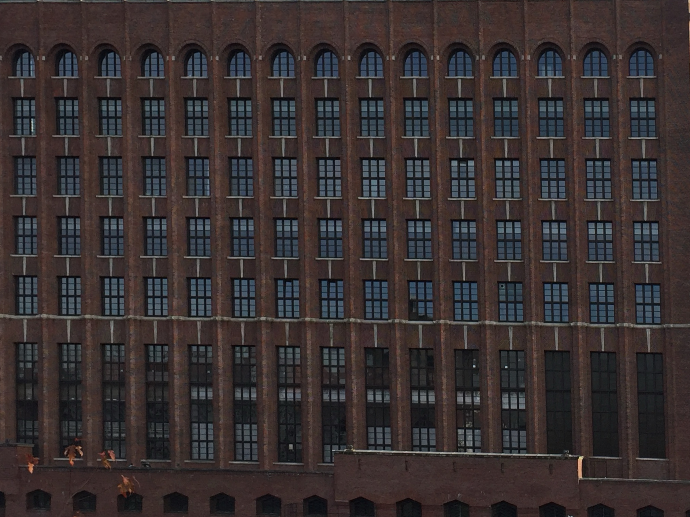
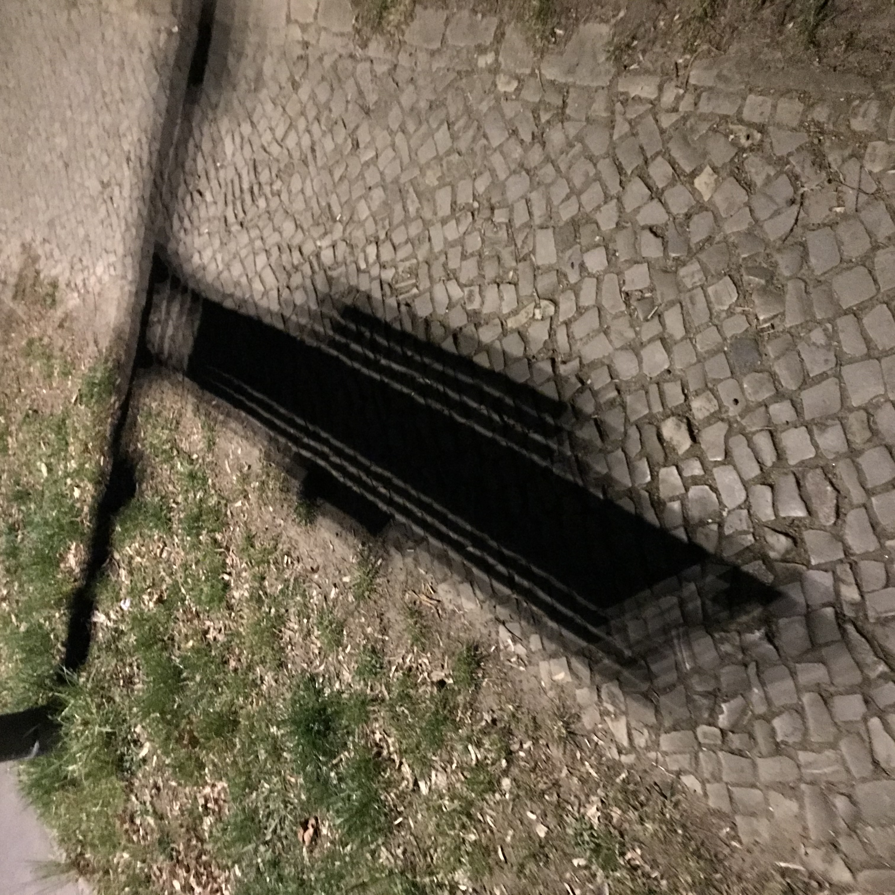
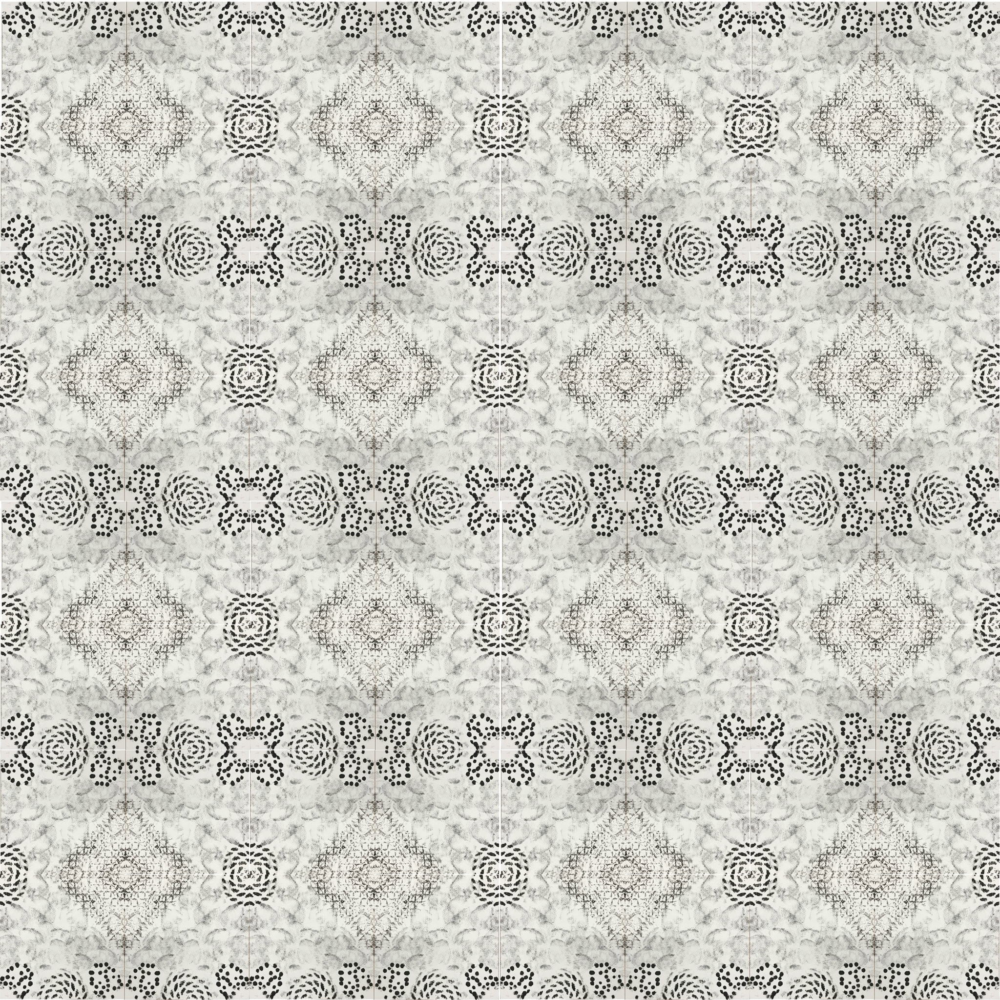
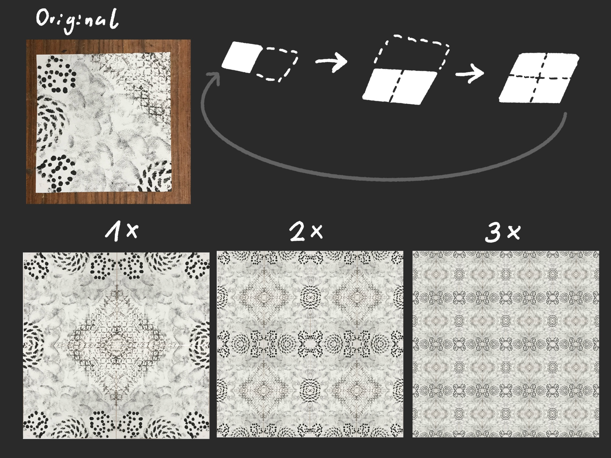
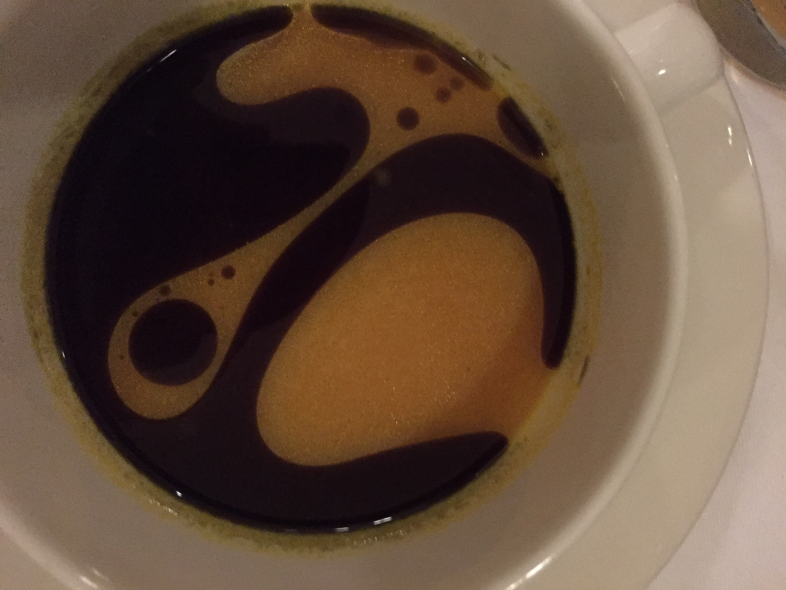
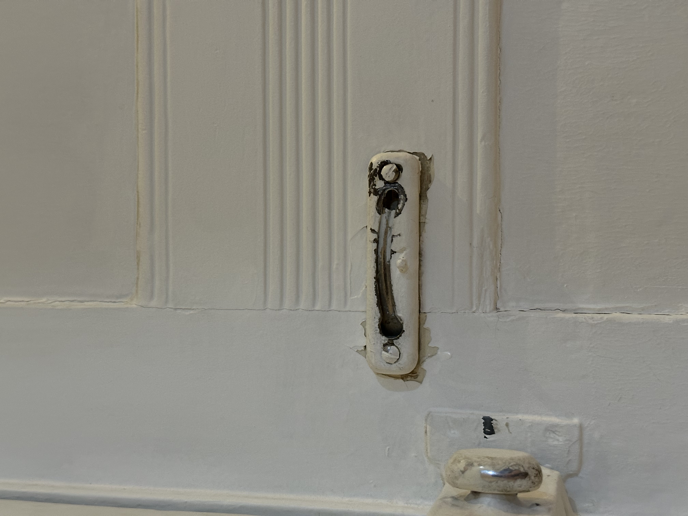
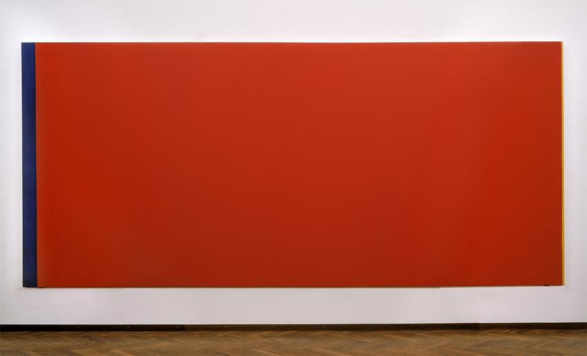
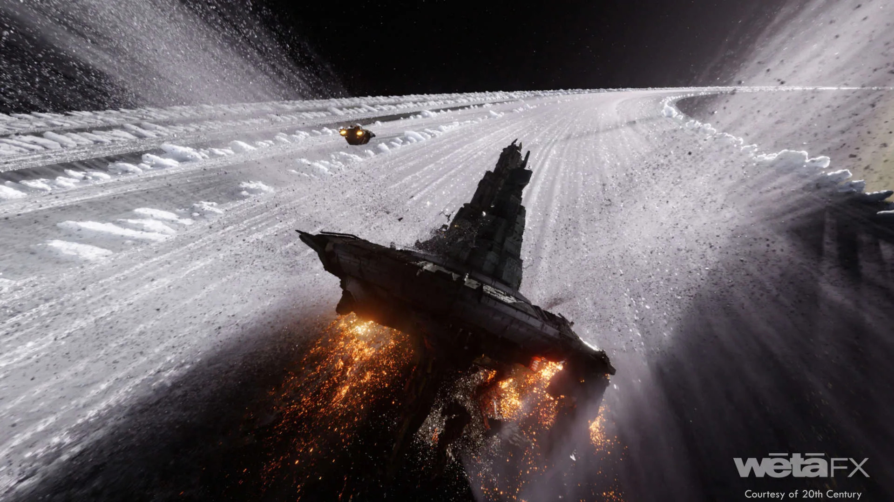

## Task 01.01  
_Which of the chapter topics given in the syllabus are of most interest to you? Why?_

A topic or rather approach I am interested in is the connection between natural occurring patterns and replicating those in simplified ways digitally. Another topic that caught my eye looking at the future lesions is “The beauty in Math”. I think it’s one of the least dry mathematical subjects. 

_Are there any further topics regarding procedural generation and simulation that would interest you?_

I can’t answer that at this point with certainty but what I would like is to play with light. Caustics, light falling through leaves and creating interesting patterns, chromatic aberration and things in a similar vein. That might not be part of class tho but rather part of my homework explorations. 

_Is there a different tool than Unreal that you would prefer to do the exercises with (e.g. Houdini, Unity, Maya, Blender, JavaScript, p5, GLSL, …)? If so, which one, and why?_

I don’t know if it’s fitting to the class yet but I think Blender might be something I would want to experiment in. Blender has a lot of interesting aspects for procedural generation. Not only procedural material, but procedural stylisation and procedurally generated environments. When I was more actively working with Blender I worked on a procedural scaffolding for photogrammetry scans for buildings. In which you would just place a box which automatically generated scaffolding in its dimensions. 

## Task 01.02 - Seeing Patterns

Natural Patterns:

Man Made Pattern:

Man made structures creating interesting pattern:

## Task 01.03 - Designing Patterns

Pseudo Code:
- Setup:
- create canvas
- Import Image
- Pattern Creation:
- expand canvas by image size (to the right)
- mirror image vertically  to the right
- expand canvas by current size (to the top)
- mirror image horizontally to the top
- Repeat as needed

## Task 01.04 - Seeing Faces

## Task 01.05 Painting 

Who’s Afraid of Red, Yellow and Blue by Barnett Newman are a series of paintings. Approximately the size of an entire wall. The paintings themselves never really interested me until I heard about their history and meaning. Who’s Afraid of Red, Yellow and Blue is about what art can be. Barnett Newman is a jewish painter who directly challenged that “Entartete Kunst” didn’t go away as a concept with Nazi Germany. People still demonstrated against his artwork. Who’s Afraid of Red, Yellow and Blue had people threatening museums and the artist. They had been vandalized, and interestingly to the criticism that they were so easy to paint. They weren't able to be restored, because the way Newman created the painting with colors he mixed and processes of layering the colors. So in their vandalism against the piece people destroyed their argument that everyone could have done it and they answered the question by saying they are so afraid, they had to destroy it. 
(many oversimplifications even in this long paragraph)

Ever since I learned about that history the series of paintings fascinates me. 

## Task 01.06 - Artistic Expression in CGI 

For my CGI example I choose something based on what I've seen in the movie Alien Romulus. It’s a movie I’ve seen in the Cinema and the scene in which the space station is slowly ground down in the (ice) asteroid belt was one of the most memorable parts for me. 
The color contrast, the black and white, the sparks flying, the sense of tension and the immense scale portrayed really took me in. 
I can’t say anything outstanding about the plot but I loved the visuals of that movie. I don’t know if that might be an insult to one or the other writer but most memorable for me where these scenes on the big screen. 

## Task 01.07 - Unreal Documentation & Getting Started

Unreal Learnings:

In the beginning I had problems with the installation because there can arise a few conflicts regarding X-Code versions on Mac but I got through these hurdles. The big problem here was looking into not destroying my X-Code setup I have for CC2 and still getting the newest Version of Unreal to start.

I have a bit of experience in Unity and in a funny way this helps me to understand aspects of the UI, control and available options, but also makes me look for everything in the slightly wrong places. 

I am still slightly overwhelmed by everything in Unreal but the templates are a big help to play around in and understand some of the aspects. 

