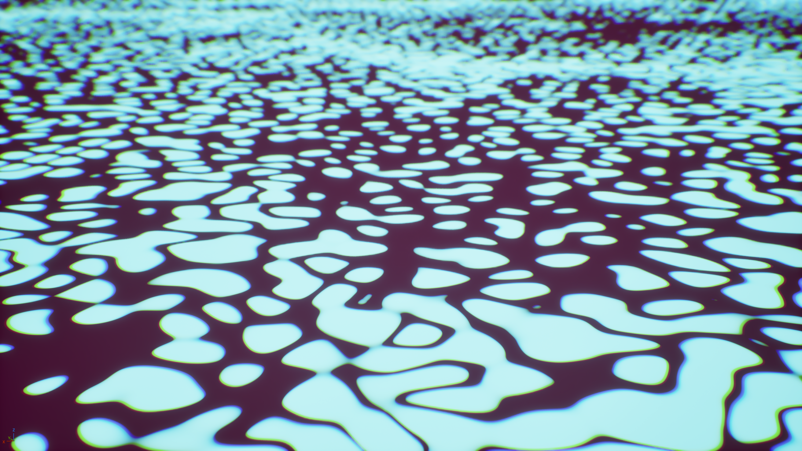
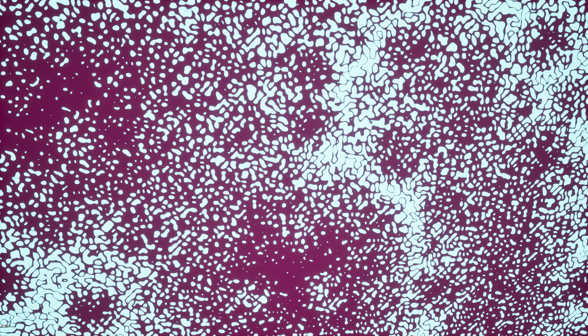
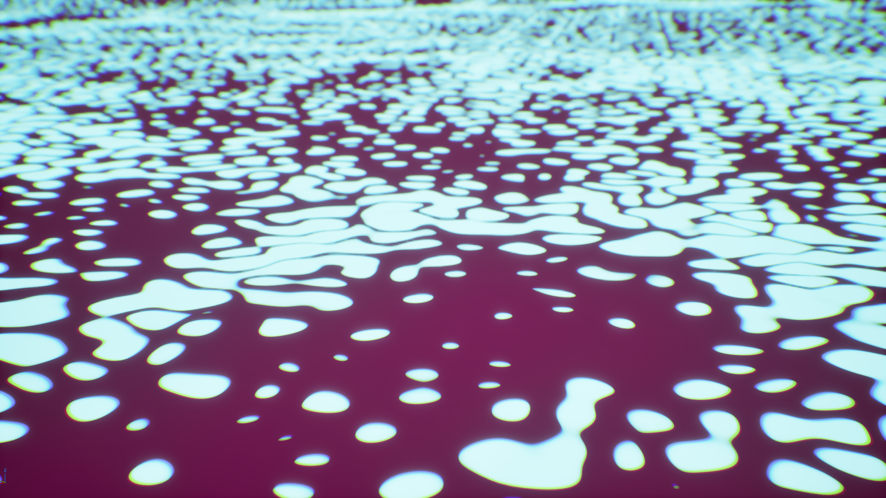
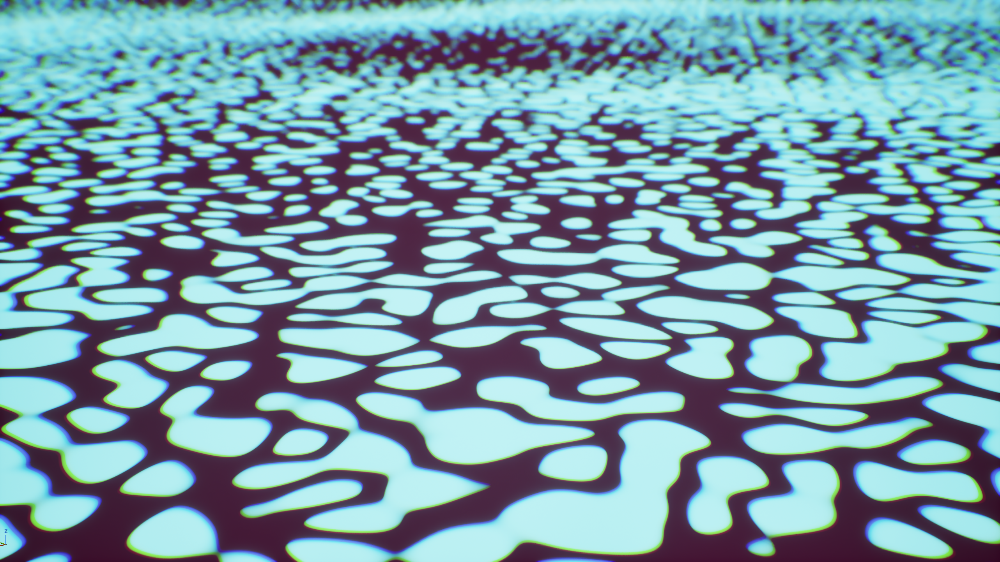
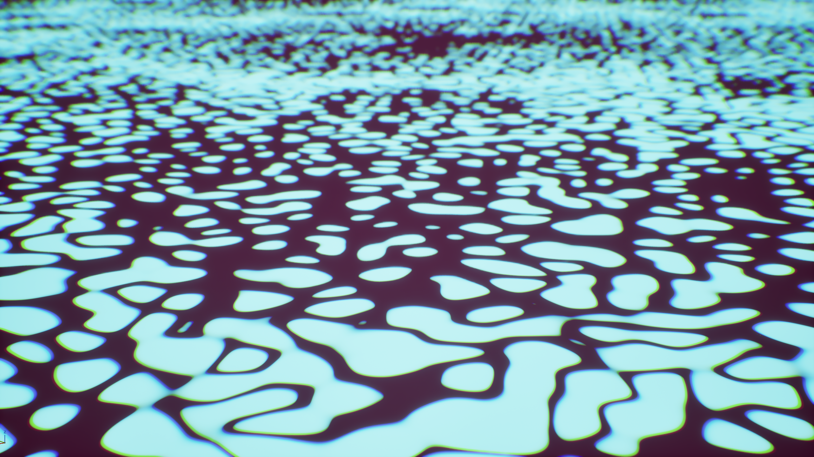
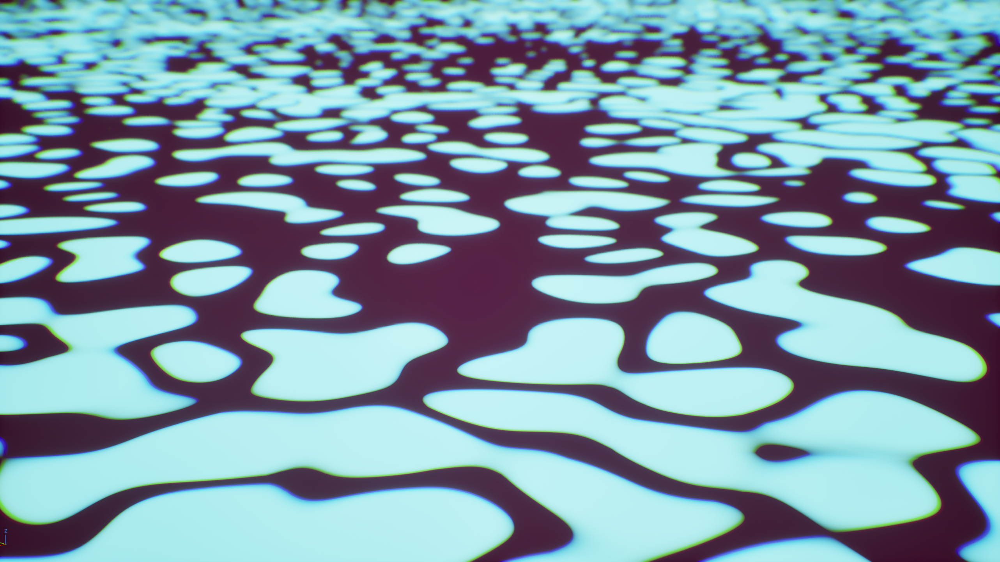

**Procedural Generation and Simulation**  

Prof. Dr. Lena Gieseke \| l.gieseke@filmuniversitaet.de  

---

# Session 02  - 20 Points

### Task 02.01 - Inspiration - 4 Points

Go to the [shadertoy](https://www.shadertoy.com/browse) site and browse the examples a bit. Submit the link to at least one example you like (you don't have to understand the code). Think about *what* you like about the example and *why*. You don't have to write anything about that in your submission but be able to explain it in class.

*On a side note*: shadertoy code does not directly run within the glsl-canvas environment (see Task 2.2).

*Submission:* [mandelbulb_](https://www.shadertoy.com/view/MdXSWn) 

### Task 02.02 - Function Design - 13 Points

Create a 2D pattern of your liking, e.g. the one you designed for the last homework by hand (Task 01.03) - but this is entirely up to you. The result should be polished. You can do this task either as fragement shader in VS Code or in Unreal as material.

Show different versions of the pattern by changing some parameters (sizing, colors, etc.), while maintaining the gist of the pattern.
  
With this task, I want you to practice **understanding and building individual function designs**. You are free to choose any design and environment you want, as long as it includes the building of a somewhat complex function, which has a visual outcome. Choose one environment you are interested in and which fits your overall learning path best (also feel free to learn both environments 😊). You can use the given start scenes and examples as basis. 

#### GLSL Fragment Shader

* If you are a beginner, see this [short introduction to GLSL with the glsl-canvas extension](./glsl/pgs_tutorial_glslintro.md).
* Examples: [start scene](./glsl/examples/functiondesign_startscene.glsl), [sin](./glsl/examples/sin.frag), [circle pattern](./glsl/examples/pattern_circles.glsl) (also see the [explanations in the script](../../02_scripts/pgs_04_functions_script.md#example-circle-pattern)), [kishimisu](./glsl/examples/kishimisu_commented_01.glsl)

#### Unreal Materials
* If you are a beginner, see this [short introduction to Unreal's material editor](./unreal/pgs_tutorial_materialsintro/pgs_tutorial_materialsintro.md).
* There are two example materials in the [Unreal Project `pgs_functiondesigns`](https://github.com/ctechfilmuniversity/lecture_ss26_procedural_generation_and_simulation/blob/main/docs/01_sessions/02_functions/unreal/pgs_functiondesigns.zip) (inside of the project in the `Content Browser` under `All/Content/pgs_functionsdesigns` -> level `LV_functiondesigns`)
    1. Function design with nodes in `M_pattern_circles_nodes`
    2. Function design with code (HLSL) in `M_pattern_circles_hlsl` .

 

*Submission:* At least three different images of your resulting pattern (screenshots are still fine), linked in your submission file. 

## Learnings

### Task 02.03 - 3 Points
*Submission*: 

Notes:
My goal started with creating an alien egg-like pattern which has an inner and an outer layer. For that I used voronoid patterns. I challenged myself in using unreal and trying to start with a goal of how my result should look and not by experimenting until I find something visually pleasing. 
One big challenge for me was actually finding valid ways to integrate that pattern by looking through unreal documentation and official examples. I noticed that previous versions handled some things differently so one mistake I kept fighting with in the beginning was not appending a 3d vector when going to a 2d vector which unreal does automatically some times but not always. 
I wanted to play around with maths operations so I used 3 in scale and orientation differing voronoid patterns that interact with each other through multiply and minus nodes. 

My changes in the demonstration are subtle and maybe more visible when you switch through the images in a gallery view. My intention behind this was to make the material animated in the future and therefore play with these values. The last image is a demonstration of how it is also able to change the scale of color distribution. 

### Variants:

