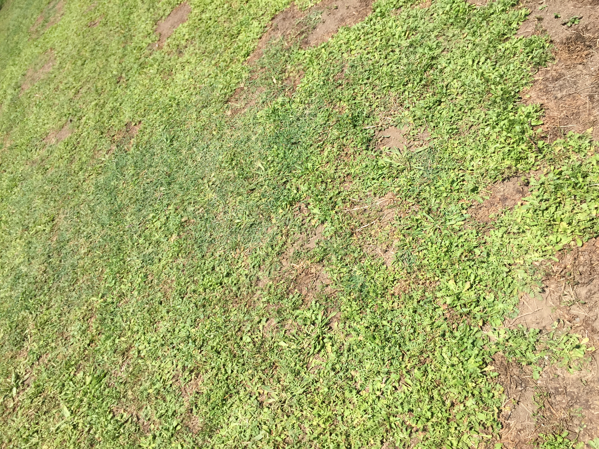
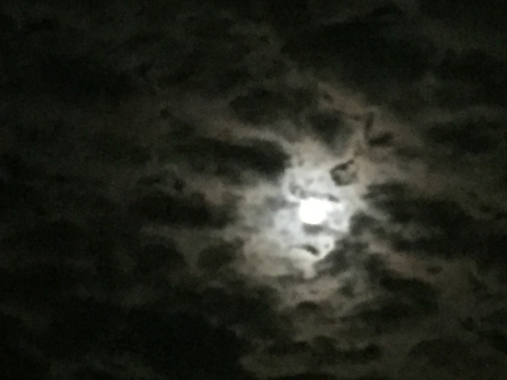
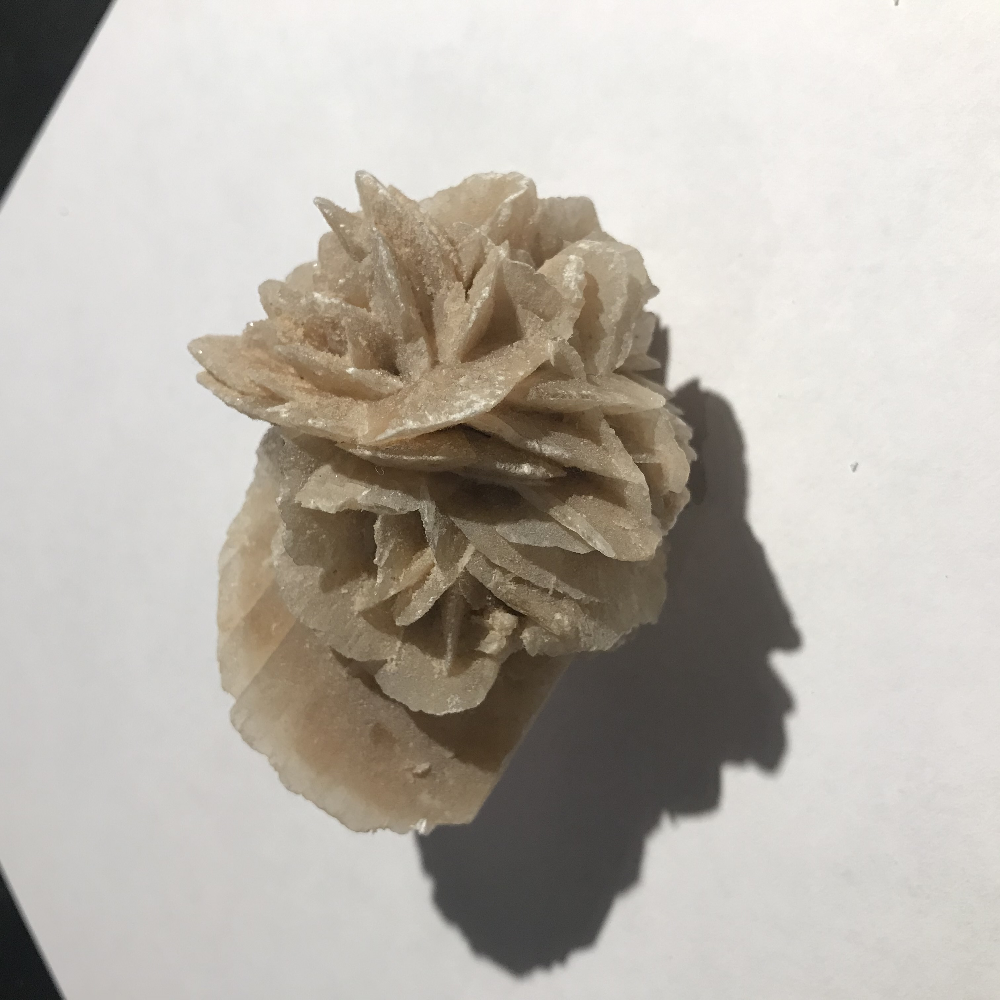
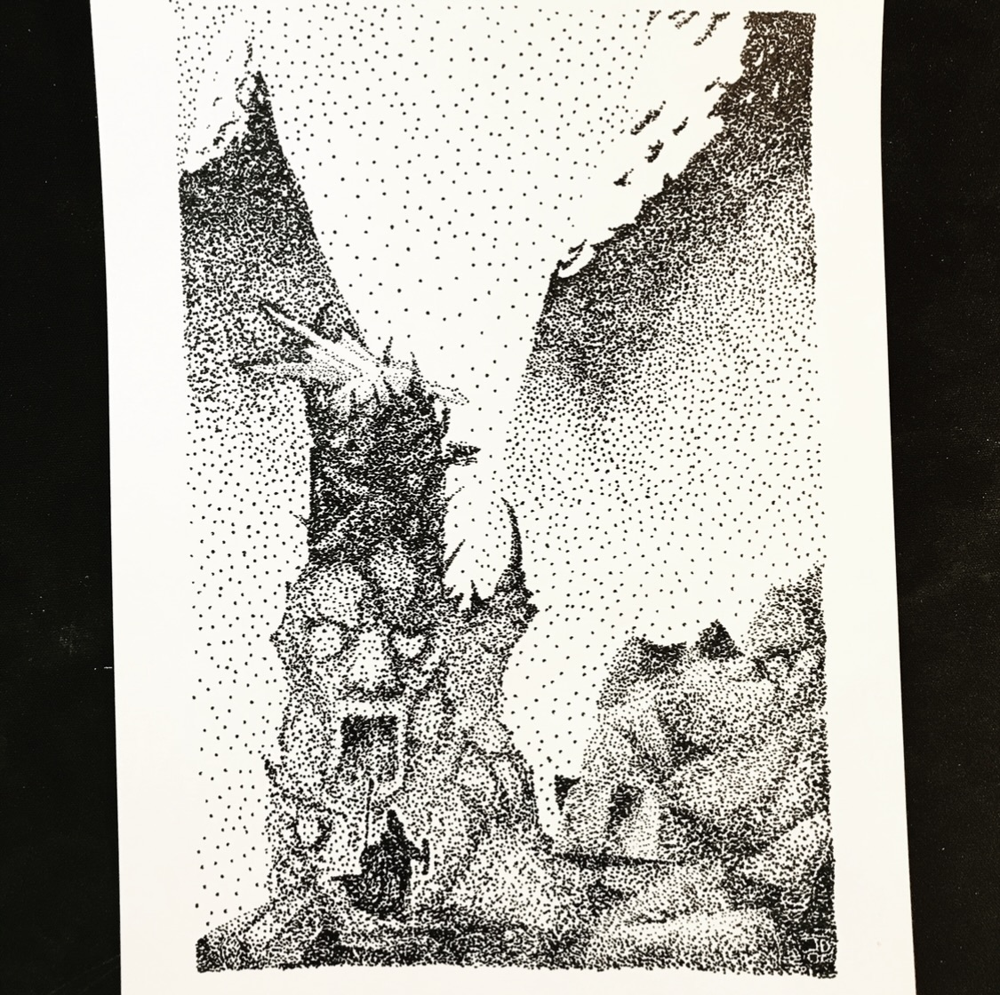
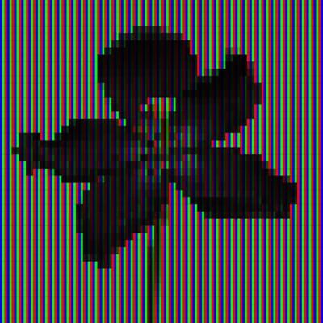
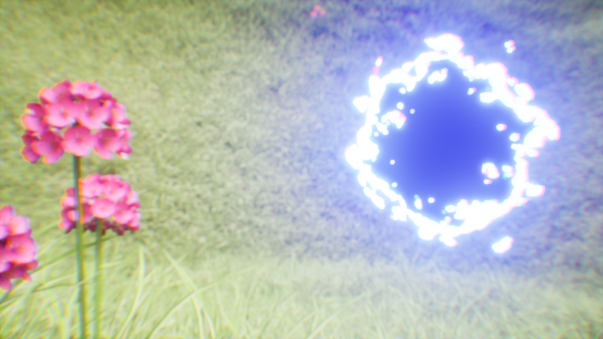

**Procedural Generation and Simulation**  

Prof. Dr. Lena Gieseke \| l.gieseke@filmuniversitaet.de  

---

# Session 04 - 20 Points

This session is due on **Wednesday, July 1st** before class.

This assignment should take <= 6h. As this assignment is open-ended, it is up to you to manage your time.

* [Task 04.01 - Collecting Inspiration - 3 Points](#task-0401---collecting-inspiration---3-points)
* [Task 04.02 - Randomness or Noise as Design Element - 14 Points](#task-0402---randomness-or-noise-as-design-element---14-points)
* [Learnings](#learnings)
    * [Task 03.03 - 3 Points](#task-0303---3-points)
* [How To Submit](#how-to-submit)
    * [CTech](#ctech)
    * [VFX](#vfx)

# Randomness

* [Chapter 06 - Noise](../../02_scripts/pgs_06_noise_script.md)

## Task 04.01 - Collecting Inspiration - 3 Points

* Submit at least three pictures of natural noise patterns. You can photograph them yourself (recommended) or find them on the internet.
* Submit one stylized / artistic image that uses noise as generating principle or design element. You can find it on the internet.

*Submission:* Link all images in your submission file.

### Natural:

I got these images by looking through my camera roll.

### Unatural:

This is an illustration of mine. This is theoretically not really noise, it just uses a noisy pattern directly depicting something. So this might already be applied noise.  

So here is another unnatural noise. Specifically the rgb artifacts from a screen. 

## Task 04.02 - Randomness or Noise as Design Element - 14 Points

You can create any scene you like, with the only requirement that it features noise or some form of randomness. This can be a material, scattering, a dynamic solver, a particle system, or... You are allowed to follow a tutorial but you must modify the result to make it your own. Also, in the end, you must have a good looking result but it doesn't have to be a whole scene, it can be just a material or an actor etc.!

This tasks is as much about working with noise, as it is about creating a concept or finding a tutorial to follow and managing your time. Think small rather than big. Be creative about having limitations 😎.

*Submission:*  

Link: https://owncloud.gwdg.de/index.php/s/qEahpD0Jq5mHQB5

## Learnings

### Task 03.03 - 3 Points

The Learnings from this task and the task before are a bit different because I had a major problem with the Unreal installation, that repeated even when installing and uninstalling. So a big learning is to “Verefy” the installation which is an option in the Epic Games launcher. After that a bunch of my problems had been fixed. I no longer saw a sphere that was blocking the camera whenever I added a camera. Unreal didn’t crash anymore randomly when connecting nodes and I was finally able to export visuals from my own device (which was good because I no longer had access to a different computer).  

In this project I tried to challenge myself in creating a scene that uses noise in everything. So it is composed of a plane that is distorted via noise. On that plain is grass placed through random noise. Scattered in between the grass are singular flower instances randomly scattered when overlapping noise patterns reach a specific value. And of course the portal is made up of two swirling noises that have included a colored noise pattern for the outside effect.  
Because I really struggled getting this done I stepped away from my Idea of creating a big environment through noise. I rather looked into working on small aspects that could include noise in many different “categories” of unreal.  

---
## How To Submit

### CTech

Answer all questions directly in a copy of this file and **also link and display all of your images in that file**. Submit your copy as `pgs_XX_lastname.md` in your submissions folder (replace the XX with the number of the session). 

Please add `nav_exclude: true` to the header of your submission file so that it is not added to the navigation bar of the overall website.

### VFX

To hand in your homework assignment, you submit images and texts in your OwnCloud document:

* [The OwnCloud Folder](https://owncloud.gwdg.de/index.php/s/CSVXtrxMNDyER3T)
* Open your file, add your text, links, etc.
  

---

**Happy Randomizing!**
