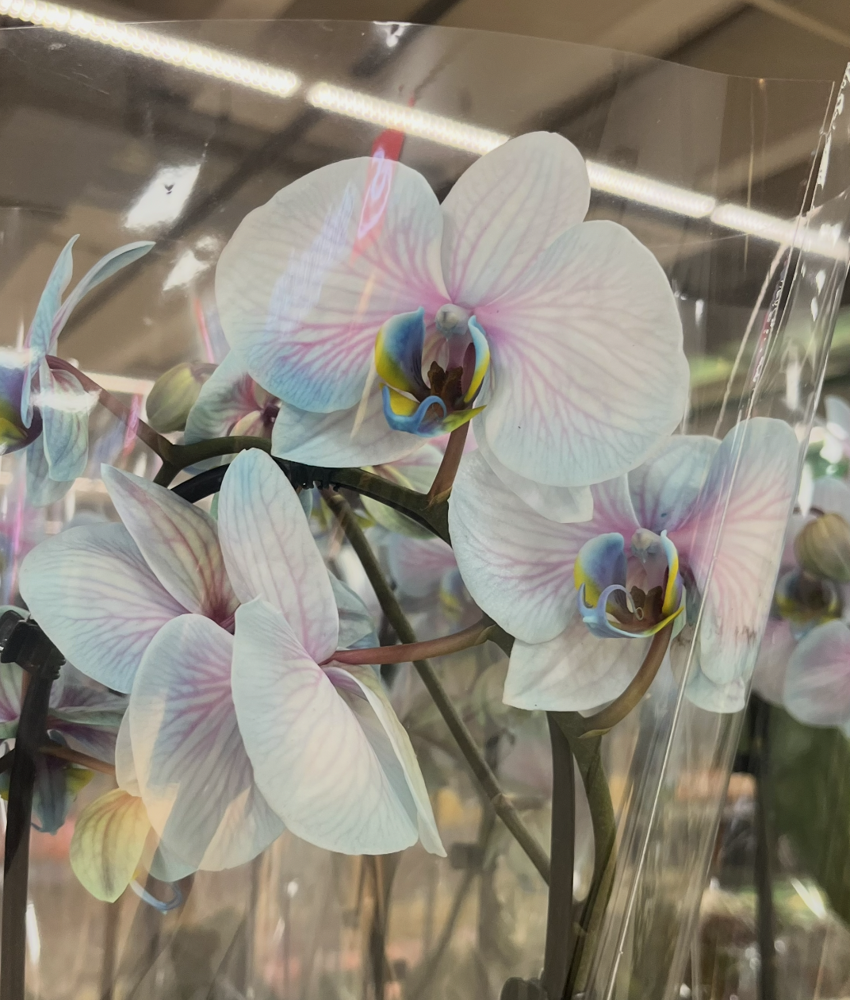
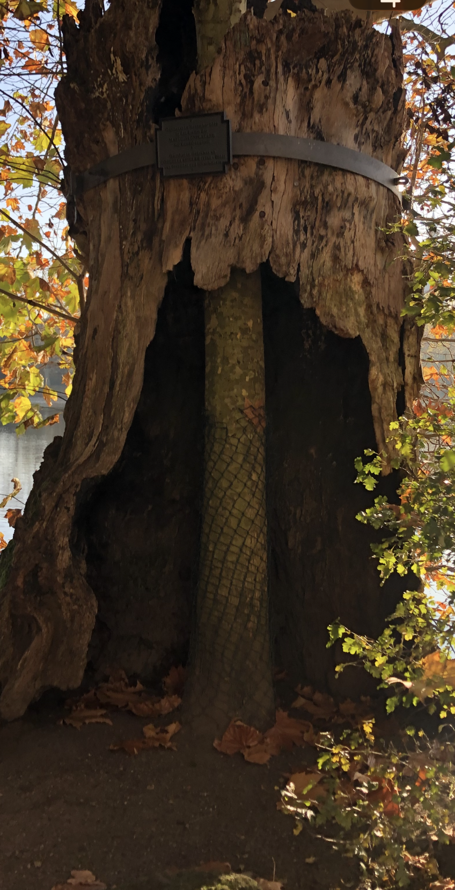
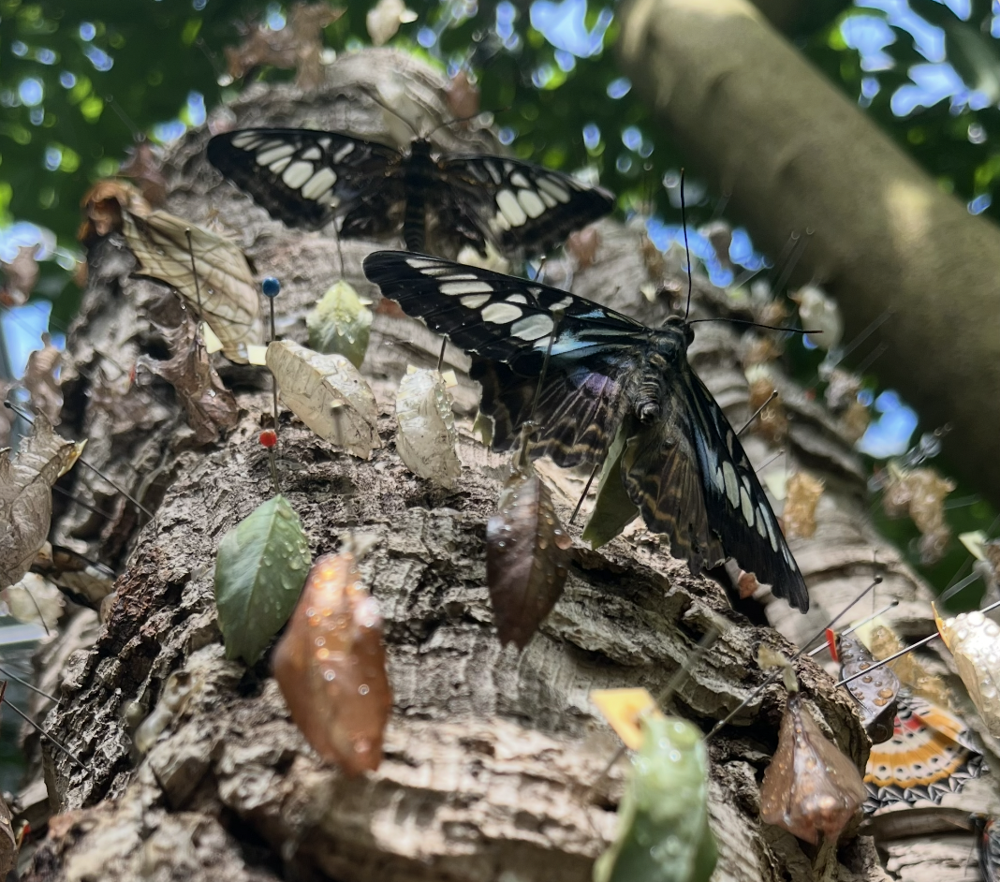
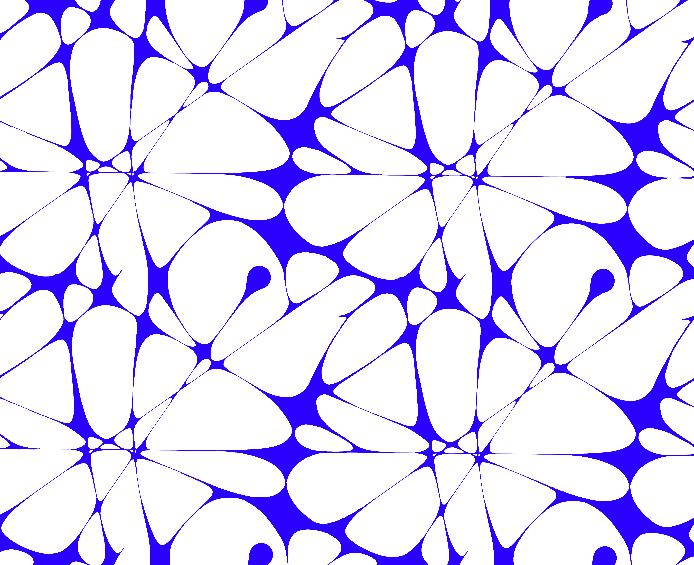
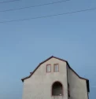
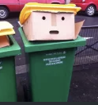
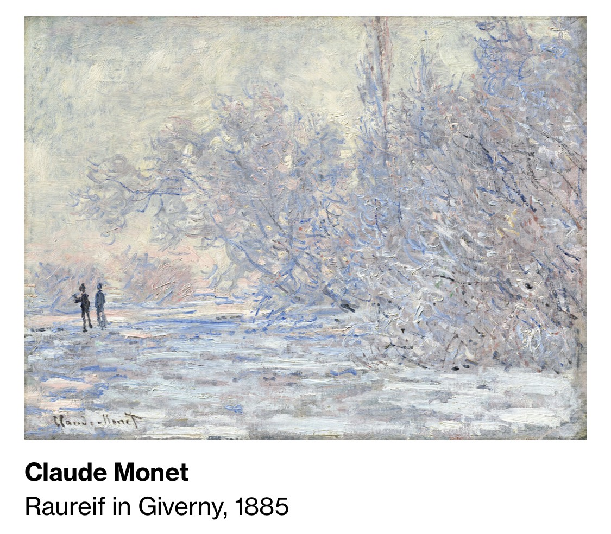
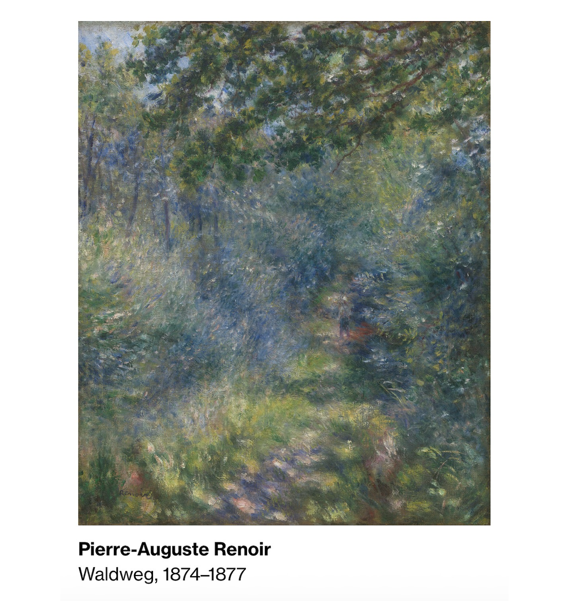
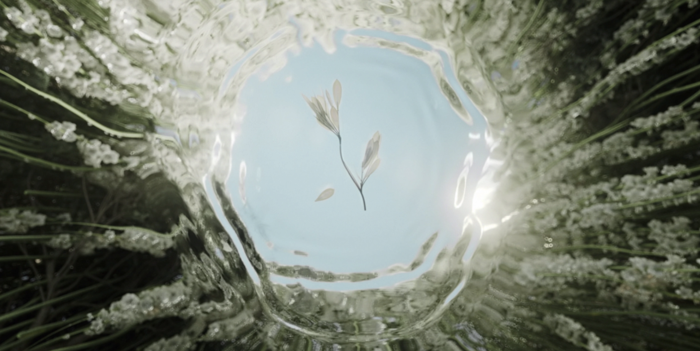

# Task 01.01 - 1 Point
*- Which of the chapter topics given in the syllabus are of most interest to you? Why?*

- Pattern generation and simulation, particularly how natural patterns can be recreated and animated digitally. I'm drawn to the mathematical foundations behind procedural generation, especially how simple rules like repetition and self-similarity can produce visually complex results. The section about particle systems and agents was exciting to me because of its potential for creating organic, flowing, psychedelic visuals -> moving patterns that feel alive and rooted in nature. The CGI artists shown in the script, like Alberty Omoss and Sage Jenson represent a design direction which I find interesting.  

---
*- Are there any further topics regarding procedural generation and simulation that would interest you?*

- I would be interested in exploring how sound or music can influence procedural systems. Like audio reactive particle simulations or patterns that respond to rhythm or frequency.
- I'm also curious about how psychedelic or optical illusion aesthetics can be achieved procedurally, and whether there are established techniques for animating natural patterns like growth, flow or decay in a visually hypnotic way. 
---

*- Is there a different tool than Unreal that you would prefer to do the exercises with (e.g. Houdini, Unity, Maya, Blender, JavaScript, p5, GLSL, …)? If so, which one, and why?*

- I have a background in Blender so I would obviously feel comfortable working there, I've also been curious about TouchDesigner, which seems well-suited for real-time, audio-reactive, and generative visual work. However, for this course I plan to work with Unreal Engine, as it offers powerful procedural tools, and I see it as a valuable skill to develop, especially given its use in film and virtual production contexts.

---
# Task 01.02 - Seeing Patterns - 1 Point

## Nature

**Caladium Blatt:** Beispiel für Self-Similarity. Die Blattadern verzweigen sich immer weiter, vom Hauptstamm in der Mitte zu immer kleineren Ästen. Das gleiche Verzweigungsprinzip wiederholt sich auf jeder Skala. Genau wie ein Fraktal. 

---

**Roter Baum am See:** Self-Similarity ist deutlich im Astwerk sichtbar. der Hauptstamm teilt sich in Äste, die sich in kleinere Äste teilen, die sich in noch kleinere teilen. 

---

**Orchidee**: Hier sind die Venenmuster auf den Blütenblättern interessant. sie strahlen vom Zentrum aus und wiederholen ein ähnliches Prinzip wie die Caladium-Adern. Weniger ausgeprägte Self-Similarity, hat aber auch das Strahlungs-Pattern. 

---

**Baumrinde:** Die Rissstruktur der Rinde zeigt Self-Similarity. Die großen Risse verzweigen sich in kleinere, die sich wieder in noch kleinere verzweigen. Das gleiche raue Muster auf jeder Zoom-Stufe. Das ist statistisch selbstähnlich, genau wie Küstenlinien (die im Script erwähnt wurden).

---

**Schmetterlinge:** Die Flügelmuster sind symmetrisch und repetitiv, aber nicht wirklich selbstähnlich im mathematischen Sinne. Eher ein Symmetrie-Pattern. Die Puppen und Blätter im Hintergrund zeigen aber organische Texturen mit wiederholenden Strukturen. 

---
# Task 01.03 - Designing Patterns - 3 Points

1. Ein Netz aus Punkten: von jedem Punkt strahlen dünne Linien aus (wie ein Spinnennetz)
2. Zwischen den Linien entstehen organische, abgerundete Zellen: wie aufgeblasene Dreiecke
3. Das ganze wiederholt sich in einem regelmäßigen Grid

**Rule-based:** zuerst eine Struktur, dann werden die Zwischenräume gefüllt.
- Erst Raum aufteilen (Gitter + Punkte)
- Dann Regeln für jeden Teilbereich anwenden (organische Form reinzeichnen)
- Ähnlich wie Voronoi Partitionierung aus dem Script!

## Pseudo Code
**SETUP:**
- Definiere ein Grid mit gleichmäßigen Abständen
- Platziere Knotenpunkte an den Grid-Schnittpunkten
- Verschiebe jeden Punkt leicht zufällig (für organischen Look)

**FÜR JEDEN KNOTENPUNKT:**
- Zeichne dünne Linien zu den Nachbarpunkten

**FÜR JEDEN BEREICH ZWISCHEN DEN LINIEN:**
- Finde die Ecken des Bereichs (die Knotenpunkte)
- Zeichne eine organische, abgerundete Form
- Jede Ecke wird zu einem abgerundeten "Blob"
- Die Formen berühren sich fast, aber nicht ganz
- Fülle die Form mit Weiß

FARBEN:
- Hintergrund = Blau
- Formen = Weiß
- Linien = Blau

WIEDERHOLUNG:
 - Tile das ganze Pattern über die gesamte Fläche

---
# Task 01.04 - Seeing Faces - 1 Point

---
# Task 01.05 - Painting - 2 Points

[Quelle der Bilder](https://sammlung.museum-barberini.de/de/)

I chose two Impressionist paintings: Hoarfrost at Giverny (1885) by Monet and Path in the Forest (1874–1877) by Renoir.
What I like about both is how light feels like it comes from within the scene: soft, glowing, diffused, with blooming lights. Monet's frost also turns a simple landscape into a repetitive, almost fractal-like texture.
For my own work, both inspire me in terms of the use of light and color. Also the forms created by the trees are very inspiring because it all is very crowded and moving like an own organic being.

---
# Task 01.06 - Artistic Expression in CGI - 2 Points

[Quelle](https://www.mocomuseum.com/de/exhibitions/amsterdam/die-symphonie-der-natur/)
/
[Video 1](https://www.instagram.com/p/DUqufXtjENx/?img_index=3)
/
[Video 2](https://www.instagram.com/p/DUqufXtjENx/?img_index=13)
/
[Video 3](https://www.instagram.com/p/DGA8dhqNjiI/)

I chose **The Symphony of Nature** by **Six N. Five**.

What I love about it is how it recreates nature in a way that feels hyper-real and dreamlike at the same time. The light glows from within the scene, very similar to what I admire in the Impressionist paintings I chose -> soft, diffused, blooming. The organic forms feel alive and procedural, as if they were grown rather than modeled.
I consider it artistic because it goes beyond technical skill. It creates an emotional atmosphere. Nature is not just represented but reinterpreted, which is exactly what I want to explore in my own work.