# Submission 02
## Task 02.01 - Inspiration - 4 Points

Submission: Links in your submission file.

- [Manga 3D Girl](https://www.shadertoy.com/view/lcV3Dt)
- [Curious Crystal](https://www.shadertoy.com/view/slccDX)
- [Raindrops](https://www.shadertoy.com/view/ltffzl)
- [Morphing Glass Crystal](https://www.shadertoy.com/view/flfyRS)
- [Fractured Orb](https://www.shadertoy.com/view/ttycWW)

## Task 02.02 - Function Design - 13 Points
### Some Process Pictures

<table>
  <tr>
    <td align="center">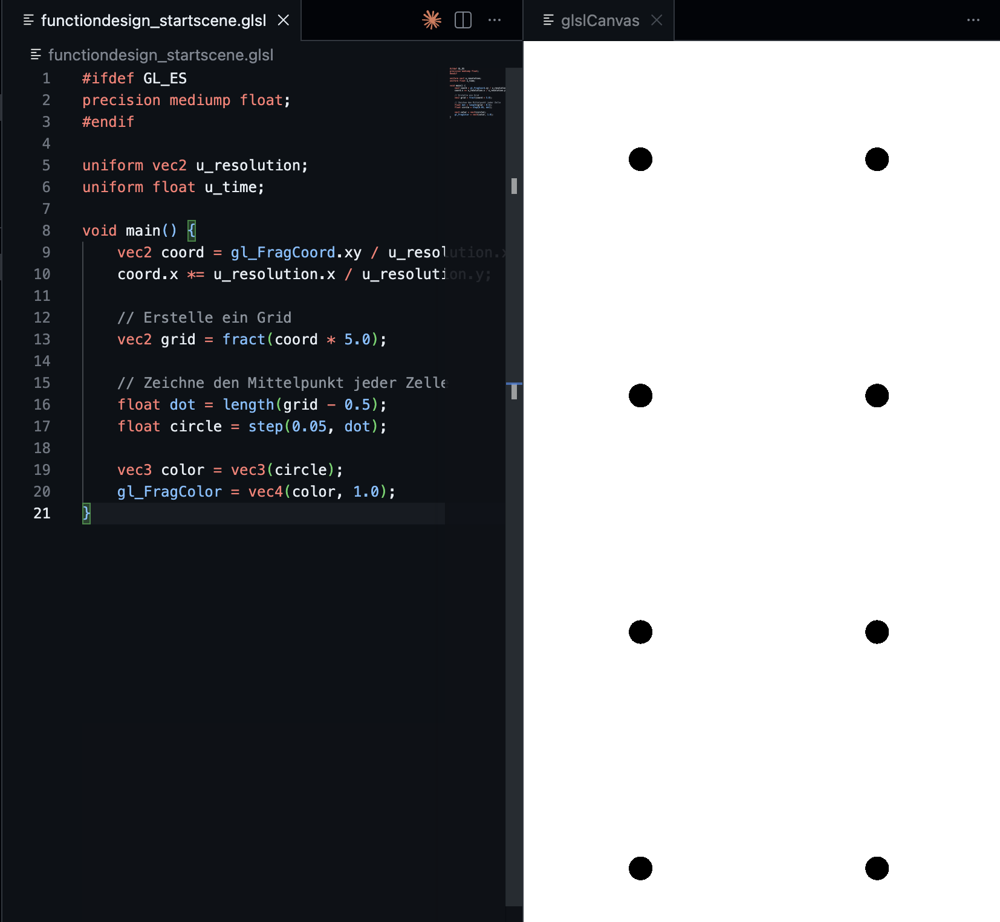</td>
    <td align="center">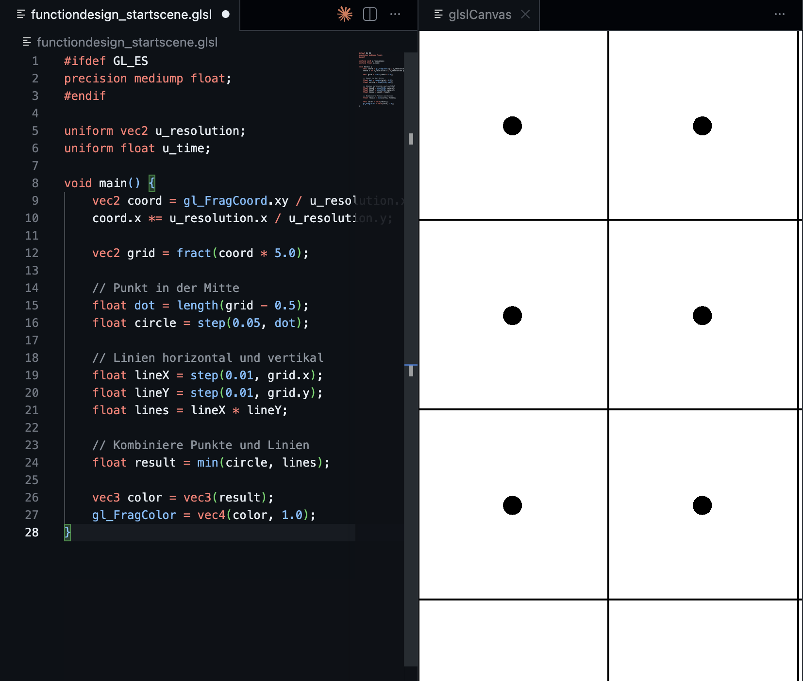</td>
    <td align="center">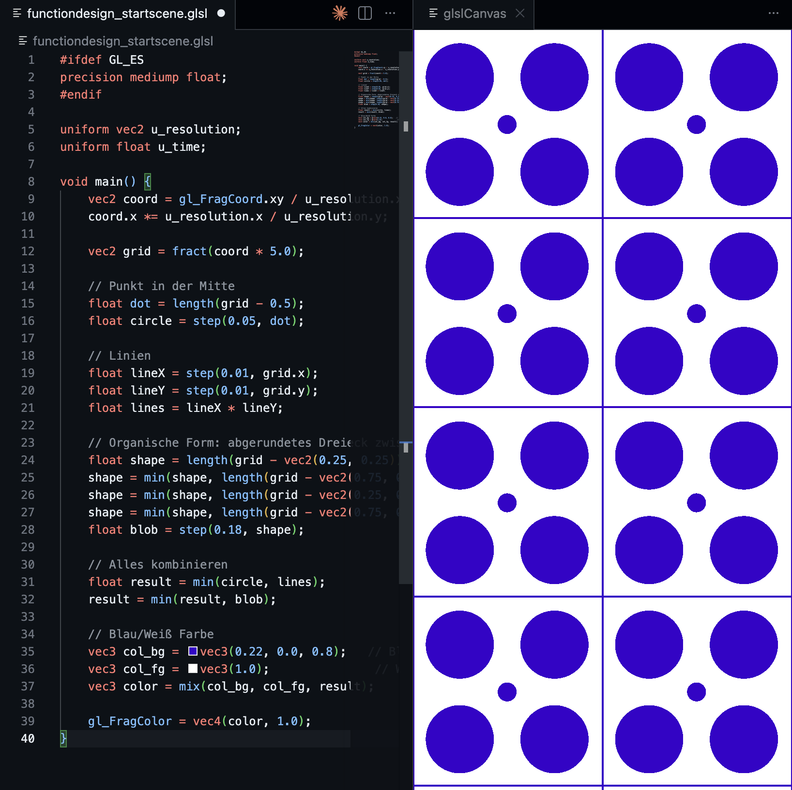</td>
  </tr>
  <tr>
    <td align="center"></td>
    <td align="center"></td>
    <td align="center"></td>
  </tr>
  <tr>
    <td align="center">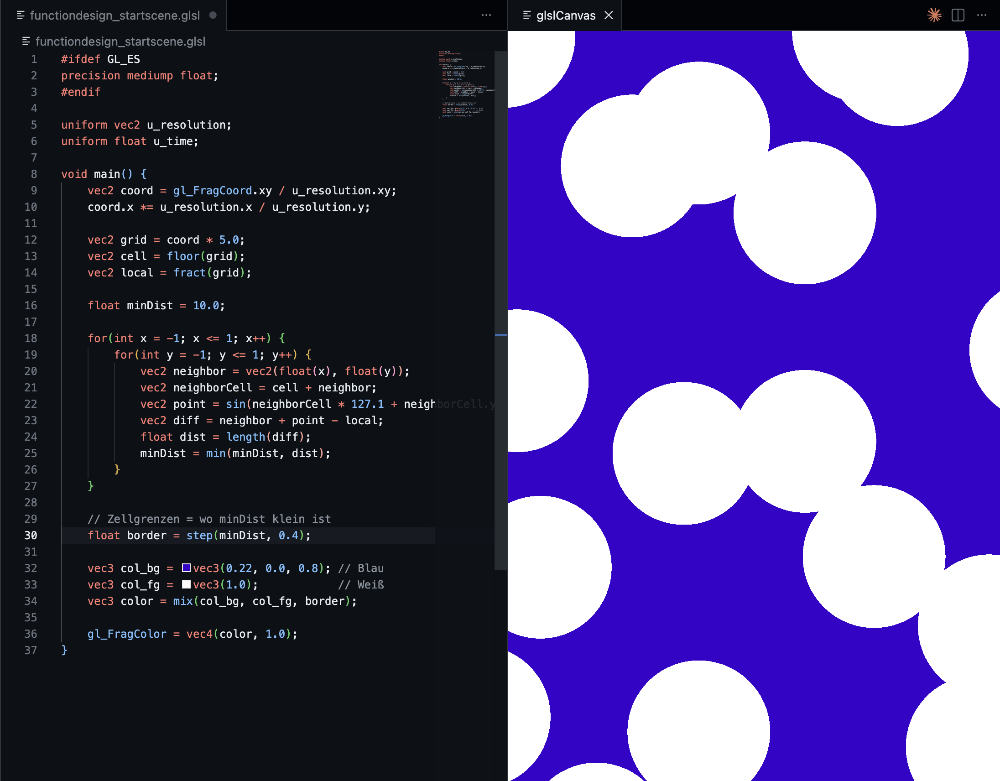</td>
    <td align="center"></td>
    <td align="center">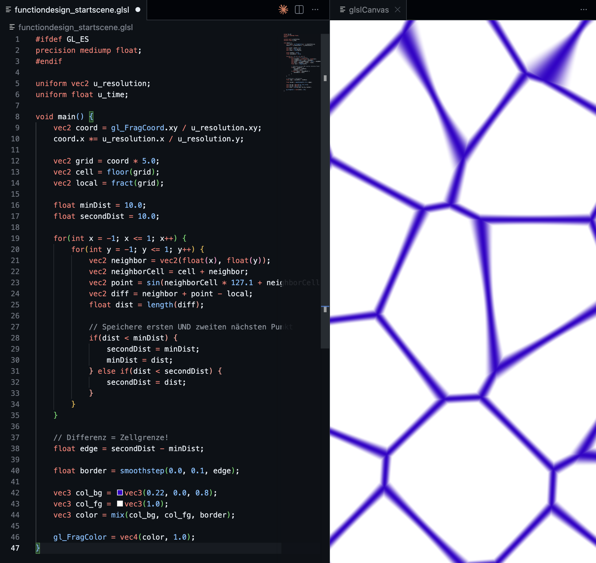</td>
  </tr>
  <tr>
    <td align="center">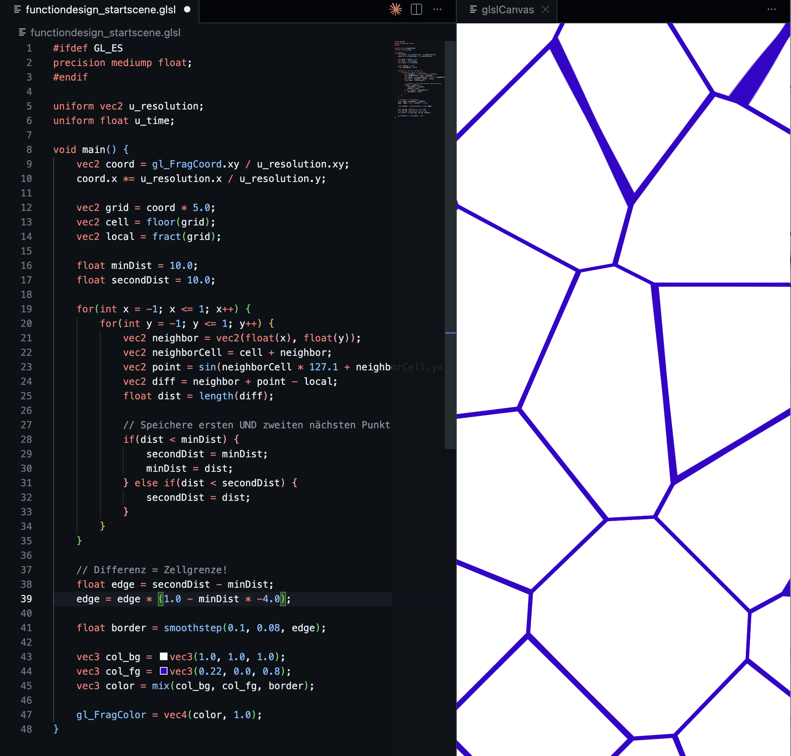</td>
    <td align="center">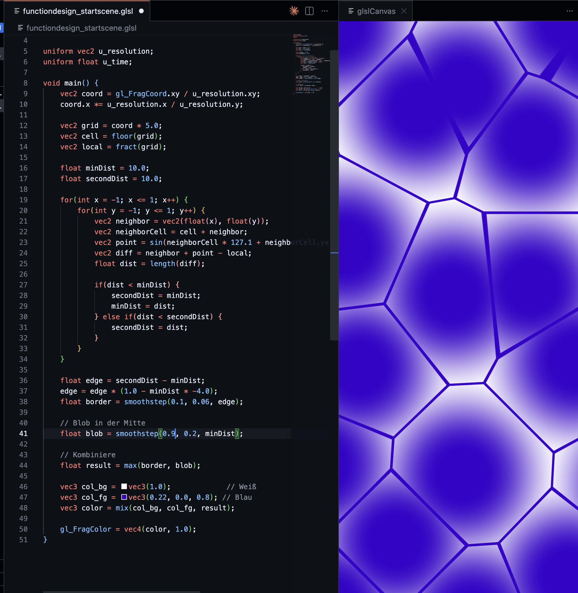</td>
    <td align="center"></td>
  </tr>
  <tr>
    <td align="center"></td>
    <td align="center"></td>
    <td align="center"></td>
  </tr>
</table>

---
### Where I stopped (each path)
Four approaches were explored:
- **Metaballs only** – organic blobs using a falloff formula, radius and iso value as main parameters
- **Voronoi Blob v1** – Voronoi cells with a soft blob per cell
- **Voronoi Blob v2** – same but with different blob size and threshold
- **Voronoi + Metaball** – Voronoi borders with metaballs at the crossing points

<table>
  <tr>
    <td align="center">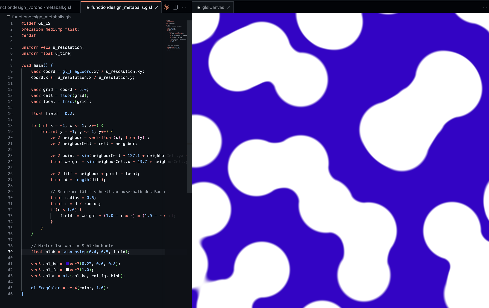</td>
    <td align="center">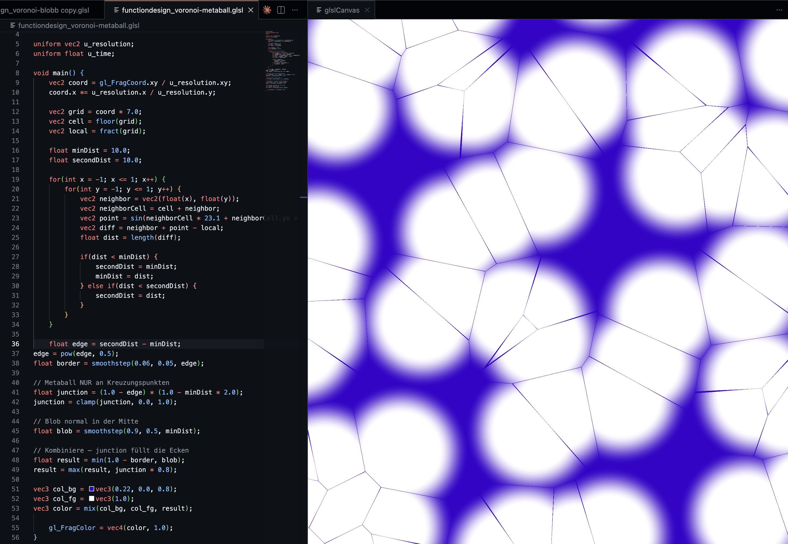</td>
  </tr>
  <tr>
        <td align="center">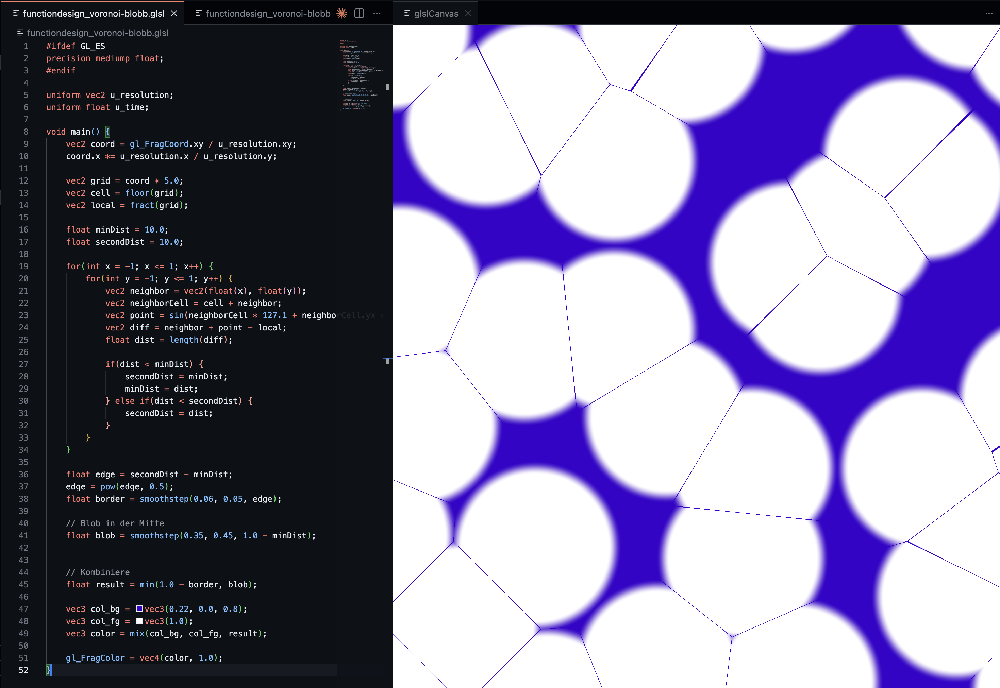</td>
    <td align="center">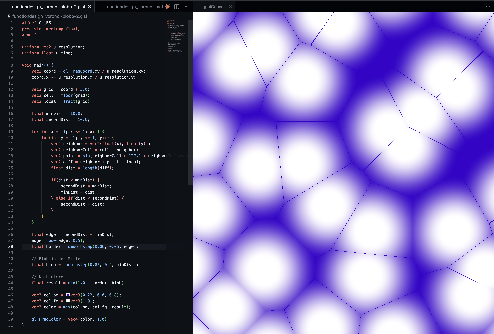</td>
  </tr>
</table>

---
### The Results

<table>
  <tr>
    <td align="center"></td>
    <td align="center"></td>
  </tr>
</table>

## Task 02.03 - 3 Points
- Learned how Voronoi works in GLSL using minDist and secondDist for cell borders
- Explored the metaball formula (1.0 - r*r)*(1.0 - r*r) for organic blob connections
- Practiced smoothstep, fract, floor, and pow for pattern building

### Challenging:
- Translating a hand-drawn organic pattern into math is much harder than expected
- Voronoi and metaballs fight each other when combined
- Small parameter changes had large unexpected effects

### How I challenged myself:
- Tried two completely different approaches instead of sticking with the first
- Researched metaballs/marching cubes independently (grasshopper3d.com)
- Used Claude as coding assistant but understood the steps and tuned parameters myself

**Note:** After 6 hours the result still doesn't match my original drawing. Submitting current state.