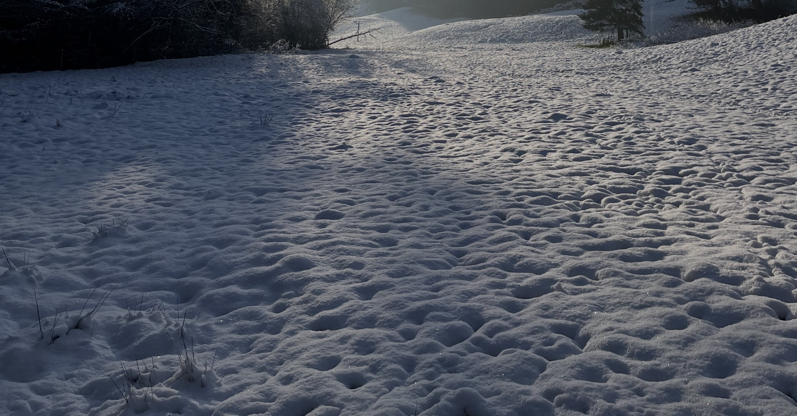
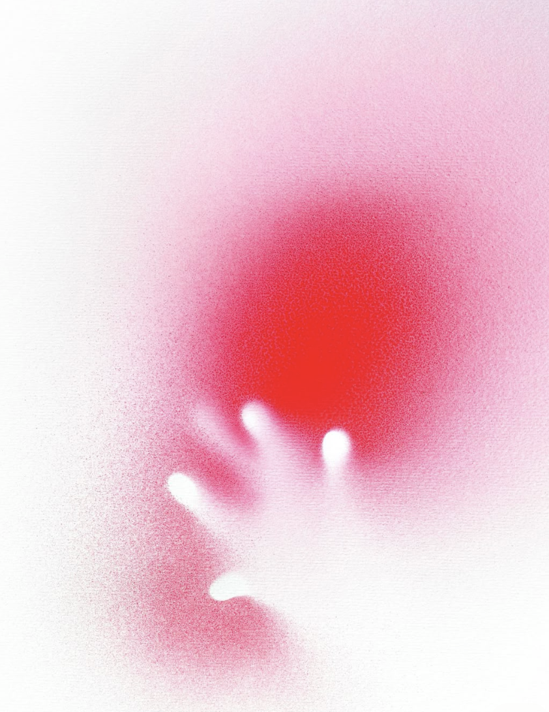
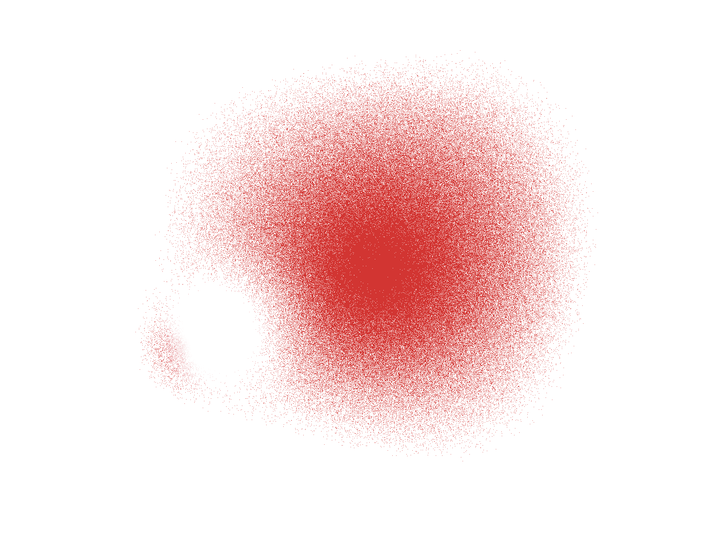
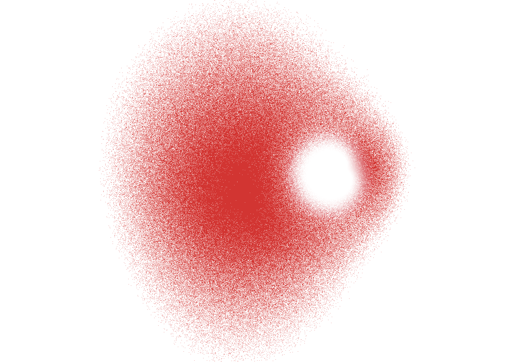
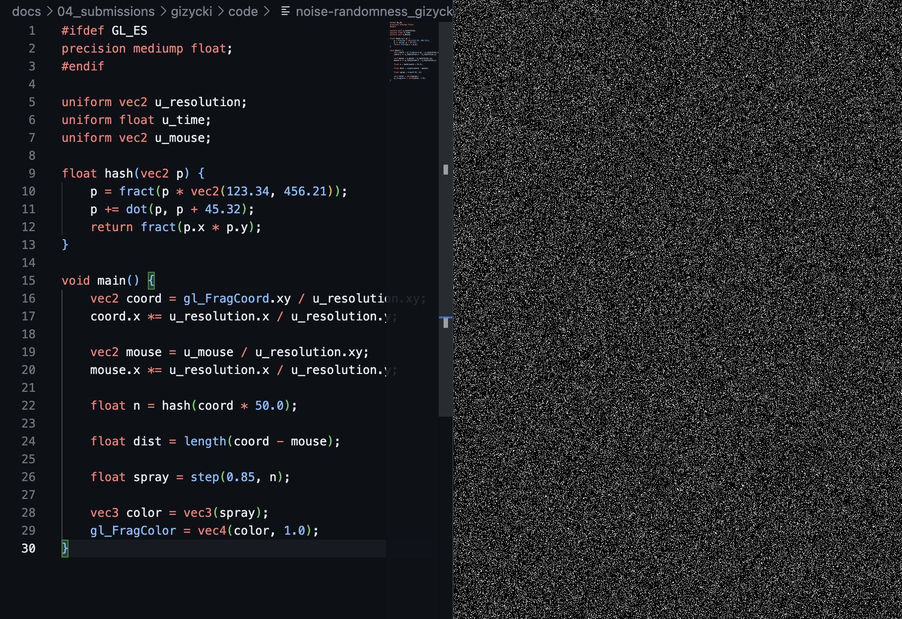
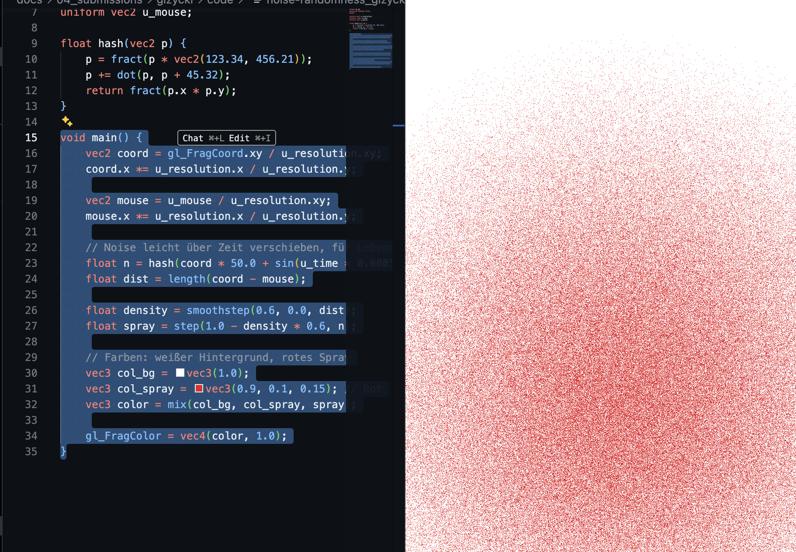
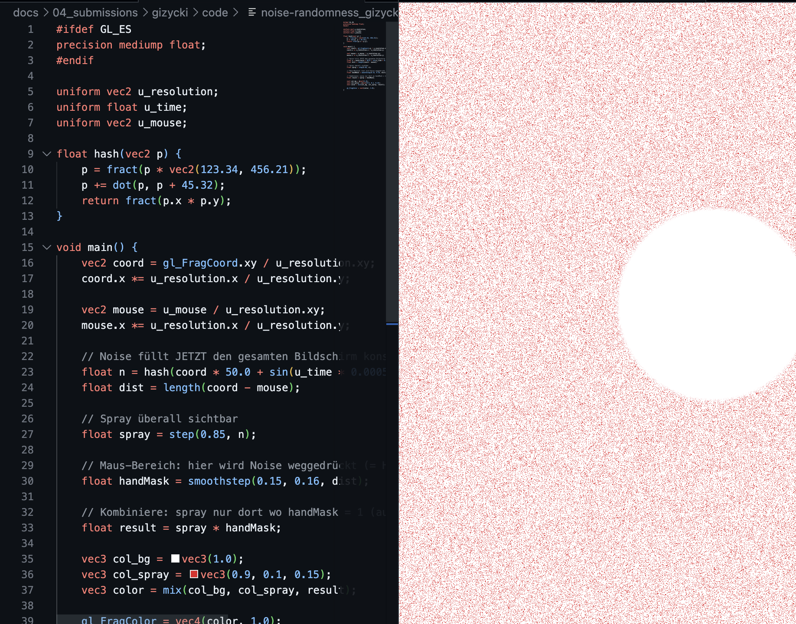

# Task 04 - Randomness - 20 Points

## Task 04.01 - Collecting Inspiration - 3 Points
### Natural Noise Pattern

> Altocumulus Wolken, sehr regelmäßiges, fast wellenartiges Wolkenmuster

> Cellular/Worley-artige Struktur, fast wie ein gerendertes Pattern

> Noise-Textur, Rippel-Struktur (Fußspuren & Wind-Rippel)

### Stylized / Artistic Image

[Link](https://www.flickr.com/photos/135372120@N07/22933914302/) "Sans titre" von Sébastien Fraysse - Aufgenommen am 3. Juli 2015
> - Körnige Spray-Textur: die feinen Farbpartikel des Sprays erzeugen zufällig verteilte Punkte/Tröpfchen, die sich zu einer Fläche zusammensetzen, ohne wiederkehrendes Muster (Stochastisches Noise).
> - Lokale Variation, globale Struktur: Am Rand des Sprühnebels sind einzelne Punkte (lokales Detail) und zur Mitte hin eine klare Form (globale Struktur).
> - Amplitude/Dichte als Gestaltungsmittel: Sprühdichte nimmt zum Zentrum hin zu, fast wie ein gesteuerter Amplituden-Gradient in einer Noise-Funktion. Die Hand selbst entsteht als negative Form: dort wo kein Noise (Spray) hinkam.
> - Analog vs. Digital: es wurde nicht algorithmisch erzeugt, sondern physikalisch durch Zufall. (Sprühnebel Ausbreitung in der Luft).

## Task 04.02 - Randomness or Noise as Design Element - 14 Points

<table>
  <tr>
    <td align="center"></td>
    <td align="center"></td>
  </tr>
</table>

## Task 04.03 - Learnings - 3 Points

- Learned how hash-based noise creates grainy, organic textures
- Learned how to use dot products for directional, asymmetric effects
- Learned how shifting coordinates (displacement) can simulate physical interaction

**Challenging:**
- Turning a visual idea into the right math was harder than expected
- I relied a lot on AI help for GLSL syntax and debugging
- Small parameter changes often had unpredictable results
- I pushed for an interactive, mouse-driven effect instead of a basic noise pattern
- I want to be honest that I still need more practice writing GLSL on my own

### Process

<table>
  <tr>
    <td align="center"></td>
    <td align="center"></td>
    <td align="center"></td>
  </tr>
  <tr>
    <td align="center"></td>
    <td align="center"></td>
    <td align="center"></td>
  </tr>
  <tr>
    <td align="center"></td>
    <td align="center"></td>
    <td align="center"></td>
  </tr>
</table>

