# Final Project & Course Wrap-Up - Assignment 05

## Table of Contents
- [Task 05.01 - Final Project](#task-0501---final-project)
- [Task 05.02 - Feedback](#task-0502---feedback)
- [Task 05.03 - Learnings](#learnings)
  
---

## Task 05.01 - Final Project

### Summary
For the final project I created a 5-second, 24 fps vertical (1080x1920) cinematic render in Unreal Engine 5. The project focuses on procedural generation and real-time simulation. It features a character called Eora who goes through a procedural particle disintegration from a Grass field inspired by the Windows XP Background (by Charles O'Rear) to a clean digital environment. The goal was to take the Niagara simulation concepts from the lecture, push them further, and make sure the real-time viewport and the final Movie Render Queue output looked exactly the same.

Also submitted to the Gauntlet of Gods 3D Community Challenge by @pwnisher. The challenge provided a concrete, deadline-driven framework to apply and test Niagara particle systems and MetaHuman workflows in a real production context. The tech specs (120 frames, 24 fps, vertical 1080x1920) were used directly as the project format.

#### The Video Including my Sounddesign: [Final Video](https://www.instagram.com/reel/Dc8RcC-R2f9/)

#### OwnCloud/Google Drive Link: [Click here for the source file](https://owncloud.gwdg.de/index.php/s/csBscry46p3RbgF)

<table>
  <tr>
    <td align="center">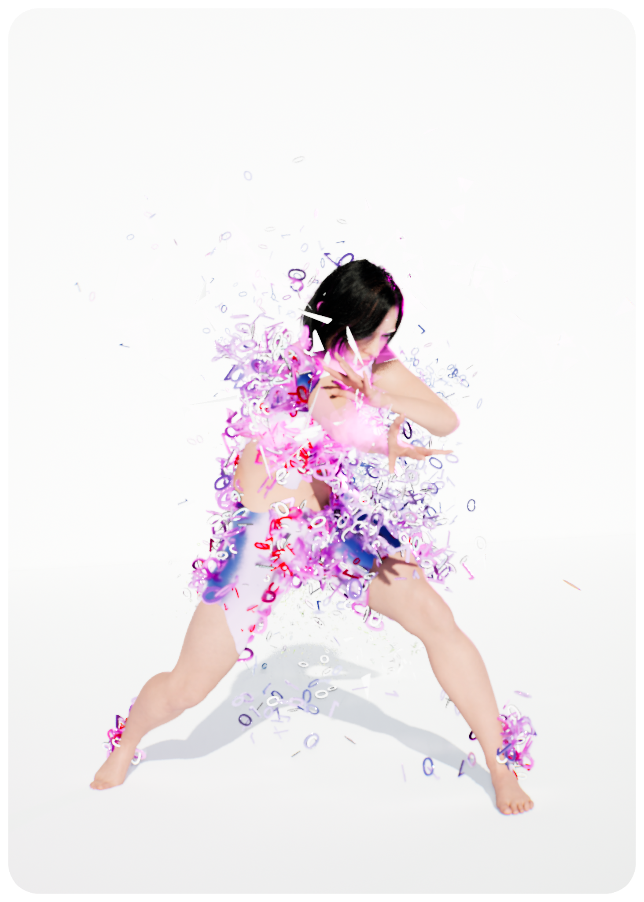</td>
    <td align="center">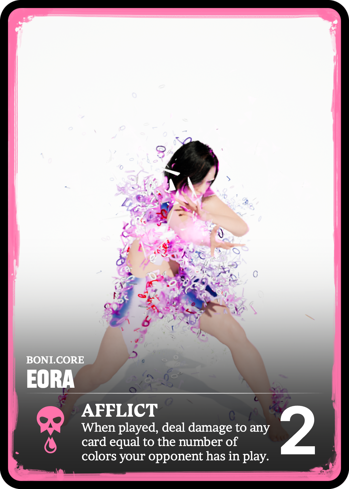</td>
  </tr>
  <tr>
    <td align="center">Card Art</td>
    <td align="center">Final Card Composite</td>
  </tr>
</table>

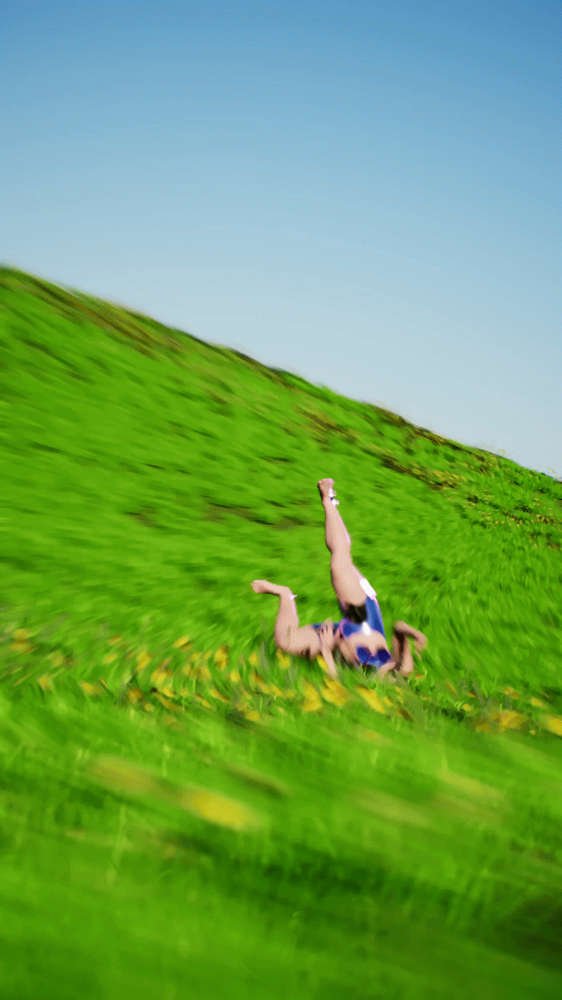

---

### Concept
The concept is a stylized digital story: Eora is an "error girly" (her name is basically inspired by the word Error) breaking out of a desktop world into a new empty white system. It's like breaking out into the "blank paper" not fearing but longing it.

The project is structured around the Gauntlet of Gods card game format: Eora is designed as a playable champion card with the ability "Afflict" – a damage-over-time effect that fits her digital disintegration aesthetic. The card art and composite were created alongside the animation using the official card creator tool.

Visuals and Simulation: A procedural disintegration effect paired with dynamic glass-shattering simulations and vibrant reflection fields.

Format: Vertical format made for modern short-form video and cinematic reels.

Goal: Build a polished sequence by expanding on course concepts, while solving complex real-time simulation and rendering challenges.

<table>
  <tr>
    <td align="center">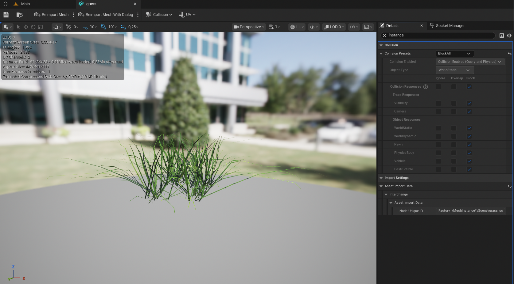</td>
    <td align="center">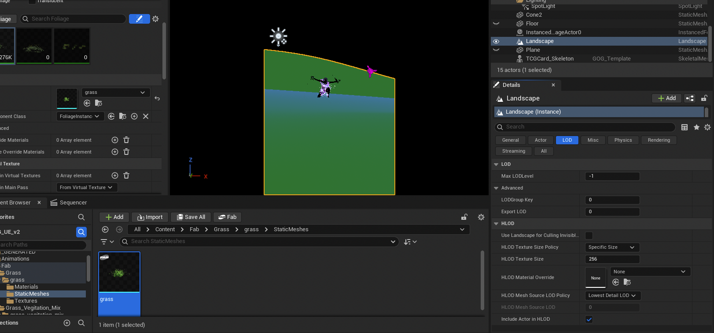</td>
  </tr>
  <tr>
    <td align="center">Grass field reference scene</td>
    <td align="center">Grass field in engine</td>
  </tr>
</table>

### Implementation

**1. Procedural Niagara Simulations**

Built on top of the particle simulation techniques from the course. Extended the base systems using Curl Noise, Drag, and Deterministic Physics to control particle movement and timing. Fine-tuned Spawn Rates, Velocity Scales, and lifetime settings to get a punchy and responsive procedural burst.
Addressed World Position Offset (WPO) alignment between the dissolve material shader and Niagara particle sampling to ensure particles correctly emitted from displaced mesh surfaces.

<table>
  <tr>
    <td align="center">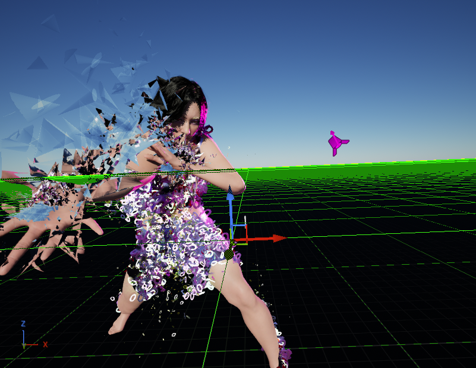</td>
    <td align="center">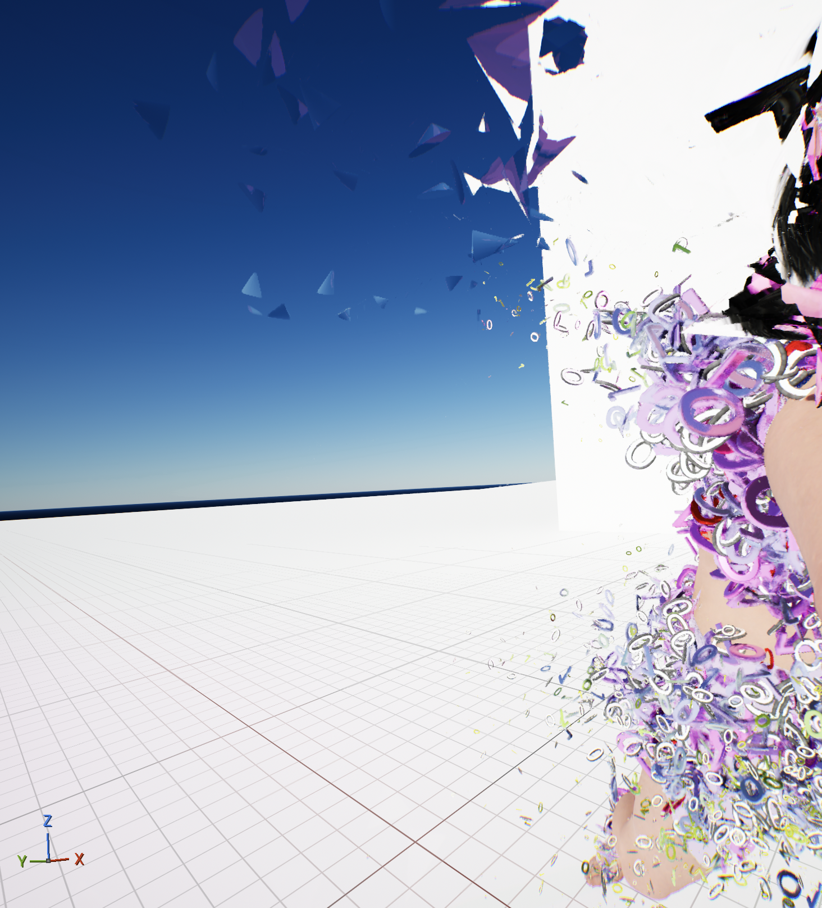</td>
  </tr>
</table>

**2. Sequencer & Timeline Setup**

Set up a strict 120-frame (5-second) timeline at 24 fps. Synchronized character movement and simulation triggers precisely around frame 63.

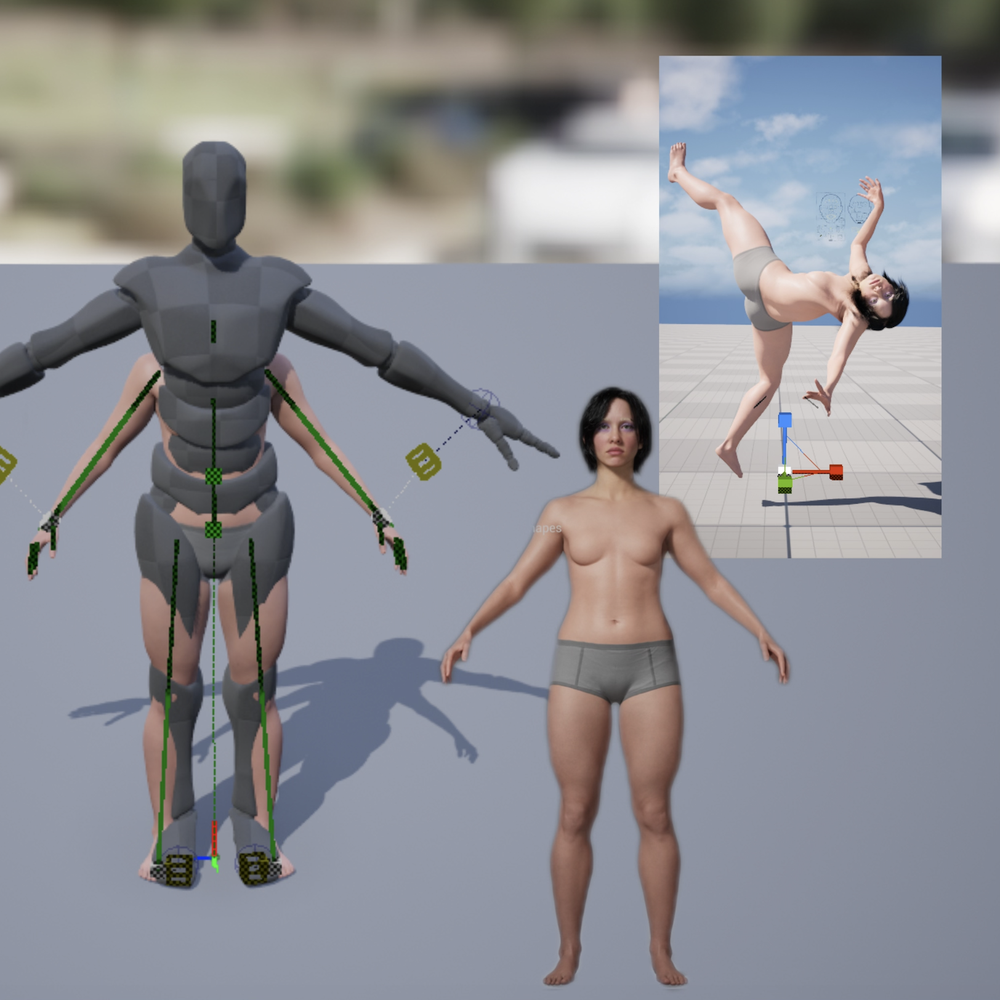

**3. Materials & Procedural Shading**

Built custom glass and dissolve shader logic that reacts to the simulation. Configured blending modes and refraction settings to keep material highlights clean under Deferred Rendering.

<table>
  <tr>
    <td align="center">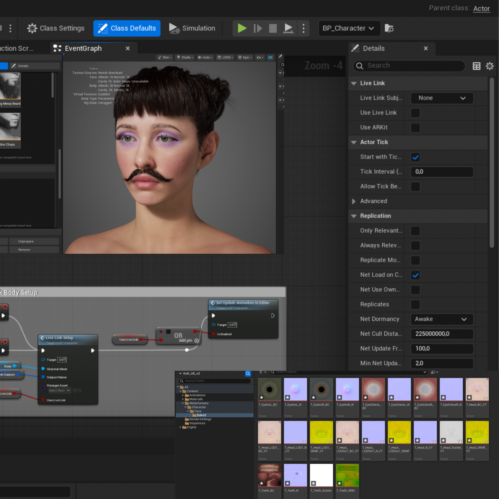</td>
    <td align="center">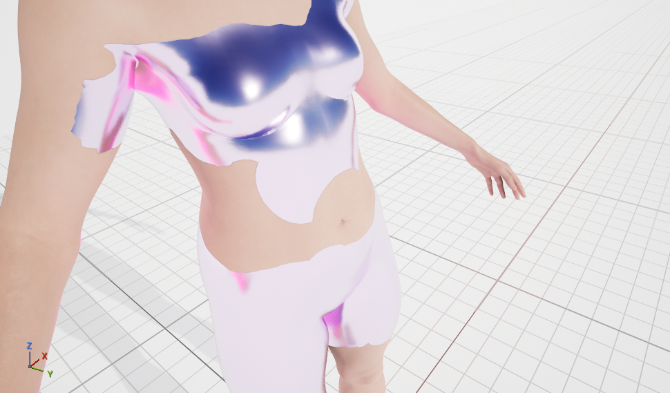</td>
  </tr>
  <tr>
    <td align="center">Insights into Character Making-Off</td>
    <td align="center">Finished Chrome Clothing</td>
  </tr>
</table>

**4. Mesh-Based Particle Spawning**

A major challenge was getting particles to spawn on precise, predefined areas of the character's body.

To achieve this I had to define target areas using custom vertex colors and body masks on the skeletal mesh, configure Niagara to sample the Skeletal Mesh directly and restrict particle creation to those masked regions, and synchronize the procedural burst so particles leave the body seamlessly at frame 63.

<table>
  <tr>
    <td align="center">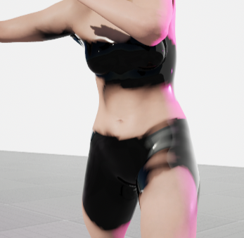</td>
    <td align="center">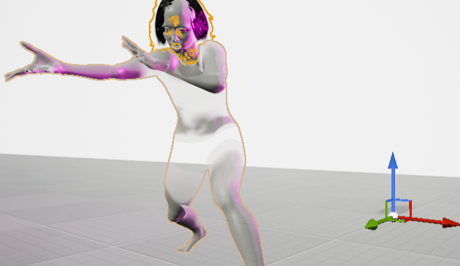</td>
    <td align="center">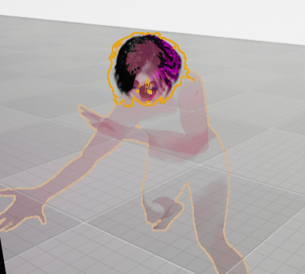</td>
  </tr>
</table>

<table>
  <tr>
    <td align="center"></td>
    <td align="center"></td>
  </tr>
  <tr>
    <td align="center">Body Particle Closeup</td>
    <td align="center">Face Particle Closeup</td>
  </tr>
</table>

**5. Cinematic Rendering (Movie Render Queue)**

Exported as a 2160x3840 PNG sequence, then scaled to 1080x1920. Fixed viewport-to-render discrepancies in Niagara by enforcing deterministic ticks, correcting warm-up counts, and removing default Game Overrides.

<table>
  <tr>
    <td align="center"></td>
    <td align="center"></td>
    <td align="center"></td>
  </tr>
  <tr>
    <td align="center">Viewport</td>
    <td align="center">Final Render</td>
  </tr>
</table>

### Results

A finished 120-frame cinematic sequence exported as a high-quality PNG sequence and finalized in DaVinci Resolve. The output shows advanced procedural particle behavior with accurate simulation timing and clean refraction.

<table>
  <tr>
    <td align="center"></td>
    <td align="center"></td>
  </tr>
</table>

**Sound Design**

The sound design was created in InShot using sounds from their built-in sound library. The audio combines: heartbeat, phone keyboard, wind, ice cube in glass, smash glass, keyboard, button sounds, slurp, fencing, zipper, flash instant.

<table>
  <tr>
    <td align="center">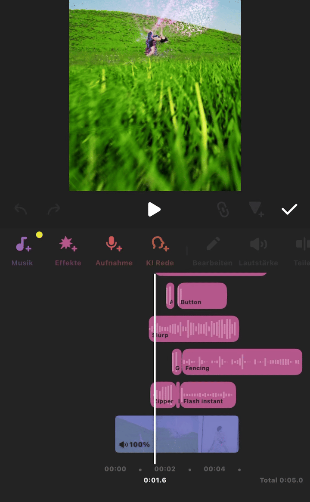</td>
   
  </tr>
</table>

---

### Project Reflection & Discussion

Throughout the project, several critical technical issues arose during the real-time simulation, shading, and offline rendering phases. These were systematically resolved through iterative debugging:

1. **Movie Render Queue (MRQ) vs. Viewport Parity & Translucency:**
   * **Issue:** Particle simulations played back at a much slower speed in the render compared to the viewport, and custom glass refraction/specularity disappeared in the rendered images under Deferred Rendering.
   * **Root Cause:** MRQ defaults to dynamic frame calculations and applies `Game Overrides`, which forced cinematic quality settings that stripped away translucent refractions and altered Niagara physics steps.
   * **Workaround & Solution:** Instead of redesigning the translucent shader logic, I bypassed the issue by removing `Game Overrides` entirely from the MRQ configuration, disabling `Accumulator Includes Alpha` / multi-sample post-processing effects, and relying on additive/emissive pass adjustments. Additionally, I locked the custom playback range (0 to 120 frames at 24 fps) with `Use Custom Frame Rate` to guarantee timing parity.

2. **Niagara Simulation & Timing Discrepancies:**
   * **Issue:** Particles spawned too late, lingered too long beyond their intended timeline, or changed their trajectories upon export.
   * **Solution:** Switched the Niagara systems (`NS_Infinity_Space_Burst` and character dissolve) to **Deterministic Mode** in the System Properties and reset warm-up frame counts in MRQ to ensure identical sub-step physics calculations frame-by-frame.

3. **Mesh-Based Particle Emission & Alignment:**
   * **Issue:** Emitting particles precisely from specific regions of the character's body (face and skin) without them floating in mid-air or spawning globally.
   * **Solution:** Created custom vertex color masks on the Skeletal Mesh, configured Niagara’s Mesh Sampling module to isolate those dynamic density masks, and aligned particle emission triggers precisely to Frame 63 of the Sequencer animation.

4. **MetaHuman Assembly & Asset Pipeline Bugs:**
   * **Issue:** A known engine bug combined with long folder paths prevented MetaHuman Assembly from generating required texture graphs (`T_Head_LOD5to7_Scatter_VT`), while unexpected physics/collision spheres appeared inside the render. 
   * **Solution:** Shortened the project directory path, manually generated the missing texture dependencies in the Content Browser, and toggled visibility parameters on the blueprint components.

<table>
  <tr>
    <td align="center">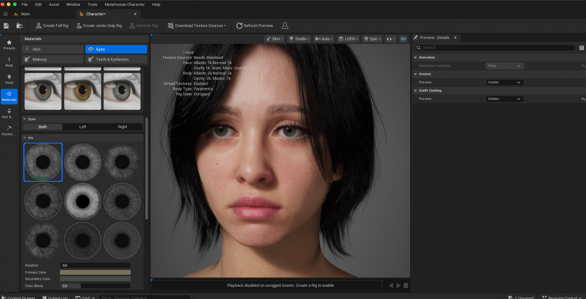</td>
    <td align="center">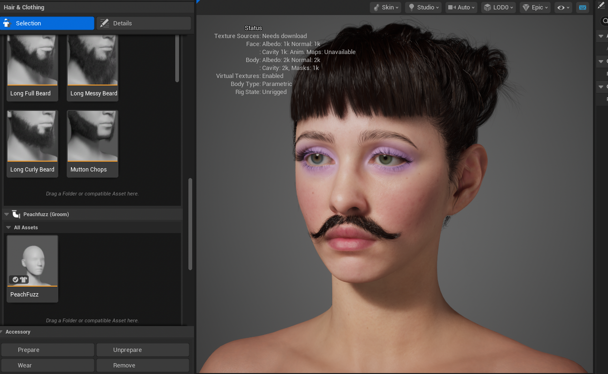</td>
  </tr>
  <tr>
    <td align="center">Face Features</td>
    <td align="center">MetaHuman Customization (I tried out some fun things here, like Make-Up and beards)</td>
  </tr>
</table>

AI tools (Claude and Gemini) were used throughout the project for debugging support and workflow guidance.

### Lessons Learned

Deterministic Real-Time Simulations: Setting Niagara to deterministic mode early is essential when syncing particle simulations with Sequencer timelines.

Viewport vs Render: MRQ settings like Game Overrides and sub-sampling can completely change how procedural simulations and materials look. Always test-render early and often.

Beta Features Have Real Costs: The MetaHuman Assembly bug in UE 5.7.4 cost significant time. Always check Known Issues pages before committing to experimental tools in a deadline-driven project.

Building on Course Foundations: Extending lecture setups into custom procedural assets requires understanding force fields, noise functions, and render pipeline behavior in depth.

---

## Task 05.02 - Feedback

Difficulty: 3/5. The theoretical concepts like Mandelbrot, complex numbers, and noise functions were hard to grasp at first. Understanding the math behind procedural generation took a lot of effort, especially without a strong math background. But I had the impression that it was totally fine that we do not understand everything in its mathematical complexity.

Workload: 3/5. Each session took time, especially the GLSL shader sessions and the final project. But for me it worked well.

Time Estimates: The estimates were often too optimistic. I mostly needed longer for the homework, but it was also motivating to streamline my workflow, make faster decisions, and account for potential bugs during the planning stage to avoid getting trapped in debugging spirals.

Unreal for CTech: It is valuable to know, the learning curve is steep, especially on Mac with Apple Silicon. There were some engine-specific bugs like the MetaHuman Assembly crash that had nothing to do with the actual learning goals and cost a lot of time. But I had fun and I will definitely use Unreal in the future.

Unreal in Class: It works well for showing real-time simulation and procedural generation.

Other Tools: If possible TouchDesigner would be a great addition, especially for audio-reactive and real-time generative visuals. But we were free to use any program so I was actually fine with how it went. GLSL in VS Code was actually a very accessible starting point and I enjoyed it a lot.

Hints for Future Students: Use GLSL Canvas early to understand shaders before jumping into Unreal materials. On Mac, check the Known Issues page before using experimental features like MetaHuman Creator. Use AI tools for debugging but make sure you understand each step yourself. Also if using AI cross check bugs with some internet reseachings on forums, sometimes you find better answers there. Also, the AIs vary in how well they handle different tasks. For GLSL questions, I found Claude to be good, but Gemini was better for anything related to debugging in Unreal Engine.

Practical Exercises: They fit the theory well. Seeing procedural concepts actually work in code or in Unreal was more motivating than just reading about them. The GLSL shader exercises were my favorites because the feedback was immediate and visual.

Favorite Chapter: My favorite chapter was Noise and Randomness, because it directly connected math to visual art. I can't think of a least favorite.

Missing Topics: Some audio-reactive visuals would have fit perfectly into the course content given the intersection with music and generative art.

Other Artists: Ezequiel Pini for 3D plant growing simulations, Sage Jenson for organic generative art.

Additional Feedback: I would love to see more sessions that connect procedural generation to sound and music.

---

## Learnings

### Task 05.03.01 - Course Learnings

During this course I learned how procedural generation works both mathematically and visually. Starting with the Mandelbrot set and complex numbers helped me understand how simple rules can create infinitely complex results. The GLSL sessions taught me how to write fragment shaders from scratch, build Voronoi patterns in GLSL, and use noise functions to create organic, animated visuals. The biggest challenge was translating visual ideas into mathematical functions. I often knew what I wanted to see but struggled to find the right formula. I challenged myself by not just following tutorials but experimenting with parameters and combining techniques like metaballs and Voronoi. For the final project I combined some things I've learned into a real production pipeline in Unreal, which meant solving problems I had never encountered before, like getting MetaHuman to assemble on a buggy engine version and making Niagara simulations render identically in the viewport and in Movie Render Queue.

### Task 05.03.02 - Skillset Reflection & Next Steps

Procedural Generation: Yes, this makes sense for me. Procedural generation is a core skill for creative technologists. I want to work with Unreal, TouchDesigner, GLSL, and Houdini in the future, in addition to Blender of course. My goal is to create dynamic, audio-reactive visuals, organic particle simulations, and generative patterns that respond to music and input.

Unreal Engine: It is useful to know. I am not sure what my next projects will look like, but I am interested in advanced Niagara systems, custom simulation forces, and procedural material shaders. I will decide based on what projects come up.

Next Steps: Deepen my knowledge in procedural content generation, explore ASCII art overlays and blob tracking in code, maybe look into real-time fluid simulations, and continue taking part in 3D community challenges.
