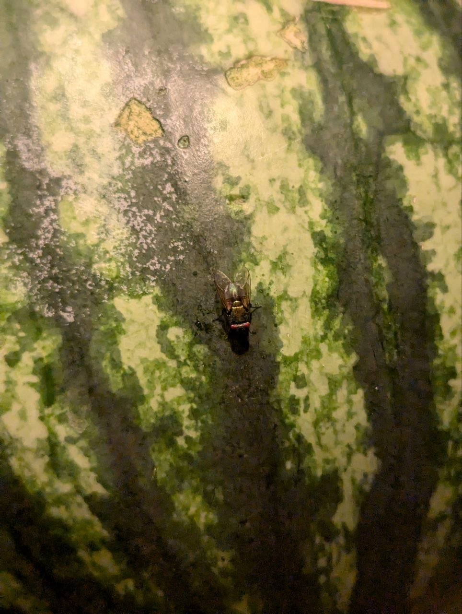
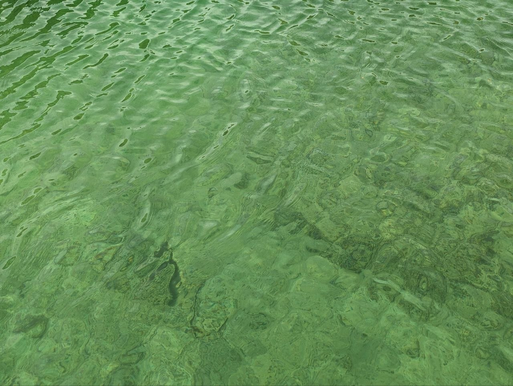
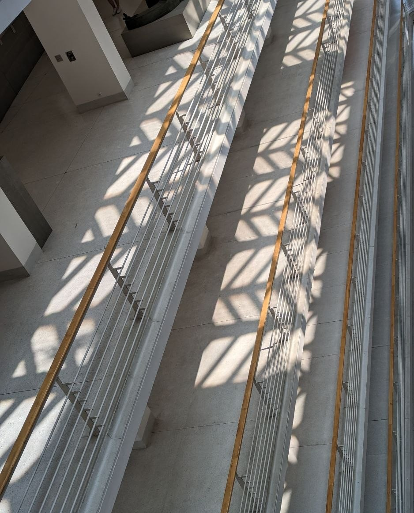
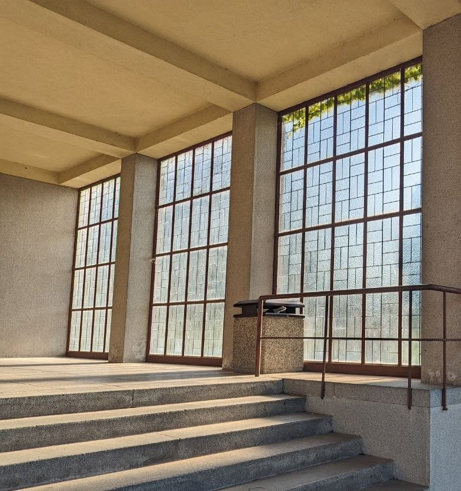
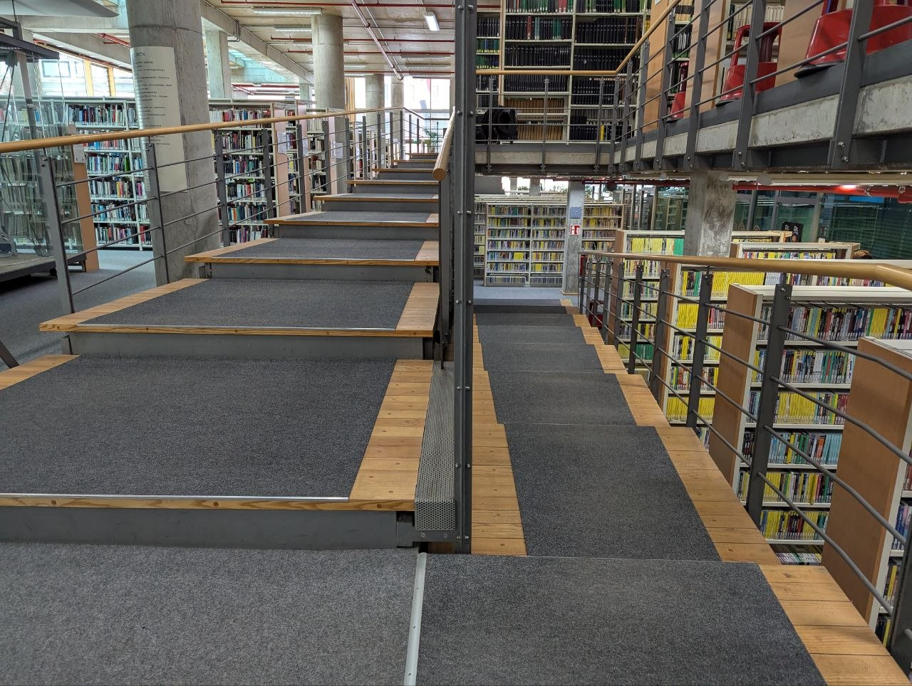
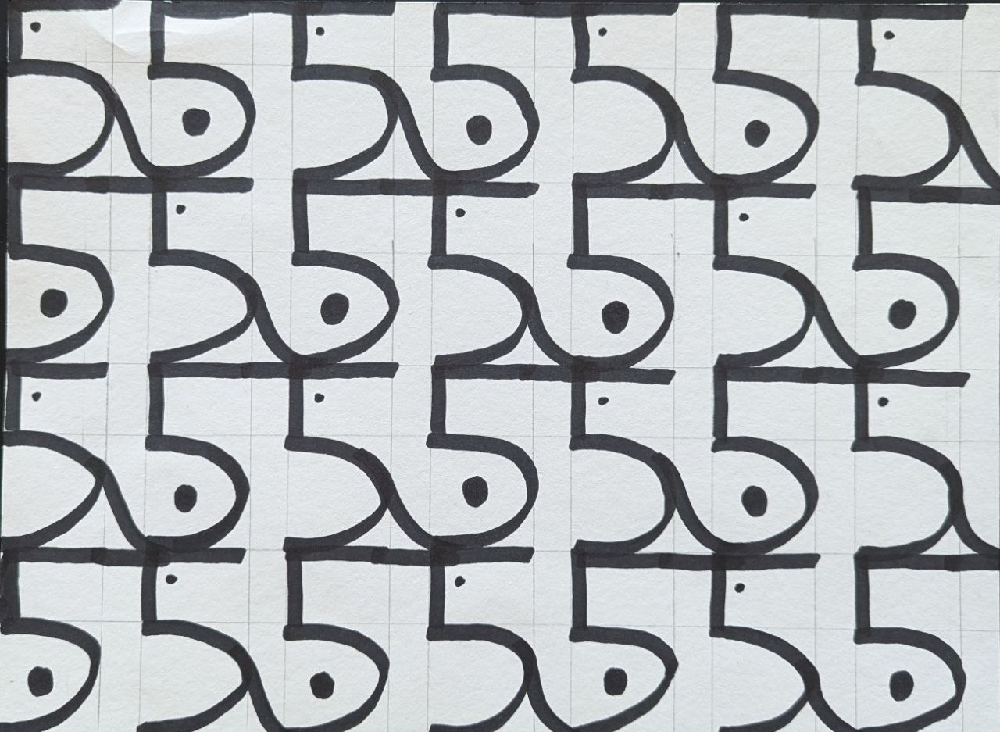
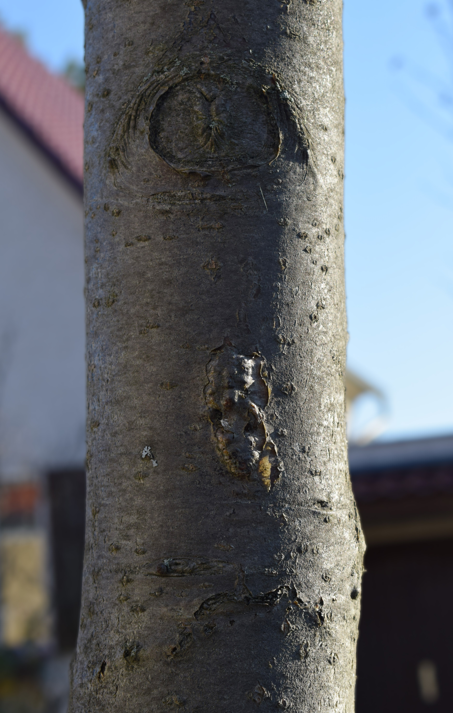

**Procedural Generation and Simulation**  

Maria Jende, 06/09/2026

 

# Session 01 - 20 Points

## Syllabus

### Task 01.01 - 1 Point

* *Which of the chapter topics given in the syllabus are of most interest to you? Why?*

    &rarr; I liked the introduction with the Mandelbrot fractal because I found it interesting and motivating to look at the math behind it. I also liked looking at different styles of art throughout history and the idea of looking at what had already been done and then reinterpreting it. It was refreshing.

 

* *Are there any further topics regarding procedural generation and simulation that would interest you?*

    &rarr; Not yet, since we are at the beginning of the class. Maybe, but that might only be me, it could be interesting to look at different fields of design, such as architecture, where parametric design is a huge thing.(keywords like Zaha Hadid, Voronoi facades, etc.). The program Grasshopper, a part of the CAD program Rhino, is often used for that in indutstrial design as well as architecture.

 

* *Is there a different tool than Unreal that you would prefer to do the exercises with (e.g. Houdini, Unity, Maya, Blender, JavaScript, p5, GLSL, ...)? If so, which one, and why?*

    &rarr; I really would have loved to work with Houdini since I worked with it last semester and would have loved to continue using it. But I see the advantages of Unreal and enjoy being able to work on projects outside the university without having to worry about the license.

 

### Task 01.02 - Seeing Patterns - 1 Point

#### Natural

 

#### Artificial

 

### Task 01.03 - Designing Patterns - 3 Points

#### Code

Here's a cleaned-up version that stays very close to your original wording while improving grammar and clarity:

* Draw a row of at least three number "5"s, spaced evenly apart

* Connect the top line of the second "5" to the top line of the following "5"

* Take the curved part of the first "5" and connect it to the curved part of the next "5" using a flowing curve.

* Place a circle inside the middle of the "belly" of the second "5"

* Place a small dot in the upper-left inside corner of the first "5"

* This is one cell - Repeat the cell as many times as desired across the row

* Copy that row as many times as desired beneath the first row, alternating the horizontal offset of each new row by either +1 "5" or −1 "5".

 

### Task 01.04 - Seeing Faces - 1 Point

 

### Task 01.05 - Painting - 2 Points

|  |  |  |
| ----- | ----- |  ----- |
| Rot-Blau-Gelb (1973) | Cell (1988) | Blurred Landscape (n.a.) |

 

Those are all paintings by Gerhard Richter. I really like his blurred, gradient style. Whether his works are photographic or more abstract, he always incorporates transparent gradients, regardless of the medium.

Especially the *Rot-Blau-Gelb* painting has a lot of depth due to the gradient colors, even though it's "just" 2D lines.

In the motion-blurred, photographic-like images, it is not the depicted objects, people or scenery that are the focus. Instead, the dynamic blurriness itself is in the center, creating a kind of eerie, fleeting scene.

 

### Task 01.06 - Artistic Expression in CGI - 2 Points

I really like this video by Joe Mortell because it visualizes a natural scene while looking very clean, polished, and artificial. This kind of aesthetic, with the water drop perfectly shaped, like a pearl, and the bouncy, velvety leaves endlessly repeating, has something both meditative and magical about it to me.

 

## Unreal Engine

### Task 01.07 - Unreal Documentation & Getting Started - 7 Points

Unreal Documentation Entry I've done: https://dev.epicgames.com/documentation/unreal-engine/how-to-create-a-ribbon-effect-in-niagara-for-unreal-engine

Process of implementing documention

 

Final Result

 

## Learnings

### Task 01.08 - 3 Points

The most challenging part of this session for me was checking in with Unreal again. I haven't worked with it for almost 2.5 years, and the changes to the UI really challenged me (and will continue to be an ongoing challenge), because I can't simply fall back on the experience of "once I see it again, my previous knowledge of how to navigate Unreal comes back".

What was new to me was Niagara Systems in Unreal. That's why I chose an example from the documentation that uses them. I'm generally interested in simulations and can imagine connecting some future assignments to them when appropriate.

Also, I haven't used Blueprints for anything other than materials in the past, so I'm looking forward to working with them more.