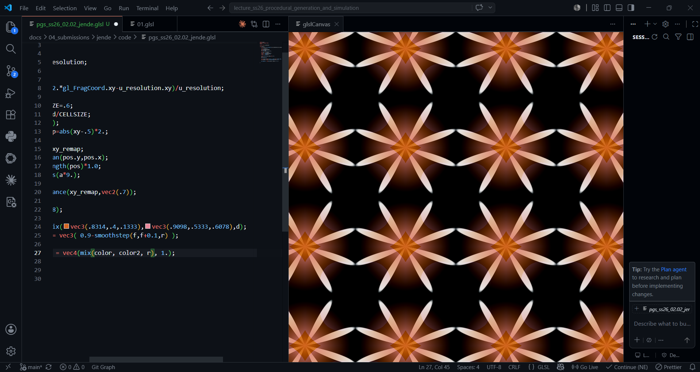
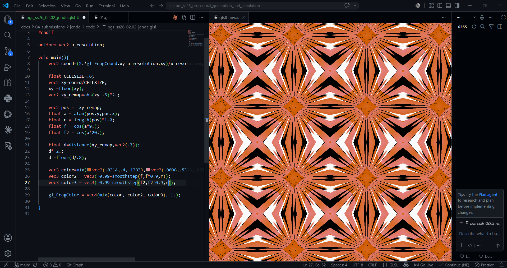

**Procedural Generation and Simulation**  

Maria Jende, 06/16/2026

 

# Session 02  - 20 Points

## Function Designs

### Task 02.01 - Inspiration - 4 Points

Ocean Shader: https://www.shadertoy.com/view/MdXyzX

Cloud Shader: https://www.shadertoy.com/view/XslGRr

 

### Task 02.02 - Function Design - 13 Points

I worked in GLSL and used the circle pattern we worked with in class as a starting point, since I found it easier to begin with.  
I studied [the chapter on shapes in The Book of Shaders](https://thebookofshaders.com/07/) and added two flower shapes based on sine curves.  
In the end, I wanted to explore mouse attraction and how the pattern responds to the cursor.

|  |  |  |  |
| ----- | ----- |  ----- |  ----- |

 

Videos including the mouse attraction can be found here: https://owncloud.gwdg.de/index.php/s/abI5SPZSvvZcuTb

 

## Learnings

### Task 02.03 - 3 Points

In this session, I had a lot of fun. I really enjoy working with GLSL because it is both compact and powerful. I especially enjoyed this week’s task since I loved ShaderToy and experimenting with the shader.

At first, I had to get back into the GLSL syntax, so I watched some theoretical videos and read documentation to refresh my knowledge. I intentionally tried not to work with AI and instead focused on learning at a slower pace even though it was more challenging. This approach definitely tested my discipline and patience.

Most of the concepts were new to me. Although I had "worked" with shaders before, I had never experimented with them to this extent. I had also never integrated mouse interaction into a shader before, which was nice. Overall, I found the process challenging but very rewarding.