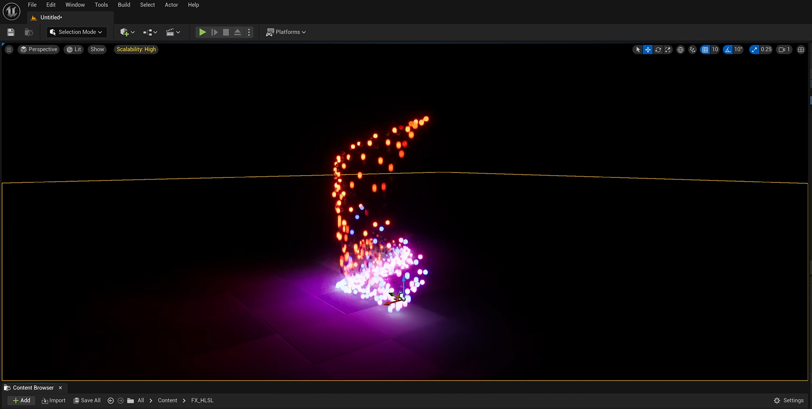
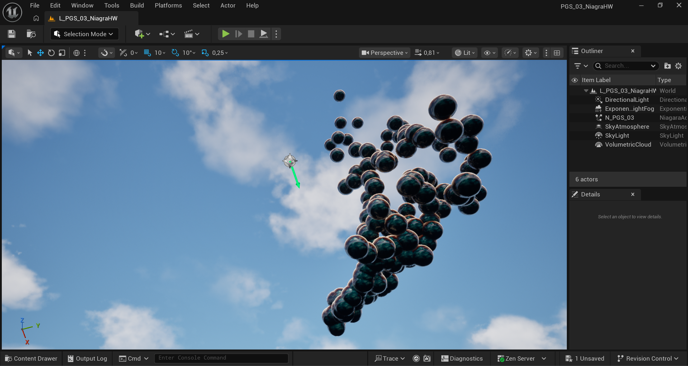

**Procedural Generation and Simulation**  

Maria Jende, 06/24/2026

 

# Session 03 - 20 Points

## Algorithmic Designs and Procedural Setups

### Task 03.02. Option B - Algorithmic Scene Setup & Rendering - 17 Points

|  |  |
|  ----- |  ----- |
| The initial Niagara System | The dissatisfying material |

 

You can watch the video of the Final result [here](https://owncloud.gwdg.de/index.php/s/JwDeEd0wdUYjJXM).

 

## Learnings and Process

### Task 03.03 - 3 Points

I chose to do Option B because I wanted to follow [a tutorial I saw at render buckets Youtube Chanel](https://www.youtube.com/watch?v=ZNPzpXKvyL4&t=785s).

The tutorial works with a Niagara System and HLSL code, where the position and movement (and, in the initial video, also the color) are adjusted through the code. I liked the idea of adding a mesh as a particle and decided to use spheres, which led me to the idea of combining this tutorial with [another tutorial by render bucket about iridescent Material](https://www.youtube.com/watch?v=GqLPb7jI3DQ), which also uses HLSL code.  
Sadly, this did not work as expected: When trying to add transparency to the setup from the tutorial, I only got results that were not satisfying. I used AI to help me modify the HLSL code to include translucency, but it still did not work properly. This led me to try creating a solution using Substrate, which I also could not get to work.  
After a lot of research, I found [this amazing tutorial by Ben Cloward](https://www.youtube.com/watch?v=bN84YxaBEGw&t=644s). This finally helped me create a result I was happy with for the iridescent bubble material and gave me a working setup.  
Because it took me so much time to fix the material, I did not have much time left for rendering. I am also not very experienced with rendering in general, so the final result lacks some quality there.

The biggest learning experience for me was working with HLSL code in Unreal, since I had never done this before. I also learned that I really like using tutorials because they helped me get back into Unreal and understand its workflow and setup again. I think working with Unreal’s nodes is also very helpful because it allows me to understand how they work and, over time, recognize which tools to use when trying to achieve a specific result.  

The hardest part for me was working with the material and not being able to solve some of the problems I encountered. This was also because some solutions and tips I found online were either outdated or difficult to translate to the newer versions of Unreal.  
Looking back, I think my Niagara System result probably would not have required such a complex setup for what I decided to do in the end, but I did not know where the process would lead when I started, so it's fine.