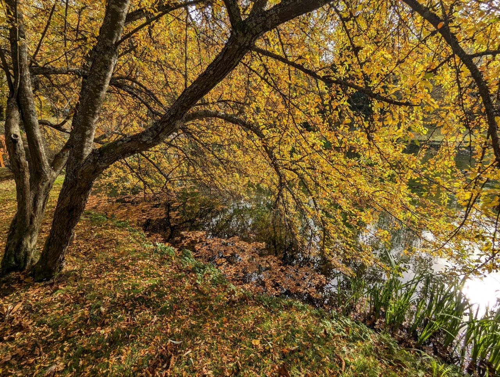
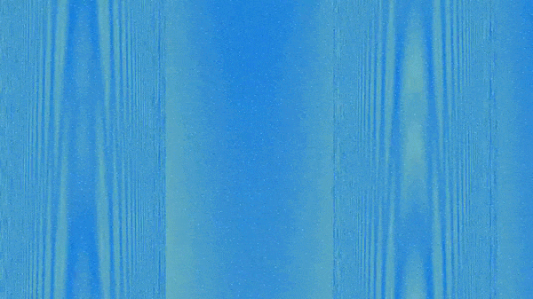

**Procedural Generation and Simulation**  

Maria Jende, 06/24/2026

 

# Session 04 - 20 Points

## Task 04.01 - Collecting Inspiration - 3 Points

### Natural Noise Patterns

 

### Artistic Noise Image/Project

[Quayola - *Pleasant Places* (2015)](https://quayola.com/pleasant-places/)

 

## Task 04.02 - Randomness or Noise as Design Element - 14 Points

Mouse-reactive randomness done with The Book of Shaders

 

 

Final Result
 

Acess the video [here](https://owncloud.gwdg.de/index.php/s/QOMAB83DF3D9grp).

Review the code [here](./code/pgs_ss26_04.02_jende.glsl).

## Learnings

### Task 03.03 - 3 Points

For this task, I wanted to work with GLSL again. I worked with a combination of [a tutorial](https://www.youtube.com/watch?v=jkYIOu8HddA&t=360s), [The Book of Shaders](https://thebookofshaders.com/10/)[ chapter on randomness](https://thebookofshaders.com/10/), and Claude.

While following the tutorial, I realized that I had already implemented some of the functionality (such as the grid) in the past. Instead of copying the tutorial directly, I tried to recreate its logic using the code structure I was already familiar with. The main challenge and also a big learning, was translating the same logic into a different implementation.

After that, I combined the randomness function I tested before from The Book of Shaders with the grid to create the animated color changes. Eventually, this lead me to abstract waterfall-like visuals and I wanted to give them the feeling of water spraying. I implemented this part with the help of Claude, since I had a general approach in mind of where to start but I found it difficult to implement it on my own. Throughout this process, I tried to reuse as much of my existing code/logic as possible so I wouldn't lose my overview and understanding of the code.

To conclude, the main challenge and learning experience for me this week was translating the same logic into different code solutions while maintaining a clear understanding of the code. This allowed me to confidently tweak and refine the visuals to achieve the look I wanted.
