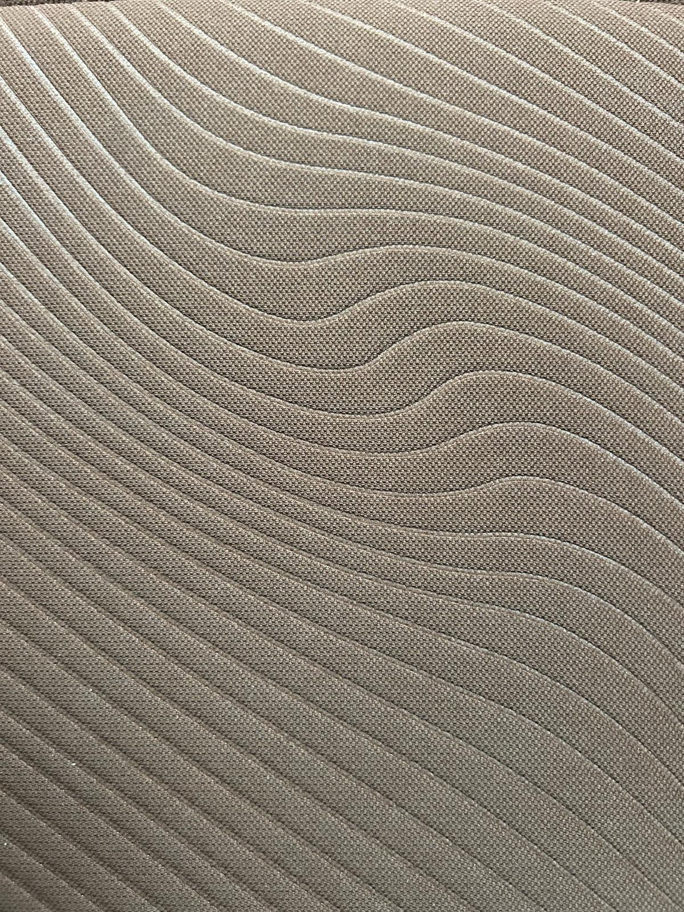
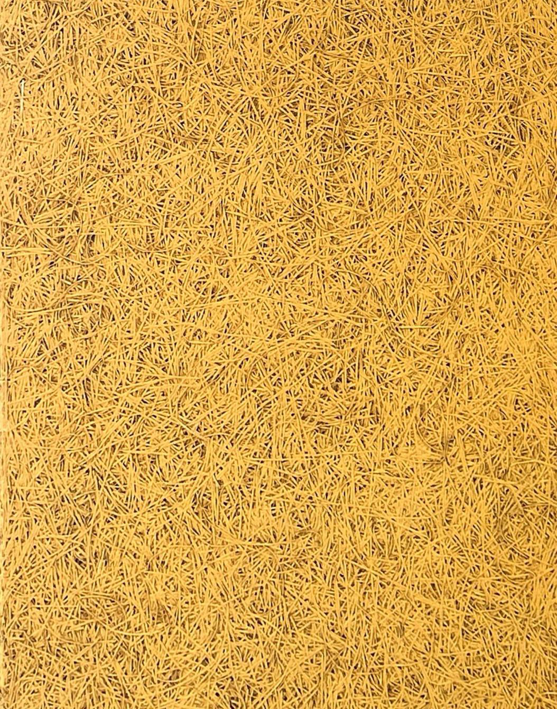
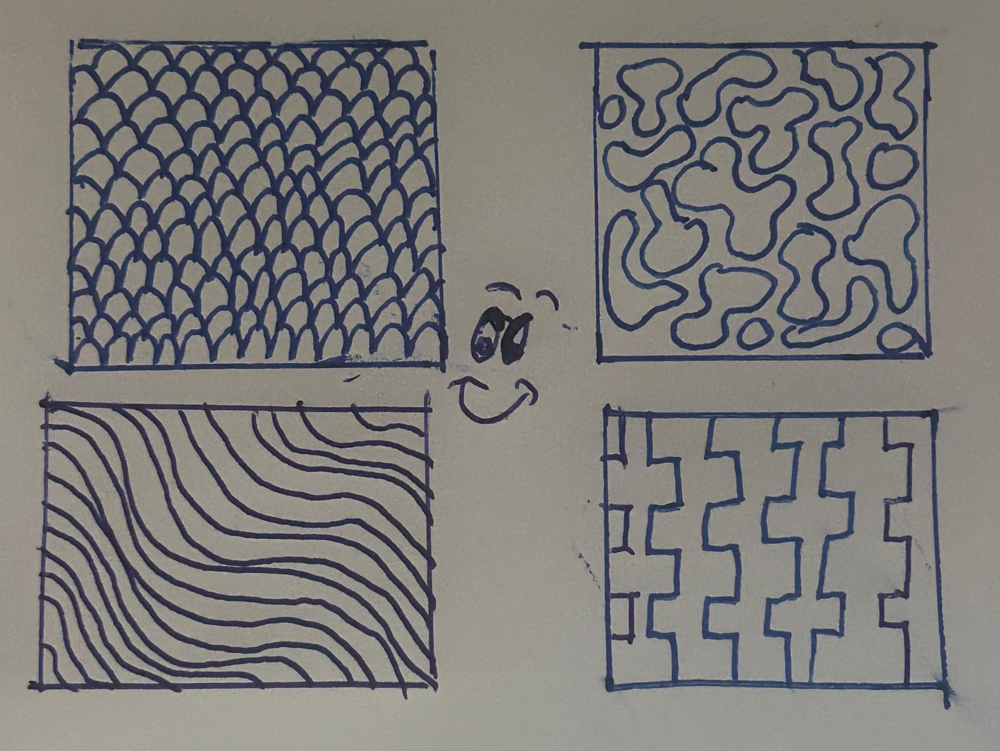
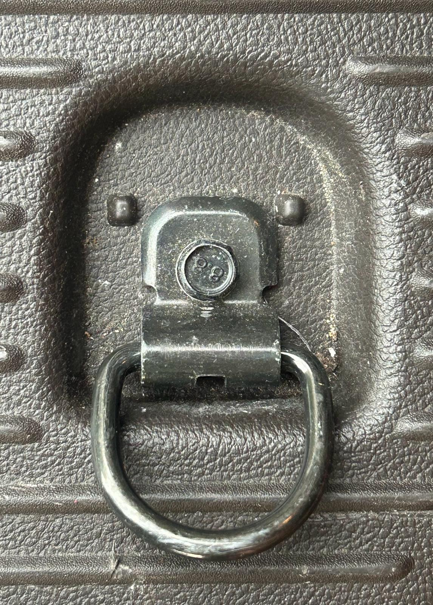
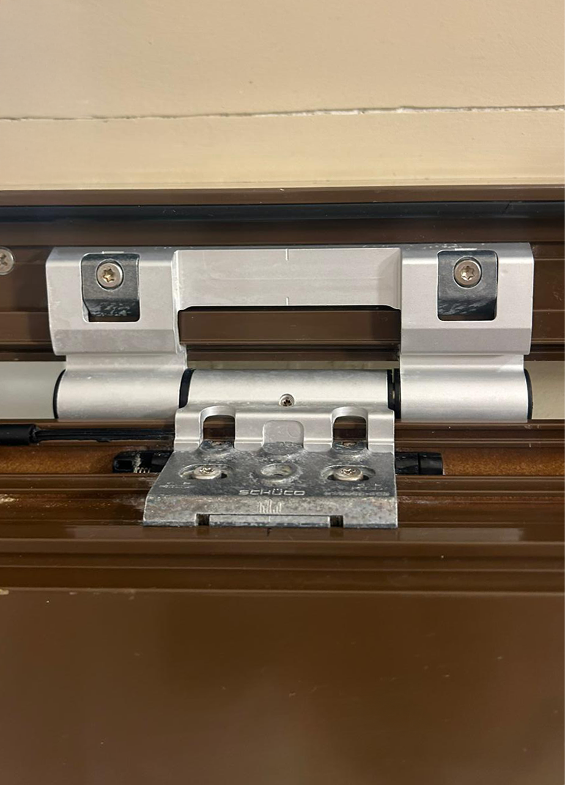
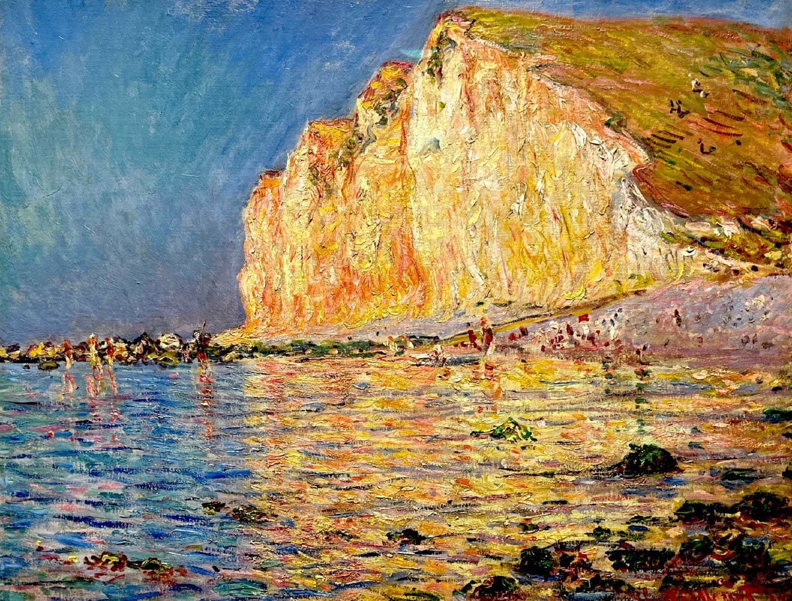
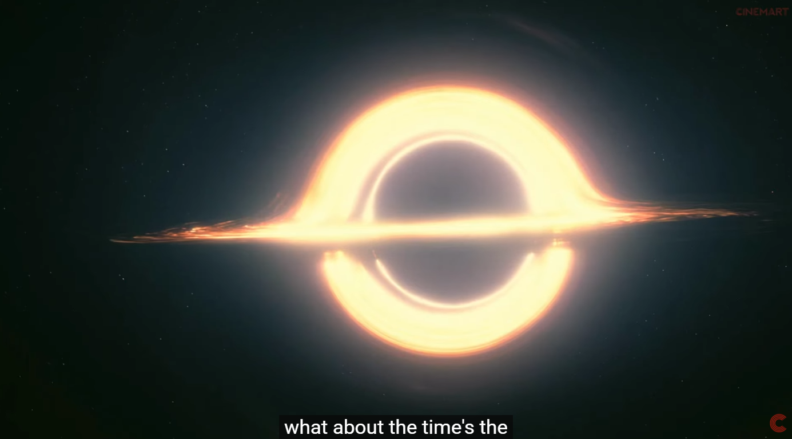
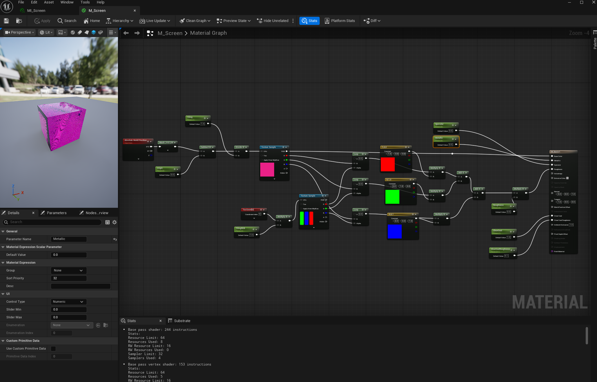
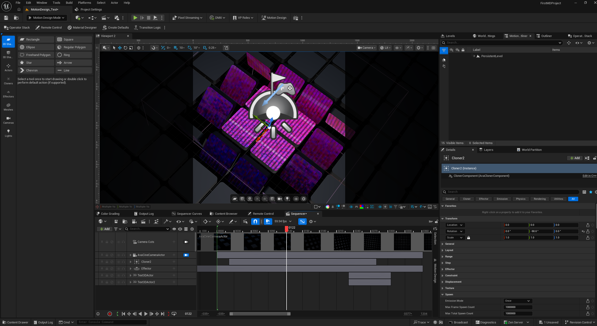

**Procedural Generation and Simulation**  

### Task 01.01 - 1 Point

* Which of the chapter topics given in the syllabus are of most interest to you? Why?
A: Most interesting for me are probably Particles since I don't have much experience with the Niagara Particle System itself.

* Are there any further topics regarding procedural generation and simulation that would interest you?
A: Probably more complex PCG Frameworks inside Unreal.

* Is there a different tool than Unreal that you would prefer to do the exercises with (e.g. Houdini, Unity, Maya, Blender, JavaScript, p5, GLSL, ...)? If so, which one, and why?
A: I'd personally stay with Unreal or Houdini.

---

### Task 01.02 - Seeing Patterns - 1 Point

<table>
  <tr>
    <td align="center"> <b>Man-made Pattern - Car Seat</b></td>
    <td align="center"> <b>Man-made Pattern - Ceiling</b></td>
    <td align="center"> <b>Natural Pattern - Leaf</b></td>
    <td align="center"> <b>Natural Pattern - Leaf</b></td>
  </tr>
</table>

---

### Task 01.03 - Designing Patterns - 3 Points

    <td align="center"> <b>Hand Drawn Patterns :D</b></td>

 

---

### Task 01.04 - Seeing Faces - 1 Point

<table>
  <tr>
    <td align="center"> <b>Car Trunk Face</b></td>
    <td align="center"> <b>Fire Hydrant Face</b></td>
    <td align="center"> <b>Door Face</b></td>
  </tr>
</table>

---

### Task 01.05 - Painting - 2 Points

    <td align="center"> <b>Les Petites Dalles (1884) - Claude Monet</b></td>

 

I saw this painting in the "Avant-Garde: Max Liebermann and Impressionism" exhibition and was struck by the colors. Monet is not painting the cliff's color, he is painting what the afternoon sun does to it. The cliff glows with orange and red. Without the sunset light the painting would look completely different and feel different too.
How It Might Inspire My Work:
This painting inspires me to use light in a way that can change the mood of my subject. The sunset light transforms the colors of the whole scene. I want to try doing the same in my own artwork, using the light to change how something feels, not just how it looks.

---

### Task 01.06 - Artistic Expression in CGI - 2 Points

    <td align="center"> <b>INTERSTELLAR (2014) -  The 'Gargantua' Black Hole Scene</b></td>

 

This is one of the most Iconic Space films ever created in my opinion and espesically the scene with the Black Hole is visually stunning.
As far a as I know the VFX Team worked together with a real physicist to create this somewhat accurate simulation.
I think it is artistic because it shows something no one has ever seen before. It looks simple and complex at the same time and that balance is what makes it feel like art to me.

---

## Unreal Engine

### Task 01.07 - Unreal Documentation & Getting Started - 7 Points

As I already have some experience in Unreal, I tried to learn something new.
The first exercise for me was to get familiar with the new-looking UI of Unreal Engine 5.7 and above.

After getting used to some of the new UI I read through the [Motion Design Quick Start Guide](https://dev.epicgames.com/documentation/unreal-engine/motion-design-quickstart-guide-in-unreal-engine) documentation.

While getting an overview of the new MotionDesign Tools I came across a couple of things that bothered me, so most of my time went into writing a Support Ticket to Epic :D

---

# Unreal Engine – Motion Design Page Feedback

Unreal_Motion_Design_Feedback.pdf
[View the feedback PDF](docs/Unreal_Motion_Design_Feedback.pdf)

**Side Note:** There were way more problems during experimenting... but then I decided to I give up just concentrate on doing the actual homework.

 

---

## First Motion Design Project
After getting through the interface and coming to terms with its more than flawed system, I managed to create this neat little animation using a simple cloner that rotates mesh actor tiles based on a proximity sphere that scales up. After a lot of curve polishing I came out with this result. 
I'm still not happy with the camera animation, but I didn't have much time left.
The material setup was fairly simple. I gave the mesh three separate materials: one for the sides, one for the back, and one for the front.

    <td align="center"> <b>Motion Design Page Exercise</b></td>

 

The material uses Absolute World Position to project the texture consistently across all meshes. When a mesh is rotated 90 degrees, the texture stretches, technically incorrect, but I think it actually improves the visual feel, so I left it as is.
To achieve a screen-like appearance, I downloaded an RGB texture and multiplied its red and green channels separately with the base texture.
One thing I haven't solved yet is independently manipulating individual cloned meshes. I experimented with a Per Instance Random node which is normally used for these kind of operations, but it didn't behave as expected. Ideally, I'd like to control each instance separately, though a noise texture with world-aligned projection could work visually, it wouldn't stick to the meshes as they move.
In the end I also wanted the original texture without the RGB effect. I could have achieved that with camera culling, but due to time constraints I simply rendered it out twice and composited the two together.
I also couldn't find a way to manipulate the material in the Sequencer the way it normally works in Unreal. As soon as I tried to adjust properties like opacity or color, the mesh just turned white. This seems to be a current limitation of the Motion Design tab.. finding solutions online for this new feature is difficult or not possible at all.

 

    <td align="center"> <b>Screen Material</b></td>

    <td align="center"> <b>UE Scene</b></td>

## Learnings

### Task 01.08 - 3 Points

I really liked the Seeing Faces and Patterns exercise because it made me go outside and see my neighborhood for the first time hahaha :D

For the Unreal exercise:
Working in the Motion Design tab taught me a lot about its current limitations. 
I'm not entirely sure if I want to dive deeper into this, as the workflow is currently quite flawed. That said, for what it is, it gets the job done in a fraction of the time it would take with Blueprints. If it worked without the many bugs, it would actually be a great tool for me worth exploring further.
The most challenging part was troubleshooting issues that have little to no documentation, since the feature is still so new. I challenged myself by pushing through those limitations rather than falling back on more familiar workflows like Blueprints, and by finding creative workarounds, like rendering twice instead of using camera culling, to still reach the result I was after.

---

### AI Notice.
AI was only used to check my grammar and in the workflow to help guide me through problems but this did not work at all due to the little documentation.

---