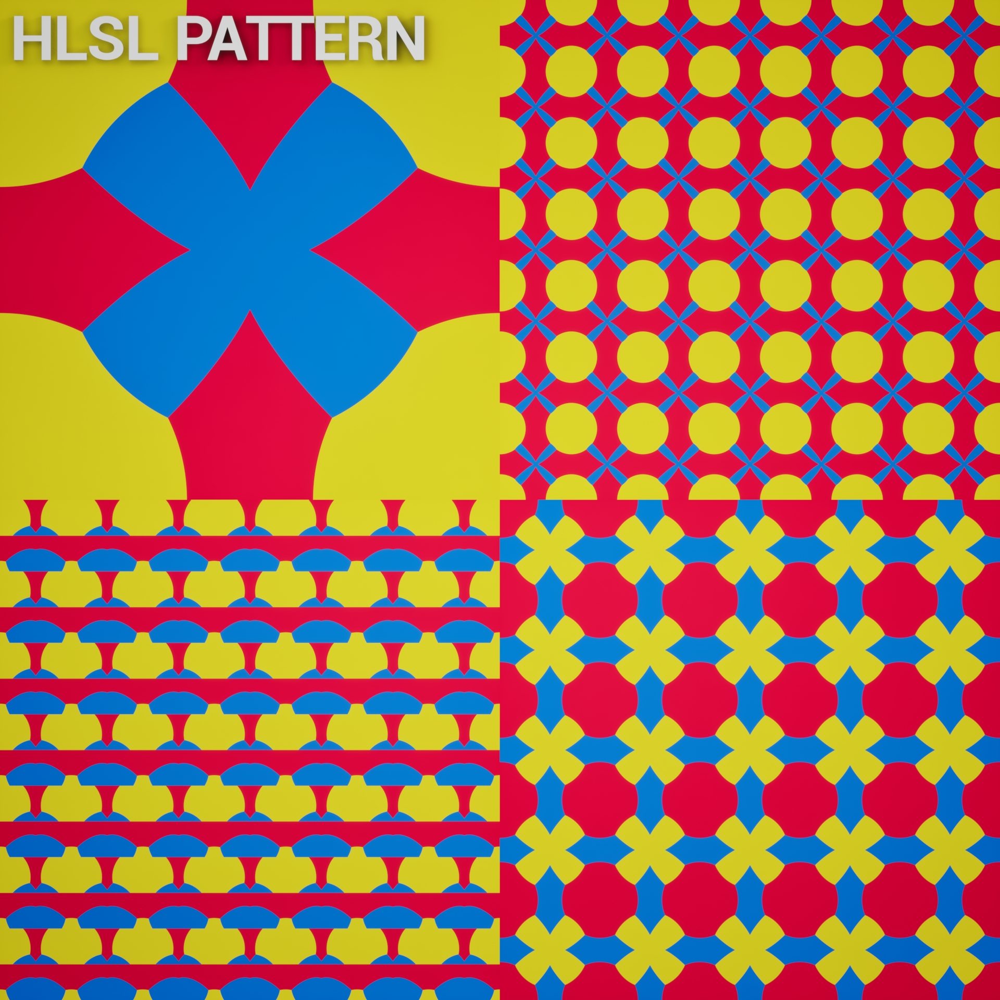
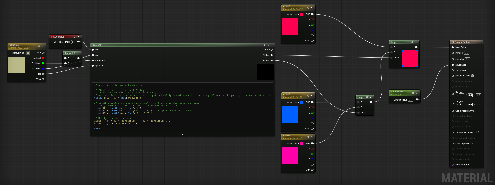

**Procedural Generation and Simulation**  

### Task 02.01 - Inspiration - 4 Points

Example 01: https://www.shadertoy.com/view/4dSGW1

Example 02: https://www.shadertoy.com/view/XtGGRt

I like the first one because it looks like something I could "simply" do with Unreal's Motion Design tools, though I'm not a big fan of the wooden texture and would change that if I’d do it myself. For the amount of cylinders, it runs pretty smooth in my browser. But by simply comparing its code length to the second one, it fascinates me how the Aurora in the second example can look so good with almost no code. Reading through the code it seems to be volumetric, but since you can only pan around in the scene, it ends up feeling more like a HDRI skybox than something with real depth.
The real reason why I picked the aurora example as my favorite was because we are currently trying to composite a shot using a real Aurora video plate which almost looks like the one in the example.

### Task 02.02 - Function Design - 13 Points

#### Unreal HLSL Material Material

    <td align="center"> <b>Pattern</b></td>

 

    <td align="center"> <b>Material Graph</b></td>

## Learnings

### Task 02.03 - 3 Points

This session was my first time writing HLSL code in Unreal. At first I tried to understand every part of the code I was writing, in the end I experimented by copying and pasting existing lines until things looked cool :D
One useful thing I learned is that a single Custom node can have multiple return outputs, so you don't need several separate custom nodes when you want to do something more complex and get a variable out of the code.
For learning HLSL I followed an excellent tutorial series by renderBucket and then built my own version based on it: https://www.youtube.com/watch?v=MHFqQjdH0Pw&list=PLoHLpVCC9RmMMmW5eP1aAyJrTjxd46rx_&index=3