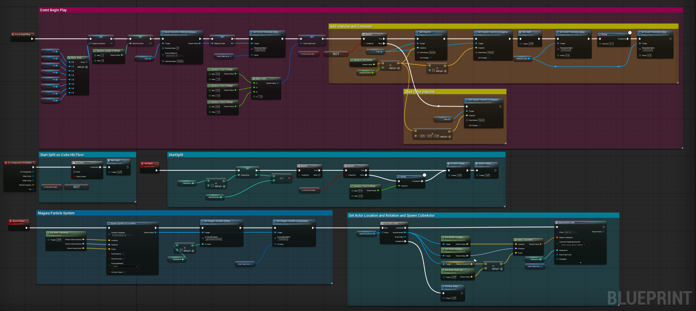

**Procedural Generation and Simulation**  

### Task 03.02.01 Option A - A Tutorial Fancy Cubes - 12 Points + Task 03.02.02 Option A - Your Fancy Cubes - 5 Points

    <td align="center"> <b>Exploding Cubes</b></td>

 

    <td align="center"> <b>Blueprint Graph</b></td>

 

## Learnings and how I made it

### Task 03.03 - 3 Points

After finishing the tutorial, I started building my own version. I wanted it to be more colorful, with the particles matching the color of the cube they came from. I also added an angular impulse so the cube rotates slightly as it falls and used a "Simulation Generates Hit Events" setup so the first split only triggers when the cube first hits the floor.
With that working, I moved on to the color setup. My first idea was to drive the cube's color through a Material Parameter Collection. My initial attempt failed entirely, and once I got it working a new problem appeared: cubes already in the scene also picked up the new color instead of keeping their original one.
So I dropped that approach and switched to a Vector 4 parameter that I could change from Blueprint using a Set Vector Parameter Value Node. The input was a variable I named StartCubeColor, exposed on spawn and marked Instance Editable. Immediately after that node, I set the same variable to a new random color. This lets me pick the cube's starting color myself, while every cube spawned afterward gets a completely random one.
Then came the part that was new to me: getting the particles to share the cube's color. In my first attempt I reused the Material Parameter Collection method, but ran into the same problem as before. The particles always took the newest color, since the system didn't distinguish a new particle from an old one belonging to a previously colored cube.
Eventually I found a much cleaner approach: a user-exposed variable inside the Niagara system that I could set directly from Blueprint right after spawning the particle system. The key detail is that the color has to be set in Initialize Particle, not Update, otherwise the older particles don't keep their original color.
A smaller bit of polish: I added a user-exposed variable for the generation index and created a scratch module that shrinks the sprite's min and max size based on it, so later generations spawn smaller particles.
As it came to rendering I ran into rendering issues because of a known limitation: physics simulations don't behave correctly when rendering with temporal samples instead of spatial samples. Only using Spatial Samples however doesn't give me any real Motionblur. My first idea was to use Take Recorder to bake the action, but this didn't fully work, since the material properties and the Niagara particle system weren't baked along with it.
In the end, time constraints forced me to stop searching for a clean solution and fall back on a mix of spatial and temporal samples. My process turned into trial and error: render, adjust the physics, render again. Progress was slow, because the result only becomes visible once it's rendered, and with a non-deterministic simulation, no two renders ever came out the same.

---
### AI Notice: 
AI was only used to check my grammar.
