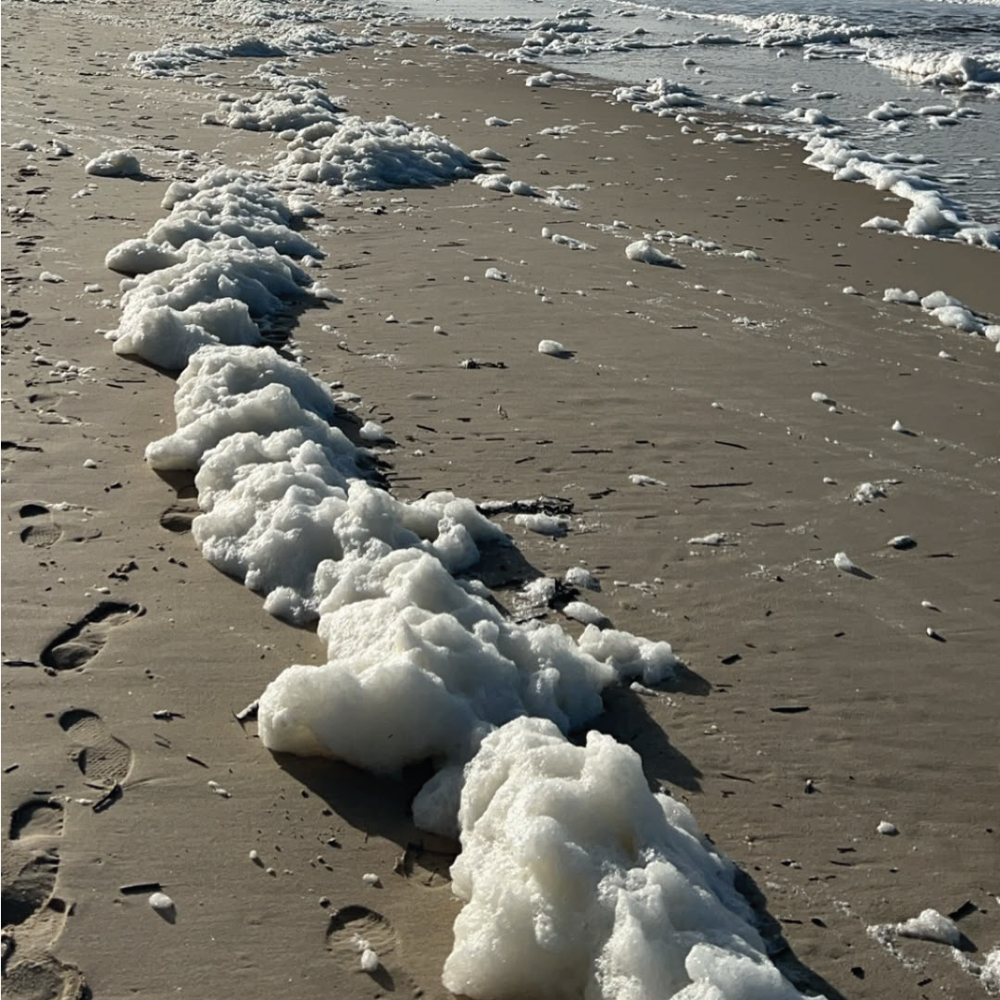
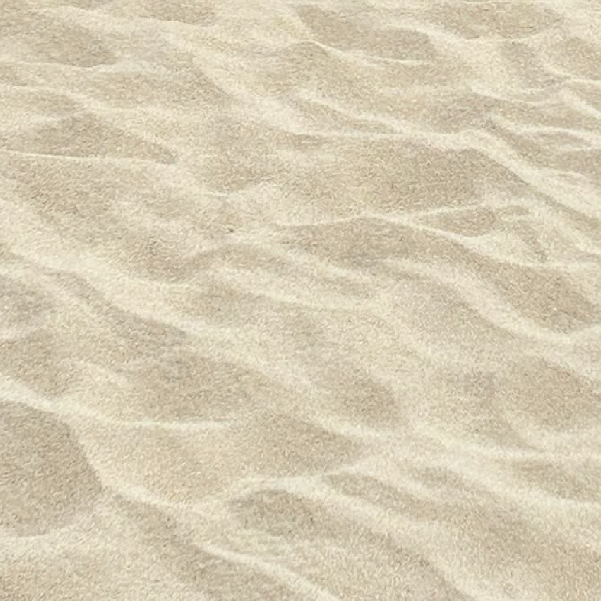
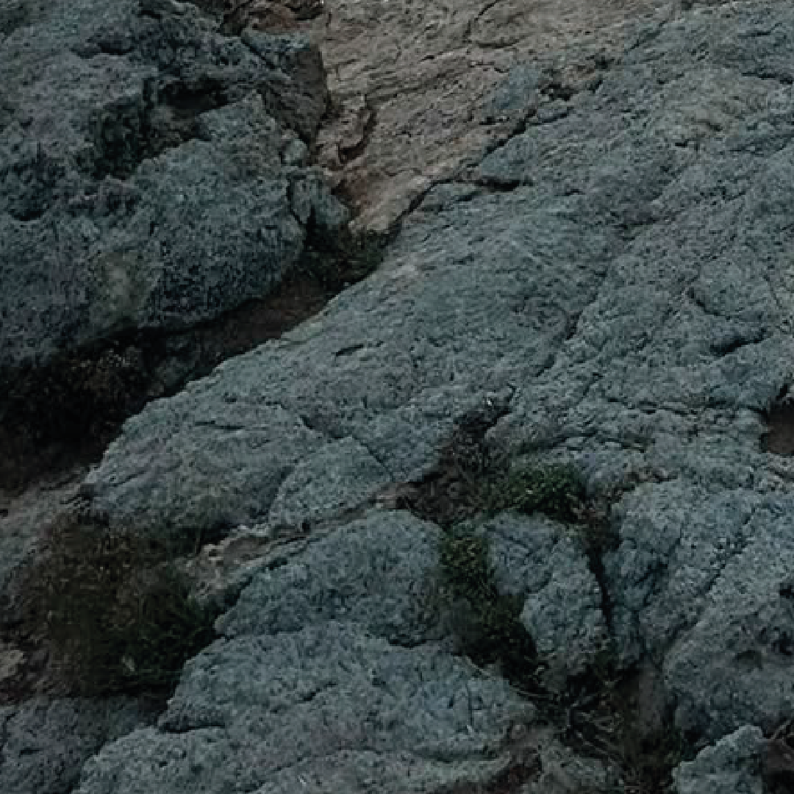
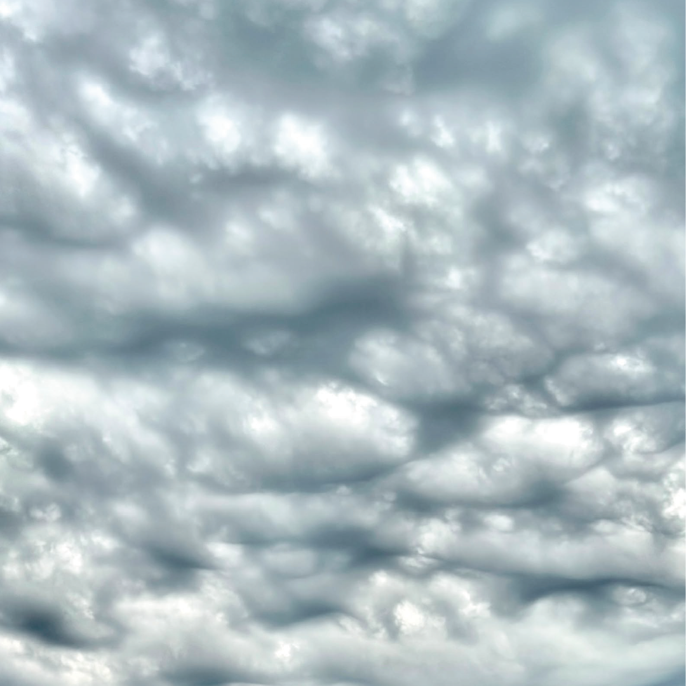
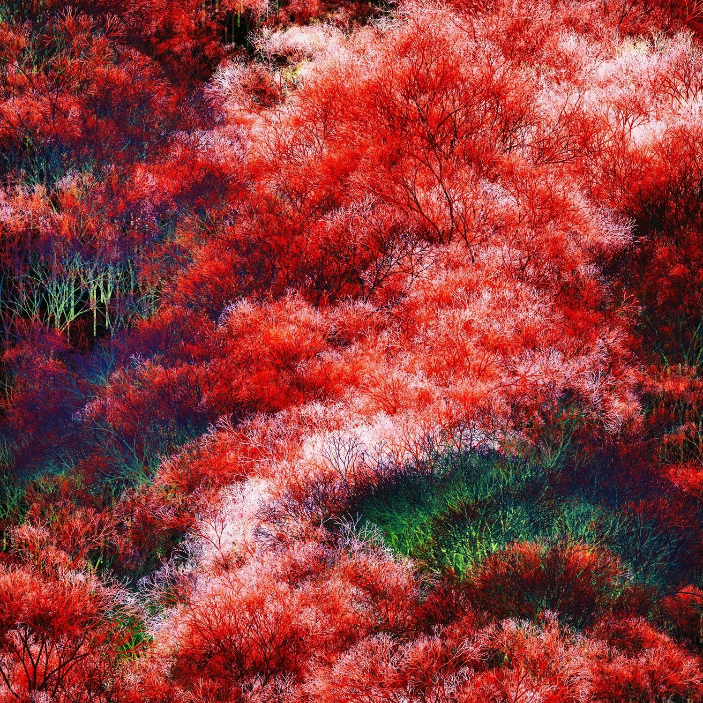
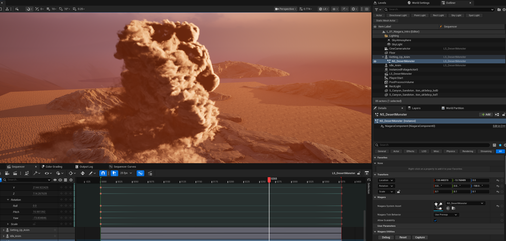

**Procedural Generation and Simulation**  

## Task 04.01 - Collecting Inspiration - 3 Points

<h2>Natural Noise Patterns</h2>

<table>
  <tr>
    <td align="center" width="25%">
    <b>Sea Foam Trail</b>  
       
      Source: Personal Camera Roll
    </td>
    <td align="center" width="25%">
    <b>Sandy Sand ;D</b>  
       
      Source: Personal Camera Roll
    </td>
    <td align="center" width="25%">
    <b>Noisy Rock</b>  
       
      Source: Personal Camera Roll
    </td>
    <td align="center" width="25%">
    <b>Cloudy Sly</b>  
       
      Source: Personal Camera Roll
    </td>
  </tr>
</table>

<h2>Stylized / Artistic Image</h2>

   
  <b>arbolito2 (2018)</b> 
  Artist: Manoloide 
  Source: <a href="https://www.katevassgalerie.com/print/p/manolo-gamboa-naon-3">Link</a>

## Task 04.02 - Randomness or Noise as Design Element - 14 Points

   
  <b>Motion Design Course</b> 

 
For this Video I followed a Tutorial Series by Jesse Pitela and made my own Version of it. It utilised a lot of the Motion Design Tools in Unreal 5.8.
  

   
  <b>Niagara Fluids Scene Test</b> 

 

   
  <b>Unreal Scene Screenshot</b> 

 
For this Video I also followed a Tutorial on Niagara Fluid Effects and made this small scene.

## Learnings

### Task 03.03 - 3 Points

I learned how to set a Niagara simulation to local space so the effect stays anchored to its emitter and moves with the actor instead of the world origin. I shaped the smoke using noise forces, mainly turbulence and curl noise, to give it natural swirling detail, and I drove the sim by spawning points on a mesh and using them as the emitter source. On my own I also worked out how to cache Niagara effects in the Sequencer at higher quality for better results, and I explored the new accumulate depth of field, though I chose not to use it in the final render because it would have doubled or tripled the render time.

In the separate Motion Design Crash Course that I did first, I learned how to combine different cloners to create effects that a single cloner could not produce.

---
### AI Notice: 
AI was only used to check my grammar and for Layout.

