**Procedural Generation and Simulation**  

Prof. Dr. Lena Gieseke \| l.gieseke@filmuniversitaet.de  

---

# Session 01 - 20 Points

This session is due on **Wednesday, June 10th** before class.

This assignment should take <= 6h. 

* [Syllabus](#syllabus)
    * [Task 01.01 - 1 Point](#task-0101---1-point)
* [Introduction](#introduction)
    * [Task 01.02 - Seeing Patterns - 1 Point](#task-0102---seeing-patterns---1-point)
    * [Task 01.03 - Designing Patterns - 3 Points](#task-0103---designing-patterns---3-points)
    * [Task 01.04 - Seeing Faces - 1 Point](#task-0104---seeing-faces---1-point)
    * [Task 01.05 - Painting - 2 Points](#task-0105---painting---2-points)
    * [Task 01.06 - Artistic Expression in CGI - 2 Points](#task-0106---artistic-expression-in-cgi---2-points)
* [Unreal Engine](#unreal-engine)
    * [Task 01.07 - Unreal Documentation \& Getting Started - 7 Points](#task-0107---unreal-documentation--getting-started---7-points)
* [Learnings](#learnings)
    * [Task 01.08 - 3 Points](#task-0108---3-points)
* [How To Submit](#how-to-submit)
    * [CTech](#ctech)
    * [VFX](#vfx)

## Syllabus

### Task 01.01 - 1 Point

* Which of the chapter topics given in the syllabus are of most interest to you? Why?
* Are there any further topics regarding procedural generation and simulation that would interest you?
* Is there a different tool than Unreal that you would prefer to do the exercises with (e.g. Houdini, Unity, Maya, Blender, JavaScript, p5, GLSL, ...)? If so, which one, and why?

*Submission*:

The most interesting topics seem to be beauty in maths, patterns, and noise. I have always been fascinated by visual mathematics, for example, patterns, fractals, and functions, but at some point I felt like I didn't truly understand them. Since starting my visual studies, I feel like I've gained a deeper understanding of mathematics and the topics I learned in school. Things like vectors and functions make much more sense now with my visual background.
As a child I spend a lot of time in the woods, where a lot of naturally occurring patterns crossed my way: trees, leef structures, bark rings, flowers. I think patterns are an interessting visual expression of reproduction and circularity.

**tools**

I do not have any experiences with Unreal Engine yet (what it offers me or not) but in general I would like to learn raw shader languages like GLSL, because I can implement it in Touchdesigner which I am using a lot for live visual practices (or to use Touchdesigner at all!).
I'd also like to learn Houdini, because it is also node based and specialized for procedual generation or step back into Geometry Nodes in Blender, because both programms seem to be more relevant for my furure artistic practice than Unreal Engine.

## Introduction

* [Slides Introduction](../../03_slides/pgs_01_intro_slides.html)
* [Script Introduction](../../02_scripts/pgs_01_intro_script.md)

### Task 01.02 - Seeing Patterns - 1 Point

Take at least one picture of a natural pattern and at least one of a man-made one (patterns can be two or three-dimensional). Try to include at least one pattern with self-similarity. Taking pictures with your phone is just fine. 

*Submission*: 

**natural**
*feathers of my chicken Spezi*

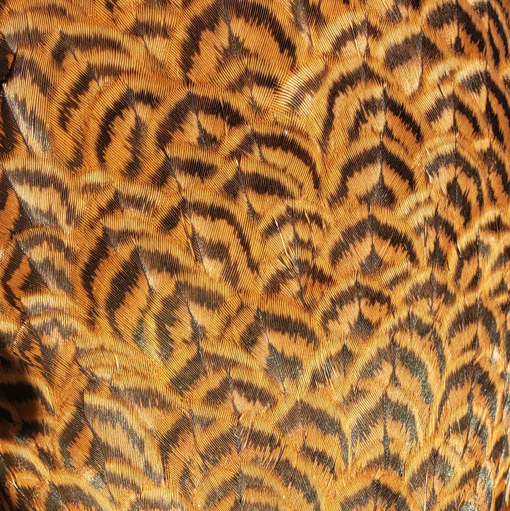

*self-similarity*

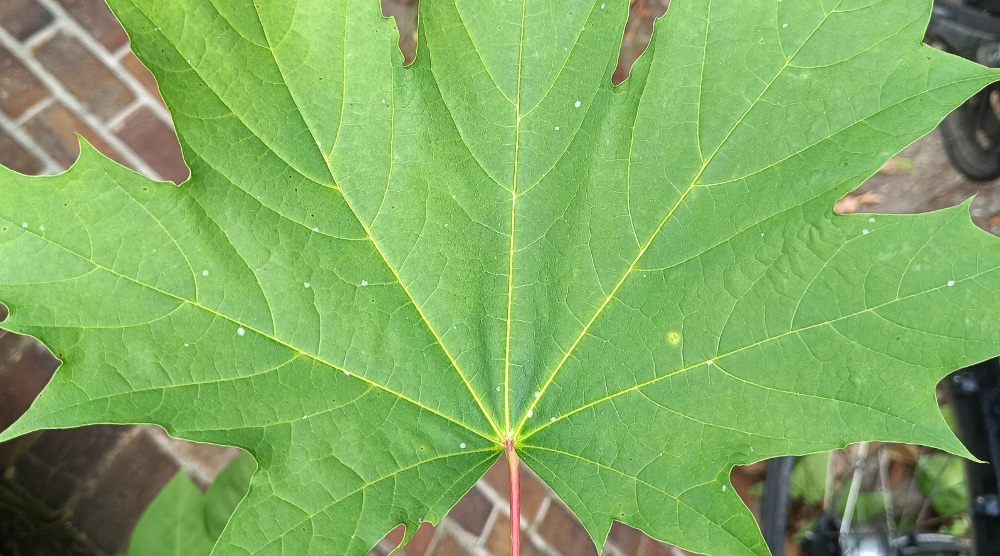

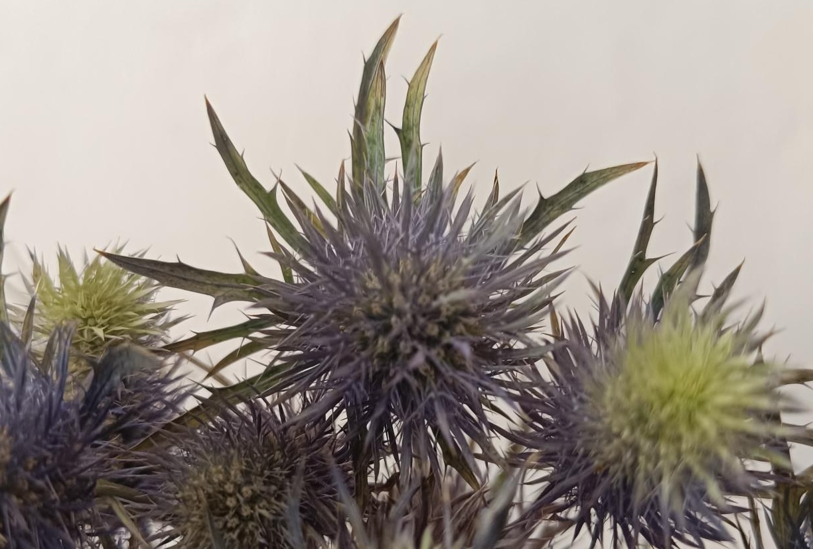

**artificial**
*carpet pattern*

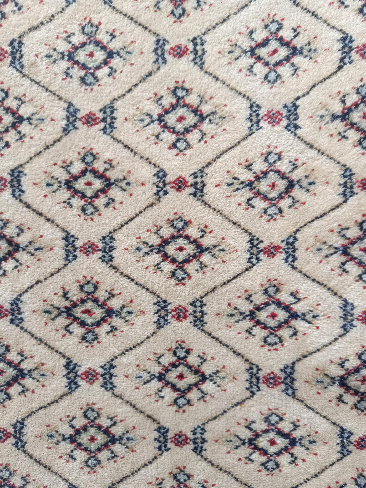

### Task 01.03 - Designing Patterns - 3 Points

Create a visual pattern yourself. The pattern must be repetitive - and hand-drawn! It can either be abstracted (CTech) or realism oriented (VFX) or both.
Give pseudo code for its creation algorithm.

*Submission*: Link at least one preview image and give your pseudo code in your submission file.  

### Task 01.04 - Seeing Faces - 1 Point

As an exercise to see and understand the environment around you (and to have some fun 😊), try to find at least two faces.  

[Image sources left to right, top to bottom: [1](https://www.google.com/imgres?imgurl=https%3A%2F%2Fpbs.twimg.com%2Fprofile_images%2F378800000719377900%2F45f6f5459fe0d5678de052e8741700d0_400x400.jpeg&imgrefurl=https%3A%2F%2Ftwitter.com%2Ffacespics&docid=JoT1wUHfRfTWbM&tbnid=x30M4EKn_ft1wM%3A&vet=10ahUKEwisyqXc27_hAhXGJlAKHXNpArEQMwg_KAAwAA..i&w=400&h=400&bih=915&biw=1680&q=faces%20in%20things&ved=0ahUKEwisyqXc27_hAhXGJlAKHXNpArEQMwg_KAAwAA&iact=mrc&uact=8#h=400&imgdii=PorYURvb5HYYdM:&vet=10ahUKEwisyqXc27_hAhXGJlAKHXNpArEQMwg_KAAwAA..i&w=400), [2](https://www.themarysue.com/things-that-look-like-faces-pareidolia/), [3](https://www.themarysue.com/things-that-look-like-faces-pareidolia/), [4](http://www.abovetopsecret.com/forum/thread1159632/pg1), [5](https://lockerdome.com/buzzfeed.com/6814745186674964), [6](https://twitter.com/FacesPics/status/1086717380837953536), [7](https://laughingsquid.com/faces-in-things-funny-photos-of-objects-that-appear-to-have-faces/), [8](https://twitter.com/facespixx)]

*Submission*:

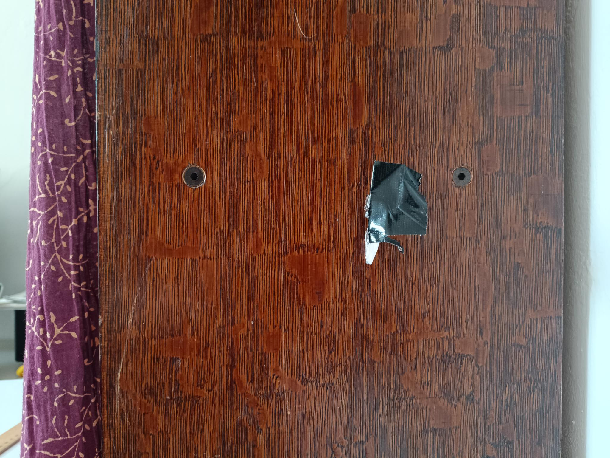

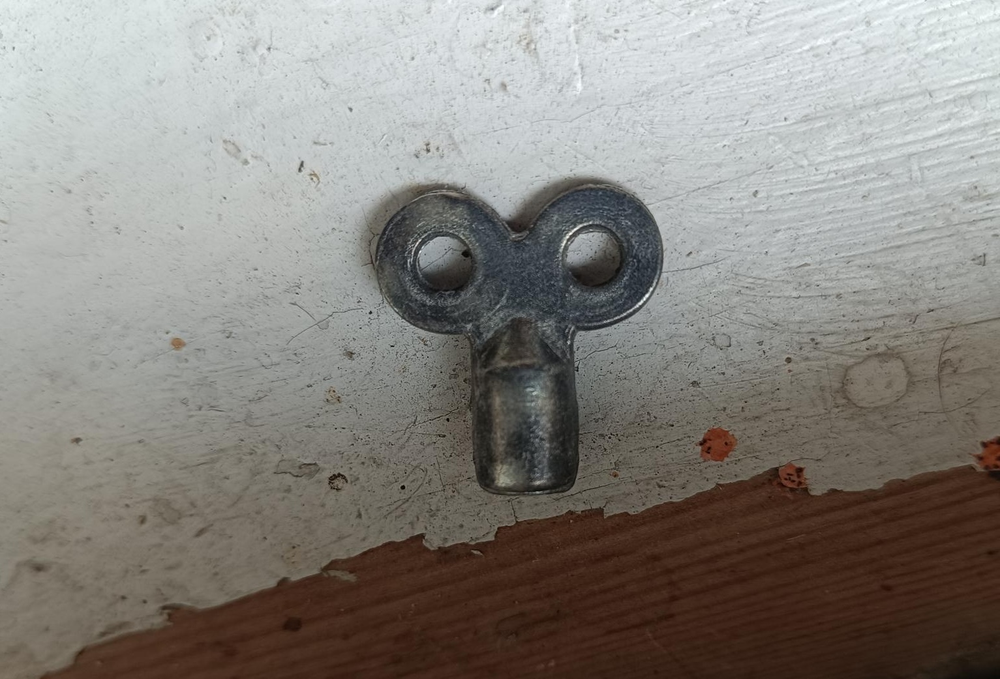

*not exaclly it, but almost:*

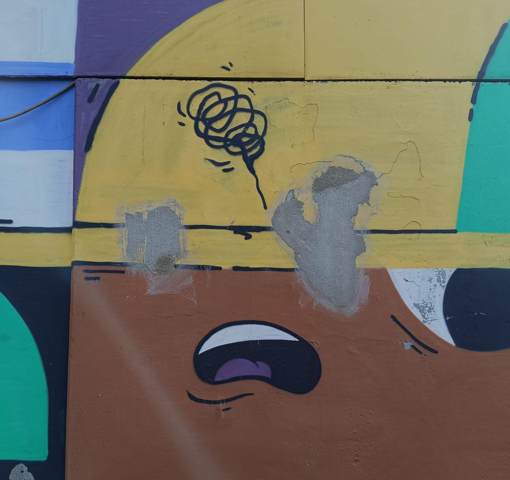

### Task 01.05 - Painting - 2 Points

Choose one "traditional" and analog painting that is inspirational to you. The image can come from the [script](../../02_scripts/pgs_01_intro_script.md#abstraction-in-art) or you can refer to any artist or image you like. It can either be abstracted (CTech) or realism oriented (VFX).

Explain briefly what you like about the painting and how it might inspire you for your own work.

*Submission*: Answer in your  submission file and link all images there.  

**Combat, Lee Krasner, 1965**

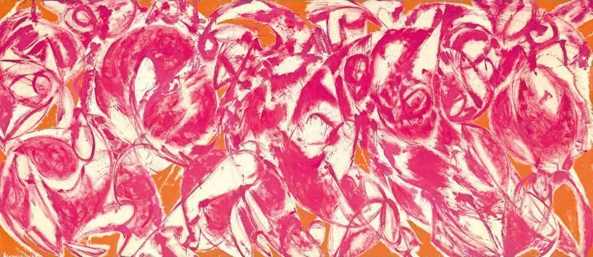

What I really like about Lee Krasner's painting Combat is the dynamic balance between chaos and a soft structure. The shapes in the painting seem random, yet they complement each other perfectly. This tension, together with the colors, gives me a feeling of awakening and harmony at the same time.

The movement in the image captures a snapshot of an unfinished process. It could inspire my work to experiment with chaos and structures of order, and to explore what fluid transitions between them might look like. Since I have been working with real-time abstract renderings for quite some time, I have repeatedly encountered the challenge of using technical tools to create a dialogue between fluid, gentle movements and mathematical patterns. Where is there room for randomness, and where are orderly reference points needed to make an image visually interesting and tangible?

### Task 01.06 - Artistic Expression in CGI - 2 Points

Choose one CG image, which you like and of which you think that it has an artistic quality to it (also here, it can be realistic and in a VFX context). The image doesn't need to be from the script, again you can choose any CGI image you like (it should use 3D graphics). You can find more examples in the [Summary of Artists](../../02_scripts/pgs_01_intro_script.md#summary-of-artists) section.  

Explain briefly what you like about the image and why you consider it to be artistic. 

*Submission*: Answer in your submission file and link all images there.  

## Unreal Engine

### Task 01.07 - Unreal Documentation & Getting Started - 7 Points

One of the most crucial aspects of learning and working with a new environment, in our case Unreal, is being able to work with its documentation. [Unreal's documentation](https://dev.epicgames.com/documentation/unreal-engine/unreal-engine-5-7-documentation?lang=en-US) is fairly good but a bit unstructured in my opinion. In general, I do recommend to always work as much as you can with the official documentation before turning to resources and tutorials from others. For the latter there is no quality control, while for content in the official documentation you can expect it to be correct.

For this task, no matter your level, pick one or more chapters in [Unreal's documentation](https://dev.epicgames.com/documentation/unreal-engine/unreal-engine-5-7-documentation?lang=en-US) that you don't know yet and learn that topic.

If you are completely new to Unreal, the goal of this task is that you get familiar with Unreal and its interface. Specifically in the documentation, I recommend that you work through:
* [Install Unreal Engine](https://dev.epicgames.com/documentation/unreal-engine/install-unreal-engine)
* [Create your First Project in Unreal](https://dev.epicgames.com/documentation/unreal-engine/create-your-first-project-in-unreal-engine)
* [Unreal Editor Interface](https://dev.epicgames.com/documentation/unreal-engine/unreal-editor-interface)
* [Viewport Controls](https://dev.epicgames.com/documentation/unreal-engine/viewport-controls-in-unreal-engine)
* [Viewport Toolbar](https://dev.epicgames.com/documentation/unreal-engine/viewport-toolbar)
* [Content Browser](https://dev.epicgames.com/documentation/unreal-engine/content-browser-in-unreal-engine)
* [Projects and Templates](https://dev.epicgames.com/documentation/unreal-engine/working-with-projects-and-templates-in-unreal-engine) (without the templates)
* [Levels](https://dev.epicgames.com/documentation/unreal-engine/levels-in-unreal-engine)
  
*Hint:* Make sure to plan in a bit of time for the installation of Unreal (~ 10GB) as it takes a while.

We also have a collection of tutorials and resources for you in the [Unreal script](../../02_scripts/pgs_02_unreal_script.md), e.g. [First Steps Tutorials](../../02_scripts/pgs_02_unreal_script.md#first-steps-tutorials). You can additionally pick a tutorial there, or choose your own one online but this is up to you.
  
You have to submit at least one preview image of the scene that you worked on (for now, screenshots are just fine). If you are a beginner, the image can be a really simple scene, and be completely unpolished. If you are more advanced, I recommend that you polish your scene and image (also depending on the topic you chose to learn and whether it includes visual design). Consciously constructing an image and polishing it somewhat is always good practice.
  

*Submission*: Links to the documentation pages you worked through and at least one preview image, linked in your submission file.  

**tutorial** 

For the very beginning, I did the Unreal Starter Tutorial which appears after starting the program:

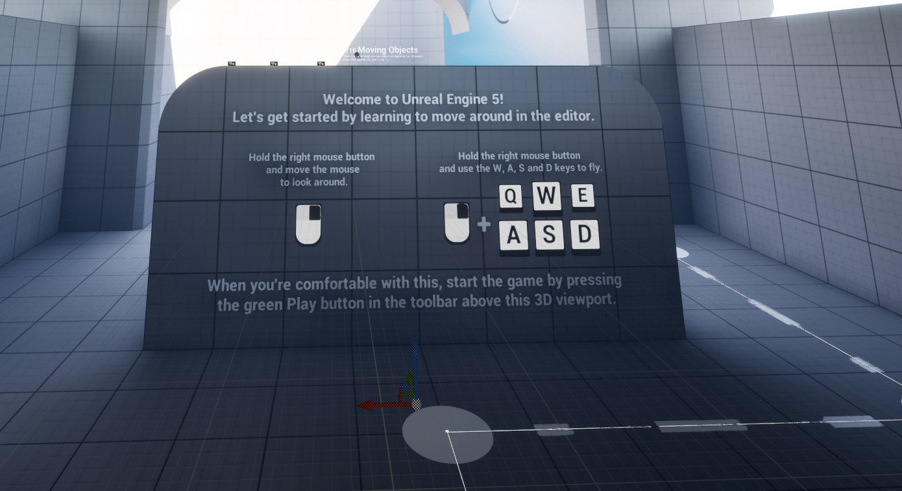

**scene** 

I worked through this documentation page: [Audio Synesthesia Plugin](https://dev.epicgames.com/documentation/unreal-engine/audio-synesthesia-in-unreal-engine?lang=en-US)

And this turorial on youtube [tutorialReactive Audio Tutorial (Audio Visualisers) | Unreal Engine](https://www.youtube.com/watch?v=nTCboJrkI8o)

My plan was to make this sphere audioreactive. I recreated the actor class, but I couldn't get it to work without errors because I lack the necessary knowledge of the engine. The goal was a bit too ambitious for a beginner, but I'll fix it in the future.

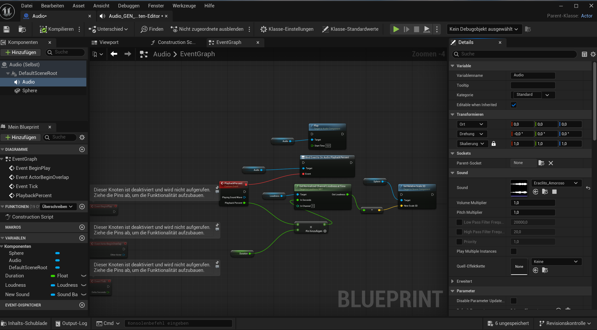

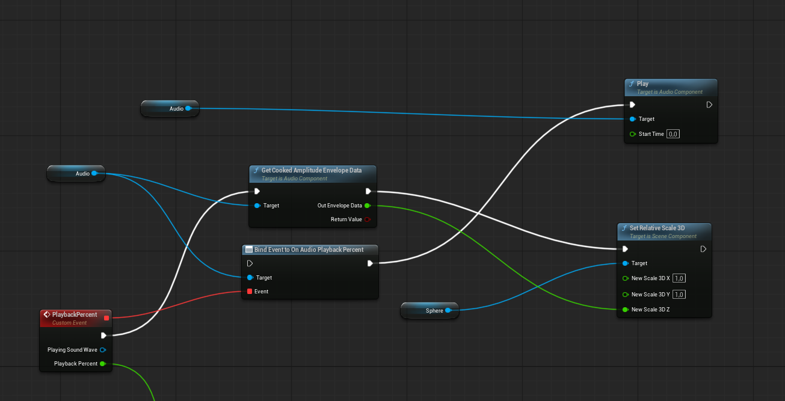

## Learnings

### Task 01.08 - 3 Points

Summarize your learnings in whole sentences. What was challenging for you in this session? How did you challenge yourself?

*Submission*: Answer in your markdown submission file.  

**Unreal Enginge**

I do not have any experiences whith Unreal Engine yet, besides that I downloaded it once, because I thought I maybe want to step into it. The reason it didn't work out was that I didn't have enough storage space on my laptop.
So I went from 0 here again and I got a better understandig of the main functionality of the Engine. Unlike Blender or other common 3D animation programs I've worked with, it has this real-time component. As a game engine, it offers interactive events and interactions. I skipped through the "Erste Schritte" documentation pages [Erste Schritte](https://dev.epicgames.com/documentation/unreal-engine/get-started).

I learned about creating different project types or using an prebuild scenes (first-person, third-person), to navigate in my project and basic editing like adding objects and furthermore moving, scaling and rotating them. In the beginner turorial I also had a look at basic material parameters (colors, metallic etc.) and physics of objects (particles, collisions). I steped through the interface, tools and project browsers but I still do feel quite new and inexperienced there.

Without any more knowledge I learned how to add audio files and plugins when I went through the Audio Synesthesia NRT Documentation ([Audio Synesthesia](https://dev.epicgames.com/documentation/unreal-engine/audio-synesthesia-in-unreal-engine?lang=en-US)). I created an Actor Blueprint for the first time and got roughly familiar with the assets browser, construction skript and the event editor and their functionality. In some way I felt quite confortable here because I worked with nodes, but I quickly reached my limits when it comes to really implement them and understand the realtions between the construction skript and event editor and how I finally run my idea in the project. So I definitly challenged me here by trying to figure out my problem, researching for tutorials or understanding the Audio Synesthesia chapter.

Besides my hands on practice, I also experienced the Unreal Enging documentation as not very clear or a bit overloaded, which, of course, may also be due to my beginner starter point.

**Patterns**

I really had a lot of fun with looking out for patterns and faces. The assignments helped me establish a visual connection to the outside world. They also reminded me of one of my first assignments in my bachelors program, where we were asked to photograph structures and abstract them into a pattern in 5 to 10 steps, starting with a fineliner copy on a transparent paper. 

I noticed that I actually have a lot of patterns in my room and even if I do not get all the maths by heart behind it I would like to explore this further and maybe include it in my final submission.