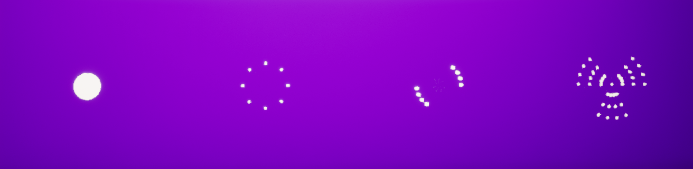
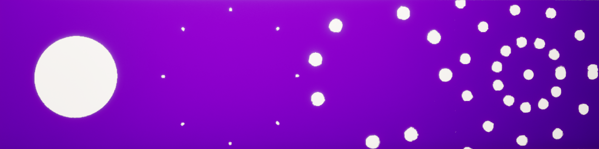
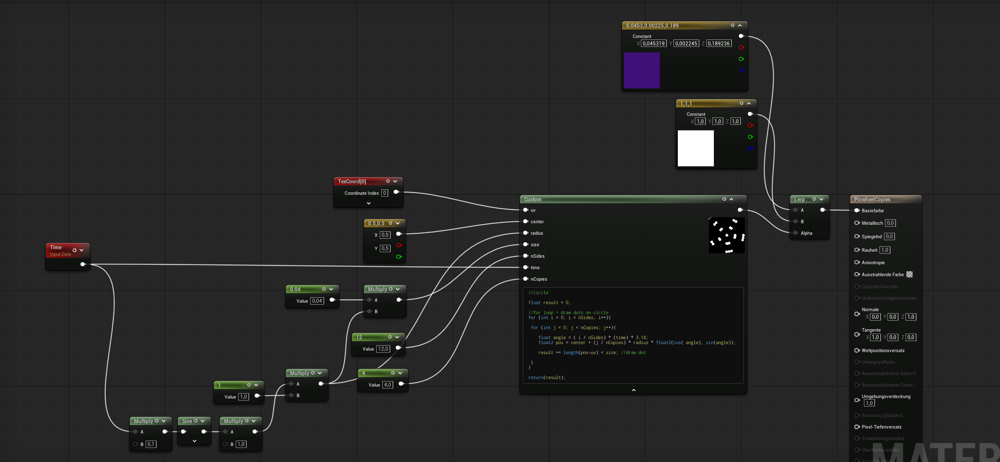
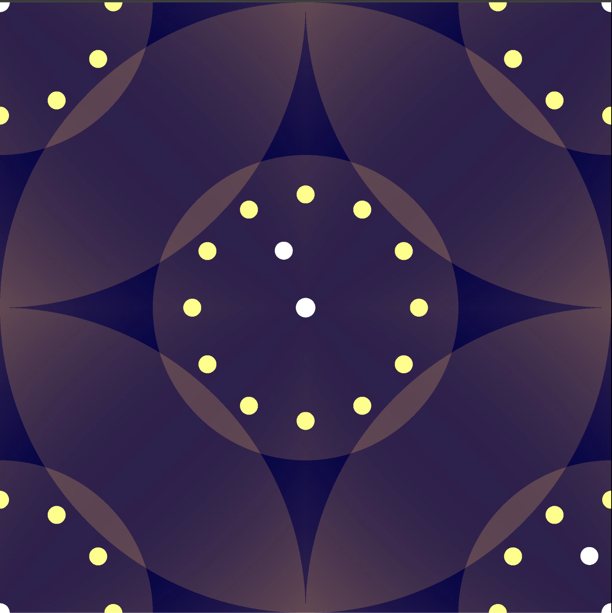
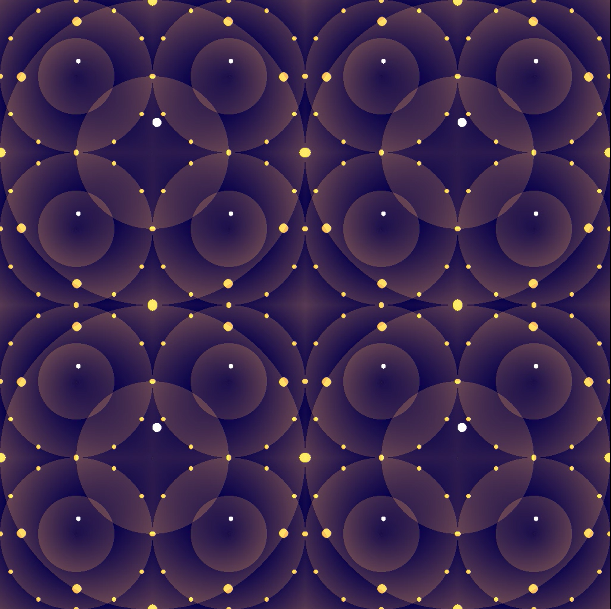
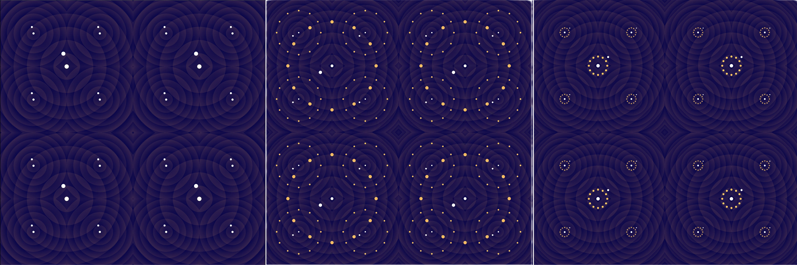
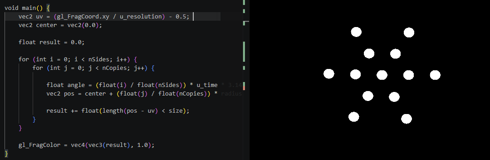
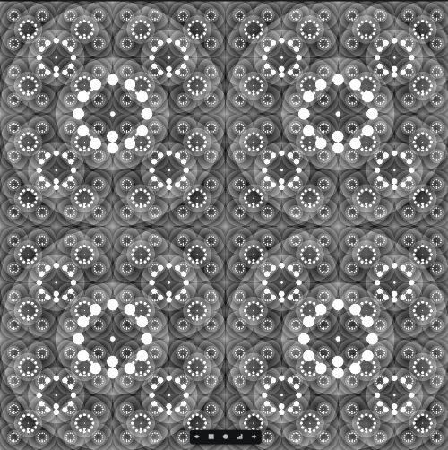

**Procedural Generation and Simulation**  

Prof. Dr. Lena Gieseke \| l.gieseke@filmuniversitaet.de  

---

# Session 02  - 20 Points

This session is due on **Wednesday, June 17th** before class.

This assignment should take <= 6h. As this assignment is open-ended, it is up to you to manage your time.

* [Function Designs](#function-designs)
    * [Task 02.01 - Inspiration - 4 Points](#task-0201---inspiration---4-points)
    * [Task 02.02 - Function Design - 13 Points](#task-0202---function-design---13-points)
        * [GLSL Fragment Shader](#glsl-fragment-shader)
        * [Unreal Materials](#unreal-materials)
* [Learnings](#learnings)
    * [Task 02.03 - 3 Points](#task-0203---3-points)
* [How To Submit](#how-to-submit)
    * [CTech](#ctech)
    * [VFX](#vfx)

## Function Designs

* [Slides Function Designs](../../03_slides/pgs_03_functions_slides.html)
* [Script Function Designs](../../02_scripts/pgs_04_functions_script.md)  
  
*Please note the we haven't covered all topics in slides and script yet.*

### Task 02.01 - Inspiration - 4 Points

Go to the [shadertoy](https://www.shadertoy.com/browse) site and browse the examples a bit. Submit the link to at least one example you like (you don't have to understand the code). Think about *what* you like about the example and *why*. You don't have to write anything about that in your submission but be able to explain it in class.

*On a side note*: shadertoy code does not directly run within the glsl-canvas environment (see Task 2.2).

*Submission:* 

[ShaderToy: Warping - procedural 2 ](https://www.shadertoy.com/view/lsl3RH)

[ShaderToy: Infinite spider web ](https://www.shadertoy.com/view/fdt3zj)

### Task 02.02 - Function Design - 13 Points

Create a 2D pattern of your liking, e.g. the one you designed for the last homework by hand (Task 01.03) - but this is entirely up to you. The result should be polished. You can do this task either as fragement shader in VS Code or in Unreal as material.

Show different versions of the pattern by changing some parameters (sizing, colors, etc.), while maintaining the gist of the pattern.
  
With this task, I want you to practice **understanding and building individual function designs**. You are free to choose any design and environment you want, as long as it includes the building of a somewhat complex function, which has a visual outcome. Choose one environment you are interested in and which fits your overall learning path best (also feel free to learn both environments 😊). You can use the given start scenes and examples as basis. 

#### GLSL Fragment Shader

* If you are a beginner, see this [short introduction to GLSL with the glsl-canvas extension](./glsl/pgs_tutorial_glslintro.md).
* Examples: [start scene](./glsl/examples/functiondesign_startscene.glsl), [sin](./glsl/examples/sin.frag), [circle pattern](./glsl/examples/pattern_circles.glsl) (also see the [explanations in the script](../../02_scripts/pgs_04_functions_script.md#example-circle-pattern)), [kishimisu](./glsl/examples/kishimisu_commented_01.glsl)

#### Unreal Materials
* If you are a beginner, see this [short introduction to Unreal's material editor](./unreal/pgs_tutorial_materialsintro/pgs_tutorial_materialsintro.md).
* There are two example materials in the [Unreal Project `pgs_functiondesigns`](https://github.com/ctechfilmuniversity/lecture_ss26_procedural_generation_and_simulation/blob/main/docs/01_sessions/02_functions/unreal/pgs_functiondesigns.zip) (inside of the project in the `Content Browser` under `All/Content/pgs_functionsdesigns` -> level `LV_functiondesigns`)
    1. Function design with nodes in `M_pattern_circles_nodes`
    2. Function design with code (HLSL) in `M_pattern_circles_hlsl` .

 

*Submission:*

---

### Circle Practices

Before I created my final pattern I did some experiments to get a better understanding of basic sine / circle function visualizations in Unreal Engine. For this I browsed several Tutorials on YouTube and followed along this one: [Unreal Engine 5 Tutorial – Technisches Shading – HLSL-Komplexe Formen mit For-Schleifen](https://www.youtube.com/watch?v=pF_5etchEvE)

I created four cubes with four materials to see the steps from a basic growing circle (left) to an rotating, almost 3D-locking, Pinwheel (right). This was more like a repetition of the content from class but it helped me to get a better understanding and also to get familiar with Unreal Engine materials. I experimented in the Node Tree especially with the Time node controlling size and radius parameters. 

**Node Tree example (Pinwheel, on the right side)**

**HLSL Code (simple cirlce)**

        //circle
        float result = 0;

        result = length(pos-uv) < size; //draw circle

        return(result);

**HLSL Code (Pinwheel)**

        //circle
        float result = 0;

        //for loop > draw dots on circle
        for (int i = 0; i < nSides; i++){

            for (int j = 0; j < nCopies; j++){

                float angle = ( i / nSides) * (time) * 3.14;
                float2 pos = center + (j / nCopies) * radius * float2(cos( angle), sin(angle));

                result += length(pos-uv) < size; //draw dot

            }
        }
        return(result);

---

### Pattern

[Patter GLSL File](code\0202_pattern.glsl) The pattern is interactive, so open up the GLSL File to get the whole experience! :) 

For my pattern I decided to switch to GLSL in VS Code, because I also wanted to learn GLSL anyways (for example to also integrate it for visuals in TouchDesigner). I got the feeling that it feels more intuitive for me to work directly with code in an editor without a 3D enviroment:

**variation 1**

**variation 2**

---

#### Process Insights:

**base:**

I started with the same logic from my Unreal Engine materials and converted the HLSL code from my material into GLSL code with the help of AI. I wanted to stick with the cicles and sin() function explorations. I also got my analog pattern from submission 01 as an inspiration ( [Analog Pattern](pgs_01_kleinhans.md), I added it late because I wasn't able to finish all the assignments in time before the first submission deadline due to illness).

**repetition:**

Once I had my circles visible in GLSL in the editor, I repeated them in a grid. I alsp experimented with dynamic parameters, for instance, changing sine functions over time and implemented a responsive resizing of the circles based on my mouse input. 

In my next step I wanted to add some more elements to each grid element, so I browsed ShaderToy for similar examples. I took a closer look at this code: [Spinning Circle Grid Shadertoy](https://www.shadertoy.com/view/lssyRH) I tried to implement the following code snippets for the center marker and the rotating light from the for-loop. Putting this together was a bit more timeconsuming than expected, because I initially tried, by mistake, to calculate the center of the diagram agin, just like in the ShaderToy code. However, this isn't necessary, because it can be solved using the existing grid with “tiledUV” (see code).

        //SNIPPET SHADERTOY
        // compute the center of the diagram
        vec2 center = vec2(spacingX * (float(i) + 1.0), spacingY * (float(j) + 1.0));
        x =  center.x + orbitR * cos(iTime );
        y =  center.y + orbitR * sin(iTime );
        vec2 bulb = vec2(x,y);
        if (length(uv - center) > encloserRadius + encloseR) {
            continue;
        } else if (length(uv - center) < centerRadius) {
            // frag intersects white center marker                   
            fragColor = vec4(1.0);
            return;               
        } else if (length(uv - bulb) < radius) {
            // intersects rotating "light"
            fragColor = vec4(uv,0.5+0.5*sin(iTime),1.0);
            return;
        }

        // IMPLEMENTED CODE IN MY FILE
        vec2 bulb = vec2(
            orbitR * cos(u_time), 
            orbitR * sin(u_time)
        );

        if (length(tiledUV - bulb) < size * orbitSize) {
            result += 1.0;
        }

        //pulsating center marker
        centerRadius = 0.008 + 0.008 * sin(u_time * speed * 150.0); 
        result += float(length(tiledUV) < centerRadius);
         
**ridges**

As a last step I added the ridges from the example file by adding it to my vec3 color:

    // ridges
    float d = length(tiledUV);
    d *= 4.0;
    d -= floor(d); // oder: d = fract(d * 4.0);

    result += d *0.2;

    (...) 
    vec3 color = mix(vec3(1.0, 0.6784, 0.3804), vec3(0.0275, 0.0, 0.2941), 1.0 - result);
    gl_FragColor = vec4(color, 1.0);

## Learnings

### Task 02.03 - 3 Points

Summarize your learnings in whole sentences. What was challenging for you in this session? How did you challenge yourself?

*Submission*: 

In this Session I worked for the first time with materials in Unreal Engine (which was more intuitive than working with actors in submission 01, because it is similar to Blender material nodes). Although I already have experience with nodes in TouchDesigner and Blender, the functionality or rather, the combination of scripts and nodes was new to me here. I learned how to create and edit HLSL scripts and furthermore, how to add inputs for the script node. 

I challenged myself by working in Unreal Engine, which I still feel not very comfortable with. Besides that, I wanted to work exclusively with the scripts and tutorials and without using AI. I did not manage all of the Pattern code without some help obviously, but I tried to go as far as possible which made me to understand the code better (at least in principle, not every bit of syntax). The syntax of GLSL / or GLSL in general feels complex and also looking at examples from shadertoy was still challenging. If I had include AI more in my process of course I would have archieve a more complex pattern in the scope of the submission. This way I spent a lot of time repeating how to draw a circle. I got a better feel for variable types and how to declare them syntax-wise, as well as working with for-loops again and to manage my tiled grid. One challenge was to apply my second for loop (for (int i = 0; i < nSides; i++)) to every single cell in this grid, which I solved using the fract() function.
Beyond that, I learned how to implement dynamic parameters, such as using mouse movement to influence the radius or size, and how to apply the sine function directly in code (sin(u_time)), similar to the sine and time nodes I had previously used in Unreal Engine.

Overall, all these experiments with circles have helped me gain a deeper understanding of the underlying logic behind concepts I'm already familiar with from TouchDesigner (e.g., circular and radial ramps). Even if the math behind still needs some time to be really understood by me :)

