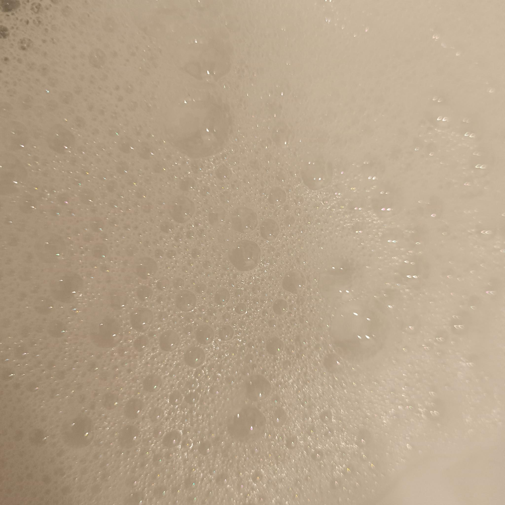
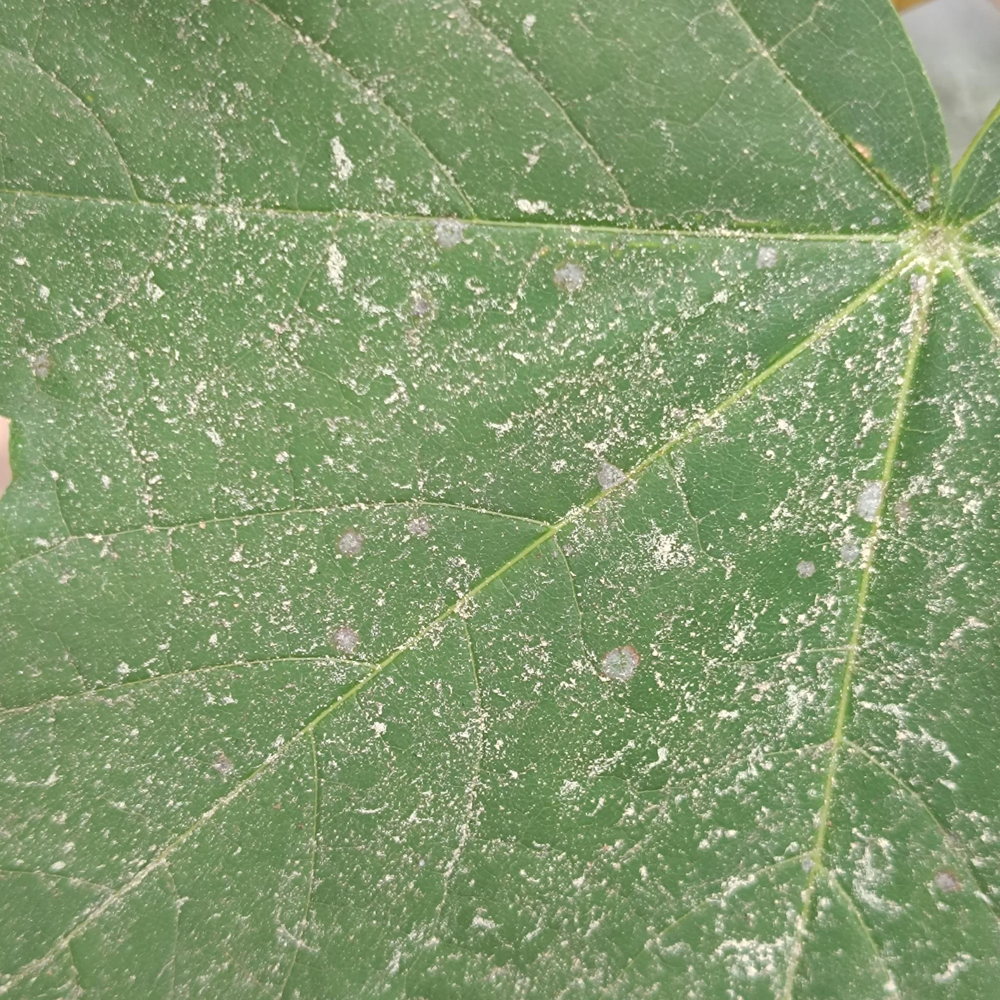
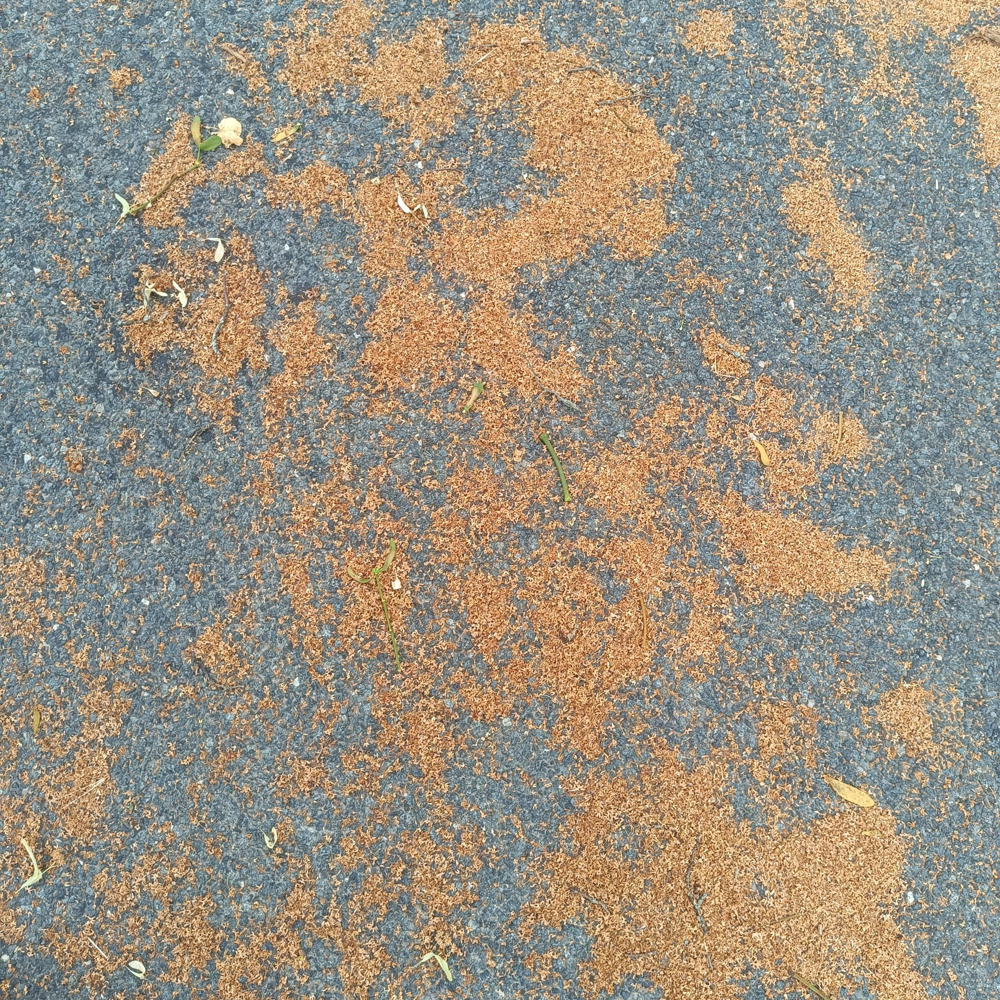
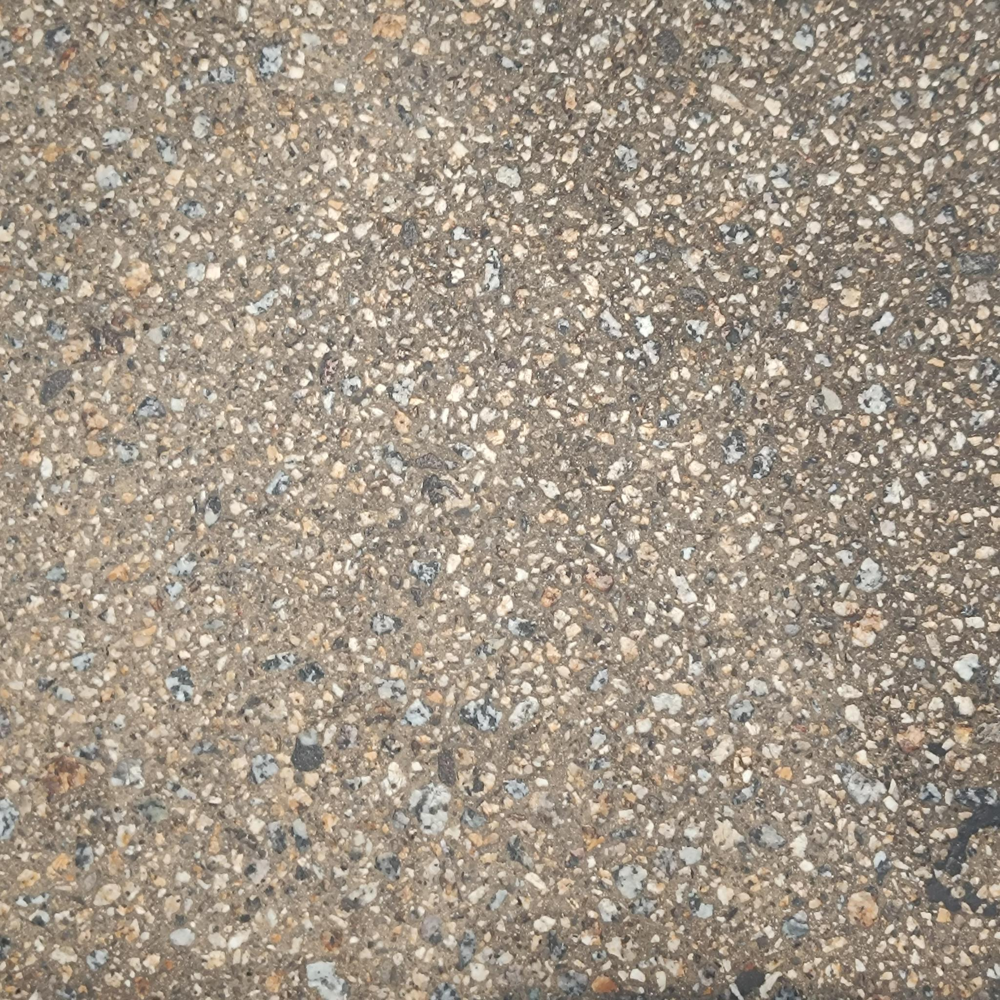
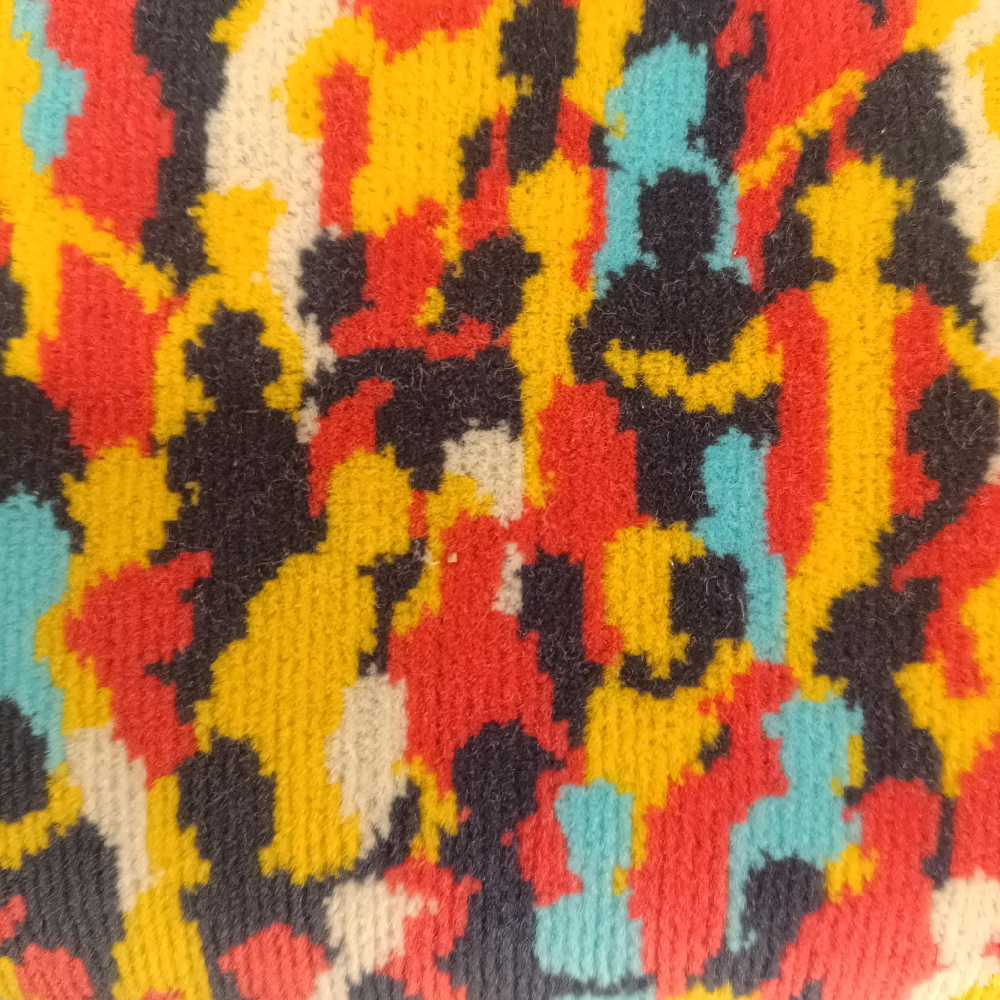
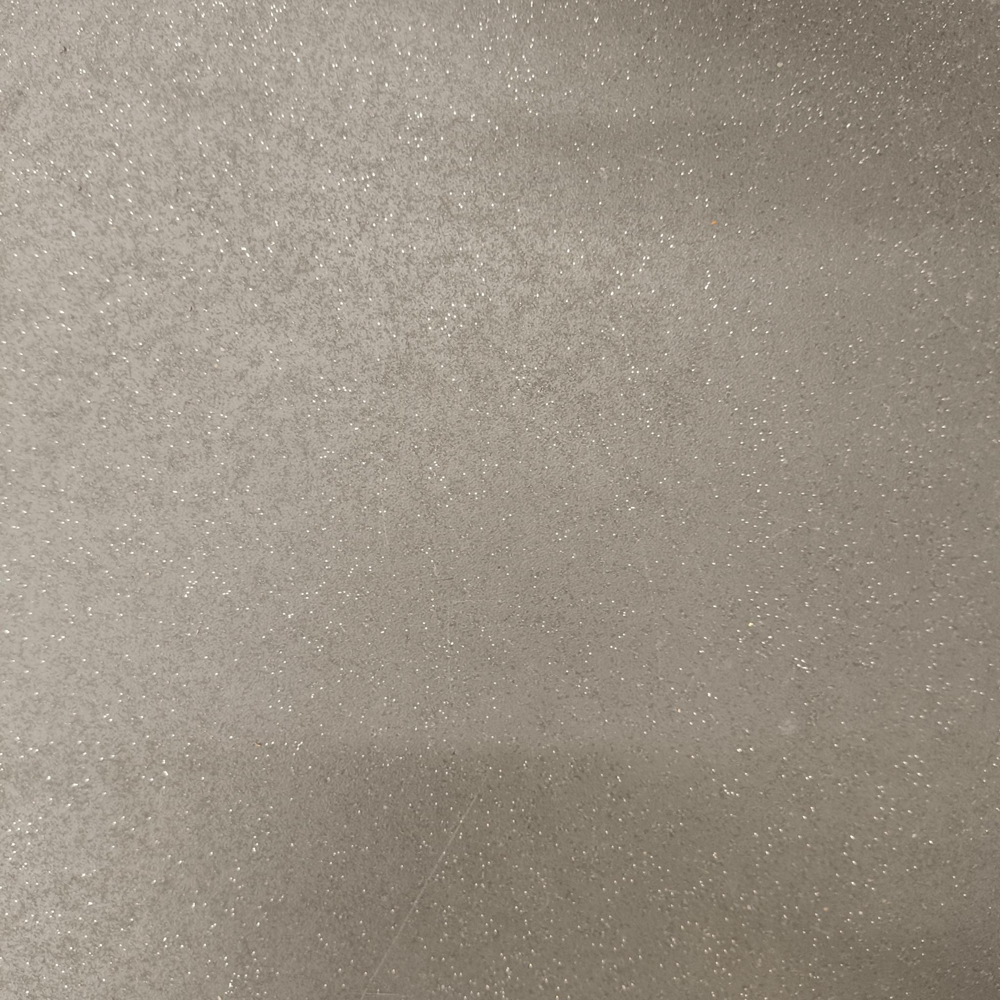
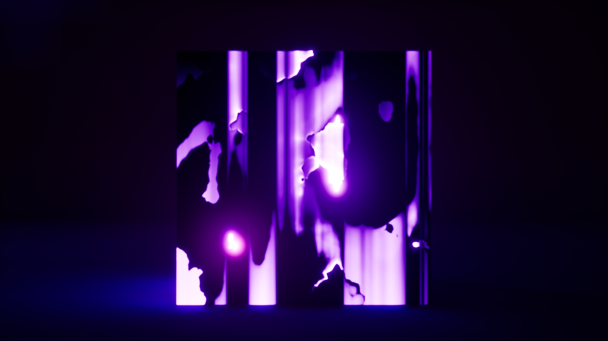

**Procedural Generation and Simulation**  

Prof. Dr. Lena Gieseke \| l.gieseke@filmuniversitaet.de  

---

# Session 04 - 20 Points

This session is due on **Wednesday, July 1st** before class.

This assignment should take <= 6h. As this assignment is open-ended, it is up to you to manage your time.

* [Task 04.01 - Collecting Inspiration - 3 Points](#task-0401---collecting-inspiration---3-points)
* [Task 04.02 - Randomness or Noise as Design Element - 14 Points](#task-0402---randomness-or-noise-as-design-element---14-points)
* [Learnings](#learnings)
    * [Task 03.03 - 3 Points](#task-0303---3-points)
* [How To Submit](#how-to-submit)
    * [CTech](#ctech)
    * [VFX](#vfx)

# Randomness

* [Chapter 06 - Noise](../../02_scripts/pgs_06_noise_script.md)

## Task 04.01 - Collecting Inspiration - 3 Points

* Submit at least three pictures of natural noise patterns. You can photograph them yourself (recommended) or find them on the internet.
* Submit one stylized / artistic image that uses noise as generating principle or design element. You can find it on the internet.

*Submission:* Link all images in your submission file.

*natrual*

*artificial*

## Task 04.02 - Randomness or Noise as Design Element - 14 Points

You can create any scene you like, with the only requirement that it features noise or some form of randomness. This can be a material, scattering, a dynamic solver, a particle system, or... You are allowed to follow a tutorial but you must modify the result to make it your own. Also, in the end, you must have a good looking result but it doesn't have to be a whole scene, it can be just a material or an actor etc.!

This tasks is as much about working with noise, as it is about creating a concept or finding a tutorial to follow and managing your time. Think small rather than big. Be creative about having limitations 😎.

*Submission:* 

watch my renderings here: [link to video](https://owncloud.gwdg.de/index.php/s/wONK6DxMdQ6XHXu)

## Learnings

### Task 03.03 - 3 Points

Summarize your learnings in whole sentences. What was challenging for you in this session? How did you challenge yourself?

*Submission*:

In this task, I challenged myself by switching back to Unreal Engine and exploring materials without following a fixed concept. As a starting point, I watched this tutorial [UE4 Flowing Noise Material tutorial](https://www.youtube.com/watch?v=ut80qnOtNRw) to get a feeling for how noise behaves within materials. Building on that foundation, I experimented with combining different noise and gradient maps (subtracting, adding, multiplying), and influenced parameters with sine functions over time to create a more dynamic and evolving result.
Along the way, I discovered how to use global texture coordinates to keep textures independent of perspective.

For my final project, I'd like to dive deeper into the topic of noise using GLSL code, since this submission teased my curiosity to explore the potential of randomness, particularly in combination with other elements in a context of plain code.

