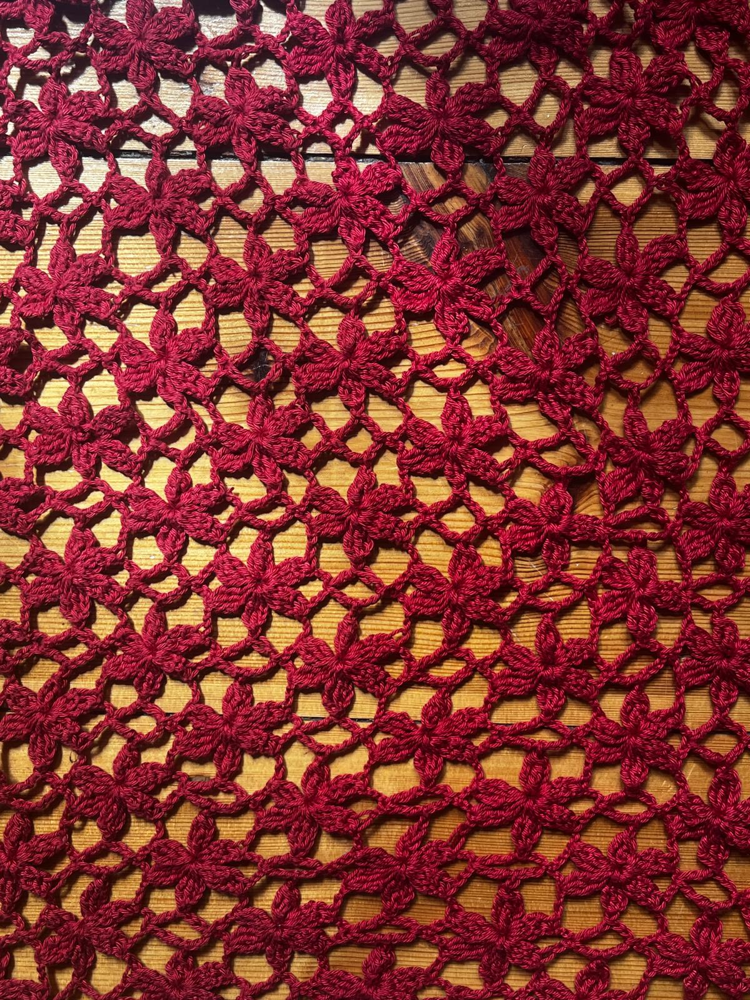
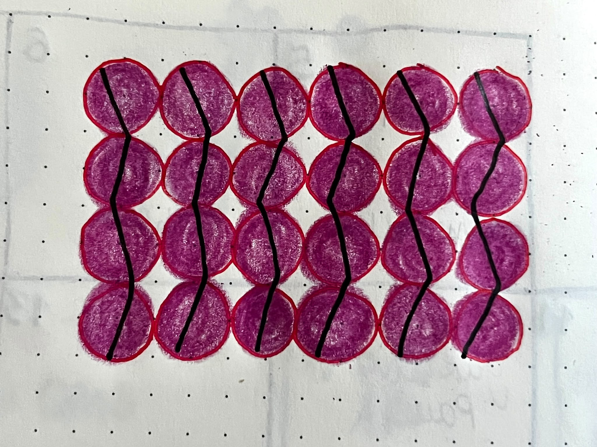
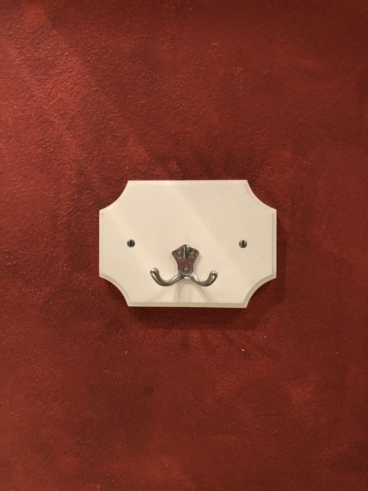
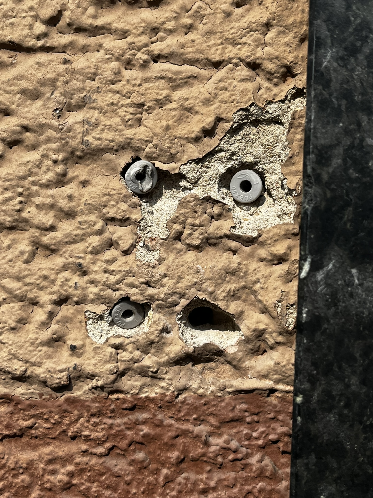
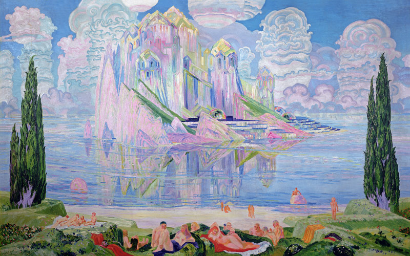
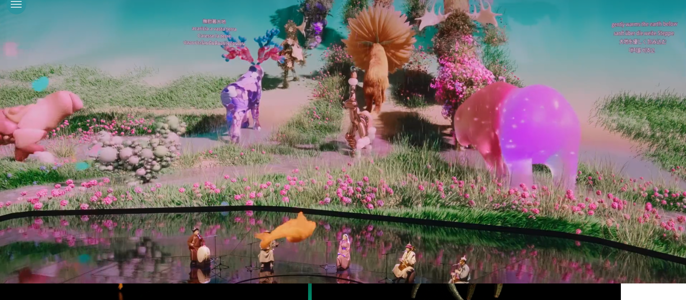
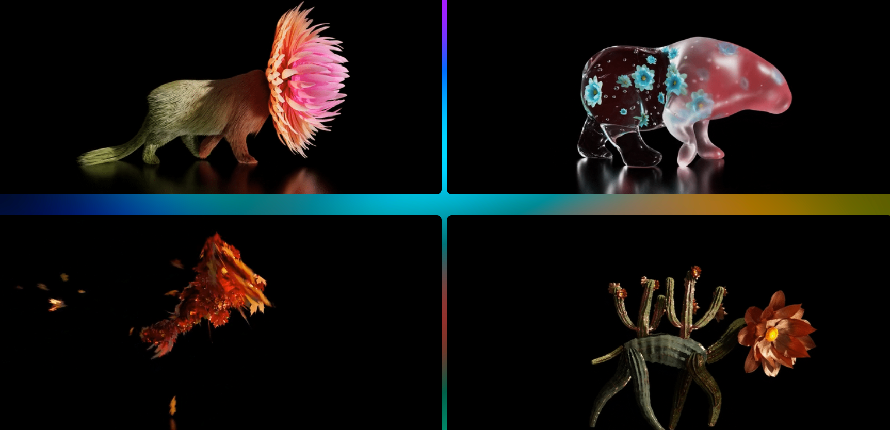
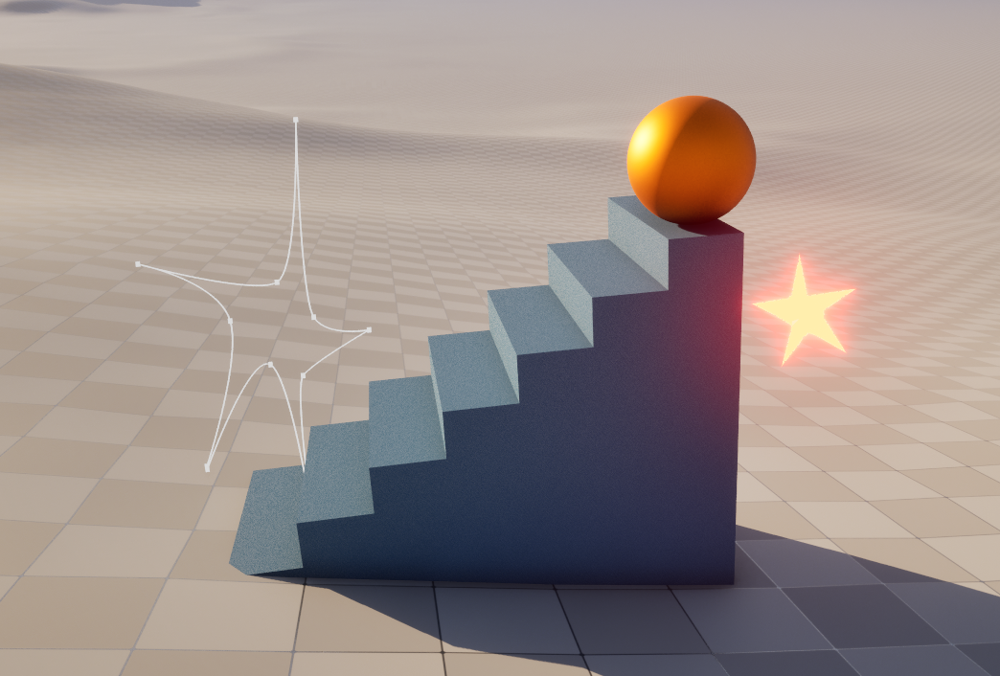

**Procedural Generation and Simulation**  

Prof. Dr. Lena Gieseke \| l.gieseke@filmuniversitaet.de  

---

# Session 01 - 20 Points

## Syllabus

### Task 01.01 - 1 Point

## Introduction

### Task 01.02 - Seeing Patterns - 1 Point

#### Crochet Pattern:

#### Natural pattern with self-similarity:

### Task 01.03 - Designing Patterns - 3 Points
#### Handdrawn Pattern:

#### Pseudo Code:

    for x from 0 to 5 do
    	for y from 0 to 3 do

	    Color other Color than background
	    draw circle at x, y

		    if y is even
		    	draw line tilted one way

		    else 
		    	draw line tilted the other way

		    End if
    	End for
    End for

### Task 01.04 - Seeing Faces - 1 Point

#### Clothes Hanger aka dog face:

#### Scres in wall aka shocked face:

### Task 01.05 - Painting - 2 Points

#### Wonder of the Sea - Wenzel Hablik 
(https://www.kunstkopie.de/a/hablik-wenzel/wonder-of-the-sea.html)

This painting resonated with me instantly. I like about it the combination of a realistic environment - people laying in the grass, going swimming - with the surreal crystalline structure in the water. The portrayed people seem unimpressed by their surrounding, like they are used to it. I however am impressed by the building, the clouds and the colors. It makes me reevaluate about the surroundings that I see everyday and am used too - and if these environment are not as magical as the one in the painting. 
What functions as inspiration is the combination of the ordinary and the surreal, the creation of a new reality that functions the same but slightly different then our known world.

### Task 01.06 - Artistic Expression in CGI - 2 Points

#### Ethereal - Universal Everything
https://www.universaleverything.com/experience-design/ethereal

This project I found when scrolling through the Artist Summary. It displays a surreal cgi nature world with animals behind a musical performance. The animals are made out of flowers, wood, stones and other nature elements. What I think is artistic about this project is the creation of a surreal yet coherent world.

## Unreal Engine

### Task 01.07 - Unreal Documentation & Getting Started - 7 Points

For Unreal Documentation I didn't have time to read carefully through the documentation or choose a topic, instead I tried to recreate one image to get a bit into modelling in the program.
The only documentation pages I looked through are:
https://dev.epicgames.com/documentation/unreal-engine/viewport-controls-in-unreal-engine
https://dev.epicgames.com/documentation/unreal-engine/unreal-editor-interface?application_version=5.7

This is the scene I worked on:

and the reference image:

## Learnings

### Task 01.08 - 3 Points

Even though I did my first term project in Unreal, I just know the basics of navigation, since I mostly did Blueprint Scripting in this project.
So for this Homework, I tried to do some modelling and creating materials. 
The most challenging part was to to not just "try" around since just doing anything is very managable with my existing skills in other programms but to follow the image that I had handdrawn before.
Also challenging for me was to write the pseudo code without the ability to test / run and see if it actually works.