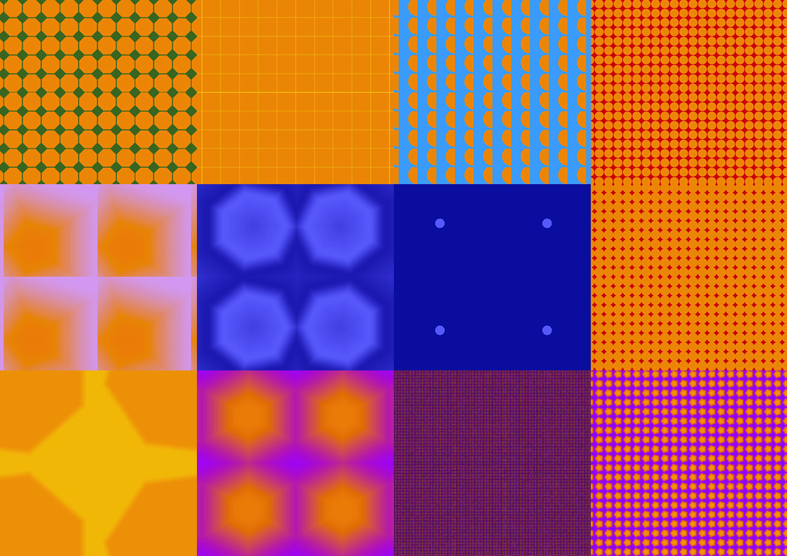

**Procedural Generation and Simulation**  

Nike Weber, 06/16/2026

 

# Session 02  - 20 Points

## Function Designs

### Task 02.01 - Inspiration - 4 Points

Hyperbolic Rainbows - nbardy: https://www.shadertoy.com/view/wtdcW4

I like that it's in constant morphing, without a clear beginning or end. The movement pulls you in and holds your gaze.

Fractal Land - Kali: https://www.shadertoy.com/view/XsBXWt

I like the complexity of the world and how it stays in constant motion while keeping the same distance from the sun. The camera movement also creates a nice illusion of a wave-like motion.

 

### Task 02.02 - Function Design - 13 Points
FInd my code [here](./function_design_weber.glsl).
 
I worked with GLSL in Visual Studio Code and first created patterns using different sided polygons and a grid.

Some examples: 

Videos of these pattern variations can be found here: https://owncloud.gwdg.de/index.php/s/iDKDtONgppUuihp

A second step was to add another mask / shape that influenced the pattern in the grid and to use mouse coordinates to move the shapes.

  <video src="./interactive_pattern.mp4" autoplay loop muted playsinline width="400"></video>

## Learnings

### Task 02.03 - 3 Points
In this session I focussed on understanding the code lines it takes to create a basic GLSL scene. I learned a lot through experimenting and changing the code over and over again. Sources were thebookofshaders.com and shadertoy.com. My learnings include 
- getting an overall understanding about the structure of GLSL, what is needed
- Understanding Coordinate Space and the concept of masks
- working with the grid and uniform variables like u_time and u_mouse
- animation with sin and time

I sometimes got lost inbetween trying to understand the code and create something visual interesting. In total I really enjoyed the small challenges I spontaneously set myself and the outcome.