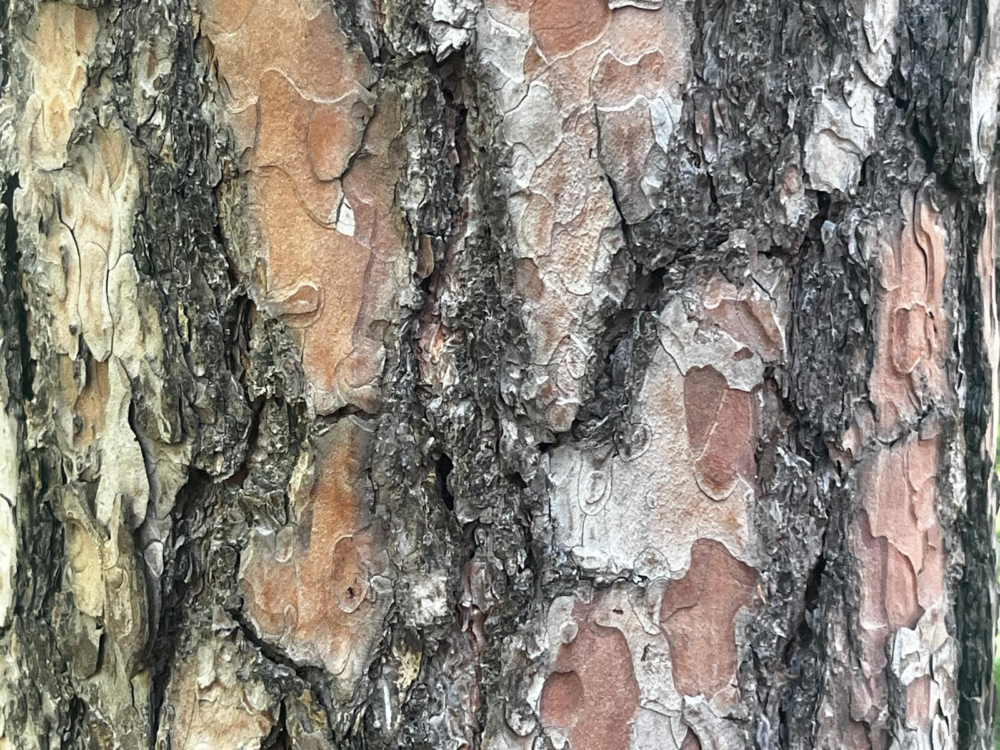
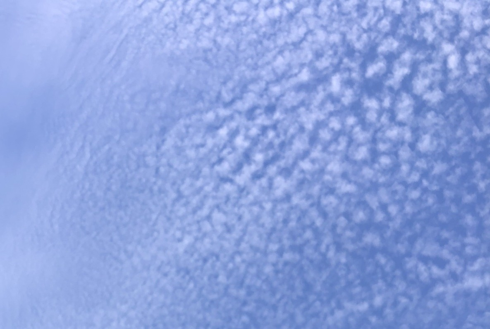
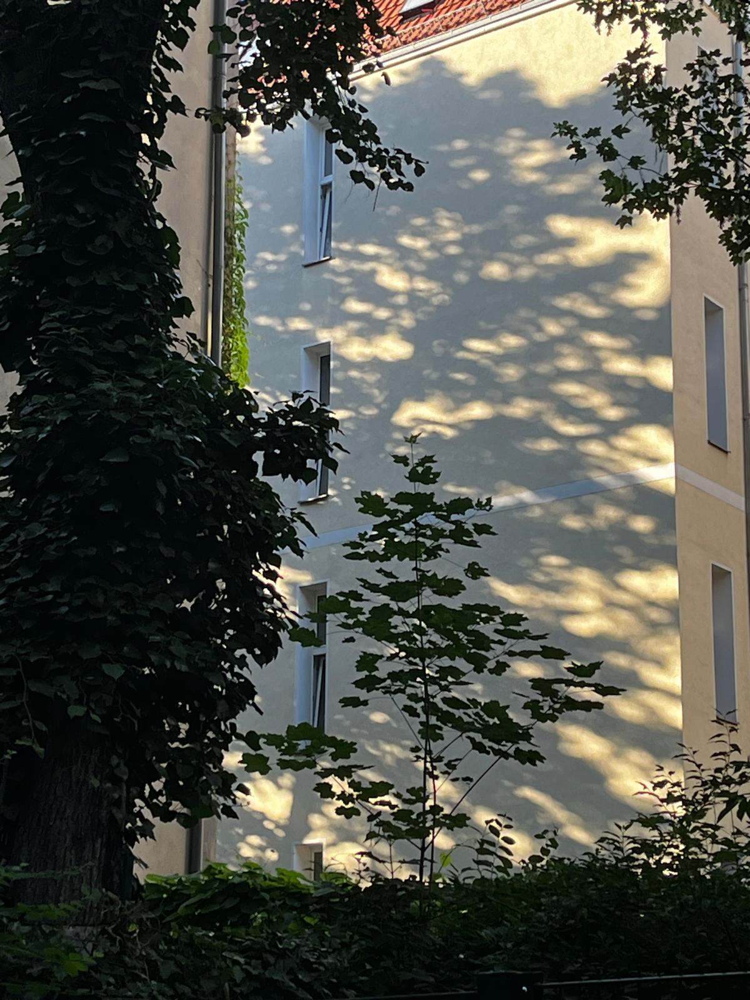
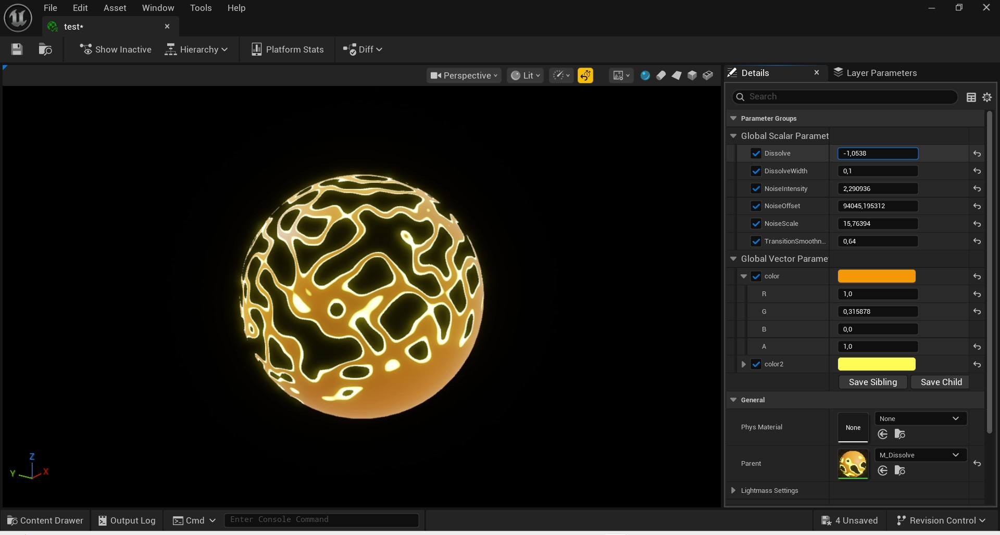
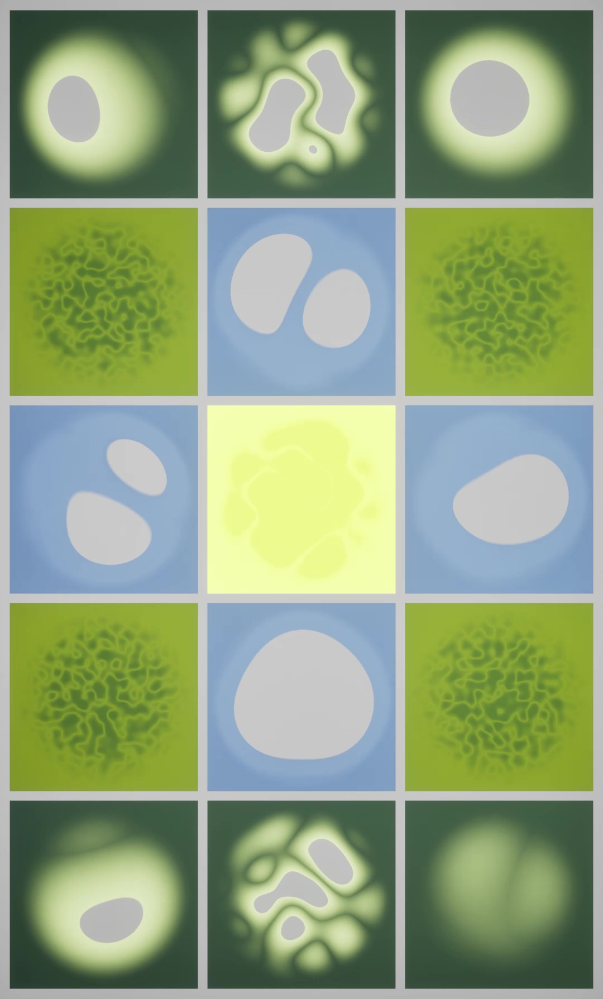

**Procedural Generation and Simulation**  

Nike Weber, 01.07.2026

---

# Session 04 - 20 Points

## Task 04.01 - Collecting Inspiration - 3 Points 

### Natural Noise

Treebark:

Clouds:

Sunspots on Facade:

### Artistic Noise

* Submit one stylized / artistic image that uses noise as generating principle or design element. You can find it on the internet.

## Task 04.02 - Randomness or Noise as Design Element - 14 Points

I chose this tutorial (https://www.youtube.com/watch?v=A2bVwQ0KMzY) to create a material that seems to dissolve. What happens is that noise pattern drives an opacity mask, switching pixels on and off via a dissolve threshold. The tutorial works with two colors, one as a base color, one for glowing edges.

First I followed the tutorial, then I changed some things:

- Instead of a noise texture image, I used the noise node
- Besides the parameters Dissvole, DissolveWidth and Transitionsmooth that were used in the tutorial, created new inputs for the noise: Noise Scale, Noise Intensity and Noise Offset, to be able to create different looking objects from just one base Material
- turned every parameter (also the colors) into Parameters to be changed in the Instances
- added radial noise so that the dissolve has a direction

twitching the parameters:
https://owncloud.gwdg.de/index.php/s/EdwuyFWjad7Gld7

Through assigning the instances to planes and animate the Parameters in the Sequencer, my result looks like this:
https://owncloud.gwdg.de/index.php/s/H1HpRxB9WKQ3hJZ

## Learnings

### Task 03.03 - 3 Points

I gained more knowledge about features in Unreal: I understood how to create a base material and turn the variables into parameters that can be individually changed in the Material Instances. Also, I again learned to work with the Sequencer to animate not only the Transform Elements of objects, but actually the Material Parameters. For that I looked briefly into the graph editor and made myself familiar with the sequencer.
Regarding the concept creation, I started relatively good with following a very short tutorial and modifying some parts, then got stuck thinking about the overall visual output of the scene.  What helped me was layouting the scene 2D and then rebuilding it.

**Happy Randomizing!**
